# Introduction
{:.no_toc}

Measuring gene expression on a genome-wide scale has become common practice over the last two decades or so, with microarrays predominantly used pre-2008. With the advent of next generation sequencing technology in 2008, an increasing number of scientists use this technology to measure and understand changes in gene expression in often complex systems. As sequencing costs have decreased, using RNA-Seq to simultaneously measure the expression of tens of thousands of genes for multiple samples has never been easier. The cost of these experiments has now moved from generating the data to storing and analysing it.

There are many steps involved in analysing an RNA-Seq experiment. Analysing an RNAseq experiment begins with sequencing reads. These are aligned to a reference genome, then the number of reads mapped to each gene can be counted. This results in a table of counts, which is what we perform statistical analyses on. While mapping and counting are important and necessary tasks, today we will be starting from the count data and getting stuck into differential expression analysis using [limma-voom](https://genomebiology.biomedcentral.com/articles/10.1186/gb-2014-15-2-r29).

This is a Galaxy tutorial based on the [COMBINE R RNAseq workshop](http://combine-australia.github.io/RNAseq-R/06-rnaseq-day1.html) first taught [here](http://combine-australia.github.io/2016-05-11-RNAseq/).


> ### Agenda
>
> In this tutorial, we will deal with:
>
> 1. TOC
> {:toc}
>
{: .agenda}

# Mouse mammary gland dataset

The data for this tutorial comes from a Nature Cell Biology paper, [EGF-mediated induction of Mcl-1 at the switch to lactation is essential for alveolar cell survival](https://www.nature.com/articles/ncb3117) (Fu et al. 2015). Both the raw data (sequence reads) and processed data (counts) can be downloaded from Gene Expression Omnibus database (GEO) under accession number [GSE60450](https://www.ncbi.nlm.nih.gov/geo/query/acc.cgi?acc=GSE60450).

This study examines the expression profiles of basal stem-cell enriched cells (B) and committed luminal cells (L) in the mammary gland of virgin, pregnant and lactating mice. Six groups are present, with one for each combination of cell type and mouse status. Each group contains two biological replicates. We will first use the counts file as a starting point for our analysis. This data has already been aligned to the mouse genome. The tool [featureCounts](https://academic.oup.com/bioinformatics/article/30/7/923/232889) (Liao, Smyth, and Shi 2014) was used to count reads mapped to mouse genes from RefSeq annotation (see the Fu paper for details).

## Reading in the data

> ###  Hands-on: Data upload
>
> 1. Create a new history for this RNA-seq exercise
> 2. Import the mammary gland counts table and the associated sample information file.
>
>       To import the files, there are two options:
>       - Option 1: From a shared data library if available (ask your instructor)
>       - Option 2: From [Figshare](https://figshare.com/s/1d788fd384d33e913a2a)
>
>           > ###  Tip: Importing data via links
>           >
>           > * Copy the link location
>           > * Open the Galaxy Upload Manager
>           > * Select **Paste/Fetch Data**
>           > * Paste the link into the text field
>           > * Press **Start**    
>           {: .tip}
>           
>           You can directly paste:
>
>           ```
>           https://ndownloader.figshare.com/files/5057929?private_link=1d788fd384d33e913a2a
>           https://ndownloader.figshare.com/files/5999829?private_link=1d788fd384d33e913a2a
>           ```
>
> 3. Rename the counts dataset as `seqdata` and the sample information dataset as `sampleinfo` using the Pencil icon.
> 4. Check that the datatype is `tabular`.
>    If the datatype is not `tabular`, please change the file type to `tabular`.
>
>    > ###  Tip: Changing the datatype
>    > * Click on the pencil button displayed in your dataset in the history
>    > * Choose **Datatype** on the top
>    > * Select `tabular`
>    > * Press **Save**
>    {: .tip}
{: .hands_on}


Let’s take a look at the data. The `seqdata` file contains information about genes (one gene per row), the first column has the Entrez gene id, the second has the gene length and the remaining columns contain information about the number of reads aligning to the gene in each experimental sample. There are two replicates for each cell type and time point (detailed sample info can be found in file “GSE60450_series_matrix.txt” from the GEO website). The first few lines of the seqdata file are shown below.

TODO: add screenshot of seqdata 

The sampleinfo file contains basic information about the samples that we will need for the analysis today. See below.

TODO: add screenshot of sampleinfo

## Format the data

Let’s create a new file, `countdata`, that contains only the counts for the 12 samples i.e. we'll remove the gene length column. The sample names are also pretty long so we’ll shorten these to contain only the relevant information about each sample.

> ###  Hands-on: Format the counts data
>
> 1. **Cut** : Use the `Cut columns from a table` tool to *discard* the gene length column.
>      - File to cut: `seqdata`
>      - Operation: `Discard`
>      - List of fields: Select `Column:2`
>
> 2. **Replace Text** : Use the `Replace Text in entire line` tool to shorten the sample names in the counts table.
>      - File to process: `Cut on data N`
>      - Find pattern: `_B[A-Z0-9_]+`
>
> 3. Rename file as `countdata`. The file should look like below.
>
>    
{: .hands_on}

Let’s create a new file, `factordata`, that contains the groups information that we need for the limma-voom tool. We'll combine the cell type and mouse status columns in the sampleinfo file to make  a column with the 6 group names e.g. we'll combine the CellType `basal` with the Status `pregnant` to make the group name `basalpregnant`.

> ###  Hands-on: Format the sampleinfo data
>
> 1. **Merge Columns** : Use the `Merge Columns together` tool to merge the CellType and Status columns.
>      - Select data: `sampleinfo`
>      - Merge column: `Column: 3`
>      - with column: `Column: 4`
>
> 2. **Cut** : Use the `Cut columns from a table` tool to *keep* the two columns SampleName and CellTypeStatus.
>      - File to cut: `Merge on data N` (from above)
>      - Operation: `Keep`
>      - List of fields: Select `Column:2` and `Column:5`
>
> 3. Rename file as `factordata`. The file should look like below.
>
>    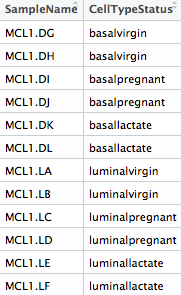
{: .hands_on}

## Get gene annotations

Optionally, gene annotations can be provided to the limma-voom tool and if provided the annotation will be available in the output files. We'll get gene symbols and descriptions for these genes using the Galaxy **annotateMyIDs** tool, which provides annotations for human, mouse, fruitfly and zebrafish.

> ###  Hands-on: Get gene annotations
>
> 1. **annotateMyIDs** : Use the `annotateMyIDs` tool to obtain gene symbols and descriptions.
>      - File with IDs: `countdata`
>      - File has header: `Yes`
>      - Organism: `Mouse`
>      - ID Type: `Entrez`
>      - Output columns: Tick `ENTREZID`, `SYMBOL` and `GENENAME`
> 2. Rename file as `annodata`. The file should look like below.
>
>    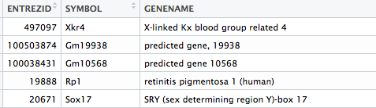
{: .hands_on}

## Differential expression with limma-voom

### Filtering to remove lowly expressed genes

It is recommended to filter for lowly expressed genes when running the limma-voom tool. Genes with very low counts across all samples provide little evidence for differential expression and they interfere with some of the statistical approximations that are used later in the pipeline. They also add to the multiple testing burden when estimating false discovery rates, reducing power to detect differentially expressed genes. These genes should be filtered out prior to further analysis.

There are a few ways to filter out lowly expressed genes. When there are biological replicates in each group, in this case we have a sample size of 2 in each group, we favour filtering on a minimum counts per million threshold present in at least 2 samples. Two represents the smallest sample size for each group in our experiment. In this dataset, we choose to retain genes if they are expressed at a counts-per-million (CPM) above 0.5 in at least two samples. The CPM threshold selected can be compared to the raw count with the CpmsVsCounts plots (see below).

> ###  More details on filtering
>
> The limma tool uses the `cpm` function from the edgeR library (M D Robinson, McCarthy, and Smyth 2010) to generate the CPM values which can then be filtered. Note that by converting to CPMs we are normalising for the different sequencing depths for each sample. A CPM of 0.5 is used as it corresponds to a count of 10-15 for the library sizes in this data set. If the count is any smaller, it is considered to be very low, indicating that the associated gene is not expressed in that sample. A requirement for expression in two or more libraries is used as each group contains two replicates. This ensures that a gene will be retained if it is only expressed in one group. Smaller CPM thresholds are usually appropriate for larger libraries. As a general rule, a good threshold can be chosen by identifying the CPM that corresponds to a count of 10, which in this case is about 0.5. You should filter with CPMs rather than filtering on the counts directly, as the latter does not account for differences in library sizes between samples.
{: .details}

### Specify Contrast(s) of interest

Since we are interested in differences between groups, we need to specify which comparisons we want to test. For example, if we are interested in knowing which genes are differentially expressed between the pregnant and lactating group in the basal cells we specify `basalpregnant-basallactate` for the *Contrast of Interest*. Note that the group names in the contrast must exactly match the names of the groups in the `factordata` file. More than one contrast can be specified using the `Insert Contrast` button, so we could look at more comparisons of the groups here, but first we'll take a look at `basalpregnant-basallactate`.

> ###  Hands-on: Differential expression with limma-voom
>
> 1. **limma** : Use the `limma` tool to perform differential expression analysis.
>      - Differential Expression Method: `limma-voom`
>      - Count Files or Matrix?: `Single Count Matrix`
>          - Count Matrix: Select `countdata`
>      - Input factor information from file?: `Yes`
>          - Factor File: Select `factordata`
>      - Use Gene Annotations?: `Yes`
>          - Factor File: Select `annodata`
>      - Contrast of Interest: `basalpregnant-basallactate`
>      - Filter lowly expressed genes?: `Yes`
>          - Filter on CPM or Count values?: `CPM`
>          - Minimum CPM: `0.5`
>          - Minimum Samples: `2`
>      - **Output Options** Additional Plots tick:
>          - Density Plots
>          - CpmsVsCounts Plots
>          - Box Plots
>          - MDS Extra
>          - MD Plots for individual samples
>          - Heatmaps (top DE genes)
>          - Stripcharts (top DE genes)
>      - **Output Options** Output Library information file?: `Yes`
{: .hands_on}

## Quality Control

Before we check out the differentially expressed genes, we can look at a few different plots to check that the data is good quality, and that the samples are as we would expect.

>    > ###  Question
>    >
>    > How many genes have been filtered out for low expression? 
>    >
>    >    > ###  Solution
>    >    >
>    >    > 11375 genes were filtered out as insignificant as they were without more than 0.5 CPM in at least 2 samples. This can be seen in the report as shown below.
>    >    >
>    >    >
>    >    >   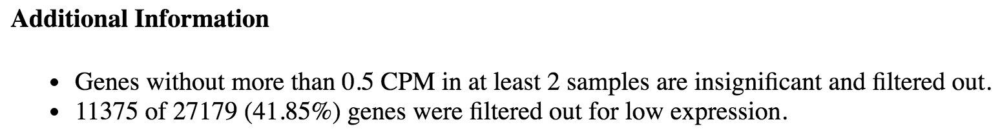{: width="750px"}
>    >    >
>    >    {: .solution}
>    {: .question}

### Filtering

Density plots can be output if filter on low count is applied, and these plots allow comparison of the counts distributions before and after filtering. The samples are coloured by the groups. Count data is not normally distributed, so if we want to examine the distributions of the raw counts we need to log the counts. We typically check the distribution of the read counts on the log2 scale. A CPM value of 1 is equivalent to a log-CPM value of 0 and the CPM we used of 0.5 is equivalent to a log-CPM of -1. It can be seen in the before filtering plot below that a large proportion of genes within each sample are not expressed or lowly-expressed and our filter of CPM of 0.5 (in at least 2 samples) removes a lot of these uninformative genes. 


We can have a look more closely to see whether our threshold of 0.5 does indeed correspond to a count of about 10-15 in each sample with the CpmsVsCounts plots. The plot for two of the samples is shown below.
 
>    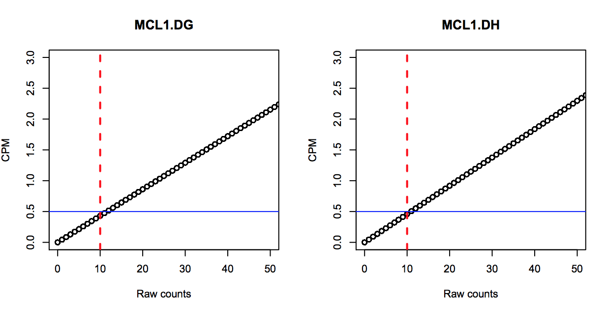
>   
>    > ###  Question
>    >
>    > Take a look at the CpmsVsCounts plots for all the samples. Does 0.5 CPM seem to be an appropriate threshold?
>    >
>    >    > ###  Solution
>    >    >
>    >    > Yes, from the plots 0.5 CPM is equivalent to ~10 counts in each of the 12 samples. These samples all have sequencing depth of ~20 million (see the library information file) so a CPM value of 0.5 here is ~10 counts.
>    >    >
>    >    {: .solution}
>    {: .question}

>    > ###  Tip
>    >
>    > * When in doubt, a threshold of 1 CPM in at least minimum group sample size is a good rule of thumb.
>    >
>    {: .tip}  
>

### Normalisation

By default, TMM normalization is performed to eliminate composition biases between libraries (Mark D Robinson and Oshlack 2010). This generates a set of normalization factors, where the product of these factors and the library sizes defines the effective library size. The edgeR `calcNormFactors` function calculates the normalization factors between libraries. TMM normalisation (and most scaling normalisation methods) scale relative to one sample. The normalization factors multiply to unity across all libraries. A normalization factor below one indicates that the library size will be scaled down, as there is more suppression (i.e., composition bias) in that library relative to the other libraries. This is also equivalent to scaling the counts upwards in that sample. Conversely, a factor above one scales up the library size and is equivalent to downscaling the counts. We can see the normalisation factors for these samples in the Library Size Information file we selected to output below.

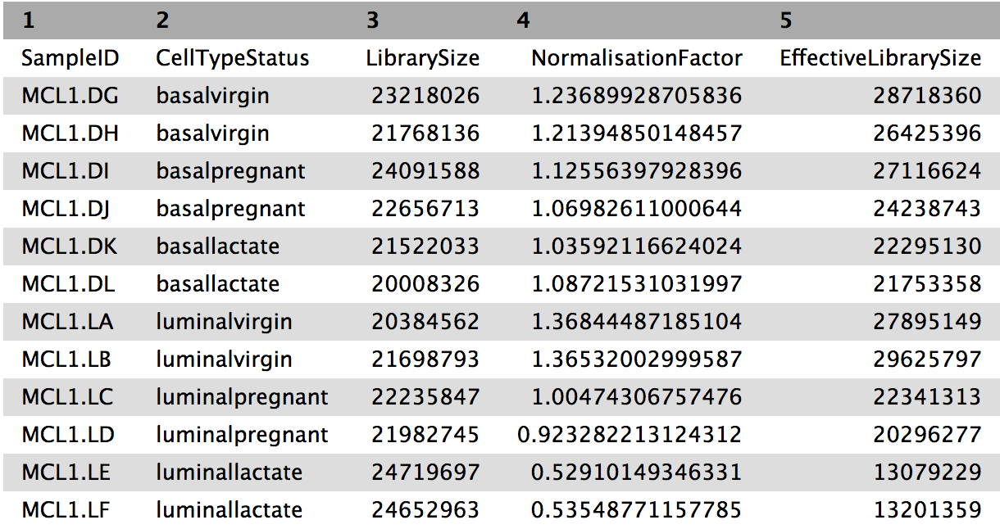{: width="600px"}

> ###  Question
>
> Which sample has the largest normalisation factor? Which sample has the smallest?
>    > ###  Solution
>    >
>    > MCL1.LA has the largest normalisation factor and MCL1.LE the smallest.
>    >
>    {: .solution}
{: .question}

We can also use boxplots to check the distributions. From the boxplots generated by the limma-voom tool we can see that overall the distributions are not identical but still not very different. If a sample is really far above or below the blue horizontal line we may need to investigate that sample further.

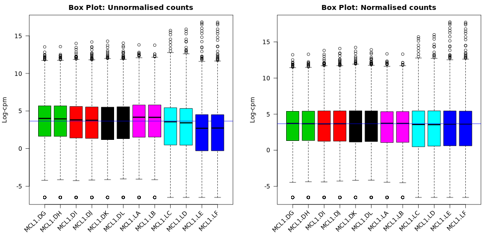

> ###  Question
>
> Compare the box plots before and after TMM normalisation. Can you see any differences? 
>
>    > ###  Solution
>    >
>    > After the normalisation more of the samples are closer to the median horizontal line.
>    >
>    {: .solution}
{: .question}

It is considered good practice to make MD plots for all the samples as a quality check, as described in the edgeR workflow article [here](https://f1000research.com/articles/5-1438/v2). These plots allow expression profiles of individual samples to be explored more closely. An MD plot shows the log-fold change between a sample against the average expression across all the other samples. This visualisation can help you see if there are genes highly upregulated or downregulated in a sample.
If we look at mean difference plots for these samples, we should be able to see the composition bias problem. The mean-difference plots show average expression (mean: x-axis) against log-fold-changes (difference: y-axis). 

> ###  Question
>
> Take a look at the MD plots for the two samples MCL1.LA and MCL1.LE. What do you notice about these samples? 
>
>    > ###  Solution
>    >
>    > The MD plots on the left below show the counts normalised for library size and the plots on the right show the counts after the TMM normalisation has been applied. MCL1.LA had the largest normalisation factor and was above the median line in the unnormalised by TMM box plots. MCL1.LE had the smallest normalisation factor and was below the median line in the box plots. These MD plots help show the composition bias problem has been addressed.
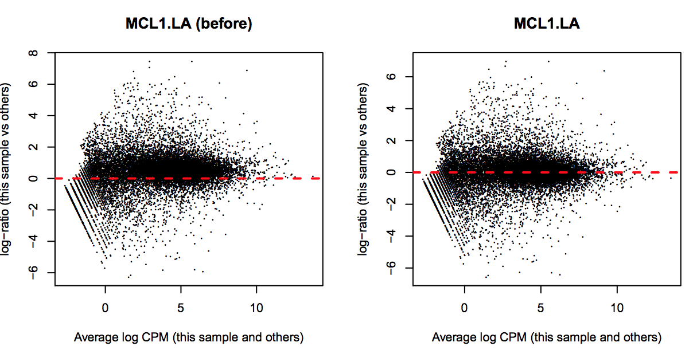
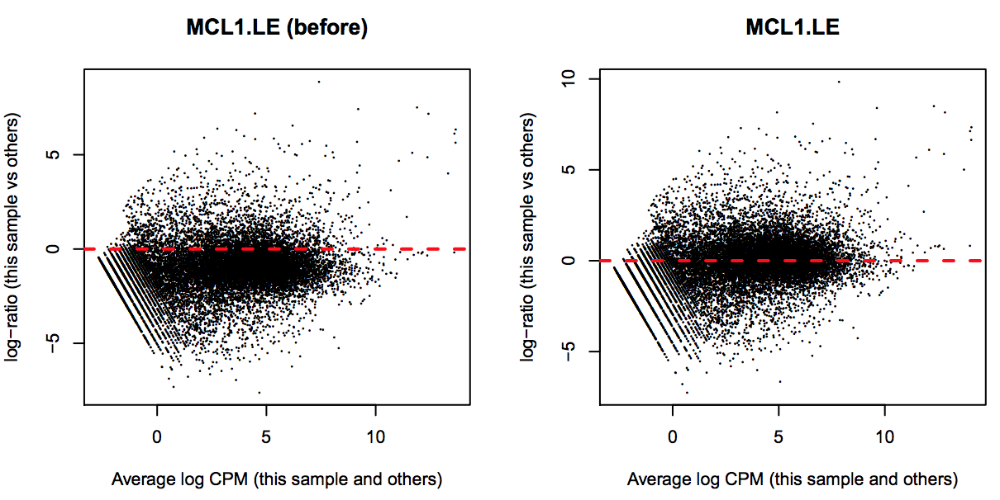
>    >
>    {: .solution}
{: .question}


### Multidimensional scaling plot

By far, one of the most important plots we make when we analyse RNA-Seq data are MDS plots. An MDS plot is a visualisation of a principal components analysis, which determines the greatest sources of variation in the data. A principal components analysis is an example of an unsupervised analysis, where we don’t need to specify the groups. If your experiment is well controlled and has worked well, what we hope to see is that the greatest sources of variation in the data are the treatments/groups we are interested in. It is also an incredibly useful tool for quality control and checking for outliers. With this tool a scree plot is also produced that shows how much variation is atributed to each dimension. If there was a batch effect for example, you may see high values for additional dimensions.

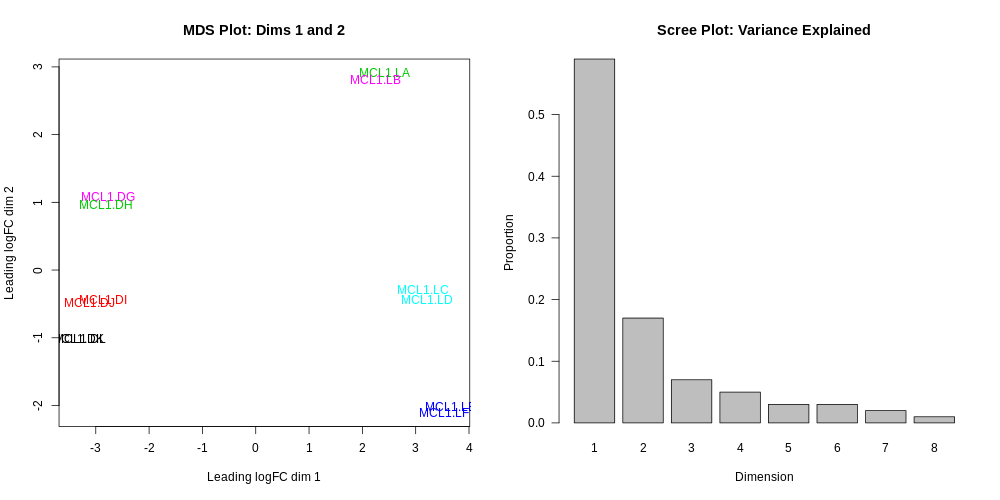

> ###  More details on MDS plots
>
> The distance between each pair of samples in the MDS plot is calculated as the leading fold change, defined as the root-mean-square of the largest 500 log2-fold changes between that pair of samples. Replicate samples from the same group cluster together in the plot, while samples from different groups form separate clusters. This indicates that the differences between groups are larger than those within groups, i.e., differential expression is greater than the variance and can be detected. In the MDS plot, the distance between basal samples on the left and luminal cells on the right is about 6 units, corresponding to a leading fold change of about 64-fold (2^6 = 64) between basal and luminal. The expression differences between virgin, pregnant and lactating are greater for luminal cells than for basal.
>
> Clustering in the MDS plot can be used to motivate changes to the analysis in light of potential batch effects. For example, imagine that the first replicate of each group was prepared at a separate time from the second replicate. If the MDS plot showed separation of samples by time, it might be worthwhile including time in the downstream analysis to account for the time-based effect.
>
> This tool plots the first two dimensions as a default (1 vs 2), however you can also plot additional dimensions 2 vs 3 and 3 vs 4 using under **Output Options** Additional Plots.
{: .details}
>
>
>    > ###  Question
>    >
>    > Look at the MDS plot coloured by group. Is there something strange going on with the samples? 
>    >
>    >    > ###  Solution
>    >    >
>    >    > Two samples don't appear to be in the right place. They have been mixed up. Import the correct sampleinfo file from `https://ndownloader.figshare.com/files/5999832?private_link=1d788fd384d33e913a2a` and redo the limma-voom analysis with the correct information.
>    >    >    >
>    >    >    > ###  Tip: Use the Rerun buton
>    >    >    >
>    >    >    > * Use the Rerun button in the History to redo the Merge and Cut steps on the corrected sampleinfo file.
>    >    >    >
>    >    >    {: .tip}  
>    >    >
>    >    > You should then see the correct MDS plot as below.
>    >    >  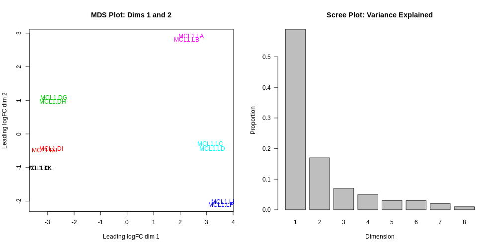
>    >    >
>    >    {: .solution}
>    {: .question}
>
>
>    > ###  Question
>    >
>    > What is the greatest source of variation in the data (i.e. what does dimension 1 represent)? 
>    > What is the second greatest source of variation in the data?
>    >
>    >    > ###  Solution
>    >    >
>    >    > Dimension 1 represents the variation due to cell type, basal vs luminal. Dimension 2 represents the variation due to the stages, virgin, pregnant or lactating.
>    >    >
>    >    {: .solution}
>    {: .question}

### Voom variance plot 

This plot can tell us if we’ve filtered the low counts adequately and if there is a lot of variation in our data.

   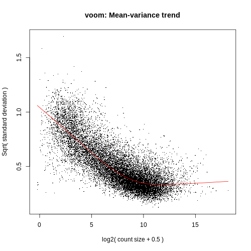

> ###  More details on Voom variance plots
>
> If we didn't filter this dataset for the lowly expressed genes the variance plot would look like below.
>
>   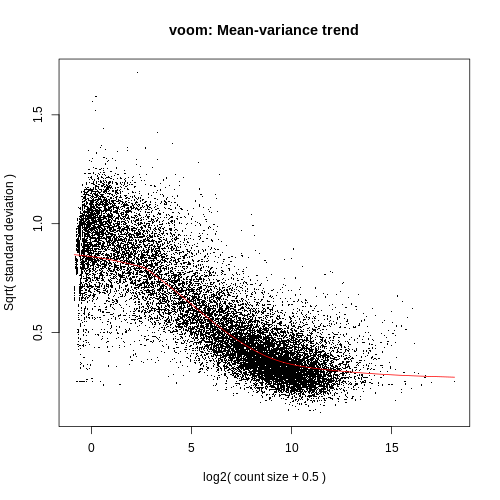
>
> If we look at the plot generated with the two samples mixed up we can see there's more variation.
>
>   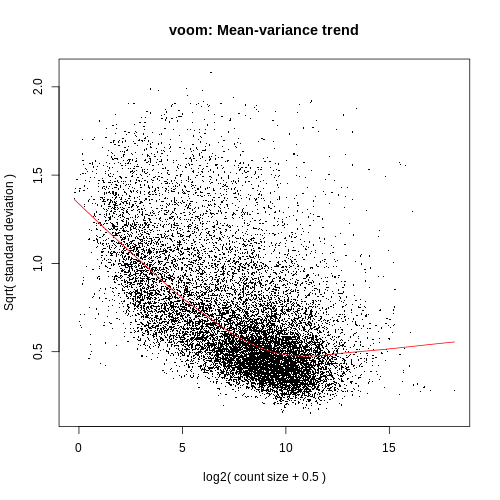
>
> More examples of the variation this plot can show can be seen in Figure 1 from the [limma-voom](https://genomebiology.biomedcentral.com/articles/10.1186/gb-2014-15-2-r29) paper, shown below.
>
>   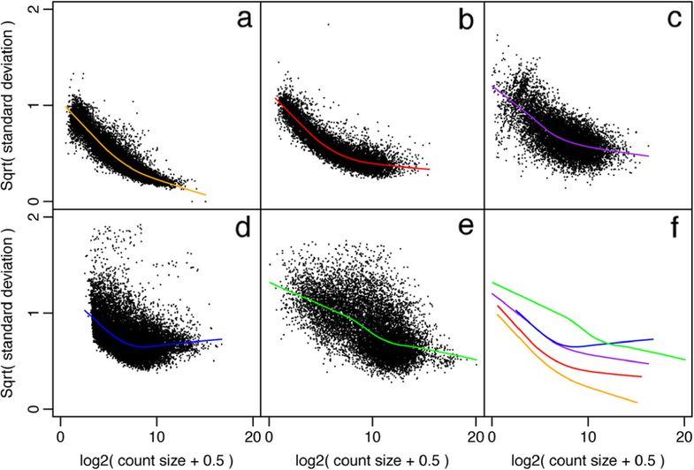
>   >
>   > *Figure 1: Mean-variance relationships. Gene-wise means and variances of RNA-seq data are represented by black points with a LOWESS trend. Plots are ordered by increasing levels of biological variation in datasets. (a) voom trend for HBRR and UHRR genes for Samples A, B, C and D of the SEQC project; technical variation only. (b) C57BL/6J and DBA mouse experiment; low-level biological variation. (c) Simulation study in the presence of 100 upregulating genes and 100 downregulating genes; moderate-level biological variation. (d) Nigerian lymphoblastoid cell lines; high-level biological variation. (e) Drosophila melanogaster embryonic developmental stages; very high biological variation due to systematic differences between samples. (f) LOWESS voom trends for datasets (a)–(e). HBRR, Ambion’s Human Brain Reference RNA; LOWESS, locally weighted regression; UHRR, Stratagene’s Universal Human Reference RNA*.
{: .details}

### MD and Volcano Plots

Genome-wide plots that are useful for checking DE results are MD plots (or MA plots) and Volcano plots. There are functions in limma for generating these plots and they are used by this tool.

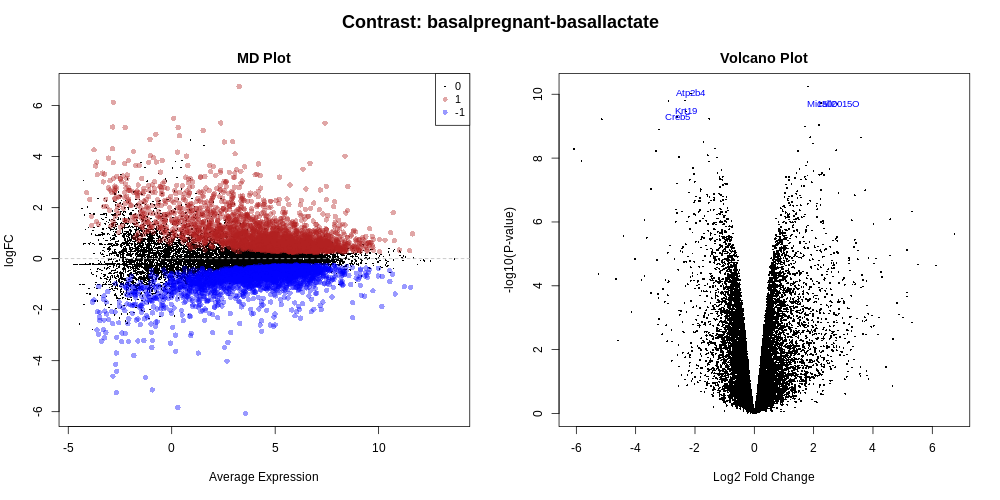

The MD Plot highlighted genes are significant at FDR of 0.05 and exhibit log2-fold-change of at least 0. These thresholds can be change by the user under **Advanced Options**. 

>    > ###  Question
>    >
>    > How many genes are differentially expressed at the default thresholds of FDR=0.05 and lfc=0? 
>    >
>    >    > ###  Solution
>    >    >
>    >    > The number of DE genes at these FDR and lfc thresholds is shown in the table in the report as below.
>    >    >  
>    >    > 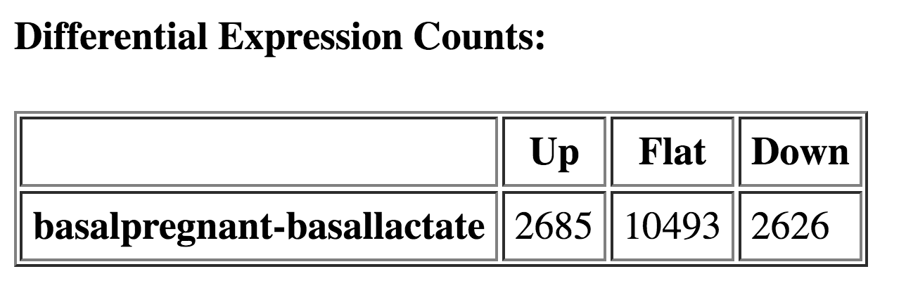{: width="500px"}
>    >    >
>    >    {: .solution}
>    {: .question}


> ###  Comment
>
> **A note about deciding how many genes are significant**: In order to decide which genes are differentially expressed, we usually take a cut-off of 0.05 on the adjusted p-value, NOT the raw p-value. This is because we are testing more than 15000 genes, and the chances of finding differentially expressed genes is very high when you do that many tests. Hence we need to control the false discovery rate, which is the adjusted p-value column in the results table. What this means is that if 100 genes are significant at a 5% false discovery rate, we are willing to accept that 5 will be false positives.
{: .comment}

### Testing relative to a threshold (TREAT)
When there is a lot of differential expression, sometimes we may want to cut-off on a fold change threshold as well as a p-value threshold so that we follow up on the most biologically significant genes. However, it is not recommended to simply rank by p-value and then discard genes with small logFC’s, as this has been shown to increase the false discovery rate. In other words, you are not controlling the false discovery rate at 5% any more. There is a function called `treat` in limma that performs this style of analysis correctly (McCarthy and Smyth 2009). Treat will simply take a user-specified log fold change cut-off and recalculate the moderated t-statistics and p-values with the new information about logFC. There are thousands of genes differentially expressed in this `basalpregnant-basallactate` comparison, so lets rerun the analysis applying a log-fold-change cutoff of 1 (equivalent to a 2-fold change) and using TREAT.

> ###  Hands-on: Testing relative to a threshold (TREAT)
>
> 1. **limma** : Rerun the `limma` tool with the same settings as before and add lfc=1 and TREAT.
>      - **Advanced Options**
>          - Minimum Log2 Fold Change: `1`
>          - Test significance relative to a fold-change threshold (TREAT): `Yes`
{: .hands_on}

>    > ###  Question
>    >
>    > What differences do you notice with the TREAT analysis? 
>    >
>    >    > ###  Solution
>    >    >
>    >    > Much fewer genes are now differentially expressed and highlighted in the MD plot.
>    >    > 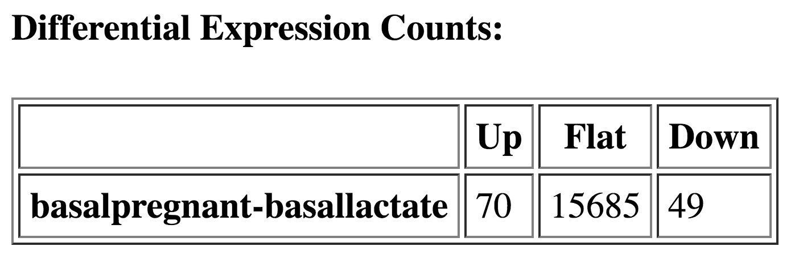{: width="500px"}
>    >    >
>    >    > 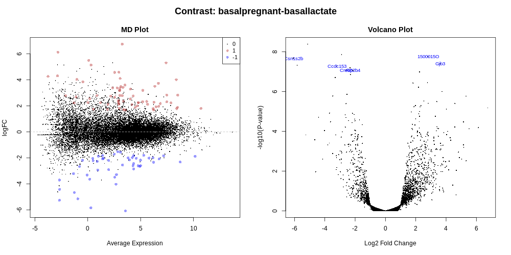
>    >    {: .solution}
>    {: .question}

Before following up on the DE genes with further lab work, it is recommended to have a look at the expression levels of the individual samples for the genes of interest. Heatmaps of the top genes can be generated with this tool and stripcharts can also be generated to view the expression of the top genes across the groups. This tool can generate these charts automatically for the top genes. The number of top genes is 10 by default, and the user can specify the number of top genes to view (up to 100) under **Advanced Options**. 

#### Heatmap of top genes
>    > 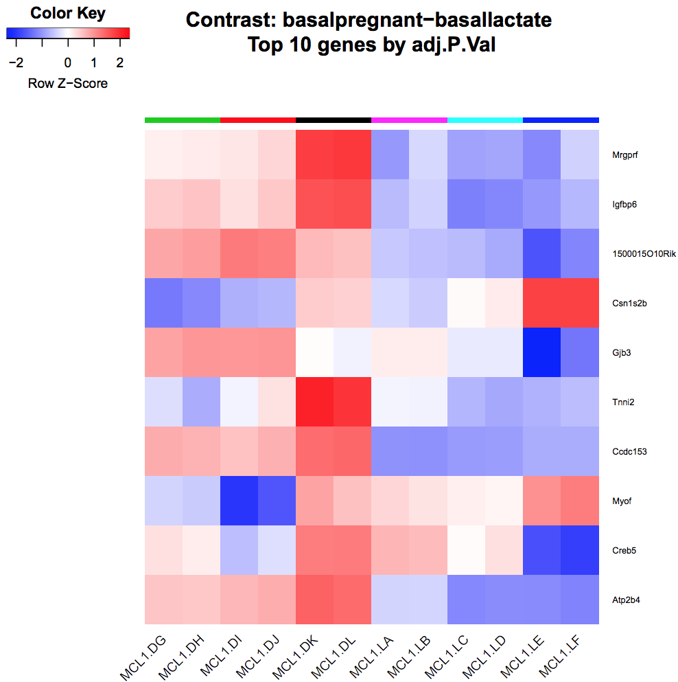{: width="750px"}


#### Stripcharts of top genes

Stripcharts showing the normalised expression by groups can be generated for the top genes.

>    > {: width="950px"}


### Interactive Glimma MD Plot

An interactive version of the mean-difference plots is possible via the [Glimma](https://github.com/Shians/Glimma) package, if a gene annotation file is provided to the limma tool. A link to a html page is generated in the limma report that allows the user to search for their favourite gene. The plot shows a two-panel interactive MD plot. The left plot shows the log-fold-change vs
average expression. The right plot shows the expression levels of a particular gene of each sample.
Hovering over points on left plot will plot expression level for corresponding gene, clicking on
points will fix the expression plot to gene. Clicking on rows on the table has the same effect as
clicking on the corresponding gene in the plot.

<iframe src="../../images/limma-voom/glimma/MD-Plot.html" width="100%" height="1000"></iframe>

>    > ###  Question
>    >
>    > Rerun the limma-voom TREAT analysis including another contrast `luminalpregnant - luminallactate`. What is the top gene for the luminal contrast? Can you see differences compared to the basal cells? 
>    >
>    >    > ###  Solution
>    >    >
>    >    > 
>    >    >
>    >    {: .solution}
>    {: .question}

# Conclusion
{:.no_toc}

Conclusion about the technical key points. And then relation between the technics and the biological question to end with a global view.
Further reading:
https://f1000research.com/articles/5-1408/v2
https://f1000research.com/articles/5-1438/v2

