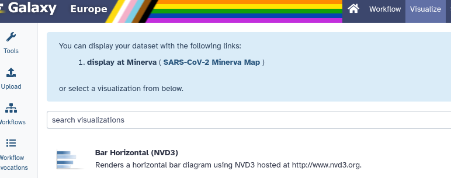

This tutorial is a partial reproduction of  wherein they evaluated mRNA and miRNA in a selection of COVID-19 patients and healthy controls.
While that paper uses a closed source pipeline, we'll be reproducing the analysis with open source tools in Galaxy, using a workflow on WorkflowHub developed for the BY-COVID project.

> <comment-title>Full data</comment-title>
> The original data is available at NCBI under [BioProject PRJNA754796](https://www.ncbi.nlm.nih.gov/bioproject/PRJNA754796)
{: .comment}
>
> <agenda-title></agenda-title>
>
> In this tutorial, we will deal with:
>
> 1. TOC
> {:toc}
>
{: .agenda}

There are several places you can jump to in this tutorial, using pre-calculated
data. We recommend you jump skipping the data download and counting step, and
skipping to the analysis, as that precludes the slowest and most data intensive
parts of this tutorial. However, the entire process is documented in case you
want to reproduce our work.

## Study Design

> <hands-on-title>Data upload</hands-on-title>
>
> 1. Create a new history for this tutorial
>
>    
>
> 2. Import the factor table from [Zenodo]({{ page.zenodo_link }})
>
>    ```
>    https://zenodo.org/records/10405036/files/factordata.tabular
>    ```
>
>    
>
> 4. Check that the datatype
>
>    
>
{: .hands_on}

## Analysis

We have split this workflow into three parts, based only on how long the first two portions of the workflow take to execute.
The rough runtime of the workflow portions, when this was being developed, can be broken down as follows:

Step                     | Time
---                      | ---
Data Download            | ~6h
Processing Counts        | ~8h
Analysis & Visualisation | 15m

These numbers were generated on UseGalaxy.eu and may not represent the most
efficient possible computation, as they are executed on a shared cluster that can, at times, be more or less busy.

As such we recommend you skip to the analysis step to progress to the interesting portion of the tutorial. We have provided in the Zenodo record data from the entire analysis,
analysed with the Download & Counts steps that can be skipped.



<div class="Download" markdown=1>

### Data Download

We'll start by downloading our FASTQ files from the [GEO Dataset GSE182152](https://www.ncbi.nlm.nih.gov/geo/query/acc.cgi?acc=GSE182152)

> <hands-on-title>Download the data from GEO (ETA: 6 Hours)</hands-on-title>
>
> 1. **Import the workflow** into Galaxy
>
>    
>
> 1. **Run the workflow** with the following parameters:
>
>    - *"Sample Table"*: `factordata.tabular`
{: .hands_on}

Here we have cut the `SRR*` identifiers from the sample table and downloaded them with `fasterq`, part of the SRA toolkit.

### Counts

With that done, we can start to analyse the data using HISAT2 and featureCounts.
This workflow takes in the RNA Sequencing data we've downloaded previously, before trimming it with cutadapt.
Both the trimmed and untrimmed reads are run through FastQC for visualisation.

<figure>

<pre class="mermaid">
{{ wf_counts.mermaid }}
</pre>
<figcaption><b>Workflow 1</b>: Counts Workflow for mRNA-Seq BY-COVID Pipeline.</figcaption>
</figure>

The trimmed reads are then handled by HISAT2 for alignment to the reference
human genome, and featureCounts is run for quantification.

This workflow produces a set of featureCounts tables, a set of featureLengths (needed for goseq), and a MultiQC report.

> <hands-on-title>Run the Workflow</hands-on-title>
>
> 1. **Import the workflow** into Galaxy
>
>    
>
> 1. **Run the workflow** with the following parameters:
>
{: .hands_on}

This workflow produces a handful of outputs: the featureCounts results, and a
MultiQC report. Looking at the report we see generally reasonable quality data.

</div>

### limma

<div class="Skip" markdown=1>

> <hands-on-title>Download the Counts Files</hands-on-title>
>
> 1. Open the Rule Builder
>    - *"Upload data as"*: `Collection(s)`
>    - *"Load tabular data from"*: `Pasted Table`
>    - **Paste** the following table:
>
>      ```
>      https://zenodo.org/records/10405036/files/gene_lengths.tabular	gene_lengths	Gene Lengths
>      https://zenodo.org/records/10405036/files/SRR15462516.featureCounts.tabular	SRR15462516	featureCounts
>      https://zenodo.org/records/10405036/files/SRR15462517.featureCounts.tabular	SRR15462517	featureCounts
>      https://zenodo.org/records/10405036/files/SRR15462518.featureCounts.tabular	SRR15462518	featureCounts
>      https://zenodo.org/records/10405036/files/SRR15462519.featureCounts.tabular	SRR15462519	featureCounts
>      https://zenodo.org/records/10405036/files/SRR15462520.featureCounts.tabular	SRR15462520	featureCounts
>      https://zenodo.org/records/10405036/files/SRR15462521.featureCounts.tabular	SRR15462521	featureCounts
>      https://zenodo.org/records/10405036/files/SRR15462522.featureCounts.tabular	SRR15462522	featureCounts
>      https://zenodo.org/records/10405036/files/SRR15462523.featureCounts.tabular	SRR15462523	featureCounts
>      https://zenodo.org/records/10405036/files/SRR15462524.featureCounts.tabular	SRR15462524	featureCounts
>      https://zenodo.org/records/10405036/files/SRR15462525.featureCounts.tabular	SRR15462525	featureCounts
>      https://zenodo.org/records/10405036/files/SRR15462526.featureCounts.tabular	SRR15462526	featureCounts
>      https://zenodo.org/records/10405036/files/SRR15462527.featureCounts.tabular	SRR15462527	featureCounts
>      https://zenodo.org/records/10405036/files/SRR15462528.featureCounts.tabular	SRR15462528	featureCounts
>      https://zenodo.org/records/10405036/files/SRR15462529.featureCounts.tabular	SRR15462529	featureCounts
>      https://zenodo.org/records/10405036/files/SRR15462530.featureCounts.tabular	SRR15462530	featureCounts
>      https://zenodo.org/records/10405036/files/SRR16681520.featureCounts.tabular	SRR16681520	featureCounts
>      https://zenodo.org/records/10405036/files/SRR16681521.featureCounts.tabular	SRR16681521	featureCounts
>      https://zenodo.org/records/10405036/files/SRR16681522.featureCounts.tabular	SRR16681522	featureCounts
>      https://zenodo.org/records/10405036/files/SRR16681523.featureCounts.tabular	SRR16681523	featureCounts
>      https://zenodo.org/records/10405036/files/SRR16681524.featureCounts.tabular	SRR16681524	featureCounts
>      https://zenodo.org/records/10405036/files/SRR16681525.featureCounts.tabular	SRR16681525	featureCounts
>      https://zenodo.org/records/10405036/files/SRR16681526.featureCounts.tabular	SRR16681526	featureCounts
>      https://zenodo.org/records/10405036/files/SRR16681527.featureCounts.tabular	SRR16681527	featureCounts
>      https://zenodo.org/records/10405036/files/SRR16681528.featureCounts.tabular	SRR16681528	featureCounts
>      https://zenodo.org/records/10405036/files/SRR16681529.featureCounts.tabular	SRR16681529	featureCounts
>      https://zenodo.org/records/10405036/files/SRR16681530.featureCounts.tabular	SRR16681530	featureCounts
>      https://zenodo.org/records/10405036/files/SRR16681531.featureCounts.tabular	SRR16681531	featureCounts
>      https://zenodo.org/records/10405036/files/SRR16681532.featureCounts.tabular	SRR16681532	featureCounts
>      https://zenodo.org/records/10405036/files/SRR16681533.featureCounts.tabular	SRR16681533	featureCounts
>      https://zenodo.org/records/10405036/files/SRR16681534.featureCounts.tabular	SRR16681534	featureCounts
>      https://zenodo.org/records/10405036/files/SRR16681535.featureCounts.tabular	SRR16681535	featureCounts
>      https://zenodo.org/records/10405036/files/SRR16681536.featureCounts.tabular	SRR16681536	featureCounts
>      https://zenodo.org/records/10405036/files/SRR16681537.featureCounts.tabular	SRR16681537	featureCounts
>      https://zenodo.org/records/10405036/files/SRR16681538.featureCounts.tabular	SRR16681538	featureCounts
>      https://zenodo.org/records/10405036/files/SRR16681539.featureCounts.tabular	SRR16681539	featureCounts
>      https://zenodo.org/records/10405036/files/SRR16681540.featureCounts.tabular	SRR16681540	featureCounts
>      https://zenodo.org/records/10405036/files/SRR16681541.featureCounts.tabular	SRR16681541	featureCounts
>      https://zenodo.org/records/10405036/files/SRR16681542.featureCounts.tabular	SRR16681542	featureCounts
>      https://zenodo.org/records/10405036/files/SRR16681543.featureCounts.tabular	SRR16681543	featureCounts
>      https://zenodo.org/records/10405036/files/SRR16681544.featureCounts.tabular	SRR16681544	featureCounts
>      https://zenodo.org/records/10405036/files/SRR16681545.featureCounts.tabular	SRR16681545	featureCounts
>      https://zenodo.org/records/10405036/files/SRR16681546.featureCounts.tabular	SRR16681546	featureCounts
>      https://zenodo.org/records/10405036/files/SRR16681547.featureCounts.tabular	SRR16681547	featureCounts
>      https://zenodo.org/records/10405036/files/SRR16681548.featureCounts.tabular	SRR16681548	featureCounts
>      https://zenodo.org/records/10405036/files/SRR16681549.featureCounts.tabular	SRR16681549	featureCounts
>      https://zenodo.org/records/10405036/files/SRR16681550.featureCounts.tabular	SRR16681550	featureCounts
>      https://zenodo.org/records/10405036/files/SRR16681551.featureCounts.tabular	SRR16681551	featureCounts
>      https://zenodo.org/records/10405036/files/SRR16681552.featureCounts.tabular	SRR16681552	featureCounts
>      https://zenodo.org/records/10405036/files/SRR16681553.featureCounts.tabular	SRR16681553	featureCounts
>      https://zenodo.org/records/10405036/files/SRR16681554.featureCounts.tabular	SRR16681554	featureCounts
>      https://zenodo.org/records/10405036/files/SRR16681555.featureCounts.tabular	SRR16681555	featureCounts
>      https://zenodo.org/records/10405036/files/SRR16681556.featureCounts.tabular	SRR16681556	featureCounts
>      https://zenodo.org/records/10405036/files/SRR16681557.featureCounts.tabular	SRR16681557	featureCounts
>      https://zenodo.org/records/10405036/files/SRR16681558.featureCounts.tabular	SRR16681558	featureCounts
>      https://zenodo.org/records/10405036/files/SRR16681559.featureCounts.tabular	SRR16681559	featureCounts
>      https://zenodo.org/records/10405036/files/SRR16681560.featureCounts.tabular	SRR16681560	featureCounts
>      https://zenodo.org/records/10405036/files/SRR16681561.featureCounts.tabular	SRR16681561	featureCounts
>      https://zenodo.org/records/10405036/files/SRR16681562.featureCounts.tabular	SRR16681562	featureCounts
>      https://zenodo.org/records/10405036/files/SRR16681563.featureCounts.tabular	SRR16681563	featureCounts
>      https://zenodo.org/records/10405036/files/SRR16681564.featureCounts.tabular	SRR16681564	featureCounts
>      https://zenodo.org/records/10405036/files/SRR16681565.featureCounts.tabular	SRR16681565	featureCounts
>      https://zenodo.org/records/10405036/files/SRR16681566.featureCounts.tabular	SRR16681566	featureCounts
>      ```
>
>    - Click `Build`
>
> 1. From **Rules** menu, select `Add / Modify Column Definitions`
>     - `Add Definition` → `Collection Name` → Select Column `C`
>     - `Add Definition` → `List Identifier(s)` → Select Column `B`
>     - `Add Definition` → `URL` → Column `A`
>
>     > <tip-title>Trouble entering?</tip-title>
>     > 1. Press the  button by **Rules**
>     > 1. Paste the following JSON into the dialog:
>     >    ```json
>     >    {"rules":[],"mapping":[{"type":"collection_name","columns":[2]},{"type":"list_identifiers","columns":[1],"editing":false},{"type":"url","columns":[0]}],"genome":"hg19"}
>     >    ```
>     > 1. Click Apply
>     {: .tip}
>
> 1. At the bottom of the dialog set `Genome` to `hg19` (it is probably something like "Human Feb 2009 (GRCh37/hg19) (hg19)" but we are focused on that last parenthetical portion).
>
> 1. Click **Upload**
>
{: .hands_on}

</div>

Now we're ready to analyse the counts files. Here we'll take the feature counts dataset collection and merge it into one count matrix through the use of "Column join".
This can then be annotated with the human readable names of the genes. This is all passed to limma for differential expression analysis.

With this result in hand, we're ready to do two further steps: preparing the dataset for goseq, and for analysis in the MINERVA Platform.
Goseq is a tool for gene ontology enrichment analysis, and the MINERVA Platform is a tool for visualising pathway analysis.

<figure>

<pre class="mermaid">
{{ wf_counts.mermaid }}
</pre>
<figcaption><b>Workflow 2</b>: Analysis Workflow for mRNA-Seq BY-COVID Pipeline.</figcaption>
</figure>

> <hands-on-title>Analyse the Counts</hands-on-title>
>
> 1. Run the workflow with the Factor Data from the first Hands-on, and the datasets from the workflow or Zenodo download, depending on your path:
>
>    
>
{: .hands_on}

You should have a few outputs, namely the `goseq` outputs, and a table ready for visualisation in the MINERVA Platform!

## The MINERVA Platform

The dataset prepared for the MINERVA Platform must be correctly formatted as a tabular dataset (`\t` separated values) like the following, with the dbkey set to `hg19` or `hg38`.
If you've run the above workflow, this should be the case.

```
SYMBOL  logFC              P.Value               adj.P.Val
TRIM25  2.07376444684004   1.2610025125617e-18   3.57368112059986e-15
ACSL1   2.90647033200259   2.71976234791064e-16  3.85390324698937e-13
NBEAL2  2.45952426389725   2.71787290816654e-14  2.56748394058132e-11
MIR150  -2.55304226607428  9.55912390273625e-14  6.74866152827879e-11
SLC2A3  2.95861349227708   1.19066011437523e-13  6.74866152827879e-11
```

The tabular dataset, as prepared above is then used by a dedicated MINERVA plugin () to visualise the data on-the-fly in the [COVID-19 Disease Map](https://covid19map.elixir-luxembourg.org/minerva/). To visualise and explore the data, follow these steps:

> <hands-on-title>Visualise in MINERVA</hands-on-title>
>
> 1. **Click** to expand the final "MINERVA-Ready Table"
>
> 1. Click on the  (**Visualize**) icon
>
>    
>
> 1. Select "display at Minerva (SARS-CoV-2 Minerva Map)"
>
>    
>
>    > <tip-title>MINERVA not listed?</tip-title>
>    > The MINERVA visualisation is only for correctly formatted files with the correct genome (i.e. human, hg19).
>    > If you dont' see MINERVA listed, first check that your dataset is:
>    > 1. recognised as a tabular dataset
>    >
>    >    
>    >
>    > 2. Has the correct genome build:
>    >
>    >    
>    >
>    >    It should be specifically `hg19` not a patch like `hg19Patch5`
>    >
>    > If that still doesn't work, please check that the Galaxy server you are using is updated to 24.0 or later.
>    >
>    {: .tip}
>
{: .hands_on}

### Analysis in the MINERVA Platform

Welcome to the MINERVA Covid-19 Disease Map! It has a similar interface to Galaxy, there is an interaction menu on the left, the main area is where you'll do your investigation,
and on the right are your datasets! In this case, the differentially expressed genes analysed above automatically loaded from Galaxy when you clicked "Display at MINERVA".


After the loading time, marked as "Reading Map Elements", the dataset will be visible in the right panel of the COVID-19 Disease Map, with the four corresponding columns specified earlier (see image below). The MINERVA-Galaxy plugin allows you to:

- filter the data table by fold-change (FC) threshold or by p-value (default: adjusted p-value, threshold set to 0.05)
- Search for specific gene symbols to display ("Search" box)
- Select specific differential expression values to display in the map (checkboxes in the data tab)
- Select all entries in the data table for visualisation (Select All)
- Reset the visualisation

The general process of data exploration looks like:

1. In the main map, find pathways with matching entries indicated by blue pins.
1. After selecting what you want to see, browse the COVID-19 Disease Map to explore the pathways with the corresponding expression pattern.
1. Select a pathway of your choice and in the left panel click the "Associated submap" button
1. Explore the expression patterns in the diagram that will be displayed.

> <hands-on-title>Explore TLR pathways</hands-on-title>
>
> 1. Use the **Search** box above the table on the right to search for **TLR**.
> 2. Select all four TLR genes.
>
>    - TLR3
>    - TLR4
>    - TLR7
>    - TLR8
>
> 2. In the main map, find *PAMP Signalling* and click on it. (Note: don't click the blue pin, click the pathway name)
>
>    
>
> 1. In the left panel, click the **Associated submap: PAMP Signalling** button.
> 1. Explore the detailed diagram to examine the expression pattern.
>
>    > <question-title></question-title>
>    > What is the expression pattern of TLR3, TLR7, and TLR8 in the PAMP Signalling pathway?
>    > > <solution-title></solution-title>
>    > > TLR3 and TLR7 are downregulated (cool/blue colour), TLR8 is upregulated (warm/red colour).
>    > > 
>    > {: .solution}
>    {: .question}
>
>
> 1. Without closing the PAMP Signalling submap, **click** "Select all" to visualise the entire data table
>
>    > <question-title></question-title>
>    > What is the expression pattern downstream of TLR7 and TLR8, namely how are MYD88 and IRAK4 regulated?
>    > > <solution-title></solution-title>
>    > > MYD88 and IRAK4 are strongly and weakly upregulated, respectively, despite TLR7 downregulation.
>    > > 
>    > {: .solution}
>    {: .question}
>
{: .hands_on}

For further analysis in the MINERVA Platform, a [full user guide is available](https://covid19map.elixir-luxembourg.org/minerva/resources/other/user_guide.pdf)
