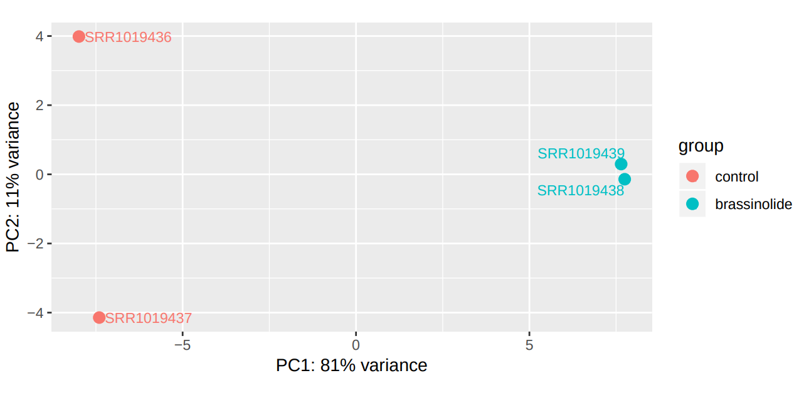
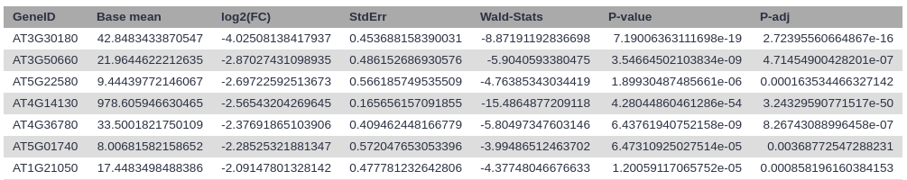
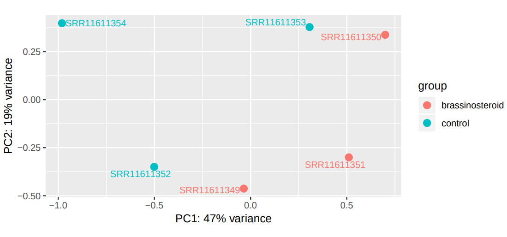
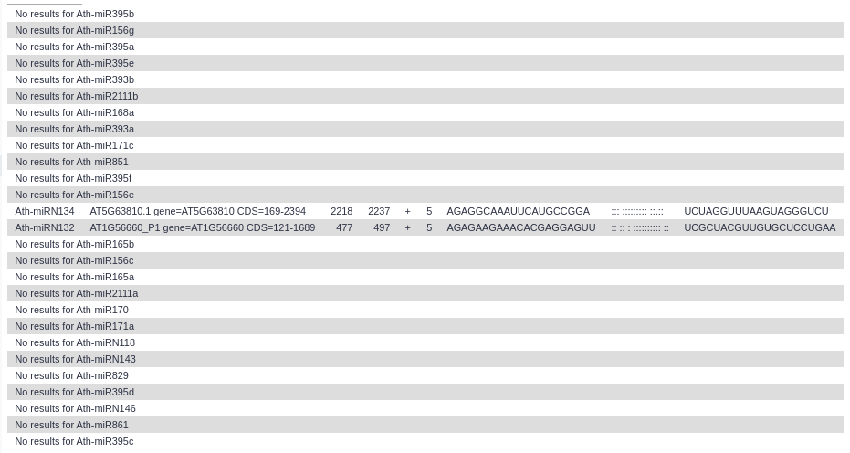

# Introduction
{:.no_toc}

Water stress is the main limiting factor faced by agricultural productivity and crop geographical distribution, and its consequences are increasing due to climate change (). The physiological effects of water stress on plant organisms (such as damage to antioxidant systems, decreased chlorophyll contents) leads to significant losses in crop yields. Understanding the mechanisms involved in the response to drought stress is a prerequisite for reducing their associated adverse effects.

As sessile organisms, the survival of plants under adverse environmental conditions depends, to a large extent, on their ability to perceive stress stimuli and respond appropriately to counteract the potentially damaging effects. Coordination of phytohormones and reactive oxygen species are considered a key element for enhancing stress resistance, allowing fine-tuning of gene expression in response to environmental changes (, ). These molecules constitute complex signalling networks, endowing with the ability to respond to a variable natural environment.

Brassinosteroids (BRs) are a group of plant steroid hormones essential for plant growth and development, as well as for controlling abiotic and biotic stress. Structurally, BRs are polyhydroxylated sterol derivatives with close similarity to animal hormones. This group of phytohormones is comprised of around 60 different compounds, of which brassinolide (BL), 24-epibrassinolide (EBR), and 28-homobrassinolide (HBR) are considered the most bioactive.


Several recent studies suggest that the BR-mediated gene regulatory networks have the potential to reshape the future of agriculture, not only by alleviating the antagonistic effect of drought stress but also by enhancing plant growth and yield. For instance, in tomato (_Solanum lycopersicum_), EBR treatment enhances drought tolerance, improving photosynthetic capacity, leaf water status, and antioxidant defense (). In pepper (_Capsicum annuum_), BL treatment increased the efficiency of light utilization under drought (). Gram (_Cicer arietinum_) plants exposed to drought stress and treated with BL showed significant increases in weight (). However, the mechanisms of BRs action in enhancing plant tolerance to abiotic stresses still remain largely unknown.

MicroRNAs (miRNAs), mainly 20–22 nucleotide small RNAs (sRNAs), are characterized for regulating gene expression at the post-transcriptional level. miRNAs are distinguished from other sRNAs by being generated from precursor harboring an imperfect stem‐loop structure. Unlike in animals, the pre-processing of plant miRNA occurs in the nucleus. The pre-miRNAs are then exported to the cytoplasm after methylation and incorporated into the Argonaute 1 protein to form RISC (RNA-induced silencing complex). The miRNA itself does not have the ability to cleave mRNAs or interfere with translation, but it plays a role in scanning the appropriate target. 


.")


miRNAs have been found to be important regulators of many physiological processes, such as stress and hormonal responses. Four factors justify the miRNAs to be considered as master regulators of the plant response to the surrounding environment:

- Multiple miRNA genes are regulated under given environmental conditions
- Computational predictions estimate that each miRNA regulates hundreds of genes
- The majority of plant miRNAs regulate the genes encoding for transcription factors (TFs)
- Targets include not only mRNAs but also long noncoding RNAs (lncRNAs)

In plants, miRNAs can silence targets through RNA degradation as well as translational repression pathways, and unlike animals, a large proportion of miRNA and their targets have less than four mismatches. This feature has been exploited for developing miRNAs target prediction tools, providing an efficient approach to elucidate the miRNA-mediated regulatory networks, which can contribute to biotechnological solutions to improve crops productivity. In this tutorial, inspired by , we aim to explore the interplay between brassinosteroids and the miRNA-gene silencing pathway, considered one of the most versatile regulatory mechanisms in response to stressful situations in plants.


> ### Agenda
>
> In this tutorial, we will cover:
>
> 1. TOC
> {:toc}
>
{: .agenda}

# Experimental design

The main objective of this training is to identify potential targets of miRNAs whose expression is induced by brassinosteroids. Our starting hypothesis is that there must be brassinosteroid-induced miRNAs that have high sequence complementarity with mRNAs whose expression is inhibited in the presence of these hormones.


# Background on data

The datasets to be used in this training can be classified into three groups: mRNA reads, miRNA reads and additional datasets.

## mRNA reads

The first dataset consists of four fastq files, generated through the Illumina HiSeq 2000 sequencing system. The samples were obtained from wild-type Columbia (Col-0) seedlings treated with mock or 100 nM BL for 4 hours. The original datasets are available in the NCBI SRA database, with the accession number [SRP032274](https://www.ncbi.nlm.nih.gov/sra?term=SRP032274). For this tutorial, subsets from the original data were generated in order to reduce the analysis run time.

__Control mRNA samples:__
```
https://zenodo.org/record/4606701/files/SRR1019436_RNASEQ_CTL.fastqsanger.gz
https://zenodo.org/record/4606701/files/SRR1019437_RNASEQ_CTL.fastqsanger.gz
```

__BL mRNA treated samples:__
```
https://zenodo.org/record/4606701/files/SRR1019438_RNASEQ_BL.fastqsanger.gz
https://zenodo.org/record/4606701/files/SRR1019439_RNASEQ_BL.fastqsanger.gz
```

## miRNA reads

The second group of files consists of six FASTQ files, obtained by using the Illumina GAxII sequencing platform. The plant samples were obtained from wild-type Ws-2 seedlings treated with mock or 1 μM EBR for 90 min before harvest. The original datasets are available in the NCBI SRA database, with the accession number [SRP258575](https://www.ncbi.nlm.nih.gov/sra?term=SRP258575). As in the previous case, for this tutorial, we will use a reduced version of the data.

__Control miRNA samples:__
```
https://zenodo.org/record/4606701/files/SRR11611349_MIRNASEQ_CTL.fastqsanger.gz
https://zenodo.org/record/4606701/files/SRR11611350_MIRNASEQ_CTL.fastqsanger.gz
https://zenodo.org/record/4606701/files/SRR11611351.MIRNASEQ_CTLfastqsanger.gz
```

__EBR miRNA treated samples:__
```
https://zenodo.org/record/4606701/files/SRR11611352_MIRNASEQ_BL.fastqsanger.gz
https://zenodo.org/record/4606701/files/SRR11611353_MIRNASEQ_BL.fastqsanger.gz
https://zenodo.org/record/4606701/files/SRR11611354_MIRNASEQ_BL.fastqsanger.gz
```

## Additional datasets

In addition to the RNA-Seq reads obtained from the NCBI database, we will use datasets from two sources:

- [AtRTD2](https://ics.hutton.ac.uk/atRTD/) is a high-quality transcript reference dataset developed to exploit the accuracy of transcript quantification tools such as __Salmon__ and __Kallisto__ in analyzing Arabidopsis RNA-Seq data.
- [PmiREN](http://pmiren.com/) is a comprehensive functional plant miRNA database that includes more than 20,000 annotated miRNAs diverse plant species.

# Get data

The first step of our analysis consists of retrieving the RNA-Seq datasets from Zenodo and organizing them into collections.

> ###  Hands-on: Retrieve RNA-Seq datasets
>
> 1. Create a new history for this tutorial
> 2. Import the files from Zenodo:
>
>    - Open the file  __upload__ menu
>    - Click on __Collection__ tab
>    - Click of the **Paste/Fetch** button
>    - Copy the Zenodo links included in the `Control mRNA samples` section and press <kbd>Start</kbd> and <kbd>Build</kbd>
>    - Assign a name to the new collection: `Control mRNA` and press <kbd>Create list</kbd>
>
>    
>
> 3. Add informative tags (i.e. `#mRNA` and `#control`)
> 4. Repeat the procedure with the remaining three datasets
>
{: .hands_on}

Next we will retrieve the remaining datasets.

> ###  Hands-on: Retrieve the additional datasets
>
> 1. Import the files from Zenodo:
>
>    - Open the file  __upload__ menu
>    - Click of the **Paste/Fetch** button
>    - Copy the Zenodo links and press <kbd>Start</kbd>
>
> ```
> https://zenodo.org/record/4606701/files/annotation_AtRTD2_19April2016.gtf.gz
> https://zenodo.org/record/4606701/files/transcriptome_AtRTD2_12April2016.fasta.gz
> https://zenodo.org/record/4606701/files/star_miRNA_seq.fasta
> https://zenodo.org/record/4606701/files/mature_miRNA_AT.fasta
> https://zenodo.org/record/4606701/files/miRNA_stem-loop_seq.fasta
> https://zenodo.org/record/4606701/files/PmiREN_miRNA_database.fasta
> ```
>
> 2. Rename each dataset according to the sample id (e.g. `annotation_AtRTD2.gtf`)
>
>    
>
{: .hands_on}

> ###  Dataset subsampling 
>
> As indicated above, for this tutorial the depth of the samples was reduced in order to speed up the time needed to carry out the analysis. This was done as follows:
>
> > ###  Hands-on: Dataset subsampling
> >
> > 1.  with the following parameters:
> >    -  *"Multiple datasets"*: Each of the fastq files
> >    - *"Subsampling approach"*: `Take every N-th sequence (or pair e.g. every fifth sequence)`
> >    - *"N"*: `100`
> {: .hands_on}
> 
> In this way, we will only take 1% of readings at a random sampling rate.
{: .comment}

# mRNA differential expression analysis

Once we have imported the data, we can begin to study how brassinosteroid exposure alters gene expression patterns.

## Quality assessment of mRNA reads

Due to technical limitations, sequencing is considered an error-prone process. In Illumina sequencing platforms, substitution type miscalls are the dominant source of errors, which can lead to inconsistent results. Another factor that can interfere with our analyses is the presence of adapter contaminants, which can result in an increased number of unaligned reads, since the adapter sequences are synthetic and do not occur in the genomic sequence.

Sequence quality control is therefore an essential first step in your analysis. We will use two popular tools for evaluating the quality of our raw reads: __FastQC__ and __MultiQC__.

> ###  Comments
> In order to visualize the data from both collections together in the __MultiQC__ tool, it will be necessary to combine the results generated by __FastQC__.
> For more information on the topic of quality control, please see our training materials [here](https://training.galaxyproject.org/training-material/topics/sequence-analysis/tutorials/quality-control/tutorial.html).
{: .comment}

> ###  Hands-on: Initial quality check
>
> 1.  with the following parameters:
>    -  *"Dataset collection"*: `Control mRNA`
> 2. Rename the outputs as `FastQC unprocessed control mRNA: RawData` and `FastQC unprocessed control mRNA: Webpage`
> 3. Repeat the previous step with the `BR treated mRNA` collection.
> 4.  with the following parameters:
>    - In *"Input collections"*:
>        - *"1.Input Collections"*: `FastQC unprocessed control mRNA: RawData`
>        - *"2.Input Collections"*: `FastQC unprocessed BR treated mRNA: RawData`
> 5.  with the following parameters:
>    - In *"Results"*:
>      - *"Which tool was used generate logs?"*: `FastQC`
>      -  *"Dataset collection"*: select the output generated in the previous step.
>    - *"Report title"*: `mRNA initial quality check`
> 4. Click on the  (eye) icon and inspect the generated HTML file
>
{: .hands_on}

> ###  Questions
>
> Are there any parameters that indicate the need to process the samples in order to improve their quality?
>
> > ###  Solution
> >
> > All parameters are within acceptable limits. However, the adapter content shows the presence of universal adapters in our readings, which can be removed to avoid possible interferences at later stages.
> >
> >    
> >
> {: .solution}
{: .question}

> ###  Comments
> Although our samples have adapters, we are not going to trim them in this case. We will explain the reason in the next section.
{: .comment}

## Quantification of gene expression: **Salmon**

After performing the quality assessment of the reads, we can move on to quantifying the gene expression. The aim of this step is to identify which transcript each read comes from and the total number of reads associated with each transcript. In this tutorial, we will use the Salmon tool ()  for the quantification of mRNA transcripts.


One of the characteristics of __Salmon__ is that it doesn't require performing a base-to-base alignment, which is the time-consuming step of tools such as __STAR__ and __HISAT2__. Salmon relies on the quasi-mapping concept, a new mapping technique that allows the rapid and accurate mapping of RNA-Seq reads to a target transcriptome. Rather than a standard alignment, quasi-mapping seeks to find the best mappings for each read, and does so by finding minimal collections of dynamically sized, right-maximal, matching contexts between target and query positions ()

The quasi-mapping approach by __Salmon__ requires a reference index to determine the position and orientation information for accurate mapping prior to quantification. It allows providing the transcriptome in a format that optimizes its use in transcript identification and quantification.

After determining the best mapping for each read, __Salmon__  generates the final transcript abundance estimation after modeling sample-specific parameters and biases. Reads that map equally well to more than one transcript will have the count divided between all of the mappings, thus avoiding the loss of information on the different gene isoforms.


> ###  Quasi-mapping algorithm
>  The quasi-mapping algorithm makes use of two main data structures, the generalized suffix array (SA) of the transcriptome T, and a hash table (h) mapping each k-mer occurring in T to its SA interval (by default k = 31). During the quasi-mapping procedure, a read is scanned from left to right until a k-mer (k<sub>i</sub>) is encountered that appears in h. The k-mer is looked up in the hash table and the SA intervals are retrieved, giving all suffixes containing that k-mer. Then, the procedure described above is used to compute the Maximal Mappable Prefix (MMP<sub>i</sub>) by finding the longest read that matches the reference suffixes, and ℓ = NIP(MMP<sub>i</sub>), where NIP states for "next informative position".
> 
> The search procedure then advances to position i+ℓ−k in the read, and again begins hashing the k-mers it encounters. This process of determining the MMP and NIP of each processed k-mer and advancing to the NIP in the read continues until the NIP exceeds position l<sub>r</sub>−k where l<sub>r</sub> is the length of the read r. The result of applying this procedure to a read is a set S of query positions, MMP orientations and SA intervals, with one such triplet corresponding to each MMP ().
{: .comment}


> ###  Hands-on: Quantify gene expression with __Salmon__
>
> 1.  with the following parameters:
>    - *"Select salmon quantification mode:"*: `Reads`
>        - *"Select a reference transcriptome from your history or use a built-in index?"*: `Use one from the history`
>            - In *"Salmon index"*:
>                -  *"Transcripts fasta file"*: `transcriptome_AtRTD2.fasta`
>        - In *"Data input"*:
>            - *"Is this library mate-paired?"*: `Single-end`
>                -  *"FASTQ/FASTA file"*: `Control mRNA`
>        - *"Validate mappings"*: `Yes`
>    -  *"File containing a mapping of transcripts to genes"*: `annotation_AtRTD2.gtf`
>
> 2. Rename the outputs as `Salmon control mRNA (Quantification)` and `Salmon control mRNA (Gene Quantification)`
> 3. Repeat the previous procedure by using the `BR treated mRNA` dataset
>
>   > ###  Quasi-mapping sequence requirements
>   > Trimming the reads is not required  when using this method, since if there are k-mers in the reads that are not in the hash table, they are not counted. Quantification of the reads is only as good as the quality of the reference transcriptome.
>   {: .comment}
>
{: .hands_on}

_Salmon_ generates two output from each read dataset:

- Quantification: summarizes the quantifications by transcript
- Gene quantification: summarizes the quantification by gene

Each output consists of a tabular dataset with five columns:

Field             | Description
------------------| ----------
Name              | The name of the target transcript provided in the input transcriptome.
Lenght            | The length of the target transcript.
EffectiveLength   | The computed effective length.
TPM               | The relative abundance of this transcript in units of Transcripts Per Million.
NumReads          | The number of reads mapping to each transcript that was quantified.


> ###  Questions
>
> Could you explain why we did not trim the readings before?
>
> > ###  Solution
> >
> > The reason is that, since the k-mers which include the adaptor sequences are not present in the transcriptome (from which the hash table is generated), they are ommited.
> >
> {: .solution}
>
{: .question}

## Differential expression analysis of mRNAs: **DESeq2**

DESeq2 is a tool for differential gene expression analysis based on a negative binomial generalized linear model. DEseq2 internally corrects the differences in library size, due to which no preliminary normalization of input datasets is required.

> ###  Comments
> It is desirable to use at least three replicates of each experimental condition to ensure sufficient statistical power.
>
{: .comment}

> ###  Hands-on: DEA with DEseq2
>
> 1.  with the following parameters:
>    - *"How"*: `Select datasets per level`
>        - In *"Factor"*:
>            -  *"Insert Factor"*
>                - *"Specify a factor name, e.g. effects_drug_x or cancer_markers"*: `effects_brassinolide`
>                - In *"Factor level"*:
>                    -  *"Insert Factor level"*
>                        - *"Specify a factor level"*: `brassinolide`
>                        -  *"Counts file(s)"*: `Salmon control mRNA (Gene Quantification)`
>                    -  *"Insert Factor level"*
>                        - *"Specify a factor level"*: `control`
>                        -  *"Counts file(s)"*: `Salmon BR treated mRNA (Gene Quantification)`
>    - *"Choice of Input data"*: `TPM values (e.g. from kallisto, sailfish or salmon)`
>        - *"Program used to generate TPMs"*: `Salmon`
>        - *"Gene mapping format"*: `GTF/GFF3`
>            -  *"GTF/GFF3 annotation file"*: `annotation_AtRTD2.gtf`
> 2. Rename the outputs as `DESeq2 results mRNA` and `DESeq2 plots mRNA`
{: .hands_on}

DESeq2 generated 2 outputs: a table with the normalized counts and a graphical summary of the results. To evaluate the similarity of our samples, we are going to evaluate the Principal Component Analysis (PCA) plot. PCA allows evaluating the dominant directions of the highest variability in the data. Thus, the samples subjected to the same conditions should cluster together.



> ###  Questions
>
> What conclusions about the similarity of the samples can be derived from the PCA plot?
>
> > ###  Solution
> >
> > From the information provided by the plot, it is possible to state that there is a high similarity between the samples belonging to the same experimental conditions, since the first dimension (x-axis) allows to explain 81% of the variability, and the samples are located at opposite ends of the x-axis.
> >
> {: .solution}
>
{: .question}

## Filter significantly differentially expressed genes

Next, we will extract those genes whose expression is statistically significant, selecting those whose adjusted p-value is less than 0.01. A cut-off value of 0.01 means that the probability of a false positive is less than one per thousand.

> ###  p-value vs p-adj
>
> The p-value is a measure of the probability that an observed difference could have occurred just by random chance. A small p-value indicates that there is a small chance of getting this data if no real difference existed. A p-value threshold of 0.05 indicates that there is a 5% chance that the result is a false positive. The p-adj (also known as q-value) is an adjusted p-value which taking in to account the false discovery rate (FDR). Applying a FDR becomes necessary when we're measuring thousands of variables from a small sample set.
>
{: .comment}

> ###  Hands-on: Extract statistically significant genes
>
> 1.  with the following parameters:
>    -  *"Filter"*: output of **DESeq2** 
>    - *"With following condition"*: `c7<0.01`
> 2. Rename the output as `Statistically significant genes`
>
> 3.  with the following parameters:
>    -  *"Filter"*: `Statistically significant mRNAs`
>    - *"With following condition"*: `c3>1`
> 4. Rename it as `Statistically downregulated mRNAs`
>
> 5.  with the following parameters:
>    -  *"Filter"*: `Statistically significant genes`
>    - *"With following condition"*: `c3<-1`
> 6. Rename it as `Statistically upregulated mRNAs`
>
{: .hands_on}

> ###  Questions
>
> 1. How many genes show statistically significant differential expression?
> 2. How many of them are upregulated? And downregulated?
>
> > ###  Solution
> >
> > 1. The total number of genes whose expression differential between the two experimental conditions is 163.
> > 2. Of them, 108 are downregulated by the BR treatment and 26 are upregulated.
> >
> {: .solution}
>
> > ###  Comments
> > The sum of genes considered as upregulated and downregulated is lower than the total number of genes whose expression is statistically different is due to the fact that we have selected only those whose difference in transcript abundance is greater than a factor of 2.
> >
> {: .comment}
>
{: .question}

One way to assess whether the results obtained are biologically meaningful is to rank the genes whose expression is upregulated by brassinosteroid treatment and to seek information on the function of those genes that show a greater induction of their expression.

> ###  Hands-on: Sort upregulated genes
>
> 1.  with the following parameters:
>    -  *"Sort Query"*: `Statistically upregulated mRNAs`
>    - In *"Column selections"*:
>        -  *"Insert Column selections"*
>            - *"on column"*: `c3`
>            - *"in"*: `Descending order`
> 2. Click on the  (eye) icon and inspect the generated file
{: .hands_on}



In order to functionally characterize the Arabidopsis genes, we can consult the [TAIR database](https://www.arabidopsis.org/index.jsp).

> ###  Questions
>
> What is the biological function of BR6OX2, the most upregulated gene?
>
> > ###  Solution
> >
> > BR60X2 encodes a cytochrome p450 enzyme that catalyzes the last reaction in the production of brassinolide. It is capable of converting 6-deoxocastasterone into castasterone, a C-6 oxidation, as well as the further conversion of castasterone into brassinolide (source: [TAIR database](https://www.arabidopsis.org/servlets/TairObject?name=at3g30180&type=locus)).
> >
> {: .solution}
>
{: .question}


# miRNA differential expression analysis

Once the differential expression analysis of mRNAs has been carried out, the next stage is to analyze how miRNA expression is altered in response to brassinosteroids.

## Quality assessment of miRNA reads

As in the previous section, we shall begin by assessing the quality of our sequences.

> ###  Hands-on: Initial quality check
>
> 1.  with the following parameters:
>    -  *"Dataset collection"*: `Control miRNA`
> 2. Rename the outputs as `FastQC unprocessed control miRNA: RawData` and `FastQC unprocessed control miRNA: Webpage`
> 3. Repeat the previous step with the `BR treated mRiNA` collection.
> 4.  with the following parameters:
>    - In *"Input collections"*:
>        - *"1.Input Collections"*: `FastQC unprocessed control miRNA: RawData`
>        - *"2.Input Collections"*: `FastQC unprocessed BR treated mRiNA: RawData`
> 5.  with the following parameters:
>    - In *"Results"*:
>      - *"Which tool was used generate logs?"*: `FastQC`
>      -  *"Dataset collection"*: select the output generated in the previous step.
>   - In *"Report title"*: `miRNA initial quality check`
> 4. Click on the  (eye) icon and inspect the generated HTML file
>
{: .hands_on}


> ###  Questions
>
> Based on the information provided by __MultiQC__, is it necessary to trimming/filtering the reads?
>
> > ###  Solution
> >
> > 1. The report generated by __MultiQC__ indicates that three quality parameters show values outside the recommended limits: per sequence G/C content, overrepresented sequences and adapter content.
> >
> > 
> > 
> > 
> >
> > Particularly remarkable is the content of adapters, which are up to 80% of the readings in some samples. Given the abundance of adapters, one would expect that if we eliminate this source of contamination, the rest of the parameters would show a noticeable improvement.
> >
> {: .solution}
{: .question}

To remove the adapters contamination, we will employ the __Trim Galore__ tool, a wrapper script around [__Cutadapt__](https://journal.embnet.org/index.php/embnetjournal/article/view/200) and __FastQC__ which automates quality and adapter trimming.

> ###  Hands-on: Trimming of adapter sequences
>
> 1.  with the following parameters:
>    - *"Is this library paired- or single-end?"*: `Single-end`
>        -   *"Reads in FASTQ format"*: `Control mRNA`
>        - *"Adapter sequence to be trimmed"*: `small RNA adapters`
> 2. Rename the output collection as `Control miRNA trimmed`
> 3. Repeat the previous step with the `BR treated miRNA` collection.
>
{: .hands_on}

Next, we will reassess the quality of the sequences to check if the adapters have been removed.

> ###  Hands-on: Initial quality check
>
> 1.  with the following parameters:
>    -  *"Dataset collection"*: `Control miRNA trimmed`
> 2. Rename the outputs as `FastQC processed control miRNA: RawData` and `FastQC unprocessed control miRNA: Webpage`
> 3. Repeat the previous step with the `BR treated miRNA trimmed` collection.
> 4.  with the following parameters:
>    - In *"Input collections"*:
>        - *"1.Input Collections"*: `FastQC processed control miRNA: RawData`
>        - *"2.Input Collections"*: `FastQC processed BR treated miRNA: RawData`
> 5.  with the following parameters:
>    - In *"Results"*:
>      - *"Which tool was used generate logs?"*: `FastQC`
>      -  *"Dataset collection"*: select the output generated in the previous step.
>   - In *"Report title"*: `miRNA trimmed quality check`
> 4. Click on the  (eye) icon and inspect the generated HTML file
>
{: .hands_on}

The evaluation of the report generated by __MultiQC__ after having processed the samples by __Trim Galore__ indicates that the G/C content has been successfully corrected, and that the adapter contamination has been eliminated. However, the samples still show a high degree of over-represented sequences.


> ###  Questions
>
> What do you think could be the cause of the high number of over-represented sequences?
>
> > ###  Solution
> >
> >  Two of the factors that may determine the abundance of overrepresented sequences are the existence of highly expressed miRNAs (Seco-Cervera et al. 2018), and the existence of highly conserved sequence motifs within the miRNA ().
> >
> {: .solution}
{: .question}


## miRNA quantification: **MiRDeep2**

Quantification of miRNAs requires to use two different tools:
- The __MiRDeep2 Mapper__ tool for preprocessing the reads.
- The __MiRDeep2 Quantifier__  tool for mapping the deep sequencing reads to predefined miRNA precursors and determining the expression of the corresponding miRNAs. It is carried out in two steps: firstly, the predefined mature miRNA sequences are mapped to the predefined precursors (optionally, predefined star sequences can be mapped to the precursors too). And second, the deep sequencing reads are mapped to the precursors.

> ###  Hands-on: Quantification of miRNAs
>
> 1.  with the following parameters:
>    -  *"Deep sequencing reads"*: `Control miRNA trimmed`
>    - *"Remove reads with non-standard nucleotides"*: `Yes`
>    - *"Clip 3' Adapter Sequence"*: `Don't Clip`
>    - *"Collapse reads and/or Map"*: `Collapse reads`
> 2. Rename the output as `Collapsed control miRNA`
> 3. Repeat the previous stages by providing `BR treated miRNA trimmed`as input, and rename it as `Collapsed BR treated miRNA`.
>
> 4.  with the following parameters:
>    -  *"Collapsed deep sequencing reads"*: `Collapsed control miRNA`
>    -  *"Precursor sequences"*: `miRNA_stem-loop_seq.fasta`
>    -  *"Mature miRNA sequences"*: `mature_miRNA_AT.fasta`
>    -  *"Star sequences"*: `star_miRNA_seq.fasta`
> 5. Rename the outputS as `MirDeep2 control miRNA` and `MirDeep2 control miRNA (html)`.
> 6. Repeat the fourth step by providing `Collapsed BR treated miRNA` as input, and rename the outputs as `MirDeep2 BR treated miRNA` and `MirDeep2 BR treated miRNA (html)`
>
{: .hands_on}

To use the outputs generated by __MiRDeep2 Quantifier__ in the differential expression analysis, it is necessary to modify the datasets.

> ###  Hands-on: Edition of MiRDeep2 Quantifier outputs
>
> 1.  with the following parameters:
>    - *"Cut columns"*: `c1,c2`
>    - *"Delimited by"*: `Tab`
>    -  *"From"*: `MiRDeep2 control miRNA`
> 2. Rename the output as `MiRDeep2 DE control miRNA`
> 3.  with the following parameters:
>    - *"Cut columns"*: `c1,c2`
>    - *"Delimited by"*: `Tab`
>    -  *"From"*: `MiRDeep2 BR treated miRNA`
> 4. Rename the output as `MiRDeep2 DE BR treated miRNA`
>
{: .hands_on}

## Differential expression analysis of miRNAs: **DESeq2**

> ###  Hands-on: Differential expression analysis with DEseq2
>
> 1.  with the following parameters:
>    - *"How"*: `Select datasets per level`
>        - In *"Factor"*:
>            -  *"Insert Factor"*
>                - *"Specify a factor name, e.g. effects_drug_x or cancer_markers"*: `effects_brassinolide`
>                - In *"Factor level"*:
>                    -  *"Insert Factor level"*
>                        - *"Specify a factor level"*: `brassinolide`
>                        -  *"Counts file(s)"*: `MiRDeep2 DE BR treated miRNA`
>                    -  *"Insert Factor level"*
>                        - *"Specify a factor level"*: `control`
>                        -  *"Counts file(s)"*: `MiRDeep2 DE control miRNA`
>    - *"Choice of Input data"*: `Count data (e.g. from HTSeq-count, featureCounts or StringTie)`
> 2. Rename the outputs as `DESeq2 results miRNA` and `DESeq2 plots miRNA`
> 3. Click on the  (eye) icon and inspect the `DESeq2 plots miRNA` file
{: .hands_on}



As can be seen, in this case, the samples are much less similar to each other. Likewise, the main axes account for only 47% and 19% of the total variation. This suggests that the effect of brassinosteroids on miRNA regulation is limited.

## Filter significantly upregulated miRNAs

To conclude the analysis of the differential expression of miRNAs, we will extract those transcripts that show a significant induction of expression in response to brassinosteroids.

> ###  Hands-on: Filter upregulated miRNAs
>
> 1.  with the following parameters:
>    -  *"Filter"*: `DESeq2 results miRNA`
>    - *"With following condition"*: `c6<0.05`
> 2. Rename the output as `Differentially expressed miRNAs`
>
> 3.  with the following parameters:
>    -  *"Filter"*: `Differentially expressed miRNAs`
>    - *"With following condition"*: `c3<0`
>
>    > ###  Comment
>    >
>    > In this case we have chosen to apply a much less restrictive filtering than in the previous case, since the samples have much greater diversity among themselves. Thus, we have applied a threshold of 0.05 on the p-value, instead of opting for a threshold of 0.01 on the adjusted p-value as in the case of total mRNA. This results in a much higher probability of false positives.
>    {: .comment}
>
{: .hands_on}

> ###  Questions
>
> How many miRNAs show statistically significant upregulation?
>
> > ###  Solution
> >
> > Only four of the miRNAs are significantly overexpressed in response to brassinosteroids.
> > 
> {: .solution}
>
{: .question}


# Identification of miRNA targets

To identify potential targets of upregulated miRNAs, it is necessary to obtain the sequences of all genes in FASTA format.

> ###  Hands-on: Obtaining the gene sequences of downregulated mRNAs
>
> 1.  with the following parameters:
>    -  *"File to cut"*: `Statistically downregulated mRNAs`
>    - *"Cut by"*: `fields`
>        - *"List of Fields"*: `c['1']`
> 2. Rename the output as `mRNA ids`
> 3.  with the following parameters:
>    -  *"FASTA sequences"*: `transcriptome_AtRTD2.fasta` (Input dataset)
>    - *"Criteria for filtering on the headers"*: `List of IDs`
>        -  *"List of IDs to extract sequences for: `mRNA ids`
>        - *"Match IDs by"*: `Custom regex pattern`
>           - *"Regex search pattern for ID"*: `.*GENE=(.*)\s.*$`
> 4. Rename it as `mRNA_downregulated_sequences.fasta`
> 5. Click on the  (eye) icon and inspect the `mRNA_downregulated_sequences.fasta`  file
{: .hands_on}

Now we will obtain the sequences of miRNAs whose expression is induced by brassinosteroids.

> ###  Hands-on: Obtaining the sequences of upregulated miRNAs
>
> 1.  with the following parameters:
>    -  *"File to cut"*: `Statistically upregulated miRNAs`
>    - *"Cut by"*: `fields`
>        - *"List of Fields"*: `c['1']`
>
>
> 2.  with the following parameters:
>    -  *"File to process"*: output of **Cut** 
>    - *"Find pattern"*: `*`
>    - *"Replace with"*: (Empty space)
>    - *"Find and Replace text in"*: `entire line`
> 3. Rename the output as `miRNAs ids`
>
> 4.  with the following parameters:
>    -  *"from query"*: output of **Replace** >
>
> 5.  with the following parameters:
>    -  *"FASTA sequences"*: `PmiREN_miRNA_database.fasta`
>    - *"Criteria for filtering on the headers"*: `List of IDs`
>        -  *"List of IDs to extract sequences for"*: `miRNAs ids`
>        - *"Match IDs by"*: `Default: ID is expected at the beginning: >ID`
> 6. Click on the  (eye) icon and inspect the `miRNA_upreguled_sequences.fasta` file
{: .hands_on}


## Identification of miRNA targets with **targetFinder**

We are now ready to launch the search for miRNA target genes. For this we will use the __Targetfinder__ tool , which, according to several publications, is one of the tools that offers the best results (, ).


> ###  Hands-on: identification of potential miRNA targets
>
> 1.  with the following parameters:
>    -  *"Input small RNA sequences file"*: `miRNA_upreguled_sequences.fasta`
>    -  *"Target sequence database file*": `mRNA_downregulated_sequences.fasta`
>    - *"Prediction score cutoff value"*: `5.0`
> 2. Click on the  (eye) icon and inspect the output of **TargetFinder**.
{: .hands_on}

> ###  Questions
>
> 1. How many target genes have been identified?
> 2. Could you provide an explanation for this outcome?
>
> > ###  Solution
> >
> > 1. Unfortunately, we have not detected any target genes.
> > 2. The negative result of our analysis may be due to one of the following causes:
> > - Brassinosteroid-mediated regulation of gene expression does not involve miRNAs.
> > - The datasets don't have sufficient read depth to detect biologically important genes; sequencing below a certain threshold reduces statistical power ().
> >
> {: .solution}
>
{: .question}

To test the second hypothesis, we will use the miRNA sequences obtained from the processing of the original datasets (remember that in order to ensure that the workflow ran in a reasonable time, we used subsamples of the original datasets).

> ###  Hands-on: Retrieve the sequences of upregulated miRNAs obtained from the original datasets
>
> 1. Import the files from Zenodo:
>
>    - Open the file  __upload__ menu
>    - Click of the **Paste/Fetch** button
>    - Copy the Zenodo links and press <kbd>Start</kbd>
>
> ```
> https://zenodo.org/record/4606701/files/upregulated_miRNA_BR_complete_dataset.fasta
> ```
> 2. Rename each dataset as `miRNA_sequences_original_dataset.fasta`.
>
{: .hands_on}

> ###  Hands-on: identification of potential miRNA targets (round 2)
>
> 1.  with the following parameters:
>    -  *"Input small RNA sequences file"*: `miRNA_sequences_original_dataset.fasta`
>    -  *"Target sequence database file*": `mRNA_downregulated_sequences.fasta`
>    - *"Prediction score cutoff value"*: `5.0`
> 2. Click on the  (eye) icon and inspect the output of **TargetFinder**.
{: .hands_on}




Congratulations! You have identified two potential genes involved in the brassinosteroid-miRNA regulatory network. 

The gene [AT5G63810](https://www.arabidopsis.org/servlets/TairObject?id=133285&type=locus) codifies the BGAL10 protein, a member of the Glycosidase hydrolase family. According the bibliography, this protein is involved in xyloglucan metabolism, a polysaccharide constituent of plant cell walls, and its downregulation could contribute to a delay in fruit ripening as a result of the maintenance of the structural integrity of the cell wall ().

On the other hand, the gene [AT1G56660](https://www.arabidopsis.org/servlets/TairObject?id=29512&type=locus) codifies a MAEBL domain protein, whose function has not been characterized.

# Optional exercise

As additional activity, you can try to repeat the workflow by using the sequences stored in the NCBI GEO database with the accession number `GSM3373998`. This is a two-factor experiment. The first factor is the genotype, which includes wild-type plants (Col-0) and mutants overexpressing the brassinosteroid receptor BRL3. The second factor is condition, which includes control and water-stressed samples. Each genotype and condition includes three biological replicates.

# Conclusion
{:.no_toc}

In this tutorial, we have analyzed RNA sequencing data to extract information about potential genes regulated by brassinosteroids. For this purpose, the approach chosen was the identification of genes complementary to miRNAs upregulated in response by brassinosteroids. The final result has been the identification of two potential targets, AT5G63810 and AT1G56660, for which there is no evidence in the literature of their involvement in brassinosteroid regulation.
