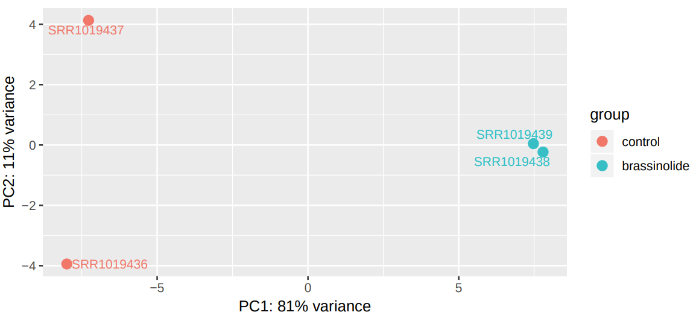
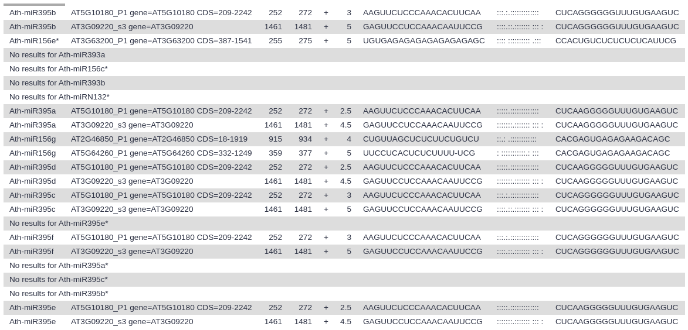

# Introduction


As sessile organisms, the survival of plants under adverse environmental conditions depends, to a large extent, on their ability to perceive stress stimuli and respond appropriately to counteract the potentially damaging effects. Coordination of phytohormones and reactive oxygen species are considered a key element for enhancing stress resistance, allowing fine-tuning of gene expression in response to environmental changes (, ). These molecules constitute complex signalling networks, endowing with the ability to respond to a variable natural environment.

Brassinosteroids (BRs) are a group of plant steroid hormones essential for plant growth and development, as well as for controlling abiotic and biotic stress. Structurally, BRs are polyhydroxylated sterol derivatives with close similarity to animal hormones (Figure 1). This group of phytohormones is comprised of around 60 different compounds, of which brassinolide (BL), 24-epibrassinolide (EBR), and 28-homobrassinolide (HBR) are considered the most bioactive.


Several recent studies suggest that the BR-mediated gene regulatory networks have the potential to reshape the future of agriculture, not only by alleviating the antagonistic effect diverse abiotic stress conditios, such as drought, but also by enhancing plant growth and yield. For instance, in tomato (_Solanum lycopersicum_), EBR treatment enhances drought tolerance, improving photosynthetic capacity, leaf water status, and antioxidant defense (). In pepper (_Capsicum annuum_), BL treatment increased the efficiency of light utilization under drought (). Gram (_Cicer arietinum_) plants exposed to drought stress and treated with BL showed significant increases in weight (). However, the mechanisms of BRs action in enhancing plant tolerance to abiotic stresses still remain largely unknown.

MicroRNAs (miRNAs), mainly 20–22 nucleotide small RNAs (sRNAs), are characterized for regulating gene expression at the post-transcriptional level. miRNAs are distinguished from other sRNAs by being generated from precursor harboring an imperfect stem‐loop structure. Unlike in animals, the pre-processing of plant miRNA occurs in the nucleus (Figure 2). The pre-miRNAs are then exported to the cytoplasm after methylation and incorporated into the Argonaute 1 protein to form RISC (RNA-induced silencing complex). The miRNA itself does not have the ability to cleave mRNAs or interfere with translation, but it plays a role in scanning the appropriate target.


.")


miRNAs have been found to be important regulators of many physiological processes, such as stress and hormonal responses. Four factors justify the miRNAs to be considered as master regulators of the plant response to the surrounding environment:

- Multiple miRNA genes are regulated under given environmental conditions
- Computational predictions estimate that each miRNA regulates hundreds of genes
- The majority of plant miRNAs regulate genes encoding for transcription factors (TFs)
- Targets include not only mRNAs but also long noncoding RNAs (lncRNAs)

In plants, miRNAs can silence targets through RNA degradation as well as translational repression pathways, and unlike animals, a large proportion of miRNA and their targets have less than four mismatches. This feature has been exploited for developing miRNAs target prediction tools, providing an efficient approach to elucidate the miRNA-mediated regulatory networks, which can contribute to biotechnological solutions to improve crops productivity.

In this tutorial, inspired by , we aim to explore the interplay between brassinosteroids and the miRNA-gene silencing pathway, considered one of the most versatile regulatory mechanisms in response to stressful situations in plants.


> <agenda-title></agenda-title>
>
> In this tutorial, we will cover:
>
> 1. TOC
> {:toc}
>
{: .agenda}

# Experimental design

The main objective of this training is to identify potential targets of miRNAs whose expression is induced by brassinosteroids. Our starting hypothesis is that there must be brassinosteroid-induced miRNAs that have high sequence complementarity with mRNAs whose expression is inhibited in the presence of these hormones (Figure 3).


# Background on data

The datasets to be used in this training can be classified into three groups: miRNA reads, mRNA reads and additional datasets.

### miRNA reads

The miRNA datasets consist of six FASTQ files, obtained by using the Illumina GAxII sequencing platform. The plant samples were obtained from wild-type Ws-2 seedlings treated with mock or 1 μM EBR for 90 min before harvest. The original datasets are available in the NCBI SRA database, with the accession number [SRP258575](https://www.ncbi.nlm.nih.gov/sra?term=SRP258575). As in the previous case, for this tutorial, we will use a reduced version of the data.


### mRNA reads

The mRNA datasets consist of four FASTQ files, generated through the Illumina HiSeq 2000 sequencing system. The samples were obtained from wild-type Columbia (Col-0) seedlings treated with mock or 100 nM BL for 4 hours. The original datasets are available in the NCBI SRA database, with the accession number [SRP032274](https://www.ncbi.nlm.nih.gov/sra?term=SRP032274). For this tutorial, subsets from the original data were generated in order to reduce the analysis run time.


### Additional datasets

In addition to the RNA-Seq reads obtained from the NCBI database, we will use datasets from two sources:

- [AtRTD2](https://ics.hutton.ac.uk/atRTD/) is a high-quality transcript reference dataset developed to exploit the accuracy of transcript quantification tools such as __Salmon__ and __Kallisto__ in analyzing _Arabidopsis_ RNA-Seq data.
- [PmiREN](http://pmiren.com/) is a comprehensive functional plant miRNA database that includes more than 20,000 annotated miRNAs diverse plant species.

# Get data

The first step of our analysis consists of retrieving the miRNA-Seq datasets from Zenodo and organizing them into collections.

> <hands-on-title>Retrieve miRNA-Seq and mRNA-Seq datasets</hands-on-title>
>
> 1. Create a new history for this tutorial
> 2. Import the files from Zenodo:
>
>    - Open the file  __upload__ menu
>    - Click on __Rule-based__ tab
>    - *"Upload data as"*: `Collection(s)`
>    - Copy the following tabular data, paste it into the textbox and press <kbd>Build</kbd>
>
>      ```
>      SRR11611349	Control miRNA	https://zenodo.org/record/4710649/files/SRR11611349_MIRNASEQ_CTL.fastqsanger.gz	fastqsanger.gz
>      SRR11611350	Control miRNA	https://zenodo.org/record/4710649/files/SRR11611350_MIRNASEQ_CTL.fastqsanger.gz	fastqsanger.gz
>      SRR11611351	Control miRNA	https://zenodo.org/record/4710649/files/SRR11611351.MIRNASEQ_CTLfastqsanger.gz	fastqsanger.gz
>      SRR11611352	BR treated miRNA	https://zenodo.org/record/4710649/files/SRR11611352_MIRNASEQ_BL.fastqsanger.gz	fastqsanger.gz
>      SRR11611353	BR treated miRNA	https://zenodo.org/record/4710649/files/SRR11611353_MIRNASEQ_BL.fastqsanger.gz	fastqsanger.gz
>      SRR11611354	BR treated miRNA	https://zenodo.org/record/4710649/files/SRR11611354_MIRNASEQ_BL.fastqsanger.gz	fastqsanger.gz
>      SRR1019436	Control mRNA	https://zenodo.org/record/4710649/files/SRR1019436_RNASEQ_CTL.fastqsanger.gz	fastqsanger.gz
>      SRR1019437	Control mRNA	https://zenodo.org/record/4710649/files/SRR1019437_RNASEQ_CTL.fastqsanger.gz	fastqsanger.gz
>      SRR1019438	BR treated mRNA	https://zenodo.org/record/4710649/files/SRR1019438_RNASEQ_BL.fastqsanger.gz	fastqsanger.gz
>      SRR1019439	BR treated mRNA	https://zenodo.org/record/4710649/files/SRR1019439_RNASEQ_BL.fastqsanger.gz	fastqsanger.gz
>      ```
>
>    - From **Rules** menu select `Add / Modify Column Definitions`
>       - Click `Add Definition` button and select `List Identifier(s)`: column `A`
>
>         > <tip-title>Can't find <i>List Identifier</i>?</tip-title>
>         > Then you've chosen to upload as a 'dataset' and not a 'collection'. Close the upload menu, and restart the process, making sure you check *Upload data as*: **Collection(s)**
>         {: .tip}
>
>       - Click `Add Definition` button and select `Collection Name`: column `B`
>       - Click `Add Definition` button and select `URL`: column `C`
>       - Click `Add Definition` button and select `Type`: column `D`
>
>    - Click `Apply` and press <kbd>Upload</kbd>
>
> 
{: .hands_on}

Next we will retrieve the remaining datasets.

> <hands-on-title>Retrieve the additional datasets</hands-on-title>
>
> 1. Import the files from Zenodo:
>
>    - Open the file  __upload__ menu
>    - *"Upload data as"*: `Datasets`
>    - Once again, copy the tabular data, paste it into the textbox and press <kbd>Build</kbd>
>
>      ```
>      annotation_AtRTD2.gtf	https://zenodo.org/record/4710649/files/annotation_AtRTD2_19April2016.gtf.gz
>      transcriptome.fasta	https://zenodo.org/record/4710649/files/transcriptome_AtRTD2_12April2016.fasta.gz
>      star_miRNA_seq.fasta	https://zenodo.org/record/4710649/files/star_miRNA_seq.fasta
>      mature_miRNA_AT.fasta	https://zenodo.org/record/4710649/files/mature_miRNA_AT.fasta
>      miRNA_stem-loop_seq.fasta	https://zenodo.org/record/4710649/files/miRNA_stem-loop_seq.fasta
>      ```
>
>    - From **Rules** menu select `Add / Modify Column Definitions`
>       - Click `Add Definition` button and select `Name`: column `A`
>       - Click `Add Definition` button and select `URL`: column `B`
>    - Click `Apply` and press <kbd>Upload</kbd>
>
>
{: .hands_on}

> <details-title>Dataset subsampling</details-title>
>
> As indicated above, for this tutorial the depth of the samples was reduced in order to speed up the time needed to carry out the analysis. This was done as follows:
>
> > <hands-on-title>Dataset subsampling</hands-on-title>
> >
> > 1.  with the following parameters:
> >    -  *"Multiple datasets"*: Each of the fastq files
> >    - *"Subsampling approach"*: `Take every N-th sequence (or pair e.g. every fifth sequence)`
> >    - *"N"*: `100`
> {: .hands_on}
>
> In this way, we will only take 1% of reads at a random sampling rate.
{: .details}


# miRNA data analysis

Once we have imported the data, we can begin to study how brassinosteroid exposure alters gene expression patterns.

## Quality assessment of miRNA reads

Due to technical limitations, sequencing is considered an error-prone process. In Illumina sequencing platforms, substitution type miscalls are the dominant source of errors, which can lead to inconsistent results. Another factor that can interfere with our analyses is the presence of adapter contaminants, which can result in an increased number of unaligned reads, since the adapter sequences are synthetic and do not occur in the genomic sequence.

Sequence quality control is therefore an essential first step in your analysis. We will use two popular tools for evaluating the quality of our raw reads: __FastQC__ and __MultiQC__.

> <comment-title></comment-title>
> In order to visualize the data from both collections together in the __MultiQC__ tool, it will be necessary to combine the results generated by __FastQC__.
> For more information on the topic of quality control, please see our [dedicated training materials]().
{: .comment}

> <hands-on-title>Initial quality check</hands-on-title>
>
> 1.  with the following parameters:
>    -  *"Dataset collection"*: `Control miRNA`
> 2. Rename the outputs as `FastQC unprocessed control miRNA: RawData` and `FastQC unprocessed control miRNA: Webpage`
> 3. Repeat the previous steps with the `BR treated miRNA` collection.
> 4.  with the following parameters:
>    - In *"Input collections"*:
>        - *"1.Input Collections"*: `FastQC unprocessed control miRNA: RawData`
>        - *"2.Input Collections"*: `FastQC unprocessed BR treated mRiNA: RawData`
> 5.  with the following parameters:
>    - In *"Results"*:
>      - *"Which tool was used generate logs?"*: `FastQC`
>      -  *"Dataset collection"*: select the output generated in the previous step.
>    - In *"Report title"*: `miRNA initial quality check`
> 4. Click on the  (eye) icon and inspect the generated HTML file
>
{: .hands_on}


> <question-title></question-title>
>
> Based on the information provided by __MultiQC__, is it necessary to trimming/filtering the reads?
>
> > <solution-title></solution-title>
> >
> > The report generated by __MultiQC__ indicates that three quality parameters show values outside the recommended limits: per sequence G/C content, overrepresented sequences and adapter content.
> >
> > 
> > 
> > 
> >
> > Particularly remarkable is the content of adapters, which are up to 80% of the reads in some samples. Given the abundance of adapters, one would expect that if we eliminate this source of contamination, the rest of the parameters would show a noticeable improvement.
> >
> {: .solution}
{: .question}

To remove the adapters contamination, we will employ the __Trim Galore__ tool, a wrapper script around [__Cutadapt__](https://journal.embnet.org/index.php/embnetjournal/article/view/200) and __FastQC__ which automates quality and adapter trimming.

> <hands-on-title>Trimming of adapter sequences</hands-on-title>
>
> 1.  with the following parameters:
>    - *"Is this library paired- or single-end?"*: `Single-end`
>        -   *"Reads in FASTQ format"*: `Control miRNA`
>        - *"Adapter sequence to be trimmed"*: `Illumina small RNA adapters`
> 2. Rename the output collection as `Control miRNA trimmed`
> 3. Repeat the previous steps with the `BR treated miRNA` collection.
>
{: .hands_on}

Next, we will reassess the quality of the sequences to check if the adapters have been removed.

> <hands-on-title>Post-processing quality check</hands-on-title>
>
> 1.  with the following parameters:
>    -  *"Dataset collection"*: `Control miRNA trimmed`
> 2. Rename the outputs as `FastQC processed control miRNA: RawData` and `FastQC processed control miRNA: Webpage`
> 3. Repeat the previous steps with the `BR treated miRNA trimmed` collection.
> 4.  with the following parameters:
>    - In *"Input collections"*:
>        - *"1.Input Collections"*: `FastQC processed control miRNA: RawData`
>        - *"2.Input Collections"*: `FastQC processed BR treated miRNA: RawData`
> 5.  with the following parameters:
>    - In *"Results"*:
>      - *"Which tool was used generate logs?"*: `FastQC`
>      -  *"Dataset collection"*: select the output generated in the previous step.
>    - In *"Report title"*: `miRNA trimmed quality check`
> 4. Click on the  (eye) icon and inspect the generated HTML file
>
{: .hands_on}

The evaluation of the report generated by __MultiQC__ after having processed the samples by __Trim Galore__ indicates that the G/C content has been successfully corrected, and that the adapter contamination has been eliminated. However, the samples still show a high degree of over-represented sequences (Figure 7).


> <question-title></question-title>
>
> What do you think could be the cause of the high number of over-represented sequences?
>
> > <solution-title></solution-title>
> >
> >  Two of the factors that may determine the abundance of overrepresented sequences are the existence of highly expressed miRNAs (Seco-Cervera et al. 2018), the existence of highly conserved sequence motifs within the miRNA (), and contamination with foreign sequences.
> >
> {: .solution}
{: .question}


## miRNA quantification: **MiRDeep2**

Quantification of miRNAs requires to use two different tools:
- The __MiRDeep2 Mapper__ tool for preprocessing the reads.
- The __MiRDeep2 Quantifier__  tool for mapping the deep sequencing reads to predefined miRNA precursors and determining the expression of the corresponding miRNAs. It is carried out in two steps: firstly, the predefined mature miRNA sequences are mapped to the predefined precursors (optionally, predefined star sequences can be mapped to the precursors too). And second, the deep sequencing reads are mapped to the precursors.

> <hands-on-title>Quantification of miRNAs</hands-on-title>
>
> 1.  with the following parameters:
>    -  *"Deep sequencing reads"*: `Control miRNA trimmed`
>    - *"Remove reads with non-standard nucleotides"*: `Yes`
>    - *"Clip 3' Adapter Sequence"*: `Don't Clip`
>    - *"Collapse reads and/or Map"*: `Collapse`
> 2. Rename the output as `Collapsed control miRNA`
> 3. Repeat the previous stages by providing `BR treated miRNA trimmed`as input, and rename it as `Collapsed BR treated miRNA`.
>
> 4.  with the following parameters:
>    -  *"Collapsed deep sequencing reads"*: `Collapsed control miRNA`
>    -  *"Precursor sequences"*: `miRNA_stem-loop_seq.fasta`
>    -  *"Mature miRNA sequences"*: `mature_miRNA_AT.fasta`
>    -  *"Star sequences"*: `star_miRNA_seq.fasta`
> 5. Rename the outputs as `MiRDeep2 control miRNA` and `MiRDeep2 control miRNA (html)`.
> 6. Repeat the fourth step by providing `Collapsed BR treated miRNA` as input, and rename the outputs as `MiRDeep2 BR treated miRNA` and `MiRDeep2 BR treated miRNA (html)`
>
{: .hands_on}

To use the outputs generated by __MiRDeep2 Quantifier__ in the differential expression analysis, it is necessary to modify the datasets.

> <hands-on-title>Edition of MiRDeep2 Quantifier outputs</hands-on-title>
>
> 1.  with the following parameters:
>    - *"Cut columns"*: `c1,c2`
>    - *"Delimited by"*: `Tab`
>    -  *"From"*: `MiRDeep2 control miRNA`
> 2. Rename the output as `control miRNA counts`
> 3.   with the following parameters:
>    - *"Cut columns"*: `c1,c2`
>    - *"Delimited by"*: `Tab`
>    -  *"From"*: `MiRDeep2 BR treated miRNA`
> 4. Rename the output as `BR treated miRNA counts`
>
{: .hands_on}

## Differential expression analysis of miRNAs: **DESeq2**

__DESeq2__ is a tool for differential gene expression analysis based on a negative binomial generalized linear model. __DESeq2__ internally corrects the differences in library size, due to which no preliminary normalization of input datasets is required.

> <comment-title></comment-title>
> It is desirable to use at least three replicates of each experimental condition to ensure sufficient statistical power.
>
{: .comment}

> <hands-on-title>Differential expression analysis using DESeq2</hands-on-title>
>
> 1.  with the following parameters:
>    - *"How"*: `Select datasets per level`
>        - In *"Factor"*:
>            -  *"Insert Factor"*
>                - *"Specify a factor name, e.g. effects_drug_x or cancer_markers"*: `effects_brassinolide`
>                - In *"Factor level"*:
>                    -  *"Insert Factor level"*
>                        - *"Specify a factor level"*: `brassinolide`
>                        -  *"Counts file(s)"*: `BR treated miRNA counts`
>                    -  *"Insert Factor level"*
>                        - *"Specify a factor level"*: `control`
>                        -  *"Counts file(s)"*: `control miRNA counts`
>    - *"Files have header?"*: `No`
>    - *"Choice of Input data"*: `Count data (e.g. from HTSeq-count, featureCounts or StringTie)`
> 2. Rename the outputs as `DESeq2 results miRNA` and `DESeq2 plots miRNA`
> 3. Click on the  (eye) icon and inspect the `DESeq2 plots miRNA` file
{: .hands_on}

DESeq2 generated 2 outputs: a table with the normalized counts and a graphical summary of the results. To evaluate the similarity of our samples, we are going to inspect the Principal Component Analysis (PCA) plot. PCA allows evaluating the dominant directions of the highest variability in the data. Thus, the samples subjected to the same conditions should cluster together.


As can be seen, the main axes account for only 47% and 19% of the total variation. This suggests that the effect of brassinosteroids on miRNA regulation is limited (Figure 8).

## Filter significantly differentially expressed miRNAs

Next, we will extract those genes whose expression is statistically significantly differentially expressed (DE) due to BR treatment by selecting those whose adjusted p-value is less than or 0.05. A cut-off value of 0.05 indicates that the probability of a false positive result is less than 5%.

> <details-title>p-value vs p-adj</details-title>
>
> The p-value is a measure of the probability that an observed difference could have occurred just by random chance. A small p-value indicates that there is a small chance of getting this data if no real difference existed. A p-value threshold of 0.05 indicates that there is a 5% chance that the result is a false positive. The p-adj (also known as q-value) is an adjusted p-value which taking in to account the false discovery rate (FDR). Applying a FDR becomes necessary when we're measuring thousands of variables from a small sample set.
>
{: .details}

> <hands-on-title>Filter differentially expressed miRNAs</hands-on-title>
>
> 1.  data on any column using simple expressions (Galaxy Version 1.1.1) with the following parameters:
>    -  *"Filter"*: `DESeq2 results miRNA`
>    - *"With following condition"*: `c7<0.05`
>
{: .hands_on}

> <question-title></question-title>
>
> How many miRNAs show statistically significant differential expression?
>
> > <solution-title></solution-title>
> >
> > Unfortunately, we have not detected any differentially expressed miRNAs. In this case, this is caused by the fact that the subsampled datasets don't have sufficient read depth to test for differential expression.
> {: .solution}
>
{: .question}

To get any sensible results, it is worth analyzing the full dataset. You can analyze the full datasets following the above tutorial. Otherwise, you can import the DESeq2 analysis results that we generated from full dataset into your history.

> <hands-on-title>Retrieve the DESeq2 analysis results on full miRNA dataset</hands-on-title>
>
> 1. Import the files from Zenodo:
>
>    - Open the file  __upload__ menu
>    - Click of the **Paste/Fetch** button
>    - Copy the Zenodo links and press <kbd>Start</kbd>
>
>      ```
>      https://zenodo.org/record/4663389/files/miRNA_DESeq2_results_complete_dataset.tabular
>      ```
>
> 2. Rename each dataset according to the sample id (e.g. `miRNA_DESeq2_results_complete_dataset`)
> 3. Add all miRNA data analysis related tags: #miRNA #BR #control
{: .hands_on}

Repeat the filtering step on the imported DESeq2 result.

> <hands-on-title>Filter and sort differentially expressed miRNAs from the full dataset</hands-on-title>
>
> {: .comment}
> 1.  data on any column using simple expressions (Galaxy Version 1.1.1) with the following parameters:
>    -  *"Filter"*: `miRNA_DESeq2_results_complete_dataset`
>    - *"With following condition"*: `c7<0.05`
> 2. Rename the output as `Differentially expressed miRNAs`
> 3.  data on any column using simple expressions (Galaxy Version 1.1.1) with the following parameters:
>    -  *"Filter"*: `Differentially expressed miRNAs`
>    - *"With following condition"*: `c3<0`
> 4. Rename the output as `Upregulated miRNAs`
> 5.  data in ascending or descending order (Galaxy Version 1.1.0) with the following parameters:
>    -  *"Sort Dataset"*: `Upregulated miRNAs`
>    - *"on column"*: `Column: 3`
>    - *"everything in"*: `Ascending order`
{: .hands_on}

> <question-title></question-title>
>
> 1. How many miRNAs are differentially expressed?
> 2. How many miRNAs show statistically significant upregulation and what are the most upregulated miRNA?
>
> > <solution-title></solution-title>
> >
> > 1. Out of 442 miRNAs, 39 show significant differential expression.
> > 2. There are 23 upregulated miRNAs and the `Ath-miR169` family members are the most upregulated ones.
> {: .solution}
>
{: .question}

Experimental results indicate that at least one member of the ath-miR-169 family is induced significantly by saline stress ().

# mRNA data analysis

Once the differential expression analysis of miRNAs has been carried out, the next stage is to analyze how mRNA expression is altered in response to brassinosteroids.

## Quality assessment of mRNA reads

As in the previous section, we shall begin by assessing the quality of our sequences.

> <hands-on-title>Initial quality check</hands-on-title>
>
> 1.  with the following parameters:
>    -  *"Dataset collection"*: `Control mRNA`
> 2. Rename the outputs as `FastQC unprocessed control mRNA: RawData` and `FastQC unprocessed control mRNA: Webpage`
> 3. Repeat the previous step with the `BR treated mRNA` collection.
> 4.  with the following parameters:
>    - In *"Input collections"*:
>        - *"1.Input Collections"*: `FastQC unprocessed control mRNA: RawData`
>        - *"2.Input Collections"*: `FastQC unprocessed BR treated mRNA: RawData`
> 5.  with the following parameters:
>    - In *"Results"*:
>      - *"Which tool was used generate logs?"*: `FastQC`
>      -  *"Dataset collection"*: select the output generated in the previous step.
>    - *"Report title"*: `mRNA initial quality check`
> 4. Click on the  (eye) icon and inspect the generated HTML file
>
{: .hands_on}

> <question-title></question-title>
>
> Are there any stats that indicate the need to process the samples in order to improve their quality?
>
> > <solution-title></solution-title>
> >
> > All the stats are within acceptable limits. However, the adapter content shows the presence of Illumina universal adapters in our reads, which can be removed to avoid possible interferences at later stages (Figure 10).
> >
> >    
> >
> {: .solution}
{: .question}

> <comment-title></comment-title>
> Although our samples have adapters, we are not going to trim them in this case. We will explain the reason in the next section.
{: .comment}

## Quantification of gene expression: **Salmon**

After performing the quality assessment of the reads, we can move on to quantifying the gene expression. The aim of this step is to identify which transcript each read comes from and the total number of reads associated with each transcript. In this tutorial, we will use the Salmon tool () for the quantification of mRNA transcripts.


One of the characteristics of __Salmon__ is that it doesn't require performing a base-to-base alignment, which is the time-consuming step of tools such as __STAR__ and __HISAT2__. Salmon relies on the quasi-mapping concept, a new mapping technique that allows the rapid and accurate mapping of RNA-Seq reads to a target transcriptome. Rather than a standard alignment, quasi-mapping seeks to find the best mappings for each read, and does so by finding minimal collections of dynamically sized, right-maximal, matching contexts between target and query positions ()

The quasi-mapping approach by __Salmon__ requires a reference index to determine the position and orientation information for accurate mapping prior to quantification. It allows providing the transcriptome in a format that optimizes its use in transcript identification and quantification.

After determining the best mapping for each read, __Salmon__  generates the final transcript abundance estimation after modeling sample-specific parameters and biases. Reads that map equally well to more than one transcript will have the count divided between all of the mappings, thus avoiding the loss of information on the different gene isoforms.


> <details-title>Quasi-mapping algorithm</details-title>
> The quasi-mapping algorithm makes use of two main data structures, the generalized suffix array (SA) of the transcriptome T, and a hash table (h) that maps each k-mer in T to its SA interval (by default k = 31). During the quasi-mapping procedure, a read is scanned from left to right until a k-mer (k<sub>i</sub>, starting at position i on the read) is encountered that appears in h. The k<sub>i</sub> is looked up in the hash table and the SA intervals are retrieved, giving all suffixes containing the k-mer k<sub>i</sub>. Then, the Maximal Mappable Prefix (MMP<sub>i</sub>) is computed by finding the longest substring of the read that matches the reference suffixes. Owing to sequencing errors, the MMPs may not span the complete read. In this case, the next informative position (NIP) is determined based on the longest common prefix of the SA intervals of MMP<sub>i</sub>. Suffix array search continues from k-bases before NIP until the final NIP is less than k-bases before the read end. Finally, for each read, the algorithm reports the transcripts it mapped to, location and strand information ().
> . The base 'G' at position 6 in the read is a result of sequencing error. Hence, the MMP<sub>i</sub> is 'ATTGA' and the SA interval of MMP<sub>i</sub> is [b', e'). The next k-mer starts at k-bases prior to the NIP which is base after the longest common prefix of the interval [b',e'). In the end, the read in the above example most likely map to the suffix array at [e'-1, e').")
>
{: .details}


> <hands-on-title>Quantify gene expression with Salmon</hands-on-title>
>
> 1.  with the following parameters:
>    - *"Select salmon quantification mode:"*: `Reads`
>        - *"Select a reference transcriptome from your history or use a built-in index?"*: `Use one from the history`
>            - In *"Salmon index"*:
>                -  *"Transcripts fasta file"*: `transcriptome.fasta`
>        - In *"Data input"*:
>            - *"Is this library mate-paired?"*: `Single-end`
>                -  *"FASTQ/FASTA file"*: `Control mRNA`
>        - *"Validate mappings"*: `Yes`
>    -  *"File containing a mapping of transcripts to genes"*: `annotation_AtRTD2.gtf`
>
> 2. Rename the outputs as `Salmon control mRNA (Quantification)` and `Salmon control mRNA (Gene Quantification)`
> 3. Repeat the previous procedure by using the `BR treated mRNA` dataset
>
>   > <comment-title>Quasi-mapping sequence requirements</comment-title>
>   > Trimming the reads is not required  when using this method, since if there are k-mers in the reads that are not in the hash table, they are not counted. Quantification of the reads is only as good as the quality of the reference transcriptome.
>   {: .comment}
>
{: .hands_on}

__Salmon__ generates two outputs for each input sample:

- Quantification: summarizes the quantifications by transcript
- Gene quantification: summarizes the quantification by gene

Each output consists of a tabular dataset with five columns:


------------------| ----------
Field             | Description
------------------| ----------
Name              | The name of the target transcript provided in the input transcriptome.
Length            | The length of the target transcript.
EffectiveLength   | The computed effective length.
TPM               | The relative abundance of this transcript in units of Transcripts Per Million.
NumReads          | The number of reads mapping to each transcript that was quantified.
------------------| ----------


> <question-title></question-title>
>
> Could you explain why we did not trim the reads before?
>
> > <solution-title></solution-title>
> >
> > The reason is that, since the k-mers which contain the adaptor sequences are not present in the transcriptome (from which the hash table is generated), they are omitted.
> >
> {: .solution}
>
{: .question}

## Differential expression analysis of mRNAs: **DESeq2**

Now, let's analyze which genes show statistically significant differential expression in response to brassinosteoids.

> <hands-on-title>Differential expression analysis using DEseq2</hands-on-title>
>
> 1.  with the following parameters:
>    - *"How"*: `Select datasets per level`
>        - In *"Factor"*:
>            -  *"Insert Factor"*
>                - *"Specify a factor name, e.g. effects_drug_x or cancer_markers"*: `effects_brassinolide`
>                - In *"Factor level"*:
>                    -  *"Insert Factor level"*
>                        - *"Specify a factor level"*: `brassinolide`
>                        -  *"Counts file(s)"*: `Salmon BR treated mRNA (Gene Quantification)`
>                    -  *"Insert Factor level"*
>                        - *"Specify a factor level"*: `control`
>                        -  *"Counts file(s)"*: `Salmon control mRNA (Gene Quantification)`
>    - *"Choice of Input data"*: `TPM values (e.g. from kallisto, sailfish or salmon)`
>        - *"Program used to generate TPMs"*: `Salmon`
>        - *"Gene mapping format"*: `GTF/GFF3`
>            -  *"GTF/GFF3 annotation file"*: `annotation_AtRTD2.gtf`
> 2. Rename the outputs as `DESeq2 results mRNA` and `DESeq2 plots mRNA`
{: .hands_on}



> <question-title></question-title>
>
> What conclusions about the similarity of the samples can be derived from the PCA plot?
>
> > <solution-title></solution-title>
> >
> > From the information provided by the plot, it is possible to state that there is a high similarity between the samples belonging to the same experimental conditions, since the first dimension (x-axis) allows to explain 81% of the variability, and the samples are located at opposite ends of the x-axis.
> >
> {: .solution}
>
{: .question}

## Filter significantly differentially expressed mRNAs

To conclude the analysis of the differential expression of mRNAs, we will extract those transcripts that show a significant induction of expression in response to brassinosteroids. Before continuing with further analysis, similar to miRNA data analysis, import the DESeq2 results generated from full mRNA datasets.

> <hands-on-title>Retrieve the DESeq2 analysis results on full mRNA dataset</hands-on-title>
>
> 1. Import the files from Zenodo:
>
>    - Open the file  __upload__ menu
>    - Click of the **Paste/Fetch** button
>    - Copy the Zenodo links and press <kbd>Start</kbd>
>
>      ```
>      https://zenodo.org/record/4663389/files/mRNA_DESeq2_results_complete_dataset.tabular
>      ```
>
> 2. Rename each dataset according to the sample id (e.g. `mRNA_DESeq2_results_complete_dataset`)
> 3. Add all mRNA data analysis related tags: #mRNA #BR #control
{: .hands_on}

Now we continue with the DE genes analysis.

> <hands-on-title>Extract significantly DE genes</hands-on-title>
>
> 1.  data on any column using simple expressions (Galaxy Version 1.1.1) with the following parameters:
>    -  *"Filter"*: `mRNA_DESeq2_results_complete_dataset`
>    - *"With following condition"*: `c7<0.05`
> 2. Rename the output as `Differentially expressed mRNAs`
>
> 3. data on any column using simple expressions (Galaxy Version 1.1.1) with the following parameters:
>    -  *"Filter"*: `Differentially expressed mRNAs`
>    - *"With following condition"*: `c3<-1`
> 4. Rename it as `Upregulated mRNAs`
>
> 5.  data on any column using simple expressions (Galaxy Version 1.1.1) with the following parameters:
>    -  *"Filter"*: `Differentially expressed mRNAs`
>    - *"With following condition"*: `c3>1`
> 6. Rename it as `Downregulated mRNAs`
>
{: .hands_on}

> <question-title></question-title>
>
> 1. How many genes show statistically significant differential expression?
> 2. How many of them are significantly upregulated (at least two-fold change)? And downregulated?
> 3. What is the most significantly DE downregulated gene and what is it biological function?
>
> > <solution-title></solution-title>
> >
> > 1. The total number of genes whose expression differential between the two experimental conditions is 4176.
> > 2. Of them, 328 are significantly upregulated by the BR treatment and 778 are downregulated.
> > 3. The most significantly DE gene is AT3G30180 (BR60X2). BR60X2 encodes a cytochrome p450 enzyme that catalyzes the last reaction in the production of brassinolide. It is capable of converting 6-deoxocastasterone into castasterone, a C-6 oxidation, as well as the further conversion of castasterone into brassinolide (source: [TAIR database](https://www.arabidopsis.org/servlets/TairObject?name=at3g30180&type=locus)).
> {: .solution}
>
{: .question}

# Identification of miRNA targets

To predict which miRNAs target which mRNAs, first we need their transcriptomic sequences in FASTA format. Now we will obtain the sequences of miRNAs whose expression is induced by brassinosteroids.

> <hands-on-title>Obtaining the sequences of upregulated miRNAs</hands-on-title>
> > <comment-title></comment-title>
> >
> > The following tools can be found in _Text Manipulation_ and _Filter and Sort_ sections.
> >
> {: .comment}
>
> 1.  with the following parameters:
>    - *"Cut columns"*: `c1`
>    - *"Delimited by"*: `Tab`
>    -  *"From"*: `Upregulated miRNAs`
> 2. Rename the output as `Upregulated miRNA ids`
> 3.  with the following parameters:
>    -  *"FASTA sequences"*: `mature_miRNA_AT.fasta`
>    - *"Criteria for filtering on the headers"*: `List of IDs`
>        -  *"List of IDs to extract sequences for"*: `Upregulated miRNA ids`
>        - *"Match IDs by"*: `Default: ID is expected at the beginning: >ID`
> 4.  with the following parameters:
>    -  *"FASTA sequences"*: `star_miRNA_seq.fasta`
>    - *"Criteria for filtering on the headers"*: `List of IDs`
>        -  *"List of IDs to extract sequences for"*: `Upregulated miRNA ids`
>        - *"Match IDs by"*: `Default: ID is expected at the beginning: >ID`
> 5.  tail-to-head (Galaxy Version 1.0.0) with the following parameters:
>    -  *"Concatenate Dataset"*: output of **Filter FASTA**  on `mature_miRNA_AT.fasta`
>    - + Insert Dataset
>        -  *"Select"*: output of **Filter FASTA**  on `star_miRNA_seq.fasta`
> 6. Rename it as `Upregulated miRNA sequences`
> 7. Click on the  (eye) icon and inspect the `Upregulated miRNA sequences` file
{: .hands_on}

To identify putative targets of upregulated miRNAs, it is necessary to obtain the sequences of all downregulated mRNAs in FASTA format.

> <hands-on-title>Obtaining the gene sequences of downregulated mRNAs</hands-on-title>
> 1.  with the following parameters:
>    - *"Cut columns"*: `c1`
>    - *"Delimited by"*: `Tab`
>    -  *"From"*: `Downregulated mRNAs`
> 2. Rename the output as `Downregulated mRNA ids`
> 3.  with the following parameters:
>    -  *"FASTA sequences"*: `transcriptome.fasta` (Input dataset)
>    - *"Criteria for filtering on the headers"*: `List of IDs`
>        -  *"List of IDs to extract sequences for: `Downregulated mRNA ids`
>        - *"Match IDs by"*: `Custom regex pattern`
>           - *"Regex search pattern for ID"*: `GENE=(AT.{7})`
> 4. Rename it as `Downregulated mRNA sequences`
> 5. Click on the  (eye) icon and inspect the `Downregulated mRNA sequences`  file
{: .hands_on}

## miRNA target prediction using **TargetFinder**

We are now ready to launch the search for miRNA target genes. For this we will use the __TargetFinder__ tool that is implemented and used for miRNA target prediction in plants (, ).

> <hands-on-title>identification of potential miRNA targets</hands-on-title>
>
> 1.  with the following parameters:
>    -  *"Input small RNA sequences file"*: `Upreguled miRNA sequences`
>    -  *"Target sequence database file*": `Downregulated mRNA sequences`
>    - *"Prediction score cutoff value"*: `4.0`
>    - *"Output format"*: `Tab-delimited format`
> 2. Click on the  (eye) icon and inspect the output of **TargetFinder**.
{: .hands_on}

Congratulations! We have identified three gene-pairs potentially involved in the brassinosteroid-mediated regulatory network: AT4G14365/Ath-miR408, AT5G50570/Ath-miR156i and AT1G26890/Ath-miR156i.



Finally, we can access all the information available on the genes identified in the TAIR database:

- [AT4G14365](https://www.arabidopsis.org/servlets/TairObject?type=locus&name=AT4G14365): XB3 ORTHOLOG 4 IN ARABIDOPSIS THALIANA, XBAT34 (hypothetical protein)
- [AT5G50570](https://www.arabidopsis.org/servlets/TairObject?type=locus&name=AT5G50570): SPL13, SPL13A, SQUAMOSA PROMOTER-BINDING PROTEIN LIKE 13
- [AT1G26890](https://www.arabidopsis.org/servlets/TairObject?type=locus&name=AT1G26890): FBD, F-box and Leucine Rich Repeat domains containing protein

Both AT4G14365 and AT1G26890 are not well characterized genes. In the case of AT5G50570, experimental research have demonstrated that this gene is involved in  flooding tolerance in *Medicago sativa*, through a signaling path mediated by miR156 (). On the other hand, according to , SPL13 is likely a negative regulator of plant vegetative growth. The interaction between miR156 and SPL transcription factors has been suggested for diverse Poaceae family members ().

> <comment-title>Hypothesis testing</comment-title>
> One of the hypotheses that we could propose from our results is: the inhibition of the AT5G50570 gene can result in plants with improved resistance to drought conditions. Is it possible to validate it? Yes! We propose this approach: to acquire [AT5G50570 mutant seeds](https://abrc.osu.edu/stocks/482611) and [wild type seeds](http://arabidopsis.info/StockInfo?NASC_id=N1093), grow them under two controlled conditions: watered and drought stress, and analyze plant weight after 33 days (Figure 13).
>
> .")
>
{: .comment}

# Optional exercise

As additional activity, you can try to repeat the workflow by using the sequences stored in the NCBI GEO database with the accession number `GSE119382`. In that case, we will compare gene expression patterns of mutants overexpressing the brassinosteroid receptor BRL3 under two experimental conditions: control and drought-stress. The required datasets are available in the data library:

> <hands-on-title>Import data from the Data Libraries</hands-on-title>
> 1. Go into __Shared data__ (top panel) and click on __Data Libraries__
> 2. In the search box enter the following identifier: `4710649`
> 3. Select the following files:
> ```
> https://zenodo.org/record/4710649/files/SRR7779222_BRL3_mRNA_drought.fastqsanger.gz
> https://zenodo.org/record/4710649/files/SRR7779223_BRL3_mRNA_drought.fastqsanger.gz
> https://zenodo.org/record/4710649/files/SRR7779224_BRL3_mRNA_drought.fastqsanger.gz
> ```
> 4. Click on __Export to History__ and __as a Collection__
> 5. In the pop-up window press <kbd>Continue</kbd>
> 6. Provide it the name `BRL3 mRNA drought` and push <kbd>Create list</kbd>
> 7. Repeat the previous procedure with the remaining files:
> ```
> https://zenodo.org/record/4710649/files/SRR7779228_BRL3_mRNA_watered.fastqsanger.gz
> https://zenodo.org/record/4710649/files/SRR7779229_BRL3_mRNA_watered.fastqsanger.gz
> ```
> 9. Finally provide it the name `BRL3 mRNA control` and push <kbd>Create list</kbd>
{: .hands_on}

We will use the upregulated miRNAs obtained in the previous analysis in order to identify potential targets.

```
Upregulated miRNA   https://zenodo.org/record/4710649/files/upregulated_miRNA_BR_complete_dataset.fasta
```

# Conclusion


In this tutorial, we have analyzed RNA sequencing data to extract information about potential genes regulated by brassinosteroids. For this purpose, the approach chosen was the identification of genes complementary to miRNAs upregulated in response by brassinosteroids. The final result has been the identification of three potential miRNA targets.
