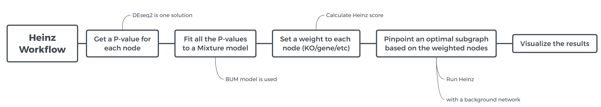
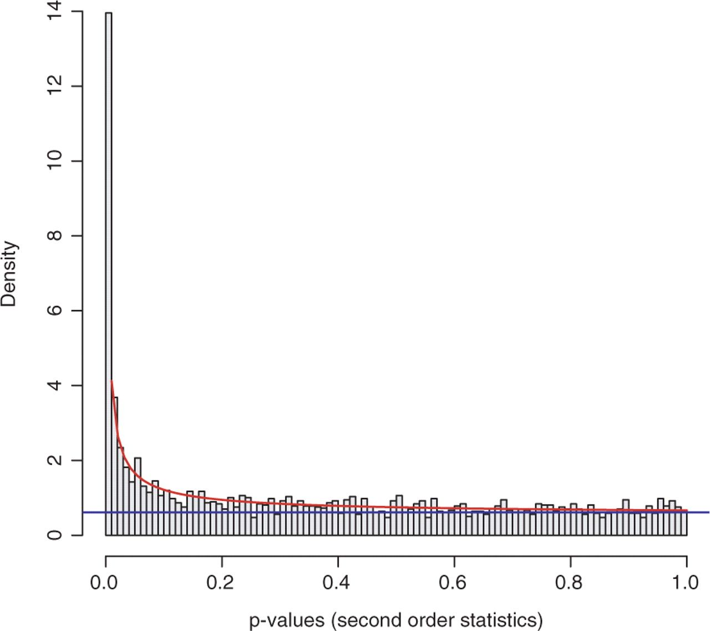
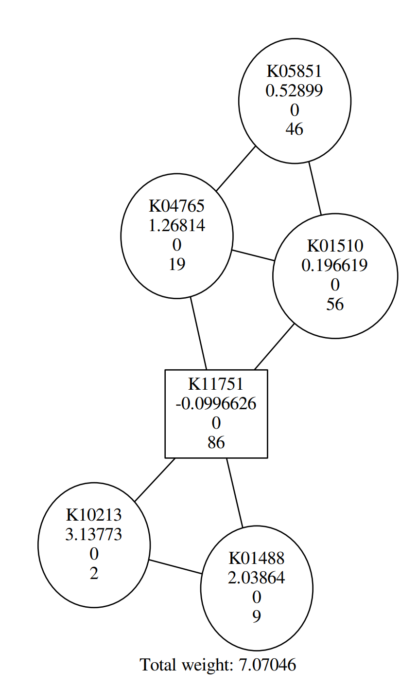
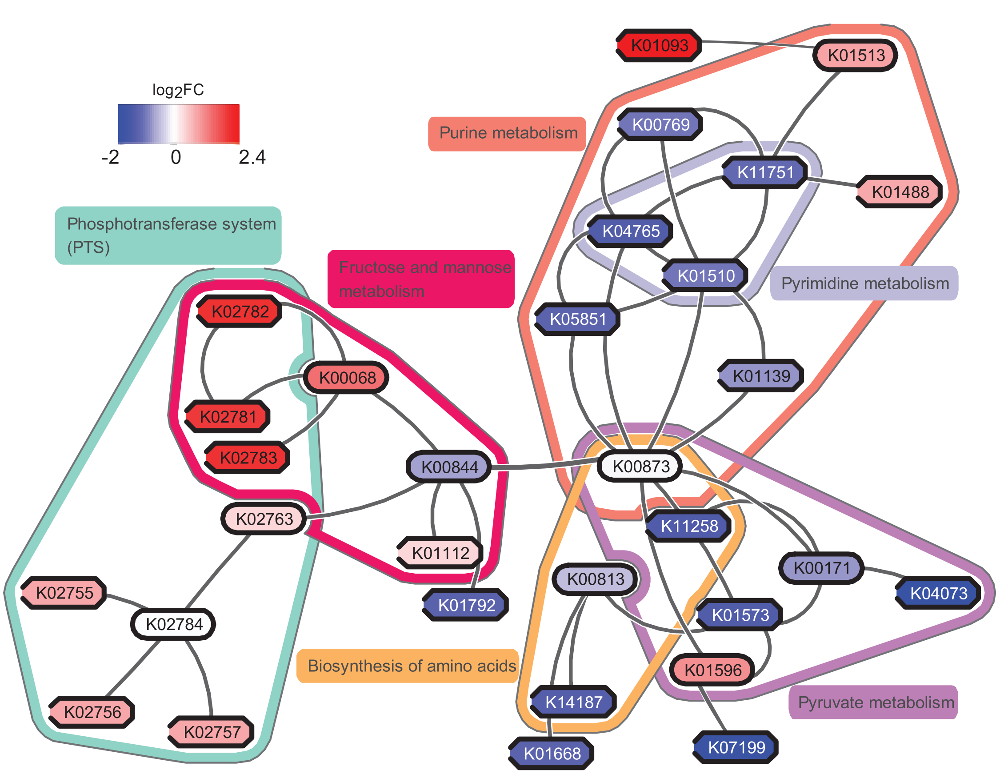
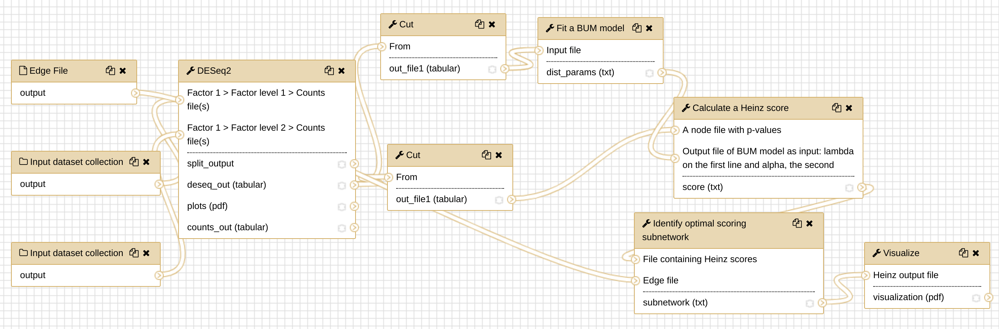

# Overview


The human microbiome plays a key role in health and disease. Thanks to comparative metatranscriptomics,
the cellular functions that are deregulated by the microbiome in disease can now be computationally
explored. Unlike gene-centric approaches, pathway-based methods provide a systemic view of such
functions; however, they typically consider each pathway in isolation and in its entirety.
They can therefore overlook the key differences that (i) span multiple pathways, (ii) contain
bidirectionally deregulated components, (iii) are confined to a pathway region. To capture these
properties, computational methods that reach beyond the scope of predefined pathways are needed.

In this tutorial, we will perform a network analysis using Heinz ([GitHub](https://github.com/ls-cwi/heinz),
[publication](https://www.ncbi.nlm.nih.gov/pmc/articles/PMC2718639/)) in Galaxy. The data comes from
the study [May et al.](https://academic.oup.com/bioinformatics/article/32/11/1678/2240171),
and we will reproduce some of the computational steps from this study with simplified data and
parameters to speed up the analysis for the purposes of this tutorial.

> <agenda-title></agenda-title>
>
> In this tutorial, we will cover:
>
> 1. TOC
> {:toc}
>
{: .agenda}





In this tutorial, we will run the Heinz workflow step by step to understand how each step works. To get an overview of what this workflow does
and what kind of calculation is involved, view the flowchart below.



# Obtaining and preparing data  [](https://doi.org/10.5281/zenodo.1344105)


The study [May et al.](https://academic.oup.com/bioinformatics/article/32/11/1678/2240171) includes the computation
steps starting from the raw RNAseq datasets. The operations that processed raw data into the interpreted data are
beyond the scope of this tutorial. To learn that, please refer to the relevant topics in the Galaxy training
material. In this tutorial, we start with the interpreted data, which are KO
([KEGG Orthology](https://www.genome.jp/kegg/ko.html)) count data. All the data needed for this tutorial are
available from Zenodo.

> <details-title>Background: What is KO count?</details-title>
>
> KOs are organism-independent identifiers that group together proteins of similar biochemical functions.
> It is a term specific to [KEGG](https://www.genome.jp/kegg/) database. It is a group concept, similar to the concept "pathway", which
> includes a bunch of molecules and their interactions. Take a random line in our dataset, "K01369 7" as an example, the first column represents the KO ID,
> and the second column --- the numeric value is the KO counts. If we understand it by the face value, it is 7 protein molecules that are counted from our dataset as this KO "K01369"; but we usually mingle proteins with genes because we often assume that each protein corresponds to a gene, so it can be understood as 7 genes. Now we are working on the microbial RNAseq data, and the assumption is also used subconsciously.
>
{: .details}

## Understanding our input data

According to the study [May et al.](https://academic.oup.com/bioinformatics/article/32/11/1678/2240171),
dental caries (DC) dataset in this tutorial came from an experiment that comprised of supragingival plaque
samples collected from all dental surfaces of 36 individuals who had either a caries-positive (disease) or
a caries-negative (health) oral profile. Each of the 36 samples was sequenced, pre-processed and transformed
into KO counts. We will use these count data as the starting point to perform the network analysis.

> <comment-title>Dataset details</comment-title>
> The count data of the 36 samples are separated into 36 files, organized into two groups:
> 'CP' (caries-positive) and 'CN' (caries-negative).
{: .comment}


## Importing the data into Galaxy

After knowing what our input data are like, let's get them into Galaxy history:

> <hands-on-title>Obtaining our data</hands-on-title>
>
> 1. Make sure we have an empty Galaxy history. Give it a sensible name.
>
>    
>    
>
> 2. **Upload Disease Dataset**
>    - Open the file upload menu
>    - Click on  **Collection** tab
>    - Click on the **Paste/Fetch data** button
>    - Copy the Zenodo links for the Disease Datasets
>      > <details-title>View list of Zenodo URLs for Dental Caries Dataset (Disease, CP)</details-title>
>      > ```
>      > https://zenodo.org/record/1344105/files/2241_CP_DZ_PairTo_2242.txt
>      > https://zenodo.org/record/1344105/files/2126_CP_MZ_PairTo_2125.txt
>      > https://zenodo.org/record/1344105/files/2991_CP_DZ_PairTo_2992.txt
>      > https://zenodo.org/record/1344105/files/2931_CP_DZ_PairTo_2930.txt
>      > https://zenodo.org/record/1344105/files/2284_CP_DZ_PairTo_2283.txt
>      > https://zenodo.org/record/1344105/files/2125_CP_MZ_PairTo_2126.txt
>      > https://zenodo.org/record/1344105/files/4131_CP_DZ_PairTo_4132.txt
>      > https://zenodo.org/record/1344105/files/2954_CP_DZ_PairTo_2955.txt
>      > https://zenodo.org/record/1344105/files/2170_CP_MZ_PairTo_2169.txt
>      > https://zenodo.org/record/1344105/files/2955_CP_DZ_PairTo_2954.txt
>      > https://zenodo.org/record/1344105/files/2011_CP_DZ_PairTo_2012.txt
>      > https://zenodo.org/record/1344105/files/2012_CP_DZ_PairTo_2011.txt
>      > https://zenodo.org/record/1344105/files/2269_CP_DZ_PairTo_2270.txt
>      > https://zenodo.org/record/1344105/files/3215_CP_MZ_PairTo_3214.txt
>      > https://zenodo.org/record/1344105/files/2354_CP_DZ_PairTo_2355.txt
>      > https://zenodo.org/record/1344105/files/3306_CP_DZ_PairTo_3307.txt
>      > https://zenodo.org/record/1344105/files/2061_CP_DZ_PairTo_2062.txt
>      > https://zenodo.org/record/1344105/files/2355_CP_DZ_PairTo_2354.txt
>      > https://zenodo.org/record/1344105/files/2242_CP_DZ_PairTo_2241.txt
>      > ```
>      {: .details}
>    - Click on **Start** to Upload the files
>    - Click **Build** once upload has completed
>    - Enter **Name**: `CP`
>    - Click **Create list** to make the collection
>
> 3. **Upload control (healthy) datasets**
>    - Repeat the previous steps with the samples from healthy individuals:
>      > <details-title>View list of Zenodo URLs for Dental Caries Dataset (Healthy, CN)</details-title>
>      > ```
>      > https://zenodo.org/record/1344105/files/2310_CN_DZ_PairTo_2309.txt
>      > https://zenodo.org/record/1344105/files/2062_CN_DZ_PairTo_2061.txt
>      > https://zenodo.org/record/1344105/files/2191_CN_MZ_PairTo_2192.txt
>      > https://zenodo.org/record/1344105/files/2052_CN_MZ_PairTo_2051.txt
>      > https://zenodo.org/record/1344105/files/2051_CN_MZ_PairTo_2052.txt
>      > https://zenodo.org/record/1344105/files/2192_CN_MZ_PairTo_2191.txt
>      > https://zenodo.org/record/1344105/files/2234_CN_DZ_PairTo_2233.txt
>      > https://zenodo.org/record/1344105/files/2233_CN_DZ_PairTo_2234.txt
>      > https://zenodo.org/record/1344105/files/2270_CN_DZ_PairTo_2269.txt
>      > https://zenodo.org/record/1344105/files/2225_CN_MZ_PairTo_2226.txt
>      > https://zenodo.org/record/1344105/files/4132_CN_DZ_PairTo_4131.txt
>      > https://zenodo.org/record/1344105/files/2309_CN_DZ_PairTo_2310.txt
>      > https://zenodo.org/record/1344105/files/2992_CN_DZ_PairTo_2991.txt
>      > https://zenodo.org/record/1344105/files/3214_CN_MZ_PairTo_3215.txt
>      > https://zenodo.org/record/1344105/files/2169_CN_MZ_PairTo_2170.txt
>      > https://zenodo.org/record/1344105/files/2930_CN_DZ_PairTo_2931.txt
>      > https://zenodo.org/record/1344105/files/3307_CN_DZ_PairTo_3306.txt
>      > ```
>      {: .details}
>    - Name this collection: `CN`
>
>    > <question-title></question-title>
>    >
>    > 1. How many samples do you have in our disease collection (CP)? How many healthy samples (CN)?
>    > 2. How many columns in each file? What are these columns?
>    >
>    > > <solution-title></solution-title>
>    > >
>    > > 1. You should have 19 samples in the disease collection (CP), and 17 in the negative collection (CN).
>    > > 2. There are two columns, one is the KO IDs, the other is the count.
>    > >
>    > {: .solution}
>    {: .question}
>
{: .hands_on}

> <tip-title>Creating a collection from files already in your history</tip-title>
>
> *Dataset collections* enables us to easily run tools on multiple datasets at once, you probably
> have done that in the file upload menu using the `Collection` tab. If not, you can still create
> *dataset collections* manually.
>
> > <hands-on-title>Manually organizing our data into a collection</hands-on-title>
> >
> > If you have all the datasets in the history, but they are not organized into a collection yet,
> > you can follow these steps to create a collection:
> >
> > 1. Click on the **checkmark icon** at top of your history.
> >   
> >
> > 2. Select all the files whose name contains `CP`, then click on **for all selected..** and select
> >   **Build Dataset List** from the dropdown menu.
> >
> > 3. In the next dialog window, you need to give a name, here we just set it to `CP`, then click **Create list**.
> >
> > 4. Hidden these selected files by clicking on **for all selected..** and selecting **Hidden datasets**.
> >   **Note:** This step is optional, we do it here to keep Galaxy history clean.
> >
> > 5. Redo the Step 2, 3, 4 for CN, set the name of the data list as 'CN'.
> {: .hands_on}
{: .tip}


# Differential Expression Analysis (DEA) by DESeq2

## What is differential expression analysis?

> <comment-title>A definition</comment-title>
>
> The definition of differential expression analysis given by
> [EBI](https://www.ebi.ac.uk/training/online/course/functional-genomics-ii-common-technologies-and-data-analysis-methods/differential-gene)
> means taking the normalised read count data and performing statistical analysis to discover quantitative
> changes in expression levels between experimental groups. For example, we use statistical testing to decide
> whether, for a given gene, an observed difference in read counts is significant, that is, whether it is greater
> than what would be expected just due to natural random variation.
>
{: .comment}

In principle, DEA is a causal analysis; but in reality, it is hampered by the complexity of the experimental
situation and measurement. Back to our datasets, CP and CN, they are from two experimental groups. By DEA,
we hope to pinpoint the candidate genes relevant to dental caries first, then we will use Heinz to infer the
related pathways.

## Which tools are available for DEA?

There are a few canned tools commonly used for DEA, like [Limma](https://bioconductor.org/packages/release/bioc/html/limma.html)
and [DESeq2](https://bioconductor.org/packages/release/bioc/html/DESeq2.html). If you are interested, you
may look up the pros and cons of each tool. Here we use DESeq2.


## Perform Differential Expression Analysis (DEA)

After learning about differential expression analysis, let's get some hands-on experience.

> <hands-on-title>DEA via DESeq2</hands-on-title>
>
> - **DESeq2**  with the following parameters
>   - *"Specify a factor name"*: `dental_caries` (under `1: Factor`)
>   - *"Specify a factor level"*: to `CP` (under `1: Factor level`)
>       -  *"Counts file(s)"*: `CP` (collection)
>   - *"Specify a factor level"*: `CN` (under `2: Factor level`)
>       -  *"Counts file(s)"*: `CN` (collection)
>   - *"Files have header"*: `No`
>   - *"Visualising the analysis results"*: `No`
>   - Leave all other parameters to the default settings <br><br>
>
{: .hands_on}

It takes a few minutes to finish DESseq2. After the analysis is finished, have a look at the file, it should look like something this:

```
GeneID  Base mean   log2(FC)	        StdErr	            Wald-Stats	        P-value	                P-adj
K15661  55.0733128361562    2.49892393773464	0.508475451930939	4.91454194739384	8.89902710599613e-07	0.00491938218419466
K15666  48.4532561772761    2.22805029428311	0.493391718412049	4.51578372951607	6.30830206230236e-06	0.00820667379798327
K10213  25.1966742274619    -2.45624670858868	0.550895251183889	-4.45864563782342	8.24791475064012e-06	0.00820667379798327
K03732  563.63634258472 -1.41961721984814	0.316992240900184	-4.47839737596338	7.52055094378821e-06	0.00820667379798327
K01792  112.923146882195    -1.26925892659617	0.285732234964578	-4.44212717810268	8.90738834802815e-06	0.00820667379798327
```


# Fit a BUM model (a mixture model)

From a statistical point of view, p-values are uniformly distributed under null hypothesis; in other words,
under alternative hypothesis, the noise component (which holds under null hypothesis) will be adequately
modeled by a uniform distribution. With this knowledge, we can fit these p-values to a mixture model
(BUM model), as the figure below shows.

{:width="50%"}

> <comment-title>Why do we need a mixture model?</comment-title>
>
> To avoid making this tutorial sound like a math class, let's focus on the philosophy of using a statistical model.
> In the graph above, we have visualized the p-values; those bins have some shapes; by viewing the figure, it
> is possible for us to cherrypick the data points (KO) with mesh eyes, but it must be tedious and boring, nobody wants to
> spend a few days on doing this. In this situation, computers come into play; however, unlike humans, computers cannot understand the graph but
> mathematical formulas, that's why we need to fix the data into a statistical model (denoted by the red curve and blue line in the graph),
> which computers can understand easily.
>
{: .comment}


Before fitting to BUM model in Galaxy, we need to prepare the input data for the tool
**Fit a BUM model**, that's a file that only contains p-values.

> <hands-on-title>extract p-values from DESeq2 output</hands-on-title>
>
> - **cut** columns from a table  with the following parameters:
>   - *"Cut columns"*: `c6`
>   - *"Delimited by"*: to `TAB`
>   - *"From"*: to the output of **DESeq2**
>
{: .hands_on}

Now we can **Fit a BUM model**:

> <hands-on-title>fit the BUM model</hands-on-title>
>
> - **Fit a BUM model**  with the following parameters
>   - *"Input file"*: the output of **cut**
>
{: .hands_on}

# Pinpoint the key pathways with Heinz

After getting the parameters of the BUM model from the last step, we will use Heinz to pinpoint
the optimal subnetwork. Then we could look for the key pathways relevant to the subnetwork.
Before we continue, let's figure out what Heinz is actually doing.

Heinz is an algorithm for searching an optimal subnetwork from a bigger network. You may wonder what
the network is here. Through the previous steps, we have got a list of identities, that is a list
of gene IDs with p-values, which form the nodes  of 'the bigger network', the relations between the
nodes, that is the edges, needs to be obtained from a background network, which represents a pathway
relation databases, such as [Reactome](https://reactome.org/) and [STRING](https://string-db.org/).
In this tutorial, we only use a small sample background network for demonstration purposes. The
background network is represented as edges in a TXT file where each line denotes an edge as follows:

```
ACTR1B	ACVR2B
ZSWIM9	FOXP3
LGALS4	PRKX
NPTX1	CIAO1
```

Upload this edge file (hereafter we call it edge file) into the Galaxy instance.

> <hands-on-title>Upload edge file</hands-on-title>
>
> 1. **Upload the edge file from Zenodo**
>    - Open the upload menu
>    - Choose **Paste/Fetch data** option
>    - Paste the URL into the box:
>      ```
>      https://zenodo.org/record/1344105/files/edge.txt
>      ```
>    - Click **Start**
{: .hands_on}


## Calculate Heinz scores

As the first step, we need to calculate a Heinz score for each node, using the BUM model parameters
we obtained; meanwhile, we also need to specify an FDR value as input.

> <comment-title>What is an FDR value?</comment-title>
>
> FDR is short for false discovery rate, which is a method of conceptualizing the rate of type I errors
> in null hypothesis testing when conducting multiple comparisons, if you are interested, view the detail
> in [Wikipedia](https://en.wikipedia.org/wiki/False_discovery_rate).
>
{: .comment}


For different datasets and problems, we probably need to pick up an FDR value separately. Here we set FDR to 0.11.

Similar to **Fit a BUM model**, we also need to prepare the input data for the tool
**Calculate a Heinz score**.

> <question-title></question-title>
>
> What is the requirement of the input data format for **Calculate a Heinz score**?
>
> > <solution-title></solution-title>
> >
> > In the user interface of the tool "Calculate a Heinz score", we see that "A node file with p-values" is needed.
> > It should contain two columns delimited by tab, one is KO ID; the other, p-value.
> >
> {: .solution}
{: .question}

> <hands-on-title>extract geneID and p-values from DESeq2 output</hands-on-title>
>
> - **cut** columns from a table  with the following parameters
>   - *"Cut columns"*: `c1,c6`
>   - *"Delimited by"*: `TAB`
>   - *"From"*: the output of **DESeq2**
>
{: .hands_on}

> <hands-on-title>calculate Heinz scores</hands-on-title>
>
> - **Calculate a Heinz score**  with the following parameters
>   - *"A node file with p-values"*: the output of the previous **cut** step
>   - *"FDR value"*: to 0.11
>   - *"Choose your input type for BUM parameters"*: `The output file of BUM model`
>   - *"Output file of BUM model as input: lambda on the first line and alpha, the second"*: the output of **Fit a BUM model**
{: .hands_on}


> <comment-title>What is the Heinz score?</comment-title>
>
> To figure out this score without reading the formula, we can understand Heinz score in this way. FDR is involved in calculating a p-value threshold
> and any KO whose p-value is below this threshold is regarded as significant, which means the Heinz score is positive (another calculation in the formula). If we pick a higher FDR value, then we will have a higher p-value threshold, and more KOs are probably regarded as significant. In this situation, we probably have many false positive (those regarded as significant are actually not) on the one hand; on the other hand, Heinz will deliver a bigger subnetwork, which might be exhausting to analyze. Therefore, we need to pick up an FDR value properly.
>
{: .comment}


## Run Heinz: pinpoint the optimal subnetwork

After getting Heinz scores, let's run Heinz program to find the optimal subnetwork from the background network which we mentioned earlier.

> <hands-on-title>pinpoint the optimal subnetwork</hands-on-title>
>
> - **Identify optimal scoring subnetwork**  with the following parameters
>   - *"File containing Heinz scores"*: the output of **Calculate a Heinz score**
>   - *"Edge file"*: the edge file uploaded
>
{: .hands_on}

It usually takes a few minutes to get the result, but mind you, for some tasks, it might take a few hours to get a result in practice.

> <comment-title>The running time of the program</comment-title>
>
> * Graph problem is way more complicated than we thought.
> * It might take a much longer time for some complicated datasets.
> * We can use multiple CPUs to accelerate the computation (for now, this function is not available in Galaxy yet),
>   but, to use that, you can install Heinz directly via [Bioconda](https://anaconda.org/bioconda/heinz) in a Linux environment.
{: .comment}

## Visualize the output: visualize the optimal subnetwork

The result we got from the last step is not very human-readable, is it? It is a little painful to understand the Heinz result directly. Therefore we need to visualize the output by making it into graphs.

> <hands-on-title>visualize the optimal subnetwork</hands-on-title>
>
> - **Visualize** the optimal scoring subnetwork  with the following parameters
>   - *"Heinz output file"*: the output of **Identify optimal scoring subnetwork**
>
{: .hands_on}

In this tutorial, you probably get a similar graph to the following:

{:width="30%"}

> <question-title></question-title>
>
> According to the figure above, Why are some shapes are round, others square?
>
> > <solution-title></solution-title>
> >
> > Round shape corresponds to positive Heinz score; square shape corresponds to negative Heinz score.
> >
> {: .solution}
{: .question}


In addition to the tool we will use in Galaxy, you may consider using eXamine plugin in Cytoscape for a richer visualization, if we use the original data from the study [May et al.](https://academic.oup.com/bioinformatics/article/32/11/1678/2240171), perform all of these steps and visualize the result by eXamine, we can get a visualization as follows:

{:width="60%"}

If you are interested, you may try to make sense of the result yourself. To answer the question "which pathways are potentially contributing to dental caries?", we need to find the key pathways relevant to the subnetwork. To achieve that, we probably need to combine information from other bioinformatics services and literature.


# Save the history into a workflow

Let's assume that these are the operations we always need for different datasets, to make life easier, we can save all of these operations into a workflow in Galaxy, which you can reuse for different datasets next time.

> <hands-on-title>Extract the Heinz workflow</hands-on-title>
>
> 1. Extract the workflow from your history
>
>    
>
> 2. Run the workflow on the dataset in this tutorial
>
{: .hands_on}



As a self practice, you ran the newly created workflow with the dataset in this tutorial. Do you feel the convenience of running a workflow directly?

Congrats! You have finished all the tools in Heinz workflow! You have successfully run each tool and understood how it works. In real research, running these tools are only part of the effort, we still need to invest a huge amount of intelligence in making sense of the results and converting them to knowledge, which is fraught with uncertainties and confounders, where perhaps luck will come into play. So good luck!
