# RNAseq: Reference-based

This tutorial is inspired by an exceptional [RNAseq course](http://chagall.med.cornell.edu/RNASEQcourse/) at the Weill Cornell Medical College compiled by Friederike Dündar, Luce Skrabanek, and Paul Zumbo and by tutorials produced by Björn Grüning (@bgruening) for Freiburg Galaxy instance. Much of Galaxy-related features described in this section have been developed by Björn Grüning (@bgruening) and configured by Dave Bouvier (@davebx).

RNAseq can be roughly divided into two "types":

 * **Reference genome-based** - an assembled genome exists for a species for which an RNAseq experiment is performed. It allows reads to be aligned against the reference genome and significantly improves our ability to reconstruct transcripts. This category would obviously include humans and most model organisms but excludes the majority of truly biologically intereting species (e.g., [Hyacinth macaw](https://en.wikipedia.org/wiki/Hyacinth_macaw));
 * **Reference genome-free** - no genome assembly for the species of interest is available. In this case one would need to assemble the reads into transcripts using *de novo* approaches. This type of RNAseq is as much of an art as well as science because assembly is heavily parameter-dependent and difficult to do well.

In this lesson we will focus on the **Reference genome-based** type of RNA seq.

## Experimental procedures affect downstream analyses

The *Everything's connected* slide by Dündar et al. (2015) explains the overall idea:

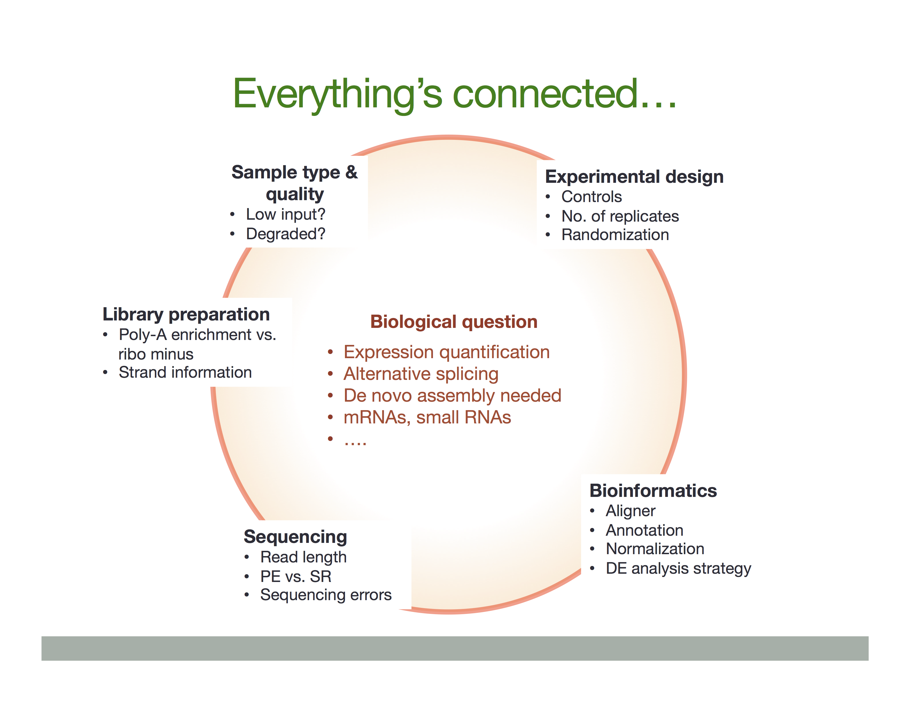

There is a variety of ways in which RNA is treated during its conversion to cDNA and eventual preparation of sequencing libraries. In general the experimental workflow includes the following steps:

 * RNA purification;
 * Reverse transcription using Reverse Transcriptase (RT), which produces the first strand of cDNA ("c" stands for *complimentary*);
 * Second strand synthesis using DNA polymerase;
 * Library preparation for sequencing.

In listing these basic steps we are ignoring a vast amount of details such as, for example, normalization strategies and procedures needed to deal with rare RNAs or degraded samples (see [Adiconis:2013](https://www.ncbi.nlm.nih.gov/pmc/articles/PMC3821180/)). Yet, there are two important experimental considerations that would effect the ways in which one analyses data and interprets the results. These are:

 * Priming for the first cDNA strand synthesis;
 * Stranded versus Non-stranded libraries.

### Priming for the first strand synthesis

Reverse Transcriptase (RT) requires a primer. One can leverage the fact that the majority of processed mRNAs are polyadenylated and use oligo-dT primer to (mostly) restrict cDNA synthesis to fully processed mRNAs. Alternatively one can use a mix of random oligonucleotides to prime RT at a multitude of internal sites irrespective of RNA type and maturation status:

>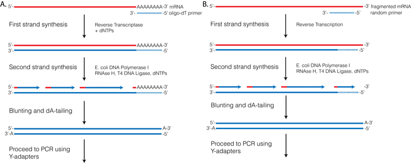
>
>**Oligo-dT vs. random priming** 
>Oligo-dT (**A**) and random priming (**B**)

Depending on the choice of the approach one would have different types of RNAs included in the final sequencing outcome. For example, if one attempts to study RNAs that are not polyadenylated or not fully processed, it would be unwise to use oligo-dT priming approach.

### Strand-specific RNAseq

RNAs that are typically targeted in RNAseq experiments are single stranded (e.g., mRNAs) and thus have polarity (5' and 3' ends that are functionally distinct):

>
>
>**Relationship between DNA and RNA orientation**

During a typical RNAseq experiment the information about strandedness is lost after both strands of cDNA are synthesized, size selected, and converted into sequencing library. However, this information can be quite useful for various aspects of RNAseq analysis such as transcript reconstruction and quantification. There is a number of methods for creating so called *stranded* RNAseq libraries that preserve the strand information (an excellent overview in [Levin et al, Nat Meth, 2010](https://www.ncbi.nlm.nih.gov/pmc/articles/PMC3005310/)):

")
>
>**** 
>Different types of stranded library generation protocols from [Levin:2010](https://www.ncbi.nlm.nih.gov/pmc/articles/PMC3005310/)

Depending on the approach and whether one performs single- or paired-end sequencing there are multiple possibilities on how to interpret the results of mapping of these reads onto genome/transcriptome:

>[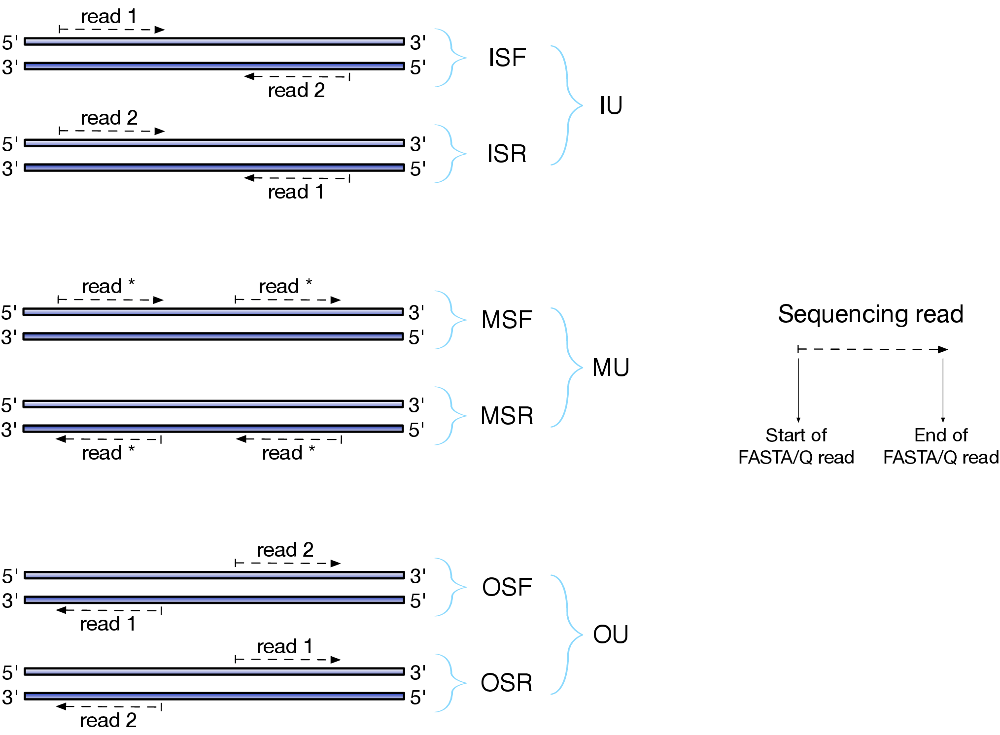](https://sailfish.readthedocs.org/en/master/library_type.html)
>
>**Effects of RNAseq library types** 
>Image and description below is from [Sailfish documentation](https://sailfish.readthedocs.org/en/master/library_type.html)

The relative orientation of the reads is only relevant if the library is pair-ended. The possible options are:

 * **I** = inward;
 * **O** = outward;
 * **M** = matching (co-directional).

Library can be stranded (**S**) or unstranded (**U**). If this library is stranded than depending on the protocols reads (single reads or forward reads in a paired-end run) may originate from:

 * **F** = read 1 in paired-end sequencing or single-end read is derived from the Forward strand;
 * **R** = read 1 in paired-end sequencing or single-end read is derived from the Reverse strand.

So by combining the relative orientation of reads is I, O, or M (if reads are paired), strandedness or the library (S or U), and whether the reads originate from forward and reverse strand (F or R) there can be quite a number of possibilities:

* IU  - (an unstranded paired-end library where the reads face each other)
* SF  - (a stranded single-end protocol where the reads come from the forward strand)
* OSR - (a stranded paired-end protocol where the reads face away from each other,
      read1 comes from reverse strand and read2 comes from the forward strand).
      and so on...

However, in practice, if you use Illumina paired-end RNAseq protocols you are unlikely to uncover many of these possibilities. You will either deal with:

 * unstranded RNAseq data (**IU** type from above. Also called **fr-unstranded** in TopHat/Cufflinks jargon);
 * stranded RNAseq data produced with Illumina TrueSeq RNAseq kits and [dUTP tagging](https://nar.oxfordjournals.org/content/37/18/e123) (**ISR** type from above or **fr-firststrand** in TopHat/Cufflinks nomenclature).

The implication of stranded RNAseq is that you can distinguish whether the reads are derived from forward- or reverse-encoded transcripts:

>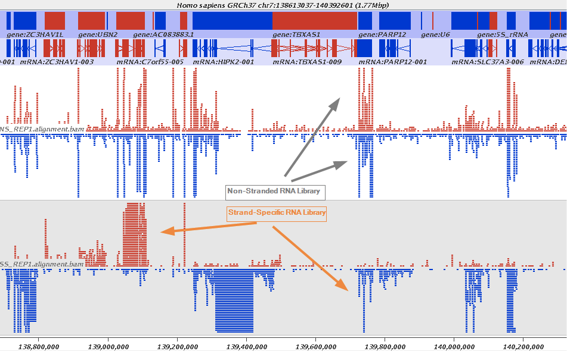
>
>**Stranded RNAseq data look like this** 
>This example contrasts unstranded and stranded RNAseq experiments. Red transcripts are from + strand and blue are from - strand. In stranded example reads are clearly stratified between the two strands.  A small number of reads from opposite strand may represent anti-sense transcription. The image from GATC Biotech.

### Replicates: Biological or Technical and how many?

An RNAseq experiment without a sufficient number of replicates will be a waste of money. Replicates are essential to be able to correct for variation due to differences within/among organisms, cells, sequencing machines, library preparation protocols and numerous other potential factors. There are two types of replicates (as described by [Dündar:2015](http://chagall.med.cornell.edu/RNASEQcourse/Intro2RNAseq.pdf)):

> * **Technical replicates** can be defined as *different library preparations from the same RNA sample*. They should account for batch effects from the library preparation such as reverse transcription and PCR amplification. To avoid possible lane effects (e.g., differences in the sample loading, cluster amplification, and efficiency of the sequencing reaction), it is good practice to multiplex the same sample over different lanes of the same flowcell. In most cases, technical variability introduced by the sequencing protocol is quite low and well controlled.

>* **Biological replicates**. There is an on-going debate over what kinds of samples represent true biological replicates. Obviously, the variability between different samples will be greater between RNA extracted from two unrelated humans than between RNA extracted from two different batches of the same cell line. In the latter case, most of the variation that will eventually be detected was probably introduced by the experimenter (e.g., slightly differing media and plating conditions). Nevertheless, this is variation the researcher is typically not interested in assessing, therefore the ENCODE consortium defines biological replicates as RNA from an independent growth of cells/tissue (ENCODE [2011](https://genome.ucsc.edu/ENCODE/protocols/dataStandards/ENCODE_RNAseq_Standards_V1.0.pdf)).

>The number of replicates should be as high as practically possible. Most RNAseq experiments include three replicates and some have as many as 12 (see Schurch et al. [2015](https://arxiv.org/abs/1505.02017)).

## Read mapping

After sequencing is performed you have a collection of sequencing reads for each sample/replicate. In a reference-based RNAseq experiment these need to be mapped against the genome. Because in the case of eukaryotic transcriptome most reads originate from processed mRNAs lacking exons, they cannot be simply mapped back to the genome. Instead they can be separated into two categories:

 * Reads that map entirely within exons
 * Reads that cannot be mapped within an exon across their entire length because they span two or more exons

*Spliced* mappers have been developed to efficiently map transcript-derived reads against genome.

### TopHat, TopHat2, and HiSat

[Tophat](https://bioinformatics.oxfordjournals.org/content/25/9/1105.abstract) was one of the first tools designed specifically to address this problem by identifying potential exons using reads that do map to the genome, generating possible splices between neighboring exons, and comparing reads that did not initially map to the genome agaisnt these *in silico* created junctions:

>[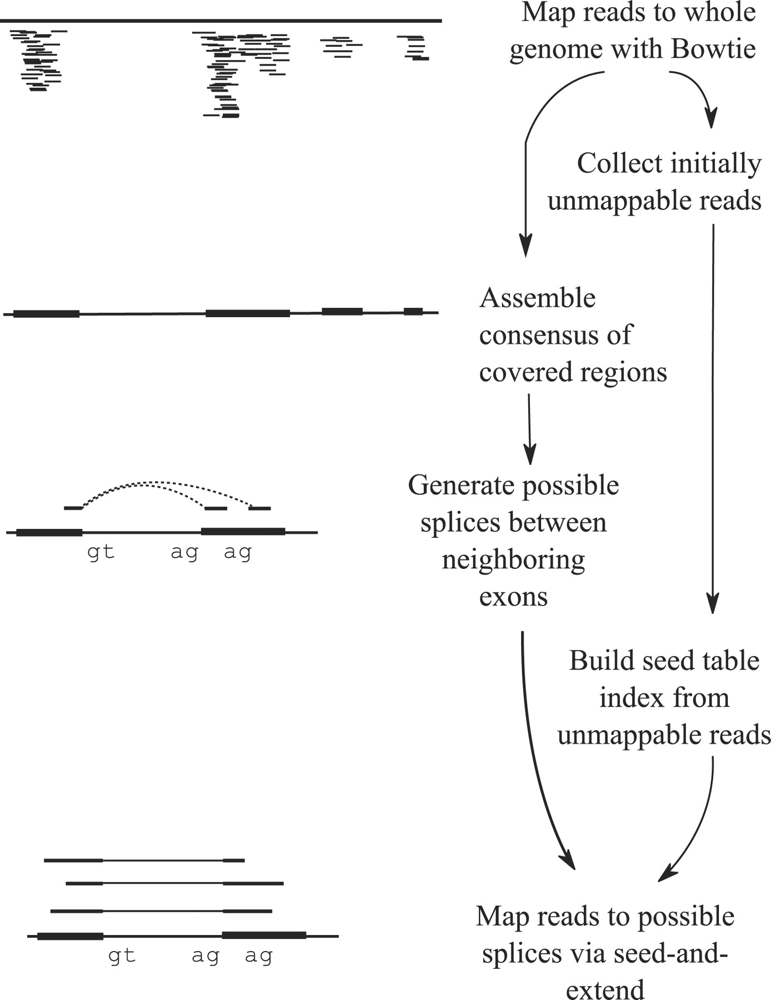](https://bioinformatics.oxfordjournals.org/content/25/9/1105/F1.expansion.html)
>
>**TopHat and TopHat2: Mapping RNAseq regions to genome** 
>In TopHat reads are mapped against the genome and are separated into two categories: (1) those that map, and (2) those that initially unmapped (IUM). "Piles" of reads representing potential exons are extended in search of potential donor/acceptor splice sites and potential splice junctions are reconstructed. IUMs are then mapped to these junctions. Image from [Trapnell:2009](https://bioinformatics.oxfordjournals.org/content/25/9/1105.full).

>[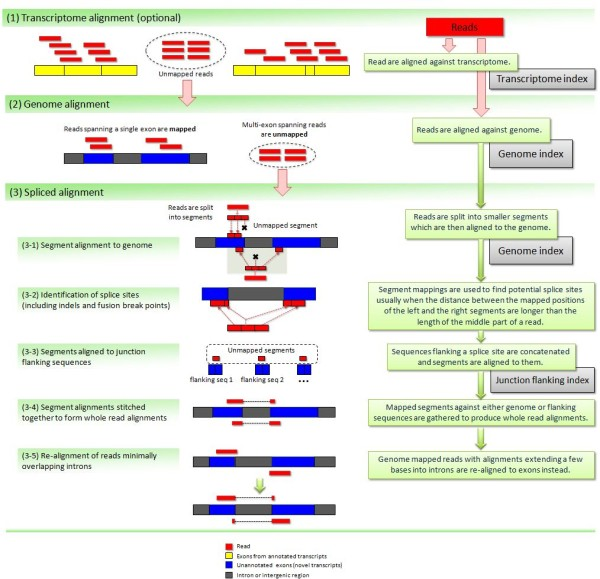](https://genomebiology.biomedcentral.com/articles/10.1186/gb-2013-14-4-r36)
>
>**TopHat has been subsequently improved with the development of TopHat2** 
>Image from [Kim:2012](https://genomebiology.biomedcentral.com/articles/10.1186/gb-2013-14-4-r36) summarizes steps involved in aligning of RNAseq reads with TopHat2

To further optimize and speed up spliced read alignment Kim at al. [2015](https://www.ncbi.nlm.nih.gov/pmc/articles/PMC4655817/) developed [HISAT](https://ccb.jhu.edu/software/hisat2/index.shtml). It uses a set of [FM-indices](https://en.wikipedia.org/wiki/FM-index) consisting one global genome-wide index and a collection of ~48,000 local overlapping 42 kb indices (~55,000 56 kb indices in HiSat2). This allows to find initial seed locations for potential read alignments in the genome using global index and to rapidly refine these alignments using a corresponding local index:

>
>
>**Hierarchical Graph FM index in HiSat/HiSat2** 
>A part of the read (blue arrow) is first mapped to the genome using the global FM index. The HiSat then tries to extend the alignment directly utilizing the genome sequence (violet arrow). In (**a**) it succeeds and this read aligned as it completely resides within an exon. In (**b**) the extension hits a mismatch. Now HiSat takes advantage of the local FM index overlapping this location to find the appropriate matting for the remainder of this read (green arrow). The (**c**) shows a combination these two strategies: the beginning of the read is mapped using global FM index (blue arrow), extended until it reaches the end of the exon (violet arrow), mapped using local FM index (green arrow) and extended again (violet arrow). Image from [Kim:2015](https://www.ncbi.nlm.nih.gov/pmc/articles/PMC4655817/)

### STAR mapper

[STAR aligner](https://github.com/alexdobin/STAR) is a fast alternative for mapping RNAseq reads against genome utilizing uncompressed [suffix array](https://en.wikipedia.org/wiki/Suffix_array). It operates in [two stages](https://academic.oup.com/bioinformatics/article/29/1/15/272537/STAR-ultrafast-universal-RNA-seq-aligner). In the first stage it performs seed search:

>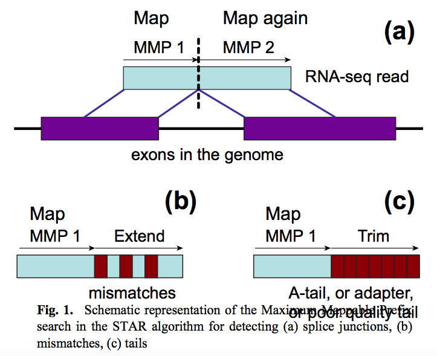
>
>**STAR's seed search** 
>Here a read is split between two consecutive exons. STAR starts to look for a *maximum mappable prefix* (MMP) from the beginning of the read until it can no longer match continuously. After this point it start to MMP for the unmatched portion of the read (**a**). In the case of mismatches (**b**) and unalignable regions (**c**) MMPs serve as anchors from which to extend alignments. Image from [Dobin:2013](https://bioinformatics.oxfordjournals.org/content/early/2012/10/25/bioinformatics.bts635.full.pdf+html).

At the second stage STAR stitches MMPs to generate read-level alignments that (contrary to MMPs) can contain mismatches and indels. A scoring scheme is used to evaluate and prioritize stitching combinations and to evaluate reads that map to multiple locations. STAR is extremely fast but requires a substantial amount of RAM to run efficiently.

## Transcript reconstruction

The previous step - mapping - assigns RNAseq reads to genomic locations and identifies splice junctions from reads that originate from different exons. At transcript reconstruction step this information is taken further in attempt to build transcript models. There is a number of tools for performing this task. A benchmarking paper by [Hayer:2015](https://bioinformatics.oxfordjournals.org/content/early/2015/09/03/bioinformatics.btv488.full.pdf+html) attempted to compare performance of existing approaches with one of the outcomes shown below:

>[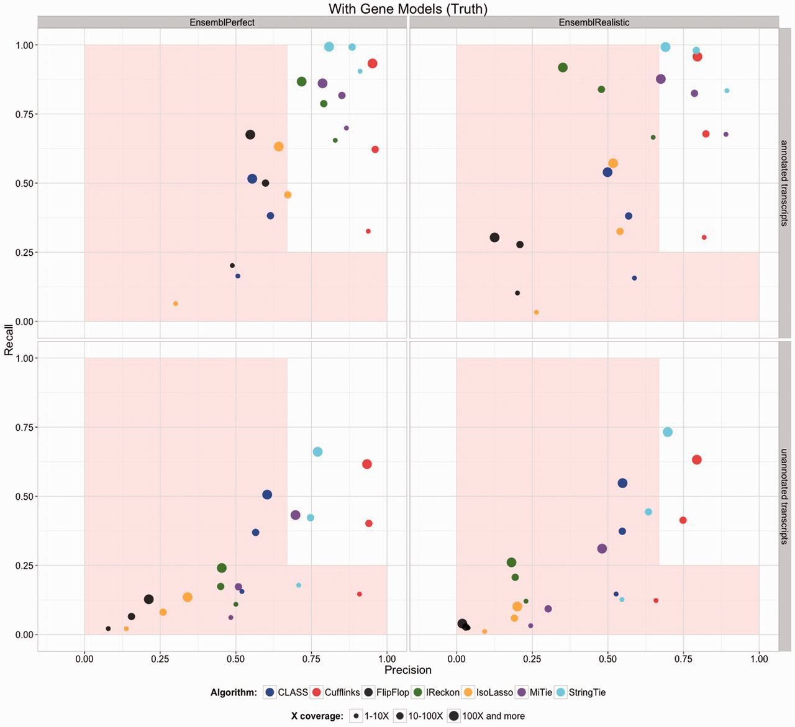](https://bioinformatics.oxfordjournals.org/content/early/2015/09/08/bioinformatics.btv488/F5.large.jpg)
>
>**Comparison of transcript reconsruction approaches** 
>Here *recall* (the number of correctly constructed forms divided by the total number of real forms) versus *precision* (true positives divided by the sum of true positives and false positives) are plotted for seven transcript assemblers tested on two simulated datasets: *EnsemblPerfect* and *EnsemblRealistic*. The shaded region is indicating suboptimal performance (i.e., the white, unshaded region is "good"). The figure is from [Hayer:2015](https://bioinformatics.oxfordjournals.org/content/early/2015/09/03/bioinformatics.btv488.full.pdf+html).

Based on these results [Cufflinks](https://cole-trapnell-lab.github.io/cufflinks/) and [StringTie](https://ccb.jhu.edu/software/stringtie/) have satisfactory performence. The following discussion is based on inner workings of StringTie.

### Transcriptome assembly with StringTie

[StringTie](https://ccb.jhu.edu/software/stringtie/) assembles transcripts from spliced read alignemnts produced by tools such as STAR, TopHat, or HISAT and simultaneously estimates their abundances using counts of reads assigned to each transcript. The following images illustrates details of StringTie workflow:

>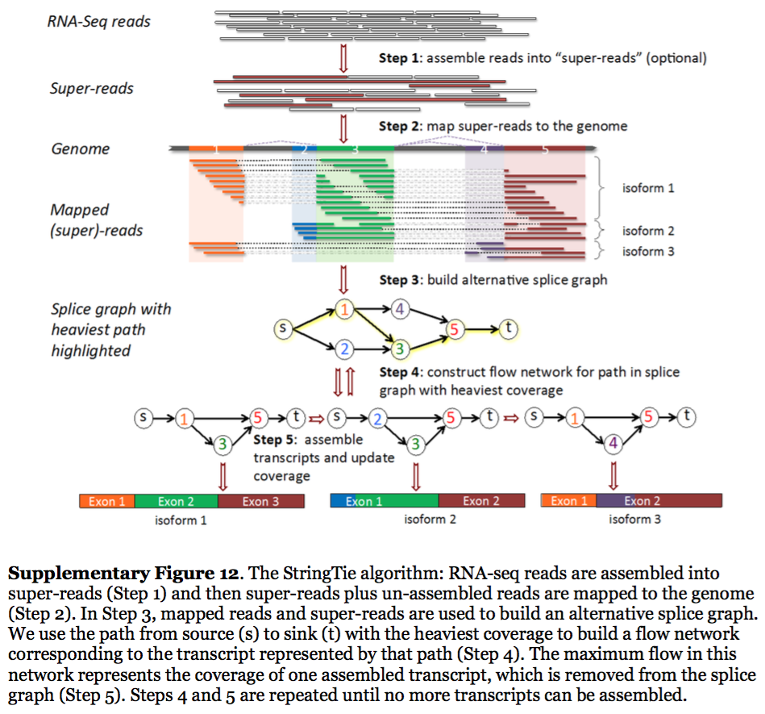
>
>**StringTie workflow** 
>Image from [Pertea:2015](https://www.ncbi.nlm.nih.gov/pmc/articles/PMC4643835/)

In essence StringTie builds an alternative splice graph from overlapping reads in a given locus. In such a graph nodes correspond to exons (or, rather, contiguous regions of genome covered by reads; colored regions on the figure above), while edges are represented by reads connecting these exons. Next, it identifies a path within the splice graph that has the highest weight (largest number of reads on edges). Such path would correspond to an assembled transcript at this iteration of the algorithm. Because the edge weight is equal to the number of the reads StringTie estimates the coverage level for this transcript (see below) which can be used to estimate the transcript's abundance. Reads that are associated with the transcript that was just assembled are then removed and the graph is updated to perform the next iteration of the algorithm.

## Transcript quantification

Transcriptome quantification attempts to estimate expression levels of individuals transcripts. This is performed by assigning RNAseq reads to transcripts, counting, and normalization.

### Assigning reads to transcripts

To associate reads with transcripts they (the reads) need to be aligned to the transcriptome. Tools like Cufflinks and StringTie reconstruct transcripts from spliced read alignments generated by other programs (TopHat, HISAT, STAR), so they already have the information about which reads belong to each reconstructed transcript. Other tools such as [Sailfish](https://www.cs.cmu.edu/~ckingsf/software/sailfish/), [Kallisto](http://pachterlab.github.io/kallisto/), and [Salmon](http://combine-lab.github.io/salmon/) perform *lightweight* alignment of RNAseq reads against existing transcriptome sequences. The goal of lightweight alignment is to quickly distribute the reads across transcripts they likely originate from without worrying too much about producing high quality alignments. The upside of this is that the entire procedure can be performed very quickly. The downside is that these tools require high quality transcriptome as input, which is not a problem if you work with humans or mice, but is a problem if you are studying Hyacinth macaw or any other brilliantly colored creatures.

#### Lightweight alignment

[Sailfish](https://www.cs.cmu.edu/~ckingsf/software/sailfish/) has been initially designed to utilize [*k*-mer](https://en.wikipedia.org/wiki/K-mer) matching for finding association between reads and corresponding transcripts:

>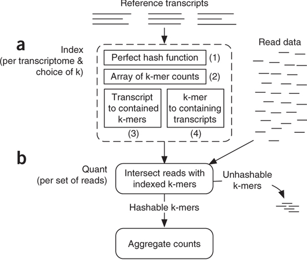
>
>**Assigning reads to transcripts: Sailfish** 
>Sailfish indexes input transcriptome for a fixed *k*-mer length and compares *k*-mers derived from RNAseq reads against this index. Image from [Patro:2014](https://www.ncbi.nlm.nih.gov/pmc/articles/PMC4077321/)

The current version of Sailfish uses [quasi-alignment](http://biorxiv.org/content/biorxiv/early/2015/10/22/029652.full.pdf) to extend exact matches found with *k*-mers:

>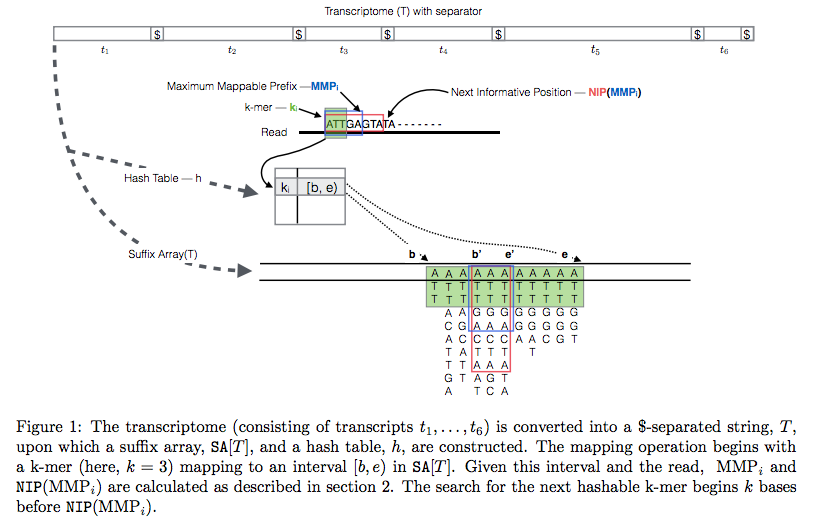
>
>**Quasi-alignment of reads in Sailfish** 
>In Sailfish version [0.7.0](https://github.com/kingsfordgroup/sailfish/releases/tag/v0.7.0) and up transcriptome is concatenated into a single sequence using `$` separators from which a [suffix array](https://en.wikipedia.org/wiki/Suffix_array) and a [hash table](https://en.wikipedia.org/wiki/Hash_table) are constructed. A *k*-mer from an RNAseq read (green) is looked up in the hash table, which immediately gives its position in the suffix array allowing to extend the march as described in the legend and the [paper](http://biorxiv.org/content/biorxiv/early/2015/10/22/029652.full.pdf). Image from  [Srivastava:2015](http://biorxiv.org/content/biorxiv/early/2015/10/22/029652.full.pdf)

[Kallisto](https://pachterlab.github.io/kallisto/) also utilizes *k*-mer matching but uses a different data structure. It constructs a [De Bruijn graph](https://en.wikipedia.org/wiki/De_Bruijn_graph) from transcriptome input (pane **b** of the figure below). This graph is different from De Bruijn graphs used for genome assembly in that its nodes are *k*-mers and transcripts correspond to paths through the graph. To accommodate multiple transcripts that can lay along the same path (or sub-path) the paths are "colored" with each transcript given a distinct "color" (in genome assembly the graph is built from the reads and nodes usually correspond to overlaps between *k*-mers forming incoming and outgoing edges). Non-branching sections of the graph that have identical coloring are "glued" into contigs. Finally a [hash table](https://en.wikipedia.org/wiki/Hash_table) is built that stores the position of each transcriptome *k*-mer within the graph:

>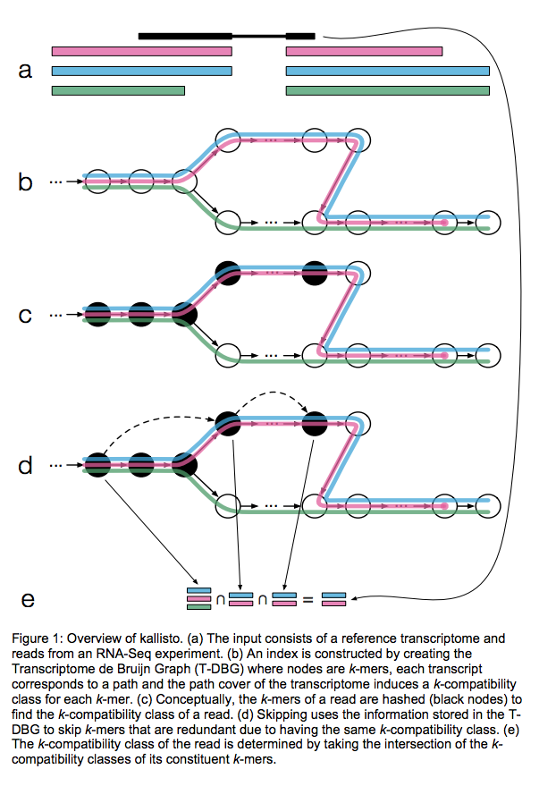
>
>**Assigning reads to transcripts: Kallisto** 
>Here a black read is being associated with a set consisting of red, blue, and green transcripts (**a**). First, a graph is built from transcriptome (**b**). Next, by finding common *k*-mers between the read and the graph the read is "threaded" along a path (**c** and **d**). The colors along that path would indicate which transcripts it is likely derived from. Specifically, this is done by taking intersection of "colors" (**c**). It this case the read is assigned to two transcripts: red and blue. Image from [Bray:2015](https://arxiv.org/pdf/1505.02710v2.pdf)

[Salmon](https://combine-lab.github.io/salmon/about/) does not use *k*-mer matching approach. Instead it creates [bwa](https://github.com/lh3/bwa)-like [FM-index](https://en.wikipedia.org/wiki/FM-index) and uses it to finds chains of *Maximal Exact Matches* (MEMs) and *Super Maximal Exact Matches* (SMEMs) between a read and the transcriptome.   
[Patro:2015](http://biorxiv.org/content/biorxiv/early/2015/06/27/021592.full.pdf) define a MEM as "*a substring that is shared by the query (read) and reference (transcript) that cannot be extended in either direction without introducing a mismatch*". Similraly, a SMEM is defined as a "*MEM that is not contained within any other MEM on the query.*" One of the advantages of utilizing the FM-index is that a new index does not need to re-generated for a search with different set of parameters. In the case of Sailfish and Kallisto an index is dependent on *k*-mer length and has to be recomputed every time the *k* is changed. The overall schematics of Salmon operation is as follows:

>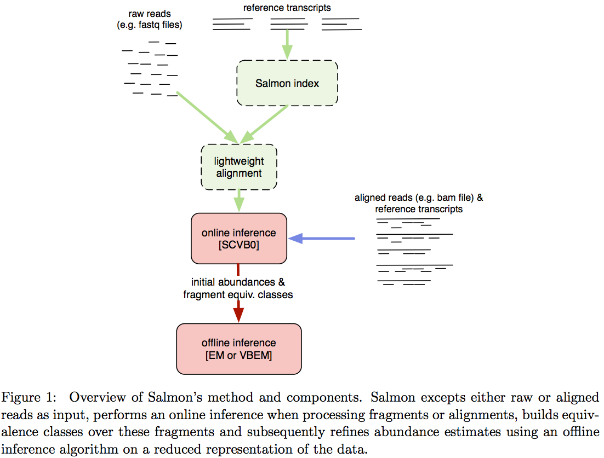
>
>**Assigning reads to transcripts: Salmon** 
>Image from [Patro:2015](http://biorxiv.org/content/biorxiv/early/2015/06/27/021592.full.pdf)

### Estimating transcript levels

Once reads are apportioned across individual transcripts they can be quantified. There are several approaches for quantification.

#### Flow networks

StringTie, which performs assembly and quantification simultaneously converts splice graph into a flow network for which it solves [the maximum flow problem](https://en.wikipedia.org/wiki/Maximum_flow_problem). The maximum flow is such network represents the expression level for a given transcript:

>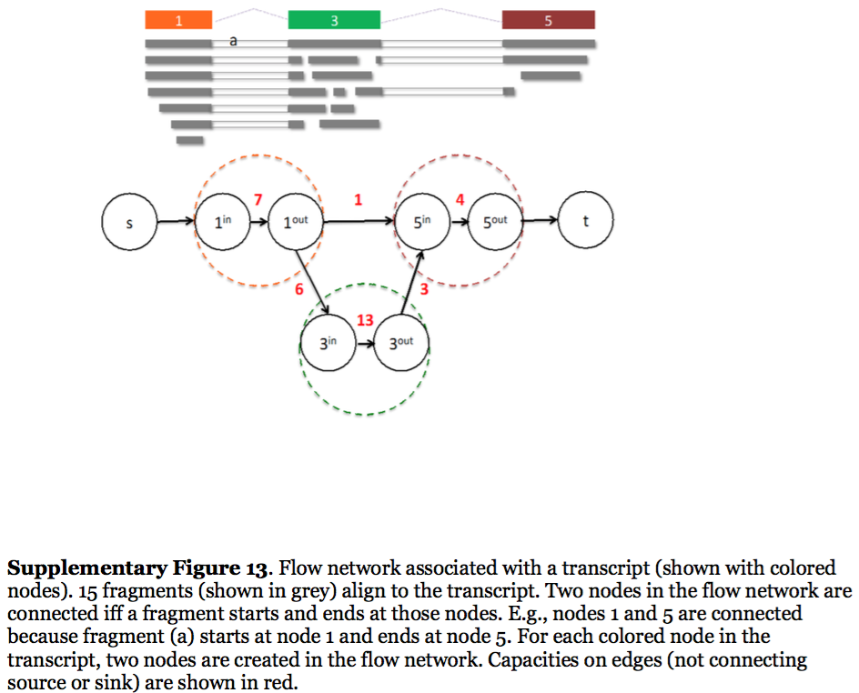
>
>**StringTie flow network** 
>Here each exon node from the splice graph is split into *in* and *out* nodes connected with an edge weighted by the number of reads corresponding to that exon. For example, the first exon is covered by seven reads and so the edge between 1-in and 1-out has a weight of 7. Expression level would correspond to the maximum flow through a path representing a given transcript. Image from [Pertea:2015](https://www.ncbi.nlm.nih.gov/pmc/articles/PMC4643835/)

#### Expectation Maximization

The Expectation/Maximization framework (EM) is utilized in a number of tools such as [eXpress](http://bio.math.berkeley.edu/eXpress/index.html) and more recently [Sailfish](http://www.cs.cmu.edu/~ckingsf/software/sailfish/), [Kallisto](http://pachterlab.github.io/kallisto/), and [Salmon](https://combine-lab.github.io/salmon/about/) (As an alternative strategy Salmon also utilizes [variational Bayesian method](http://arxiv.org/pdf/1308.5953v1.pdf). The principle of EM is nicely illustrated by [Lior Pachter](https://liorpachter.wordpress.com/) in his transcript quantification [review](http://arxiv.org/pdf/1104.3889v2.pdf). Suppose, as shown on the image below, there are three transcripts (green, red, and blue). There are five reads associated with these transcripts. One read (*d*) is unique to the red transcript, while others correspond to two (*b*, *c*, *e*) or three (*a*) transcripts. The EM is an iterative procedure. In the first round transcript abundances are initialized as equal (0.33 each as there are three transcripts) and during expectation reads are apportioned across transcripts based on these abundances. Next, during maximization step transcript abundances are re-calculated as follow. For red transcript we sum up fraction of each read as 0.33 + 0 + 0.5 + 1 + 0.5 for reads a, b, c, d, and e, respectively. We now divide this by the sum of read allocations for each transcript as 2.33 + 1.33 + 1.33 for red, green, and blue transcripts respectively. For all three transcript calculation will look like this:

	$$

\color{red}{red}   =  \frac{0.33 + 0.0 + 0.5 + 1.0 + 0.5}{2.33 + 1.33 + 1.33} = 0.47\\

\color{green}{green} =  \frac{0.33 + 0.5 + 0.0 + 0.0 + 0.5}{2.33 + 1.33 + 1.33} = 0.27\\

\color{blue}{blue}  =  \frac{0.33 + 0.5 + 0.5 + 0.0 + 0.0}{2.33 + 1.33 + 1.33} = 0.27

    $$

During next expectation stage read are re-apportioned across transcripts and the procedure is repeated until convergence:

>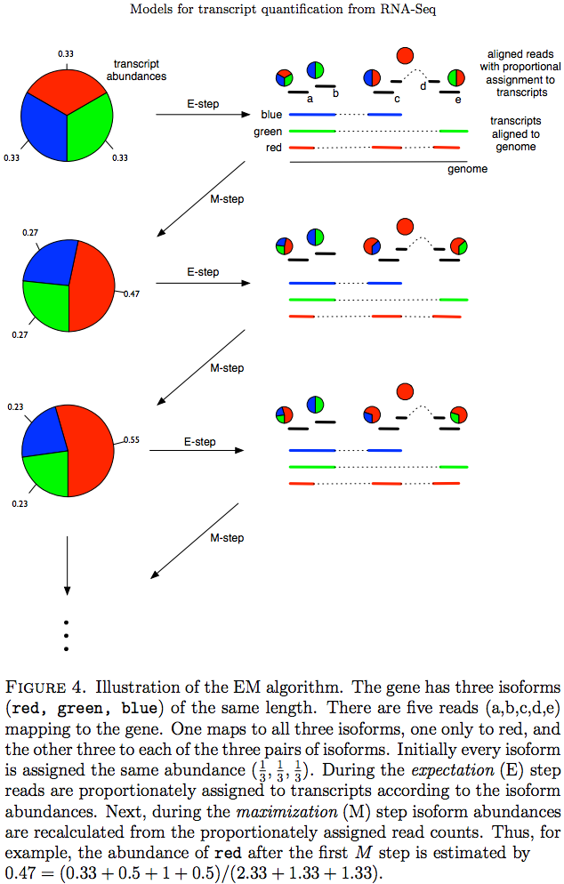
>
>**Expectation Maximization (EM)** 
>Image from [Pacher:2011](https://arxiv.org/pdf/1104.3889v2.pdf)

### Understanding quantification metrics

As we've seen above quantification for a transcript is estimated using the number of associated reads. Yet the count is not a very good measure as it will be severely biased by multiple factors such as, for example, transcript length. Thus these counts need to be normalized. Normalization strategies can be roughly divided into two groups:

 * Normalization for comparison within a **single** sample;
 * Normalization for comparison among **multiple** samples/conditions.

In their [tutorial](http://chagall.med.cornell.edu/RNASEQcourse/) Dündar et al. have compiled a table summarizing various metrics. Below is description of normalization technique for within sample comparisons (between sample comparison can be found in the next section on differential expression analysis):

>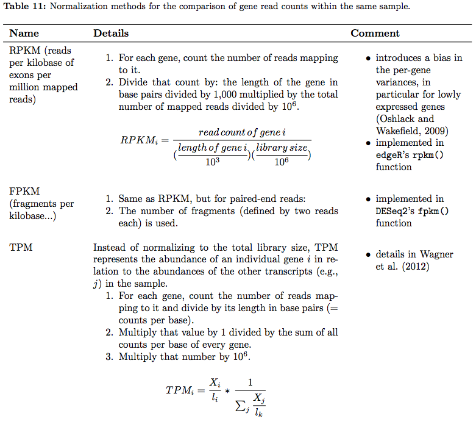
>
>**RNAseq normalization metrics: Within sample comparisons** 
>Table from Dündar et al. [2015](http://chagall.med.cornell.edu/RNASEQcourse/)

In addition, an excellent overview of these metrics can be found [here](https://haroldpimentel.wordpress.com/2014/05/08/what-the-fpkm-a-review-rna-seq-expression-units/).

#### &#9888; You should NEVER EVER use RPKM, FPKM, or TPM to compare expression levels <em>across</em> samples. These are RELATIVE measures! Consider yourself warned!

## Finding expression differences

The goal of differential expression analysis (DE) is to find gene (DGE) or transcript (DTE) differences between conditions, developmental stages, treatments etc. In particular DE has two goals:

 * Estimate the *magnitude* of expression differences;
 * Estimate the *significance* of expression differences.

For this expression is estimated from read counts and attempts are made to correct for variability in measurements using replicates that are absolutely essential accurate results (see below). We begin our short discussion on DE by reproducing a figure from [Trapnell:2013](https://www.nature.com/nbt/journal/v31/n1/abs/nbt.2450.html) highlighting some of the challenges associated with judging expression differences from read counts:

>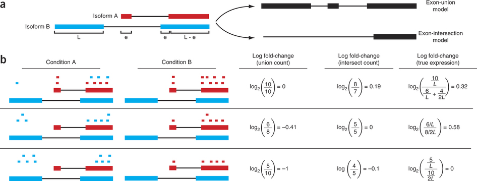
>
>**Differential expression: Read counts and Expression levels** 
>**Change in fragment count for a gene does not necessarily equal a change in expression**. (**a**) Simple read-counting schemes sum the fragments incident on a gene’s exons. The exon-union model counts reads falling on any of a gene’s exons, whereas the exon-intersection model counts only reads on constitutive exons. (**b**) Both of the exon-union and exon intersection counting schemes may incorrectly estimate a change in expression in genes with multiple isoforms. The true expression is estimated by the sum of the length-normalized isoform read counts. The discrepancy between a change in the union or intersection count and a change in gene expression is driven by a change in the abundance of the isoforms with respect to one another. In the top row, the gene generates the same number of reads in conditions A and B, but in condition B, all of the reads come from the shorter of the two isoforms, and thus the true expression for the gene is higher in condition B. The intersection count scheme underestimates the true change in gene expression, and the union scheme fails to detect the change entirely. In the middle row, the intersection count fails to detect a change driven by a shift in the dominant isoform for the gene. The union scheme detects a shift in the wrong direction. In the bottom row, the gene’s expression is constant, but the isoforms undergo a complete switch between conditions A and B. Both simplified counting schemes register a change in count that does not reflect a change in gene expression. Figure from [Trapnell:2013] (https://www.nature.com/nbt/journal/v31/n1/abs/nbt.2450.html)

The following discussion of DGE logic is reproduced from [Dündar:2015](http://chagall.med.cornell.edu/RNASEQcourse/).

>To determine the genes whose read count differences between two conditions are greater than expected by chance, DGE tools must make assumptions about the distribution of read counts. The null hypothesis – that the mean read counts of the samples of condition **A** are equal to the mean read counts of the samples of condition **B** – is tested for each gene individually. One of the most popular choices to model the read counts is the [Poisson distribution](https://en.wikipedia.org/wiki/Poisson_distribution) because:
>
> * individual reads can be interpreted as binary data (Bernoulli trials): they either originate from gene *i* or not;
> * we are trying to model the discrete probability distribution of the number of successes (success = read is present in the sequenced library);
> * the pool of possible reads that could be present is large, while the proportion of reads belonging to
gene **i** is quite small.
>
>The nice feature of a Poisson distribution is that variance = mean. Thus, if the RNA-seq experiment gives us a precise estimate of the mean read counts per condition, we implicitly know what kind of variance to expect for read counts that are not truly changing between two conditions. This, in turn, then allows us to identify those genes that show greater differences between the two conditions than expected by chance. While read counts of the same library preparation (*technical replicates*) can indeed be well approximated by the Poisson distribution, it has been shown that biological replicates have greater variance (noise) than expected. This [overdispersion](https://en.wikipedia.org/wiki/Overdispersion) can be captured with the [negative binomial distribution](https://en.wikipedia.org/wiki/Negative_binomial_distribution), which is a more general form of the Poisson distribution that allows the variance to exceed the mean. The square root of the dispersion is the coefficient of variation – SD/mean – after subtracting the variance we expect due to Poisson sampling.
>
>In contrast to the Poisson distribution, we now need to estimate two parameters from the read counts: the mean as well as the dispersion. The precision of these estimates strongly depends on the number (and variation) of replicates – the more replicates, the better the grasp on the underlying mean expression values of unchanged genes and the variance that is due to biological variation rather than the experimental treatment. For most RNA-seq experiments, only two to three replicates are available, which is not enough for reliable mean and variance estimates. Some tools therefore compensate for the lack of replication by borrowing information across genes with similar expression values and shrink a given gene’s variance towards the regressed values. These fitted values of the mean and dispersion are then used instead of the raw estimates
to test for differential gene expression.
>
>The best performing tools tend to be [edgeR](https://bioconductor.org/packages/release/bioc/html/edgeR.html), [DESeq/DESeq2](https://bioconductor.org/packages/release/bioc/html/DESeq2.html), and [limma-voom](https://www.bioconductor.org/packages/release/bioc/html/limma.html) (see Rapaport et al. ([2013](https://link.springer.com/article/10.1186/gb-2013-14-9-r95)); Soneson and Delorenzi ([2013](https://bmcbioinformatics.biomedcentral.com/articles/10.1186/1471-2105-14-91)); Schurch et al. ([2015](http://arxiv.org/abs/1505.02017)) for reviews of DGE tools). DESeq and limma-voom tend to be more conservative than edgeR (better control of false positives), but edgeR is recommended for experiments with fewer than 12 replicates (Schurch et al., [2015](http://arxiv.org/abs/1505.02017)).

## Let's try it

### The data

In this example we will use a downsampled version of simulated *Drosophila melanogaster* RNA-seq data used by Trapnell et al. [2012](https://www.ncbi.nlm.nih.gov/pmc/articles/PMC3334321/). These include two conditions (**C1** and **C2**), each containing three replicates (**R1**, **R2**, and **R3**) sequenced as a paired end library. Thus in total there are 12 fastq datasets.  

Here is what to do to load the data:

#### Loading the data and create dataset collections

> Go to the data library (ask your instructor) and select all fastq files. Then Click `to History` button:
>
>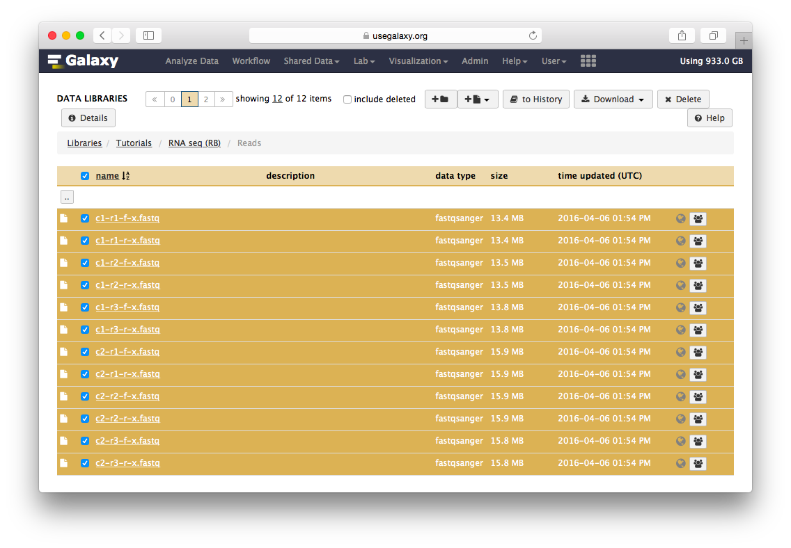
>
>The datasets will appear in your history:
>
>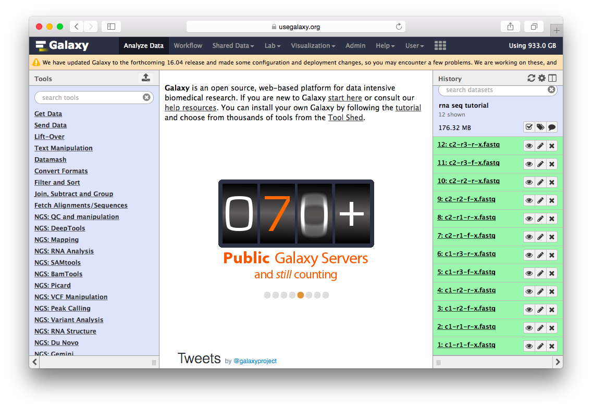
>
>Twelve datasets make a lot of clicking necessary. To avoid this annoyance we will combine them into two collections - **c1** and **c2** as shown in the video below. Also, see this [tutorial]({{site.baseurl}}/topics/galaxy-data-manipulation/tutorials/processing-many-samples-at-once/tutorial.html) for yet another explanation of dataset collections.
> 
<iframe src="https://player.vimeo.com/video/163625221" webkitallowfullscreen mozallowfullscreen allowfullscreen></iframe>

>

### Mapping reads

We will map the reads with TopHat2. Select **TopHat** from **NGS: RNA Analysis** section of the tool menu (left pane of Galaxy's interface):

#### Mapping with TopHat2

>In this case the input to TopHat is **not** individual datasets, but a collection instead. The [video](https://vimeo.com/163625221) above shows how to generate collection. Since we have created two collection as was described above, we will used them as inputs (note that **Is this single-end or paired-end data?** is set to `Paired-end (as collection)`). Make sure that the top part of TopHat interface looks like in the image below. Here the following parameters are set:
>
>* **Mean Inner Distance between Mate Pairs** = `28` This is because paired reads are 100 bp and mean insert size is 228 bp so that 228 - (100 + 100) = 28
>* **Use a built in reference genome or own from your history** = `Use a build-in genome` and `dm3` is selected. This is because the reads are from *D. melanogaster*.
>* **TopHat settings to use** = `Full parameter list` This is done to be able to specify the strandedness of the library.
>* **Library Type** = `FR First Strand`
>
>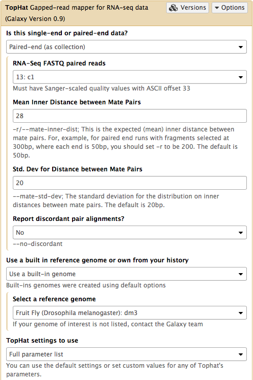
>
>The same procedure is then repeated for collection **c2**. In the end it generates a lot of datasets in the history resulting in something resembling an image below. TopHat produces five types of output and because we started with dataset collections every one of the green boxes shown below is actually a collection of outputs for **c1** and **c2**, respectively.
>
>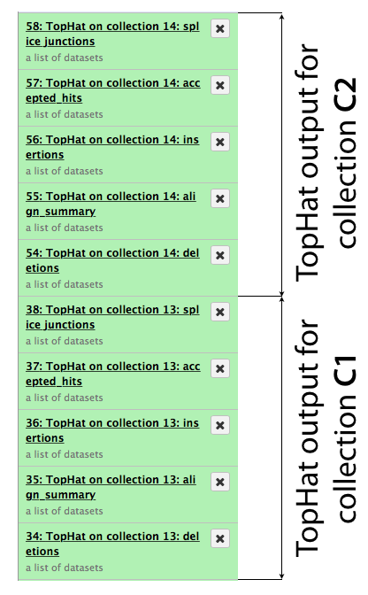

Let's now take a look at some of the alignments. We will use IGV for this purpose.

>First, let's drill down to actual alignments produced by TopHat. For example, in figure shown above simply click on **TopHat on collection 14: accepted_hits** and you will see a list of datasets corresponding to alignments of reads derived from each conditions:
>
>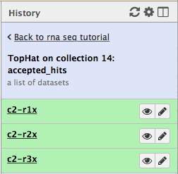
>
>Now, click on **c2-r1x** and the following will appear:
>
>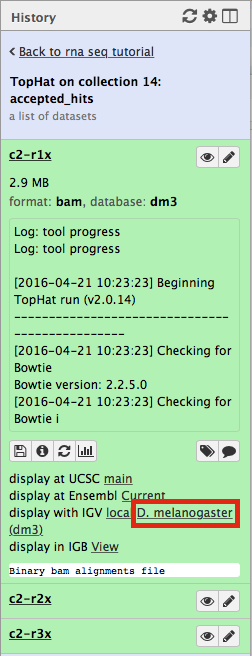
>
>Finally, use **D. melanogaster** link (highlighted above) and follow the on-screen instructions. By focusing IGV on genomic position `chrX:11,897,111-11,920,446` you will be able to see spliced alignments produced by TopHat:
>
>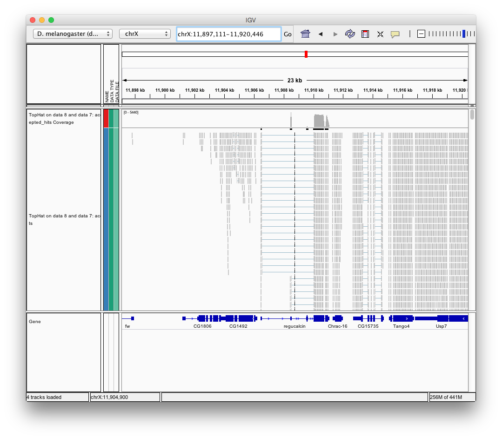
>
>and [sashimi plots](https://software.broadinstitute.org/software/igv/Sashimi) highlighting potential splice junctions:
>
>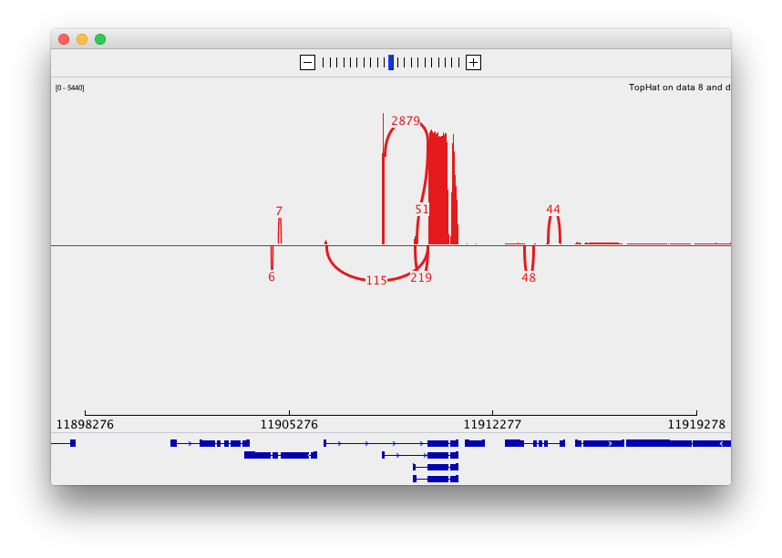

### Performing differential expression analysis

Using mapped reads produced by TopHat we will perform analysis of differential gene expression using HTSeq/DESeq2 pipeline.

#### Gene-based read counting with HTseq-count

[`HTSeq-count`](https://www-huber.embl.de/users/anders/HTSeq/doc/count.html) is one of the most popular tools for gene quantification. `HTseq-count` gives you multiple choices on how to handle read mapping to multiple locations, reads overlapping introns, or reads that overlap more than one genomic feature:

>[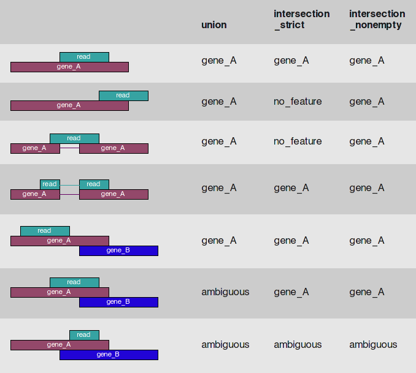](https://www-huber.embl.de/users/anders/HTSeq/doc/count.html)
>
>**`HTseq-count` read/feature overlap modes** 
>The `htseq-count` script of the HTSeq suite offers three different modes to handle details of read–feature overlaps that are depicted here. The default of featureCounts is the behavior of the union option. Image is from [HTseq documentation](https://www-huber.embl.de/users/anders/HTSeq/doc/count.html); Caption by [Dündar:2015](http://chagall.med.cornell.edu/RNASEQcourse/)

Before we can use `HTseq-count` we need to download gene annotations for version `dm3` of the *Drosophila melanogaster* genome. We use version `dm3` because it is the same genome we have mapped reads against during the TopHat step.

#### Getting *Drosophila malanogaster* gene annotation from UCSC

>Select **UCSC Main** from **Get Data** section of the menu. Within the UCSC Genome Browser interface set parameters as shown below. In particular make sure that **assembly** is set ti `dm3` and **output format** is set to `GTF`. Click **get output**.
>[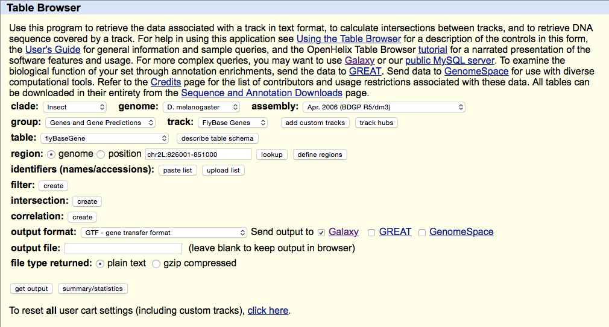](../../images/ucsc_dm3.png)
>
>This [GTF](https://www.ensembl.org/info/website/upload/gff.html) dataset will be used one of the input for HTseq-count.

`HTseq-count` takes two inputs: (1) mapped reads in BAM format and (2) a GTF dataset containing annotation of genes. Using these inputs it will compute the number of reads per gene.

#### Using HTseq-count in Galaxy

>`htseq-count` needs strand information to proceed. The strand information is specified as `+`, `-`, or `.` (unknown) in a GTF dataset. `htseq-count` does not like `.` and will generate an error if such unstranded features appear in data. To prevent these errors from happening we will filter them out from GTF file using **Filter** tool from **Filter and Sort** section of tool menu. Here `c7 != "."` means that we need to filter all rows where strand column (column #7) contains a dot:
>
>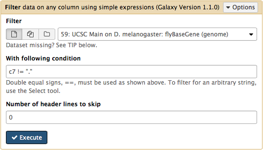
>
>Select **htseq-count** from **NGS: RNA analysis** section on the left side of the menu. Set parameters as shown below. The red arrow points that to enable `htseq-count` to see collections, you need to select the 'folder' button. In the case of this particular Galaxy history we will need to run `htseq-count` twice. Once on TopHat alignemnts for collection **c1** (dataset #37; shown below) and then on alignments for collection **c2** (dataset # 57).|
|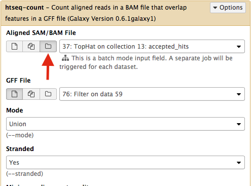
>
>This will generate read counts per gene.

#### Normalizing read counts and computing differential expression with `DESeq2`

`DESeq2` takes read counts produced by `HTseq-count` and apply size factor normalization. Specifically, `DESeq2` will:

 * For each gene, compute the geometric mean of read counts across all samples;
 * Every gene count in then divided by the geometric mean;
 * The median of these ratios is a sample's size factor used for normalization.

&#10148; Note: For a comprehensive overview of differential gene expression with DESeq2 see [Love:2016](https://www.bioconductor.org/packages/3.3/bioc/vignettes/DESeq2/inst/doc/DESeq2.pdf).

#### DESeq2 in Galaxy

>The `DESeq2` Galaxy's interface is shown below. `DESeq2` allows to incorporate multiple *factors* in the analysis. In our case we only have one factor, which we call **Conditions**. This is because we are trying to find genes that are differentially expressed between two conditions. The first condition will the first **factor level**, while condition 2 will be the second **factor level**. Here the input for this first factor level is set to a collection `84: htseq-count on collection 37` and the input for the second input is set to `92: htseq-count on collection 57`. Make sure that **Visualising the analysis results** is set to `Yes`:
>
>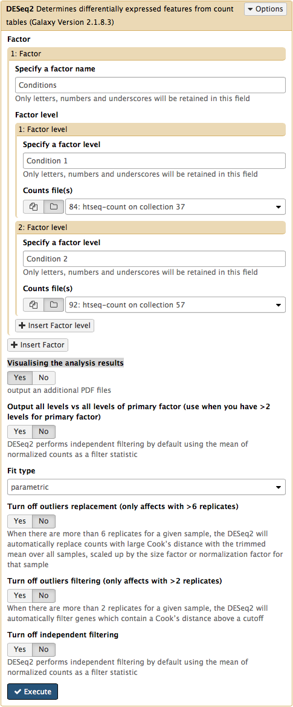
>
>This will produce output as shown below. The columns are: (**1**) gene identifier, (**2**) mean normalised counts, averaged over all samples from both conditions, (**3**) logarithm (base 2) of the fold change, (**4**) the standard error estimate for the log2 fold change estimate, (**5**) [Wald test](https://en.wikipedia.org/wiki/Wald_test) statistic, (**6**) p value for the statistical significance of this change, and (**7**) *p*-value adjusted for multiple testing with the Benjamini-Hochberg procedure which controls false discovery rate ([FDR](https://en.wikipedia.org/wiki/False_discovery_rate)). There is only one gene with significant change in gene expression between conditions: `CG1803-RC` with *p*-value = 1.6x10-05
>
>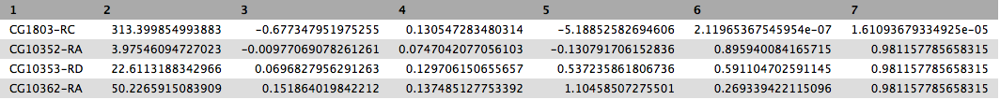
>
>In addition to the list of genes DESeq2 outputs a graphical summary of the result. It includes a number of plots that should be used to evaluate the quality of the experiment. The histogram of *p*-values below shows that in our sample there is in fact just one instance of a significant *p*-value:
>
>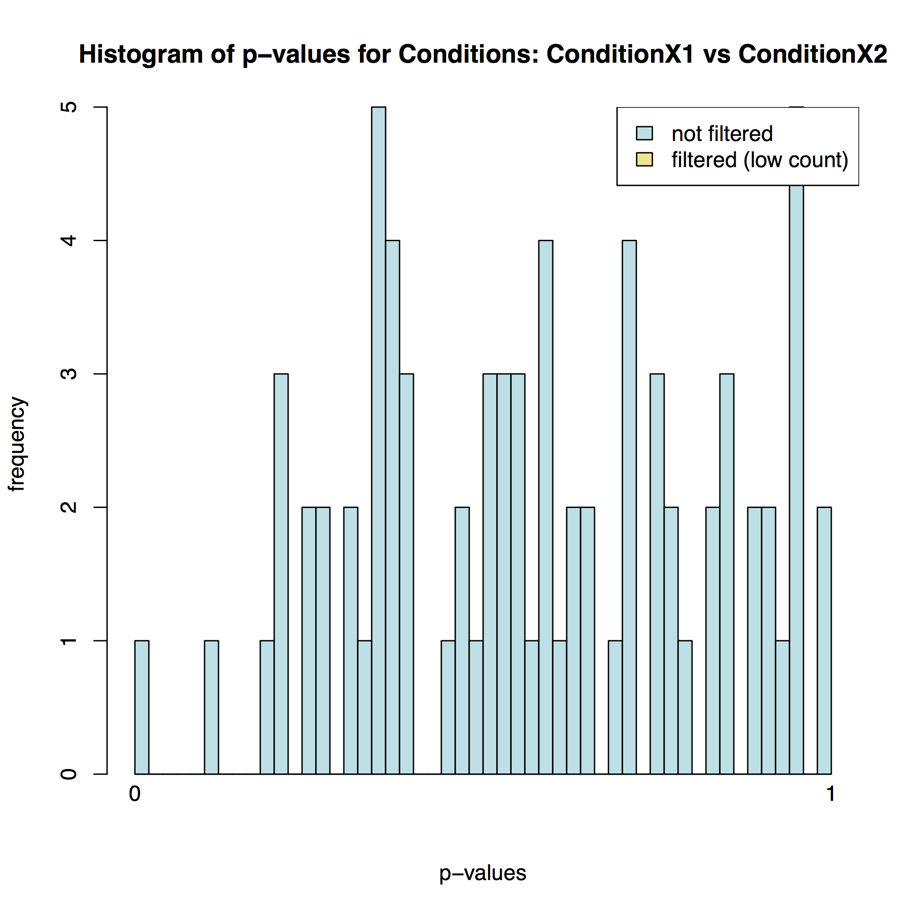
>
>The [MA plot](https://en.wikipedia.org/wiki/MA_plot) below shows the relationship between the expression change (M) and average expression strength (A). Genes with adjusted *p*-value < 0.1 are in red (there is only one such gene in thi sample at the bottom of the graph):
>
>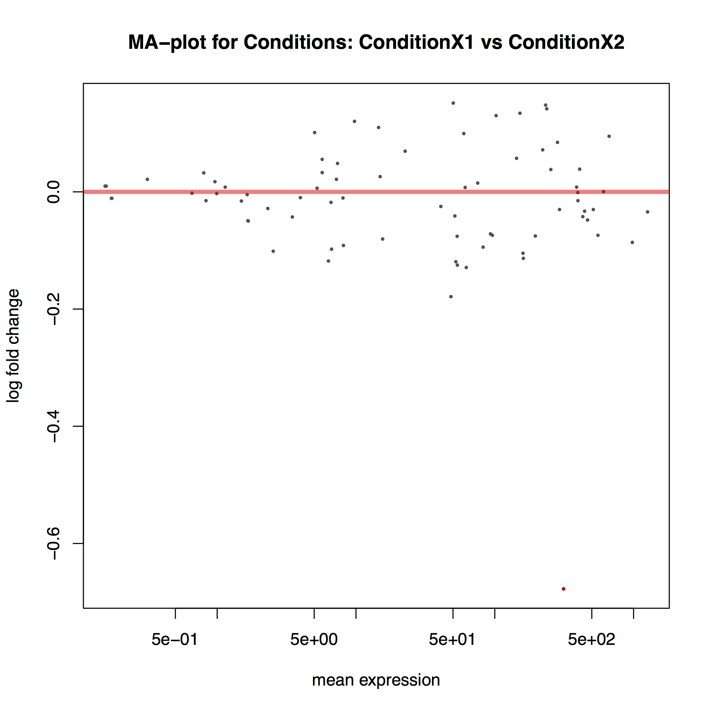
>
>The Principal Component Analysis ([PCA](https://en.wikipedia.org/wiki/Principal_component_analysis)) shows the separation between Condition 1 and 2. This type of plot is useful for visualizing the overall effect of experimental covariates and batch effects (each replicate is plotted as an individual data point):
>
>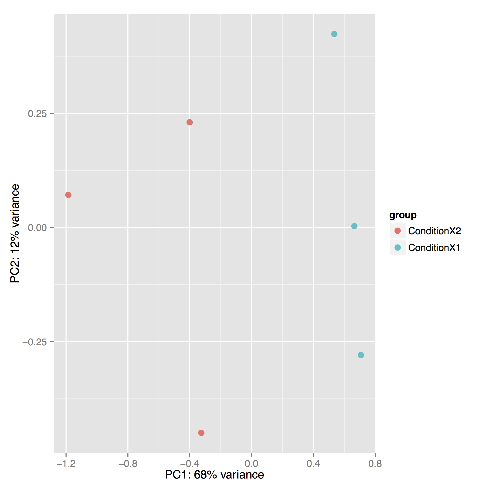
>
>A heatmap of sample-to-sample distance matrix gives us an overview over similarities and dissimilarities between samples:
>
>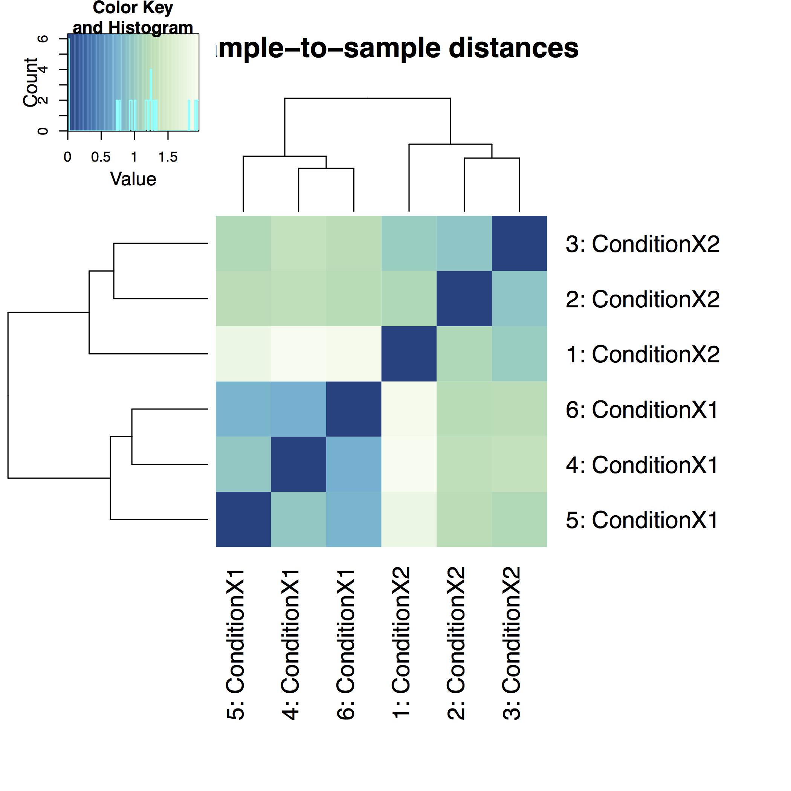
