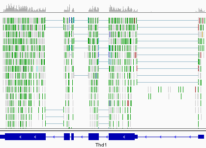
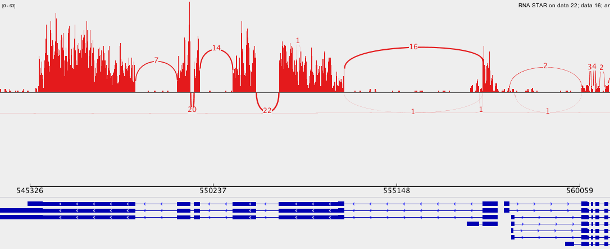
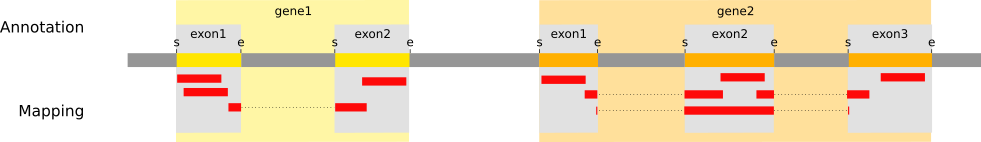
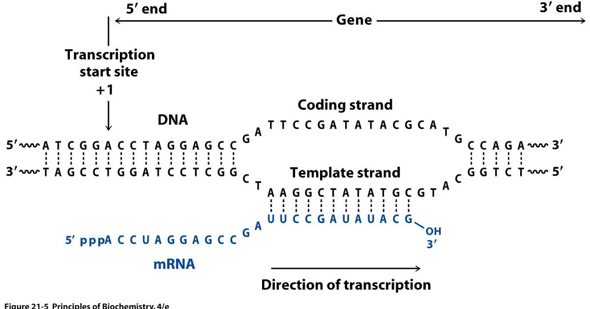
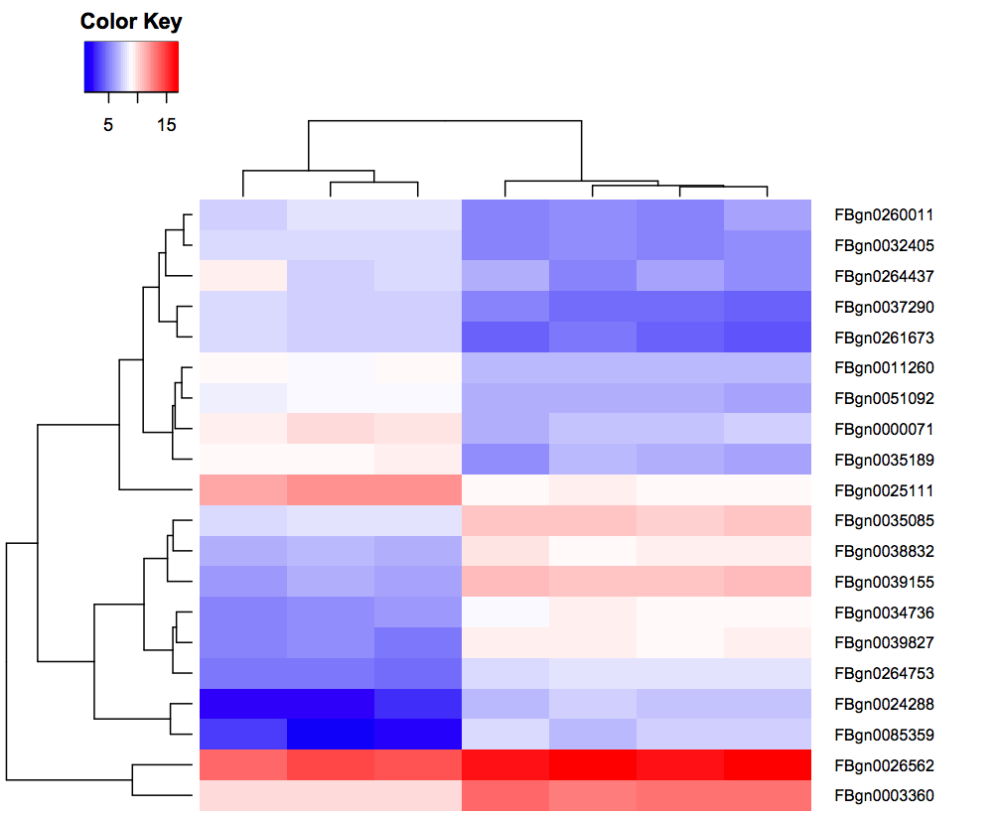

# Introduction
{:.no_toc}

In the study of [Brooks *et al.* 2011](http://genome.cshlp.org/content/21/2/193.long), the *Pasilla* (*PS*) gene, *Drosophila* homologue of the Human splicing regulators Nova-1 and Nova-2 Proteins, was depleted in *Drosophila melanogaster* by RNAi. The authors wanted to identify exons that are regulated by *Pasilla* gene using RNA sequencing data.

Total RNA was isolated and used for preparing either single-end or paired-end RNA-seq libraries for treated (PS depleted) samples and untreated samples. These libraries were sequenced to obtain a collection of RNA sequencing reads for each sample. The effects of *Pasilla* gene depletion on splicing events can then be analyzed by comparison of RNA sequencing data of the treated (PS depleted) and the untreated samples.

The genome of *Drosophila melanogaster* is known and assembled. It can be used as reference genome to ease this analysis.  In a reference based RNA-seq data analysis, the reads are aligned (or mapped) against a reference genome, *Drosophila melanogaster* here, to significantly improve the ability to reconstruct transcripts and then identify differences of expression between several conditions.

> ### Agenda
>
> In this tutorial, we will deal with:
>
> 1. TOC
> {:toc}
>
{: .agenda}

# Pretreatments

## Data upload

The original data is available at NCBI Gene Expression Omnibus (GEO) under accession number [GSE18508](https://www.ncbi.nlm.nih.gov/geo/query/acc.cgi?acc=GSE18508).

We will look at the 7 first samples:

- 3 treated samples with *Pasilla* (PS) gene depletion: [GSM461179](https://www.ncbi.nlm.nih.gov/geo/query/acc.cgi?acc=GSM461179), [GSM461180](https://www.ncbi.nlm.nih.gov/geo/query/acc.cgi?acc=GSM461180), [GSM461181](https://www.ncbi.nlm.nih.gov/geo/query/acc.cgi?acc=GSM461181)
- 4 untreated samples: [GSM461176](https://www.ncbi.nlm.nih.gov/geo/query/acc.cgi?acc=GSM461176), [GSM461177](https://www.ncbi.nlm.nih.gov/geo/query/acc.cgi?acc=GSM461177), [GSM461178](https://www.ncbi.nlm.nih.gov/geo/query/acc.cgi?acc=GSM461178), [GSM461182](https://www.ncbi.nlm.nih.gov/geo/query/acc.cgi?acc=GSM461182)

Each sample constitutes a separate biological replicate of the corresponding condition (treated or untreated). Moreover, two of the treated and two of the untreated samples are from a paired-end sequencing assay, while the remaining samples are from a single-end sequencing experiment.

We have extracted sequences from the Sequence Read Archive (SRA) files to build FASTQ files.

> ###  Hands-on: Data upload
>
> 1. Create a new history for this RNA-seq exercise
> 2. Import the FASTQ file pairs for
>       - `GSM461177` (untreated): `GSM461177_1` and `GSM461177_2`
>       - `GSM461180` (treated): `GSM461180_1` and `GSM461180_2`
>
>       To import the files, there are two options:
>       - Option 1: From a shared data library if available (ask your instructor)
>       - Option 2: From [Zenodo](https://dx.doi.org/10.5281/zenodo.1185122)
>
>           > ###  Tip: Importing data via links
>           >
>           > * Copy the link location
>           > * Open the Galaxy Upload Manager
>           > * Select **Paste/Fetch Data**
>           > * Paste the link into the text field
>           > * Press **Start**    
>           {: .tip}
>           
>           You can directly paste:
>
>           ```
>           https://zenodo.org/record/1185122/files/GSM461177_1.fastqsanger
>           https://zenodo.org/record/1185122/files/GSM461177_2.fastqsanger
>           https://zenodo.org/record/1185122/files/GSM461180_1.fastqsanger
>           https://zenodo.org/record/1185122/files/GSM461180_2.fastqsanger
>           ```
>
> 3. Rename the datasets according to the samples
> 4. Check that the datatype is `fastqsanger` (**not** `fastq`).
>    If the datatype is `fastq`, please change the file type to `fastqsanger`
>
>    > ###  Tip: Changing the datatype
>    > * Click on the pencil button displayed in your dataset in the history
>    > * Choose **Datatype** on the top
>    > * Select `fastqsanger`
>    > * Press **Save**
>    {: .tip}
>
> 5. Add to each database a tag corresponding to the name of the sample (`#GSM461177` or `#GSM461180`)
> 
>    > ###  Tip: Adding a tag
>    > * Click on the dataset
>    > * Click on **Edit dataset tags**
>    > * Add the tag starting with `#`
>    >    
>    >     The tags starting with `#` will be automatically propagated to the outputs of tools using this dataset.
>    >  
>    > * Check that the tag is apparing below the dataset name
>    > 
>    {: .tip}
{: .hands_on}

The sequences are raw data from the sequencing machine, without any pretreatments. They need to be assessed for their quality.

## Quality control

For quality control, we use similar tools as described in [NGS-QC tutorial]({{site.baseurl}}/topics/sequence-analysis): [FastQC](https://www.bioinformatics.babraham.ac.uk/projects/fastqc/) and [Trim Galore](https://www.bioinformatics.babraham.ac.uk/projects/trim_galore/).

> ###  Hands-on: Quality control
>
> 1. **FastQC** : Run FastQC on the FASTQ files to control the quality of the reads
>       - "Short read data from your current history"
>           - Click on "Multiple datasets"
>           - Select all raw datasets
>
>       > ###  Tip
>       >
>       > You can select several files by keeping the CTRL (or COMMAND) key pressed and clicking on the interesting files
>       {: .tip}
>
> 2. Inspect on the generated webpage for `GSM461177_1` sample
>
>    > ###  Questions
>    >
>    > What is the read length?
>    >
>    >    <details>
>    >    <summary>Click to view answers</summary>
>    >    The read length is 37 bp
>    >    </details>
>    {: .question}
>
> 3. **MultiQC** : Aggregate the FastQC reports with
>      - "Which tool was used generate logs?" to `FastQC`
>      - "Type of FastQC output?" to `Raw data`
>      - "FastQC output" to the generated `Raw data` files (multiple datasets)
>
> 4. Inspect the webpage output from MultiQC
>
>    > ###  Questions
>    >
>    > What is the quality for the sequences for the different files?
>    >
>    >    <details>
>    >    <summary>Click to view answers</summary>
>    >    Everything seems ok for 3 of the files. But for GSM461180_2, the quality seems to decrease quite a lot at the end of the sequences
>    >    </details>
>    {: .question}
>
> 2. **Trim Galore** : Treat for the quality of sequences by running Trim Galore! with
>      - "Is this library paired- or single-end?" to `Paired-end`
>      - First "Reads in FASTQ format" to both `_1` fastqsanger datasets (multiple datasets)
>      - Second "Reads in FASTQ format" to both `_2` fastqsanger datasets (multiple datasets)
>
>    > ###  Questions
>    >
>    > Why do we run Trim Galore! only once on a paired-end dataset and not twice, once for each dataset?
>    >
>    > <details>
>    > <summary>Click to view answers</summary>
>    > Trim Galore can remove sequences if they become too short during the trimming process. For paired-end files Trim Galore! removes entire sequence pairs if one (or both) of the two reads became shorter than the set length cutoff. Reads of a read-pair that are longer than a given threshold but for which the partner read has become too short can optionally be written out to single-end files. This ensures that the information of a read pair is not lost entirely if only one read is of good quality.
>    > </details>
>    {: .question}
>
{: .hands_on}

As the genome of *Drosophila melanogaster* is known and assembled, we can use this information and map the sequences on this genome to identify the effects of *Pasilla* gene depletion on splicing events.

# Mapping

To make sense of the reads, we need to determine to which genes they belong. The first step is to determine their positions within the *Drosophila melanogaster* genome. This process is known as aligning or 'mapping' the reads to a reference.

> ###  Comment
>
> Do you want to learn more about the principles behind mapping? Follow our [training]({{site.baseurl}}/topics/sequence-analysis/)
{: .comment}

Because in the case of a eukaryotic transcriptome, most reads originate from processed mRNAs lacking introns, they cannot be simply mapped back to the genome as we normally do for DNA data. Instead the reads must be separated into two categories:

- Reads that map entirely within exons
- Reads that cannot be mapped within an exon across their entire length because they span two or more exons

")

Spliced mappers have been developed to efficiently map transcript-derived reads against genomes:

 identification of the reads spanning a single exon, (2) identification of the splicing junctions on the unmapped reads")

<details>
<summary>Click for more details on the difference spliced mappers</summary>

<p>Several spliced mappers have been developed over the year specially with the explosion of RNA-seq data.</p>

<p><a hef="https://ccb.jhu.edu/software/tophat/index.shtml">TopHat</a> (<a href="https://academic.oup.com/bioinformatics/article/25/9/1105/203994">Trapnell et al, Bioinformatics, 2009</a>) was one of the first tools designed specifically to address this problem. In TopHat reads are mapped against the genome and are separated into two categories: (1) those that map, and (2) those that initially unmapped (IUM). "Piles" of reads representing potential exons are extended in search of potential donor/acceptor splice sites and potential splice junctions are reconstructed. IUMs are then mapped to these junctions.</p>

")

<p>TopHat has been subsequently improved with the development of TopHat2 (<a href="https://genomebiology.biomedcentral.com/articles/10.1186/gb-2013-14-4-r36">Kim et al, Genome Biology, 2013</a>):</p>

")

<p>To further optimize and speed up spliced read alignment Kim et al (<a href="https://www.nature.com/articles/nmeth.3317">Nat Methods, 2015</a>) developed <a href="https://ccb.jhu.edu/software/hisat2/index.shtml">HISAT</a>. It uses a set of <a href="https://en.wikipedia.org/wiki/FM-index">FM-indices</a> consisting one global genome-wide index and a collection of ~48,000 local overlapping 42 kb indices (~55,000 56 kb indices in HISAT2). This allows to find initial seed locations for potential read alignments in the genome using global index and to rapidly refine these alignments using a corresponding local index:</p>

")

<p>A part of the read (blue arrow) is first mapped to the genome using the global FM index. The HISAT then tries to extend the alignment directly utilizing the genome sequence (violet arrow). In (<strong>a</strong>) it succeeds and this read aligned as it completely resides within an exon. In (<strong>b</strong>) the extension hits a mismatch. Now HISAT takes advantage of the local FM index overlapping this location to find the appropriate mapping for the remainder of this read (green arrow). The (<strong>c</strong>) shows a combination these two strategies: the beginning of the read is mapped using global FM index (blue arrow), extended until it reaches the end of the exon (violet arrow), mapped using local FM index (green arrow) and extended again (violet arrow).</p>

<p><a href="https://github.com/alexdobin/STAR">STAR aligner</a> is a fast alternative for mapping RNAseq reads against genome utilizing uncompressed <a href="https://en.wikipedia.org/wiki/Suffix_array">suffix array</a>. It operates in two stages (<a href="https://academic.oup.com/bioinformatics/article/29/1/15/272537">Dobin et al, Bioinformatics, 2013</a>). In the first stage it performs seed search:</p>

")

<p>Here a read is split between two consecutive exons. STAR starts to look for a maximum mappable prefix (MMP) from the beginning of the read until it can no longer match continuously. After this point it start to MMP for the unmatched portion of the read (<strong>a</strong>). In the case of mismatches (<strong>b</strong>) and unalignable regions (<strong>c</strong>) MMPs serve as anchors from which to extend alignments</p>

<p>At the second stage STAR stitches MMPs to generate read-level alignments that (contrary to MMPs) can contain mismatches and indels. A scoring scheme is used to evaluate and prioritize stitching combinations and to evaluate reads that map to multiple locations. STAR is extremely fast but requires a substantial amount of RAM to run efficiently.</p>
</details>

## Mapping

We will map our RNA reads to the *Drosophila melanogaster* genome using STAR.

> ###  Hands-on: Spliced mapping
>
> 1. Import the Ensembl gene annotation for *Drosophila melanogaster* (`Drosophila_melanogaster.BDGP6.87.gtf`) from the shared data library or from [Zenodo](https://dx.doi.org/10.5281/zenodo.1185122) into your current Galaxy history
>    - Rename the dataset if necessary
>    - Verify that the datatype is `gtf` and not `gff`
>
> 2. **RNA STAR** : Map your reads on the reference genome with
>    - "Single-end or paired-end reads" to `Paired-end (as individual datasets)`
>    - "RNA-Seq FASTQ/FASTA file, forward reads" to the generated `trimmed reads pair 1` files (multiple datasets)
>    - "RNA-Seq FASTQ/FASTA file, reverse reads" to the generated `trimmed reads pair 2` files (multiple datasets)
>    - "Custom or built-in reference genome" to `Use a built-in index`
>    - "Reference genome with or without an annotation" to `use genome reference without builtin gene-model`
>    - "Select reference genome" to `Drosophila Melanogaster (dm6)`
>    - "Gene model (gff3,gtf) file for splice junctions" to the imported `Drosophila_melanogaster.BDGP6.87.gtf`
>    - "Length of the genomic sequence around annotated junctions" to `36`
>
>        This parameter should be length of reads - 1
>
> 3. **MultiQC** : Aggregate the STAR logs with
>      - "Which tool was used generate logs?" to `STAR`
>      - "Type of FastQC output?" to `Log`
>      - "STAR log output" to the generated `log` files (multiple datasets)
>
>    > ###  Question
>    >
>    > Which percentage of reads were mapped exactly once for both samples?
>    >
>    >    <details>
>    >    <summary>Click to view answer</summary>
>    >    More than 83% for GSM461177 and more than 78% for GSM461180
>    >    </details>
>    {: .question}
{: .hands_on}

**STAR** generates a BAM file with the mapped reads.

> ###  Question
>
> 1. What is a BAM file?
> 2. What does such a file contain?
>
>    <details>
>    <summary>Click to view answer</summary>
>    <ol type="1">
>    <li>a BAM file is the binary version of a SAM file</li>
>    <li>It contains information about the mapping: for each mapped read, the position on the reference genome, the mapping quality, ...</li>
>    </ol>
>    </details>
{: .question}

## Inspection of the mapping results

The BAM file contains information about where the reads are mapped on the reference genome. But it is a binary file and with the information for more than 3 million reads encoded in it, it is difficult to inspect and explore the file.

A powerful tool to visualize the content of BAM files is the Integrative Genomics Viewer IGV.

> ###  Hands-on: Inspection of mapping results
>
> 1. **IGV** : Visualize the aligned reads for `GSM461177`
>     - Click on the STAR BAM output in your history to expand it.
>     - Towards the bottom of the history item, find the line starting with `Display with IGV`
>        
>        This is followed by 2 links:
>        - option 1: `local`. Select this option if you already have IGV installed on your machine
>        - option 2: `D. melanogaster (dm3)`. This will download and launch IGV on your local machine
>
>    > ###  Comments
>    >
>    > In order for this step to work, you will need to have either IGV or [Java web start](https://www.java.com/en/download/faq/java_webstart.xml)
>    > installed on your machine. However, the questions in this section can also be answered by inspecting the IGV screenshots below.
>    >
>    > Check the [IGV documentation](https://software.broadinstitute.org/software/igv/AlignmentData) for more information.
>    >
>    {: .comment}
>
> 2. **IGV** : Zoom to `chr4:540,000-560,000` (Chromosome 4 between 540 kb to 560 kb)
>
>    > ###  Question
>    >
>    > 
>    >
>    > 1. Which information does appear on the top in grey?
>    > 2. What do the connecting lines between some of the aligned reads indicate?
>    >
>    >    <details>
>    >    <summary>Click to view answers</summary>
>    >    <ol type="1">
>    >    <li>The coverage plot: the sum of mapped reads at each position</li>
>    >    <li>They indicate junction events (or splice sites), *i.e.*, reads that are mapped across an intron</li>
>    >    </ol>
>    >    </details>
>    {: .question}
>
> 3. **IGV** : Inspect the splice junctions using a **Sashimi plot**
>
>    > ###  Tip: Creation of a Sashimi plot
>    >
>    > * Right click on the BAM file
>    > * Select **Sashimi Plot** from the context menu
>    {: .tip}    
>
>    > ###  Question
>    >
>    > 
>    >
>    > 1. What does the vertical bar graph represent? And the numbered arcs?
>    > 2. What do the numbers on the arcs mean?
>    > 3. Why do we observe different stacked groups of blue linked boxes at the bottom?
>    >
>    >    <details>
>    >    <summary>Click to view answers</summary>
>    >    <ol type="1">
>    >    <li>The coverage for each alignment track is plotted as a bar graph. Arcs represent observed splice junctions, *i.e.*, reads spanning introns</li>
>    >    <li>The numbers refer to the number of these observed junction reads. </li>
>    >    <li>The groups of linked boxes on the bottom represent different transcripts from a single gene differing in the involved exon.</li>
>    >    </ol>
>    >    </details>
>    {: .question}
>
>    > ###  Comment
>    >
>    > Check the [IGV documentation on Sashimi plots](https://software.broadinstitute.org/software/igv/Sashimi) to find some clues
>    {: .comment}
>
{: .hands_on}

After the mapping, we have the information on where the reads are located on the reference genome. We also know how well they were mapped.

The next step in the RNA-Seq data analysis is quantification of expression level of the genomic features (gene, transcript, exons, ...) to be able then to compare several samples for the different expression analysis. The quantification consist into taking each known genomic feature (*e.g.* gene) of the reference genome and then counting how many reads are mapped on this genomic feature. So, in this step, we start with an information per mapped reads to end with an information per genomic feature.

> ###  Comment
>
> The quantification depends on the definition of the genomic features of the reference genome, and then on the annotations. We strongly recommend you to use an annotation corresponding to the same version of the reference genome you used for the mapping.
{: .comment}

To identify exons that are regulated by the *Pasilla* gene, we need to identify genes and exons which are differentially expressed between samples with PS gene depletion and control samples.
In this tutorial, we will then analyze the differential gene expression, but also the differential exon usage.

Did mapping exercise work for you? Great! :tada:

# Analysis of the differential gene expression

We will first investigate the differential gene expression to identify which genes are impacted by the *Pasilla* gene depletion

## Count the number of reads per annotated gene

To compare the expression of single genes between different conditions (*e.g.* with or without PS depletion), an essential first step is to quantify the number of reads per gene. 



Two main tools could be used for that: [HTSeq-count](http://htseq.readthedocs.io/en/release_0.9.1/count.html) ([Anders et al, Bioinformatics, 2015](https://academic.oup.com/bioinformatics/article/31/2/166/2366196)) or featureCounts ([Liao et al, Bioinformatics, 2014](https://academic.oup.com/bioinformatics/article/31/2/166/2366196)). The second one is considerably faster and requires far less computational resources. We will use it.

In principle, the counting of reads overlapping with genomic features is a fairly simple task. But there are some details that need to be given to featureCounts: for example the strandness...

### Estimation of the strandness

RNAs that are typically targeted in RNAseq experiments are single stranded (*e.g.*, mRNAs) and thus have polarity (5' and 3' ends that are functionally distinct):



During a typical RNAseq experiment the information about strandedness is lost after both strands of cDNA are synthesized, size selected, and converted into sequencing library. However, this information can be quite useful for the read counting.

Some library preparation protocols create so called *stranded* RNAseq libraries that preserve the strand information (an excellent overview in [Levin et al, Nat Meth, 2010](https://www.ncbi.nlm.nih.gov/pmc/articles/PMC3005310/)). The implication of stranded RNAseq is that you can distinguish whether the reads are derived from forward- or reverse-encoded transcripts:

")

Depending on the approach and whether one performs single- or paired-end sequencing there are multiple possibilities on how to interpret the results of mapping of these reads onto the genome:

")

In practice, with Illumina paired-end RNAseq protocols, you are unlikely to uncover many of these possibilities. You will either deal with:

- Unstranded RNAseq data
- Stranded RNAseq data produced with Illumina TrueSeq RNAseq kits and [dUTP tagging](https://nar.oxfordjournals.org/content/37/18/e123) (**ISR**)

This information should usually come with your FASTQ files, ask your sequencing facility! If not, try to find them on the site where you downloaded the data or in the corresponding publication.

Another option is to estimate these parameters with a tool called **Infer Experiment**. This tool takes the output of your mappings (BAM files), takes a subsample of your reads and compares their genome coordinates and strands with those of the reference gene model (from an annotation file). Based on the strand of the genes, it can gauge whether sequencing is strand-specific, and if so, how reads are stranded.

> ###  Hands-on: Determining the library strandness
>
> 1. **Infer Experiment** : Determine the library strandness with:
>    - "Input .bam file" to the STAR-generated `BAM` files (multiple datasets)
>    - "Reference gene model" to `Drosophila_melanogaster.BDGP6.87.gtf`
>    - "Number of reads sampled from SAM/BAM file (default = 200000)" to `200000`
{: .hands_on}

The tool generates one file with:
- Paired-end or singled-end library
- Fraction of reads failed to determine
- 2 lines
    - For single-end
        - Fraction of reads explained by "++,--" (**SF** in previous figure)
        - Fraction of reads explained by "+-,-+" (**SR** in previous figure)
    - For paired-end
        - Fraction of reads explained by "1++,1--,2+-,2-+" (**SF** in previous figure)
        - Fraction of reads explained by "1+-,1-+,2++,2--" (**SR** in previous figure) 

If the fractions in the two last lines are too close to each other, we conclude that this is the library is not specific to a strand specific dataset (**U** in previous figure).

> ###  Question
>
> 1. Which fraction of the reads in the BAM file can be explained assuming which library type for `GSM461177`?
> 2. Which library type do you choose for both samples?
>
>    <details>
>    <summary>Click to view answer</summary>
>    <ol type="1">
>    <li>Fraction of reads explained by "1++,1--,2+-,2-+": 0.4648 - Fraction of reads explained by "1+-,1-+,2++,2--": 0.4388</li>
>    <li>The library seems to be of the type unstranded for both samples. </li>
>    </ol>
>    </details>
{: .question}

> ###  Comment
> As it is sometimes quite difficult to find out which settings correspond to those of other programs, the following table might be helpful to identify the library type:
>
> Library type | **Infer Experiment** | **TopHat** | **HISAT2** | **htseq-count** | **featureCounts**
> --- | --- | --- | --- | --- | ---
> Paired-End (PE) - SF | 1++,1--,2+-,2-+ | FR Second Strand | Second Strand F/FR | yes | Forward (1)
> PE - SR | 1+-,1-+,2++,2-- | FR First Strand | First Strand R/RF | reverse | Reverse (2)
> Single-End (SE) - SF | ++,-- | FR Second Strand | Second Strand F/FR | yes | Forward (1)
> SE - SR | +-,-+ | FR First Strand | First Strand R/RF | reverse | Reverse (2)
> PE, SE - U | undecided | FR Unstranded | default | no | Unstranded (0)
>
{: .comment}

### Counting

We now run **featureCounts** to count the number of reads per annotated gene.

> ###  Hands-on: Counting the number of reads per annotated gene
>
> 1. **featureCounts** : Count the number of reads per genes using **featureCounts** with
>    - "Alignment file" to the STAR-generated `BAM` files (multiple datasets)
>    - "Gene annotation file" to `GTF file`
>    - "Gene annotation file" to `in your history`
>    - "Gene annotation file" to `Drosophila_melanogaster.BDGP6.87.gtf`
>    - "Output format" to `Gene-ID "\t" read-count (DESeq2 IUC wrapper compatible)`
>    - Click on "Advanced options"
>    - "GFF feature type filter" to `exon`
>    - "GFF gene identifier" to `gene_id`
>    - "Allow read to contribute to multiple features" to `No`
>    - "Strand specificity of the protocol" to `Unstranded`
>    - "Count multi-mapping reads/fragments" to `Disabled; multi-mapping reads are excluded (default)`
>    - "Minimum mapping quality per read" to `10`
>
> 2. **MultiQC** : Aggregate the FastQC report with
>      - "Which tool was used generate logs?" to `featureCounts`
>      - "Output of FeatureCounts" to the generated `summary` files (multiple datasets)
>
>    > ###  Question
>    >
>    > 1. How many reads have been assigned to a gene?
>    >
>    >    <details>
>    >    <summary>Click to view answers</summary>
>    >    <ol type="1">
>    >    <li>Around 70% of the reads have been assigned to genes: this quantity is correct enough. If it is going below 50%, you should investigate where are mapping your reads (with IGV) and check that the annotation corresponds to the reference genome (version).</li>
>    >    </ol>
>    >    </details>
>    {: .question}
>
{: .hands_on}

The main output of **featureCounts** is a big table. 

> ###  Question
>
> 1. Which information does the generated table files contain?
> 2. Which feature has the most reads mapped on it for both samples?
>
>    <details>
>    <summary>Click to view answers</summary>
>    <ol type="1">
>    <li>The useful result file is a tabular file with two columns: the gene id and the number of reads mapped on the corresponding gene</li>
>    <li>To display the most abundantly detected feature, we need to sort the files with the features and the number of reads mapped to them. This can be done using the Sort tool on the second column and in descending order, which reveals that FBgn0000556 is the feature with the most reads (around 258,000 in GSM461177 and 253,000 in GSM461180) mapped on it.</li>
>    </ol>
>    </details>
{: .question}

## Identification of the differentially expressed features

In the previous section, we counted reads that mapped to genes for two sample. To be able to identify differential gene expression induced by PS depletion, all datasets (3 treated and 4 untreated) must be analyzed following the same procedure and for the whole genome.

> ###  (Optional) Hands-on: Re-run on the other datasets
>
> You can do the same process on the other sequence files available on [Zenodo](https://dx.doi.org/10.5281/zenodo.1185122)
>
> - Paired-end data
>     - `GSM461178_1` and `GSM461178_2`
>     - `GSM461181_1` and `GSM461181_2`
> - Single-end data
>     - `GSM461176`
>     - `GSM461179`
>     - `GSM461182`
>
> This is really interesting to redo on the other datasets, specially to check how the parameters are inferred given the different type of data.
{: .hands_on}

To save time, we have run the necessary steps for you and obtained 7 count files, available on [Zenodo](https://dx.doi.org/10.5281/zenodo.1185122).

These files contain for each gene of *Drosophila* the number of reads mapped to it. We could compare the files directly and calculate the extent of differential gene expression, but the number of sequenced reads mapped to a gene depends on:

- Its own expression level
- Its length
- The sequencing depth of the sample
- The expression of all other genes within the sample

Either for within- or for between-sample comparison, the gene counts need to be normalized. We can then use the Differential Gene Expression (DGE) analysis, whose two basic tasks are:

- Estimate the biological variance using the replicates for each condition
- Estimate the significance of expression differences between any two conditions

This expression analysis is estimated from read counts and attempts are made to correct for variability in measurements using replicates that are absolutely essential for accurate results. For your own analysis, we advice you to use at least 3, but preferably 5 biological replicates per condition. You can have different number of replicates per condition.

[**DESeq2**](https://bioconductor.org/packages/release/bioc/html/DESeq2.html) is a great tool for DGE analysis. It takes read counts produced previously, combines them into a big table (with genes in the rows and samples in the columns) and applies size factor normalization:

- Computation for each gene of the geometric mean of read counts across all samples
- Division of every gene count by the geometric mean
- Use of the median of these ratios as a sample's size factor for normalization

Multiple factors with several levels can then be incorporated in the analysis. After normalization we can compare, in a statistically reliable way, the response of the expression of any gene to the presence of different levels of a factor.

In our example, we have samples with two varying factors that can explain differences in gene expression:

- Treatment (either treated or untreated)
- Sequencing type (paired-end or single-end)

Here treatment is the primary factor which we are interested in. The sequencing type is some further information that we know about the data that might affect the analysis. This particular multi-factor analysis allows us to assess the effect of the treatment, while taking the sequencing type into account, too.

> ###  Comment
>
> We recommend you to add as many factors as you think may affect gene expression in your experiment. It can be the sequencing type like here, but it can also be the manipulation (if different persons are involved in the library preparation), ...
{: .comment}

> ###  Hands-on: Determines differentially expressed features
>
> 1. Create a new history
> 2. Import the seven count files from [Zenodo](https://dx.doi.org/10.5281/zenodo.1185122) or the data library
>    - `GSM461176_untreat_single.counts`
>    - `GSM461177_untreat_paired.counts`
>    - `GSM461178_untreat_paired.counts`
>    - `GSM461179_treat_single.counts`
>    - `GSM461180_treat_paired.counts`
>    - `GSM461181_treat_paired.counts`
>    - `GSM461182_untreat_single.counts`
>
> 3. **DESeq2** : Run **DESeq2** with:
>    - For "1: Factor"
>       - "Specify a factor name" to `Treatment`
>       - "1: Factor level"
>           - "Specify a factor level" to `treated`
>           - "Counts file(s)" to the 3 gene count files (multiple datasets) with `treated` in name
>       - "2: Factor level"
>           - "Specify a factor level" to `untreated`
>           - "Counts file(s)" to the 4 gene count files (multiple datasets) with `untreated` in name
>    - Click on "Insert Factor" (not on "Insert Factor level")
>    - For "2: Factor"
>       - "Specify a factor name" to `Sequencing`
>       - "1: Factor level"
>           - "Specify a factor level" to `PE`
>           - "Counts file(s)" to the generated count files (multiple datasets) with `paired` in name
>       - "2: Factor level"
>           - "Specify a factor level" to `SE`
>           - "Counts file(s)" to the generated count files (multiple datasets) with `single` in name   
>    - "Output normalized counts table" to `Yes`
{: .hands_on}

**DESeq2** generated 3 outputs

- A table with the normalized counts for each genes (rows) and each samples (columns)
- A graphical summary of the results, useful to evaluate the quality of the experiment:

    1. Histogram of *p*-values for all tests
    2. [MA plot](https://en.wikipedia.org/wiki/MA_plot): global view of the relationship between the expression change of conditions (log ratios, M), the average expression strength of the genes (average mean, A), and the ability of the algorithm to detect differential gene expression. The genes that passed the significance threshold (adjusted p-value < 0.1) are colored in red.
    3. Principal Component Analysis ([PCA](https://en.wikipedia.org/wiki/Principal_component_analysis)) and the first two axes

        Each replicate is plotted as an individual data point. This type of plot is useful for visualizing the overall effect of experimental covariates and batch effects.

        > ###  Questions
        >
        > 1. What is the first axis separating?
        > 2. And the second axis?    
        >
        >    <details>
        >    <summary>Click to view answers</summary>
        >    <ol type="1">
        >    <li>The first axis is seperating the treated samples from the untreated samples, as defined when DESeq2 was launched</li>
        >    <li>The second axis is separating the single-end datasets from the paired-end datasets</li>
        >    </ol>
        >    </details>
        {: .question}


    4. Heatmap of sample-to-sample distance matrix: overview over similarities and dissimilarities between samples

        > ###  Questions
        >
        > How are the samples grouped?
        >
        >    <details>
        >    <summary>Click to view answers</summary>
        >    <ol type="1">    
        >    <li>They are first grouped depending on the treatment (the first factor) and after on the library type (the second factor), as defined when DESeq2 was launched</li>
        >    </ol>
        >    </details>
        {: .question}

    5. Dispersion estimates: gene-wise estimates (black), the fitted values (red), and the final maximum a posteriori estimates used in testing (blue)

        This dispersion plot is typical, with the final estimates shrunk from the gene-wise estimates towards the fitted estimates. Some gene-wise estimates are flagged as outliers and not shrunk towards the fitted value. The amount of shrinkage can be more or less than seen here, depending on the sample size, the number of coefficients, the row mean and the variability of the gene-wise estimates.

- A summary file with the following values for each gene

    1.  Gene identifiers
    2.  Mean normalized counts, averaged over all samples from both conditions
    3.  Logarithm (to basis 2) of the fold change

        The log2 fold changes are based on primary factor level 1 vs. factor level 2, hence the order of factor levels is important. For example, for the factor 'Treatment', DESeq2 computes fold changes of 'treated' samples against 'untreated', *i.e.* the values correspond to up- or downregulation of genes in treated samples.

    4.  Standard error estimate for the log2 fold change estimate
    5.  [Wald](https://en.wikipedia.org/wiki/Wald_test) statistic
    6.  *p*-value for the statistical significance of this change
    7.  *p*-value adjusted for multiple testing with the Benjamini-Hochberg procedure which controls false discovery rate ([FDR](https://en.wikipedia.org/wiki/False_discovery_rate))

> ###  Comment
>
> For more information about **DESeq2** and its outputs, you can have a look at [**DESeq2** documentation](https://www.bioconductor.org/packages/release/bioc/manuals/DESeq2/man/DESeq2.pdf).
{: .comment}

## Visualization of the differentially expressed genes

We would like now to draw an heatmap of the normalized counts for each sample for the most differentially expressed genes.

We would proceed in several steps
- Extract the most differentially expressed genes using the DESeq2 summary file
- Extract the normalized counts of these genes for each sample using the normalized count file generated by DESeq2
- Plot the heatmap of the normalized counts of these genes for each sample

> ###  Hands-on: Extract the most differentially expressed genes
>
> 1. **Filter** : Extract genes with a significant change in gene expression (adjusted *p*-value below 0.05) between treated and untreated samples
>    - "Filter" to the DESeq2 summary file
>    - "With following condition" to `c7<0.05`
>
>    > ###  Question
>    >
>    > How many genes have a significant change in gene expression between these conditions?
>    >
>    > <details>
>    > <summary>Click to view answers</summary>
>    > We get 1,091 genes (6.21%) with a significant change in gene expression between treated and untreated samples.
>    > </details>
>    {: .question}
>
>    > ###  Comment
>    >
>    > The file with the independent filtered results can be used for further downstream analysis as it excludes genes with only few read counts as these genes will not be considered as significantly differentially expressed.
>    {: .comment}
>
>    The generated file contains to many genes to get a meaningful heatmap. So we will take only the genes with an absoluted fold change > 2
>
> 2. **Filter** : Extract genes with an abs(log<sub>2</sub>FC) > 1 (FC stands for "fold change")
>    - "Filter" to the differentially expressed genes
>    - "With following condition" to `abs(c3)>1`
>
>    > ###  Question
>    >
>    > How many genes have been conserved?
>    >
>    > <details>
>    > <summary>Click to view answers</summary>
>    > 11.92% (130) of the differentially expressed genes 
>    > </details>
>    {: .question}
>
>    The number of genes is still too high there. So we will take only the 10 most up-regulated and 10 most down-regulated genes
>
> 3. **Sort** : Sort the genes by log<sub>2</sub>FC
>    - "Sort Dataset" to the differentially expressed genes with abs(FC) > 2
>    - "on column" to `3`
>    - "with flavor" to `Numerical sort`
>    - "everything in" to `Descending order`
>
> 4. **Select first lines** : Extract the 10 most up-regulated genes
>    - "File to select" to the sorted DE genes with abs(FC) > 2
>    - "Operation" to `Keep first lines`
>    - "Number of lines" to `10`
> 
> 4. **Select last lines** : Extract the 10 most down-regulated genes
>    - "Text file" to the sorted DE genes with abs(FC) > 2
>    - "Operation" to `Keep first lines`
>    - "Number of lines" to `10`
>
> 5. **Concatenate datasets** : Concatenated the 10 most up-regulated genes with the 10 most down-regulated genes
>    - "Datasets to concatenate" to the 10 most up-regulated genes and to the 10 most down-regulated genes
>
{: .hands_on}

We now have a table with 20 lines corresponding to the most differentially expressed genes. And for each of the gene, we have its id, its mean normalized counts (averaged over all samples from both conditions), its log<sub>2</sub>FC and other information.

We could plot the log<sub>2</sub>FC for the different genes, but here we would like to look at the heatmap with the read counts for these genes in the different samples. So we need to extract the read counts for these genes.

We will join the normalized count table generated by DESeq with the table we just generated to conserved in the normalized count table only the lines corresponding to the most differentially expressed genes

> ###  Hands-on: Extract the normalized counts of most differentially expressed genes in the different samples
>
> 1. **Join two Datasets** : Join the two files
>    - "Join" to the normalized count table generated by DESeq2
>    - "using column" to `1`
>    - "with" to the concatenated file with 10 most up-regulated genes and the 10 most down-regulated genes
>    - "and column" to `1`
>    - "Keep lines of first input that do not join with second input" to `No`
>    - "Keep the header lines" to `Yes`
>
>    The generated files has too many columns: the ones with mean normalized counts, the log<sub>2</sub>FC and other information. We need to remove them
>
> 2. **Cut** : Conserve the columns with normalized counts
>    - "Cut columns" to `c1,c2,c3,c4,c5,c6,c7,c8`
>    - "Delimited by" to `Tab`
>    - "From" the joined dataset
>
{: .hands_on}

We have now a table with 20 lines (the most differentially expressed genes) and the normalized counts for these genes in the 7 samples.

> ###  Hands-on: Plot the heatmap of the normalized counts of these genes for each sample
>
> 1. **heatmap2** : Plot the heatmap with 
>    - "Input should have column headers" to the generated table
>    - "Advanced - log transformation" to `Log2(value) transform my data`
>    - "Enable data clustering" to `Yes`
>    - "Coloring groups" to "Blue to white to red"
>
{: .hands_on}

You should obtain something similar to:



> ###  Questions
>
> 1. Do you observe any tendency in the data?
> 2. What is changing if we select `Plot the data as it is` in "Advanced - log transformation"?
> 3. Can you generate an heatmap the normalized counts for the up-regulated genes with FC > 2?
>
> <details>
> <summary>Click to view answers</summary>
> <ol type="1">    
>   <li>The samples are clustering by treatment. The genes are also clustering based on the counts. 2 genes (FBgn0026562, FBgn00003360)</li>
>   <li>The scale is changing and the differences between the genes are not visible anymore</li>
>   <li>Extract the genes with logFC > 2 (filter for genes with c3>1 on the summary of the differentially expressed genes) and run heatmap2 on the generated table</li>
> </ol>
> </details>
{: .question}

## Analysis of the functional enrichment among the differentially expressed genes

We have extracted genes that are differentially expressed in treated (with PS gene depletion) samples compared to untreated samples. We would like to know the functional enrichment among the differentially expressed genes.

[Gene Ontology (GO)](http://www.geneontology.org/) analysis is widely used to reduce complexity and highlight biological processes in genome-wide expression studies, but standard methods give biased results on RNA-seq data due to over-detection of differential expression for long and highly expressed transcripts.

[goseq tool](https://bioconductor.org/packages/release/bioc/vignettes/goseq/inst/doc/goseq.pdf) provides methods for performing GO analysis of RNA-seq data, taking length bias into account. The methods and software used by goseq are equally applicable to other category based tests of RNA-seq data, such as KEGG pathway analysis.

goseq needs 2 files as inputs:
- A tabular file with the differentially expressed genes from all genes assayed in the RNA-seq experiment with 2 columns:
    - the Gene IDs (unique within the file)
    - True (differentially expressed) or False (not differentially expressed)
- A file with information about the length of a gene to correct for potential length bias in differentially expressed genes

> ###  Hands-on: Prepare the datasets for GOSeq
>
> 1. **Compute**  with 
>    - "Add expression" to `bool(c7<0.05)`
>    - "as a new column to" to DESeq summary file
>
> 2. **Cut**  with
>    - "Cut columns" to `c1,c8`
>    - "Delimited by" to `Tab`
>    - "From" to the previously generated file
>
> 3. **Change Case**  with
>    - "From" to the previously generated file
>    - "Change case of columns" to `c1`
>    - "Delimited by" to `Tab`
>    - "To" to `Upper case`
>
>    We just generated the first input for goseq
>
> 4. **Gene length and GC content** with
>    - "Select a built-in GTF file or one from your history" to `Use a GTF from history`
>    - "Select a GTF file" to `Drosophila_melanogaster.BDGP6.87.gtf`
>    - "Select a built-in FASTA or one from your history" to `Use a built-in FASTA`
>    - "Select a FASTA file" to `Fly (Drosophila melanogaster): dm6 Full`
>    - "Output length file?" to `Yes`
>    - "Output GC content file?" to `No`
>
> 5. **Change Case**  with
>    - "From" to the previously generated file
>    - "Change case of columns" to `c1`
>    - "Delimited by" to `Tab`
>    - "To" to `Upper case`
{: .hands_on}

We have now the two required files for goseq.

> ###  Hands-on: Perform GO analysis
>
> 1. **goseq**  with 
>    - "Differentially expressed genes file" to first file generated on previous step
>    - "Gene lengths file" to second file generated on previous step
>    - "Gene categories" to `Get categories`
>    - "Select a genome to use" to `Fruit fly (dm6)`
>    - "Select Gene ID format" to `Ensembl Gene ID`
>    - "Select one or more categories" to `GO: Cellular Component`, `GO: Biological Process`, `GO: Molecular Function`
>
{: .hands_on}

goseq generates a big table with the following columns for each GO term:
1. `category`: GO category
2. `over_rep_pval`: *p*-value for over representation of the term in the differentially expressed genes
3. `under_rep_pval`: *p*-value for under representation of the term in the differentially expressed genes
4. `numDEInCat`: number of differentially expressed genes in this category 
5. `numInCat`: number of genes in this category 
6. `term`: detail of the term
7. `ontology`: MF (Molecular Function - molecular activities of gene products), CC (Cellular Component - where gene products are active), BP (Biological Process - pathways and larger processes made up of the activities of multiple gene products)
8. `p.adjust.over_represented`: *p*-value for over representation of the term in the differentially expressed genes, adjusted for multiple testing with the Benjamini-Hochberg procedure
9. `p.adjust.under_represented`: *p*-value for over representation of the term in the differentially expressed genes, adjusted for multiple testing with the Benjamini-Hochberg procedure

To identify categories significantly enriched/unenriched below some p-value cutoff, it is necessary to use the adjusted *p*-value.

> ###  Questions
>
> 1. How many GO terms are over represented? Under represented?
> 2. How are the over represented GO terms divided between MF, CC and BP? And for under represented GO terms?
>
> <details>
> <summary>Click to view answers</summary>
> <ol type="1">    
>   <li>48 GO terms (0.49%) are over represented and 65 (0.66%) - Filter on c8 (over-represented) and c9 (under-represented)</li>
>   <li>For over-represented, 31 BP, 6 CC and 10 MF - For under-represented, 36 BP, 25 CC and 3 MF - Group data on column 7 and count on column 1</li>
> </ol>
> </details>
{: .question}

# Inference of the differential exon usage

Next, we would like to know the differential exon usage between treated (PS depleted) and untreated samples using RNA-seq exon counts. We will rework on the mapping results we generated previously.

We will use [DEXSeq](https://www.bioconductor.org/packages/release/bioc/html/DEXSeq.html). DEXSeq detects high sensitivity genes, and in many cases exons, that are subject to differential exon usage. But first, as for the differential gene expression, we need to count the number of reads mapping to the exons.

## Count the number of reads per exon

This step is similar to the step of [counting the number of reads per annotated gene](#count-the-number-of-reads-per-annotated-gene) except that, instead of HTSeq-count, we are using DEXSeq-Count.

> ###  Hands-on: Counting the number of reads per exon
>
> 1. **DEXSeq-Count** : Use the **DEXSeq-Count** to prepare the *Drosophila* annotations to extract only exons with corresponding gene ids
>     - "Mode of operation" to `Prepare annotation`
>     - "GTF file" to `Drosophila_melanogaster.BDGP6.87.gtf`
>
>    The output is again a GTF file that is ready to be used for counting
>
> 2. **DEXSeq-Count** : Count reads using **DEXSeq-Count** with
>     - "Mode of operation" to `Count reads`
>     - "Input bam file" to the STAR-generated `BAM` files (multiple datasets)
>     - "DEXSeq compatible GTF file" to the previously generated GTF file
>     - "Is libray paired end?" to `Yes`
>     - "Is library strand specific?" to `No`
>     - "Skip all reads with alignment quality lower than the given minimum value" to `10`
>
{: .hands_on}

DEXSeq generates a file similar to the one generated by featureCounts, but with counts for exons.

> ###  Question
>
> 1. Which exon has the most reads mapped to it for both samples?
> 2. From which gene have these exon been extracted?
> 3. Is there a connection to the previous result obtained with HTSeq-count?
>
> <details>
> <summary>Click to view answers</summary>
> FBgn0000556:005 is the exon with the most reads mapped to it for both samples. It is part of FBgn0000556, the feature with the most reads mapped on it (from featureCounts).
> </details>
{: .question}

## Differential exon usage

DEXSeq usage is similar to DESeq2. It uses similar statistics to find differentially used exons.

As for DESeq2, in the previous step, we counted only reads that mapped to exons on chromosome 4 and for only one sample. To be able to identify differential exon usage induced by PS depletion, all datasets (3 treated and 4 untreated) must be analyzed following the same procedure. To save time, we did that for you. The results are available on [Zenodo](https://dx.doi.org/10.5281/zenodo.1185122):

- The results of running DEXSeq-count in 'Prepare annotation' mode
- Seven count files generated in 'Count reads' mode

> ###  Hands-on:
>
> 1. Create a new history
> 2. Import the seven exon count files and the annotation GTF file from [Zenodo](https://dx.doi.org/10.5281/zenodo.1185122) or the data library
>    - `Drosophila_melanogaster.BDGP6.87.dexseq.gtf`
>    - `GSM461176_untreat_single.exon.counts`
>    - `GSM461177_untreat_paired.exon.counts`
>    - `GSM461178_untreat_paired.exon.counts`
>    - `GSM461179_treat_single.exon.counts`
>    - `GSM461180_treat_paired.exon.counts`
>    - `GSM461181_treat_paired.exon.counts`
>    - `GSM461182_untreat_single.exon.counts`
>
> 3. **DEXSeq** : Run **DEXSeq** with
>    - "GTF file created from DEXSeq-Count tool" to `Drosophila_melanogaster.BDGP6.87.dexseq.gtf`
>    - For "1: Factor"
>       - "Specify a factor name" to `condition`
>       - "Specify a factor level" to `treated`
>       - "Count file for factor level 1" to the exon count files (multiple datasets) with `treated` in name
>       - "Specify a factor level" to `untreated`
>       - "Count file for factor level 2" to the exon count files (multiple datasets) with `untreated` in name
>    - For "2: Factor"
>       - "Specify a factor name" to `sequencing`
>       - "Specify a factor level" to `pe`
>       - "Count file for factor level 1" to the exon count files (multiple datasets) with `paired` in name
>       - "Specify a factor level" to `se`
>       - "Count file for factor level 2" to the exon count files (multiple datasets) with `single` in name
>
>    > ###  Comment
>    >
>    > Unlike DESeq2, DEXSeq does not allow flexible primary factor names. Always use your primary factor name as "condition"
>    {: .comment}
{: .hands_on}

Similarly to DESeq2, DEXSeq generates a table with:

1.  Exon identifiers
2.  Gene identifiers
3.  Exon identifiers in the Gene
4.  Mean normalized counts, averaged over all samples from both conditions
5.  Logarithm (to basis 2) of the fold change

    The log2 fold changes are based on primary factor level 1 vs. factor level 2. The order of factor levels is then important. For example, for the factor 'Condition', DESeq2 computes fold changes of 'treated' samples against 'untreated', *i.e.* the values correspond to up- or downregulations of genes in treated samples.

6.  Standard error estimate for the log2 fold change estimate
7.  *p*-value for the statistical significance of this change
8.  *p*-value adjusted for multiple testing with the Benjamini-Hochberg procedure which controls false discovery rate ([FDR](https://en.wikipedia.org/wiki/False_discovery_rate))

> ###  Hands-on:
>
> 1. **Filter** : Run **Filter** to extract exons with a significant differential usage (adjusted *p*-value equal or below 0.05) between treated and untreated samples
>
>    > ###  Question
>    >
>    > How many exons show a significant change in usage between these conditions?
>    >
>    > <details>
>    > <summary>Click to view answers</summary>
>    > We get 38 exons (12.38%) with a significant usage change between treated and untreated samples
>    > </details>
>    {: .question}
{: .hands_on}

# Annotation of the result tables with gene information

Unfortunately, in the process of counting, we loose all the information of the gene except its identifiant. In order to get the information back to our final counting tables, we can use a tool to make the correspondance between identifiant and annotation.

> ###  Hands-on:
>
> 1. **Annotate DE(X)Seq result** : Run **Annotate DE(X)Seq result** on a counting table (from DESeq or DEXSeq) using the `Drosophila_melanogaster.BDGP5.78.gtf` as annotation file
{: .hands_on}

# Conclusion
{:.no_toc}

In this tutorial, we have analyzed real RNA sequencing data to extract useful information, such as which genes are up- or downregulated by depletion of the *Pasilla* gene and which genes are regulated by the *Pasilla* gene. To answer these questions, we analyzed RNA sequence datasets using a reference-based RNA-seq data analysis approach. This approach can be summarized with the following scheme:


