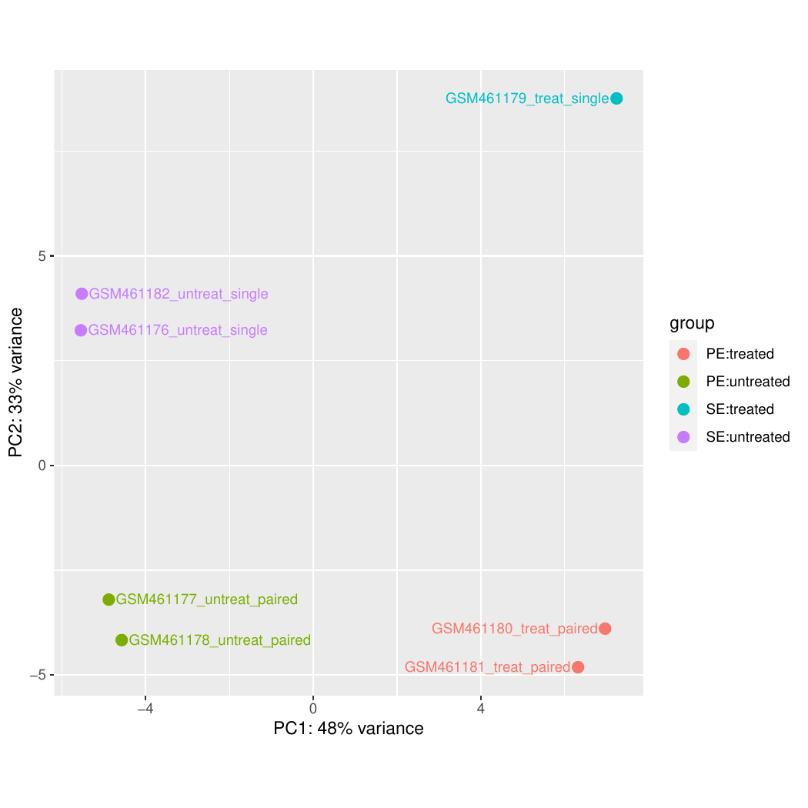
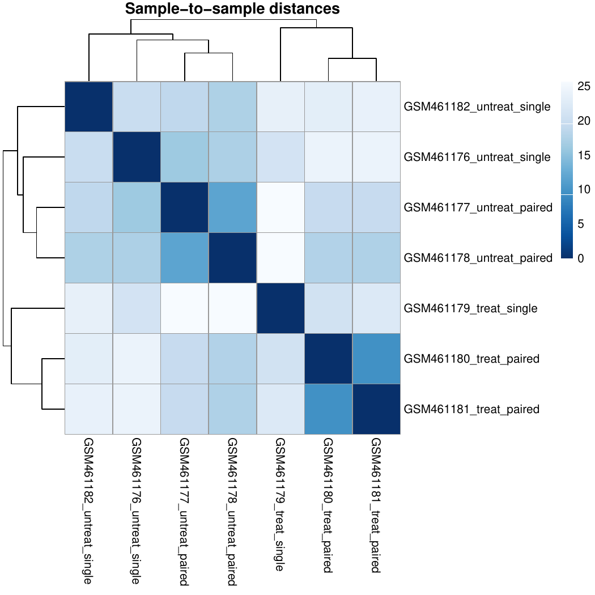
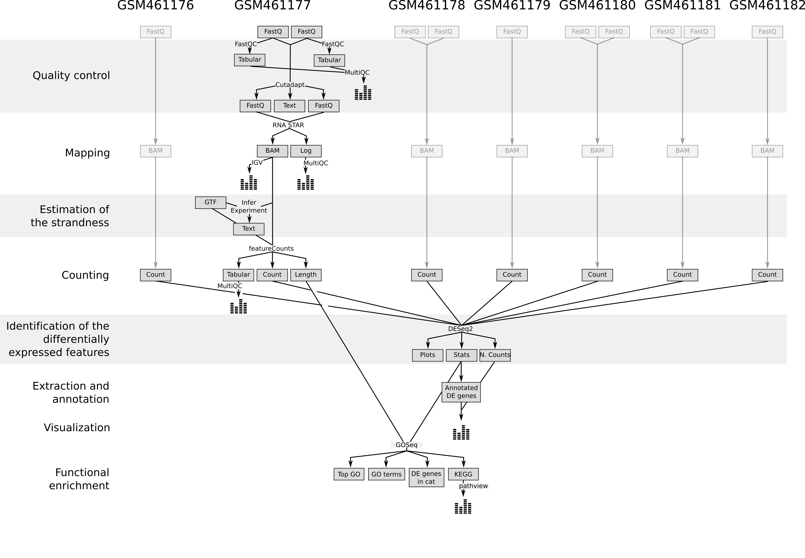

# Introduction
{:.no_toc}

RNA-Seq is used to analyze the continuously changing cellular transcriptome, the set of all RNA molecules in one cell or a population of cells. Specifically, RNA-Seq facilitates the ability to look at alternative gene spliced transcripts, post-transcriptional modifications, gene fusion, mutations/SNPs and changes in gene expression over time, or differences in gene expression in different groups or treatments

In the study of [Brooks *et al.* 2011](https://www.ncbi.nlm.nih.gov/pmc/articles/PMC3032923/), the authors wanted to identify exons regulated by the *Pasilla* gene (the *Drosophila* homologue of the mammalian splicing regulators Nova-1 and Nova-2 proteins) using RNA sequencing data. They depleted the *Pasilla* (*PS*) gene in *Drosophila melanogaster* by RNA interference (RNAi).

Total RNA was then isolated and used to prepare both single-end and paired-end RNA-seq libraries for treated (PS depleted) and untreated samples. These libraries were sequenced to obtain RNA-seq reads for each sample. The RNA-seq data for the treated and the untreated samples can be then compared to identify the effects of *Pasilla* gene depletion on splicing events.

In this tutorial, we will reproduce the analysis of the RNA-Seq data step by step.

The original data is available at NCBI Gene Expression Omnibus (GEO) under accession number [GSE18508](https://www.ncbi.nlm.nih.gov/geo/query/acc.cgi?acc=GSE18508).

In this tutorial we will use the first 7 samples:

- 4 untreated samples: [GSM461176](https://www.ncbi.nlm.nih.gov/geo/query/acc.cgi?acc=GSM461176), [GSM461177](https://www.ncbi.nlm.nih.gov/geo/query/acc.cgi?acc=GSM461177), [GSM461178](https://www.ncbi.nlm.nih.gov/geo/query/acc.cgi?acc=GSM461178), [GSM461182](https://www.ncbi.nlm.nih.gov/geo/query/acc.cgi?acc=GSM461182)
- 3 treated samples (*Pasilla* gene depleted by RNAi): [GSM461179](https://www.ncbi.nlm.nih.gov/geo/query/acc.cgi?acc=GSM461179), [GSM461180](https://www.ncbi.nlm.nih.gov/geo/query/acc.cgi?acc=GSM461180), [GSM461181](https://www.ncbi.nlm.nih.gov/geo/query/acc.cgi?acc=GSM461181)

Each sample constitutes a separate biological replicate of the corresponding condition (treated or untreated). Moreover, two of the treated and two of the untreated samples are from a paired-end sequencing assay, while the remaining samples are from a single-end sequencing experiment.

The raw RNA-seq reads have been extracted from the Sequence Read Archive (SRA) files and converted into FASTQ files. In the first part of this tutorial we will use the files for 2 of the 7 samples, to demonstrate analysis of FASTQs. Optionally later you can import the FASTQs for the other 5 samples.

> ### Agenda
>
> In this tutorial, we will deal with:
>
> 1. TOC
> {:toc}
>
{: .agenda}

# Pretreatments

## Data upload

> ###  Hands-on: Data upload
>
> 1. Create a new history for this RNA-seq exercise
> 2. Import the FASTQ file pairs from [Zenodo](https://doi.org/10.5281/zenodo.1185122) or a data library:
>   - `GSM461177` (untreated): `GSM461177_1` and `GSM461177_2`
>   - `GSM461180` (treated): `GSM461180_1` and `GSM461180_2`
>
>    ```
>    https://zenodo.org/record/1185122/files/GSM461177_1.fastqsanger
>    https://zenodo.org/record/1185122/files/GSM461177_2.fastqsanger
>    https://zenodo.org/record/1185122/files/GSM461180_1.fastqsanger
>    https://zenodo.org/record/1185122/files/GSM461180_2.fastqsanger
>    ```
>
>    
>    
>
>    > ###  Comment
>    > Note that these are the full files for the samples and ~1.5Gb each so it may take some minutes to import.
>    >
>    >For a quicker run-through of the FASTQ steps a small subset of each FASTQ file (~5Mb) can be found here https://zenodo.org/record/290221
>    {: .comment}
>
> 3. Rename each dataset according to the sample id (e.g. `GSM461177_1`)
>
>    
>
> 4. Check that the datatype is `fastqsanger` (e.g. **not** `fastq`). If it is not, please change the datatype to `fastqsanger`.
>
>    
>
> 5. Add to each database a tag corresponding to the name of the sample (`#GSM461177` or `#GSM461180`)
>
>    
>
{: .hands_on}



The reads are raw data from the sequencing machine without any pretreatments. They need to be assessed for their quality.

## Quality control

During sequencing, errors are introduced, such as incorrect nucleotides being called. These are due to the technical limitations of each sequencing platform. Sequencing errors might bias the analysis and can lead to a misinterpretation of the data.

Sequence quality control is therefore an essential first step in your analysis. We will use similar tools as described in the ["Quality control" training]({{site.baseurl}}/topics/sequence-analysis): [FastQC](https://www.bioinformatics.babraham.ac.uk/projects/fastqc/) and [Cutadapt](https://cutadapt.readthedocs.io/en/stable/guide.html).

> ###  Hands-on: Quality control
>
> 1. **FastQC**  with the following parameters:
>       -  *"Short read data from your current history"*: input datasets selected with **Multiple datasets**
>
>    
>
> 2. Inspect the webpage output of **FastQC**  for the `GSM461177` sample
>
>    > ###  Questions
>    >
>    > What is the read length?
>    >
>    > > ###  Solution
>    > >
>    > > The read length is 37 bp.
>    > >
>    > {: .solution}
>    >
>    {: .question}
>
> 3. **MultiQC**  with the following parameters to aggregate the FastQC reports:
>      - In *"Results"*
>        - *"Which tool was used generate logs?"*: `FastQC`
>        - In *"FastQC output"*
>           - *"Type of FastQC output?"*: `Raw data`
>           -  *"FastQC output"*: `Raw data` files (output of **FastQC** )
>
> 4. Inspect the webpage output from MultiQC for each FASTQ
>
>    > ###  Questions
>    >
>    > 1. What do you think of the quality of the sequences?
>    > 2. What should we do?
>    >
>    > > ###  Solution
>    > >
>    > > 1. Everything seems OK for 3 of the files, but for `GSM461180_2` the quality decreases quite a lot at the end of the sequences:
>    > >     - The `GSM461177` have 10.3 millions of sequences and `GSM461180` 12.3 millions
>    > >     - All except `GSM461180_2` have a high proportion of duplicated reads (expected in RNA-Seq data)
>    > >
>    > >        
>    > >
>    > >     - The "Per base sequence quality" is globally good with a slight decrease at the end of the sequences. For `GSM461180_2`, the decrease is quite large.
>    > >
>    > >        
>    > >
>    > >     - The mean quality score over the reads is quite high, but the distribution is slightly different for `GSM461180_2`
>    > >
>    > >        
>    > >
>    > >     - Reads are not really following a normal distribution of GC content, except `GSM461180_2`
>    > >
>    > >        
>    > >
>    > >     - Few N in the reads
>    > >
>    > >        
>    > >
>    > >     - Duplicated sequences: >10 to >500
>    > >
>    > >        
>    > >     - Almost no known adapters and overrepresented sequences
>    > >
>    > > 2. If the quality of the reads is not good, we should:
>    > >    1. Check what is wrong and think about it: it may come from the type of sequencing or what we sequenced (high quantity of overrepresented sequences in transcriptomics data, biaised percentage of bases in HiC data)
>    > >    2. Ask the sequencing facility about it
>    > >    3. Perform some quality treatment (in a reasonable way to not lose too much information) with some trimming or removal of bad reads
>    > >
>    > {: .solution}
>    {: .question}
>
{: .hands_on}

We should trim sequenced read to get rid of bases that were sequenced with high uncertainty (= low quality bases) at the read ends but also remove the reads of overall bad quality.



> ###  Hands-on: Quality control
>
> 1. **Cutadapt**  with the following parameters to trim low quality sequences:
>    - *"Single-end or Paired-end reads?"*: `Paired-end`
>       -  *"FASTQ/A file #1"*: both `_1` fastqsanger datasets (multiple datasets)
>       -  *"FASTQ/A file #2"*: both `_2` fastqsanger datasets (multiple datasets)
>
>      The order is important here!
>
>    - In *"Filter Options"*
>       - *"Minimum length"*: `20`
>    - In *"Read Modification Options"*
>       - *"Quality cutoff"*: `20`
>    - In *"Output Options"*
>       - *"Report"*: `Yes`
>
>      
>
> 2. Inspect the generated txt files (`Report`)
>
>    > ###  Questions
>    >
>    > 1. How many basepairs has been removed from the forwards reads because of bad quality? And from the reverse reads?
>    > 2. How many sequence pairs have been removed because at least one read was shorter than the length cutoff?
>    >
>    > > ###  Solution
>    > > 1. For `GSM461177`, 5,072,810 bp has been trimmed for the forward reads (read 1) and 8,648,619 bp on the reverse (read 2) because of quality. For `GSM461180`, 10,224,537 bp on forward and 51,746,850 bp on the reverse. It is not a surprise: we saw that at the end of the sequences the quality was dropping more for the reverse reads than for the forward reads, specially for `GSM461180_2`.
>    > > 2. 147,810 (1.4%) reads were too short for `GSM461177` and 1,101,875 (9%) for `GSM461180`.
>    > {: .solution }
>    {: .question}
{: .hands_on}

# Mapping

To make sense of the reads, we need to first figure out where the sequenced DNA fragments originated from in the genome, so we can then determine to which genes they belong.

This process is known as aligning or 'mapping' the reads to a reference. This is equivalent to solving a jigsaw puzzle, but unfortunately, not all pieces are unique.

> ###  Comment
>
> Do you want to learn more about the principles behind mapping? Follow our [training]({{site.baseurl}}/topics/sequence-analysis/).
{: .comment}

As a reference genome for *Drosophila melanogaster* is available, we can map the sequences to this genome in order to identify which genes are affected by  the *Pasilla* gene depletion.



With eukaryotic transcriptomes most reads originate from processed mRNAs lacking introns, therefore they cannot be simply mapped back to the genome as we normally do for DNA data. Instead the reads must be separated into two categories:

- Reads that can be mapped entirely within an exon
- Reads spanning two or more exons

")

Spliced mappers have been developed to efficiently map transcript-derived reads against genomes:

 identification of the reads spanning a single exon, (2) identification of the splicing junctions on the unmapped reads")

> ###  More details on the different spliced mappers
>
> Several spliced mappers have been developed over the year with the explosion of RNA-seq data.
>
> [TopHat](https://ccb.jhu.edu/software/tophat/index.shtml) ([Trapnell et al, Bioinformatics, 2009](https://academic.oup.com/bioinformatics/article/25/9/1105/203994)) was one of the first tools designed specifically to address this problem. In TopHat reads are mapped against the genome and are separated into two categories: (1) those that map, and (2) those that initially unmapped (IUM). "Piles" of reads representing potential exons are extended in search of potential donor/acceptor splice sites and potential splice junctions are reconstructed. IUMs are then mapped to these junctions.
>
>    ")
>
> TopHat has been subsequently improved with the development of TopHat2 ([Kim et al, Genome Biology, 2013](https://genomebiology.biomedcentral.com/articles/10.1186/gb-2013-14-4-r36)):
>
>    ")
>
> To further optimize and speed up spliced read alignment Kim et al ([Nat Methods, 2015](https://www.nature.com/articles/nmeth.3317)) developed [HISAT](https://ccb.jhu.edu/software/hisat2/index.shtml). It uses a set of [FM-indices](https://en.wikipedia.org/wiki/FM-index) consisting one global genome-wide index and a collection of ~48,000 local overlapping 42 kb indices (~55,000 56 kb indices in HISAT2). This allows to find initial seed locations for potential read alignments in the genome using global index and to rapidly refine these alignments using a corresponding local index:
>
>    ")
>
> A part of the read (blue arrow) is first mapped to the genome using the global FM index. HISAT then tries to extend the alignment directly utilizing the genome sequence (violet arrow). In (**a**) it succeeds and this read is aligned as it completely resides within an exon. In (**b**) the extension hits a mismatch. Now HISAT takes advantage of the local FM index overlapping this location to find the appropriate mapping for the remainder of this read (green arrow). The (**c**) shows a combination these two strategies: the beginning of the read is mapped using global FM index (blue arrow), extended until it reaches the end of the exon (violet arrow), mapped using local FM index (green arrow) and extended again (violet arrow).
>
> [STAR aligner](https://github.com/alexdobin/STAR) is a fast alternative for mapping RNA-seq reads against a reference genome utilizing an uncompressed [suffix array](https://en.wikipedia.org/wiki/Suffix_array). It operates in two stages [Dobin et al, Bioinformatics, 2013](https://academic.oup.com/bioinformatics/article/29/1/15/272537). In the first stage it performs seed search:
>
>    ")
>
> Here a read is split between two consecutive exons. STAR starts to look for a maximum mappable prefix (MMP) from the beginning of the read until it can no longer match continuously. After this point it start to look for a MMP for the unmatched portion of the read (**a**). In the case of mismatches (**b**) and unalignable regions (**c**) MMPs serve as anchors from which to extend alignments</p>
>
> At the second stage STAR stitches MMPs to generate read-level alignments that (contrary to MMPs) can contain mismatches and indels. A scoring scheme is used to evaluate and prioritize stitching combinations and to evaluate reads that map to multiple locations. STAR is extremely fast but requires a substantial amount of RAM to run efficiently.
>
{: .details}

## Mapping

We will map our RNA reads to the *Drosophila melanogaster* genome using STAR.

> ###  Hands-on: Spliced mapping
>
> 1. Import the Ensembl gene annotation for *Drosophila melanogaster* (`Drosophila_melanogaster.BDGP6.87.gtf`) from the Shared Data library if available or from [Zenodo](https://zenodo.org/record/1185122/files/Drosophila_melanogaster.BDGP6.87.gtf) into your current Galaxy history
>
>    ```
>    https://zenodo.org/record/1185122/files/Drosophila_melanogaster.BDGP6.87.gtf
>    ```
>
>    1. Rename the dataset if necessary
>    2. Verify that the datatype is `gtf` and not `gff`, and that the database is `dm6`
>
> 2. **RNA STAR**  with the following parameters to map your reads on the reference genome:
>    - *"Single-end or paired-end reads"*: `Paired-end (as individual datasets)`
>       -  *"RNA-Seq FASTQ/FASTA file, forward reads"*: the `Read 1 Output` (outputs of **Cutadapt** )
>       -  *"RNA-Seq FASTQ/FASTA file, reverse reads"*: the `Read 2 Output` (outputs of **Cutadapt** )
>    - *"Custom or built-in reference genome"*: `Use a built-in index`
>       - *"Reference genome with or without an annotation"*: `use genome reference without builtin gene-model`
>           - *"Select reference genome"*: `Drosophila Melanogaster (dm6)`
>           -  *"Gene model (gff3,gtf) file for splice junctions"*: the imported `Drosophila_melanogaster.BDGP6.87.gtf`
>           - *"Length of the genomic sequence around annotated junctions"*: `36`
>
>               This parameter should be length of reads - 1
>
> 3. **MultiQC**  to aggregate the STAR logs:
>      - In *"Results"*
>        - *"Which tool was used generate logs?"*: `STAR`
>        - In *"STAR output"*
>           - *"Type of STAR output?"*: `Log`
>           -  *"STAR output"*: `log` files (output of **RNA STAR** )
>
>    > ###  Question
>    >
>    > 1. What percentage of reads mapped exactly once for both samples?
>    > 2. What are the other available statistics?
>    >
>    > > ###  Solution
>    > >
>    > > 1. More than 83% for GSM461177 and more than 79% for GSM461180
>    > > 2. We also have access to the number and percentage of reads that are mapped at several location, mapped at too many different location, not mapped because too short.
>    > >
>    > >    
>    > >
>    > >    We could have been probably more strict in the minimal read length to avoid these unmapped reads because of length.
>    > {: .solution}
>    >
>    {: .question}
{: .hands_on}

**STAR** generates a BAM file with the mapped reads.



> ###  Question
>
> 1. What is a BAM file?
> 2. What does such a file contain?
>
> > ###  Solution
> >
> > 1. A Binary Alignment Map (BAM) file is the compressed version of a Sequence Alignment Map (SAM) file. A SAM file is a tab-delimited text file that contains sequence alignment data.
> > 2. It contains information about the mapping: for each mapped read, the position on the reference genome, the mapping quality, ...
> >
> {: .solution}
{: .question}

## Inspection of the mapping results

The BAM file contains information about where the reads are mapped on the reference genome. But as it is a binary file containing information for many reads (several million for these samples), it is difficult to inspect and explore the file.

A powerful tool to visualize the content of BAM files is the Integrative Genomics Viewer (IGV).

> ###  Hands-on: Inspection of mapping results
>
> 1. Install [IGV](https://software.broadinstitute.org/software/igv/download) (if not already installed)
> 2. Start IGV locally
> 3. Expand the  `mapped.bam` file (output of **RNA STAR** ) for `GSM461177`
> 4. Click on the `local` in `display with IGV` to load the reads into the IGV browser
>
>    > ###  Comments
>    >
>    > In order for this step to work, you will need to have either IGV or [Java web start](https://www.java.com/en/download/faq/java_webstart.xml)
>    > installed on your machine. However, the questions in this section can also be answered by inspecting the IGV screenshots below.
>    >
>    > Check the [IGV documentation](https://software.broadinstitute.org/software/igv/AlignmentData) for more information.
>    >
>    {: .comment}
>
> 2. **IGV** : Zoom to `chr4:540,000-560,000` (Chromosome 4 between 540 kb to 560 kb)
>
>    > ###  Question
>    >
>    > 
>    >
>    > 1. What information appears at the top as grey peaks?
>    > 2. What do the connecting lines between some of the aligned reads indicate?
>    >
>    > > ###  Solution
>    > >
>    > > 1. The coverage plot: the sum of mapped reads at each position
>    > > 2. They indicate junction events (or splice sites), *i.e.* reads that are mapped across an intron
>    > >
>    > {: .solution}
>    {: .question}
>
> 3. **IGV** : Inspect the splice junctions using a **Sashimi plot**
>
>    > ###  Tip: Creation of a Sashimi plot
>    >
>    > * Right click on the BAM file (in IGV)
>    > * Select **Sashimi Plot** from the menu
>    {: .tip}
>
>    > ###  Question
>    >
>    > 
>    >
>    > 1. What does the vertical red bar graph represent? And the arcs with numbers?
>    > 2. What do the numbers on the arcs mean?
>    > 3. Why do we observe different stacked groups of blue linked boxes at the bottom?
>    >
>    > > ###  Solution
>    > >
>    > > 1. The coverage for each alignment track is plotted as a red bar graph. Arcs represent observed splice junctions, *i.e.*, reads spanning introns
>    > > 2. The numbers refer to the number of observed junction reads.
>    > > 3. The different groups of linked boxes on the bottom represent the different transcripts from the genes at this location, that are present in the GTF file.
>    > >
>    > {: .solution}
>    {: .question}
>
>    > ###  Comment
>    >
>    > Check the [IGV documentation on Sashimi plots](https://software.broadinstitute.org/software/igv/Sashimi) to find some clues
>    {: .comment}
>
{: .hands_on}

After the mapping, we have the information on where the reads are located on the reference genome. We also know how well they were mapped. The next step in RNA-Seq data analysis is quantification of the number of reads mapped to genomic features (genes, transcripts, exons, ...).

> ###  Comment
>
> The quantification depends on both the reference genome (the FASTA file) and its associated annotations (the GTF file). It is extremely important to use an annotation file that corresponds to the same version of the reference genome you used for the mapping (e.g. `dm6` here), as the chromosomal coordinates of genes are usually different amongst different reference genome versions.
{: .comment}

In order to identify exons that are regulated by the *Pasilla* gene, we need to identify genes and exons which are differentially expressed between samples with PS gene depletion (treated) and control (untreated) samples.
We will then analyze the differential gene expression and also the differential exon usage.

# Analysis of the differential gene expression

We will first investigate the differential gene expression to identify which genes are impacted by the *Pasilla* gene depletion.

## Count the number of reads per annotated gene

To compare the expression of single genes between different conditions (*e.g.* with or without PS depletion), an essential first step is to quantify the number of reads per gene.


> ###  Question
>
> In the previous image,
>
> 1. How many reads are found for the different exons?
> 2. How many reads are found for the different genes?
>
> > ###  Solution
> >
> > 1. Number of reads per exons
> >
> >     Exon | Number of reads
> >     --- | ---
> >     gene1 - exon1 | 3
> >     gene1 - exon2 | 2
> >     gene2 - exon1 | 3
> >     gene2 - exon2 | 4
> >     gene2 - exon3 | 3
> >
> > 2. The gene1 has 4 reads, not 5 (gene1 - exon1 + gene1 - exon2) because of the splicing of the last read. Gene2: 6 (3 spliced reads)
> {: .solution}
{: .question}

Two main tools could be used for that: [HTSeq-count](http://htseq.readthedocs.io/en/release_0.9.1/count.html) ([Anders et al, Bioinformatics, 2015](https://academic.oup.com/bioinformatics/article/31/2/166/2366196)) or featureCounts ([Liao et al, Bioinformatics, 2014](https://academic.oup.com/bioinformatics/article/31/2/166/2366196)). FeatureCounts is considerably faster and requires far less computational resources, so we will use it here.

In principle, the counting of reads overlapping with genomic features is a fairly simple task. But there are some details that need to be given to featureCounts: for example the strandness.

### Estimation of the strandness

RNAs that are typically targeted in RNA-seq experiments are single stranded (*e.g.*, mRNAs) and thus have polarity (5' and 3' ends that are functionally distinct):


During a typical RNA-seq experiment the information about strandedness is lost after both strands of cDNA are synthesized, size selected, and converted into a sequencing library. However, this information can be quite useful for the read counting.

Some library preparation protocols create so called *stranded* RNA-seq libraries that preserve the strand information (an excellent overview in [Levin et al, Nat Meth, 2010](https://www.ncbi.nlm.nih.gov/pmc/articles/PMC3005310/)). The implication of stranded RNA-seq is that you can distinguish whether the reads are derived from forward or reverse-encoded transcripts:

")

Depending on the approach, and whether one performs single-end or paired-end sequencing, there are multiple possibilities on how to interpret the results of the mapping of these reads to the genome:

")

In practice, with Illumina paired-end RNA-seq protocols you are unlikely to encounter many of these possibilities. You will most likely deal with either:

- Unstranded RNAseq data
- Stranded RNA-seq data produced with - kits and [dUTP tagging](https://nar.oxfordjournals.org/content/37/18/e123) (**ISR**)

This information should be provided with your FASTQ files, ask your sequencing facility! If not, try to find it on the site where you downloaded the data or in the corresponding publication.

Another option is to estimate these parameters with a tool called **Infer Experiment** from the [RSeQC](https://www.ncbi.nlm.nih.gov/pubmed/22743226) tool suite. This tool takes the output of your mappings (BAM files), selects a subsample of your reads and compares their genome coordinates and strands with those of the reference gene model (from an annotation file). Based on the strand of the genes, it can gauge whether sequencing is strand-specific, and if so, how reads are stranded.

> ###  Hands-on: Determining the library strandness
>
> 1. **Convert GTF to BED12**  to convert the GTF file to BED:
>    -  *"GTF File to convert"*: `Drosophila_melanogaster.BDGP6.87.gtf`
>
> 2. **Infer Experiment**  to determine the library strandness with:
>    -  *"Input .bam file"*: `mapped.bam` files (outputs of **RNA STAR** )
>    -  *"Reference gene model"*: BED12 file (output **Convert GTF to BED12** )
>    - *"Number of reads sampled from SAM/BAM file (default = 200000)"*: `200000`
{: .hands_on}

**Infer Experiment**  tool generates one file with information on:
- Paired-end or single-end library
- Fraction of reads failed to determine
- 2 lines
    - For single-end
        - Fraction of reads explained by "++,--" (**SF** in previous figure)
        - Fraction of reads explained by "+-,-+" (**SR** in previous figure)
    - For paired-end
        - Fraction of reads explained by "1++,1--,2+-,2-+" (**SF** in previous figure)
        - Fraction of reads explained by "1+-,1-+,2++,2--" (**SR** in previous figure)

If the two "Fraction of reads explained by" numbers are close to each other, we conclude that the library is not a strand-specific dataset (**U** in previous figure).

> ###  Question
>
> 1. What are the "Fraction of the reads explained by" results for `GSM461177`?
> 2. Do you think the library type of the 2 samples is stranded or unstranded?
>
> > ###  Solution
> >
> > 1. Results for `GSM46177`:
> >
> >    ```
> >    This is PairEnd Data
> >    Fraction of reads failed to determine: 0.0963
> >    Fraction of reads explained by "1++,1--,2+-,2-+": 0.4649
> >    Fraction of reads explained by "1+-,1-+,2++,2--": 0.4388
> >    ```
> >
> >    so 46.46% of the reads are SF and 43.88% SR.
> >
> > 2. Similar statistics are found for `GSM461180`, so the library seems to be of the type unstranded for both samples.
> {: .solution}
{: .question}

> ###  Comment
> As it is sometimes quite difficult to find out which settings correspond to those of other programs, the following table might be helpful to identify the library type:
>
> Library type | **Infer Experiment** | **TopHat** | **HISAT2** | **htseq-count** | **featureCounts**
> --- | --- | --- | --- | --- | ---
> Paired-End (PE) - SF | 1++,1--,2+-,2-+ | FR Second Strand | Second Strand F/FR | yes | Forward (1)
> PE - SR | 1+-,1-+,2++,2-- | FR First Strand | First Strand R/RF | reverse | Reverse (2)
> Single-End (SE) - SF | ++,-- | FR Second Strand | Second Strand F/FR | yes | Forward (1)
> SE - SR | +-,-+ | FR First Strand | First Strand R/RF | reverse | Reverse (2)
> PE, SE - U | undecided | FR Unstranded | default | no | Unstranded (0)
>
{: .comment}

### Counting

We now run **featureCounts** to count the number of reads per annotated gene.

> ###  Hands-on: Counting the number of reads per annotated gene
>
> 1. **featureCounts**  to count the number of reads per gene:
>    -  *"Alignment file"*: `mapped.bam` files (outputs of **RNA STAR** )
>    - *"Specify strand information"*: `Unstranded`
>    - *"Gene annotation file"*: `in your history`
>       -  *"Gene annotation file"*: `Drosophila_melanogaster.BDGP6.87.gtf`
>    - *"Output format"*: `Gene-ID "\t" read-count (MultiQC/DESeq2/edgeR/limma-voom compatible)`
>    - *"Create gene-length file"*: `Yes`
>    - In *"Options for paired-end reads"*:
>       - *"Count fragments instead of reads"*: `Enabled; fragments (or templates) will be counted instead of reads`
>    - In *"Advanced options"*:
>       - *"GFF feature type filter"*: `exon`
>       - *"GFF gene identifier"*: `gene_id`
>       - *"Allow read to contribute to multiple features"*: `No`
>       - *"Count multi-mapping reads/fragments"*: `Disabled; multi-mapping reads are excluded (default)`
>       - *"Minimum mapping quality per read"*: `10`
>
> 2. **MultiQC**  to aggregate the report:
>     - In *"Results"*:
>       - *"Which tool was used generate logs?"*: `featureCounts`
>           -  *"Output of FeatureCounts"*: `summary` files (outputs of **featureCounts** )
>
>    > ###  Question
>    >
>    > 1. How many reads have been assigned to a gene?
>    > 2. When should we be worried about the assignment rate? What should we do?
>    >
>    > > ###  Solution
>    > >
>    > > 1. Around 70% of the reads have been assigned to genes: this quantity is good enough.
>    > >
>    > >    
>    > >
>    > >    Some reads are not assigned because multi-mapped and other assigned to no features or ambiguous ones.
>    > >
>    > > 2. If the percentage is below 50%, you should investigate where your reads are mapping (inside genes or not, with IGV) and check that the annotation corresponds to the correct reference genome version.
>    > >
>    > {: .solution}
>    {: .question}
>
{: .hands_on}

The **feature length** output datasets generated by featureCounts will be needed later on when we will run the **goseq** tool.

The main output of **featureCounts** is a table.

> ###  Question
>
> 1. What information does the generated table contain?
> 2. Which feature has the most counts for both samples? (Hint: Use the Sort tool)
>
> > ###  Solution
> >
> > 1. The table has two columns: the gene id and the number of reads (or fragments in the case of paired-end reads) mapped to the gene
> > 2. To display the most abundantly detected feature, we need to sort the table of counts. This can be done using the **Sort**  tool, by sorting the table on the second column in descending order. This reveals that FBgn0000556 is the feature with the most counts (around 128,741 in `GSM461177` and 127,416 in `GSM461180`).
> >
> {: .solution}
{: .question}

## Viewing datasets side by side using the Scratchbook

Comparing output is easier if we can view more than one dataset simultaneously. The Scratchbook allows us to build
up a collection of datasets that will be shown on the screen together.

> ###  (Optional) View the sorted featureCounts using the Scratchbook
>
> 1. The **Scratchbook** is enabled by clicking the nine-blocks icon seen on the right of the Galaxy top menubar:
>
>    
>
> 2. When the Scratchbook is **enabled** datasets being viewed are added to the Scratchbook:
>
>    
>
> 3. Click the  (eye) icon to view one of the **sorted featureCounts**. Instead of occupying the entire middle bar the dataset view is now shown an overlay:
>
>    
>
> 4. When a dataset is shown **click in the main interface** to prepare to select another dataset. The interface now shows that there is one saved view in the Scratchbook:
>
>    
>
> 5. Next click the  (eye) icon on the **second sorted featureCounts**. The two datasets can now be seen side by side:
>
>    
>
> 6. To **leave** Scratchbook selection mode, click on the **Scratchbook icon** again. Your saved view will still remain for future viewing:
>
>    
>
{: .hands_on}

## Identification of the differentially expressed features

In the previous section, we counted reads mapped to genes for two samples. To be able to identify differential gene expression induced by PS depletion, all datasets (3 treated and 4 untreated) must be analyzed following the same procedure.

> ###  (Optional) Hands-on: Re-run on the other datasets
>
> You can do the same process on the other sequence files available on [Zenodo](https://doi.org/10.5281/zenodo.1185122)
>
> - Paired-end data
>     - `GSM461178_1` and `GSM461178_2`
>     - `GSM461181_1` and `GSM461181_2`
> - Single-end data
>     - `GSM461176`
>     - `GSM461179`
>     - `GSM461182`
>
> The links to these files are below:
>
> ```
> https://zenodo.org/record/1185122/files/GSM461178_1.fastqsanger
> https://zenodo.org/record/1185122/files/GSM461178_2.fastqsanger
> https://zenodo.org/record/1185122/files/GSM461181_1.fastqsanger
> https://zenodo.org/record/1185122/files/GSM461181_2.fastqsanger
> https://zenodo.org/record/1185122/files/GSM461176.fastqsanger
> https://zenodo.org/record/1185122/files/GSM461179.fastqsanger
> https://zenodo.org/record/1185122/files/GSM461182.fastqsanger
> ```
>
> This is really interesting to redo on the other datasets, especially to check how parameters differ given the different type of data (single-end versus paired-end).
{: .hands_on}

To save time, we have run the necessary steps for you and generated 7 count files, available on [Zenodo](https://doi.org/10.5281/zenodo.1185122).

These files contain the counts for each gene of *Drosophila*. We could compare the files directly and calculate the extent of differential gene expression, but the number of sequenced reads mapped to a gene depends on:

- The gene's expression level
- The gene's length
- The sequencing depth of the sample
- The expression of all other genes within the sample

For both within or between-sample comparison, the gene counts need to be normalized. We can then perform the Differential Gene Expression (DGE) analysis, whose two basic tasks are:

- Estimate the biological variance using the replicates for each condition
- Estimate the significance of expression differences between any two conditions

This expression analysis is estimated from read counts and attempts are made to correct for variability in measurements using replicates, that are absolutely essential for accurate results. For your own analysis, we advise you to use at least 3, but preferably 5 biological replicates per condition. It is possible to have different number of replicates per condition.

[**DESeq2**](https://bioconductor.org/packages/release/bioc/html/DESeq2.html) is a great tool for DGE analysis. It takes read counts and combines them into a big table (with genes in the rows and samples in the columns) and applies size factor normalization:

- Computation for each gene of the geometric mean of read counts across all samples
- Division of every gene count by the geometric mean
- Use of the median of these ratios as a sample's size factor for normalization

Multiple factors with several levels can then be incorporated in the analysis. After normalization we can compare the response of the expression of any gene to the presence of different levels of a factor in a statistically reliable way.

In our example, we have samples with two varying factors that can contribute to differences in gene expression:

- Treatment (either treated or untreated)
- Sequencing type (paired-end or single-end)

Here, treatment is the primary factor that we are interested in. The sequencing type is further information we know about the data that might affect the analysis. Multi-factor analysis allows us to assess the effect of the treatment, while taking the sequencing type into account too.

> ###  Comment
>
> We recommend that you add as many factors as you think may affect gene expression in your experiment. It can be the sequencing type like here, but it can also be the manipulation (if different persons are involved in the library preparation), other batch effects, etc...
{: .comment}

> ###  Hands-on: Determine differentially expressed features
>
> 1. Create a new history
> 2. Import the seven count files from [Zenodo](https://zenodo.org/record/1185122) or the Shared Data library (if available):
>
>    - `GSM461176_untreat_single.counts`
>    - `GSM461177_untreat_paired.counts`
>    - `GSM461178_untreat_paired.counts`
>    - `GSM461179_treat_single.counts`
>    - `GSM461180_treat_paired.counts`
>    - `GSM461181_treat_paired.counts`
>    - `GSM461182_untreat_single.counts`
>
>    ```
>    https://zenodo.org/record/1185122/files/GSM461176_untreat_single.counts
>    https://zenodo.org/record/1185122/files/GSM461177_untreat_paired.counts
>    https://zenodo.org/record/1185122/files/GSM461178_untreat_paired.counts
>    https://zenodo.org/record/1185122/files/GSM461179_treat_single.counts
>    https://zenodo.org/record/1185122/files/GSM461180_treat_paired.counts
>    https://zenodo.org/record/1185122/files/GSM461181_treat_paired.counts
>    https://zenodo.org/record/1185122/files/GSM461182_untreat_single.counts
>    ```
>
> 3. Rename the datasets (if needed)
> 4. **DESeq2**  with the following parameters:
>    - In *"Factor"*:
>       - In "1: Factor"
>           - *"Specify a factor name"*: `Treatment`
>           - In *"Factor level"*:
>               - In *"1: Factor level"*:
>                   - *"Specify a factor level"*: `treated`
>                   -  *"Counts file(s)"*: the 3 gene count files with `treat` in their name
>               - In *"2: Factor level"*:
>                   - *"Specify a factor level"*: `untreated`
>                   -  *"Counts file(s)"*: the 4 gene count files with `untreat` in their name
>       - Click on *"Insert Factor"* (not on "Insert Factor level")
>       - In "2: Factor"
>           - "Specify a factor name" to `Sequencing`
>           - In *"Factor level"*:
>               - In *"1: Factor level"*:
>                   - *"Specify a factor level"*: `PE`
>                   -  *"Counts file(s)"*: the 4 gene count files with `paired` in their name
>               - In *"2: Factor level"*:
>                   - *"Specify a factor level"*: `SE`
>                   -  *"Counts file(s)"*: the 3 gene count files with `single` in their name
>    - *"Files have header?"*: `No`
>    - *"Output normalized counts table"*: `Yes`
{: .hands_on}

**DESeq2** generated 3 outputs

- A table with the normalized counts for each gene (rows) in the samples (columns)
- A graphical summary of the results, useful to evaluate the quality of the experiment:

    1. Histogram of *p*-values for all tests
    2. [MA plot](https://en.wikipedia.org/wiki/MA_plot): global view of the relationship between the expression change of conditions (log ratios, M), the average expression strength of the genes (average mean, A), and the ability of the algorithm to detect differential gene expression. The genes that passed the significance threshold (adjusted p-value < 0.1) are colored in red.
    3. Principal component plot of the samples ([PCA](https://en.wikipedia.org/wiki/Principal_component_analysis)) with the first two dimensions.

        It shows the samples in the 2D plane spanned by their first two principal components. Each replicate is plotted as an individual data point. This type of plot is useful for visualizing the overall effect of experimental covariates and batch effects.

        > ###  Questions
        >
        > 
        >
        > 1. What is the first dimension (PC1) separating?
        > 2. And the second dimension (PC2)?
        > 3. What can we conclude about the DESeq design (factors, levels) we choose?
        >
        > > ###  Solution
        > >
        > > 1. The first dimension is separating the treated samples from the untreated sample
        > > 2. The second dimension is separating the single-end datasets from the paired-end datasets
        > > 3. The datasets are grouped following the levels of the two factors. No hidden effect seems to be present on the data. If there is unwanted variation present in the data (e.g. batch effects) it is always recommend to correct for this, which can be accommodated in DESeq2 by including in the design any known batch variables
        > {: .solution}
        {: .question}

    4. Heatmap of the sample-to-sample distance matrix (with clustering): overview over similarities and dissimilarities between samples

        > ###  Questions
        >
        > 
        >
        > How are the samples grouped?
        >
        > > ###  Solution
        > > They are first grouped by the treatment (the first factor) and secondly by the library type (the second factor), as in the PCA plot.
        > >
        > {: .solution}
        {: .question}

    5. Dispersion estimates: gene-wise estimates (black), the fitted values (red), and the final maximum a posteriori estimates used in testing (blue)

        This dispersion plot is typical, with the final estimates shrunk from the gene-wise estimates towards the fitted estimates. Some gene-wise estimates are flagged as outliers and not shrunk towards the fitted value. The amount of shrinkage can be more or less than seen here, depending on the sample size, the number of coefficients, the row mean and the variability of the gene-wise estimates.

- A summary file with the following values for each gene

    1.  Gene identifiers
    2.  Mean normalized counts, averaged over all samples from both conditions
    3.  Fold change in log2 (logarithm base 2)

        The log2 fold changes are based on the primary factor level 1 vs. factor level 2, hence the input order of factor levels is important. For example, for the factor 'Treatment', DESeq2 computes fold changes of 'treated' samples against 'untreated', *i.e.* the values correspond to up- or downregulation of genes in treated samples.

    4.  Standard error estimate for the log2 fold change estimate
    5.  [Wald](https://en.wikipedia.org/wiki/Wald_test) statistic
    6.  *p*-value for the statistical significance of this change
    7.  *p*-value adjusted for multiple testing with the Benjamini-Hochberg procedure, which controls false discovery rate ([FDR](https://en.wikipedia.org/wiki/False_discovery_rate))

> ###  Comment
>
> For more information about **DESeq2** and its outputs, you can have a look at [**DESeq2** documentation](https://www.bioconductor.org/packages/release/bioc/manuals/DESeq2/man/DESeq2.pdf).
{: .comment}

## Visualization of the differentially expressed genes

Now we would like to extract the most differentially expressed genes due to the treatment, and then visualize them using an heatmap of the normalized counts and also the z-score for each sample.

We proceed in several steps:
- Extract the most differentially expressed genes using the DESeq2 summary file
- Extract the normalized counts for these genes for each sample, using the normalized count file generated by DESeq2
- Plot the heatmap of the normalized counts
- Compute the Z score of the normalized counts
- Plot the heatmap of the Z score of the genes

> ###  Hands-on: Extract the most differentially expressed genes
>
> 1. **Filter** (data on any column using simple expressions)  to extract genes with a significant change in gene expression (adjusted *p*-value below 0.05) between treated and untreated samples:
>    -  *"Filter"*: the `DESeq2 result file`
>    - *"With following condition"*: `c7<0.05`
>
>    > ###  Question
>    >
>    > How many genes have a significant change in gene expression between these conditions?
>    >
>    > > ###  Solution
>    > >
>    > > We get 1,091 genes (6.21%) with a significant change in gene expression between treated and untreated samples.
>    > >
>    > {: .solution}
>    {: .question}
>
>    > ###  Comment
>    >
>    > The file with the independent filtered results can be used for further downstream analysis as it excludes genes with only few read counts as these genes will not be considered as significantly differentially expressed.
>    {: .comment}
>
>    The generated file contains too many genes to get a meaningful heatmap. So we will take only the genes with an absolute fold change > 2
>
> 2. **Filter**  to extract genes with an $$abs(log_{2} FC) > 1$$ (FC stands for "fold change"):
>    -  *"Filter"*: the differentially expressed genes (output of **Filter** )
>    - *"With following condition"*: `abs(c3)>1`
>
>    > ###  Question
>    >
>    > How many genes have been conserved?
>    >
>    > > ###  Solution
>    > >
>    > > 130, the 11.92% of the significantly differentially expressed genes.
>    > >
>    > {: .solution}
>    {: .question}
>
{: .hands_on}

We now have a table with 130 lines corresponding to the most differentially expressed genes. And for each of the gene, we have its id, its mean normalized counts (averaged over all samples from both conditions), its $$log_{2} FC$$ and other information.

We could plot the $$log_{2} FC$$ for the different genes, but here we would like to look at a heatmap of expression for these genes in the different samples. So we need to extract the normalized counts for these genes.

We will join the normalized count table generated by DESeq with the table we just generated, to conserve only the lines corresponding to the most differentially expressed genes.

> ###  Hands-on: Extract the normalized counts of the most differentially expressed genes
>
> 1. **Create a Pasted Entry**  from the header line of the **Filter** output:
>    - Copy the header of the final **Filter** output
>    - Using the **Upload** tool select **Paste/Fetch data** and paste the copied data
>    - Set the *Type* to **tabular** and select **Start** to upload a new **Pasted Entry**
>
> 2. **Concatenate datasets**  to add this header line to the **Filter** output:
>    -  select the `Pasted entry` dataset
>    - `+ Insert Dataset`
>    -  select the final **Filter** output
>
>    This ensures that the table of most differentially expressed genes has a header line and can be used in the next step.
>
> 3. **Join two Datasets**  with the following parameters:
>    -  *"Join"*: the `Normalized counts` file (output of **DESeq2** )
>    - *"using column"*: `Column: 1`
>    -  *"with"*: most differentially expressed genes (output of the **Concatenate**  tool)
>    - *"and column"*: `Column: 1`
>    - *"Keep lines of first input that do not join with second input"*: `No`
>    - *"Keep the header lines"*: `Yes`
>
>    The generated file has more columns than we need for the heatmap. In addition to the columns with mean normalized counts, there is the $$log_{2} FC$$ and other information. We need to remove the extra columns.
>
> 4. **Cut**  to extract the columns with the gene ids and normalized counts:
>    - *"Cut columns"*: `c1-c8`
>    - *"Delimited by"*: `Tab`
>    -  *"From"*: the joined dataset (output of **Join two Datasets** )
>
{: .hands_on}

We now have a table with 130 lines (the most differentially expressed genes) and the normalized counts for these genes in the 7 samples.

> ###  Hands-on: Plot the heatmap of the normalized counts of these genes for the samples
>
> 1. **heatmap2**  to plot the heatmap:
>    -  *"Input should have column headers"*: the generated table (output of **Cut** )
>    - *"Advanced - log transformation"*: `Log2(value) transform my data`
>    - *"Enable data clustering"*: `Yes`
>    - *"Labeling columns and rows"*: `Label columns and not rows`
>    - *"Coloring groups"*: `Blue to white to red`
>
{: .hands_on}

You should obtain something similar to:


> ###  Questions
>
> 1. Do you observe anything in the clustering of the samples and the genes?
> 2. What changes if you regenerate the heatmap and select `Plot the data as it is` in *"Advanced - log transformation"*?
> 3. How could you generate a heatmap of normalized counts for all up-regulated genes with absolute fold change > 2?
>
> > ###  Solution
> >
> > 1. The samples are clustering by treatment.
> > 2. The scale changes and the differences between the genes are not visible anymore.
> > 3. Extract the genes with $$abs(log_{2} FC$$) > 1 (filter for genes with `abs(c3)>1` on the summary of the differentially expressed genes) and run **heatmap2**  on the generated table.
> {: .solution}
{: .question}

## Analysis of functional enrichment among the differentially expressed genes

We have extracted genes that are differentially expressed in treated (PS gene-depleted) samples compared to untreated samples. We would like to know if there are categories of genes that are enriched among the differentially expressed genes.

[Gene Ontology (GO)](http://www.geneontology.org/) analysis is widely used to reduce complexity and highlight biological processes in genome-wide expression studies. However, standard methods give biased results on RNA-seq data due to over-detection of differential expression for long and highly-expressed transcripts.

The [goseq](https://bioconductor.org/packages/release/bioc/vignettes/goseq/inst/doc/goseq.pdf) tool provides methods for performing GO analysis of RNA-seq data, taking length bias into account. The methods and software used by goseq are equally applicable to other category based tests of RNA-seq data, such as KEGG pathway analysis.

goseq needs 2 files as inputs:
- A tabular file with the differentially expressed genes from all genes assayed in the RNA-seq experiment with 2 columns:
    - the Gene IDs (unique within the file)
    - True (differentially expressed) or False (not differentially expressed)
- A file with information about the length of a gene to correct for potential length bias in differentially expressed genes

> ###  Hands-on: Prepare the datasets for GOSeq
>
> 1. **Compute**  with
>    - *"Add expression"*: `bool(c7<0.05)`
>    -  *"as a new column to"*: the `DESeq2 result file`
>
> 2. **Cut**  with
>    - *"Cut columns"*: `c1,c8`
>    - *"Delimited by"*: `Tab`
>    -  *"From"*: the output of the **Compute** 
>
> 3. **Change Case**  with
>    -  *"From"*: the output of the previous **Cut** 
>    - *"Change case of columns"*: `c1`
>    - *"Delimited by"*: `Tab`
>    - *"To"*: `Upper case`
>
>    We just generated the first input for goseq. We need as second input for goseq, the gene lengths. We can use there the gene length generated by **featureCounts**  and reformate it a bit.
>
> 5. **Change Case**  with
>    -  *"From"*: the `feature lengths` (output of **featureCounts** )
>    - *"Change case of columns"*: `c1`
>    - *"Delimited by"*: `Tab`
>    - *"To"*: `Upper case`
{: .hands_on}

We have now the two required input files for goseq.

> ###  Hands-on: Perform GO analysis
>
> 1. **goseq**  with
>    - *"Differentially expressed genes file"*: first file generated by **Change Case**  on previous step
>    - *"Gene lengths file"*:  second file generated by **Change Case**  on previous step
>    - *"Gene categories"*:  `Get categories`
>       - *"Select a genome to use"*:  `Fruit fly (dm6)`
>       - *"Select Gene ID format"*:  `Ensembl Gene ID`
>       - *"Select one or more categories"*: `GO: Cellular Component`, `GO: Biological Process`, `GO: Molecular Function`
>
{: .hands_on}

goseq generates a big table with the following columns for each GO term:
1. `category`: GO category
2. `over_rep_pval`: *p*-value for over representation of the term in the differentially expressed genes
3. `under_rep_pval`: *p*-value for under representation of the term in the differentially expressed genes
4. `numDEInCat`: number of differentially expressed genes in this category
5. `numInCat`: number of genes in this category
6. `term`: detail of the term
7. `ontology`: MF (Molecular Function - molecular activities of gene products), CC (Cellular Component - where gene products are active), BP (Biological Process - pathways and larger processes made up of the activities of multiple gene products)
8. `p.adjust.over_represented`: *p*-value for over representation of the term in the differentially expressed genes, adjusted for multiple testing with the Benjamini-Hochberg procedure
9. `p.adjust.under_represented`: *p*-value for over representation of the term in the differentially expressed genes, adjusted for multiple testing with the Benjamini-Hochberg procedure

To identify categories significantly enriched/unenriched below some p-value cutoff, it is necessary to use the adjusted *p*-value.

> ###  Questions
>
> 1. How many GO terms are over-represented at adjusted P value < 0.05? Under-represented?
> 2. How are the over-represented GO terms divided between MF, CC and BP? And for under-represented GO terms?
>
> > ###  Solution
> >
> > 1. 47 GO terms (0.49%) are over-represented and 64 (0.66%) - Filter on c8 (over-represented) and c9 (under-represented)
> > 2. For over-represented, 31 BP, 6 CC and 10 MF - For under-represented, 36 BP, 25 CC and 3 MF - Group data on column 7 and count on column 1
> >
> {: .solution}
{: .question}


# Inference of the differential exon usage

Next, we would like to know the differential exon usage between treated (PS depleted) and untreated samples using RNA-seq exon counts. We will rework the mapping results we generated previously.

We will use [DEXSeq](https://www.bioconductor.org/packages/release/bioc/html/DEXSeq.html). DEXSeq detects high sensitivity genes, and in many cases exons, that are subject to differential exon usage. But first, as for the differential gene expression, we need to count the number of reads mapping to the exons.

## Count the number of reads per exon

This step is similar to the step of [counting the number of reads per annotated gene](#count-the-number-of-reads-per-annotated-gene) except that, instead of HTSeq-count, we are using DEXSeq-Count.

> ###  Hands-on: Counting the number of reads per exon
>
> 1. **DEXSeq-Count** : Use the **DEXSeq-Count** to prepare the *Drosophila* annotations to extract only exons with corresponding gene ids
>     - *"Mode of operation"*: `Prepare annotation`
>       -  *"GTF file"*: `Drosophila_melanogaster.BDGP6.87.gtf`
>
>    The output is again a GTF file that is ready to be used for counting
>
> 2. **DEXSeq-Count** : Count reads using **DEXSeq-Count** with
>     - *"Mode of operation"*: `Count reads`
>       -  *"Input bam file"*: the `BAM` files generated by **RNA STAR** 
>       -  *"DEXSeq compatible GTF file"*: the GTF file generated by **DEXSeq-Count** 
>       - *"Is library paired end?"*: `Yes`
>       - *"Is library strand specific?*: `No`
>       - *"Skip all reads with alignment quality lower than the given minimum value"*:  `10`
>
{: .hands_on}

DEXSeq generates a count table similar to the one generated by featureCounts, but with counts for exons.

> ###  Question
>
> 1. Which exon has the most reads mapped to it for both samples?
> 2. Which gene does this exon belong to?
> 3. Is there a connection to the previous result obtained with featureCounts?
>
> > ###  Solution
> >
> > FBgn0000556:005 is the exon with the most reads mapped to it for both samples. It is part of FBgn0000556, the feature with the most reads mapped on it (from featureCounts).
> >
> {: .solution}
>
{: .question}

## Differential exon usage

DEXSeq usage is similar to DESeq2. It uses similar statistics to find differentially used exons.

As for DESeq2, in the previous step, we counted only reads that mapped to exons on chromosome 4 and for only one sample. To be able to identify differential exon usage induced by PS depletion, all datasets (3 treated and 4 untreated) must be analyzed following the same procedure. To save time, we did that for you. The results are available on [Zenodo](https://doi.org/10.5281/zenodo.1185122):

- The results of running DEXSeq-count in 'Prepare annotation' mode
- Seven count files generated in 'Count reads' mode

> ###  Hands-on:
>
> 1. Create a new history
> 2. Import the seven count files from [Zenodo](https://zenodo.org/record/1185122) or the Shared Data library (if available):
>
>    - `Drosophila_melanogaster.BDGP6.87.dexseq.gtf`
>    - `GSM461176_untreat_single.exon.counts`
>    - `GSM461177_untreat_paired.exon.counts`
>    - `GSM461178_untreat_paired.exon.counts`
>    - `GSM461179_treat_single.exon.counts`
>    - `GSM461180_treat_paired.exon.counts`
>    - `GSM461181_treat_paired.exon.counts`
>    - `GSM461182_untreat_single.exon.counts`
>
>    ```
>    https://zenodo.org/record/1185122/files/Drosophila_melanogaster.BDGP6.87.dexseq.gtf
>    https://zenodo.org/record/1185122/files/GSM461176_untreat_single.exon.counts
>    https://zenodo.org/record/1185122/files/GSM461177_untreat_paired.exon.counts
>    https://zenodo.org/record/1185122/files/GSM461178_untreat_paired.exon.counts
>    https://zenodo.org/record/1185122/files/GSM461179_treat_single.exon.counts
>    https://zenodo.org/record/1185122/files/GSM461180_treat_paired.exon.counts
>    https://zenodo.org/record/1185122/files/GSM461181_treat_paired.exon.counts
>    https://zenodo.org/record/1185122/files/GSM461182_untreat_single.exon.counts
>    ```
>
> 3. **DEXSeq** : Run **DEXSeq** with
>    -  *"GTF file created from DEXSeq-Count tool"*: `Drosophila_melanogaster.BDGP6.87.dexseq.gtf`
>    - In *"Factor"*:
>       - In "1: Factor"
>           - *"Specify a factor name"*: `condition`
>           - In *"Factor level"*:
>               - In *"1: Factor level"*:
>                   - *"Specify a factor level"*: `treated`
>                   -  *"Counts file(s)"*: the 3 exon count files with `treated` in their name
>               - In *"2: Factor level"*:
>                   - *"Specify a factor level"*: `untreated`
>                   -  *"Counts file(s)"*: the 4 exon count files with `untreated` in their name
>       - Click on *"Insert Factor"* (not on "Insert Factor level")
>       - In "2: Factor"
>           - "Specify a factor name" to `sequencing`
>           - In *"Factor level"*:
>               - In *"1: Factor level"*:
>                   - *"Specify a factor level"*: `PE`
>                   -  *"Counts file(s)"*: the 4 exon count files with `paired` in their name
>               - In *"2: Factor level"*:
>                   - *"Specify a factor level"*: `SE`
>                   -  *"Counts file(s)"*: the 3 exon count files with `single` in their name
>
>    > ###  Comment
>    >
>    > Unlike DESeq2, DEXSeq does not allow flexible primary factor names. Always use your primary factor name as "condition"
>    {: .comment}
{: .hands_on}

Similarly to DESeq2, DEXSeq generates a table with:

1.  Exon identifiers
2.  Gene identifiers
3.  Exon identifiers in the Gene
4.  Mean normalized counts, averaged over all samples from both conditions
5.  Logarithm (to basis 2) of the fold change

    The log2 fold changes are based on primary factor level 1 vs. factor level 2. The order of factor levels is then important. For example, for the factor 'Condition', DESeq2 computes fold changes of 'treated' samples against 'untreated', *i.e.* the values correspond to up- or downregulations of genes in treated samples.

6.  Standard error estimate for the log2 fold change estimate
7.  *p*-value for the statistical significance of this change
8.  *p*-value adjusted for multiple testing with the Benjamini-Hochberg procedure which controls false discovery rate ([FDR](https://en.wikipedia.org/wiki/False_discovery_rate))

> ###  Hands-on:
>
> 1. **Filter**  to extract exons with a significant differential usage (adjusted *p*-value equal or below 0.05) between treated and untreated samples
>
>    > ###  Question
>    >
>    > How many exons show a significant change in usage between these conditions?
>    >
>    > > ###  Solution
>    > >
>    > > We get 38 exons (12.38%) with a significant usage change between treated and untreated samples
>    > >
>    > {: .solution}
>    {: .question}
{: .hands_on}



# Conclusion
{:.no_toc}

In this tutorial, we have analyzed real RNA sequencing data to extract useful information, such as which genes are up or downregulated by depletion of the *Pasilla* gene and which genes are regulated by the *Pasilla* gene. To answer these questions, we analyzed RNA sequence datasets using a reference-based RNA-seq data analysis approach. This approach can be summarized with the following scheme:


