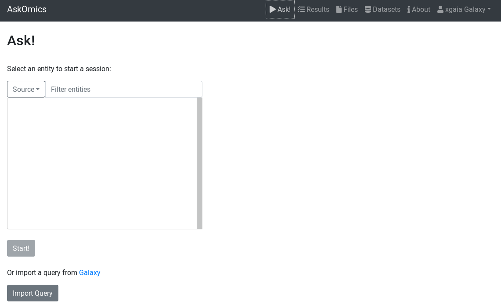
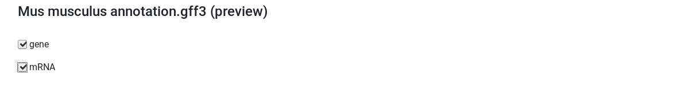
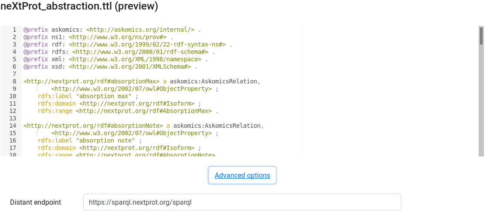
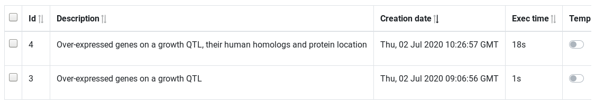
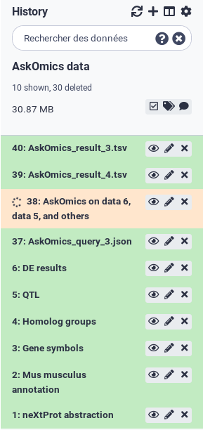

# Introduction
{:.no_toc}

<!-- AskOmics intro -->
AskOmics is a web software for data integration and query using the Semantic Web technologies. It helps users to convert multiple data sources (CSV/TSV files, GFF and BED annotation) into RDF triples, and perform complex queries using a user-friendly interface.
During the step of integration, AskOmics build an RDF desription of the data: the **abstraction**. This abstraction is used to explore the data and build the query.
AskOmics can also integrate **abstraction** of distant endpoint. Abstraction are obtained using [abstractor](https://github.com/askomics/abstractor), a pyhton package to generatre RDF abstraction from distant endpoint.
The query builder interface is used to create a path through the **abstraction** of each ressources. The path is converted to a SPARQL query that is sent to the multiple SPARQL endpoint.

<!-- AskOmics for RNA-Seq -->
AskOmics comes useful for cross-referencing results datasets with various reference data. For example, in RNA-Seq studies, we often need to filter the results on the fold change and the p-value, to get the most significant differentially expressed genes. If you are studying a particular phenotype and already know the position of some QTL associated to this phenotype, you would then want to cross this gene list with the reference annotation of the corresponding genome to get the genes locations. You would also determine which gene is located within a QTL related to the phenotype. Finaly, you would know if these genes have human homologs, and use the neXtProt database to get the location of the proteins coded by the homologs. The whole process involves several tools to parse and manipulate the different data format, and to map datasets on other. AskOmics offer a solution to 1) automatically convert the multiple formats to RDF, 2) use a user-friendly interface to perform complex SPARQL queries on the RDF datasets to find the genes you are interested in, and 3) connect external SPARQL databases and link external data with your own.

<!-- The data -->
In this tutorial, we will use results from a differential expression analysis. This file is provided for you below. You could also generate the file yourself, by following the [RNA-Seq counts to gene tutorial]({{ site.baseurl }}). The file used here was generated from limma-voom but you could use a file from any RNA-seq differential expression tool, such as edgeR or DESeq2, as long as it has the required columns (see below).

The differentially expressed results will be linked to the mouse genome annotation, in general feature format (GFF). The file provided is a subset of the mouse annotation (GRCm38.p6) obtained from [Ensembl](http://www.ensembl.org/Mus_musculus/Info/Index).

We will use a file containing quantitative trait loci (QTL) information, to find if our differentially expressed genes are located inside a known QTL. This file is a subset of a query performed on [Mouse Genome Informatics](http://www.informatics.jax.org).

A file from containing all homologies between mouse and human will be used to get the human homolog genes. This file is provided by [MGI](http://www.informatics.jax.org/downloads/reports/index.html#homology).

To link the human gene with neXtProt database, we will use the RDF abstraction of neXtProt. This file was obtained using [abstractor](https://github.com/askomics/abstractor) tool.


In the differentially expressed file, and the homologs file, gene are described by a symbol. However, in the annotation file and neXtProt database, gene are represented by Ensembl id. To link the 2 datasets, we will need a file to map the gene symbol with Ensembl id. This file provided for you was previously generated with an AskOmics query on the mouse annotation file and the homolog file.

> ### Agenda
>
> In this tutorial, we will cover:
>
> 1. TOC
> {:toc}
>
{: .agenda}

# Preparing the inputs

We will use four files for this analysis:

 * **Differentially expressed results file** (genes in rows, and 4 required columns: identifier (ENTREZID), gene symbol (SYMBOL), log fold change (logFC) and adjusted P values (adj.P.Val))
 * **Reference genome annotation file** (in GFF format)
 * **QTL file** (QTL in row, with 5 required columns: identifier, chromosome, start, end and name)
 * **Homolog file** (TSV of 13 columns including homolog id, organism name and gene symbol)
 * **neXtProt abstraction** (RDF data description of neXtProt database in turtle format)
 * **Correspondence file between gene symbol and Ensembl id** (TSV of 3 columns: symbol, the corresponding Ensembl id (mouse and human)

## Import data

> ###  Hands-on: Data upload
>
> 1. Create a new history for this RNA-seq exercise e.g. `RNA-seq AskOmics`
>
>    
>    
>
> 2. Import the files.
>
>    To import the files, there are two options:
>    - Option 1: From a shared data library if available (ask your instructor)
>    - Option 2: From [Zenodo](https://zenodo.org/record/3925863)
>
>    
>    
>
>    - You can paste the links below into the **Paste/Fetch** box:
>
>      ```
>      https://zenodo.org/record/2529117/files/limma-voom_luminalpregnant-luminallactate
>      https://zenodo.org/record/3925863/files/Mus_musculus.GRCm38.98.subset.gff3
>      https://zenodo.org/record/3925863/files/Symbol.tsv
>      https://zenodo.org/record/3925863/files/MGIBatchReport_Qtl_Subset.txt
>      https://zenodo.org/record/3925863/files/HOM_MouseHumanSequence.rpt
>      https://zenodo.org/record/3925863/files/nextprot_abstraction.ttl
>      ```
>
> 2. Rename the files using the  (pencil) icon.
>    - limma-voom_luminalpregnant-luminallactate to `DE results`
>    - Mus_musculus.GRCm38.98.subset.gff3 to `Mus musculus annotation`
>    - Symbol.tsv to `Gene Symbols`
>    - MGIBatchReport_Qtl_Subset.txt to `QTL`
>    - HOM_MouseHumanSequence.rpt to `Homolog groups`
>    - nextprot_asbtraction.ttl to `neXtProt abstraction`
>
> 3. Check every datatype.
>    - DE results: `tabular`
>    - Mus musculus annotation: `gff`
>    - Gene Symbol: `tabular`
>    - QTL: `tabular`
>    - Homolog groups: `tabular`
>    - neXtprot abstraction: `ttl`
>
> If the datatypes are wrong, please change it.
>
> 
{: .hands_on}

Click on the  (eye) icon and take a look at the uploaded files.

To step are necessary to get our data converted into RDF triples. The first step is to upload the Galaxy datasets into the AskOmics server. The second step is to integrate the uploaded data into the RDF triplestore.

# Upload inputs into AskOmics

We will first launch an AskOmics interactive tool, and upload the data into it.

## Launch AskOmics Interactive Tool

> ###  Hands-on: Launch AskOmics IT
> 1. **AskOmics** a visual SPARQL query builder  to launch the Interactive Tool
>    -  *"Datasets to load into AskOmics"*: `DE results`, `Mus musculus annotation`, `Gene Symbols`, `QTL`, `Homolog groups` and `neXtProt abstraction`
{: .hands_on}

Wait for AskOmics to be ready to use: click on the **view** link when it appears.




Once the Interactive Tool is launched, AskOmics display the start page. You can see that there is no data available yet. It's because data needs to be integrated. It the next step.

# Integrate input files to AskOmics

AskOmics conversion into RDF is called *integration*.
<!-- TODO what is integration? choose which data to load from each dataset, and how they are connected to other datasets -->

On the **Files** page, you will see the uploaded files. We will integrate all the file.


> ###  Hands-on: Integrate data
> 1. **Files** page, select all the input files
> 2. **Integrate**
{: .hands_on}

The **Integrate** page shows a preview of the data present in the file depending of the data type.

## Integrate GFF files

<!-- TODO what is an entity in a gff file? how do we choose? -->
The GFF preview shows the entities that the file contain. We can select the entities we want to be integrated.

> ###  Hands-on: Integrate `Mus musculus annotation`
> 1. Search for `Mus musculus annotation (preview)`
> 2. Select `gene` and `mRNA`
> 3. **Integrate (private dataset)**
>  
{: .hands_on}

## Integration of tabular (TSV) files

The TSV preview show an HTML table representing the TSV file. During integration, AskOmics will convert the file using the header.

<!-- First col: entity, then, attribute -->
The first column of a TSV file will be the *entity* name. Other columns of the file will be *attributes* of the *entity*. *Labels* of the *entity* and *attributes* will be set by the header. This *labels* can be edited by clicking on it.  

<!-- Attribute types -->
Entity and attributes can have special types. The types are defined with the select below the header. An *entity* can be a *start entity* or an *entity*. A *start entity* mean that the entity may be used to start a query.

Attributes can take the following types:
- Numeric: if all the values are numeric
- Text: if all the values are strings
- Category: if there is a limited number of repeated values

If the entity describe a locatable element on a genome:
- Reference: chromosome
- Strand: strand
- Start: start position
- End: end position

<!-- Relation -->
A columns can also be a relation between the *entity* to another. In this case, the header have to be `relationName@TargetedEntity` and the type *Directed* or *Symmetric* relation. a *Directed* relation is a relation from this entity to the targeted one. A *Symetric relation* is a relation on both directions.

> ###  Hands-on: Integrate `DE results`
> 1. Search for `DE results (preview)`
> 2. Edit attribute names and types:
>   - change `ENTREZ ID` to `Differential Expression` and set type to *start entity*
>   - change `SYMBOL` to `linkedTo@Gene Symbol` and set type to *Symmetric relation*
>   - change `GENENAME` to `name` and set type to *text*
>   - Keep the other column names and set their types to *numeric*
> 3. **Integrate (private dataset)**
>   
{: .hands_on}

> ###  Hands-on: Integrate `Gene symbols`
> 1. Search for `Gene symbols (preview)`
> 2. Edit attribute names and types:
>   - change `symbol` to `Gene Symbol` and set type to *entity*
>   - change `ensembl` to `linkedTo@gene` and set type to *Symmetric relation*
> 3. **Integrate (private dataset)**
>   
{: .hands_on}

> ###  Hands-on: Integrate `QTL`
> 1. Search for `QTL (preview)`
> 2. Edit attribute names and types:
>   - change `Input` to `QTL` and set type to *start entity*
>   - set `Chr` type to *Reference*
>   - set `Start` type to *Start*
>   - set `End` type to *End*
> 3. **Integrate (private dataset)**
>   
{: .hands_on}

> ###  Hands-on: Integrate `Homolog groups`
> 1. Search for `Homolog groups (preview)`
> 2. Edit attribute names and types:
>   - change `HomoloGene ID` to `Homolog Group` and set type to *start entity*
>   - set `Common Organism Name`  type to *category*
>   - set `Chr` type to *Reference*
>   - change `Symbol` to `linkedTo@Gene Symbol` and set type to *Directed relation*
>   - Keep the other column names and set their types to *text*
> 3. **Integrate (private dataset)**
>   
{: .hands_on}

## Integration of RDF files

> ###  Hands-on: Integrate `neXtProt abstraction`
> 1. Search for `neXtProt abstraction (preview)`
> 2. Check that Distant endpoint is `https://sparql.nextprot.org/sparql` in advanced options
> 3. **Integrate (private dataset)**
>   
{: .hands_on}

## Monitor integration

Integration can take some times depending on the file size. The **Datasets** page show the progress.

> ###  Hands-on: track integration progress
> 1. Go to **Dataset** page
> 2. Wait for all datasets to be *success*
>   
{: .hands_on}

# Query

Once all the data of interest is integrated (converted to RDF graphs), its time to query them. Querying RDF data is done by using the SPARQL language. Fortunately, AskOmics provides a user-friendly interface to build SPARQL queries without having to learn the SPARQL language.

## Query builder overview

### Simple query

The first step to build a query is to choose a start point for the query.


> ###  Hands-on: Start a query
> 1. Go to **Ask!** page
> 2. Select the *Differential Expression* entity
> 3. **Start!**
{: .hands_on}


Once the start entity is chosen, the query builder is displayed.


The query builder is composed of a graph. Nodes represents *entities* and links represents *relations* between entities. The selected entity is surrounded by a red circle. links and other entities are dotted and lighter because there are not instantiated.


On the right, attributes of the selected entity are displayed as attribute boxes. Each boxes have an eye icon. Open eye mean the attribute will be displayed on the results.

> ###  Hands-on: Ask for all Differential Expression and display some attributes
> 1. Display `logFC` and `adj.P.val` by clicking on the eye icon
> 2. **Run & preview**
{: .hands_on}


**Run & preview** launch the query with a limit of 30 rows returned. We use this button to get an idea of the results returned.


### Filter on attributes

Next query will search for all over-expressed genes. Genes are considered over-expressed if the log fold change is > 2. We are oly interested by  significant results (Adj P value ≤ 0.05)

Back to the query builder,

> ###  Hands-on: Filter attributes to get significant over-expressed genes
> 1. Filter `logFC` with `> 2`
> 2. Filter `adj.P.val` with `≤ 0.05`
> 2. **Run & preview**
{: .hands_on}

The preview show only significantly over-expressed genes.


### Filter on relations

now that we have our genes if interest, we will link these genes to the reference genome to get information about location.

To constraint on relation, we have to click on suggested nodes, linked to our entity of interest.

> ###  Hands-on: Link `De results` to `gene` using `Gene Symbol`
> 1. First, hide `Label`, `logFC` and `adj.P.val` of `Differential Expression` using the eye icon
> 2. Instantiate `Gene Symbol` by clicking on the suggested node, and hide his `Label` using the eye icon
> 3. Instantiate `gene` by clicking on the `gene` node
> 2. **Run & preview**
{: .hands_on}

Results now show the Ensembl id of our over-expressed genes. We have now access to all the information about the `gene` entity containing on the GFF file. for example, we can filter on chromosome and display chromosome and strand to get information about gene location.

> ###  Hands-on: Filter `gene`
> 1. Show `reference` and `strand` using the eye icon
> 2. Filter `reference` by selecting `X` and `Y` chromosomes (use `ctrl`+`click` to multiple selection)
> 2. **Run & preview**
> 
{: .hands_on}


### Use FALDO ontology to query on the position of elements on the genome.

The [FALDO](https://bioportal.bioontology.org/ontologies/FALDO) ontology describe sequence feature positions and regions. AskOmics use FALDO ontology to represent entity positions. GFF are using FALDO, as well as TSV entities with chromosome, strand, start and end.

The FALDO ontology are used in AskOmics to perform special queries between 2 FALDO entities. These queries are:

- Entity included in another entity
- Entity overlapping another one

On the query builder interface, FALDO entities are represented with a green circle and FALDO relations have a green arrow.

> ###  Hands-on: Filter `gene`
> 1. First, remove the reference filter (unselect `X` and `Y` using `ctrl`+`click`)
> 2. Hide `strand` using the eye
> 3. Instantiate `QTL`
> 4. Click on the link between `gene` and `QTL` to edit the relation
> 5. check that the relation is `gene` `included in` `QTL` `on the same reference` with `strict` ticked
> 6. **Run & preview**
> 
{: .hands_on}


To go further, we can filter on `QTL` to refine the results.


> ###  Hands-on: Filter `gene`
> 1. go back to the `QTL` node
> 2. Show the `Name` attribute using the eye icon
> 3. Filter the name with a `regexp` with `growth`
> 4. **Run & preview**
{: .hands_on}

From now, our query is "All Genes that are over-expressed (logFC > 2 and FDR ≤ 0.05) and located on a QTL that is related to growth" We can save this results with the *Run & save* button.

> ###  Hands-on: Save a result
> 1. **Run & save**
{: .hands_on}

### Use neXtProt distant data to refine results

[neXtProt](https://nextprot.org) is a comprehensive human-centric discovery platform, offering its users a seamless integration of and navigation through protein-related data. It offer a [SPARQL endpoint](https://sparql.nextprot.org/sparql) that can be interrogated with AskOmics.

Since we added the neXtProt abstraction into our AskOmics instance, we can link our data to neXtProt.

> ###  Hands-on: Find human homolog genes
> 1. Go back to the `gene` node
> 2. instantiate `Gene Symbol` and hide his `Label`
> 3. Instantiate `Homolog Group`, hide his label and filter his `Common Organism Name` with `human`
> 
> 4. Instantiate another `Gene Symbol` and hide his `Label`
> 5. Finally, follow the `to neXtProt Gene` and instantiate `Gene`
> 5. **Run & preview**
{: .hands_on}

The query we've just built asks for the human homologs of our over-expressed genes. We use the `Gene Symbol` to get information from the neXtProt database. AskOmics convert the query into small SPARQL subquery and send them into the local data and the neXtProt endpoint.

Now we are linked to the gene present in neXtProt, we can obtain information about the proteins encoded by these genes, as well as their location in the cell.

> ###  Hands-on: Get the protein and their location
> 1. Instantiate `Entry`
> 2. Instantiate `Isoform` and hide the `Label`
> 3. Many nodes are connected to `Isoform`. Use the *Filter links* field to get only node thar are linked with a link named `location`
> 
> 4. Instantiate the `Subcellular Location` node and hide `Label`
> 5. Use the *Filter node* field to filter nodes that a named `Location`
> 6. Instantiate `Uniprot subcellular Location CV`
> 7. **Run & preview**
{: .hands_on}

The query we just build is "All genes that are over-expressed and located on a QTL that is related to growth, their human homologs and the location of the protein coded by this genes". This our last query. We will save it.

> ###  Hands-on: Save a result
> 1. **Run & save**
{: .hands_on}


## Results management

The results page display the saved queries. Queries are sorted by the most recently. At the end of the table, action button can be used to preview the result, download or send it to Galaxy history.

> ###  Hands-on: Edit query name
> 1. Go to the *Results* page
> 2. Use the *Preview* button to check the result
> 3. Click on the name to rename the two query with `Over-expressed genes on a growth QTL` and `Over-expressed genes on a growth QTL, their human homologs and protein location` (press enter key to validate)
{: .hands_on}



The **Action** column contain button to perform certain action:

- Preview: show a results preview on the bottom of the table
- Download: Download the results (TSV file)
- Edit: Edit the query with the query builder
- SPARQL: edit the query with a SPARQL editor for advanced users
- Send results to Galaxy: send the results (TSV file) to the most recently used Galaxy history
- Send query to Galaxy: send the query representation (json file) to the most recently used Galaxy history

> ###  Hands-on: Send results to Galaxy
> 1. Click on **Send results to Galaxy** on each query to send them to the last used Galaxy history
> 2. Get back to galaxy and wait for the dataset (reload if needed)
{: .hands_on}



# Conclusion
{:.no_toc}

In this tutorial we have seen how to use AskOmics Interactive Tool. We launch the tools with a set of input files, then we have integrated this file into RDF and finally, we build complex queries over this local datasets and neXtProt to answer a biological question.
