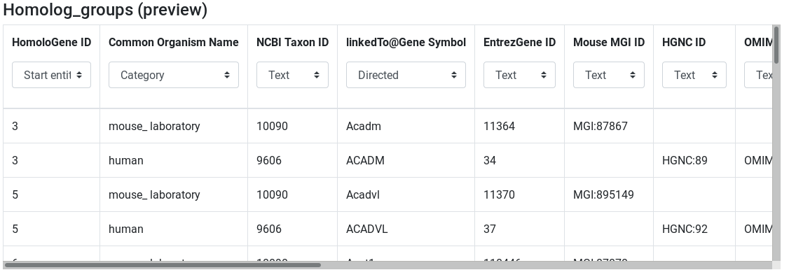
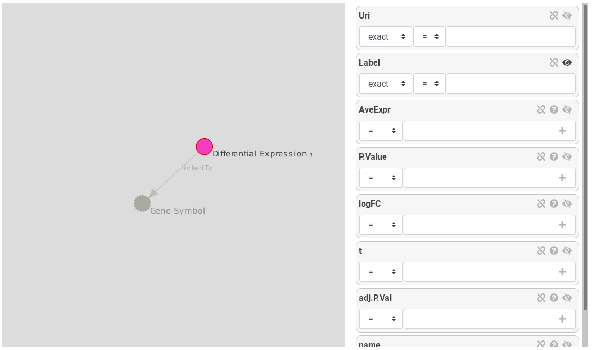
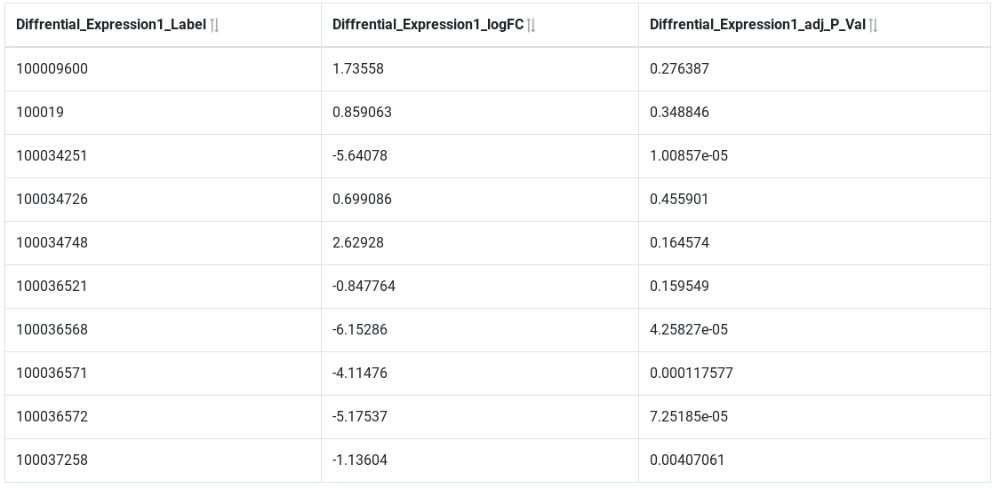
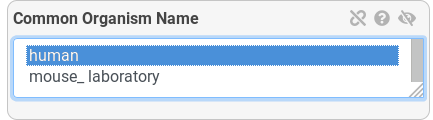
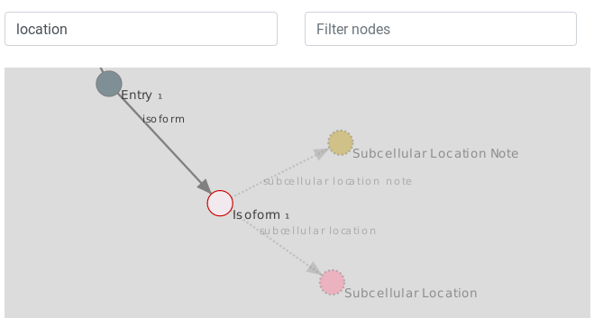

# Introduction


<!-- AskOmics intro -->
AskOmics is a web application for data integration and querying using the Semantic Web technologies. It helps users to convert multiple data sources (CSV/TSV files, GFF and BED annotation) into "RDF triples" and store them in a specific kind of database: an "RDF triplestore". Under this form, data can then be queried using a specific language: "SPARQL". AskOmics hides the complexity of these technologies and allows to perform complex queries using a user-friendly interface.

<!-- AskOmics for RNA-Seq -->
AskOmics comes in useful for cross-referencing results datasets with various reference data. For example, in RNA-Seq studies, we often need to filter the results on the fold change and the p-value, to get the most significant differentially expressed genes. If you are studying a particular phenotype and already know the position of some QTL associated to this phenotype, you would then want to find the positions of the differentially expressed genes and determine which gene is located within one of those QTL. Finally, you would want to know if these genes have human homologs, and use the neXtProt database to get the location of the proteins coded by the homologs. The whole process involves several tools to parse and manipulate the different data format, and to map datasets on each other. AskOmics offer a solution to 1) automatically convert the multiple formats to RDF, 2) use a user-friendly interface to perform complex SPARQL queries on the RDF datasets to find the genes you are interested in, and 3) connect external SPARQL databases and link external data with your own.

<!-- The data -->
In this tutorial, we will use results from a differential expression analysis. This file is provided for you below. You could also generate the file yourself, by following the [RNA-Seq counts to gene tutorial](). The file used here was generated from limma-voom but you could use a file from any RNA-seq differential expression tool, such as edgeR or DESeq2, as long as it contains the required columns (see below).

The differentially expressed results will be linked to the official mouse genome annotation, in general feature format (GFF). The file provided is a subset of the mouse annotation (GRCm38.p6) obtained from [Ensembl](http://www.ensembl.org/Mus_musculus/Info/Index).

We will use a file containing quantitative trait loci (QTL) information, to find if our differentially expressed genes are located inside a known QTL. This file is a subset of a query performed on [Mouse Genome Informatics](http://www.informatics.jax.org).

A file containing all homologies between mouse and human will be used to get the human homolog genes. This file is provided by [MGI](http://www.informatics.jax.org/downloads/reports/index.html#homology).

In the differentially expressed file, and the homologs file, gene are described by a symbol (e.g. Pwgrq10). However, in the annotation file and neXtProt database, gene are represented by Ensembl id (e.g. ENSMUSG00000025969). To link the 2 datasets, we will need a file to map the gene symbol with Ensembl id. This file provided for you was previously generated with an AskOmics query on the mouse annotation file and the homolog file.

To link the human gene with neXtProt database, we will use the RDF abstraction of neXtProt. This file was obtained using the [Abstractor](https://github.com/askomics/abstractor) tool.

> <details-title>Abstraction</details-title>
> During the integration step, AskOmics builds an RDF description of the data: the **abstraction**. This abstraction is used to explore the data and build the query.
> AskOmics can also integrate **abstraction** of distant endpoint. Abstraction are obtained using [abstractor](https://github.com/askomics/abstractor), a python package to generate RDF abstractions from distant endpoints.
> The query builder interface is used to create a path through the **abstraction** of each ressources. The path is converted to a SPARQL query that is sent to the multiple SPARQL endpoint.
{: .details}

> <agenda-title></agenda-title>
>
> In this tutorial, we will cover:
>
> 1. TOC
> {:toc}
>
{: .agenda}

# Preparing the inputs

We will use four files for this analysis:

 * **Differentially expressed results file** (genes in rows, and 4 required columns: identifier (ENTREZID), gene symbol (SYMBOL), log fold change (logFC) and adjusted P values (adj.P.Val))
 * **Reference genome annotation file** (in GFF format)
 * **QTL file** (QTL in rows, with 5 required columns: identifier, chromosome, start, end and name)
 * **Homolog file** (TSV of 13 columns including homolog id, organism name and gene symbol)
 * **Correspondence file between gene symbol and Ensembl id** (TSV of 3 columns: symbol, the corresponding Ensembl id (mouse and human)
 * **neXtProt abstraction** (RDF data description of neXtProt database in turtle format)

## Import data

> <hands-on-title>Data upload</hands-on-title>
>
> 1. Create a new history for this RNA-seq exercise e.g. `RNA-seq AskOmics`
>
>    
>    
>
> 2. Import the files.
>
>    To import the files, there are two options:
>    - Option 1: From a shared data library if available (ask your instructor)
>    - Option 2: From [Zenodo](https://zenodo.org/record/3950862)
>
>    
>    
>
>    - You can paste the links below into the **Paste/Fetch** box:
>
>      ```
>      https://zenodo.org/record/2529117/files/limma-voom_luminalpregnant-luminallactate
>      https://zenodo.org/record/3950862/files/Mus_musculus.GRCm38.98.subset.gff3
>      https://zenodo.org/record/3950862/files/Symbol.tsv
>      https://zenodo.org/record/3950862/files/MGIBatchReport_Qtl_Subset.txt
>      https://zenodo.org/record/3950862/files/HOM_MouseHumanSequence.rpt
>      https://zenodo.org/record/3950862/files/nextprot_abstraction.ttl
>      ```
>
> 2. Rename the files using the  (pencil) icon.
>    - limma-voom_luminalpregnant-luminallactate to `DE results`
>    - Mus_musculus.GRCm38.98.subset.gff3 to `Mus musculus annotation`
>    - Symbol.tsv to `Gene Symbols`
>    - MGIBatchReport_Qtl_Subset.txt to `QTL`
>    - HOM_MouseHumanSequence.rpt to `Homolog groups`
>    - nextprot_asbtraction.ttl to `neXtProt abstraction`
>
> 3. Check every datatype.
>    - DE results: `tabular`
>    - Mus musculus annotation: `gff`
>    - Gene Symbol: `tabular`
>    - QTL: `tabular`
>    - Homolog groups: `tabular`
>    - neXtprot abstraction: `ttl`
>
> If the datatypes are wrong, please change it.
>
> 
{: .hands_on}

Click on the  (eye) icon and take a look at the uploaded files.

Two step are necessary to get our data converted into RDF triples. The first step is to upload the Galaxy datasets into the AskOmics server. The second step is to integrate the uploaded data into the RDF triplestore.

# Upload inputs into AskOmics

We will first launch an AskOmics interactive tool, and upload the data into it.

## Launch AskOmics Interactive Tool

> <hands-on-title>Launch AskOmics IT</hands-on-title>
> 1. **AskOmics** a visual SPARQL query builder  to launch the Interactive Tool
>    -  *"Datasets to load into AskOmics"*: `DE results`, `Mus musculus annotation`, `Gene Symbols`, `QTL`, `Homolog groups` and `neXtProt abstraction`
{: .hands_on}

Wait a few seconds (or minutes if computing resources are busy) for AskOmics to be ready to use. A **view** link should appear in the confirmation box just after clicking on the **Execute** button.

AskOmics is an *Interactive tool*. It means that when you launch it, it will stay in running state (yellow background) in your History. As long as it stays in this running state, you can access it by looking in the "User" > "Active Interactive Tools" menu (click on its name to view it). When you no longer need it, you can stop it by deleting it from your history, or using the "Stop" button in the "User" > "Active Interactive Tools" page.

Keep in mind that as long as this tool runs, it uses computing resources, so don't forget to stop it when you no longer have use for it.

Once the AskOmics Interactive Tool is ready, you should see a start page looking like this:


 You can see that there is no data available yet. It's because data needs to be integrated: it is the next step.

# Integrate input files into AskOmics

AskOmics conversion into RDF is called *integration*.

On the **Files** page (link at the top of the page), you will see the files you uploaded from Galaxy. We will now integrate all these files.

> <hands-on-title>Integrate data</hands-on-title>
> 1. Got to the **Files** page
> 2. Select all the input files
> 3. Click on the **Integrate** button
{: .hands_on}


You will land on the **Integrate** page that shows a preview of the data present in each selected file, depending of its data type.

## Integrate GFF files

The GFF preview shows the entities that the file contains. We need to select the entities we want to be integrated.

The `Mus musculus annotation` file we're using contains gene and mRNA entities, and we will need both in the rest of the tutorial.

> <hands-on-title>Integrate `Mus musculus annotation`</hands-on-title>
> 1. Search for `Mus musculus annotation (preview)`
> 2. Select `gene` and `mRNA`
> 3. Click on the **Integrate (private dataset)** button
> 
{: .hands_on}


## Integration of tabular (TSV) files

The TSV preview shows an HTML table representing the first lines of the TSV file. During integration, AskOmics will convert the file using the header.

<!-- First col: entity, then, attribute -->
The first column of a TSV file will be the *entity* name. Other columns of the file will be *attributes* of the *entity*. *Labels* of the *entity* and *attributes* will be set by the header. Each *label* can be edited by clicking on it.

<!-- Attribute types -->
Entity and attributes can have special types. The types are defined with the select box below the header. An *entity* can be a *start entity* or an *entity*. A *start entity* means that the entity may be used to start a query on the AskOmics homepage.

Attributes can take the following types:
- Numeric: if all the values of the column are numeric
- Text: if all the values are strings
- Category: if there is a limited number of repeated values (e.g. 'green', 'yellow' and 'red', each one found in multiple lines)

If the entity describes a locatable element on a genome:
- Reference: chromosome
- Strand: strand
- Start: start position
- End: end position

<!-- Relation -->
A column can also represent a relation between the *entity* to another. In this case, the header have to be named `relationName@TargetedEntity` and the type *Directed* or *Symetric* relation. A *Directed* relation is a relation from this entity to the targeted one (e.g. A is B's father, but B is not A's father). A *Symetric relation* is a relation that works in both directions (e.g. A loves B, and B loves A).

> <hands-on-title>Integrate `DE results`</hands-on-title>
> 1. Search for `DE results (preview)`
> 2. Edit attribute names and types:
>   - change `ENTREZ ID` to `Differential Expression` and set type to *start entity*
>   - change `SYMBOL` to `linkedTo@Gene Symbol` and set type to *Symetric relation*
>   - change `GENENAME` to `name` and set type to *text*
>   - Keep the other column names and set their types to *numeric*
> 3. **Integrate (private dataset)**
>   
{: .hands_on}

> <hands-on-title>Integrate `Gene symbols`</hands-on-title>
> 1. Search for `Gene symbols (preview)`
> 2. Edit attribute names and types:
>   - change `symbol` to `Gene Symbol` and set type to *entity*
>   - Set `to mouse genes@gene` type to *Symetric relation*
> 3. Click on the **Integrate (private dataset)** button
>   
{: .hands_on}

> <hands-on-title>Integrate `QTL`</hands-on-title>
> 1. Search for `QTL (preview)`
> 2. Edit attribute names and types:
>   - change `Input` to `QTL` and set type to *start entity*
>   - set `Chr` type to *Reference*
>   - set `Start` type to *Start*
>   - set `End` type to *End*
> 3. Click on the **Integrate (private dataset)** button
>   
{: .hands_on}

> <hands-on-title>Integrate `Homolog groups`</hands-on-title>
> 1. Search for `Homolog groups (preview)`
> 2. Edit attribute names and types:
>   - change `HomoloGene ID` to `Homolog Group` and set type to *start entity*
>   - set `Common Organism Name` type to *category*
>   - change `Symbol` to `linkedTo@Gene Symbol` and set type to *Directed relation*
>   - Keep the other column names and set their types to *text*
> 3. Click on the **Integrate (private dataset)** button
>   
{: .hands_on}

## Integration of RDF files

The last dataset we want to integrate is the neXtProt abstraction. This file contains some RDF data that instructs AskOmics how to communicate with a remote RDF database containing [neXtProt](https://www.nextprot.org/) data.

> <hands-on-title>Integrate `neXtProt abstraction`</hands-on-title>
> 1. Search for `neXtProt abstraction (preview)`
> 2. Check that **Distant endpoint** is set to `https://sparql.nextprot.org/sparql` in **advanced options**
> 3. Click on the **Integrate (private dataset)** button
>   
{: .hands_on}

## Monitor integration

Integration can take some time depending on the file size. The **Datasets** page shows the progress.

> <hands-on-title>track integration progress</hands-on-title>
> 1. Go to the **Dataset** page
> 2. Wait for all datasets to be in *success* state
>   
{: .hands_on}

# Query

Once all the data of interest is integrated (converted to RDF), its time to query them. Querying RDF data is done by using the SPARQL language. Fortunately, AskOmics provides a user-friendly interface to build SPARQL queries without having to learn the SPARQL language.

## Query builder overview

### Simple query

The first step to build a query is to choose a start point for the query.


> <hands-on-title>Start a query</hands-on-title>
> 1. Go to the **Ask!** page
> 2. Select the *Differential Expression* entity
> 3. **Start!**
{: .hands_on}


Once the start entity is chosen, the query builder is displayed.


The query builder is composed of a graph. Nodes represents *entities* and links represents *relations* between entities. The selected entity is surrounded by a red circle. Links and other entities are dotted and lighter because there are not instantiated.



On the right, attributes of the selected entity are displayed as attribute boxes. Each box has an eye icon: an opened eye means the attribute will be displayed on the results.

> <hands-on-title>Ask for all Differential Expression and display some attributes</hands-on-title>
> 1. Display `logFC` and `adj.P.val` by clicking on the eye icon
> 2. **Run & preview**
> 
{: .hands_on}


**Run & preview** launch the query with a limit of 30 rows returned. We use this button to get an idea of the results returned.


### Filter on attributes

Next query will search for all over-expressed genes. Genes are considered over-expressed if the log fold change is > 2. We are only interested by significant results (Adj P value ≤ 0.05)

Back to the query builder,

> <hands-on-title>Filter attributes to get significant over-expressed genes</hands-on-title>
> 1. Filter `logFC` with `> 2`
> 2. Filter `adj.P.val` with `≤ 0.05`
> 2. **Run & preview**
> 
{: .hands_on}

The preview shows only significantly over-expressed genes.

### Filter on relations

Now that we have found our genes of interest, we will link these genes to the reference genome to get information about their location.

To constraint on relation, we have to click on suggested nodes, linked to our entity of interest.

> <hands-on-title>Link `De results` to `gene` using `Gene Symbol`</hands-on-title>
> 1. First, hide `Label`, `logFC` and `adj.P.val` of `Differential Expression` using the eye icon
> 2. Instantiate `Gene Symbol` by clicking on the suggested node, and hide his `Label` using the eye icon
> 3. Instantiate `gene` by clicking on the `gene` node
> 2. **Run & preview**
> 
{: .hands_on}

Results now show the Ensembl id of our over-expressed genes. We have now access to all the information about the `gene` entity contained in the GFF file. For example, we can filter on chromosome and display chromosome and strand to get information about gene location.

> <hands-on-title>Filter `gene`</hands-on-title>
> 1. Show `reference` and `strand` using the eye icon
> 2. Filter `reference` by selecting `X` chromosome
> 3. Filter `strand` by selecting `+` strand
> 4. **Run & preview**
> 
{: .hands_on}


### Query on the position of elements on the genome.

AskOmics is able to perform special queries between entities that are locatable. These queries are:

- Entities overlapping another one
- Entities included in another entity

> <details-title>FALDO ontology</details-title>
> The [FALDO](https://bioportal.bioontology.org/ontologies/FALDO) ontology describes sequence feature positions and regions. AskOmics uses FALDO ontology to represent entity positions. GFF are using FALDO, as well as TSV entities with chromosome, strand, start and end.
{: .details}

On the query builder interface, locatable entities are represented with a green circle and relations based on location are represented as green arrow.

> <hands-on-title>Filter `gene`</hands-on-title>
> 1. First, remove the reference filter (unselect `X` using `ctrl`+`click`)
> 1. Remove the strand filter (unselect `+` using `ctrl`+`click`)
> 2. Hide `reference` `strand` using the eye
> 3. Instantiate `QTL`
> 4. Click on the link between `gene` and `QTL` to edit the relation
> 5. Check that the relation is `gene` `included in` `QTL` `on the same reference` with `strict` ticked
> 6. **Run & preview**
> 
{: .hands_on}


To go further, we can filter on `QTL` to refine the results.


> <hands-on-title>Filter `gene`</hands-on-title>
> 1. Go back to the `QTL` node
> 2. Show the `Name` attribute using the eye icon
> 3. Filter the name with a `regexp` with `growth`
> 4. **Run & preview**
{: .hands_on}

From now, our query is "All Genes that are over-expressed (logFC > 2 and FDR ≤ 0.05) and located on a QTL that is related to growth". We can save this results with the *Run & save* button.

> <hands-on-title>Save a result</hands-on-title>
> 1. **Run & save**
{: .hands_on}

### Use neXtProt distant data to refine results

[neXtProt](https://www.nextprot.org) is a comprehensive human-centric discovery platform, offering its users a seamless integration of and navigation through protein-related data. It offer a [SPARQL endpoint](https://sparql.nextprot.org/sparql) that can be interrogated with AskOmics.

Since we added the neXtProt abstraction into our AskOmics instance, we can link our data to neXtProt.

> <hands-on-title>Find human homolog genes</hands-on-title>
> 1. Go back to the `gene` node
> 2. instantiate `Gene Symbol` and hide his `Label`
> 3. Instantiate `Homolog Group`, hide his label and filter his `Common Organism Name` with `human`
> 
> 4. From `Homolog Group`, instantiate another `Gene Symbol` and hide his `Label`
> 5. Finally, follow the `to neXtProt Gene` link and instantiate `Gene` (with a capital G)
> 5. **Run & preview**
{: .hands_on}

The query we've just built asks for the human homologs of our over-expressed genes. We use the `Gene Symbol` to get information from the neXtProt database. AskOmics converts the query into small SPARQL subqueries and send them to the local database and to the remote neXtProt endpoint.

Now we are linked to the neXtProt database, we can obtain information about the proteins encoded by these genes, as well as their location in the cell.

> <hands-on-title>Get the protein and their location</hands-on-title>
> 1. Instantiate `Entry`
> 2. Instantiate `Isoform` and hide the `Label`
> 3. Many nodes are connected to `Isoform`. Use the *Filter links* field to filter nodes linked with a link named `location`
> 
> 4. Instantiate the `Subcellular Location` node and hide `Uri`
> 5. Use the *Filter node* field to filter nodes with "location" in their name
> 6. Instantiate `Uniprot subcellular Location CV` (you can use the node filter to clear up the screen)
> 7. **Run & preview**
{: .hands_on}

Finally, our query is "All genes that are over-expressed and located on a QTL that is related to growth, their human homologs and the location of the proteins coded by this genes". We will save it to the results.

> <hands-on-title>Save a result</hands-on-title>
> 1. **Run & save**
{: .hands_on}


## Results management

The results page displays the saved queries. Queries are sorted by creation date. At the end of the table, action buttons can be used to preview the result, download or send it to Galaxy history.

> <hands-on-title>Edit query name</hands-on-title>
> 1. Go to the *Results* page
> 2. Use the *Preview* button to check the result
> 3. Click on the name to rename the two query with `Over-expressed genes on a growth QTL` and `Over-expressed genes on a growth QTL, their human homologs and protein location` (press enter key to validate)
{: .hands_on}


The **Action** column contain button to perform certain action:

- Preview: show a results preview on the bottom of the table
- Download: Download the results (TSV file)
- Edit: Edit the query with the query builder
- SPARQL: edit the query with a SPARQL editor for advanced users
- Send results to Galaxy: send the results (TSV file) to the most recently used Galaxy history
- Send query to Galaxy: send the query representation (json file) to the most recently used Galaxy history

> <hands-on-title>Send results to Galaxy</hands-on-title>
> 1. Click on **Send results to Galaxy** on each query to send them to the last used Galaxy history
> 2. Get back to galaxy and wait for the dataset (reload if needed)
{: .hands_on}


Now that you have used AskOmics to generate this final tabular file, you can continue analysing it with other Galaxy tools.
If you are done, don't forget to close the AskOmics instance by going to the “User” > “Active Interactive Tools” page.

# Conclusion


In this tutorial we have seen how to use AskOmics Interactive Tool. We launch the tools with a set of input files, then we have integrated these files into RDF and finally, we built complex queries over this local datasets and neXtProt to answer a biological question.
