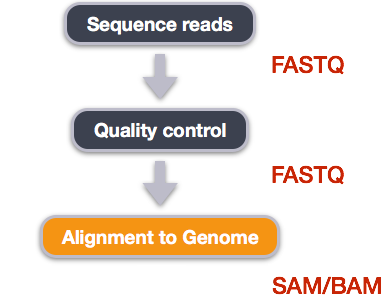
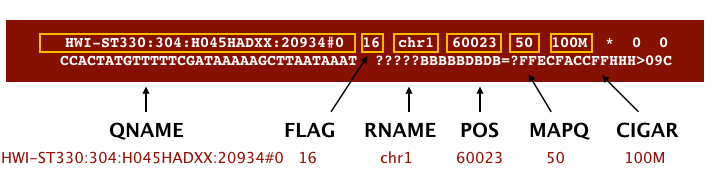
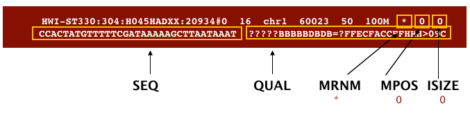

In recent years, RNA sequencing (in short RNA-Seq) has become a very widely used technology to analyze the continuously changing cellular transcriptome, i.e. the set of all RNA molecules in one cell or a population of cells. One of the most common aims of RNA-Seq is the profiling of gene expression by identifying genes or molecular pathways that are differentially expressed (DE) between two or more biological conditions. This tutorial demonstrates a computational workflow for counting and locating the genes in RNA sequences. The first and most critical step in an RNA-seq analysis.

In the study of , the authors identified genes and pathways regulated by the *Pasilla* gene (the *Drosophila* homologue of the mammalian splicing regulators Nova-1 and Nova-2 proteins) using RNA-Seq data. They depleted the *Pasilla* (*PS*) gene in *Drosophila melanogaster* by RNA interference (RNAi). Total RNA was then isolated and used to prepare both single-end and paired-end RNA-Seq libraries for treated (PS depleted) and untreated samples. These libraries were sequenced to obtain RNA-Seq reads for each sample. The RNA-Seq data for the treated and the untreated samples can be compared to identify the effects of *Pasilla* gene depletion on gene expression.

In this tutorial, we illustrate the analysis of the gene expression data step by step using 7 of the original datasets:

- 4 untreated samples: [GSM461176](https://www.ncbi.nlm.nih.gov/geo/query/acc.cgi?acc=GSM461176), [GSM461177](https://www.ncbi.nlm.nih.gov/geo/query/acc.cgi?acc=GSM461177), [GSM461178](https://www.ncbi.nlm.nih.gov/geo/query/acc.cgi?acc=GSM461178), [GSM461182](https://www.ncbi.nlm.nih.gov/geo/query/acc.cgi?acc=GSM461182)
- 3 treated samples (*Pasilla* gene depleted by RNAi): [GSM461179](https://www.ncbi.nlm.nih.gov/geo/query/acc.cgi?acc=GSM461179), [GSM461180](https://www.ncbi.nlm.nih.gov/geo/query/acc.cgi?acc=GSM461180), [GSM461181](https://www.ncbi.nlm.nih.gov/geo/query/acc.cgi?acc=GSM461181)

Each sample constitutes a separate biological replicate of the corresponding condition (treated or untreated). Moreover, two of the treated and two of the untreated samples are from a paired-end sequencing assay, while the remaining samples are from a single-end sequencing experiment.

> <comment-title>Full data</comment-title>
>
> The original data are available at NCBI Gene Expression Omnibus (GEO) under accession number [GSE18508](https://www.ncbi.nlm.nih.gov/geo/query/acc.cgi?acc=GSE18508). The raw RNA-Seq reads have been extracted from the Sequence Read Archive (SRA) files and converted into FASTQ files.
{: .comment}

> <agenda-title></agenda-title>
>
> In this tutorial, we will cover:
>
> 1. TOC
> {:toc}
>
{: .agenda}

> <comment-title></comment-title>
>
> This tutorial is significantly based on Galaxy's ["Reference-based RNA-Seq data analysis"]() tutorial.
>
{: .comment}

# Data Upload

At first, we need to put our hands on our data. In this tutorial we will use the files for 2 out of the 7 samples to demonstrate how to calculate read counts (a measure of the gene expression) from FASTQ files (quality control, mapping, read counting). The FASTQ files for the other 5 samples, are provided, in case you want to reproduce the whole analysis later.
The "Data Upload" process is the only one in this tutorial that takes place directly into Galaxy's interface.


> <hands-on-title>Data upload</hands-on-title>
>
> 1. Import the FASTQ file pairs from [Zenodo]({{ page.zenodo_link }}) or a data library:
>    - `GSM461177` (untreated): `GSM461177_1` and `GSM461177_2`
>    - `GSM461180` (treated): `GSM461180_1` and `GSM461180_2`
>
>    ```text
>    {{ page.zenodo_link }}/files/GSM461177_1.fastqsanger
>    {{ page.zenodo_link }}/files/GSM461177_2.fastqsanger
>    {{ page.zenodo_link }}/files/GSM461180_1.fastqsanger
>    {{ page.zenodo_link }}/files/GSM461180_2.fastqsanger
>    ```
>
> 2. 
>
> 3. 
>
>    > <comment-title></comment-title>
>    >
>    > Note that these are the full files for the samples and ~1.5Gb each so it may take some minutes to import.
>    >
>    > For a quicker run-through of the FASTQ steps a small subset of each FASTQ file (~5Mb) can be found here on [Zenodo]({{ page.zenodo_link }}):
>    >
>    > ```text
>    > {{ page.zenodo_link }}/files/GSM461177_1_subsampled.fastqsanger
>    > {{ page.zenodo_link }}/files/GSM461177_2_subsampled.fastqsanger
>    > {{ page.zenodo_link }}/files/GSM461180_1_subsampled.fastqsanger
>    > {{ page.zenodo_link }}/files/GSM461180_2_subsampled.fastqsanger
>    > ```
>    >
>    {: .comment}
>
> 4. Change the datatype from `fastqsanger` to `fastq`.
>
>    
>
> 5. We also need to import two more files, essential for the alignment operation (and basically every alignment procedure): the organism's reference genome (here *D. melanogaster*) and the organism's gene annotation.
>    Those can be aquired directly via link and Galaxy's data library as described above. For this tutorial we are going to use the files [dm6.fa.gz](https://hgdownload.soe.ucsc.edu/goldenPath/dm6/bigZips/dm6.fa.gz) and [Drosophila_melanogaster.BDGP6.87.gtf (dm6)](https://usegalaxy.eu/libraries/folders/F30cab321d898d2fb/dataset/02c5f7fcdb6bf41f). Note that it is essential to convert genome's file from `*.fa.gz` to `*.fa`. That is easy now that we have already used the same method to convert `fastqsanger` to `fastq`. Remember to change the name of the file, too, in your working history as Galaxy will not do it automatically. Doing so will prevent any confusions later on.
>
> 
>
{: .hands_on}



Keep in mind that the reads are raw data from the sequencing machine without any pretreatments. They need to be assessed for their quality.

# Tools to use



> <hands-on-title>Software to use</hands-on-title>
>
> The R Console and other interactive tools like RStudio are great for prototyping code and exploring data, but sooner or later we will want to use our program in a pipeline or run it in a shell script to process thousands of data files. This is one of those cases and, in order to do that, we will use the terminal provided by the RStudio itself.
> We go to "Tools" and pick the "Shell..." option and we are good to go. Our workspace is the left, terminal window that just opened.
>
> Fortunately, [miniconda](https://docs.conda.io/en/latest/miniconda.html) is already installed. Miniconda is a package manager that simplifies the installation processes. We can and will use it to install every essential package for our tutorial. However, it is of critical importance that we do that in an new environment within our existing base and install our packages in said environment.
>
> > <code-in-title>Environment and Packages</code-in-title>
> > ```bash
> > $ conda create -n name_of_your_env fastqc cutadapt star samtools subread
> > $ conda activate name_of_your_env
> > ```
> {: .code-in}
>
>
> | Software | Version | Manual | Available for | Description |
> | -------- | ------------ | ------ | ------------- | ----------- |
> | [fastqc](https://www.bioinformatics.babraham.ac.uk/projects/fastqc/) | 0.12.1 | [fastqc Manual](https://www.bioinformatics.babraham.ac.uk/projects/fastqc/Help/) | Linux, MacOS, Windows | A quality control tool for high throughput sequence data. |
> | [Cutadapt](https://cutadapt.readthedocs.io/en/stable/index.html) | 4.4 | [Cutadapt Manual](https://cutadapt.readthedocs.io/en/stable/guide.html) | Linux, MacOS | Finds and removes adapter sequences, primers, poly-A tails and other types of unwanted sequence from your high-throughput sequencing reads. |
> | [STAR](https://github.com/alexdobin/STAR) | 2.7.10b | [STAR Manual](https://github.com/alexdobin/STAR/blob/master/doc/STARmanual.pdf) | Linux, MacOS | Universal RNA-seq aligner. |
> | [SAMtools](http://samtools.sourceforge.net/) | 1.17 | [SAMtools Manual](http://www.htslib.org/doc/samtools.html) | Linux, MacOS | Utilities for manipulating alignments in the SAM format. |
> | [Subread](https://subread.sourceforge.net/) | 2.0.3 | [featureCounts Manual](https://subread.sourceforge.net/featureCounts.html) | Linux, MacOS, Windows | Subread is a general-purpose read aligner which can align both genomic DNA-seq and RNA-seq reads and it includes **featureCounts**, a highly efficient general-purpose read summarization program that counts mapped reads for genomic features.  |
>
{: .hands_on}

# Data from Galaxy to RStudio 

Okay, our data are imported into our Gaxaly History we are working on, but we are gonna need to access them through RStutio in order to work with them.
Fortunately, this step is pretty simple with Galaxy:

> <hands-on-title>Get Data</hands-on-title>
> > <code-in-title> The gx_get() Function</code-in-title>
> > ```R
> > gx_get(number_of_file_you_want_to_import_as_given_in_Galaxy_History)
> > ```
> {: .code-in}
> The above function will import the files selected in RStudio and it will return the path where they will be stored. We will execute it multiple times, one for every distinct file (6 in our occasion). And now every time we are going to need one of the files imported we are going to use the path returned by the function.
>
{: .hands_on}

# Quality Control

During sequencing, errors are introduced, such as incorrect nucleotides being called. These are due to the technical limitations of each sequencing platform. Sequencing errors might bias the analysis and can lead to a misinterpretation of the data. Adapters may also be present if the reads are longer than the fragments sequenced and trimming these may improve the number of reads mapped.

Sequence quality control is therefore an essential first step in your analysis. We will use similar tools as described in the ["Quality control" tutorial](): [FastQC](https://www.bioinformatics.babraham.ac.uk/projects/fastqc/) to create a report of sequence quality and [Cutadapt](https://cutadapt.readthedocs.io/en/stable/guide.html) () to improve the quality of sequences via trimming and filtering.

> <hands-on-title>FastQC</hands-on-title>
>
> When using fastqc to check the quality of our reads, it would be nice to have a folder where our results will be saved. From there we can access them and assess the quality of the reads given.
>
> > <code-in-title>Environment and Packages</code-in-title>
> > ```bash
> > $ mkdir qualityRaw
> > $ fastqc /import/number_of_dataset_1_as_described_above -o qualityRaw/
> > $ fastqc /import/number_of_dataset_2_as_described_above -o qualityRaw/
> > $ fastqc /import/number_of_dataset_3_as_described_above -o qualityRaw/
> > $ fastqc /import/number_of_dataset_4_as_described_above -o qualityRaw/
> > ```
> {: .code-in}
>
{: .hands_on}

> <hands-on-title>Cutadapt</hands-on-title>
>
>  Now, it would be a good idea to trim the reads in order to get rid of bases that were sequenced with high uncertainty (i.e. low quality bases) at the read ends and also remove the reads of overall bad quality. We can also use this opportunity to restore the trimmed files names to make our job easier down the road. 
>
> > <code-in-title>Environment and Packages</code-in-title>
> > ```bash
> > $ mkdir trimmedData
> > $ cutadapt /import/2 /import/3_reverse_file_of_2 -o /trimmedData/GSM461177_R1 -p /trimmedData/GSM461177_R2
> > ```
> {: .code-in}
> The same trimming procedure should take place for the second pair of reads (forward and reverse as above). After that, the files we are going to work with are the ones located in the **trimmedData** folder (4 in our case). 
>
{: .hands_on}

> <hands-on-title>FastQC on trimmed data</hands-on-title>
>
> A second quality check can take place, same as before, only this time applied on the trimmed data files located in the **trimmedData** folder.
>
> > <code-in-title>Environment and Packages</code-in-title>
> > ```bash
> > $ mkdir qualityTrimmed
> > $ fastqc /trimmedData/GSM641177_R1 -o qualityRaw/
> > $ fastqc /trimmedData/GSM641177_R2 -o qualityRaw/
> > $ fastqc /trimmedData/GSM641180_R1 -o qualityRaw/
> > $ fastqc /trimmedData/GSM641180_R2 -o qualityRaw/
> > ```
> {: .code-in}
>
{: .hands_on}

# Alignment to a reference genome



Image from ["Data Wrangling and Processing for Genomics"](https://datacarpentry.org/wrangling-genomics/)

We perform read alignment or mapping to determine where in the genome our reads originated from. There are a number of tools to choose from and, while there is no gold standard, there are some tools that are better suited for particular NGS analyses. We will be using the [STAR Aligner (STAR)](https://github.com/alexdobin/STAR), which is a universal aligner for mapping sequences against a large reference genome.

The alignment process consists of two steps:

1. Indexing the reference genome
2. Aligning the reads to the reference genome

# Setting up

> <hands-on-title>Index the reference genome</hands-on-title>
> Our first step is to index the reference genome for use by STAR. Indexing allows the aligner to quickly find potential alignment sites for query sequences in a genome, which saves time during alignment. Indexing the reference only has to be run once. The only reason you would want to create a new index is if you are working with a different reference genome or you are using a different tool for alignment.
>
> > <code-in-title>Indexing with `STAR`</code-in-title>
> > ```bash
> > $ mkdir index
> > $ STAR --runThreadN 16 --runMode genomeGenerate --genomeDir ~/index --genomeFastaFiles /import/14 --sjdbGTFfile /import/15 --sjdbOverhang 100 --genomeSAindexNbases 12
> > ```
> {: .code-in}
>
> While the index is created and saved in the **index** folder, you will see output that looks something like this:
>
> > <code-out-title></code-out-title>
> > ```
> > STAR version: 2.7.10b   compiled: 2022-11-01T09:53:26-04:00 :/home/dobin/data/STAR/STARcode
> > STAR.master/source
> > Date Time ..... started STAR run
> > Date Time ... starting to generate Genome files
> > Date Time ..... processing annotations GTF
> > Date Time ... starting to sort Suffix Array. This may take a long time...
> > Date Time ... sorting Suffix Array chunks and saving them to disk...
> > ```
> {: .code-out}
>
{: .hands_on}

> <hands-on-title>Align reads to reference genome</hands-on-title>
>
> The alignment process consists of choosing an appropriate reference genome to map our reads against and then deciding on an aligner. We will use the STAR algorithm as said.
>
> An example of what a `STAR` command looks like is below. This command will not run, as we do not have the files: `input_file_R1` or `input_file_R2`.
>
>
> ```
> $ STAR --genomeDir /index_folder --runThreadN 16 --readFilesIn /trimmedData/input_file_R1 /trimmedData/input_file_R2
> ```
>
>
> Have a look at the [STAR manual](https://github.com/alexdobin/STAR/blob/master/doc/STARmanual.pdf), while we are running STAR with the default
>
> parameters here, your use case might require a change of parameters. *NOTE: Always read the manual page for any tool before using
> and make sure the options you use are appropriate for your data.*
>
> We are going to start by aligning the reads from just one of the
> samples in our dataset (GSM461177). After that, we will be
> iterating the following process on the second pair of our sample files (GSM461180).
>
> > <code-in-title>Aligning with STAR</code-in-title>
> > ```bash
> > $ STAR --genomeDir ~/index --runThreadN 16 -- readFilesIn /trimmedData/GSM461177_R1 /trimmedData/GSM461177_R2 --outFileNamePrefix GSM461177
> > ```
> {: .code-in}
>
> > <code-out-title></code-out-title>
> > ```
> > Date Time ..... started STAR run
> > Date Time ..... loading genome
> > Date Time ..... started mapping
> > ```
> {: .code-out}
>
{: .hands_on}

# SAM/BAM format

The [SAM file](https://genome.sph.umich.edu/wiki/SAM),
is a tab-delimited text file that contains information for each individual read and its alignment to the genome. While we do not
have time to go into detail about the features of the SAM format, the paper by
[Heng Li et al.](http://bioinformatics.oxfordjournals.org/content/25/16/2078.full) provides a lot more detail on the specification.

**The compressed binary version of SAM is called a BAM file.** We use this version to reduce size and to allow for *indexing*, which enables efficient random access of the data contained within the file.

The file begins with a **header**, which is optional for SAM files. The header is used to describe the source of data, reference sequence, method of
alignment, etc., this will change depending on the aligner being used. Following the header is the **alignment section**. Each line
that follows corresponds to alignment information for a single read. Each alignment line has **11 mandatory fields** for essential
mapping information and a variable number of other fields for aligner specific information. An example entry from a SAM file is
displayed below with the different fields highlighted.



Image from [Data Wrangling and Processing for Genomics](https://datacarpentry.org/wrangling-genomics/)



Image from ["Data Wrangling and Processing for Genomics"](https://datacarpentry.org/wrangling-genomics/)

> <hands-on-title>SAM to BAM</hands-on-title>
> > <code-in-title>bash</code-in-title>
> > We will convert the SAM file to BAM format using the `samtools` program with the `view` command and tell this command that the input is in SAM format (`-S`) and to output BAM format (`-b`). We will start with the first sample (GSM461177) and repeat the process with the second (GSM461180):
> >
> > ```bash
> > $ samtools view -S -b GSM461177Aligned.out.sam > GSM461177Aligned.out.bam
> > ```
> {: .code-in}
> > <code-out-title></code-out-title>
> > ```
> > [samopen] SAM header is present: 1 sequences.
> > ```
> {: .code-out}
>
{: .hands_on}

> <hands-on-title>Sort BAM file by coordinates</hands-on-title>
>
> Next we sort the BAM file using the `sort` command from `samtools`. `-o` tells the command where to write the output.
> > <code-in-title>`sort` command</code-in-title>
> > ```bash
> > $ samtools sort -o GSM461177Aligned.out.sorted.bam GSM461177Aligned.out.bam
> > ```
> {: .code-in}
>
> Our files are pretty small, so we will not see this output. If you run the workflow with larger files, you will see something like this:
> > <code-out-title></code-out-title>
> >
> > ```
> > [bam_sort_core] merging from 2 files...
> > ```
> {: .code-out}
>
> SAM/BAM files can be sorted in multiple ways, e.g. by location of alignment on the chromosome, by read name, etc. It is important to be aware that different alignment tools will output differently sorted SAM/BAM, and different downstream tools require differently sorted alignment files as input.
>
> You can use samtools to learn more about this bam file as well.
>
> 
{: .hands_on}

# Counting reads per genes

Time to tie things up! To compare the expression of single genes between different conditions (e.g. with or without PS depletion), an essential first step is to quantify the number of reads per gene, or more specifically the number of reads mapping to the exons of each gene.


For the final step of this tutorial we will use featureCounts to count the number of reads per annotated gene.

> <hands-on-title>FeatureCounts</hands-on-title>
>
> The main output of featureCounts is a table with the counts, i.e. the number of reads (or fragments in the case of paired-end reads) mapped to each gene (in rows, with their ID in the first column) in the provided annotation. FeatureCount generates also the feature length output datasets. Keep in mind that the "/import/7/" corresponds to *D. melanogaster's* gene annotation file we imported in RStudio way back. 
>
> > <code-in-title>featureCounts</code-in-title>
> > ```bash
> > $ featureCounts -a /import/7 -T 8 -o featurecounts.txt -p GSM461177Aligned.out.sorted.bam GSM461180Aligned.out.sorted.bam
> > ```
> {: .code-in}
>
> The **featurecounts.txt** produced contains all the information needed for further downstream analysis of the sequences we aligned (e.g. Differential Expression).
>
{: .hands_on}
