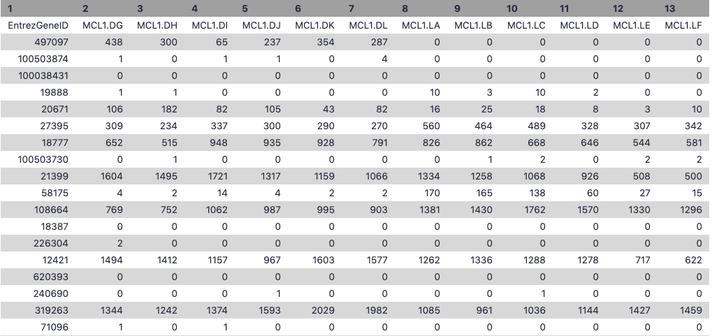

# Introduction


Measuring gene expression on a genome-wide scale has become common practice over the last two decades or so, with microarrays predominantly used pre-2008. With the advent of next generation sequencing technology in 2008, an increasing number of scientists use this technology to measure and understand changes in gene expression in often complex systems. As sequencing costs have decreased, using RNA-Seq to simultaneously measure the expression of tens of thousands of genes for multiple samples has never been easier. The cost of these experiments has now moved from generating the data to storing and analysing it.

There are many steps involved in analysing an RNA-Seq experiment. The analysis begins with sequencing reads (FASTQ files). These are usually aligned to a reference genome, if available. Then the number of reads mapped to each gene can be counted. This results in a table of counts, which is what we perform statistical analyses on to determine differentially expressed genes and pathways. The purpose of this tutorial is to demonstrate how to perform differential expression on count data with **limma-voom**. How to generate counts from reads (FASTQs) is covered in the accompanying tutorial [RNA-seq reads to counts]().

## Mouse mammary gland dataset

The data for this tutorial comes from a Nature Cell Biology paper by . Both the raw data (sequence reads) and processed data (counts) can be downloaded from Gene Expression Omnibus database (GEO) under accession number [GSE60450](http://www.ncbi.nlm.nih.gov/geo/query/acc.cgi?acc=GSE60450).

This study examined the expression profiles of basal and luminal cells in the mammary gland of virgin, pregnant and lactating mice. Six groups are present, with one for each combination of cell type and mouse status. Note that two biological replicates are used here, two independent sorts of cells from the mammary glands of virgin, pregnant or lactating mice, however three replicates is usually recommended as a minimum requirement for RNA-seq. In this tutorial we will use the GEO counts file as a starting point for our analysis. Alternatively, you could create a count matrix from the raw sequence reads, as demonstrated in the [RNA-seq reads to counts tutorial](). The GEO count file was generated from aligning the reads to the mouse `mm10` genome with the Rsubread aligner (), followed by counting reads mapped to RefSeq genes with featureCounts (), see the [Fu paper](https://www.nature.com/articles/ncb3117) for details.

We will use **limma-voom** () for identifying differentially expressed genes here. Other popular alternatives are edgeR () and DESeq2 (). Limma-voom has been shown to be perform well in terms of precision, accuracy and sensitivity () and, due to its speed, it's particularly recommended for large-scale datasets with 100s of samples ().

This is a Galaxy tutorial based on material from the [COMBINE R RNAseq workshop](http://combine-australia.github.io/RNAseq-R/06-rnaseq-day1.html), first taught [in this course](http://combine-australia.github.io/2016-05-11-RNAseq/).


> <agenda-title></agenda-title>
>
> In this tutorial, we will deal with:
>
> 1. TOC
> {:toc}
>
{: .agenda}




# Preparing the inputs

We will use three files for this analysis:

 * **Count matrix** (genes in rows, samples in columns)
 * **Sample information** file (sample id, group)
 * **Gene annotation** file (gene id, symbol, description)

## Import data

> <hands-on-title>Data upload</hands-on-title>
>
> 1. Create a new history for this RNA-seq exercise e.g. `RNA-seq with limma-voom`
>
>    
>
>    
>
> 2. Import the mammary gland counts table and the associated sample information file.
>
>    To import the files, there are two options:
>     - Option 1: From a shared data library if available (`GTN - Material -> {{ page.topic_name }} -> {{ page.title }}`)
>     - Option 2: From [Zenodo](https://zenodo.org/record/4273218)
>
>       
>
>     - You can paste both links below into the **Paste/Fetch** box:
>
>     ```
>     https://zenodo.org/record/4273218/files/countdata.tsv
>     https://zenodo.org/record/4273218/files/factordata.tsv
>     ```
>
> 2. Rename the counts dataset as `countdata` and the sample information dataset as `factordata` using the  (pencil) icon.
> 3. Check that the datatype is `tabular`.
>    If the datatype is not `tabular`, please change the file type to `tabular`.
>
>    
>
{: .hands_on}


Let’s take a look at the data. The `countdata` file contains information about genes (one gene per row), the first column has the Entrez gene id and the remaining columns contain information about the number of reads aligning to the gene in each experimental sample. There are two replicates for each cell type and time point (detailed sample info can be found in file “GSE60450_series_matrix.txt” from the GEO website). The first few rows and columns of the seqdata file are shown below.



The `factordata` file contains basic information about the samples that we will need for the analysis. See below. Note that the sample ids must match exactly with the ids in the counts file.


> <details-title>Formatting the data</details-title>
>
>The files above have been formatted for you. If you are interested to know how they were formatted the information is below.
>
> The original files are available at
>
>     ```
>     https://zenodo.org/record/4273218/files/GSE60450_Lactation-GenewiseCounts.txt
>     https://zenodo.org/record/4273218/files/SampleInfo.txt
>     ```
>
>")
>
>")
>
>To create the file, `countdata`, that contains only the counts for the 12 samples i.e. we'll remove the gene length column with the **Cut columns from a table (cut)** tool. The sample names are also pretty long so we'll use the **>Replace Text in entire line** tool to shorten these to contain only the relevant information about each sample. We will also replace the hyphen in the sample names with a dot so they match the names in the sample information file.
>
>> <hands-on-title>Format the counts data</hands-on-title>
>>
>> 1. **Cut columns from a table (cut)**  with the following parameters:
>>      -  *"File to cut"*: `seqdata`
>>      -  *"Operation"*: `Discard`
>>      -  *"List of fields"*: Select `Column:2`
>> 2. **Replace Text in entire line**  with the following parameters:
>>      -  *"File to process"*: output of **Cut** 
>>      -  *"Find pattern"*: `_B[A-Z0-9_]+`
>> 3. **Replace Text in entire line**  with the following parameters:
>>      -  *"File to process"*: output of **Replace Text** 
>>      -  *"Find pattern"*: `-`
>>      -  *"Replace with"*: `.`
>> 4. Rename file as `countdata` using the  (pencil) icon.
>{: .hands_on}
>
>To create the file, `factordata`, that contains the groups information that we need for the limma-voom tool. We'll combine the cell type and mouse status to make 6 groups e.g. we'll combine the CellType `basal` with the Status `pregnant` for the group `basalpregnant`. We'll use the **Merge Columns** tool to combine the cell type and mouse status columns in the sample information file, making a column with the 6 group names.
>
>> <hands-on-title>Format the sample information file</hands-on-title>
>>
>> 1. **Merge Columns together**  with the following parameters:
>>      -  *"Select data"*: `sampleinfo`
>>      -  *"Merge column"*: `Column: 3`
>>      -  *"with column"*: `Column: 4`
>> 2. **Cut columns from a table (cut)**  with the following parameters:
>>      -  *"File to cut"*: output of **Merge Columns** 
>>      -  *"Operation"*: `Keep`
>>      -  *"List of fields"*: Select `Column:2` and `Column:5`
>> 3. Rename file as `factordata` using the  (pencil) icon.
>{: .hands_on}
{: .details}

## Get gene annotations

Optionally, gene annotations can be provided to the limma-voom tool and if provided the annotation will be available in the output files. We'll get gene symbols and descriptions for these genes using the Galaxy **annotateMyIDs** tool, which provides annotations for human, mouse, fruitfly and zebrafish.

> <hands-on-title>Get gene annotations</hands-on-title>
>
> 1. **annotateMyIDs**  with the following parameters:
>      -  *"File with IDs"*: `countdata`
>      -  *"File has header"*: `Yes`
>      -  *"Organism"*: `Mouse`
>      -  *"ID Type"*: `Entrez`
>      -  "*Output columns"*: tick
>          - `ENTREZID`
>          - `SYMBOL`
>          - `GENENAME`
> 2. Rename file as `annodata` using the  (pencil) icon. The file should look like below.
>    
> 3. Check the number of lines shown on the datasets in the history, there should be 27,180 lines in both. There must be the same number of lines (rows) in the counts and annotation.
{: .hands_on}

# Differential expression with limma-voom

## Filtering to remove lowly expressed genes

It is recommended to filter for lowly expressed genes when running the limma-voom tool. Genes with very low counts across all samples provide little evidence for differential expression and they interfere with some of the statistical approximations that are used later in the pipeline. They also add to the multiple testing burden when estimating false discovery rates, reducing power to detect differentially expressed genes. These genes should be filtered out prior to further analysis.

There are a few ways to filter out lowly expressed genes. When there are biological replicates in each group, in this case we have a sample size of 2 in each group, we favour filtering on a minimum counts-per-million (CPM) threshold present in at least 2 samples. Two represents the smallest sample size for each group in our experiment. In this dataset, we choose to retain genes if they are expressed at a CPM above 0.5 in at least two samples. The CPM threshold selected can be compared to the raw count with the CpmPlots (see below).

> <details-title>More details on filtering</details-title>
>
> The limma tool uses the `cpm` function from the edgeR package () to generate the CPM values which can then be filtered. Note that by converting to CPMs we are normalizing for the different sequencing depths for each sample. A CPM of 0.5 is used as it corresponds to a count of 10-15 for the library sizes in this data set. If the count is any smaller, it is considered to be very low, indicating that the associated gene is not expressed in that sample. A requirement for expression in two or more libraries is used as each group contains two replicates. This ensures that a gene will be retained if it is only expressed in one group. Smaller CPM thresholds are usually appropriate for larger libraries. As a general rule, a good threshold can be chosen by identifying the CPM that corresponds to a count of 10, which in this case is about 0.5. You should filter with CPMs rather than filtering on the counts directly, as the latter does not account for differences in library sizes between samples.
{: .details}

## Normalization for composition bias

In an RNA-seq analysis, the counts are normalized for different sequencing depths between samples. Normalizing to eliminate composition biases between samples is also typically performed. Composition biases can occur, for example, if there are a few highly expressed genes dominating in some samples, leading to less reads from other genes. By default, TMM normalization () is performed by the limma tool using the edgeR `calcNormFactors` function (this can be changed under **Advanced Options**). TMM stands for Trimmed Mean of M values, where a weighted trimmed mean of the log expression ratios is used to scale the counts for the samples. See the figure from the TMM paper below. Note the plot (Figure 1c) that shows how a few highly expressed genes in the liver sample (where the arrow is) results in the majority of other genes in the sample having the appearance of being expressed lower in liver. The mid-line through the points is offset from the expected zero and the TMM normalization factor (red line) scales the counts to adjust for this.

")

## Specify Contrast(s) of interest

Since we are interested in differences between groups, we need to specify which comparisons we want to test. For example, if we are interested in knowing which genes are differentially expressed between the pregnant and lactating group in the basal cells we specify `basalpregnant-basallactate` for the *Contrast of Interest*. Note that the group names in the contrast must exactly match the names of the groups in the `factordata` file. More than one contrast can be specified using the `Insert Contrast` button, so we could look at more comparisons of the groups here, but first we'll take a look at `basalpregnant-basallactate`.

> <hands-on-title>Differential expression with limma-voom</hands-on-title>
>
> 1. **limma**  with the following parameters:
>      -  *"Differential Expression Method"*: `limma-voom`
>      -  *"Count Files or Matrix?*": `Single Count Matrix`
>          -  *"Count Matrix"*: Select `countdata`
>      -  *"Input factor information from file?"*: `Yes`
>          -  *"Factor File"*: Select `factordata`
>      -  *"Use Gene Annotations?"*: `Yes`
>          -  *"Factor File"*: Select `annodata`
>      -  *"Contrast of Interest"*: `basalpregnant-basallactate`
>      -  *"Filter lowly expressed genes?"*: `Yes`
>          -  *"Filter on CPM or Count values?"*: `CPM`
>          -  *"Minimum CPM"*: `0.5`
>          -  *"Minimum Samples"*: `2`
> 2. Inspect the `Report` produced by clicking on the  (eye) icon
{: .hands_on}


> <tip-title>Multiple factors</tip-title>
>
> If we need to account for additional sources of variation, for example, batch, sex, genotype etc, we can input that information as additional factors. For example, if we were interested in the genes differentially expressed between the luminal and basal cell types, we could include an additional column to account for the variation due to the different stages.
> 
>
{: .tip}


# QC of count data

Before we check out the differentially expressed genes, we can look at the `Report` information to check that the data is good quality and that the samples are as we would expect.

## Multidimensional scaling plot

By far, one of the most important plots we make when we analyse RNA-Seq data are MDS plots. An MDS plot is a visualisation of a principal components analysis, which determines the greatest sources of variation in the data. A principal components analysis is an example of an unsupervised analysis, where we don’t need to specify the groups. If your experiment is well controlled and has worked well, what we hope to see is that the greatest sources of variation in the data are the treatments/groups we are interested in. It is also an incredibly useful tool for quality control and checking for outliers. This Galaxy limma tool outputs an MDS plot by default in the `Report` and a link is also provided to a PDF version (`MDSPlot_CellTypeStatus.pdf`). A scree plot is also produced that shows how much variation is attributed to each dimension. If there was a batch effect for example, you may see high values for additional dimensions, and you may choose to include batch as an additional factor in the differential expression analysis. The limma tool plots the first two dimensions by default (1 vs 2), however you can also plot additional dimensions 2 vs 3 and 3 vs 4 using under **Output Options** *Additional Plots* `MDS Extra`. These are displayed in the `Report` along with a link to a PDF version (MDSPlot_extra.pdf). Selecting the `Glimma Interactive Plots` will generate an interactive version of the MDS plot, see the plots section of the report below. If outlier samples are detected you may decide to remove them. Alternatively, you could downweight them by choosing the option in the limma tool *Apply voom with sample quality weights?*. The voom sample quality weighting is described in the paper *Why weight? Modelling sample and observational level variability improves power in RNA-seq analyses ()*.


Take a look at the MDS plot coloured by group.

> <question-title></question-title>
>
> Do you notice anything about the samples in this plot?
>
>    > <solution-title></solution-title>
>    >
>    > Two samples don't appear to be in the right place.
>    >
>    {: .solution}
{: .question}

It turns out that there has been a mix-up with two samples, they have been mislabelled in the sample information file. This shows how the MDS plot can also be useful to help identify if sample mix-ups may have occurred. We need to redo the limma-voom analysis with the correct sample information.

> <hands-on-title>Use the Rerun button to redo steps</hands-on-title>
>
> 1. Import the correct sample information file from `https://zenodo.org/record/4273218/files/factordata_fixed.tsv` and name as `factordata_fixed`
> 2. Use the **Rerun**  button in the History to run **limma**  as before with the `factordata_fixed` file and adding the following parameters:
>      - **Output Options**
>          -  *"Additional Plots"* tick:
>              - `Glimma Interactive Plots`
>              - `Density Plots (if filtering)`
>              - `CpmsVsCounts Plots (if filtering on cpms)`
>              - `Box Plots (if normalising)`
>              - `MDS Extra (Dims 2vs3 and 3vs4)`
>              - `MD Plots for individual samples`
>              - `Heatmaps (top DE genes)`
>              - `Stripcharts (top DE genes)`
> 3. Delete the incorrect `factordata` file and its limma outputs to avoid any confusion.
{: .hands_on}

In the `Report` you should then see the correct MDS plot as below.

")


> <question-title></question-title>
>
> What is the greatest source of variation in the data (i.e. what does dimension 1 represent)?
> What is the second greatest source of variation in the data?
>
>    > <solution-title></solution-title>
>    >
>    > Dimension 1 represents the variation due to cell type, basal vs luminal. Dimension 2 represents the variation due to the stages, virgin, pregnant or lactating.
>    >
>    {: .solution}
{: .question}

Next, scroll down the `Report` to take a look at the **Additional information** and **Summary of experimental data** sections near the bottom. It should look similar to below. Here you can check that the correct samples have been assigned to the correct groups, what settings were used (e.g. filters, normalization method) and also how many genes were filtered out due to low expression.

{: width="600px"}

> <question-title></question-title>
>
> How many genes have been filtered out for low expression?
>
>    > <solution-title></solution-title>
>    >
>    > 11375 genes were filtered out as insignificant as they were without more than 0.5 CPM in at least 2 samples.
>    >
>    {: .solution}
{: .question}


## Density plots

Density plots can be output in the `Report` if *Filter lowly expressed genes* is selected. A link is also provided in the `Report` to a PDF version (`DensityPlots.pdf`). These plots allow comparison of the counts distributions before and after filtering. The samples are coloured by the groups. Count data is not normally distributed, so if we want to examine the distributions of the raw counts we need to log the counts. We typically check the distribution of the read counts on the log2 scale. A CPM value of 1 is equivalent to a log-CPM value of 0 and the CPM we used of 0.5 is equivalent to a log-CPM of -1. It can be seen in the Raw counts (before filtering) plot below, that a large proportion of genes within each sample are not expressed or lowly-expressed, and the Filtered counts plot shows our filter of CPM of 0.5 (in at least 2 samples) removes a lot of these uninformative genes.


The `Report` provides links to PDFs of all plots shown in the `Report` and also to the rest of the additional plots selected to be output.


> <details-title>Cpm plots</details-title>
>
>We can also have a look more closely to see whether our threshold of 0.5 CPM does indeed correspond to a count of about 10-15 reads in each sample with the plots of CPM versus raw counts.
>
>Click on the `CpmPlots.pdf` link in the `Report`. You should see 12 plots, one for each sample. Two of the plots are shown below. From these plots we can see that 0.5 CPM is equivalent to ~10 counts in each of the 12 samples, so 0.5 seems to be an appropriate threshold for this dataset (these samples all have sequencing depth of 20-30 million, see the `Library information` file below, so a CPM value of 0.5 would be ~10 counts).
>
>
>
>> <comment-title>Thresholds</comment-title>
>>
>> * A threshold of 1 CPM in at least minimum group sample size is a good rule of thumb for samples with about 10 million reads. For larger library sizes increase the CPM theshold and for smaller library sizes decrease it. Check the CpmPlots to see if the selected threshold looks appropriate for the samples (equivalent to ~10 reads).
>>
>{: .comment}
{: .details}


## Box plots

We can also use box plots to check the distributions of counts in the samples. Box plots can be selected to be output by the Galaxy limma-voom tool if normalization is applied (TMM is applied by default). The plots are output in the `Report` and a link is also provided to a PDF version (`BoxPlots.pdf`). The samples are coloured by the groups. With the box plots for these samples we can see that overall the distributions are not identical but still not very different. If a sample is really far above or below the blue horizontal line we may need to investigate that sample further.


> <question-title></question-title>
>
> Compare the box plots before and after TMM normalisation. Can you see any differences?
>
>    > <solution-title></solution-title>
>    >
>    > After the normalization more of the samples are closer to the median horizontal line.
>    >
>    {: .solution}
{: .question}


> <details-title>Normalization factors</details-title>
>
>The TMM normalization generates normalization factors, where the product of these factors and the library sizes defines the effective library size. TMM normalization (and most scaling normalization methods) scale relative to one sample. The normalization factors multiply to unity across all libraries. A normalization factor below one indicates that the library size will be scaled down, as there is more suppression (i.e., composition bias) in that library relative to the other libraries. This is also equivalent to scaling the counts upwards in that sample. Conversely, a factor above one scales up the library size and is equivalent to downscaling the counts. We can see the normalization factors for these samples in the `Library information` file if we select to output it with *"Output Library information file?"*: `Yes`. Click on the  (eye) icon to view.
>
>
>
>> <question-title></question-title>
>>
>> Which sample has the largest normalization factor? Which sample has the smallest?
>>
>>    > <solution-title></solution-title>
>>    >
>>    > MCL1.LA has the largest normalization factor and MCL1.LE the smallest.
>>    >
>>    {: .solution}
>{: .question}
{: .details}

> <details-title>MD plots for samples</details-title>
>
>It is considered good practice to make mean-difference (MD) plots for all the samples as a quality check, as described in this [edgeR workflow article](https://f1000research.com/articles/5-1438/v2). These plots allow expression profiles of individual samples to be explored more closely. An MD plot shows the log-fold change between a sample against the average expression across all the other samples. This visualisation can help you see if there are genes highly upregulated or downregulated in a sample. If we look at mean difference plots for these samples, we should be able to see the composition bias problem. The mean-difference plots show average expression (mean: x-axis) against log-fold-changes (difference: y-axis).
>
>Click on the `MDPlots_Samples.pdf` link in the `Report`. You should see 12 MD plots, one for each sample. Let's take a look at the plots for the two samples MCL1.LA and MCL1.LE that had the largest and smallest normalization factors. The MD plots on the left below show the counts normalized for library size and the plots on the right show the counts after the TMM normalization has been applied. MCL1.LA had the largest normalization factor and was above the median line in the unnormalized by TMM box plots. MCL1.LE had the smallest normalization factor and was below the median line in the box plots. These MD plots help show the composition bias problem has been addressed.
>
>
{: .details}

## Voom variance plot

This plot is generated by the voom method and displayed in the `Report` along with a link to a PDF version (`VoomPlot.pdf`). Each dot represents a gene and it shows the mean-variance relationship of the genes in the dataset. This plot can help show if low counts have been filtered adequately and if there is a lot of variation in the data, as shown in the **More details on Voom variance plots** box below.


The SA plot below plots log2 residual standard deviations against mean log-CPM values. The average log2 residual standard deviation is marked by a horizontal blue line. This plot shows how the dependence between the means and variances has been removed after the voom weights are applied to the data.


> <details-title>More details on Voom variance plots</details-title>
>
> If we didn't filter this dataset for the lowly expressed genes the variance plot would look like below.
>
>   
>
> If we look at the plot generated with the two samples mixed up we can see there's more variation.
>
>   
>
> More examples of the variation this plot can show can be seen in Figure 1 from the limma-voom paper (), shown below.
>
>   
>
>   *Figure 1: Mean-variance relationships. Gene-wise means and variances of RNA-seq data are represented by black points with a LOWESS trend. Plots are ordered by increasing levels of biological variation in datasets. (a) voom trend for HBRR and UHRR genes for Samples A, B, C and D of the SEQC project; technical variation only. (b) C57BL/6J and DBA mouse experiment; low-level biological variation. (c) Simulation study in the presence of 100 upregulating genes and 100 downregulating genes; moderate-level biological variation. (d) Nigerian lymphoblastoid cell lines; high-level biological variation. (e) Drosophila melanogaster embryonic developmental stages; very high biological variation due to systematic differences between samples. (f) LOWESS voom trends for datasets (a)–(e). HBRR, Ambion’s Human Brain Reference RNA; LOWESS, locally weighted regression; UHRR, Stratagene’s Universal Human Reference RNA*.
{: .details}

## MD and Volcano plots for DE results

Genome-wide plots that are useful for checking differentially expressed (DE) results are MD plots (or MA plots) and Volcano plots. There are functions in limma for generating these plots and they are used by this tool. These plots are output by default and shown in the `Report` along with a link to PDF versions (`MDPlot_basalpregnant-basallactate.pdf` and `VolcanoPlot_basalpregnant-basallactate.pdf`). In the volcano plot the top genes (by adjusted p-value) are highlighted. The number of top genes is 10 by default and the user can specify the number of top genes to view (up to 100) under **Advanced Options**. For further information on volcano plots see the [Volcano Plot tutorial]({{ site.baseurl }}/topics/transcriptomics/tutorials/rna-seq-viz-with-volcanoplot/tutorial.html)


The MD Plot highlighted genes are significant at an adjusted p-value (adj.P) threshold of 0.05 and exhibit log2-fold-change (lfc) of at least 0. These thresholds can be changed under **Advanced Options**.


> <question-title></question-title>
>
> How many genes are differentially expressed at the default thresholds of adj.P=0.05 and lfc=0?
>
>    > <solution-title></solution-title>
>    >
>    > The number of DE genes at these adj.P and lfc thresholds is shown in the table in the `Report` as below.
>    >
>    > {: width="500px"}
>    >
>    {: .solution}
{: .question}


> <comment-title>on adjusted P value</comment-title>
>
> **A note about deciding how many genes are significant**: In order to decide which genes are differentially expressed, we usually take a cut-off (e.g. 0.05 or 0.01) on the adjusted p-value, NOT the raw p-value. This is because we are testing many genes (more than 15000 genes here), and the chances of finding differentially expressed genes is very high when you do that many tests. Hence we need to control the false discovery rate, which is the adjusted p-value column in the results table. What this means is that, if we choose an adjusted p-value cut-off of 0.05, and if 100 genes are significant at a 5% false discovery rate, we are willing to accept that 5 will be false positives.
{: .comment}

# Testing relative to a threshold (TREAT)

When there is a lot of differential expression, sometimes we may want to cut-off on a fold change threshold, as well as a p-value threshold, so that we follow up on the most biologically significant genes. However, it is not recommended to simply rank by p-value and then discard genes with small logFC’s, as this has been shown to increase the false discovery rate. In other words, you are not controlling the false discovery rate at 5% any more. There is a function called `treat` in limma that performs this style of analysis correctly (). TREAT will simply take a user-specified log fold change cut-off and recalculate the moderated t-statistics and p-values with the new information about logFC. There are thousands of genes differentially expressed in this `basalpregnant-basallactate` comparison, so let's rerun the analysis applying TREAT and similar thresholds to what was used in the Fu paper: an adjusted P value of 0.01 (1% false discovery rate) and a log-fold-change cutoff of 0.58 (equivalent to a fold change of 1.5).

> <hands-on-title>Testing relative to a threshold (TREAT)</hands-on-title>
>
> 1. Use the **Rerun**  button in the History to rerun **limma**  with the following parameters:
>      - *"**Advanced Options**"*
>          -  *"Minimum Log2 Fold Change"*: `0.58`
>          -  *"P-Value Adjusted Threshold"*: `0.01`
>          -  *"Test significance relative to a fold-change threshold (TREAT)"*: `Yes`
> 2. Add a tag `#treat` to the `Report` output and inspect the report
>
> 
>
{: .hands_on}

We can see that much fewer genes are now highlighted in the MD plot and identified as differentially expressed.


# Visualising results

In addition to the plots already discussed, it is recommended to have a look at the expression levels of the individual samples for the genes of interest, before following up on the DE genes with further lab work. The Galaxy limma tool can auto-generate heatmaps of the top genes to show the expression levels across the *samples*. This enables a quick view of the expression of the top differentially expressed genes and can help show if expression is consistent amongst replicates in the groups.

## Heatmap of top genes

Click on the `Heatmap_basalpregnant-basallactate.pdf` link in the `Report`. You should see a plot like below.


## Stripcharts of top genes

The limma-voom tool can also auto-generate stripcharts to view the expression of the top genes across the groups. Click on the `Stripcharts_basalpregnant-basallactate.pdf` link in the `Report`. You should see 10 plots, one for each top gene. Four are shown below. Note that here you can see if replicates tend to group together and how the expression compares to the other groups.


## Interactive DE plots (Glimma)

Interactive versions of the MD and Volcano plots can be output by the limma-voom tool via the Glimma package (), if a gene annotation file is provided and `Glimma Interactive Plots` is selected. Links to the Glimma html pages are generated in the `Report`.

Let's take a look at the interactive MD plot. Click on the `Glimma_MDPlot_basalpregnant-basallactate.html` link in the `Report`. You should see a two-panel interactive MD plot like below. The left plot shows the log-fold-change vs average expression. The right plot shows the expression levels of a particular gene of each sample by groups (similar to the stripcharts). Hovering over points on left plot will plot expression level for corresponding gene, clicking on points will fix the expression plot to gene. Clicking on rows on the table has the same effect as clicking on the corresponding gene in the plot.

<iframe src="../../images/rna-seq-counts-to-genes/glimma/MD-Plot.html" width="100%" height="1000"></iframe>

> <hands-on-title>Search for a gene of interest</hands-on-title>
>
> `Egf` was a gene identifed as very highly expressed in the Fu paper and confirmed with qRT-PCR, see Fig. 6c from the paper below.
> 
>
> Search for `Egf` in the Glimma interactive table. You should see something similar to below.
>
> 
>
>  Notice that in the plot on the right above, showing `Egf` expression for all samples, we can see it is highly expressed in the luminal lactate group but not the other samples.
{: .hands_on}

Multiple contrasts can be run with the limma tool. For example, we can compare the pregnant and lactating conditions for both the basal and luminal cells. So let's rerun the limma-voom TREAT analysis (adj.P <0.01 and lfc=0.58) and this time use the `Insert Contrast` button to include the additional contrast `luminalpregnant - luminallactate`. We can then see how the number of differentially expressed genes in the luminal cells compares to the basal cells.

> <hands-on-title>Run multiple contrasts</hands-on-title>
>
> 1. Use the **Rerun**  button in the History to rerun the **limma**  `#treat` analysis adding the following parameters *(i.e. run with 2 contrasts)*:
>      -  *"Contrast of Interest"*: `basalpregnant-basallactate`
>      -  *"Contrast of Interest"*: `luminalpregnant-luminallactate`
> 2. Add a tag `#multiple-contrasts` to the `Report` output and inspect the report
>
>   You should find that there are more genes differentially expressed for the luminal cells than the basal. There are ~274 genes DE in basal cells versus ~ 1610 in the luminal cells.
> 
>
>   This is similar to what Fu et al found, many more genes differentially expressed in the luminal cells on lactation, compared to the basal cells.
> 
{: .hands_on}

The tables of differentially expressed genes are output as links in the `Report` (`limma-voom_basalpregnant-basallactate.tsv` and `limma-voom_luminalpregnant-luminallactate.tsv`), see below, and also as datasets in the history (`DE tables`). With multiple contrasts, a plot for each contrast is generated for relevant plots, as shown below. This enables a quick and easy visual comparison of the contrasts.


> <details-title>R code in detail</details-title>
>
> 1. The `Report` with all the plots and tables can be downloaded by clicking on the floppy disk icon on the dataset in the history.
> 2. If you want to see the R code used, or to explore some of the outputs in R, you can select to output the Rscript and/or RData files in the tool form.
{: .details}

To see some methods for identifying differentially expressed pathways in this dataset, see the follow-on tutorial [RNA-seq genes to pathways](). To see how to create a heatmap of custom genes using this dataset, see the tutorial [Visualization of RNA-Seq results with heatmap2]()

# Conclusion


In this tutorial we have seen how counts files can be converted into differentially expressed genes with limma-voom. This follows on from the accompanying tutorial, [RNA-seq reads to counts](), that showed how to generate counts from the raw reads (FASTQs) for this dataset. In this part we have seen ways to visualise the count data, and QC checks that can be performed to help assess the quality and results. We have also reproduced results similar to what the authors found in the original paper with this dataset. For further reading on analysis of RNA-seq count data and the methods used here, see the articles; *RNA-seq analysis is easy as 1-2-3 with limma, Glimma and edgeR ()*  and *From reads to genes to pathways: differential expression analysis of RNA-Seq experiments using Rsubread and the edgeR quasi-likelihood pipeline ()*.
