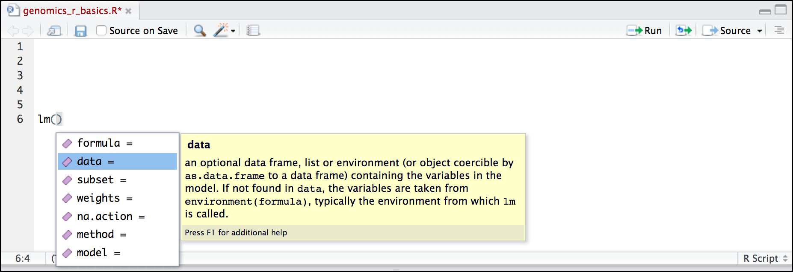
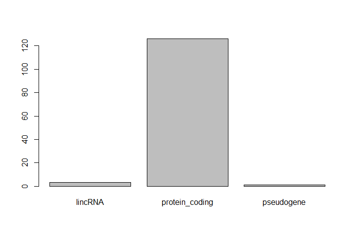
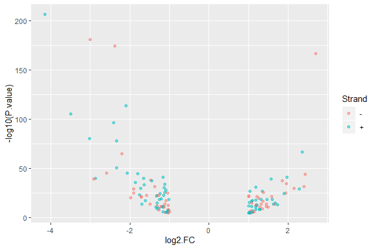

# Introduction
{:.no_toc}

**This tutorial is significantly based on [the Carpentries](https://carpentries.org) ["Intro to R and RStudio for Genomics"](https://carpentrieslab.github.io/genomics-r-intro/) lesson**

R is one of the most widely-used and powerful programming languages in bioinformatics. R especially shines where a variety of statistical tools are required (e.g. RNA-Seq, population genomics, etc.) and in the generation of publication-quality graphs and figures. Rather than get into an R vs. Python debate (both are useful), keep in mind that many of the concepts you will learn apply to Python and other programming languages.

## A Brief History of R
{:.no_toc}

[R](https://en.wikipedia.org/wiki/R_(programming_language)) has been around since 1995, and was created by Ross Ihaka and Robert Gentleman at the University of Auckland, New Zealand. R is based off the S programming language developed at Bell Labs and was developed to teach intro statistics. See this [slide deck](https://www.stat.auckland.ac.nz/~ihaka/downloads/Massey.pdf) by Ross Ihaka for more info on the subject.

## Advantages of using R
{:.no_toc}

At more than 20 years old, R is fairly mature and [growing in popularity](https://www.tiobe.com/tiobe-index/r/). However, programming isn’t a popularity contest. Here are key advantages of analyzing data in R:

 - **R is [open source](https://en.wikipedia.org/wiki/Open-source_software)**

    This means R is free - an advantage if you are at an institution where you have to pay for your own MATLAB or SAS license. Open source, is important to your colleagues in parts of the world where expensive software in inaccessible. It also means that R is actively developed by a community (see [r-project.org](https://www.r-project.org/)), and there are regular updates.

 - **R is widely used**

    Ok, maybe programming is a popularity contest. Because, R is used in many areas (not just bioinformatics), you are more likely to find help online when you need it. Chances are, almost any error message you run into, someone else has already experienced.

- **R is powerful**

    R runs on multiple platforms (Windows/MacOS/Linux). It can work with much larger datasets than popular spreadsheet programs like Microsoft Excel, and because of its scripting capabilities is far more reproducible. Also, there are thousands of available software packages for science, including genomics and other areas of life science.

> ### Agenda
>
> In this tutorial, we will cover:
>
> 1. TOC
> {:toc}
>
{: .agenda}

# Introducing RStudio IDE

In this section we will take you through the very first things you need to get R working.

In these lessons, we will be making use of a software called [RStudio](https://www.rstudio.com/products/RStudio/), an [Integrated Development Environment (IDE)](https://en.wikipedia.org/wiki/Integrated_development_environment). RStudio, like most IDEs, provides a graphical interface to R, making it more user-friendly, and providing dozens of useful features. We will introduce additional benefits of using RStudio as you cover the lessons. In this case, we are specifically using [RStudio Server](https://www.rstudio.com/products/RStudio/#Server), a version of RStudio that can be accessed in your web browser. RStudio Server has the same features of the Desktop version of RStudio you could download as standalone software.

## Opening up RStudio


***TODO***: *Description on how to open RStudio on Galaxy*

You should now be looking at a page with the RStudio interface:


## Creating your first R script

Now that we are ready to start exploring R, we will want to keep a record of the commands we are using. To do this we can create an R script.

> ###  Hands-on: Create a R script
>
> 1. Click the **File** menu
> 2. Select **New File**
> 3. Click on **R Script**
{: .hands_on}

Before we go any further, you should save your script.

> ###  Hands-on: Save a R script
>
> 1. Click the Save/Disk icon in the bar above the first line in the script editor
>
>    Alternatively, you can also:
>    - Click the **File** menu and select **Save**
>    - Type <kbd>CTRL</kbd>+<kbd>S</kbd> (<kbd>CMD</kbd>+<kbd>S</kbd>)
>
> 2. In the **Save File** window that opens, name your file `genomics_r_basics`
{: .hands_on}

The new script `genomics_r_basics.R` should appear under **Files** in the output panel.

By convention, R scripts end with the file extension `.R`.

## Overview and customization of the RStudio layout

Here are the major windows (or panels) of the RStudio environment:


- **Source**: This panel is where you will write/view R scripts

    Some outputs (such as if you view a dataset using `View()`) will appear as a tab here.

- **Console/Terminal**: This is actually where you see the execution of commands

    This is the same display you would see if you were using R at the command line without RStudio. You can work interactively (i.e. enter R commands here), but for the most part we will run a script (or lines in a script) in the source pane and watch their execution and output here.

- **Environment/History**: RStudio will show here you what datasets and objects (variables) you have created and which are defined in memory.

    You can also see some properties of objects/datasets such as their type and dimensions. The **History** tab contains a history of the R commands you've executed R.

- **Files/Plots/Packages/Help**: This multipurpose panel will show you the contents of directories on your computer

    - **Files**: You can also use this tab to navigate and set the working directory
    - **Plots**: This tab will show the output of any plots generated
    - **Package**: In this tab you will see what packages are actively loaded, or you can attach installed packages
    - **Help**: It will display help files for R functions and packages.


All of the panels in RStudio have configuration options. For example, you can minimize/maximize a panel, or by moving your mouse in the space between panels you can resize as needed. The most important customization options for panel layout are in the **View** menu. Other options such as font sizes, colors/themes, and more are in the **Tools** menu under **Global Options**.

> ###  Working with R at the terminal
> Although we won't be working with R at the terminal, there are lots of reasons
> to.
>
> For example, once you have written an RScript, you can run it at any Linux
> or Windows terminal without the need to start up RStudio. We don't want
> you to get confused - RStudio runs R, but R is not RStudio.
>
> For more on
> running an R Script at the terminal see this [Software Carpentry lesson](https://swcarpentry.github.io/r-novice-inflammation/05-cmdline/).
{: .comment}

## How to call functions in R, without needing to master them?

A function in R (or any computing language) is a short program that takes some input and returns some output.

> ###  Hands-on: Calling a function in R
>
> 1. Type `date()` in the **Console** panel
> 2. Type <kbd>Enter</kbd>
> 2. Check what is displayed in the **Console** panel
>
{: .hands_on}

You should obtain something like:

```R
[1] "Tue Mar 26 15:12:24 2019"
```

> ###  Display of function call in the tutorial
> Now in the tutorial, we will display the function call like this:
>
> ```R
> > date()
> [1] "Tue Mar 26 15:12:24 2019"
> ```
{: .comment}

The other way to execute these functions is to use the script we just created and then keep track of the functions.

> ###  Hands-on: Running a function via a script
>
> 1. Type `date()` in the **Script** panel
> 2. Click on the **Run the current line or selection** or type <kbd>CTRL</kbd>+<kbd>Enter</kbd> (or <kbd>CMD</kbd>+<kbd>Enter</kbd>)
{: .hands_on}

You should see in the **Console** panel the same as when we run the function directly via the console.

We would like now to keep information about this function

> ###  Hands-on: Comment in a script
>
> 1. Write on the line before `date()` a comment:
>
>    ```R
>    # Gives the current date
>    ```
>
> 2. Select both lines
> 3. Execute them
> 4. Check that the output
{: .hands_on}

The comment line is displayed in the console but not executed.

> ###  What do these functions do?
>
> Try the following functions by writing them in your script. See if you can
> guess what they do, and make sure to add comments to your script about your
> assumed purpose.
> 1. `dir()`
> 2. `sessionInfo()`
> 3. `Sys.time()`
>
> > ###  Solution
> >
> > 1. `dir()` lists files in the working directory
> > 2. `sessionInfo()` gives the version of R and additional info including on attached packages
> > 3. `Sys.time()` gives the current time
> >
> > *Notice*: Commands are case sensitive!
> >
> {: .solution}
{: .question}

> ###  Commands are case sensitive!
> In R, the commands are case sensitive. So be careful when you type them.
{: .warning}

You have hopefully noticed a pattern - an R function has three key properties:
- Functions have a name (e.g. `dir`, `getwd`); note that functions are case   sensitive!
- Following the name, functions have a pair of `()`
- Inside the parentheses, a function may take 0 or more arguments

An argument may be a specific input for your function and/or may modify the function's behavior. For example the function `round()` will round a number with a decimal:

```R
# This will round a number to the nearest integer
> round(3.14)
[1] 3
```

## Getting help

What if you wanted to round to one significant digit, `round()` can do this, but you may first need to read the help to find out how.

> ###  Hands-on: Get help
>
> 1. Add a `?` in front of the function name to see the help
>
>    ```R
>    > ?round()
>    ```
>
> 2. Check the **Help** tab
>
{: .hands_on}

To see the help (in R sometimes also called a "vignette") enter a `?` in front of the function name:

The **Help** tab will show you information. In R, this help sometimes also called a "vignette". Often there is too much information. You will slowly learn how to read and make sense of help files.

1. Checking the **Usage** or **Examples** headings is often a good place to look first
2. Under **Arguments**, we can also see what arguments we can pass to this function to modify its behavior

> ###  Hands-on: Get the function arguments
>
> 1. Type `args()` to see a function's argument
>
>    ```R
>    > args(round)
>    function (x, digits = 0)
>    NULL
>    ```
>
{: .hands_on}

`round()` takes two arguments:

1. `x`: the number to be rounded
2. `digits`

    The `=` sign indicates that a default (in this case 0) is already set.

Since `x` is not set, `round()` requires we provide it, in contrast to `digits` where R will use the default value 0 unless you explicitly provide a different value.

We can explicitly set the digits parameter when we call the function.

> ###  Hands-on: Call a function with several parameters
>
> 1. Call `round` with 2 arguments
>    - *x*: `3.14159`
>    - *digits*: `2`
>
>    ```R
>    > round(3.14159, digits = 2)
>    [1] 3.14
>    ```
>
> 2. Call `round` with 2 arguments
>    1. 3.14159
>    2. 2
>
>    ```R
>    > round(3.14159, 2)
>    [1] 3.14
>    ```
{: .hands_on}

R accepts what we call "positional arguments". If you pass a function arguments separated by commas, R assumes that they are in the order you saw when we used `args()`. In the case below that means that `x` is 3.14159 and `digits` is 2.

Finally, what if you are using `?` to get help for a function in a package not installed on your system, such as when you are running a script which has dependencies?

> ###  Hands-on: Get help for a missing function
>
> 1. Ask help for `?geom_point()`
> 2. Check the generated error
>
>
>    ```R
>    > ?geom_point()
>    Error in .helpForCall(topicExpr, parent.frame()) :
>      no methods for ‘geom_point’ and no documentation for it as a function
>    ```
>
> 3. Type `??geom_point()`
> 4. Check the **Help** tab
{: .hands_on}

Using the two question marks (here `??geom_point()`), R returns results from a search of the documentation for packages you have installed on your computer in the **Help** tab.

Finally, if you think there should be a function, for example a statistical test, but you aren't sure what it is called in R, or what functions may be available.

> ###  Hands-on: Search for a function
>
> 1. Type `help.search('chi-Squared test')`
> 2. Check the **Help** panel
{: .hands_on}

A list of potential interesting function related to "chi-Squared test" are listed. You can click on one of them to see the help of it. Remember to put your search query in quotes inside the function's parentheses.

> ###  Search for R functions
>
> Search the R functions for the following statistical
> functions
>
> 1. Student-t test
> 2. mixed linear model
>
> > ###  Solution
> >
> > While your search results may return several tests, we list a few you might
> > find:
> > 1. Student-t test: `stats::TDist`
> > 2. mixed linear model: `stats::lm.glm`
> >
> {: .solution}
{: .question}

We will discuss more on where to look for the libraries and packages that contain functions you want to use. For now, be aware that two important ones are:
1. [CRAN](https://cran.r-project.org/): the main repository for R
2. [Bioconductor](http://bioconductor.org/): a popular repository for bioinformatics-related R packages

## RStudio contextual help

Here is one last bonus we will mention about RStudio. It's difficult to remember all of the arguments and definitions associated with a given function.

> ###  Hands-on: Search for a function
>
> 1. Type `lm` in the **Script** panel
> 2. Hit <kbd>Tab</kbd>
>
>    RStudio displays functions and associated help
>
>    
>
> 3. Select `lm` function using the arrows
> 4. Hit <kbd>Enter</kbd>
> 4. Hit <kbd>Tab</kbd> again inside the parantheses
>
>    RStudio the function's arguments and provide additional help for each of these arguments:
>
>    
>
{: .hands_on}

# R Basics

Before we begin this lesson, we want you to be clear on the goal of the workshop and these lessons. We believe that every learner can **achieve competency with R**. You have reached competency when you find that you are able to **use R to handle common analysis challenges in a reasonable amount of time** (which includes time needed to look at learning materials, search for answers online, and ask colleagues for help). As you spend more time using R (there is no substitute for regular use and practice) you will find yourself gaining competency and even expertise. The more familiar you get, the more complex the analyses you will be able to carry out, with less frustration, and in less time - the fantastic world of R awaits you!

Nobody wants to learn how to use R. People want to learn how to use R to analyze their own research questions! Ok, maybe some folks learn R for R's sake, but these lessons assume that you want to start analyzing genomic data as soon as possible. Given this, there are many valuable pieces of information about R that we simply won't have time to cover. Hopefully, we will clear the hurdle of giving you just enough knowledge to be dangerous, which can be a high bar in R! We suggest you look into the additional learning materials in the box below.

> ###  Some R skills we will *not* cover in these lessons
>
> - How to create and work with R matrices and R lists
> - How to create and work with loops and conditional statements, and the "apply" of functions (which are super useful, read more [here](https://www.r-bloggers.com/r-tutorial-on-the-apply-family-of-functions/))
> - How to do basic string manipulations (e.g. finding patterns in text using grep, replacing text)
> - How to plot using the default R graphic tools (we *will* cover plot creation, but will do so using the popular plotting package `ggplot2`)
> - How to use advanced R statistical functions
>
> > ###  Tip: Where to learn more
> >
> > The following are good resources for learning more about R. Some of them can be quite technical, but if you are a regular R user you may ultimately need this technical knowledge.
> > - [R for Beginners](https://cran.r-project.org/doc/contrib/Paradis-rdebuts_en.pdf), by Emmanuel Paradis: a great starting point
> > - [The R Manuals](https://cran.r-project.org/manuals.html), by the R project people
> > - [R contributed documentation](https://cran.r-project.org/other-docs.html), also linked to the R project, with materials available in several languages
> > - [R for Data Science](http://r4ds.had.co.nz/): a wonderful collection by noted R educators and developers Garrett Grolemund and Hadley Wickham
> > - [Practical Data Science for Stats](https://peerj.com/collections/50-practicaldatascistats/): not exclusively about R usage, but a nice collection of pre-prints on data science and applications for R
> > - [Programming in R Software Carpentry lesson](https://software-carpentry.org/lessons/): several Software Carpentry lessons in R to choose from
> > - [Data Camp Introduction to R](https://www.datacamp.com/courses/free-introduction-to-r): a fun online learning platform for Data Science, including R.
> {: .tip}
{: .comment}

## Creating objects in R

> ###  Reminder
> At this point you should be coding along in the "**genomics_r_basics.R**"
> script we created in the last episode. Writing your commands in the script
> (and commenting it) will make it easier to record what you did and why.
{: .comment}

What might be called a variable in many languages is called an **object** in R.

**To create an object you need:**

- a name (e.g. `a`)
- a value (e.g. `1`)
- the assignment operator (`<-`)

> ###  Hands-on: Create a first object
>
> 1. Assign `1` to the object `a` using the R assignment operator `<-` in your script
> 2. Write a comment in the line above
>
>    ```R
>    # this line creates the object 'a' and assigns it the value '1'
>    > a <- 1
>    ```
>
> 3. Select the lines
> 4. Execute them
>
>    > ###  Tip: Execute from a script
>    > - Click on the **Run the current line or selection**
>    > - Type <kbd>CTRL</kbd>+<kbd>Enter</kbd> (or <kbd>CMD</kbd>+<kbd>Enter</kbd>)
>    {: .tip}
>
> 5. Check the **Console** and **Environment** panels
>
{: .hands_on}

The **Console** displays the lines of code run from the script and any outputs or status/warning/error messages (usually in red).

In the **Environment**, we have now a table:

Values | |
--- | ---
 a | 1

This **Environment** window allows you to keep track of the objects you have created in R.

> ###  Exercise: Create some objects in R
>
> Create the following objects:
>
> 1. Create an object that has the value of number of pairs of human chromosomes
> 2. Create an object that has a value of your favorite gene name
> 3. Create an object that has this URL as its value (`ftp://ftp.ensemblgenomes.org/pub/bacteria/release-39/fasta/bacteria_5_collection/escherichia_coli_b_str_rel606/`)
> 4. Create an object that has the value of the number of chromosomes in a diploid human cell
>
> Give each object an appropriate name (your best guess at what name to use is fine):
>
> > ###  Solution
> >
> > Here as some possible answers to the challenge:
> >
> > 1. `human_chr_number <- 23`
> > 1. `gene_name <- 'pten'`
> > 1. `ensemble_url <- 'ftp://ftp.ensemblgenomes.org/pub/bacteria/release-39/fasta/bacteria_5_collection/escherichia_coli_b_str_rel606/'`
> > 1. `human_diploid_chr_num <-  36`
> >
> {: .solution}
{: .question}


## Naming objects in R

Here are some important details about naming objects in R.

- **Avoid spaces and special characters**

    Object names cannot contain spaces or the minus sign (`-`). You can use `_` to make names more readable. You should avoid using special characters in your object name (e.g. `!`, `@`, `#`, `.` , etc.). Also, object names cannot begin with a number.

- **Use short, easy-to-understand names**

    You should avoid naming your objects using single letters (e.g. `n`, `p`, etc.). This is mostly to encourage you to use names that would make sense to anyone reading your code (a colleague, or even yourself a year from now). Also, avoiding excessively long names will make your code more readable.

- **Avoid commonly used names**

    There are several names that may already have a definition in the R language (e.g. `mean`, `min`, `max`). One clue that a name already has meaning is that if you start typing a name in RStudio and it gets a colored highlight or RStudio gives you a suggested autocompletion you have chosen a name that has a reserved meaning.

- **Use the recommended assignment operator**

    In R, we use `<-` as the preferred assignment operator. `=` works too, but is most commonly used in passing arguments to functions (more on functions later). There is a shortcut for the R assignment operator:
    - Windows execution shortcut: <kbd>Alt</kbd>+<kbd>-</kbd>
    - Mac execution shortcut: <kbd>Option</kbd>+<kbd>-</kbd>

There are a few more suggestions about naming and style you may want to learn more about as you write more R code. There are several "style guides" that have advice, and one to start with is the [tidyverse R style guide](http://style.tidyverse.org/index.html).

> ###  Pay attention to warnings in the script console
>
> If you enter a line of code in your script that contains an error, RStudio may give you an error message and underline this mistake. Sometimes these messages are easy to understand, but often the messages may need some figuring out. Paying attention to these warnings will help you avoid mistakes.
>
> In the example below, the object name has a space, which is not allowed in R. The error message does not say this directly, but R is "not sure" about how to assign the name to `human_ chr_number` when the object name we want is `human_chr_number`.
>
> 
{: .comment}

## Reassigning object names or deleting objects

Once an object has a value, you can change that value by overwriting it. R will not give you a warning or error if you overwriting an object, which may or may not be a good thing depending on how you look at it.

> ###  Hands-on: Overwrite an object
>
> 1. Overwrite the `gene_name` with the `tp53`
>
>    ```R
>    # gene_name has the value 'pten' or whatever value you used in the challenge.
>    # We will now assign the new value 'tp53'
>    > gene_name <- 'tp53'
>    ```
>
> 3. Check the new value in the **Environment** panel
{: .hands_on}

You can also remove an object from R's memory entirely

> ###  Hands-on: Remove an object
>
> 1. Delete the `gene_name` object
>
>    ```R
>    # delete the object 'gene_name'
>    > rm(gene_name)
>    ```
>
> 3. Check that `gene_name` is not displayed in the **Environment** panel
{: .hands_on}

If you run a line of code that has only an object name, R will normally display the contents of that object. In this case, we are told the object no longer exists.

```
Error: object 'gene_name' not found
```

## Understanding object data types (modes)

In R, **every object has two properties**:

- **Length**: how many distinct values are held in that object
- **Mode**: what is the classification (type) of that object.

The **"mode" property** corresponds to the **type of data an object represents**. The most common modes you will encounter in R are:

- **Numeric (num)**: numbers such floating point/decimals (1.0, 0.5, 3.14)

    There are also more specific numeric types (dbl - Double, int - Integer). These differences are not relevant for most beginners and pertain to how these values are stored in memory

- **Character (chr)**: a sequence of letters/numbers in single `''` or double `" "` quotes
- **Logical**: boolean values, `TRUE` or `FALSE`

There are a few other modes (i.e. "complex", "raw" etc.) but these are the three we will work with in this lesson.

Data types are familiar in many programming languages, but also in natural language where we refer to them as the parts of speech, e.g. nouns, verbs, adverbs, etc. Once you know if a word - perhaps an unfamiliar one - is a noun, you can probably guess you can count it and make it plural if there is more than one (e.g. 1 [Tuatara](https://en.wikipedia.org/wiki/Tuatara), or 2 Tuataras). If something is a adjective, you can usually change it into an adverb by adding "-ly" (e.g. [jejune](https://www.merriam-webster.com/dictionary/jejune) vs. jejunely). Depending on the context, you may need to decide if a word is in one category or another (e.g "cut" may be a noun when it's on your finger, or a verb when you are preparing vegetables). These concepts have important analogies when working with R objects.

> ###  Hands-on: Create an object and check its mode
>
> 1. Assign `'chr02'` to a `chromosome_name` object
>
>    ```R
>    > chromosome_name <- 'chr02'
>    ```
>
> 2. Check the mode of the object
>
>    ```R
>    > mode(chromosome_name)
>    ```
>
> 3. Check the result in the console
>
{: .hands_on}

The created object seems to a character object.

> ###  Create objects and check their modes
>
> 1. Create the following objects in R
>    1. `od_600_value` with value `0.47`
>    2. `chr_position` with value `'1001701'`
>    3. `spock` with value `TRUE`
>    4. `pilot` with value `Earhart`
> 2. Guess their mode
> 3. Check them using `mode()`
>
> > ###  Solution
> >
> > 1. Object creation
> >
> >    ```R
> >    > od_600_value <- 0.47
> >    > chr_position <- '1001701'
> >    > spock <- TRUE
> >    > pilot <- Earhart
> >    [1] Error in eval(expr, envir, enclos): object 'Earhart' not found
> >    ```
> >
> >    We cannot take a string of alphanumeric characters (e.g. Earhart) and assign as a value for an object. In this case, R looks for an object named `Earhart` but since there is no object, no assignment can be made.
> >
> > 2. Modes
> >    1. `od_600_value`: numeric
> >    2. `chr_position`: character
> >
> >       If a series of numbers are given as a value R will consider them to be in the "character" mode if they are enclosed as single or double quotes
> >
> >    3. `spock`: logical
> >    4. `pilot`: `Error in mode(pilot): object 'pilot' not found`
> >
> >       If `Earhart` did exist, then the mode of `pilot` would be whatever the mode of `Earhart` was originally.
> >
> {: .solution}
{: .question}

## Mathematical and functional operations on objects

Once an object exists (which by definition also means it has a mode), R can appropriately manipulate that object. For example, objects of the numeric modes can be added, multiplied, divided, etc. R provides several mathematical (arithmetic) operators including:

- `+`: addition
- `-`: subtraction
- `*`: multiplication
- `/`: division
- `^` or `**`: exponentiation
- `a%%b`: modulus (the remainder after division)

> ###  Hands-on: Execute mathematical operations
>
> 1. Execute `(1 + (5 ** 0.5))/2`
>
>    ```R
>    > (1 + (5 ** 0.5))/2
>    [1] 1.618034
>    ```
>
> 2. Multiply the object `human_chr_number` by 2
>
>    ```R
>    > human_chr_number <- 23
>    # multiply the object 'human_chr_number' by 2
>    > human_chr_number * 2
>    [1] 46
>    ```
>
{: .hands_on}

> ###  Exercise: Compute the golden ratio
>
> One approximation of the golden ratio ($$\varphi$$) is
>
> $$\frac{1 + \sqrt{5}}{2}$$
>
> Compute the golden ratio to 3 digits of precision using the `sqrt()` and `round()` functions.
>
> Hint: remember the `round()` function can take 2 arguments.
>
> > ###  Solution
> >
> > ```R
> > > round((1 + sqrt(5))/2, digits = 3)
> > [1] 1.618
> > ```
> >
> > Notice that you can place one function inside of another.
> >
> {: .solution}
{: .question}

## Vectors

Vectors are probably the most used commonly used object type in R. **A vector is a collection of values that are all of the same type (numbers, characters, etc.)**.

One of the most common ways to create a vector is to use the `c()` function - the "concatenate" or "combine" function. Inside the function you may enter one or more values, separated by a comma.

> ###  Hands-on: Create a vector
>
> 1. Create a `snp_genes` object containing "OXTR", "ACTN3", "AR", "OPRM1"
>
>    ```R
>    # Create the SNP gene name vector
>    > snp_genes <- c("OXTR", "ACTN3", "AR", "OPRM1")
>    ```
>
> 2. Check how this object is stored in the **Environment** panel
{: .hands_on}

Vectors always have a **mode** and a **length**. In the **Environment** panel, we could already have an insight on these properties: `chr [1:4]` may indicate character and 4 values. There is 2 functions to check that

> ###  Hands-on: Check vector properties
>
> 1. Check the mode of `snp_genes` object
>
>    ```R
>    # Check the mode of 'snp_genes'
>    > mode(snp_genes)
>    [1] "character"
>    ```
>
> 2. Check the mode of `snp_genes` length
>
>    ```R
>    # Check the mode of 'snp_genes'
>    > length(snp_genes)
>    [1] "4"
>    ```
>
> 3. Check both properties using `str` function
>
>    ```R
>    # Check the structure of 'snp_genes'
>    > str(snp_genes)
>    [1] chr [1:4] "OXTR" "ACTN3" "AR" "OPRM1"
>    ```
{: .hands_on}

The `str()` (structure) function is giving the same information as the **Environmnent** panel.

Vectors are quite important in R. Another data type that we will work with later in this lesson, data frames, are collections of vectors. What we learn here about vectors will pay off even more when we start working with data frames.

### Creating and subsetting vectors

Once we have vectors, one thing we may want to do is specifically retrieve one or more values from our vector. To do so, we use **bracket notation**. We type the name of the vector followed by square brackets. In those square brackets we place the index (e.g. a number) in that bracket.

> ###  Hands-on: Get values from vectors
>
> 1. Create several vectors
>    - `snps` object with 'rs53576', 'rs1815739', 'rs6152', 'rs1799971'
>    - `snp_chromosomes` object with '3', '11', 'X', '6'
>    - `snp_positions` object with 8762685, 66560624, 67545785, 154039662
>
>    ```R
>    # Some interesting human SNPs
>    # while accuracy is important, typos in the data won't hurt you here
>    > snps <- c('rs53576', 'rs1815739', 'rs6152', 'rs1799971')
>    > snp_chromosomes <- c('3', '11', 'X', '6')
>    > snp_positions <- c(8762685, 66560624, 67545785, 154039662)
>    ```
>
> 2. Get the 3rd value in the `snp_genes` vector
>
>    ```R
>    # get the 3rd value in the snp_genes vector
>    > snp_genes[3]
>    [1] "AR"
>    ```
{: .hands_on}

In R, every item your vector is indexed, starting from the first item (1) through to the final number of items in your vector.

You can also retrieve a range of numbers:

> ###  Hands-on: Retrieve a range of values from vectors
> 1. Get the 1st through 3rd value in the `snp_genes` vector
>
>    ```R
>    # get the 1st through 3rd value in the snp_genes vector
>    > snp_genes[1:3]
>    [1] "OXTR"  "ACTN3" "AR"
>    ```
>
> 2. Get the 1st, 3rd, and 4th value in the `snp_genes` vector
>
>    ```R
>    # get the 1st, 3rd, and 4th value in the snp_genes vector
>    > snp_genes[c(1, 3, 4)]
>    [1] "OXTR"  "AR"    "OPRM1"
>    ```
{: .hands_on}

To retrieve several (but not necessarily sequential) items from a vector, you pass a **vector of indices**, a vector that has the numbered positions you wish to retrieve.

There are additional (and perhaps less commonly used) ways of subsetting a vector (see [these
examples](https://thomasleeper.com/Rcourse/Tutorials/vectorindexing.html)). Also, several of these subsetting expressions can be combined.

> ###  Hands-on: Retrieve a complex range of values from vectors
> 1. Get the 1st through the 3rd value, and 4th value in the `snp_genes` vector
>
>    ```R
>    # get the 1st through the 3rd value, and 4th value in the snp_genes vector
>    # yes, this is a little silly in a vector of only 4 values.
>    > snp_genes[c(1:3,4)]
>    [1] "OXTR"  "ACTN3" "AR"    "OPRM1"
>    ```
{: .hands_on}

### Adding to, removing, or replacing values in existing vectors

Once you have an existing vector, you may want to add a new item to it. To do so, you can use the `c()` function again to add your new value.

> ###  Hands-on: Add values to vectors
> 1. Add "CYP1A1", "APOA5" to `snp_genes` vector
>
>    ```R
>    # add the gene 'CYP1A1' and 'APOA5' to our list of snp genes
>    # this overwrites our existing vector
>    > snp_genes <- c(snp_genes, "CYP1A1", "APOA5")
>    ```
>
> 2. Check the content of `snp_genes`
>
>    ```R
>    > snp_genes
>    [1] "OXTR"   "ACTN3"  "AR"     "OPRM1"  "CYP1A1" "APOA5"
>    ```
{: .hands_on}

To remove a value from a vection, we can use a negative index that will return a version a vector with that index's value removed.

> ###  Hands-on: Remove values to vectors
> 1. Check value corresponding to `-6` in `snp_genes`
>
>    ```R
>    > snp_genes[-6]
>    [1] "OXTR"   "ACTN3"  "AR"     "OPRM1"  "CYP1A1"
>    ```
>
> 2. Remove the 6th value of `snp_genes`
>
>    ```R
>    > snp_genes <- snp_genes[-6]
>    > snp_genes
>    [1] "OXTR"   "ACTN3"  "AR"     "OPRM1"  "CYP1A1"
>    ```
{: .hands_on}

We can also explicitly rename or add a value to our index using double bracket notation.

> ###  Hands-on: Rename values in vectors
> 1. Rename the 7th value to "APOA5"
>
>    ```R
>    > snp_genes[[7]]<- "APOA5"
>    > snp_genes
>    [1] "OXTR"   "ACTN3"  "AR"     "OPRM1"  "CYP1A1" NA       "APOA5"
>    ```
{: .hands_on}

Notice in the operation above that R inserts an `NA` value to extend our vector so that the gene "APOA5" is an index 7. This may be a good or not-so-good thing depending on how you use this.

> ###  Exercise: Examining and subsetting vectors
>
> Which of the following are true of vectors in R?
> 1. All vectors have a mode **or** a length
> 2. All vectors have a mode **and** a length
> 3. Vectors may have different lengths
> 4. Items within a vector may be of different modes
> 5. You can use the `c()` to one or more items to an existing vector
> 6. You can use the `c()` to add a vector to an exiting vector
>
> > ###  Solution
> >
> > 1. False: vectors have both of these properties
> > 2. True
> > 3. True
> > 4. False: vectors have only one mode (e.g. numeric, character); all items in a vector must be of this mode.
> > 5. True
> > 6. True
> >
> {: .solution}
{: .question}

### Logical Subsetting

There is one last set of cool subsetting capabilities we want to introduce. It is possible within R to retrieve items in a vector based on a logical evaluation or numerical comparison.

For example, let's say we wanted get

> ###  Hands-on: Subset logically vectors
> 1. Extract all of the SNPs in our vector of SNP positions (`snp_positions`) that were greater than 100,000,000
>
>    ```R
>    > snp_positions[snp_positions > 100000000]
>    [1] 154039662
>    ```
{: .hands_on}

In the square brackets you place the name of the vector followed by the comparison operator and (in this case) a numeric value. Some of the most common logical operators you will use in R are:

- `<`: less than
- `<=`: less than or equal to
- `>`: greater than
- `>=`: greater than or equal to
- `==`: exactly equal to
- `!=`: not equal to
- `!x`: not x
- `a | b`: a or b
- `a & b`: a and b

The reason why the expression `snp_positions[snp_positions > 100000000]` works can be better understood if you examine what the expression `snp_positions > 100000000` evaluates to:

```R
> snp_positions > 100000000
[1] FALSE FALSE FALSE  TRUE
```

The output above is a logical vector, the 4th element of which is `TRUE`. When you pass a logical vector as an index, R will return the true values:

```R
> snp_positions[c(FALSE, FALSE, FALSE, TRUE)]
[1] 154039662
```

If you have never coded before, this type of situation starts to expose the "magic" of programming. We mentioned before that in the bracket notation you take your named vector followed by brackets which contain an index: **named_vector[index]**. The "magic" is that the index needs to *evaluate to* a number. So, even if it does not appear to be an integer (e.g. 1, 2, 3), as long as R can evaluate it, we will get a result. That our expression `snp_positions[snp_positions > 100000000]` evaluates to a number can be seen in the following situation. If you wanted to know which **index** (1, 2, 3, or 4) in our vector of SNP positions was the one that was greater than 100,000,000?

> ###  Hands-on: Getting which indices of any item that evaluates as TRUE
> 1. Return the indices in our vector of SNP positions (`snp_positions`) that were greater than 100,000,000
>
>    ```R
>    > which(snp_positions > 100000000)
>    [1] 4
>    ```
{: .hands_on}

**Why this is important?** Often in programming we will not know what inputs and values will be used when our code is executed. Rather than put in a pre-determined value (e.g 100000000) we can use an object that can take on whatever value we need.

> ###  Hands-on: Subset logically vectors
> 1. Create a `snp_marker_cutoff` containing `100000000`
> 1. Extract all of the SNPs in `snp_positions` that were greater than `snp_marker_cutoff`
>
> ```R
> > snp_marker_cutoff <- 100000000
> > snp_positions[snp_positions > snp_marker_cutoff]
> [1] 154039662
> ```
>
{: .hands_on}

Ultimately, it's putting together flexible, reusable code like this that gets at the "magic" of programming!

### A few final vector tricks

Finally, there are a few other common retrieve or replace operations you may want to know about. First, you can check to see if any of the values of your vector are missing (i.e. are `NA`). Missing data will get a more detailed treatment later, but the `is.NA()` function will return a logical vector, with TRUE for any NA value:

> ###  Hands-on: Check for missing values
> 1. Check what are the missing values in `snp_genes`
>
>    ```R
>    # current value of 'snp_genes':
>    # chr [1:7] "OXTR" "ACTN3" "AR" "OPRM1" "CYP1A1" NA "APOA5"
>    > is.na(snp_genes)
>    [1] FALSE FALSE FALSE FALSE FALSE  TRUE FALSE
>    ```
>
{: .hands_on}

Sometimes, you may wish to find out if a specific value (or several values) is present a vector. You can do this using the comparison operator `%in%`, which will return TRUE for any value in your collection that is in the vector you are searching.

> ###  Hands-on: Check for presence of values
> 1. Check if "ACTN3" and "APOA5" are in `snp_genes`
>
>    ```R
>    # current value of 'snp_genes':
>    # chr [1:7] "OXTR" "ACTN3" "AR" "OPRM1" "CYP1A1" NA "APOA5"
>    # test to see if "ACTN3" or "APO5A" is in the snp_genes vector
>    # if you are looking for more than one value, you must pass this as a vector
>    > c("ACTN3","APOA5") %in% snp_genes
>    [1] TRUE TRUE
>    ```
>
{: .hands_on}

> ###  Questions
>
> 1. What data types/modes are the following vectors?
>    1. `snps`
>    2. `snp_chromosomes`
>    3. `snp_positions`
>
>    > ###  Solution
>    >
>    > ```R
>    > > typeof(snps)
>    > [1] "character"
>    > > typeof(snp_chromosomes)
>    > [1] "character"
>    > > typeof(snp_positions)
>    > [1] "double"
>    > ```
>    {: .solution}
>
> 2. Add the following values to the specified vectors:
>    1. Add 'rs662799' to the `snps` vector
>    2. Add 11 to the `snp_chromosomes` vector
>    3. Add 116792991 to the `snp_positions` vector
>
>    > ###  Solution
>    >
>    > ```R
>    > > snps <- c(snps, 'rs662799')
>    > > snps
>    > [1] "rs53576"   "rs1815739" "rs6152"    "rs1799971" "rs662799"
>    > > snp_chromosomes <- c(snp_chromosomes, "11") # did you use quotes?
>    > > snp_chromosomes
>    > [1] "3"  "11" "X"  "6"  "11"
>    > > snp_positions <- c(snp_positions, 116792991)
>    > > snp_positions
>    > [1]   8762685  66560624  67545785 154039662 116792991
>    > ```
>    {: .solution}
>
> 3. Make the following change to the `snp_genes` vector:
>    1. Create a new version of `snp_genes` that does not contain CYP1A1 and then
>    2. Add 2 NA values to the end of `snp_genes`
>
>    > ###  Solution
>    >
>    > ```R
>    > > snp_genes <- snp_genes[-5]
>    > > snp_genes <- c(snp_genes, NA, NA)
>    > > snp_genes
>    > [1] "OXTR"  "ACTN3" "AR"    "OPRM1" NA      "APOA5" NA      NA
>    > ```
>    >
>    {: .solution}
>
> 4. Using indexing, create a new vector named `combined` that contains:
>    - 1st value in `snp_genes`
>    - 1st value in `snps`
>    - 1st value in `snp_chromosomes`
>    - 1st value in `snp_positions`
>
>    > ###  Solution
>    >
>    > ```R
>    > > combined <- c(snp_genes[1], snps[1], snp_chromosomes[1], snp_positions[1])
>    > > combined
>    > [1] "OXTR"    "rs53576" "3"       "8762685"
>    > ```
>    >
>    {: .solution}
>
> 5. What type of data is `combined`?
>
>    > ###  Solution
>    >
>    > ```R
>    > > typeof(combined)
>    > [1] "character"
>    > ```
>    >
>    {: .solution}
{: .question}

## Bonus material: Lists

Lists are quite useful in R, but we won't be using them in the genomics lessons. That said, you may come across lists in the way that some bioinformatics programs may store and/or return data to you. One of the key attributes of a list is that, unlike a vector, a list may contain data of more than one mode. Learn more about creating and using lists using this [nice tutorial](http://r4ds.had.co.nz/lists.html). In this one example, we will create a named list and show you how to retrieve items from the list.

> ###  Hands-on: Create and manipulate list objects
> 1. Create a named list containing the genes, reference SNPs, chromomosome and position objects we create before
>
>    ```R
>    # Create a named list using the 'list' function and our SNP examples
>    > snp_data <- list(genes = snp_genes,
>                       reference_snp = snps,
>                       chromosome = snp_chromosomes,
>                       position = snp_positions)
>    ```
>
>    For easy reading we have placed each item in the list on a separate line. Nothing special about this, you can do this for any multiline commands. Just make sure the entire command (all 4 lines) are highlighted before running
>
>    As we are doing all this inside the list() function use of the `=` sign is good style
>
> 2. Examine the structure of the list
>
>    ```R
>    > str(snp_data)
>    List of 4
>     $ genes         : chr [1:8] "OXTR" "ACTN3" "AR" "OPRM1" ...
>     $ refference_snp: chr [1:5] "rs53576" "rs1815739" "rs6152" "rs1799971" ...
>     $ chromosome    : chr [1:5] "3" "11" "X" "6" ...
>     $ position      : num [1:5] 8.76e+06 6.66e+07 6.75e+07 1.54e+08 1.17e+08
>    ```
>
> 3. Get all values for the `position` object in the list
>
>    ```R
>    > snp_data$position
>    [1]   8762685  66560624  67545785 154039662 116792991
>    ```
>
> 4. Get the first value in the `position` object
>
>    ```R
>    > snp_data$position[1]
>    [1] 8762685
>    ```
{: .hands_on}

# R Basics continued - factors and data frames

A substantial amount of the data we work with in genomics will be tabular data, this is data arranged in rows and columns - also known as spreadsheets. There is a whole lesson from the [Carpentries](https://carpentries.org/) on how to [work with spreadsheets effectively](https://datacarpentry.org/organization-genomics/). For our purposes, we want to remind you of a few principles before we work with our first set of example data:

**1) Keep raw data separate from analyzed data**

This is principle number one because if you can’t tell which files are the original raw data, you risk making some serious mistakes (e.g. drawing conclusion from data which have been manipulated in some unknown way).

**2) Keep spreadsheet data Tidy**

The simplest principle of Tidy data is that we have one row in our spreadsheet for each observation or sample, and one column for every variable that we measure or report on. As simple as this sounds, it’s very easily violated. Most data scientists agree that significant amounts of their time is spent tidying data for analysis. Read more about data organization in the [Carpentries lesson](https://datacarpentry.org/organization-genomics/) and in [this paper](https://www.jstatsoft.org/article/view/v059i10).

**3) Trust but verify**

Finally, while you don’t need to be paranoid about data, you should have a plan for how you will prepare it for analysis. **This a focus of this lesson**. You probably already have a lot of intuition, expectations, assumptions about your data - the range of values you expect, how many values should have been recorded, etc. Of course, as the data get larger our human ability to keep track will start to fail (and yes, it can fail for small data sets too). R will help you to examine your data so that you can have greater confidence in your analysis, and its reproducibility.

> ###  Tip: Keeping you raw data separate
> When you work with data in R, you are not changing the original file you loaded that data from. This is different than (for example) working with a spreadsheet program where changing the value of the cell leaves you one “save”-click away from overwriting the original file. You have to purposely use a writing function (e.g. `write.csv()`) to save data loaded into R. In that case, be sure to save the manipulated data into a new file. More on this later in the lesson.
{: .comment}

## Importing tabular data into R

There are several ways to import data into R. For our purpose here, we will focus on using the tools every R installation comes with (so called "base" R) to import a comma-delimited file containing the results of our variant calling workflow. We will need to load the sheet using a function called `read.csv()`.

> ###  Review the arguments of the `read.csv()` function
>
> Before using the `read.csv()` function, use R's help feature to answer the following questions.
>
> *Hint*: Entering `?` before the function name and then running that line will bring up the help documentation. Also, when reading this particular help be careful to pay attention to the `read.csv` expression under the 'Usage' heading. Other answers will be in the 'Arguments' heading.
>
> A) What is the default parameter for 'header' in the `read.csv()` function?
>
> B) What argument would you have to change to read a file that was delimited by semicolons (`;`) rather than commas?
>
> C) What argument would you have to change to read file in which numbers used commas for decimal separation (i.e. 1,00)?
>
> D) What argument would you have to change to read in only the first 10,000 rows of a very large file?
>
> > ###  Solution
> >
> >A) The `read.csv() `function has the argument `header` set to `TRUE` by default, this means the function always assumes the first row is header information, (i.e. column names)
> >
> >B) The `read.csv()` function has the argument 'sep' set to ",". This means the function assumes commas are used as delimiters, as you would expect. Changing this parameter (e.g. `sep=";"`) would now interpret semicolons as delimiters.
> >
> >C) Although it is not listed in the `read.csv()` usage, `read.csv()` is a "version" of the function `read.table()` and accepts all its arguments. If you set `dec=","` you could change the decimal operator. We'd probably assume the delimiter is some other character.
> >
> >D) You can set `nrow` to a numeric value (e.g. `nrow=10000`) to choose how many rows of a file you read in. This may be useful for very large files where not all the data is needed to test some data cleaning steps you are applying.
> >
> >Hopefully, this exercise gets you thinking about using the provided help documentation in R. There are many arguments that exist, but which we wont have time to cover. Look here to get familiar with functions you use frequently, you may be surprised at what you find they can do.
> >
> {: .solution}
{: .question}

***TODO***: *Description on how to add the file from Galaxy to RStudio*

Now, let's read the file with the annotated differentially expressed genes that was produced by the end of the "[Reference-based RNA-Seq data analysis](https://galaxyproject.github.io/training-material/topics/transcriptomics/tutorials/ref-based/tutorial.html)" lesson. The file will be located in **`/fix/this/url/too`**. Call this data `annotatedDEgenes`. The first argument to pass to our `read.csv()` function is the file path for our data. The file path must be in quotes and now is a good time to remember to use tab autocompletion. If you use tab autocompletion you avoid typos and errors in file paths. Use it!

```R
## read in a CSV file and save it as 'annotatedDEgenes'

> annotatedDEgenes <- read.csv("Galaxy35-_Annotate_DESeq2_DEXSeq_output_tables_on_data_34_and_data_28_.tabular")
```

One of the first things you should notice is that in the Environment window, you have the variants object, listed as 129 obs. (observations/rows) of 1 variable (column) - so the command worked (sort of)! Double-clicking on the name of the object will open a view of the data in a new tab. As you can see, there is a problem with how the data has been loaded. The table should containg 130 observations of 13 variables.

> ###  Fixing the problem
>
> By double-clicking on the objects name in the Environment tab and looking at the content, try to answer the following two questions:
>
> A) What is wrong?
>
> B) How should you adjust the parameters for `read.csv()` in order to produce the intended output?
>
> > ###  Solution
> >
> > A) The data file was not delimited by commas (`,`) which is the default expected delimiter for `read.csv()`. Instead it seems like it's delimited by "white space", i.e. spaces and/or tabs. Moreover, the first line of data in the file is being considered as a header.
> >
> > B) There are two issues to be addressed. The delimiter can be set by the parameter `sep` that we saw in the previous exercises. Given that we are not sure what the actual delimiter is, we could try both options, i.e. `sep=" "` (*space*) and `sep="\t"` (*tab*). The second issue arises because `read.csv()` expects the first line of the file to contain the names of the columns. This file doesn't contain such a line (which is another problem that we'll fix next); instead your file contains only rows of observations. You can change this behavior by setting the parameter `header` to `FALSE`. The final command would be:
> >
> >
> > ```R
> > > annotatedDEgenes <- read.csv("Galaxy35-_Annotate_DESeq2_DEXSeq_output_tables_on_data_34_and_data_28_.tabular", sep = "\t", header = FALSE)
> > ```
> >
> {: .solution}
{: .question}

Now that we've loaded the data, we can use the `colnames()` function to retrieve the names of the columns, as following:

```R
## get the names of the columns

> colnames(annotatedDEgenes)
 [1] "V1"  "V2"  "V3"  "V4"  "V5"  "V6"  "V7"  "V8"  "V9"  "V10" "V11" "V12" "V13"
```

We see that R has given each column arbitrary names (i.e. V1, V2, V3 - `V` stands for `variable`). Although useful, this is not as informative as we'd like. So let's update the column names to make them more useful! `colnames()`can also be used to change the column names, by assigning a new vector with the same number of names to it. We already know the content of each column, so we can create the new vector and assign it as follows:

```R
## Rename the columns of the 'annotatedDEgenes'

> colnames(annotatedDEgenes) <- c("GeneID", "Base.mean", "log2.FC", "StdErr", "Wald.Stats", "P.value", "P.adj", "Seqname", "Chr", "Start", "End", "Strand", "Gene.Name")
```
Congratulations! You've successfully loaded your data into RStudio!

## Summarizing and determining the structure of a data frame.

A **data frame is the standard way in R to store tabular data**. A data fame could also be thought of as a collection of vectors, all of which have the same length. Using only two functions, we can learn a lot about out data frame including some summary statistics as well as well as the “structure” of the data frame. Let’s examine what each of these functions can tell us:

```R
## get summary statistics on a data frame

> summary(annotatedDEgenes)

GeneID            Base.mean          log2.FC           StdErr            Wald.Stats
FBgn0000071:  1   Min.   :   19.15   Min.   :-4.1485   Min.   :0.08433   Min.   :-30.741
FBgn0000079:  1   1st Qu.:  100.29   1st Qu.:-1.3363   1st Qu.:0.12849   1st Qu.:-10.005
FBgn0000116:  1   Median :  237.99   Median :-1.0272   Median :0.16370   Median : -4.982
FBgn0000406:  1   Mean   : 1911.27   Mean   :-0.2074   Mean   :0.16432   Mean   : -1.901
FBgn0000567:  1   3rd Qu.:  948.66   3rd Qu.: 1.2203   3rd Qu.:0.19866   3rd Qu.:  7.692
FBgn0001137:  1   Max.   :65114.84   Max.   : 2.6999   Max.   :0.23292   Max.   : 27.566
(Other)    :124
P.value             P.adj               Seqname    Start              End                Strand
Min.   :0.000e+00   Min.   :0.000e+00   chr2L:24   Min.   :  127448   Min.   :  140340   -:58
1st Qu.:0.000e+00   1st Qu.:0.000e+00   chr2R:31   1st Qu.: 7277516   1st Qu.: 7279063   +:72
Median :0.000e+00   Median :0.000e+00   chr3L:27   Median :13161546   Median :13166253
Mean   :4.201e-07   Mean   :9.321e-06   chr3R:32   Mean   :13436843   Mean   :13446444
3rd Qu.:7.000e-12   3rd Qu.:3.700e-10   chrX :16   3rd Qu.:19250429   3rd Qu.:19284637
Max.   :9.418e-06   Max.   :1.951e-04              Max.   :31196915   Max.   :31203722

Feature              Gene.Name
lincRNA       :  3   Ama        :  1
protein_coding:126   Amy-p      :  1
pseudogene    :  1   Ant2       :  1
                     Argk       :  1
                     BM-40-SPARC:  1
                     bou        :  1
                     (Other)    :124
```

Our data frame had 13 variables, so we get 13 fields that summarize the data. The `Base.mean`, `log2.FC` and `P.value` variables (and several others) are numerical data and so you get summary statistics on the min and max values for these columns, as well as mean, median, and interquartile ranges. Many of the other variables (e.g. `Strand`) are treated as categorical data (which have special treatment in R - more on this in a bit). The most frequent 6 different categories and the number of times they appear (e.g. the `Strand` called `-` appeared 58 times) are displayed. Another example is the `protein_coding` value for `Feature` which appeared in 126 observations.

Before we operate on the data, we also need to know a little more about the data frame structure to do that we use the `str()` function:

```R
## get the structure of a data frame

> str(annotatedDEgenes)

'data.frame':	130 obs. of  13 variables:
 $ GeneID    : Factor w/ 130 levels "FBgn0000071",..: 87 12 28 26 31 96 65 62 125 1 ...
 $ Base.mean : num  1087 6410 65115 2192 5430 ...
 $ log2.FC   : num  -4.15 -3 -2.38 2.7 -2.11 ...
 $ StdErr    : num  0.1349 0.1043 0.0843 0.0979 0.0925 ...
 $ Wald.Stats: num  -30.7 -28.7 -28.2 27.6 -22.7 ...
 $ P.value   : num  1.62e-207 9.42e-182 2.85e-175 2.85e-167 1.57e-114 ...
 $ P.adj     : num  1.39e-203 4.04e-178 8.15e-172 6.10e-164 2.70e-111 ...
 $ Seqname   : Factor w/ 5 levels "chr2L","chr2R",..: 4 5 4 5 3 4 2 2 3 4 ...
 $ Start     : int  24141394 10780892 26869237 10778953 13846053 31196915 24945138 22550093 820758 6762592 ...
 $ End       : int  24147490 10786958 26871995 10786907 13860001 31203722 24946636 22552113 821512 6765261 ...
 $ Strand    : Factor w/ 2 levels "-","+": 2 1 1 1 2 2 2 2 2 2 ...
 $ Feature   : Factor w/ 3 levels "lincRNA","protein_coding",..: 2 2 2 2 2 2 2 2 1 2 ...
 $ Gene.Name : Factor w/ 130 levels "Ama","Amy-p",..: 88 113 5 3 84 26 41 53 69 1 ...
```

Ok, thats a lot to unpack! Some things to notice.
- the object type `data.frame` is displayed in the first row along with its dimensions, in this case 130 observations (rows) and 13 variables (columns)
- Each variable (column) has a name (e.g. `GeneID`). This is followed by the object mode (e.g. `factor`, `int`, `num`, etc.). Notice that before each variable name there is a `$` - this will be important later.

## Introducing Factors

Factors are the final major data structure we will introduce in our "RNA Seq Counts to Viz in R" lesson. Factors can be thought of as vectors which are specialized for categorical data. Given R's specialization for statistics, this make sense since categorial and continuous variables usually have different treatments. Sometimes you may want to have data treated as a factor, but in other cases, this may be undesirable.

Since some of the data in our data frame are factors, lets see how factors work. First, we’ll extract one of the columns of our data frame to a new object, so that we don’t end up modifying the variants object by mistake.

```R
## extract the "Feature" column to a new object

> Feature <- annotatedDEgenes$Feature
```

Let’s look at the first few items in our factor using `head()`:

```R
> head(Feature)

[1] protein_coding protein_coding protein_coding protein_coding protein_coding protein_coding
Levels: lincRNA protein_coding pseudogene
```

What we get back are the items in our factor, and also something called "Levels". **Levels are the different categories contained in a factor**. By default, R will organize the levels in a factor in alphabetical order. So the first level in this factor is "lincRNA".

Lets look at the contents of a factor in a slightly different way using `str()`:

```R
> str(Feature)

Factor w/ 3 levels "lincRNA","protein_coding",..: 2 2 2 2 2 2 2 2 1 2 ...
```
For the sake of efficiency, R stores the content of a factor as a vector of integers, which an integer is assigned to each of the possible levels. Recall levels are assigned in alphabetical order. In this case, the first item in our "Feature" object is "protein_coding", which happens to be the 2nd level of our factor, ordered alphabeticaly. The 9th item in the list is "lincRNA", which is the 1st level of our factor.

## Plotting and ordering factors

One of the most common uses for factors will be when you plot categorical values. For example, suppose we want to know how many of our differentially expressed genes correspond to different features? We could generate a plot:

```R
> plot(Feature)
```



This isn't a particularly pretty example of a plot. We'll be learning much more about creating nice, publication-quality graphics later in this lesson.

## Subsetting data frames

Next, we are going to talk about how you can get specific values from data frames, and where necessary, change the mode of a column of values.

The first thing to remember is that a data frame is two-dimensional (rows and columns). Therefore, to select a specific value we will once again use `[]` (bracket) notation, but we will specify more than one value (except in some cases where we are taking a range).

> ###  Subsetting a data frame
>
> Try the following indices and functions and try to figure out what they return
>
> a. `annotatedDEgenes[1, 1]`
>
> b. `annotatedDEgenes[2, 4]`
>
> c. `annotatedDEgenes[130, 13]`
>
> d. `annotatedDEgenes[2, ]`
>
> e. `annotatedDEgenes[-1, ]`
>
> f. `annotatedDEgenes[1:4, 1]`
>
> g. `annotatedDEgenes[1:10, c("Feature", "Gene.Name")]`
>
> h. `annotatedDEgenes[, c("Gene.Name")]`
>
> i. `head(annotatedDEgenes)`
>
> j. `tail(annotatedDEgenes)`
>
> k. `annotatedDEgenes$GeneID`
>
> l. `annotatedDEgenes[annotatedDEgenes$Feature == "pseudogene", ]`
>
> > ###  Solution
> >
> > a.
> >
> > ```R
> > > annotatedDEgenes[1,1]
> >
> > [1] FBgn0039155
> > 130 Levels: FBgn0000071 FBgn0000079 FBgn0000116 FBgn0000406 FBgn0000567 FBgn0001137 ... FBgn0267635
> > ```
> >
> > b.
> >
> > ```R
> > > annotatedDEgenes[2, 4]
> >
> > [1] 0.1043451
> > ```
> >
> > c.
> >
> > ```R
> > > annotatedDEgenes[130,13]
> >
> > [1] CG10440
> > 130 Levels: Ama Amy-p Ant2 Argk BM-40-SPARC bou bves CAHbeta cbt CG10063 CG10365 CG10440 ... zye
> > ```
> >
> > d.
> >
> > ```R
> > > annotatedDEgenes[2, ]
> >
> >        GeneID Base.mean   log2.FC    StdErr Wald.Stats       P.value         P.adj Seqname    Start
> > 2 FBgn0003360  6409.577 -2.999777 0.1043451  -28.74863 9.422382e-182 4.040788e-178    chrX 10780892
> >        End Strand        Feature Gene.Name
> > 2 10786958      - protein_coding      sesB
> > ```
> >
> > e.
> >
> > ```R
> > > annotatedDEgenes[-1, ]
> >
> >         GeneID   Base.mean   log2.FC     StdErr Wald.Stats       P.value         P.adj Seqname
> > 2  FBgn0003360  6409.57713 -2.999777 0.10434506 -28.748628 9.422382e-182 4.040788e-178    chrX
> > 3  FBgn0026562 65114.84056 -2.380164 0.08432692 -28.225437 2.850473e-175 8.149503e-172   chr3R
> > 4  FBgn0025111  2192.32237  2.699939 0.09794457  27.565988 2.846764e-167 6.104174e-164    chrX
> > 5  FBgn0029167  5430.06728 -2.105062 0.09254660 -22.745964 1.573283e-114 2.698810e-111   chr3L
> > 6  FBgn0039827   390.90178 -3.503014 0.16002962 -21.889786 3.250384e-106 4.646424e-103   chr3R
> > 7  FBgn0035085   928.26381 -2.414074 0.11518516 -20.958204  1.579343e-97  1.935147e-94   chr2R
> > 8  FBgn0034736   330.38302 -3.018179 0.15815418 -19.083774  3.444661e-81  3.693107e-78   chr2R
> > 9  FBgn0264475   955.45445 -2.334486 0.12423003 -18.791643  8.840041e-79  8.424559e-76   chr3L
> > 10 FBgn0000071   468.05793  2.360017 0.13564397  17.398615  8.452137e-68  7.249398e-65   chr3R
# ... with 120 more rows
> >
> >       Start      End Strand        Feature   Gene.Name
> > 2  10780892 10786958      - protein_coding        sesB
> > 3  26869237 26871995      - protein_coding BM-40-SPARC
> > 4  10778953 10786907      - protein_coding        Ant2
> > 5  13846053 13860001      + protein_coding         Hml
> > 6  31196915 31203722      + protein_coding      CG1544
> > 7  24945138 24946636      + protein_coding      CG3770
> > 8  22550093 22552113      + protein_coding      CG6018
> > 9    820758   821512      +        lincRNA     CR43883
> > 10  6762592  6765261      + protein_coding         Ama
# ... with 120 more rows
> > ```
> >
> > f.
> >
> > ```R
> > > annotatedDEgenes[1:4,1]
> >
> > [1] FBgn0039155 FBgn0003360 FBgn0026562 FBgn0025111
> > 130 Levels: FBgn0000071 FBgn0000079 FBgn0000116 FBgn0000406 FBgn0000567 FBgn0001137 ... FBgn0267635
> > ```
> >
> > g.
> >
> > ```R
> > > annotatedDEgenes[1:10,c("Feature","Gene.Name")]
> >
> >           Feature   Gene.Name
> > 1  protein_coding        Kal1
> > 2  protein_coding        sesB
> > 3  protein_coding BM-40-SPARC
> > 4  protein_coding        Ant2
> > 5  protein_coding         Hml
> > 6  protein_coding      CG1544
> > 7  protein_coding      CG3770
> > 8  protein_coding      CG6018
> > 9         lincRNA     CR43883
> > 10 protein_coding         Ama
> > ```
> >
> > h.
> >
> > ```R
> > > annotatedDEgenes[,c("Gene.Name")]
> >
> > [1] Kal1         sesB         BM-40-SPARC  Ant2         Hml          CG1544       CG3770
> > [8] CG6018       CR43883      Ama          CG3168       CG15695      CG8500       Rgk1
> > [15] Sesn         CG9119       Sema-2a      l(1)G0196    lectin-28C   Sox100B      Hsp27
> > [22] CG34330      Ugt58Fa      Src64B       Tequila      CG32407      LpR2         CG12290
> > [29] ps           CG8157       nemy         bves         CG8468       CR43855      CG13315
> > [36] CG1124       Reg-2        CG5261       Treh         Hsp23        Gale         PPO1
> > [43] Picot        RpS24        CG14946      CG10365      NimC4        CG42694      CG33307
> > [50] CG6006       grk          CG42369      GILT1        CG5001       Hsp26        MtnA
> > [57] CG6330       l(3)neo38    Cyt-b5-r     CG12116      PPO2         zye          tnc
> > [64] CG14257      GstE2        olf413       CG31642      Nxf3         CG8292       CG5397
> > [71] Mctp         CG7777       CG4019       ChLD3        Argk         bou          Mct1
> > [78] CG9416       CG12512      CG32625      Npc2b        CG30463      Eip74EF      CAHbeta
> > [85] CG14326      Cyp6w1       CG3457       wdp          cbt          CrebA        Cyp4d20
> > [92] CR45973      Sr-CIV       SPH93        Cyp9h1       sug          CG14516      Ggamma30A
> > [99] CG4297       CG9503       CG10063      CG8501       CG43336      stet         CG8852
> > [106] CG15080      Amy-p        sn           CG9989       mlt          CG2444       CG17189
> > [113] RhoGAP1A     CG13743      TwdlU        Galphaf      CG32335      E(spl)m3-HLH CG16749
> > [120] CG34434      CG43799      Pde6         Sr-CIII      NimC2        CG5895       SP1173
> > [127] CG1311       CG14856      CG6356       CG10440
> > 130 Levels: Ama Amy-p Ant2 Argk BM-40-SPARC bou bves CAHbeta cbt CG10063 CG10365 CG10440 ... zye
> > ```
> >
> > i.
> >
> > ```R
> > > head(annotatedDEgenes)
> >
> >        GeneID  Base.mean   log2.FC     StdErr Wald.Stats       P.value         P.adj Seqname    Start
> > 1 FBgn0039155  1086.9743 -4.148450 0.13494887  -30.74090 1.617921e-207 1.387691e-203   chr3R 24141394
> > 2 FBgn0003360  6409.5771 -2.999777 0.10434506  -28.74863 9.422382e-182 4.040788e-178    chrX 10780892
> > 3 FBgn0026562 65114.8406 -2.380164 0.08432692  -28.22544 2.850473e-175 8.149503e-172   chr3R 26869237
> > 4 FBgn0025111  2192.3224  2.699939 0.09794457   27.56599 2.846764e-167 6.104174e-164    chrX 10778953
> > 5 FBgn0029167  5430.0673 -2.105062 0.09254660  -22.74596 1.573283e-114 2.698810e-111   chr3L 13846053
> > 6 FBgn0039827   390.9018 -3.503014 0.16002962  -21.88979 3.250384e-106 4.646424e-103   chr3R 31196915
> >
> > End Strand        Feature   Gene.Name
> > 1 24147490      + protein_coding        Kal1
> > 2 10786958      - protein_coding        sesB
> > 3 26871995      - protein_coding BM-40-SPARC
> > 4 10786907      - protein_coding        Ant2
> > 5 13860001      + protein_coding         Hml
> > 6 31203722      + protein_coding      CG1544
> > ```
> >
> > j.
> >
> > ```R
> > > tail(annotatedDEgenes)
> >
> >          GeneID Base.mean   log2.FC    StdErr Wald.Stats      P.value        P.adj Seqname    Start
> > 125 FBgn0036560  27.71424  1.089000 0.2327527   4.678786 2.885785e-06 6.671531e-05   chr3L 16035484
> > 126 FBgn0035710  26.16177  1.048979 0.2329221   4.503559 6.682472e-06 1.436480e-04   chr3L  6689326
> > 127 FBgn0035523  70.99820  1.004819 0.2237625   4.490560 7.103600e-06 1.523189e-04   chr3L  4277961
> > 128 FBgn0038261  44.27058  1.006264 0.2241243   4.489756 7.130482e-06 1.525141e-04   chr3R 14798985
> > 129 FBgn0039178  23.55006  1.040917 0.2326264   4.474631 7.654326e-06 1.629061e-04   chr3R 24283954
> > 130 FBgn0034636  24.77052 -1.028531 0.2321678  -4.430119 9.418101e-06 1.951185e-04   chr2R 21560245
> >
> > End Strand        Feature Gene.Name
> > 125 16037227      + protein_coding    CG5895
> > 126  6703521      - protein_coding    SP1173
> > 127  4281585      + protein_coding    CG1311
> > 128 14801163      + protein_coding   CG14856
> > 129 24288617      + protein_coding    CG6356
> > 130 21576035      - protein_coding   CG10440
> > ```
> >
> > k.
> >
> > ```R
> > > annotatedDEgenes$GeneID
> >
> > [1] FBgn0039155 FBgn0003360 FBgn0026562 FBgn0025111 FBgn0029167 FBgn0039827 FBgn0035085 FBgn0034736
> > [9] FBgn0264475 FBgn0000071 FBgn0029896 FBgn0038832 FBgn0037754 FBgn0264753 FBgn0034897 FBgn0035189
> > [17] FBgn0011260 FBgn0027279 FBgn0040099 FBgn0024288 FBgn0001226 FBgn0085359 FBgn0040091 FBgn0262733
> > [25] FBgn0023479 FBgn0052407 FBgn0051092 FBgn0039419 FBgn0261552 FBgn0034010 FBgn0261673 FBgn0031150
> > [33] FBgn0033913 FBgn0264437 FBgn0040827 FBgn0037290 FBgn0016715 FBgn0031912 FBgn0003748 FBgn0001224
> > [41] FBgn0035147 FBgn0261362 FBgn0024315 FBgn0261596 FBgn0032405 FBgn0039109 FBgn0260011 FBgn0261584
> > [49] FBgn0053307 FBgn0063649 FBgn0001137 FBgn0259715 FBgn0038149 FBgn0031322 FBgn0001225 FBgn0002868
> > [57] FBgn0039464 FBgn0265276 FBgn0000406 FBgn0030041 FBgn0033367 FBgn0036985 FBgn0039257 FBgn0039479
> > [65] FBgn0063498 FBgn0037153 FBgn0051642 FBgn0263232 FBgn0032004 FBgn0031327 FBgn0034389 FBgn0033635
> > [73] FBgn0034885 FBgn0032598 FBgn0000116 FBgn0261284 FBgn0023549 FBgn0034438 FBgn0031703 FBgn0052625
> > [81] FBgn0038198 FBgn0050463 FBgn0000567 FBgn0037646 FBgn0038528 FBgn0033065 FBgn0024984 FBgn0034718
> > [89] FBgn0043364 FBgn0004396 FBgn0035344 FBgn0267635 FBgn0031547 FBgn0032638 FBgn0033775 FBgn0033782
> > [97] FBgn0039640 FBgn0267252 FBgn0031258 FBgn0030598 FBgn0035727 FBgn0033724 FBgn0263041 FBgn0020248
> > [105] FBgn0031548 FBgn0034391 FBgn0000079 FBgn0003447 FBgn0039593 FBgn0265512 FBgn0030326 FBgn0039485
> > [113] FBgn0025836 FBgn0033368 FBgn0037223 FBgn0010223 FBgn0063667 FBgn0002609 FBgn0037678 FBgn0250904
> > [121] FBgn0264343 FBgn0038237 FBgn0020376 FBgn0028939 FBgn0036560 FBgn0035710 FBgn0035523 FBgn0038261
> > [129] FBgn0039178 FBgn0034636
> > 130 Levels: FBgn0000071 FBgn0000079 FBgn0000116 FBgn0000406 FBgn0000567 FBgn0001137 ... FBgn0267635
> > ```
> >
> > l.
> >
> > ```R
> > > annotatedDEgenes[annotatedDEgenes$Feature == "pseudogene",]
> >
> > GeneID Base.mean   log2.FC    StdErr Wald.Stats      P.value        P.adj Seqname   Start
> > 115 FBgn0037223  37.00783 -1.161706 0.2297393  -5.056627 4.267378e-07 1.192225e-05   chr3R 4243605
> > End Strand    Feature Gene.Name
> > 115 4245511      + pseudogene     TwdlU
> > ```
> >
> {: .solution}
{: .question}

The subsetting notation is very similar to what we learned for vectors. The key differences include:
- Typically provide two values separated by commas: `data.frame[row, column]`
- In cases where you are taking a continuous range of numbers use a colon between the numbers (`start:stop, inclusive`)
- For a non continuous set of numbers, pass a vector using `c()`
- Index using the name of a column(s) by passing them as vectors using `c()`

Finally, in all of the subsetting exercises above, we printed values to the screen. You can create a new data frame object by assigning them to a new object name:

```R
# create a new data frame containing only observations from the "+" strand
> annotatedDEgenes_plusStrand <- annotatedDEgenes[annotatedDEgenes$Strand == "+",]

# check the dimension of the data frame
> dim(annotatedDEgenes_plusStrand)

[1] 72 13

# get a summary of the data frame
> summary(annotatedDEgenes_plusStrand)

GeneID           Base.mean           log2.FC          StdErr            Wald.Stats
FBgn0000071: 1   Min.   :   23.55   Min.   :-4.1485   Min.   :0.08603   Min.   :-30.741
FBgn0001224: 1   1st Qu.:   96.04   1st Qu.:-1.3664   1st Qu.:0.12523   1st Qu.:-11.223
FBgn0001226: 1   Median :  275.91   Median :-1.0739   Median :0.15648   Median : -5.290
FBgn0002609: 1   Mean   : 1365.34   Mean   :-0.3133   Mean   :0.16087   Mean   : -2.729
FBgn0003447: 1   3rd Qu.:  988.33   3rd Qu.: 1.1856   3rd Qu.:0.19743   3rd Qu.:  7.592
FBgn0003748: 1   Max.   :28915.90   Max.   : 2.3600   Max.   :0.23275   Max.   : 17.399
(Other)    :66

P.value             P.adj              Seqname    Start              End               Strand
Min.   :0.000e+00   Min.   :0.000e+00   chr2L:12   Min.   :  127448   Min.   :  140340   -: 0
1st Qu.:0.000e+00   1st Qu.:0.000e+00   chr2R:14   1st Qu.: 7377082   1st Qu.: 7379907   +:72
Median :0.000e+00   Median :0.000e+00   chr3L:15   Median :14068548   Median :14070644
Mean   :4.556e-07   Mean   :1.013e-05   chr3R:24   Mean   :14422245   Mean   :14431849
3rd Qu.:6.000e-12   3rd Qu.:3.200e-10   chrX : 7   3rd Qu.:21339535   3rd Qu.:21378634
Max.   :7.654e-06   Max.   :1.629e-04              Max.   :31196915   Max.   :31203722

Feature             Gene.Name
lincRNA       : 2   Ama    : 1
protein_coding:69   bou    : 1
pseudogene    : 1   bves   : 1
                    CAHbeta: 1
                    CG10365: 1
                    CG1124 : 1
                    (Other):66
```

## Coercing values in data frames

> ###  Tip: coercion isn’t limited to data frames
> While we are going to address coercion in the context of data frames most of these methods apply to other data structures, such as vectors
{: .comment}

Sometimes, it is possible that R will misinterpret the type of data represented in a data frame, or store that data in a mode which prevents you from operating on the data the way you wish. For example, a long list of gene names isn’t usually thought of as a categorical variable, the way that your experimental condition (e.g. control, treatment) might be. More importantly, some R packages you use to analyze your data may expect characters as input, not factors. At other times (such as plotting or some statistical analyses) a factor may be more appropriate. Ultimately, you should know how to change the mode of an object.

First, its very important to recognize that coercion happens in R all the time. This can be a good thing when R gets it right, or a bad thing when the result is not what you expect. Consider:

```R
> snp_chromosomes <- c('3', '11', 'X', '6')
> typeof(snp_chromosomes)

[1] "character"
```

Although there are several numbers in our vector, they are all in quotes, so we have explicitly told R to consider them as characters. However, even if we removed the quotes from the numbers, R would coerce everything into a character:

```R
> snp_chromosomes_2 <- c(3, 11, 'X', 6)
> typeof(snp_chromosomes_2)

[1] "character"

> snp_chromosomes_2[1]

[1] "3"
```

We can use the `as.` functions to explicitly coerce values from one form into another. Consider the following vector of characters, which all happen to be valid numbers:

```R
> snp_positions_2 <- c("8762685", "66560624", "67545785", "154039662")
> typeof(snp_positions_2)

[1] "character"

> snp_positions_2[1]

[1] "8762685"
```

Now we can coerce `snp_positions_2` into a numeric type using `as.numeric()`:

```R
> snp_positions_2 <- as.numeric(snp_positions_2)
> typeof(snp_positions_2)

[1] "double"

> snp_positions_2[1]

[1] 8762685
```

Sometimes coercion is straight forward, but what would happen if we tried using `as.numeric()` on `snp_chromosomes_2`

```R
> snp_chromosomes_2 <- as.numeric(snp_chromosomes_2)

Warning message:
NAs introduced by coercion
```

If we check, we will see that an `NA` value (R's default value for missing data) has been introduced.

```R
> snp_chromosomes_2

[1]  3 11 NA  6
```

Trouble can really start when we try to coerce a factor. For example, when we try to coerce the `sample_id` column in our data frame into a numeric mode look at the result:

```R
> as.numeric(annotatedDEgenes$Feature)

[1] 2 2 2 2 2 2 2 2 1 2 2 2 2 2 2 2 2 2 2 2 2 2 2 2 2 2 2 2 2 2 2 2 2 1 2 2 2 2 2 2 2 2 2 2 2 2 2 2
[49] 2 2 2 2 2 2 2 2 2 2 2 2 2 2 2 2 2 2 2 2 2 2 2 2 2 2 2 2 2 2 2 2 2 2 2 2 2 2 2 2 2 2 2 1 2 2 2 2
[97] 2 2 2 2 2 2 2 2 2 2 2 2 2 2 2 2 2 2 3 2 2 2 2 2 2 2 2 2 2 2 2 2 2 2
```

Strangely, it works! Almost. Instead of giving an error message, R returns numeric values, which in this case are the integers assigned to the levels in this factor. This kind of behavior can lead to hard-to-find bugs, for example when we do have numbers in a factor, and we get numbers from a coercion. If we don't look carefully, we may not notice a problem.

If you need to coerce an entire column you can overwrite it using an expression like this one:

```R
# make the 'Feature' column a character type column
> annotatedDEgenes$Feature <- as.character(annotatedDEgenes$Feature)

# check the type of the column
> typeof(annotatedDEgenes$Feature)

[1] "character"
```

## StringsAsFactors = FALSE

Lets summarize this section on coercion with a few take home messages.

- When you explicitly coerce one data type into another (this is known as **explicit coercion**), be careful to check the result. Ideally, you should try to see if its possible to avoid steps in your analysis that force you to coerce.
- R will sometimes coerce without you asking for it. This is called (appropriately) **implicit coercion**. For example when we tried to create a vector with multiple data types, R chose one type through implicit coercion.
- Check the structure (`str()`) of your data frames before working with them!

Regarding the first bullet point, one way to avoid needless coercion when importing a data frame using any one of the `read.table()` functions such as `read.csv()` is to set the argument `StringsAsFactors` to `FALSE`. By default, this argument is `TRUE`. Setting it to `FALSE` will treat any non-numeric column to a character type. Going through the `read.csv() `documentation, you will also see you can explicitly type your columns using the `colClasses` argument. Other R packages (such as the Tidyverse `readr`) don’t have this particular conversion issue, but many packages will still try to guess a data type.

## Data frame bonus material: math, sorting, renaming

Here are a few operations that don’t need much explanation, but which are good to know.

There are lots of arithmetic functions you may want to apply to your data frame, covering those would be a course in itself (there is some starting material [here](https://swcarpentry.github.io/r-novice-inflammation/15-supp-loops-in-depth/)). The Carpentry lessons will cover some additional summary statistical functions in a subsequent lesson, but here we will focus on data cleaning and visualization.

You can use functions like `mean()`, `min()`, `max()` on an individual column. Let’s look at the "Base.mean". This value is the mean of normalized counts of all samples, normalizing for sequencing depth.

```R
> max(annotatedDEgenes$Base.mean)

[1] 65114.84
```

You can sort a data frame using the `order()` function:

```R
> sorted_by_BaseMean <- annotatedDEgenes[order(annotatedDEgenes$Base.mean), ]
> head(sorted_by_BaseMean$Base.mean)

[1] 19.15076 23.55006 24.77052 26.16177 27.71424 31.58769
```

> ###  Changing the order
>
> The `order()` function lists values in increasing order by default. Look at the documentation for this function and change sorted_by_BaseMean to start with differentially expressed means with the greatest base mean.
>
> > ###  Solution
> >
> > ```R
> > > sorted_by_BaseMean <- annotatedDEgenes[order(annotatedDEgenes$Base.mean, decreasing = TRUE), ]
> > > head(sorted_by_BaseMean$Base.mean)
> >
> > [1] 65114.841 28915.903 24584.306 22435.886  8903.630  8573.815
> > ```
> >
> {: .solution}
{: .question}

You can rename columns:

```R
> max(annotatedDEgenes$Base.mean)

[1] 65114.84
```

You can sort a data frame using the `order()` function:

```R
> colnames(annotatedDEgenes)[colnames(annotatedDEgenes) == "Chrom"] <- "chromosome"
# check the column name (hint names are returned as a vector)
> colnames(annotatedDEgenes)

[1] "GeneID"     "Base.mean"  "log2.FC"    "StdErr"     "Wald.Stats" "P.value"    "P.adj"
[8] "chromosome" "Start"      "End"        "Strand"     "Feature"    "Gene.Name"
```

## Saving your data frame to a file

***TODO***: *Description on how to save a file from RStudio to Galaxy*

We can save data to a file. We will save our `annotatedDEgenes_plusStrand` object to a `.csv` file using the `write.csv()` function:

```R
> write.csv(annotatedDEgenes_plusStrand, file = "annotatedDEgenes_plusStrand.csv")
```

The `write.csv()` function has some additional arguments listed in the help, but at a minimum you need to tell it what data frame to write to file, and give a path to a file name in quotes (if you only provide a file name, the file will be written in the current working directory).

# Aggregating and Analyzing Data with dplyr

Bracket subsetting is handy, but it can be cumbersome and difficult to read, especially for complicated operations.

Luckily, the [`dplyr`](https://cran.r-project.org/package=dplyr)
package provides a number of very useful functions for manipulating data frames
in a way that will reduce repetition, reduce the probability of making
errors, and probably even save you some typing. As an added bonus, you might
even find the `dplyr` grammar easier to read.

Here we're going to cover 6 of the most commonly used functions as well as using
pipes (`%>%`) to combine them.

1. `select()`
2. `filter()`
3. `group_by()`
4. `summarize()`
5. `mutate()`

Packages are sets of additional functions that let you do more
stuff in R. The functions we've been using so far, like `str()`, come built into R;
packages give you access to more functions. You need to install a package and
then load it to be able to use it.

```R
> install.packages("dplyr") ## install
```

You might get asked to choose a CRAN mirror -- this is asking you to
choose a site to download the package from. The choice doesn't matter too much; I'd recommend choosing the RStudio mirror.

```R
> library("dplyr")          ## load
```

You only need to install a package once per computer, but you need to load it
every time you open a new R session and want to use that package.

## What is dplyr?

The package `dplyr` is a fairly new (2014) package that tries to provide easy
tools for the most common data manipulation tasks. It is built to work directly
with data frames. The thinking behind it was largely inspired by the package
`plyr` which has been in use for some time but suffered from being slow in some
cases.` dplyr` addresses this by porting much of the computation to C++. An
additional feature is the ability to work with data stored directly in an
external database. The benefits of doing this are that the data can be managed
natively in a relational database, queries can be conducted on that database,
and only the results of the query returned.

This addresses a common problem with R in that all operations are conducted in
memory and thus the amount of data you can work with is limited by available
memory. The database connections essentially remove that limitation in that you
can have a database of many 100s GB, conduct queries on it directly and pull
back just what you need for analysis in R.

## Selecting columns and filtering rows

To select columns of a
data frame, use `select()`. The first argument to this function is the data
frame (`annotatedDEgenes`), and the subsequent arguments are the columns to keep.

```R
> select(annotatedDEgenes, GeneID, Start, End, Strand)

         GeneID    Start      End Strand
1   FBgn0039155 24141394 24147490      +
2   FBgn0003360 10780892 10786958      -
3   FBgn0026562 26869237 26871995      -
4   FBgn0025111 10778953 10786907      -
5   FBgn0029167 13846053 13860001      +
6   FBgn0039827 31196915 31203722      +
7   FBgn0035085 24945138 24946636      +
8   FBgn0034736 22550093 22552113      +
9   FBgn0264475   820758   821512      +
10  FBgn0000071  6762592  6765261      +
# ... with 120 more rows
```

To select all columns *except* certain ones, put a "-" in front of
the variable to exclude it.

```R
> select(variants, -Chromosome)

         GeneID   Base.mean   log2.FC     StdErr Wald.Stats       P.value         P.adj    Start End Strand        Feature    Gene.Name
1   FBgn0039155  1086.97430 -4.148450 0.13494887 -30.740902 1.617921e-207 1.387691e-203 24141394  24147490      + protein_coding         Kal1
2   FBgn0003360  6409.57713 -2.999777 0.10434506 -28.748628 9.422382e-182 4.040788e-178 10780892  10786958      - protein_coding         sesB
3   FBgn0026562 65114.84056 -2.380164 0.08432692 -28.225437 2.850473e-175 8.149503e-172 26869237  26871995      - protein_coding  BM-40-SPARC
4   FBgn0025111  2192.32237  2.699939 0.09794457  27.565988 2.846764e-167 6.104174e-164 10778953  10786907      - protein_coding         Ant2
5   FBgn0029167  5430.06728 -2.105062 0.09254660 -22.745964 1.573283e-114 2.698810e-111 13846053  13860001      + protein_coding          Hml
6   FBgn0039827   390.90178 -3.503014 0.16002962 -21.889786 3.250384e-106 4.646424e-103 31196915  31203722      + protein_coding       CG1544
7   FBgn0035085   928.26381 -2.414074 0.11518516 -20.958204  1.579343e-97  1.935147e-94 24945138   24946636      + protein_coding       CG3770
8   FBgn0034736   330.38302 -3.018179 0.15815418 -19.083774  3.444661e-81  3.693107e-78 22550093   22552113      + protein_coding       CG6018
9   FBgn0264475   955.45445 -2.334486 0.12423003 -18.791643  8.840041e-79  8.424559e-76   820758   821512      +        lincRNA      CR43883
10  FBgn0000071   468.05793  2.360017 0.13564397  17.398615  8.452137e-68  7.249398e-65  6762592   6765261      + protein_coding          Ama
# ... with 120 more rows
```

`dplyr` also provides useful functions to select columns based on their names. For instance, `starts_with()` allows you to select columns that ends with specific letters. For instance, if you wanted to select columns that end with the letter "B":

```R
> select(annotatedDEgenes, starts_with("P."))

          P.value         P.adj
1   1.617921e-207 1.387691e-203
2   9.422382e-182 4.040788e-178
3   2.850473e-175 8.149503e-172
4   2.846764e-167 6.104174e-164
5   1.573283e-114 2.698810e-111
6   3.250384e-106 4.646424e-103
7    1.579343e-97  1.935147e-94
8    3.444661e-81  3.693107e-78
9    8.840041e-79  8.424559e-76
10   8.452137e-68  7.249398e-65
# ... with 120 more rows
```

> ###  Selecting on multiple conditions
>
> Create a table that contains all the columns with the letter "s" in their name except for
> the column "Wald.Stats", and the column "End". Hint: look at the help
> for the function `starts_with()` we've just covered.
>
>> ###  Solution
>>
>> ```R
>> select(annotatedDEgenes, contains("s"), -Wald.Stats, End)
>> ```
> {: .solution}
{: .question}


To choose rows, use `filter()`:

```R
> filter(annotatedDEgenes, Strand == "+")

        GeneID   Base.mean   log2.FC     StdErr Wald.Stats       P.value         P.adj Chromosome Start      End Strand        Feature    Gene.Name
1  FBgn0039155  1086.97430 -4.148450 0.13494887 -30.740902 1.617921e-207 1.387691e-203      chr3R 24141394 24147490      + protein_coding         Kal1
2  FBgn0029167  5430.06728 -2.105062 0.09254660 -22.745964 1.573283e-114 2.698810e-111      chr3L 13846053 13860001      + protein_coding          Hml
3  FBgn0039827   390.90178 -3.503014 0.16002962 -21.889786 3.250384e-106 4.646424e-103      chr3R 31196915 31203722      + protein_coding       CG1544
4  FBgn0035085   928.26381 -2.414074 0.11518516 -20.958204  1.579343e-97  1.935147e-94      chr2R 24945138 24946636      + protein_coding       CG3770
5  FBgn0034736   330.38302 -3.018179 0.15815418 -19.083774  3.444661e-81  3.693107e-78      chr2R 22550093 22552113      + protein_coding       CG6018
6  FBgn0264475   955.45445 -2.334486 0.12423003 -18.791643  8.840041e-79  8.424559e-76      chr3L 820758   821512      +        lincRNA      CR43883
7  FBgn0000071   468.05793  2.360017 0.13564397  17.398615  8.452137e-68  7.249398e-65      chr3R 6762592  6765261      + protein_coding          Ama
8  FBgn0038832   429.85033 -2.340711 0.15483651 -15.117308  1.245307e-51  8.900828e-49      chr3R 20842139 20844981      + protein_coding      CG15695
9  FBgn0037754   394.46410 -2.071994 0.14494069 -14.295459  2.335613e-46  1.540966e-43      chr3R 9784652  9789323      + protein_coding       CG8500
10 FBgn0034897  1340.88978 -1.795107 0.12629203 -14.213934  7.508655e-46  4.293449e-43      chr2R 23713899 23734846      + protein_coding         Sesn
# ... with 120 more rows
```

Note that this is equivalent to the base R code below,
but is easier to read!

```R
> annotatedDEgenes[annotatedDEgenes$Strand == "+",]
```

`filter()` will keep all the rows that match the conditions that are provided. Here are a few examples:

```R
## rows for genes in Chromosome X or 2R
> filter(annotatedDEgenes, Chromosome %in% c("chrX", "chr2R"))
## rows where the log2 fold change is greater than 2
> filter(annotatedDEgenes, log2.FC >= 2)
```

`filter()` allows you to combine multiple conditions. You can separate them using a `,` as arguments to the function, they will be combined using the `&` (AND) logical operator. If you need to use the `|` (OR) logical operator, you can specify it explicitly:

```R
## this is equivalent to:
##   filter(annotatedDEgenes, Chromosome == "chrX" & P.adj <= 1e-100)
> filter(annotatedDEgenes, Chromosome == "chrX", P.adj <= 1e-100)
## using `|` logical operator
> filter(annotatedDEgenes, Chromosome == "chrX", (log2.FC <= -2 | log2.FC >= 2))
```

> ###  Practising with conditionals
>
> Select all the rows for genes that start after position 1e6 (one million)
> and before position 2e6 (included) in their chromosome, which have a log2
> fold change (`log2.FC`) greater than 1 or an adjusted p-value (`P.adj`)
> less than 10^-75.
>
>> ###  Solution
>>
>> ```R
>> filter(annotatedDEgenes, Start >= 1e6 & End <= 2e6, (log2.FC > 1 | P.adj < 1e-75)
>> ```
> {: .solution}
{: .question}


## Pipes

But what if you wanted to select and filter? We can do this with pipes. Pipes, are a fairly recent addition to R. They let you
take the output of one function and send it directly to the next, which is
useful when you need to do many things to the same data set. It was
possible to do this before pipes were added to R, but it was
much messier and more difficult. Pipes in R look like
`%>%` and are made available via the `magrittr` package, which is installed as
part of `dplyr`. If you use RStudio, you can type the pipe with
<kbd>Ctrl</kbd> + <kbd>Shift</kbd> + <kbd>M</kbd> if you're using a PC,
or <kbd>Cmd</kbd> + <kbd>Shift</kbd> + <kbd>M</kbd> if you're using a Mac.

```R
> annotatedDEgenes %>%
   filter(Strand == "+") %>%
   select(GeneID, Start, End, Chromosome) %>%
   head()

       GeneID    Start      End Chromosome
1 FBgn0039155 24141394 24147490      chr3R
2 FBgn0029167 13846053 13860001      chr3L
3 FBgn0039827 31196915 31203722      chr3R
4 FBgn0035085 24945138 24946636      chr2R
5 FBgn0034736 22550093 22552113      chr2R
6 FBgn0264475   820758   821512      chr3L
```

In the above code, we use the pipe to send the `annotatedDEgenes` dataset first through
`filter()`, to keep rows for genes on the '+' strand of their chromosome, and then through `select()` to
keep only the `GeneID`, `Start`, `End`, and `Chromosome` columns. Since `%>%` takes
the object on its left and passes it as the first argument to the function on
its right, we don't need to explicitly include the data frame as an argument
to the `filter()` and `select()` functions any more. We then pipe the results
to the `head()` function so that we only see the first six rows of data.

Some may find it helpful to read the pipe like the word "then". For instance,
in the above example, we took the data frame `annotatedDEgenes`, *then* we `filter`ed
for rows where `Strand` was +, *then* we `select`ed the `GeneID`, `Start`, `End`, and `Chromosome` columns, *then* we showed only the first six rows.
The **`dplyr`** functions by themselves are somewhat simple,
but by combining them into linear workflows with the pipe, we can accomplish
more complex manipulations of data frames.

If we want to create a new object with this smaller version of the data we
can do so by assigning it a new name:

```R
> plus_strand_genes <- annotatedDEgenes %>%
   filter(Strand == "+") %>%
   select(GeneID, Start, End, Chromosome)
```

This new object includes all of the data from this sample. Let's look at just
the first six rows to confirm it's what we want:

```R
> head(plus_strand_genes)

       GeneID    Start      End Chromosome
1 FBgn0039155 24141394 24147490      chr3R
2 FBgn0029167 13846053 13860001      chr3L
3 FBgn0039827 31196915 31203722      chr3R
4 FBgn0035085 24945138 24946636      chr2R
5 FBgn0034736 22550093 22552113      chr2R
6 FBgn0264475   820758   821512      chr3L
```

> ###  Pipes and up-regulation
>
> Starting with the `annotatedDEgenes` data frame, use pipes to subset the data
> to include only observations from chromosome 3L,
> where the log2 fold change is at least 2.
> Retain only the columns `GeneID`, `P.adj`, and `log2.FC`.
>
>
>> ###  Solution
>> ```R
>>  > annotatedDEgenes %>%
>>     filter(Chromosome == "chr3L" & log2.FC >= 2) %>%
>>     select(GeneID, P.adj, log2.FC)
>> ```
> {: .solution}
{: .question}

## Mutate

Frequently you'll want to create new columns based on the values in existing
columns, for example to do unit conversions or find the ratio of values in two
columns. For this we'll use the `dplyr` function `mutate()`.

We have a column titled "log2.FC". This is a logarithmically-adjusted
representation of the fold-change observed in expression of the gene
in the transcriptomic experiment from which this data is derived.
We can the observed expression level relative to the reference according to the formula:

fold change = 2 ^ log2.FC

Let's add a column (`ratio.FC`) to our `annotatedDEgenes` data frame that shows
the observed expression as a multiple of the reference level.

```R
> annotatedDEgenes %>%
   mutate(ratio.FC = 2 ** log2.FC) %>%
   head()

       GeneID  Base.mean   log2.FC     StdErr Wald.Stats       P.value         P.adj Chromosome  Start      End Strand        Feature   Gene.Name   ratio.FC
1 FBgn0039155  1086.9743 -4.148450 0.13494887  -30.74090 1.617921e-207 1.387691e-203      chr3R 24141394 24147490      + protein_coding        Kal1 0.05638871
2 FBgn0003360  6409.5771 -2.999777 0.10434506  -28.74863 9.422382e-182 4.040788e-178       chrX 10780892 10786958      - protein_coding        sesB 0.12501930
3 FBgn0026562 65114.8406 -2.380164 0.08432692  -28.22544 2.850473e-175 8.149503e-172      chr3R 26869237 26871995      - protein_coding BM-40-SPARC 0.19208755
4 FBgn0025111  2192.3224  2.699939 0.09794457   27.56599 2.846764e-167 6.104174e-164       chrX 10778953 10786907      - protein_coding        Ant2 6.49774366
5 FBgn0029167  5430.0673 -2.105062 0.09254660  -22.74596 1.573283e-114 2.698810e-111      chr3L 13846053 13860001      + protein_coding         Hml 0.23244132
6 FBgn0039827   390.9018 -3.503014 0.16002962  -21.88979 3.250384e-106 4.646424e-103      chr3R 31196915 31203722      + protein_coding      CG1544 0.08820388
```

> ###  Selected mutation
> There are a lot of columns in our dataset, so let's just look at the
> `GeneID`, `P.adj`, `log2.FC`, and `ratio.FC` columns for now. Add a
> line to the above code to only show those columns.
>
>> ###  Solution
>> ```R
>> > annotatedDEgenes %>%
>>    mutate(ratio.FC = 2 ** log2.FC) %>%
>>    select(GeneID, P.adj, log2.FC, ratio.FC)
>> ```
> {: .solution}
{: .question}

## Split-apply-combine data analysis and the summarize() function

Many data analysis tasks can be approached using the "split-apply-combine"
paradigm: split the data into groups, apply some analysis to each group, and
then combine the results. `dplyr` makes this very easy through the use of the
`group_by()` function, which splits the data into groups. When the data is
grouped in this way `summarize()` can be used to collapse each group into
a single-row summary. `summarize()` does this by applying an aggregating
or summary function to each group. For example, if we wanted to group
by `Chromosome` and find the number of rows of data for each
chromosome, we would do:

```R
> annotatedDEgenes %>%
   group_by(Chromosome) %>%
   summarize(n())

# A tibble: 5 x 2
  Chromosome `n()`
  <fct>      <int>
1 chr2L         24
2 chr2R         31
3 chr3L         27
4 chr3R         32
5 chrX          16
```

Here the summary function used was `n()` to find the count for each
group. We can also apply many other functions  to individual columns
to get other summary statistics. For example,
we can use built-in functions like
`mean()`, `median()`, `min()`, and `max()`. These are called
"built-in functions" because they come with R and don't require that you install any additional packages.

So to view the highest fold change (`log2.FC`) for each chromsome:

```R
> annotatedDEgenes %>%
   group_by(Chromosome) %>%
   summarize(max(log2.FC))

# A tibble: 5 x 2
  Chromosome `max(log2.FC)`
  <fct>               <dbl>
1 chr2L                2.15
2 chr2R                2.41
3 chr3L                2.43
4 chr3R                2.36
5 chrX                 2.70
```

> ###  Summarizing groups
>
> What are the longest genes in each chromosome? Hint: the function `abs()`
> returns the absolute value.
>
>> ###  Solution
>>
>> ```R
>> > annotatedDEgenes %>%
>>    mutate(GeneLength = abs(End-Start)) %>%
>>    group_by(Chromosome) %>%
>>    summarize(
>>      max_length = max(GeneLength))
>>    )
>> ```
> {: .solution}
{: .question}

> ###  Missing data and built-in functions
>
> R has many built-in functions like `mean()`, `median()`, `min()`, and `max()`
> that are useful to compute summary statistics. These are called "built-in
> functions" because they come with R and don't require that you install any
> additional packages. By default, all **R functions operating on vectors that
> contains missing data will return NA**. It's a way to make sure that users
> know they have missing data, and make a conscious decision on how to deal with
> it. When dealing with simple statistics like the mean, the easiest way to
> ignore `NA` (the missing data) is to use `na.rm = TRUE` (`rm` stands for
> remove).
{: .comment}

It is often useful to calculate how many observations are present in each group. The function `n()` helps you do that:

```R
> annotatedDEgenes %>%
   group_by(Chromosome) %>%
   summarize(
     n = n()
   )

# A tibble: 5 x 2
  Chromosome     n
  <fct>      <int>
1 chr2L         24
2 chr2R         31
3 chr3L         27
4 chr3R         32
5 chrX          16
```

Because it's a common operation, the `dplyr` verb, `count()` is a "shortcut" that combines these 2 commands:

```R
> annotatedDEgenes %>%
   count(Chromosome)

# A tibble: 5 x 2
  Chromosome     n
  <fct>      <int>
1 chr2L         24
2 chr2R         31
3 chr3L         27
4 chr3R         32
5 chrX          16
```

`group_by()` (and therfore `count()`) can also take multiple column names.


> ###  Counting
>
> * How many genes are found in on each strand of each chromosome?
>
>> ###  Solution
>>
>> ```R
>> > annotatedDEgenes %>%
>>    count(Chromosome, Strand)
>> ```
> {: .solution}
{: .question}

## Reshaping data frames

While the tidy format is useful to analyze and plot data in R, it can sometimes be useful to transform the "long" tidy format, into the wide format. This transformation can be done with the `spread()` function provided by the `tidyr` package (also part of the `tidyverse`).

`spread()` takes a data frame as the first argument, and two subsequent arguments: the name of the column whose values will become the column names and the name of the column whose values will fill the cells in the wide data.

```R
> library('tidyr')
> annotatedDEgenes_wide <- annotatedDEgenes %>%
   group_by(Chromosome, Strand) %>%
   summarize(
     n = n()
   ) %>%
   spread(Strand, n)

> annotatedDEgenes_wide

# A tibble: 5 x 3
# Groups:   Chromosome [5]
  Chromosome   `+`   `-`
  <fct>      <int> <int>
1 chr2L         12    12
2 chr2R         14    17
3 chr3L         15    12
4 chr3R         24     8
5 chrX           7     9
```

The opposite operation of `spread()` is taken care by `gather()`. We specify the names of the new columns, and here add `-Chromosome` as this column shouldn't be affected by the reshaping:

```R
> annotatedDEgenes_wide %>%
   gather(Strand, n, -Chromosome)
```

> ###  Categorising expression levels
>
> Classify each gene as either "up-regulated" (fold change > 1)
> or "down-regulated" (fold change < 1) and create a table with `Chromosome`
> as rows, the two new labels as columns, and the number of genes in
> the cells.
>
>> ###  Solution
>>
>> ```R
>> > annotatedDEgenes %>%
>>    mutate(exp_cat = case_when(
>>      log2.FC >=  1 ~ "up-regulated",
>>      log2.FC <= -1 ~ "down-regulated"
>>    )) %>%
>>    count(Chromosome, exp_cat) %>%
>>    spread(exp_cat, n)
>> ```
>>
>> **Bonus question:** how could the code above be improved?
>> (Hint: think about the assumptions that we made about
>> the data when writing this solution.)
> {: .solution}
{: .question}

## Exporting data

Once we have finished exploring and re-shaping our data,
we can export this new dataset for further use in Galaxy using TODO (duplicate of a similar section above?):

## Resources

- Much of this lesson was copied or adapted from Jeff Hollister's [materials](http://usepa.github.io/introR/2015/01/14/03-Clean/).
- You may find [this cheatsheet for `dplyr`](https://github.com/rstudio/cheatsheets/raw/master/data-transformation.pdf) handy.


# Data Visualization with ggplot2

We start by loading the package ggplot2.

```R
> library(ggplot2)
```

## Plotting with `ggplot2`

`ggplot2` is a plotting package that makes it simple to create complex plots from data in a data frame. It provides a more programmatic interface for specifying what variables to plot, how they are displayed, and general visual properties. Therefore, we only need minimal changes if the underlying data change or if we decide to change from a bar plot to a scatter plot. This helps in creating publication quality plots with minimal amounts of adjustments and tweaking.

`ggplot2` functions like data in the ‘long’ format, i.e., a column for every dimension, and a row for every observation. Well-structured data will save you lots of time when making figures with `ggplot2`

`ggplot2` graphics are built step by step by adding new elements. Adding layers in this fashion allows for extensive flexibility and customization of plots.

To build a `ggplot`, we will use the following basic template that can be used for different types of plots:

```R
> ggplot(data = <DATA>, mapping = aes(<MAPPINGS>)) +  <GEOM_FUNCTION>()
```

- use the `ggplot()` function and bind the plot to a specific data frame using the data argument

```R
> ggplot(data = annotatedDEgenes)
```

- define a mapping (using the aesthetic (`aes`) function), by selecting the variables to be plotted and specifying how to present them in the graph, e.g. as x/y positions or characteristics such as size, shape, color, etc.

```R
> ggplot(data = annotatedDEgenes, aes(x = log2.FC, y = P.value))
```

- add `geoms` – graphical representations of the data in the plot (points, lines, bars). `ggplot2` offers many different `geoms`; we will use some common ones today, including:
  * `geom_point()` for scatter plots, dot plots, etc.
  * `geom_boxplot()` for, well, boxplots!
  * `geom_line()` for trend lines, time series, etc.

To add a `geom` to the plot use the `+` operator. Because we have two continuous variables, let's use `geom_point()` first:

```R
> ggplot(data = annotatedDEgenes, aes(x = log2.FC, y = P.value)) +
      geom_point(
```


This is not really informative, mostly due to the number of extremely small numbers. In order to resolve this, we will apply `-log10()` to the `y` axis values, creating a "volcano plot" in the process.

```R
> ggplot(data = annotatedDEgenes, aes(x = log2.FC, y = -log10(P.value))) +
     geom_point(
```


The `+` in the `ggplot2` package is particularly useful because it allows you to modify existing `ggplot` objects. This means you can easily set up plot templates and conveniently explore different types of plots, so the above plot can also be generated with code like this:

```R
# Assign plot to a variable
> de_genes_plot <- ggplot(data = annotatedDEgenes, aes(x = log2.FC, y = -log10(P.value)))

# Draw the plot
> de_genes_plot +
    geom_point()
```

**Notes**

- Anything you put in the `ggplot()` function can be seen by any `geom` layers that you add (i.e., these are universal plot settings). This includes the `x-` and `y-axis` mapping you set up in `aes()`.
- You can also specify mappings for a given `geom` independently of the mappings defined globally in the `ggplot()` function.
- The `+` sign used to add new layers must be placed at the end of the line containing the previous layer. If, instead, the `+` sign is added at the beginning of the line containing the new layer, `ggplot2` will not add the new layer and will return an error message.

```R
# This is the correct syntax for adding layers
> de_genes_plot +
      geom_point()

# This will not add the new layer and will return an error message
> de_genes_plot
    + geom_point()
```

## Building your plots iteratively

Building plots with `ggplot2` is typically an iterative process. We start by defining the dataset we'll use, lay out the axes, and choose a `geom`:

```R
> ggplot(data = annotatedDEgenes, aes(x = log2.FC, y = -log10(P.value))) +
    geom_point()
```


Then, we start modifying this plot to extract more information from it. For instance, we can add transparency (`alpha`) to avoid overplotting:

```R
> ggplot(data = annotatedDEgenes, aes(x = log2.FC, y = -log10(P.value))) +
    geom_point(alpha = 0.5)
```


We can also add colors for all the points:

```R
> ggplot(data = annotatedDEgenes, aes(x = log2.FC, y = -log10(P.value))) +
    geom_point(alpha = 0.5, color = "blue")
```


Or to color each point in the plot differently based on strand, you could use a vector as an input to the argument color. `ggplot2` will provide a different color corresponding to different values in the vector. Here is an example where we color with `Strand`:

```R
> ggplot(data = annotatedDEgenes, aes(x = log2.FC, y = -log10(P.value), color = Strand)) +
    geom_point(alpha = 0.5)
```


Notice that we can change the geom layer and colors will be still determined by `Strand`:

```R
> ggplot(data = annotatedDEgenes, aes(x = log2.FC, y = -log10(P.value), color = Strand)) +
    geom_jitter(alpha = 0.5)
```



To make our plot more readable, we can add axis labels:

```R
> ggplot(data = annotatedDEgenes, aes(x = log2.FC, y = -log10(P.value), color = Strand)) +
    geom_jitter(alpha = 0.5) +
      labs(x = "log2(Fold Change)",
           y = "-log10(P-Value)")
```


> ###  Working on plotting
>
> Use what you just learned to create a scatter plot of the standard error over the `-log10` of the adjusted `P-value` with the chromosomes showing in different colors. Make sure to give your plot relevant axis labels.
>
> > ###  Solution
> >
> > ```
> > > ggplot(data = annotatedDEgenes, aes(x = -log10(P.adj), y = StdErr, color = chromosome)) +
> >   geom_point() +
> >      labs(x = "-log10(P.adj)",
> >           y = "StdErr")
> > ```
> > 
> >
> {: .solution}
{: .question}

## Faceting

`ggplot2` has a special technique called faceting that allows the user to split one plot into multiple plots based on a factor included in the dataset. We will use it to split our mapping quality plot into five panels, one for each chromosome.

```R
> ggplot(data = annotatedDEgenes, aes(x = log2.FC, y = -log10(P.value), color = Strand)) +
  geom_point() +
  labs(x = "log2(Fold Change)",
       y = "-log10(P-Value)") +
  facet_grid(. ~ chromosome)
```


This looks ok, but it would be easier to read if the plot facets were stacked vertically rather than horizontally. The `facet_grid` geometry allows you to explicitly specify how you want your plots to be arranged via formula notation (`rows ~ columns`; a `.` can be used as a placeholder that indicates only one row or column).

```R
> ggplot(data = annotatedDEgenes, aes(x = log2.FC, y = -log10(P.value), color = Strand)) +
  geom_point() +
  labs(x = "log2(Fold Change)",
       y = "-log10(P-Value)") +
  facet_grid(chromosome ~ .)
```


Usually plots with white background look more readable when printed. We can set the background to white using the function `theme_bw()`. Additionally, you can remove the grid:

```R
> ggplot(data = annotatedDEgenes, aes(x = log2.FC, y = -log10(P.value), color = Strand)) +
  geom_point() +
  labs(x = "log2(Fold Change)",
       y = "-log10(P-Value)") +
  facet_grid(chromosome ~ .) +
  theme_bw() +
  theme(panel.grid = element_blank())
```


> ###  Working on plotting part 2
>
> Use what you just learned to create a scatter plot of the standard error over the `-log10` of the adjusted `P-value` with the chromosomes showing in different colors and one facet per strand. Make sure to give your plot relevant axis labels.
>
> > ###  Solution
> >
> > ```
> > > ggplot(data = annotatedDEgenes, aes(x = -log10(P.adj), y = StdErr, color = chromosome)) +
> >  geom_point() +
> >  labs(x = "-log10(P.adj)",
> >       y = "StdErr") +
> >  facet_grid(Strand ~ .)
> > ```
> > 
> >
> {: .solution}
{: .question}

## Barplots

We can create barplots using the `geom_bar` geom. Let’s make a barplot showing the number of differentially expressed genes for each chromosome that fall under each `Feature` type, one plot per chromosome.

```R
> ggplot(data = annotatedDEgenes, aes(x = Feature, fill = chromosome)) +
  geom_bar() +
  facet_grid(chromosome ~ .)
```


> ###  Working on plotting part 3
>
> Since we already have the `chromosome` labels on the individual plot facets, we don’t need the legend. Use the help file for `geom_bar` and any other online resources you want to use to remove the legend from the plot.
>
> > ###  Solution
> >
> > ```
> > > ggplot(data = annotatedDEgenes, aes(x = Feature, fill = chromosome)) +
> >  geom_bar(show.legend = F) +
> >  facet_grid(chromosome ~ .)
> > ```
> > 
> >
> {: .solution}
{: .question}

## `ggplot2` themes

In addition to `theme_bw()`, which changes the plot background to white, `ggplot2` comes with several other themes which can be useful to quickly change the look of your visualization. The complete list of themes is available at [https://ggplot2.tidyverse.org/reference/ggtheme.html](https://ggplot2.tidyverse.org/reference/ggtheme.html). `theme_minimal()` and `theme_light() `are popular, and `theme_void()` can be useful as a starting point to create a new hand-crafted theme.

The `ggthemes` package provides a wide variety of options (including an Excel 2003 theme). The [`ggplot2` extensions website](https://www.ggplot2-exts.org/) provides a list of packages that extend the capabilities of `ggplot2`, including additional themes.

> ###  Hands-on: Create a R script
>
> With all of this information in hand, please take another five minutes to either improve one of the plots generated in this exercise or create a beautiful graph of your own. Use the [RStudio `ggplot2` cheat sheet](https://github.com/rstudio/cheatsheets/raw/master/data-visualization-2.1.pdf) for inspiration. Here are some ideas:
> 1. See if you can change the size or shape of the plotting symbol.
> 2. Can you find a way to change the name of the legend? What about its labels?
> 3. Try using a different color palette (see the [cookbook here](http://www.cookbook-r.com/Graphs/Colors_(ggplot2)/)).
{: .hands_on}

# Conclusion
{:.no_toc}

Working with a programming language (especially if it’s your first time) often feels intimidating, but the rewards outweigh any frustrations. An important secret of coding is that even experienced programmers find it difficult and frustrating at times – so if even the best feel that way, why let intimidation stop you? Given time and practice* you will soon find it easier and easier to accomplish what you want.

Why learn to code **(TODO: connect this somehow to working interactively within Galaxy...)**? Bioinformatics – like biology – is messy. Different organisms, different systems, different conditions, all behave differently. Experiments at the bench require a variety of approaches – from tested protocols to trial-and-error. Bioinformatics is also an experimental science, otherwise we could use the same software and same parameters for every genome assembly. Learning to code opens up the full possibilities of computing, especially given that most bioinformatics tools exist only at the command line. Think of it this way: if you could only do molecular biology using a kit, you could probably accomplish a fair amount. However, if you don’t understand the biochemistry of the kit, how would you troubleshoot? How would you do experiments for which there are no kits?

Finally, we won’t lie; R is not the easiest-to-learn programming language ever created. So, don’t get discouraged! The truth is that even with the modest amount of R covered today, you can start using some sophisticated R software packages, and have a general sense of how to interpret an R script. Get through these lessons, and you are on your way to being an accomplished R user!
