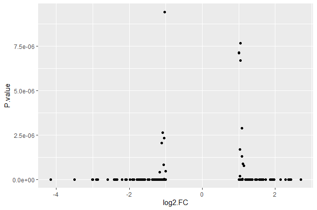
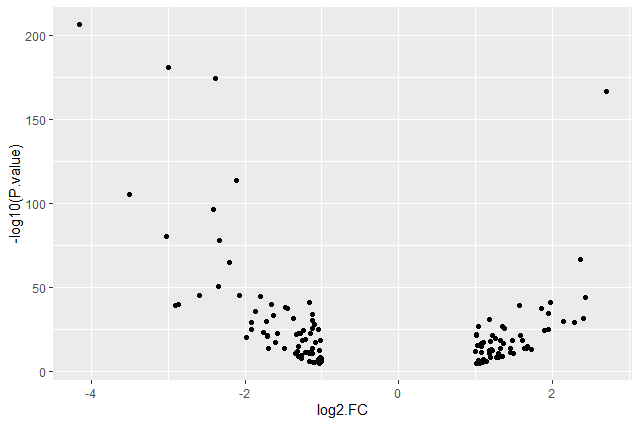
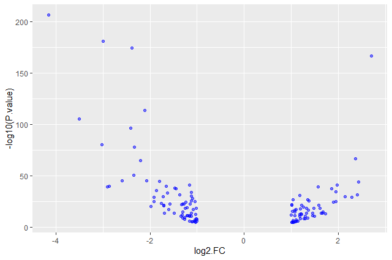
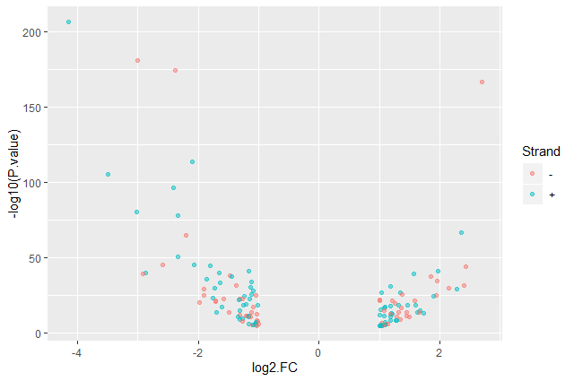
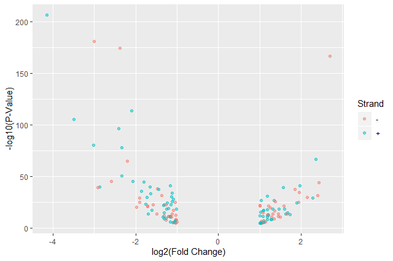
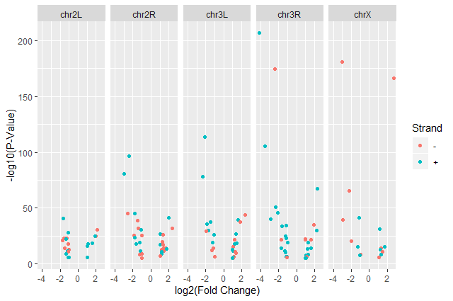
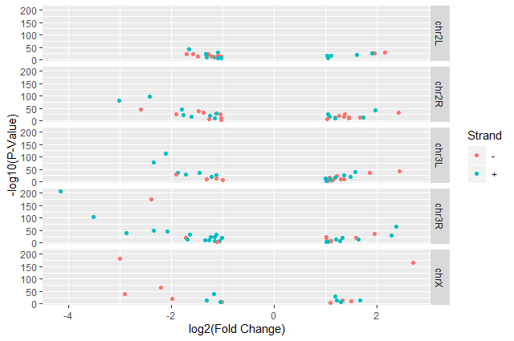
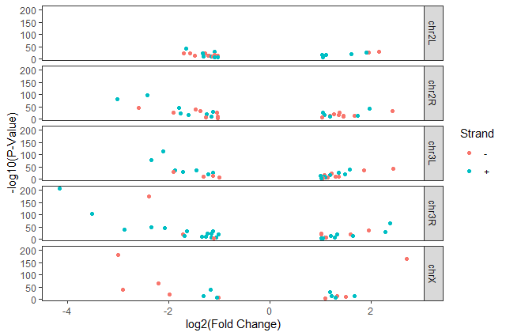
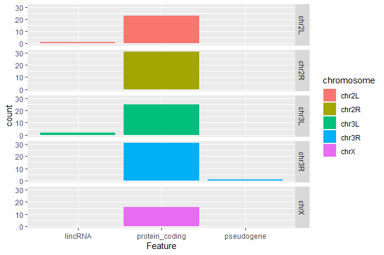
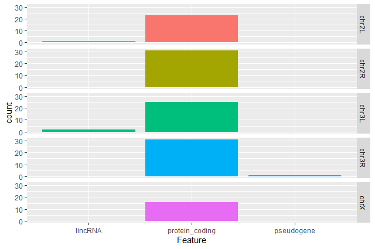

# Introduction




With RNA-Seq data analysis, we generated tables containing list of DE genes, their expression, some statistics, etc. We can manipulate these tables using Galaxy, as we saw in some tutorials, e.g. ["Reference-based RNA-Seq data analysis"](), and create some visualisations.

Sometimes we want to have some customizations on visualization, some complex table manipulations or some statistical analysis. If we can not find a Galaxy tools for that or the right parameters, we may need to use programming languages as R or Python.

> <tip-title>Prerequisites</tip-title>
> It is expected that you are already somewhat familiar with the R basics (how to create variables, create and access lists, etc.) If you are not yet comfortable with those topics, we recommend that you complete the requirements listed at the start of this tutorial first, before proceeding.
>
> If you are starting with this tutorial, you will need to import a dataset:
>
> > <hands-on-title>Using datasets from Galaxy</hands-on-title>
> >
> > 1. Upload the following URL to Galaxy:
> >    ```
> >    https://zenodo.org/record/3477564/files/annotatedDEgenes.tabular
> >    ```
> >
> > 2. Note the history ID of the dataset in your Galaxy history
> >
> > 3.  in Galaxy provides some special functions to import and export from your history:
> >
> >    ```R
> >    annotatedDEgenes <- read.csv(gx_get(2), sep="\t") # will import dataset number 2 from your history, use the correct ID for your dataset.
> >    ```
> >
> >
> {: .hands_on}
>
> > <hands-on-title>Using datasets without Galaxy</hands-on-title>
> > 1. Read the tabular file into an object called `annotatedDEgenes`:
> >
> >    ```R
> >    ## read in a CSV file and save it as 'annotatedDEgenes'
> >    annotatedDEgenes <- read.csv("https://zenodo.org/record/3477564/files/annotatedDEgenes.tabular", sep="\t")
> >    ```
> >
> >  {: .tip}
> {: .hands_on}
{: .tip}

In this tutorial, we will take the list of DE genes extracted from DESEq2's output that we generated in the ["Reference-based RNA-Seq data analysis" tutorial](), manipulate it and create some visualizations.

> <agenda-title></agenda-title>
>
> In this tutorial, we will cover:
>
> 1. TOC
> {:toc}
>
{: .agenda}



# Visualization

In RNA-seq data analysis and other omics experiments, visualization are an important step to check the data, their quality and represent the results found for publication.

`ggplot2` is a plotting package that makes it simple to create complex plots from data in a data frame. It provides a more programmatic interface for specifying what variables to plot, how they are displayed, and general visual properties. Therefore, we only need minimal changes if the underlying data change or if we decide to change from a bar plot to a scatter plot. This helps in creating publication quality plots with minimal amounts of adjustments and tweaking.

`ggplot2` graphics are built step by step by adding new elements, i.e. layers:

```R
ggplot(data = <DATA>, mapping = aes(<MAPPINGS>)) +
  <GEOM_FUNCTION>() +
  <GEOM_FUNCTION>() +
  <GEOM_FUNCTION>()
```

Adding layers in this fashion allows for extensive flexibility and customization of plots.

## Volcano plot

> <hands-on-title>First plot, step by step</hands-on-title>
>
> 1. Load `ggplot2`
>
>     ```R
>     library(ggplot2)
>     ```
>
>    > <tip-title>Didn't work?</tip-title>
>    > You might need to install ggplot2 first
>    >
>    > ```R
>    > > install.packages("ggplot2")
>    > ```
>    {: .tip}
>
> 3. Bind a plot to a specific data frame
>
>    ```R
>    ggplot(data = annotatedDEgenes)
>    ```
>
>    A new window will open in the bottom-right panel
>
> 4. Define a mapping (using the `aes` aesthetic function), by selecting the variables to be plotted and specifying how to present them in the graph, e.g. as x/y positions or characteristics such as size, shape, color, etc.
>
>     ```R
>     ggplot(data = annotatedDEgenes, aes(x = log2.FC., y = P.value))
>     ```
>
>     X-axis is now the log2 FC and and Y-axis the p-value
>
>     > <comment-title>Data format</comment-title>
>     >
>     > Some `ggplot2` functions need data in the 'long' format:
>     > - a column for every dimension
>     > - a row for every observation
>     >
>     > Well-structured data will save you lots of time when making figures with `ggplot2`.
>     {: .comment}
>
> 5. Add information about the graphical representations of the data in the plot (points, lines, bars) using `geoms` function added via the `+` operator
>
>    ```R
>    ggplot(data = annotatedDEgenes, aes(x = log2.FC., y = P.value)) +
>          geom_point()
>    ```
>
>    > <comment-title>Graphical representations of the data in the plot</comment-title>
>    >
>    > `ggplot2` offers many different `geoms`; we will use some common ones today, including:
>    > - `geom_point()` for scatter plots, dot plots, etc.
>    > - `geom_boxplot()` for, well, boxplots!
>    > - `geom_line()` for trend lines, time series, etc.
>    {: .comment}
{: .hands_on}

We should obtain our first ggplot2 plot:



This plot is called a volcano plot, a type of scatterplot that shows statistical significance (P value) versus magnitude of change (fold change). The most upregulated genes are towards the right, the most downregulated genes are towards the left, and the most statistically significant genes are towards the top. With this plot, we can then quickly identify genes with large fold changes that are also statistically significant, i.e. probably the most biologically significant genes.

The current version of the plot is not really informative, mostly due to the high number of p-values close to zero. In order to resolve this, we will apply `-log10()` to the y-axis values.

> <hands-on-title>Volcano plot with log values on y-axis</hands-on-title>
>
> 1. Create volcano plot with log values on the y-axis
>
>    ```R
>    ggplot(data = annotatedDEgenes, aes(x = log2.FC., y = -log10(P.value))) +
>         geom_point()
>    ```
{: .hands_on}



> <question-title>Categorising expression levels</question-title>
>
> 1. Why are there no points with log2 FC between -1 and 1?
>
> > <solution-title></solution-title>
> >
> > The input file we used are the 130 genes with a significant adjusted p-values (below < 0.05) and an absolute fold change higher than 2 (log2 FC < -1 or log 2 FC > 1).
> >
> {: .solution}
{: .question}

> <comment-title>The `+` sign</comment-title>
>
> The `+` in the `ggplot2` package is particularly useful because it allows you to modify existing `ggplot` objects. This means you can easily set up plot templates and conveniently explore different types of plots, so the above plot can also be generated with code like this:
>
> ```R
> # Assign plot to a variable
> de_genes_plot <- ggplot(data = annotatedDEgenes, aes(x = log2.FC., y = -log10(P.value)))
>
> # Draw the plot
> de_genes_plot +
>     geom_point()
> ```
>
> The `+` sign used to add new layers must be placed at the end of the line containing the previous layer. If, instead, the `+` sign is added at the beginning of the line containing the new layer, `ggplot2` will not add the new layer and will return an error message.
>
> ```R
> # This is the correct syntax for adding layers
> > de_genes_plot +
>       geom_point()
>
> # This will not add the new layer and will return an error message
> > de_genes_plot
>     + geom_point()
> ```
{: .comment}

> <comment-title>Some extra comments</comment-title>
>
> Anything you put in the `ggplot()` function can be seen by any `geom` layers that you add (i.e., these are universal plot settings). This includes the `x-` and `y-axis` mapping you set up in `aes()`.
>
> You can also specify mappings for a given `geom` independently of the mappings defined globally in the `ggplot()` function.
{: .comment}

Building plots with `ggplot2` is typically an iterative process. We start by defining the dataset we'll use, lay out the axes, and choose a `geom`. We can now modify this plot to extract more information from it.

> <hands-on-title>Format plot</hands-on-title>
>
> 1. Add transparency (`alpha`) to avoid overplotting
>
>    ```R
>    ggplot(data = annotatedDEgenes, aes(x = log2.FC., y = -log10(P.value))) +
>         geom_point(alpha = 0.5)
>    ```
>
>    
>
> 2. Add colors for all the points
>
>    ```R
>    ggplot(data = annotatedDEgenes, aes(x = log2.FC., y = -log10(P.value))) +
>        geom_point(alpha = 0.5, color = "blue")
>    ```
>
>    
>
> 3. Color point based on their strand
>
>     ```R
>     ggplot(data = annotatedDEgenes, aes(x = log2.FC., y = -log10(P.value), color = Strand)) +
>         geom_point(alpha = 0.5)
>     ```
>
>     
>
>     We use a vector as an input to the argument color and `ggplot2` provides a different color corresponding to different values in the vector.
>
> 4. Add axis labels
>
>    ```R
>    ggplot(data = annotatedDEgenes, aes(x = log2.FC., y = -log10(P.value), color = Strand)) +
>        geom_point(alpha = 0.5) +
>          labs(x = "log2(Fold Change)",
>               y = "-log10(P-Value)")
>    ```
{: .hands_on}

We have now a nice Volcano plot:



> <question-title>Standard error over the `-log10` of the adjusted `P-value`</question-title>
>
> Create a scatter plot of the standard error over the `-log10` of the adjusted `P-value` with the chromosomes showing in different colors. Make sure to give your plot relevant axis labels.
>
> > <solution-title></solution-title>
> >
> > ```
> > ggplot(data = annotatedDEgenes, aes(x = -log10(P.adj), y = StdErr, color = Chromosome)) +
> >   geom_point() +
> >      labs(x = "-log10(P.adj)",
> >           y = "StdErr")
> > ```
> >
> > 
> {: .solution}
{: .question}

## Volcano plot by chromosomes

`ggplot2` has a special technique called faceting that allows us to split one plot into multiple plots based on a factor included in the dataset. We will use it to split our volcano plot into five panels, one for each chromosome.

> <hands-on-title>Volcano plot by chromosomes</hands-on-title>
>
> 1. Split volcano plot by chromosome using `facet_grid`
>
>    ```R
>    ggplot(data = annotatedDEgenes, aes(x = log2.FC., y = -log10(P.value), color = Strand)) +
>      geom_point() +
>      labs(x = "log2(Fold Change)",
>           y = "-log10(P-Value)") +
>      facet_grid(. ~ Chromosome)
>    ```
>
>    
>
> 2. Split volcano plot by chromosome using `facet_grid` with plots stacked vertically
>
>    ```R
>    ggplot(data = annotatedDEgenes, aes(x = log2.FC., y = -log10(P.value), color = Strand)) +
>      geom_point() +
>      labs(x = "log2(Fold Change)",
>           y = "-log10(P-Value)") +
>      facet_grid(Chromosome ~ .)
>    ```
>
>    
>
>    The `facet_grid` geometry allows to explicitly specify how we want your plots to be arranged via formula notation (`rows ~ columns`). The `.` can be used as a placeholder that indicates only one row or column).
>
> 3. Add white background using `theme_bw()` to make the plot more readable when printed
>
>    ```R
>    ggplot(data = annotatedDEgenes, aes(x = log2.FC., y = -log10(P.value), color = Strand)) +
>      geom_point() +
>      labs(x = "log2(Fold Change)",
>           y = "-log10(P-Value)") +
>      facet_grid(Chromosome ~ .) +
>      theme_bw()
>    ```
>
>    > <details-title>`ggplot2` themes</details-title>
>    >
>    > In addition to `theme_bw()`, which changes the plot background to white, `ggplot2` comes with several other themes which can be useful to quickly change the look of your visualization.
>    >
>    > - `theme_minimal()` and `theme_light() `are popular
>    > - `theme_void()` can be useful as a starting point to create a new hand-crafted theme
>    >
>    > The complete list of themes is available on the [ggplot2 website](https://ggplot2.tidyverse.org/reference/ggtheme.html). The `ggthemes` package provides a wide variety of options (including an Excel 2003 theme). The [`ggplot2` extensions website](https://www.ggplot2-exts.org/) provides a list of packages that extend the capabilities of `ggplot2`, including additional themes.
>    {: .details}
>
> 4. Remove the grid
>
>    ```R
>    ggplot(data = annotatedDEgenes, aes(x = log2.FC., y = -log10(P.value), color = Strand)) +
>      geom_point() +
>      labs(x = "log2(Fold Change)",
>           y = "-log10(P-Value)") +
>      facet_grid(Chromosome ~ .) +
>      theme_bw() +
>      theme(panel.grid = element_blank())
>    ```
>
{: .hands_on}



> <question-title>Standard error over the `-log10` of the adjusted `P-value`</question-title>
>
> Create a scatter plot of the standard error over the `-log10` of the adjusted `P-value` with the chromosomes showing in different colors and one facet per strand. Make sure to give your plot relevant axis labels.
>
> > <solution-title></solution-title>
> >
> > ```
> > ggplot(data = annotatedDEgenes, aes(x = -log10(P.adj), y = StdErr, color = Chromosome)) +
> >  geom_point() +
> >  labs(x = "-log10(P.adj)",
> >       y = "StdErr") +
> >  facet_grid(Strand ~ .)
> > ```
> >
> > 
> >
> {: .solution}
{: .question}

## Barplot of the number of DE genes

We would like now to make a barplot showing the number of differentially expressed genes.

> <hands-on-title>Barplot of the number of DE genes</hands-on-title>
>
> 1. Create a barplot with `geom_bar` function of the number of DE genes for each feature with one plot per chromosome
>
>    ```R
>    ggplot(data = annotatedDEgenes, aes(x = Feature, fill = Chromosome)) +
>    geom_bar() +
>    facet_grid(Chromosome ~ .)
>    ```
{: .hands_on}



> <question-title>Remove the legend</question-title>
>
> The chromosome is labeled on the individual plot facets so we don't need the legend. Use the help file for `geom_bar` and any other online resources to remove the legend from the plot.
>
> > <solution-title></solution-title>
> >
> > ```
> > ggplot(data = annotatedDEgenes, aes(x = Feature, fill = Chromosome)) +
> >  geom_bar(show.legend = F) +
> >  facet_grid(Chromosome ~ .)
> > ```
> > 
> >
> {: .solution}
{: .question}


> <question-title>Create a R script with plots</question-title>
>
> Take another few minutes to either improve one of the plots generated in this exercise or create a beautiful graph of your own (using the [RStudio `ggplot2` cheat sheet](https://raw.githubusercontent.com/rstudio/cheatsheets/main/data-visualization-2.1.pdf) for inspiration).
>
> Here are some ideas:
> 1. Change the size or shape of the plotting symbol
> 2. Change the name of the legend
> 3. Change the label of the legend
> 4. Use a different color palette (see the [cookbook here](http://www.cookbook-r.com/Graphs/Colors_(ggplot2)/)).
{: .question}

# Conclusion


Data manipulation and visualization are important parts of any RNA-Seq analysis. Galaxy provides several tools for that as explained in several tutorials:

- [Reference-based RNA-Seq]()
- [Visualization of RNA-seq results with heatmap2]()
- [Visualization of RNA-seq results with Volcano Plot]()

But sometimes we need more customization and then need to use programming languages as R or Python.

Working with a programming language (especially if it's your first time) often feels intimidating, but the rewards outweigh any frustrations. An important secret of coding is that even experienced programmers find it difficult and frustrating at times – so if even the best feel that way, why let intimidation stop you? Given time and practice you will soon find it easier and easier to accomplish what you want.

Finally, we won't lie; R is not the easiest-to-learn programming language ever created. So, don't get discouraged! The truth is that even with the modest amount of R covered today, you can start using some sophisticated R software packages, and have a general sense of how to interpret an R script. Get through these lessons, and you are on your way to being an accomplished R user!
