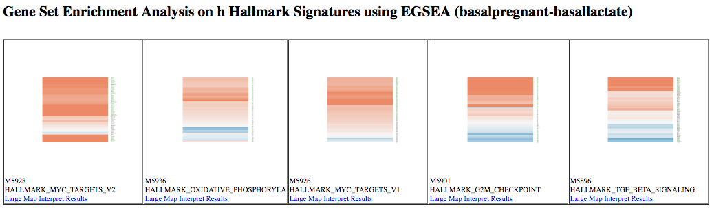

# Introduction


Sometimes there is quite a long list of genes to interpret after a differential expression analysis, and it is usually infeasible to go through the list one gene at a time trying to understand it’s biological function. A common downstream procedure is gene set testing, which aims to understand which pathways/gene networks the differentially expressed genes are implicated in. There are many different gene set testing methods that can be applied and it can be useful to try several.

The purpose of this tutorial is to demonstrate how to perform gene set testing using tools in Galaxy. The data comes from a Nature Cell Biology paper, [EGF-mediated induction of Mcl-1 at the switch to lactation is essential for alveolar cell survival](https://www.ncbi.nlm.nih.gov/pubmed/25730472)), Fu et al. 2015. That study examined the expression profiles of basal and luminal cells in the mammary gland of virgin, pregnant and lactating mice (see Figure below). How to generate differentially expressed genes from reads (FASTQs) for this dataset is covered in the accompanying tutorials [RNA-seq reads to counts]() and [RNA-seq counts to genes](). This tutorial is inspired by material from the COMBINE R RNAseq workshop [here](http://combine-australia.github.io/RNAseq-R/06-rnaseq-day1.html) and the Cancer Research UK workshop [here](https://bioinformatics-core-shared-training.github.io/cruk-summer-school-2018/RNASeq2018/html/06_Gene_set_testing.nb.html).


> <agenda-title></agenda-title>
>
> In this tutorial, we will deal with:
>
> 1. TOC
> {:toc}
>
{: .agenda}



We will use several files for this analysis:

 * **Differentially expressed results files** (genes in rows, logFC and P values in columns)
 * **Sample information** file (sample id, group)
 * **Gene lengths file** (genes, lengths)
 * **Filtered counts file** (genes in rows, counts for samples in columns, with lowly expressed genes removed)
 * **Gene sets file** for MSigDB Hallmark collection for mouse (rdata)


# Import data

> <hands-on-title>Data upload</hands-on-title>
>
> 1. Create a new history for this RNA-seq exercise e.g. `RNA-seq genes to pathways`
>
>    
>
>    
>
> 2. **Import the files**, there are two options:
>    - Option 1: From a shared data library if available (ask your instructor)
>
>      
>
>    - Option 2: From [Zenodo](https://zenodo.org/record/2596382)
>
>      
>
>    You can paste the names and links below into the Upload tool:
>
>    ```
>    https://zenodo.org/record/2596382/files/limma-voom_basalpregnant-basallactate
>    https://zenodo.org/record/2596382/files/limma-voom_luminalpregnant-luminallactate
>    https://zenodo.org/record/2596382/files/seqdata
>    https://zenodo.org/record/2596382/files/mouse_hallmark_sets
>    https://zenodo.org/record/2596382/files/factordata
>    https://zenodo.org/record/2596382/files/limma-voom_filtered_counts
>    ```
>
> 3. Add a tag called `#basal` to the `limma-voom_basalpregnant-basallactate` and a tag called `#luminal` to the `limma-voom_luminalpregnant-luminallactate` files.
>
>    
>
{: .hands_on}

# Gene Set Testing

## Gene Ontology testing with **goseq**

We would like to know if there are biological categories that are enriched among the differentially expressed genes. To do this we will perform a Gene Ontology analysis, similar to the [RNA-seq ref-based tutorial]().

[Gene Ontology (GO)](http://www.geneontology.org/) analysis is widely used to reduce complexity and highlight biological processes in genome-wide expression studies. However, standard methods give biased results on RNA-seq data due to over-detection of differential expression for long and highly-expressed transcripts.

The [goseq tool](https://bioconductor.org/packages/release/bioc/vignettes/goseq/inst/doc/goseq.pdf) provides methods for performing GO analysis of RNA-seq data, taking length bias into account. The methods and software used by goseq are equally applicable to other category based tests of RNA-seq data, such as KEGG pathway analysis.

goseq needs 2 files as inputs:
- a **differentially expressed genes** file. Information for all genes tested for differential expression (all genes after filtering lowly expressed). This file should have 2 columns:
    - the Gene IDs (unique within the file)
    - True (differentially expressed) or False (not differentially expressed)
- a **gene lengths** file. Information to correct for potential length bias in differentially expressed genes. This file should have 2 columns:
    - the Gene IDs (unique within the file)
    - the gene lengths

We need a table of differentially expressed (DE) results for goseq. Here we will use two tables, one for each of the basal and luminal pregnant vs lactate results. This is so we can compare results for the two cell types. These tables were output from the limma-voom tool but DE tables from edgeR or DESeq2 could also be used. For this dataset we will call genes differentially expressed if they have an adjusted P value below 0.01. We can use the gene lengths from the counts table in GEO (provided as a file called `seqdata` in Zenodo). But if we didn't have that we could use a tool like **featureCounts**  to output a gene lengths file. The `seqdata` file contains >20k genes, but we only want the ~15k we have in our differentially expressed genes file. So we will join the lengths file with the differentially expressed genes file, keeping only the length information for genes present in the differentially expressed genes file. We can then cut out the columns we need for the two inputs (gene id, length) (gene id, DE status) and as a bonus they will both be sorted in the same order, which is what we need for goseq.

To generate the two input files we will use:
* **Compute** to add a column to the DE tables, that gives genes meeting our adj.P threshold the value "True" and all other genes the value "False".
* **Join two Datasets** to add the gene length information to the differentially expressed genes, matching on gene ids
* **Cut** to extract the two columns for the differentially expressed genes information
* **Cut** to extract the two columns for the gene length information


> <hands-on-title>Prepare the two inputs for GOSeq</hands-on-title>
>
> 1. **Compute an expression on every row**  with the following parameters:
>    -  *"Add expression"*: `bool(c8<0.01)` (adj.P < 0.01)
>    -  *"as a new column to"*: the `limma-voom_basalpregnant-basallactate` file
>    -  *"Skip a header line"*: `yes`
>    -  *"The new column name"*: `Status`
> 2. **Join two Datasets side by side on a specified field**  with the following parameters:
>    -  *"Join"*: output of **Compute** 
>    -  *"using column"*: `Column: 1`
>    -  *"with"* the `seqdata` file
>    -  *"and column"*: `Column: 1`
>    -  *"Keep the header lines"*: `Yes`
> 3. **Cut columns from a table**  with the following parameters:
>    -  *"Cut columns"*: `c1,c10` (the gene ids and DE status)
>    -  *"Delimited by"*: `Tab`
>    -  *"From"*: output of **Join** 
>    - Rename to `goseq DE status`
> 4. **Cut columns from a table**  with the following parameters:
>    -  *"Cut columns"*: `c1,c12` (the gene ids and lengths)
>    -  *"Delimited by"*: `Tab`
>    -  *"From"*: output of **Join** 
>    - Rename to `goseq gene lengths`
{: .hands_on}

We now have the two required input files for goseq.

> <hands-on-title>Perform GO analysis</hands-on-title>
>
> 1. **goseq**  with
>    -  *"Differentially expressed genes file"*: `goseq DE status`
>    -  *"Gene lengths file"*: `goseq gene lengths`
>    -  *"Gene categories"*:  `Get categories`
>       -  *"Select a genome to use"*:  `Mouse(mm10)`
>       -  *"Select Gene ID format"*:  `Entrez Gene ID`
>       -  *"Select one or more categories"*: `GO: Biological Process`
>    - *"Output Options"*
>        -  *"Output Top GO terms plot?"* `Yes`
{: .hands_on}

goseq generates a big table with the following columns for each GO term:
1. `category`: GO category
2. `over_rep_pval`: *p*-value for over representation of the term in the differentially expressed genes
3. `under_rep_pval`: *p*-value for under representation of the term in the differentially expressed genes
4. `numDEInCat`: number of differentially expressed genes in this category
5. `numInCat`: number of genes in this category
6. `term`: detail of the term
7. `ontology`: MF (Molecular Function - molecular activities of gene products), CC (Cellular Component - where gene products are active), BP (Biological Process - pathways and larger processes made up of the activities of multiple gene products)
8. `p.adjust.over_represented`: *p*-value for over representation of the term in the differentially expressed genes, adjusted for multiple testing with the Benjamini-Hochberg procedure
9. `p.adjust.under_represented`: *p*-value for over representation of the term in the differentially expressed genes, adjusted for multiple testing with the Benjamini-Hochberg procedure

To identify categories significantly enriched/unenriched below some p-value cutoff, it is necessary to use the adjusted *p*-value.

A plot of the top 10 over-represented GO terms (by *p*-value) can be output from the goseq tool to help visualise results. Click on the `Top over-represented GO terms plot` PDF in the history. It should look similar to below.


> <question-title></question-title>
> Can you generate the plot of top 10 GO terms for the luminal differentially expressed genes? Tip: You could use the Rerun button for each step (as the parameters are already selected) and choose the luminal file as input.
>
> > <solution-title></solution-title>
> >
> > Running goseq on the luminal file should give a plot similar to below.
> > 
> >
> {: .solution}
{: .question}

For more on GO analysis, including how to simplify GO results and visualize with GO graphs, see the [GO Enrichment tutorial]({{ site.baseurl }}/topics/transcriptomics/tutorials/goenrichment/tutorial.html).

## Gene Set Enrichment Analysis with **fgsea**

Gene Set Enrichment Analysis (GSEA) [(Subramanian et al., 2005)](https://www.ncbi.nlm.nih.gov/pubmed/16199517) is a widely used method that determines whether a set of genes is enriched in a list of differentially expressed genes. Unlike the previous method with goseq, no threshold is applied for what is considered "differentially expressed", all genes are used. If a gene set falls at either the top (over-expressed) or bottom (under-expressed) of the list it is said to be enriched. [fgsea](https://www.biorxiv.org/content/early/2016/06/20/060012) is a faster implementation of the GSEA method. fgsea requires a ranked list of genes and some gene sets to test.

The [Molecular Signatures Database (MSigDB)](http://software.broadinstitute.org/gsea/msigdb/index.jsp) contains curated collections of gene sets that are commonly used in a GSEA analysis. They can be downloaded from the [Broad website](http://software.broadinstitute.org/gsea/downloads.jsp). But these collections are only of human gene sets. If working with another species you would need to first map the genes to their human orthologues. However, MSigDB versions for mouse are provided [by the Smyth lab here](http://bioinf.wehi.edu.au/software/MSigDB/index.html). There are several MSigDB collections, we'll use the [Hallmark collection](https://www.cell.com/cell-systems/fulltext/S2405-4712(15)00218-5), which contains 50 gene sets. According to MSigDB, "each gene set in the hallmark collection consists of a “refined” gene set, derived from multiple “founder” sets, that conveys a specific biological state or process and displays coherent expression. The hallmarks effectively summarize most of the relevant information of the original founder sets and, by reducing both variation and redundancy, provide more refined and concise inputs for gene set enrichment analysis".  We'll use the mouse Hallmark file provided in Zenodo, originally downloaded from http://bioinf.wehi.edu.au/software/MSigDB/mouse_H_v5p2.rdata.

There are several ways we could choose to rank our genes, we could rank by log-fold change (most upregulated to most downregulated) but that doesn't take into account any error in the log fold change value. Another way is to use the "signed fold change" which is to rank by the sign of the fold change multiplied by the P value (as described [here](http://genomespot.blogspot.com/2014/09/data-analysis-step-8-pathway-analysis.html). We could also use the t statistic that's output from limma, as that takes into account the log-fold change and it's standard error, see [here](https://support.bioconductor.org/p/6124/) for more explanation. We'll use the t statistic to rank here.

> <hands-on-title>Perform gene set enrichment with fgsea</hands-on-title>
>
> 1. **Cut columns from a table**  with
>    -  *"Cut columns"*: `c1,c6` (the Entrez gene ids and t-statistic)
>    -  *"Delimited by"*: `Tab`
>    -  *"From"*: the `limma-voom_basalpregnant-basallactate` file
> 2. **Sort data in ascending or descending order**  with
>    -  *"Sort Query"*: the output of **Cut** 
>    -  *"Number of header lines"*: `1`
>    - *"Column selections"*:
>        -  *"on column"*: `Column: 2`
>        -  *"in"*: `Descending order`
>        -  *"Flavor"*: `Fast numeric sort (-n)`
> 3. **fgsea**  with
>    -  *"Ranked Genes"*: the output of **Sort** 
>    -  *"File has header?"*: `Yes`
>    -  *"Gene Sets"*: `mouse_hallmark_sets` (this should be `rdata` format, if not, see how to change it in the Tip below)
>    -  *"Minimum Size of Gene Set"*: `15`
>    -  *"Output plots"*: `Yes`
>
> 
>
{: .hands_on}

fgsea outputs a table of results containing a list of pathways with P values and enrichment scores. It can also output a summary table plot of the top pathways such as the one shown below for the `basallpregnant-basallactate` contrast below.


An enrichment plot of the each of the top pathways can also be produced, one is shown below. The barcode pattern shows where the genes in the set are found in the list of ranked genes. Most of the bars to the left indicate enrichment of the set at the top of the ranked list of genes (upregulated) and most bars towards the right indicate enrichment at the bottom of the list (downregulated). The enrichment score reflects the degree to which the genes are enriched at the top or bottom of the list.


> <question-title></question-title>
> Can you run fgsea on the luminal contrast and generate the fgsea summary table plot?
>
> > <solution-title></solution-title>
> >
> > Running fgsea on the luminal file should give a plot similar to below.
> > 
> >
> {: .solution}
{: .question}

## Ensemble gene set enrichment analyses with **EGSEA**

The ensemble of genes set enrichment analyses (EGSEA) [(Alhamdoosh et al, 2017)](https://www.ncbi.nlm.nih.gov/pubmed/27694195) is a method developed for RNA-seq data that combines results from multiple algorithms and calculates collective gene set scores, to try to improve the biological relevance of the highest ranked gene sets. EGSEA has built-in gene sets from MSigDB and KEGG for human and mouse. We'll show here how it can be used with the MSigDB Hallmark collection and KEGG pathways. For input we need a count matrix and EGSEA will perform a limma-voom analysis before gene set testing. We can use the provided filtered counts file output from limma, where the low count genes have been filtered out (output from limma by selecting *"Output Filtered Counts Table?"*: `Yes`). We just need to remove the gene symbol and description columns. We also need a symbols mapping file containing just the Entrez ids and symbols, which we can generate from the filtered counts file. The third input we need is a factors information file, containing what groups the samples belong to, we can use the same one from the tutorial [RNA-seq counts to genes]({{ site.baseurl }}/topics/transcriptomics/tutorials/rna-seq-counts-to-genes/tutorial.html). EGSEA provides twelve base methods and we will select eleven, all except roast, as the fry method is a fast approximation of roast.

> <hands-on-title>Perform ensemble gene set testing with EGSEA</hands-on-title>
>
> 1. **Cut columns from a table (cut)**  with the following parameters:
>      -  *"File to cut"*: `limma-voom filtered counts`
>      -  *"Operation"*: `Discard`
>      -  *"List of fields"*: Select `Column:2`, `Column:3`
>      - Rename to `EGSEA counts`
> 2. **Cut columns from a table (cut)**  with the following parameters:
>      -  *"File to cut"*: `limma-voom filtered counts`
>      -  *"Operation"*: `Keep`
>      -  *"List of fields"*: Select `Column:1`, `Column:2`
>      - Rename to `EGSEA anno`
> 3. **EGSEA**  with the following parameters:
>      -  *"Count Files or Matrix?*": `Single Count Matrix`
>          -  *"Count Matrix"*: Select `EGSEA counts`
>      -  *"Input factor information from file?"*: `Yes`
>          -  *"Factor File"*: Select `factordata`
>      -  *"Symbols Mapping file"*: `EGSEA anno`
>      -  *"Contrast of Interest"*: `basalpregnant-basallactate`
>      -  *"Species"*: `mouse`
>      -  *"Gene Set Testing Methods"*: Tick `camera`, `safe`, `gage`, `zscore`, `gsva`, `globaltest`, `ora`, `ssgsea`, `padog`, `plage`, `fry`
>      -  *"MSigDB Gene Set Collections"*: `H: hallmark gene sets`
>      -  *"KEGG Pathways"*: `Metabolism` and `Signalling`
>      -  *"Download KEGG pathways?"*: `Yes`
>      -  *"I certify that I am not using this tool for commercial purposes"*: `Yes`
{: .hands_on}

This generates a table of results, and a report. Contained within the report are plots, such as heatmaps of the top ranked pathways, as shown below. Note that we see some similar pathways in the results here as with the fgsea analysis.



KEGG pathway diagrams are generated if KEGG pathways are selected, as shown below. These show the expression values of the genes overlaid, genes upregulated in the contrast are shown in red, downregulated genes in blue. Ribosome was one of the top GO terms identified for the basal pregnant vs lactate contrast and here we see ribosome pathways are in the top ranked KEGG pathways.


> <question-title></question-title>
> Can you run EGSEA on the luminal contrast identify the top KEGG gene sets? Tip: you could use the rerun button and replace the "Contrast of Interest" with the name of the luminal contrast.
>
> > <solution-title></solution-title>
> >
> > Running EGSEA on the luminal file should give top KEGG gene sets similar to below.
> > 
> >
> {: .solution}
{: .question}

# Conclusion


In this tutorial we have seen some gene set testing methods that can be used to interpret lists of differentially expressed genes. Multiple methods can be used to help identify pathways of interest and to provide complementary ways of visualising results. This follows on from the accompanying tutorials, [RNA-seq reads to counts]() and [RNA-seq counts to genes](), that showed how to turn reads (FASTQs) into differentially expressed genes for this dataset. For further reading on analysis of RNA-seq count data and the methods used here, see the articles; RNA-seq analysis is easy as 1-2-3 with limma, Glimma and edgeR [(Law et al. 2016)](https://f1000research.com/articles/5-1408/v2) and From reads to genes to pathways: differential expression analysis of RNA-Seq experiments using Rsubread and the edgeR quasi-likelihood pipeline [(Chen, Lun, Smyth 2016)](https://f1000research.com/articles/5-1438/v2).
