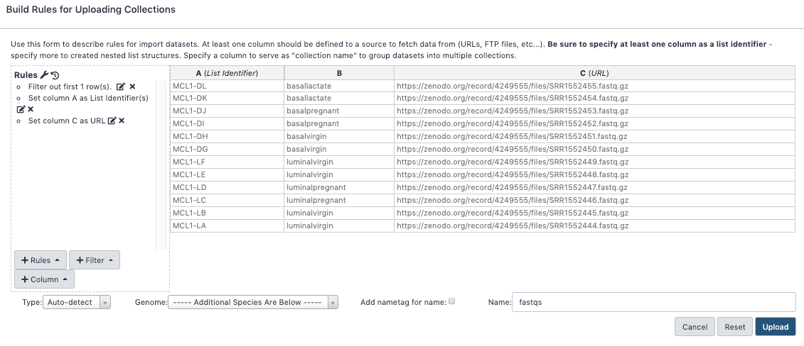
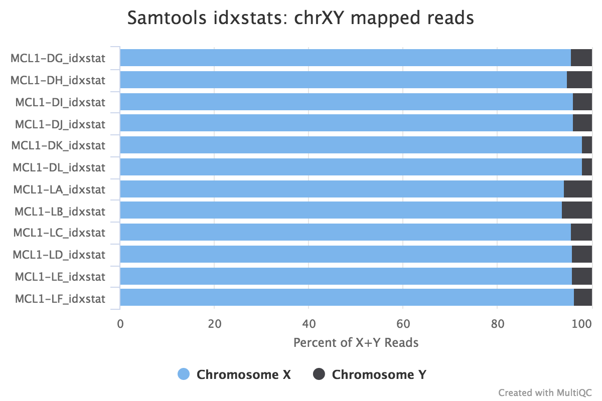

# Introduction


Measuring gene expression on a genome-wide scale has become common practice over the last two decades or so, with microarrays predominantly used pre-2008. With the advent of next generation sequencing technology in 2008, an increasing number of scientists use this technology to measure and understand changes in gene expression in often complex systems. As sequencing costs have decreased, using RNA-Seq to simultaneously measure the expression of tens of thousands of genes for multiple samples has never been easier. The cost of these experiments has now moved from generating the data to storing and analysing it.

There are many steps involved in analysing an RNA-Seq experiment. The analysis begins with sequencing reads (FASTQ files). These are usually aligned to a reference genome, if available. Then the number of reads mapped to each gene can be counted. This results in a table of counts, which is what we perform statistical analyses on to determine differentially expressed genes and pathways. The purpose of this tutorial is to demonstrate how to do read alignment and counting, prior to performing differential expression. Differential expression analysis with limma-voom is covered in an accompanying tutorial [RNA-seq counts to genes](). The tutorial here shows how to start from FASTQ data and perform the mapping and counting steps, along with associated Quality Control.

**Mouse mammary gland dataset**

The data for this tutorial comes from a Nature Cell Biology paper by . Both the raw data (sequence reads) and processed data (counts) can be downloaded from Gene Expression Omnibus database (GEO) under accession number [GSE60450](http://www.ncbi.nlm.nih.gov/geo/query/acc.cgi?acc=GSE60450).

This study examined the expression profiles of basal and luminal cells in the mammary gland of virgin, pregnant and lactating mice. Six groups are present, with one for each combination of cell type and mouse status. Note that two biological replicates are used here, two independent sorts of cells from the mammary glands of virgin, pregnant or lactating mice, however three replicates is usually recommended as a minimum requirement for RNA-seq.

This is a Galaxy tutorial based on material from the [COMBINE R RNAseq workshop](http://combine-australia.github.io/RNAseq-R/07-rnaseq-day2.html), first taught [here](http://combine-australia.github.io/2016-05-11-RNAseq/).


> <agenda-title></agenda-title>
>
> In this tutorial, we will cover:
>
> 1. TOC
> {:toc}
>
{: .agenda}




# Preparing the reads

## Import data from URLs

Read sequences are usually stored in compressed (gzipped) FASTQ files. Before the differential expression analysis can proceed, these reads must be aligned to the reference genome and counted into annotated genes. Mapping reads to the genome is a very important task, and many different aligners are available, such as HISAT2 (), STAR () and Subread (). Most mapping tasks require larger computers than an average laptop, so usually read mapping is done on a server in a linux-like environment, requiring some programming knowledge. However, Galaxy enables you to do this mapping without needing to know programming and if you don't have access to a server you can try to use one of the publically available Galaxies e.g. [usegalaxy.org](https://usegalaxy.org), [usegalaxy.eu](https://usegalaxy.eu), [usegalaxy.org.au](https://usegalaxy.org.au/).

The raw reads used in this tutorial were obtained from SRA from the link in GEO for the the mouse mammary gland dataset (e.g `ftp://ftp-trace.ncbi.nlm.nih.gov/sra/sra-instant/reads/ByStudy/sra/SRP%2FSRP045%2FSRP045534`). For the purpose of this tutorial we are going to be working with a small part of the FASTQ files. We are only going to be mapping 1000 reads from each sample to enable running through all the steps quickly. If working with your own data you would use the full data and some results for the full mouse dataset will be shown for comparison. The small FASTQ files are available in [Zenodo](https://zenodo.org/record/4249555) and the links to the FASTQ files are provided below.

If you are sequencing your own data, the sequencing facility will almost always provide compressed FASTQ files which you can upload into Galaxy. For sequence data available through URLs, The [Galaxy Rule-based Uploader]() can be used to import the files. It is much quicker than downloading FASTQs to your computer and uploading into Galaxy and also enables importing as a **Collection**. When you have more than a few files, using Galaxy Collections helps keep the datasets organised and tidy in the history. Collections also make it easier to maintain the sample names through tools and workflows. If you are not familiar with collections, you can take a look at the [Galaxy Collections tutorial]() for more details. The screenshots below show a comparison of what the FASTQ datasets for this tutorial would look like in the history if we imported them as datasets versus as a collection with the Rule-based Uploader.

Datasets | Collection
--- | ---
| 


> <details-title>Collections and sample names</details-title>
>
> Collections can also help to maintain the original sample names on the files throughout the tools used. The screenshots below show what we would see in one of the MultiQC reports that we will generate if we used datasets versus a collection.
>
> Datasets | Collection
> --- | ---
> | 
>
{: .details}


The information we need to import the samples for this tutorial (sample ID, Group, and link to the FASTQ file (URL) are in the grey box below.

```
SampleID	Group	URL
MCL1-DL	basallactate	https://zenodo.org/record/4249555/files/SRR1552455.fastq.gz
MCL1-DK	basallactate	https://zenodo.org/record/4249555/files/SRR1552454.fastq.gz
MCL1-DJ	basalpregnant	https://zenodo.org/record/4249555/files/SRR1552453.fastq.gz
MCL1-DI	basalpregnant	https://zenodo.org/record/4249555/files/SRR1552452.fastq.gz
MCL1-DH	basalvirgin	https://zenodo.org/record/4249555/files/SRR1552451.fastq.gz
MCL1-DG	basalvirgin	https://zenodo.org/record/4249555/files/SRR1552450.fastq.gz
MCL1-LF	luminallactate	https://zenodo.org/record/4249555/files/SRR1552449.fastq.gz
MCL1-LE	luminallactate	https://zenodo.org/record/4249555/files/SRR1552448.fastq.gz
MCL1-LD	luminalpregnant	https://zenodo.org/record/4249555/files/SRR1552447.fastq.gz
MCL1-LC	luminalpregnant	https://zenodo.org/record/4249555/files/SRR1552446.fastq.gz
MCL1-LB	luminalvirgin	https://zenodo.org/record/4249555/files/SRR1552445.fastq.gz
MCL1-LA	luminalvirgin	https://zenodo.org/record/4249555/files/SRR1552444.fastq.gz
```


In order to get these files into Galaxy, we will want to do a few things:

* Strip the *header* out of the sample information (it doesn’t contain a URL Galaxy can download).
* Define the file **Identifier** column (`SampleID`).
* Define the **URL** column (`URL`) (this is the location Galaxy can download the data from).

> <hands-on-title>Data upload</hands-on-title>
>
> 1. Create a new history for this tutorial e.g. `RNA-seq reads to counts`
>
>    
>    
>
> 2. Import the files from Zenodo using Galaxy's Rule-based Uploader.
>    - Open the Galaxy Upload Manager
>    - Click the tab **Rule-based**
>        - *"Upload data as"*: `Collection(s)`
>        - *"Load tabular data from"*: `Pasted Table`
>    - Paste the table from the grey box above. *(You should now see below)*
>    - Click **Build**
>
>       
>
>    - In the `rules editor` that pops up:
>
>        - **Remove the header**. From the **Filter** menu select `First or Last N Rows`
>            - *"Filter which rows?"*: `first`
>            - *"Filter how many rows?"*: `1`
>            - Click `Apply`
>
>        - **Define the Identifier and URL columns**. From the **Rules** menu select `Add / Modify Column Definitions`
>            - Click `Add Definition` button and select List Identifier(s)
>                - *"List Identifier(s)"*: `A`
>            - Click `Add Definition` button again and select URL instead
>                - *"URL"*: `C`
>            - Click `Apply`, and you should see your new column definitions listed
>
>        - **Name the collection**. For *"Name"* enter: `fastqs` *(You should now see below)*
>        - Click `Upload`
>
>        
>
>        You should see a collection (list) called `fastqs` in your history containing all 12 FASTQ files.
>
>
{: .hands_on}

If your data is not accessible by URL, for example, if your FASTQ files are located on your laptop and are not too large, you can upload into a collection as below. If they are large you could use FTP. You can take a look at the [Getting data into Galaxy slides]() for more information.

> <tip-title>Upload local files into a collection</tip-title>
>
> - Open the Galaxy Upload Manager
> - Click the tab **Collection**
> - Click **Choose Local Files** and locate the files you want to upload
>     - *"Collection Type"*: `List`
> - In the pop up that appears:
>     - *"Name"*: `fastqs`
>     - Click `Create list`
{: .tip}

If your FASTQ files are located in Shared Data, you can import them into your history as a collection as below.

> <tip-title>Import files from Shared Data into a collection</tip-title>
>
> - In the Menu at the top go to Shared Data > Data Libraries
> - Locate your FASTQ files
> - Tick the checkboxes to select the files
> - From the **To History** menu select `as a Collection`
> - In the pop up that appears:
>     - *"Which datasets?"*: `current selection`
>     - *"Collection type"*: `List`
>     - *"Select history"*: `select your History`
>     - Click `Continue`
> - In the pop up that appears:
>     - *"Name"*: `fastqs`
>     - Click `Create list`
{: .tip}

Take a look at one of the FASTQ files to see what it contains.

> <hands-on-title>Take a look at FASTQ format</hands-on-title>
>
> 1. Click on the collection name (`fastqs`)
> 2. Click on the  (eye) icon of one of the FASTQ files to have a look at what it contains
{: .hands_on}

> <details-title>FASTQ format</details-title>
> If you are not familiar with FASTQ format, see the [Quality Control tutorial]()
{: .details}


## Raw reads QC

During sequencing, errors are introduced, such as incorrect nucleotides being called. These are due to the technical limitations of each sequencing platform. Sequencing errors might bias the analysis and can lead to a misinterpretation of the data. Every base sequence gets a quality score from the sequencer and this information is present in the FASTQ file. A quality score of 30 corresponds to a 1 in 1000 chance of an incorrect base call (a quality score of 10 is a 1 in 10 chance of an incorrect base call). To look at the overall distribution of quality scores across the reads, we can use FastQC.

Sequence quality control is therefore an essential first step in your analysis. We will use similar tools as described in the ["Quality control" tutorial](): [FastQC](https://www.bioinformatics.babraham.ac.uk/projects/fastqc/) and Cutadapt ().

> <hands-on-title>Check raw reads with <b>FastQC</b></hands-on-title>
>
> 1. 
>    -  *"Short read data from your current history"*: `fastqs` (Input dataset collection)
> 2. Inspect the `Webpage` output of **FastQC**  for the `MCL1-DL` sample by clicking on the  (eye) icon
>
> 
>
{: .hands_on}


> <question-title></question-title>
> 1. What is the read length?
> 2. What base quality score encoding is used?
>
> > <solution-title></solution-title>
> >
> > 1. The read length is 100 bp.
> > 2. Sanger quality score encoding is used.
> > This information can be seen at the top of the FastQC Webpage as below.
> >
> > 
> >
> {: .solution}
>
{: .question}

The FastQC report contains a lot of information and we can look at the report for each sample. However, that is quite a few reports, 12 for this dataset. If you had more samples it could be a lot more. Luckily, there is a very useful tool called MultiQC () that can summarise QC information for multiple samples into a single report. We'll generate a few MultiQC outputs in this tutorial so we'll add name tags so we can differentiate them.

> <hands-on-title>Aggregate FastQC reports with <b>MultiQC</b></hands-on-title>
>
> 1.  with the following parameters to aggregate the FastQC reports
>      - In *"Results"*
>        - *"Which tool was used generate logs?"*: `FastQC`
>        - In *"FastQC output"*
>           -  *"Type of FastQC output?"*: `Raw data`
>           -  *"FastQC output"*: `RawData` files (output of **FastQC**  on trimmed reads)
> 2. Add a tag `#fastqc-raw` to the `Webpage` output from MultiQC and inspect the webpage
>
> 
>
{: .hands_on}


Note that these are the results for just 1000 reads. The FastQC results for the full dataset are shown below. The 1000 reads are the first reads from the FASTQ files, and the first reads usually originate from the flowcell edges, so we can expect that they may have lower quality and the patterns may be a bit different from the distribution in the full dataset.

You should see that most of the plots in the small FASTQs look similar to the full dataset. However, in the small FASTQs, there is less duplication, some Ns in the reads and some overrepresented sequences.


See the [Quality Control tutorial]() for more information on FastQC plots.

> <question-title></question-title>
>
> What do you think of the overall quality of the sequences?
>
> > <solution-title></solution-title>
> >
> > Overall, the samples look pretty good. The main things to note here are:
> > * The **base quality** is high in all samples.
> > * Some Illumina **adapter** has been detected.
> > * Some duplication in RNA-seq can be normal due to the presence of highly expressed genes. However, for some reason `MCL1-LE` and `MCL1-LF` have higher numbers of duplicates detected than the other samples.
> >
> {: .solution}
{: .question}

We will use Cutadapt to trim the reads to remove the Illumina adapter and any low quality bases at the ends (quality score < 20). We will discard any sequences that are too short (< 20bp) after trimming. We will also output the Cutadapt report for summarising with MultiQC.

The Cutadapt tool Help section provides the sequence we can use to trim this standard Illumina adapter `AGATCGGAAGAGCACACGTCTGAACTCCAGTCAC`, as given on the [Cutadapt website](https://cutadapt.readthedocs.io/en/stable/guide.html#illumina-truseq). For trimming paired-end data see the Cutadapt Help section. Other Illumina adapter sequences (e.g. Nextera) can be found at the [Illumina website](http://sapac.support.illumina.com/bulletins/2016/12/what-sequences-do-i-use-for-adapter-trimming.html). Note that Cutadapt requires at least three bases to match between adapter and read to reduce the number of falsely trimmed bases, which can be changed in the Cutadapt options if desired.

## Trim reads

> <hands-on-title>Trim reads with <b>Cutadapt</b></hands-on-title>
>
> 1. 
>    -  *"Single-end or Paired-end reads?"*: `Single-end`
>        -  *"FASTQ/A file"*: `fastqs` (Input dataset collection)
>        - In *"Read 1 Options"*:
>            - In *"3' (End) Adapters"*:
>                - Click on *"Insert 3' (End) Adapters"*:
>                - In *"1: 3' (End) Adapters"*:
>                    -  *"Source"*: `Enter custom sequence`
>                        -  *"Enter custom 3' adapter name (Optional)"*: `Illumina`
>                        -  *"Enter custom 3' adapter sequence"*: `AGATCGGAAGAGCACACGTCTGAACTCCAGTCAC`
>    - In *"Filter Options"*:
>        -  *"Minimum length (R1)"*: `20`
>    - In *"Read Modification Options"*:
>        -  *"Quality cutoff"*: `20`
>    -  *"Outputs selector"*: `Report`
>
{: .hands_on}

We can take a look at the reads again now that they've been trimmed.

## Trimmed reads QC

> <hands-on-title>QC of trimmed reads with <b>FastQC</b></hands-on-title>
>
> 1. 
>    -  *"Short read data from your current history"*: `RawData` (output of **Cutadapt** )
> 2.  with the following parameters to aggregate the FastQC reports
>    - In *"Results"*
>        -  *"Which tool was used generate logs?"*: `FastQC`
>        - In *"FastQC output"*
>           -  *"Type of FastQC output?"*: `Raw data`
>           -  *"FastQC output"*: `RawData` files (output of **FastQC** )
> 3. Add a tag `#fastqc-trimmed` to the `Webpage` output from MultiQC and inspect the webpage
{: .hands_on}

The MultiQC plot below shows the result from the full dataset for comparison.


After trimming we can see that:

* No adapter is detected now.
* The reads are no longer all the same length, we now have sequences of different lengths detected.

# Mapping

Now that we have prepared our reads, we can align the reads for our 12 samples. There is an existing reference genome for mouse and we will map the reads to that. The current most widely used version of the mouse reference genome is `mm10/GRCm38` (although note that there is a new version `mm39` released June 2020). Here we will use [**HISAT2**](https://ccb.jhu.edu/software/hisat2/index.shtml) to align the reads. HISAT2 is the descendent of TopHat, one of the first widely-used aligners, but alternative mappers could be used, such as STAR. See the [RNA-seq ref-based tutorial]({{ site.baseurl }}/topics/transcriptomics/tutorials/ref-based/tutorial.html#mapping) for more information on RNA-seq mappers. There are often numerous mapping parameters that we can specify, but usually the default mapping parameters are fine. However, library type (paired-end vs single-end) and library strandness (stranded vs unstranded) require some different settings when mapping and counting, so they are two important pieces of information to know about samples. The mouse data comprises unstranded, single-end reads so we will specify that where necessary. HISAT2 can output a mapping summary file that tells what proportion of reads mapped to the reference genome. Summary files for multiple samples can be summarised with MultiQC. As we’re only using a subset of 1000 reads per sample, aligning should just take a minute or so. To run the full samples from this dataset would take longer.

## Map reads to reference genome

> <hands-on-title>Map reads to reference with <b>HISAT2</b></hands-on-title>
>
> 1.  with the following parameters:
>    -  *"Source for the reference genome"*: `Use a built-in genome`
>        -  *"Select a reference genome"*: `mm10`
>    -  *"Is this a single or paired library?"*: `Single-end`
>        -  *"FASTA/Q file"*: `Read 1 Output` (output of **Cutadapt** )
>    - In *"Summary Options"*:
>        -  *"Output alignment summary in a more machine-friendly style."*: `Yes`
>        -  *"Print alignment summary to a file."*: `Yes`
> 2.  with the following parameters to aggregate the HISAT2 summary files
>    - In *"Results"*
>        -  *"Which tool was used generate logs?"*: `HISAT2`
>        -  *"Output of HISAT2"*: `Mapping summary` (output of **HISAT2** )
> 3. Add a tag `#hisat` to the `Webpage` output from MultiQC and inspect the webpage
{: .hands_on}

> <comment-title>Settings for Paired-end or Stranded reads</comment-title>
>
> - If you have **paired-end** reads
>     - Select *"Is this a single or paired library"* `Paired-end` or `Paired-end Dataset Collection` or `Paired-end data from single interleaved dataset`
> - If you have **stranded** reads
>     - Select *"Specify strand information"*: `Forward (FR)` or `Reverse (RF)`
{: .comment}

The MultiQC plot below shows the result from the full dataset for comparison.


An important metric to check is the percentage of reads mapped to the reference genome. A low percentage can indicate issues with the data or analysis. Over 90% of reads have mapped in all samples, which is a good mapping rate, and the vast majority of reads have mapped uniquely, they haven't mapped to multiple locations in the reference genome.

It is also good practice to visualise the read alignments in the BAM file, for example using IGV, see the [RNA-seq ref-based tutorial]({{ site.baseurl }}/topics/transcriptomics/tutorials/ref-based/tutorial.html#inspection-of-the-mapping-results).
{: .hands_on}

**HISAT2** generates a BAM file with mapped reads.



> <tip-title>Downloading a collection</tip-title>
>
> To download a collection of datasets (e.g. the collection of BAM files) click on the floppy disk icon within the collection. This will download a tar file containing all the datasets in the collection. Note that for BAM files the .bai indexes (required for IGV) will be included automatically in the download.
>
{: .tip}


# Counting

The alignment produces a set of BAM files, where each file contains the read alignments for each sample. In the BAM file, there is a chromosomal location for every read that mapped. Now that we have figured out where each read comes from in the genome, we need to summarise the information across genes or exons. The mapped reads can be counted across mouse genes by using a tool called featureCounts (). featureCounts requires gene annotation specifying the genomic start and end position of each exon of each gene. For convenience, featureCounts contains built-in annotation for mouse (`mm10`, `mm9`) and human (`hg38`, `hg19`) genome assemblies, where exon intervals are defined from the NCBI RefSeq annotation of the reference genome. Reads that map to exons of genes are added together to obtain the count for each gene, with some care taken with reads that span exon-exon boundaries. The output is a count for each Entrez Gene ID, which are numbers such as `100008567`. For other species, users will need to read in a data frame in GTF format to define the genes and exons. Users can also specify a custom annotation file in SAF format. See the tool help in Galaxy, which has an example of what an SAF file should like like, or the Rsubread users guide for more information.


> <comment-title></comment-title>
>
> In this example we have kept many of the default settings, which are typically optimised to work well under a variety of situations. For example, the default setting for featureCounts is that it only keeps reads that uniquely map to the reference genome. For testing differential expression of genes, this is preferred, as the reads are unambigously assigned to one place in the genome, allowing for easier interpretation of the results. Understanding all the different parameters you can change involves doing a lot of reading about the tool that you are using, and can take a lot of time to understand! We won’t be going into the details of the parameters you can change here, but you can get more information from looking at the tool help.
{: .comment}

## Count reads mapped to genes

> <hands-on-title>Count reads mapped to genes with <b>featureCounts</b></hands-on-title>
>
> 1.  with the following parameters:
>    -  *"Alignment file"*: `aligned reads (BAM)` (output of **HISAT2** )
>    -  *"Gene annotation file"*: `featureCounts built-in`
>        -  *"Select built-in genome"*: `mm10`
>
> 2.  with the following parameters:
>    -  *"Which tool was used generate logs?"*: `featureCounts`
>        -  *"Output of FeatureCounts"*: `featureCounts summary` (output of **featureCounts** )
> 3. Add a tag `#featurecounts` to the `Webpage` output from MultiQC and inspect the webpage
{: .hands_on}

> <comment-title>Settings for Paired-end or Stranded reads</comment-title>
>
> - If you have **paired-end** reads
>     - Click *"Options for paired-end reads"*
>         -  *"Count fragments instead of reads"*: `Enabled; fragments (or templates) will be counted instead of reads`
> - If you have **stranded** reads
>     -  Select *"Specify strand information"*: `Stranded (Forward)` or `Stranded (Reverse)`
{: .comment}

The MultiQC plot below shows the result from the full dataset for comparison.


> <question-title></question-title>
>
> What % reads are assigned to exons?
>
> > <solution-title></solution-title>
> >
> > ~60-70% of reads are assigned to exons. This is a fairly typical number for RNA-seq.
> >
> {: .solution}
>
{: .question}


The counts for the samples are output as tabular files. Take a look at one. The numbers in the first column of the counts file represent the Entrez gene identifiers for each gene, while the second column contains the counts for each gene for the sample.

## Create count matrix

The counts files are currently in the format of one file per sample. However, it is often convenient to have a count matrix. A count matrix is a single table containing the counts for all samples, with the genes in rows and the samples in columns. The counts files are all within a collection so we can use the Galaxy **Column Join on multiple datasets** tool to easily create a count matrix from the single counts files.

> <hands-on-title>Create count matrix with <b>Column Join on multiple datasets</b></hands-on-title>
>
> 1.  with the following parameters:
>    -  *"Tabular files"*: `Counts` (output of **featureCounts** )
>    -  *"Identifier column"*: `1`
>    -  *"Number of header lines in each input file"*: `1`
>    -  *"Add column name to header"*: `No`
>
{: .hands_on}

Take a look at the output. Note that as the tutorial uses a small subset of the data (~ 1000 reads per sample), to save on processing time, most rows in that matrix will contain all zeros (there will be ~600 non-zero rows). The output for the full dataset is shown below.


Now it is easier to see the counts for a gene across all samples. The accompanying tutorial, [RNA-seq counts to genes](), shows how gene information (symbols etc) can be added to a count matrix.

# Generating a QC summary report

There are several additional QCs we can perform to better understand the data, to see if it's good quality. These can also help determine if changes could be made in the lab to improve the quality of future datasets.

We'll use a prepared workflow to run the first few of the QCs below. This will also demonstrate how you can make use of Galaxy workflows to easily run and reuse multiple analysis steps. The workflow will run the first three tools: **Infer Experiment**, **MarkDuplicates** and **IdxStats** and generate a **MultiQC** report. You can then edit the workflow if you'd like to add other steps.

> <hands-on-title>Run QC report workflow</hands-on-title>
>
> 1. **Import the workflow** into Galaxy
>    - Copy the URL (e.g. via right-click) of [this workflow]({{ site.baseurl }}{{ page.dir }}workflows/qc_report.ga) or download it to your computer.
>    - Import the workflow into Galaxy
>
>    
>
> 2. Import this file as type BED file:
>    ```
>    https://sourceforge.net/projects/rseqc/files/BED/Mouse_Mus_musculus/mm10_RefSeq.bed.gz/download
>    ```
>    
>
> 3. Run **Workflow QC Report**  using the following parameters:
>    - *"Send results to a new history"*: `No`
>    -  *"1: Reference genes"*: the imported RefSeq BED file
>    -  *"2: BAM files"*: `aligned reads (BAM)` (output of **HISAT2** )
>
>    
> 4. Inspect the `Webpage` output from MultiQC
{: .hands_on}


**You do not need to run the hands-on steps below.** They are just to show how you could run the tools individually and what parameters to set.

## Strandness

As far as we know this data is unstranded, but as a sanity check you can check the strandness. You can use RSeQC Infer Experiment tool to "guess" the strandness, as explained in the [RNA-seq ref-based tutorial](). This is done through comparing the "strandness of reads" with the "strandness of transcripts". For this tool, and many of the other RSeQC () tools, a reference bed file of genes (`reference genes`) is required. RSeQC provides some reference BED files for model organisms. You can import the RSeQC mm10 RefSeq BED file from the link `https://sourceforge.net/projects/rseqc/files/BED/Mouse_Mus_musculus/mm10_RefSeq.bed.gz/download` (and rename to `reference genes`) or import a file from Shared data if provided. Alternatively, you can provide your own BED file of reference genes, for example from UCSC (see the [Peaks to Genes tutorial](). Or the **Convert GTF to BED12** tool can be used to convert a GTF into a BED file.

> <hands-on-title>Check strandness with <b>Infer Experiment</b></hands-on-title>
>
> 1.  with the following parameters:
>    -  *"Input .bam file"*: `aligned reads (BAM)` (output of **HISAT2** )
>    -  *"Reference gene model"*: `reference genes` (Reference BED file)
> 2.  with the following parameters:
>       - In *"1: Results"*:
>           -  *"Which tool was used generate logs?"*: `RSeQC`
>               -  *"Type of RSeQC output?"*: `infer_experiment`
>                   -  *"RSeQC infer_experiment output"*: `Infer Experiment output` (output of **Infer Experiment** )
> 3. Inspect the `Webpage` output from MultiQC
{: .hands_on}

The MultiQC plot below shows the result from the full dataset for comparison.


> <question-title></question-title>
>
> Do you think the data is stranded or unstranded?
>
> > <solution-title></solution-title>
> >
> > It is unstranded as approximately equal numbers of reads have aligned to the sense and antisense strands.
> >
> {: .solution}
>
{: .question}


## Duplicate reads

Duplicate reads are usually kept in RNA-seq differential expression analysis as they can come from highly-expressed genes but it is still a good metric to check. A high percentage of duplicates can indicate a problem with the sample, for example, PCR amplification of a low complexity library (not many transcripts) due to not enough RNA used as input. FastQC gives us an idea of duplicates in the reads before mapping (note that it just takes a sample of the data). We can assess the numbers of duplicates in all mapped reads using the **Picard MarkDuplicates** tool. Picard considers duplicates to be reads that map to the same location, based on the start position of where the read maps. In general, we consider normal to obtain up to 50% of duplication.

> <hands-on-title>Check duplicate reads with <b>MarkDuplicates</b></hands-on-title>
>
> 1.  with the following parameters:
>    -  *"Select SAM/BAM dataset or dataset collection"*: `aligned reads (BAM)` (output of **HISAT2** )
> 2.  with the following parameters:
>       - In *"1: Results"*:
>           -  *"Which tool was used generate logs?"*: `Picard`
>               -  *"Type of Picard output?"*: `Markdups`
>                   -  *"Picard output"*: `MarkDuplicate metrics` (output of **MarkDuplicates** )
> 3. Inspect the `Webpage` output from MultiQC
{: .hands_on}

The MultiQC plot below shows the result from the full dataset for comparison.


> <question-title></question-title>
>
> Which two samples have the most duplicates detected?
>
> > <solution-title></solution-title>
> >
> > `MCL1-LE` and `MCL1-LF` have the highest number of duplicates in mapped reads compared to the other samples, similar to what we saw in the raw reads with FastQC.
> >
> {: .solution}
>
{: .question}

## Reads mapped to chromosomes

You can check the numbers of reads mapped to each chromosome with the **Samtools IdxStats** tool. This can help assess the sample quality, for example, if there is an excess of mitochondrial contamination. It could also help to check the sex of the sample through the numbers of reads mapping to X/Y or to see if any chromosomes have highly expressed genes.

> <hands-on-title>Count reads mapping to each chromosome with <b>IdxStats</b></hands-on-title>
>
> 1.  with the following parameters:
>    -  *"BAM file"*: `aligned reads (BAM)` (output of **HISAT2** )
> 2.  with the following parameters:
>       - In *"1: Results"*:
>           -  *"Which tool was used generate logs?"*: `Samtools`
>               -  *"Type of Samtools output?"*: `idxstats`
>                   -  *"Samtools idxstats output"*: `IdxStats output` (output of **IdxStats** )
> 3. Inspect the `Webpage` output from MultiQC
{: .hands_on}

The MultiQC plot below shows the result from the full dataset for comparison.




> <question-title></question-title>
>
> 1. What do you think of the chromosome mappings?
> 2. Are the samples male or female? *(If a sample is not in the XY plot it means no reads mapped to Y)*
>
> > <solution-title></solution-title>
> >
> > 1. Some of the samples have very high mapping on chromosome 5. What is going on there?
> > 2. The samples appear to be all female as there are few reads mapping to the Y chromosome. As this is a experiment studying virgin, pregnant and lactating mice if we saw large numbers of reads mapping to the Y chromosome in a sample it would be unexpected and a probable cause for concern.
> >
> {: .solution}
>
{: .question}

## Gene body coverage (5'-3')

The coverage of reads along gene bodies can be assessed to check if there is any bias in coverage. For example, a bias towards the 3' end of genes could indicate degradation of the RNA. Alternatively, a 3' bias could indicate that the data is from a 3' assay (e.g. oligodT-primed, 3'RNA-seq). You can use the RSeQC **Gene Body Coverage (BAM)** tool to assess gene body coverage in the BAM files.

> <hands-on-title>Check coverage of genes with <b>Gene Body Coverage (BAM)</b></hands-on-title>
>
> 1.  with the following parameters:
>    - *"Run each sample separately, or combine mutiple samples into one plot"*: `Run each sample separately`
>        -  *"Input .bam file"*: `aligned reads (BAM)` (output of **HISAT2** )
>    -  *"Reference gene model"*: `reference genes` (Input dataset)
> 2.  with the following parameters:
>       - In *"1: Results"*:
>           -  *"Which tool was used generate logs?"*: `RSeQC`
>               -  *"Type of RSeQC output?"*: `gene_body_coverage`
>                   -  *"RSeQC gene_body_coverage output"*: `Gene Body Coverage (BAM) (text)` (output of **Gene Body Coverage (BAM)** )
> 3. Inspect the `Webpage` output from MultiQC
>
{: .hands_on}

The MultiQC plot below shows the result from the full dataset for comparison.


The plot below from the RSeQC website shows what samples with 3'biased coverage would look like.


> <question-title></question-title>
>
> What do you think of the coverage across gene bodies in these samples?
>
> > <solution-title></solution-title>
> >
> > It looks good. This plot looks a bit noisy in the small FASTQs but it still shows there's pretty even coverage from 5' to 3' ends with no obvious bias in all the samples.
> >
> {: .solution}
>
{: .question}


## Read distribution across features (exons, introns, intergenic..)

We can also check the distribution of reads across known gene features, such as exons (CDS, 5'UTR, 3'UTR), introns and intergenic regions. In RNA-seq we expect most reads to map to exons rather than introns or intergenic regions. It is also the reads mapped to exons that will be counted so it is good to check what proportions of reads have mapped to those. High numbers of reads mapping to intergenic regions could indicate the presence of DNA contamination.

> <hands-on-title>Check distribution of reads with <b>Read Distribution</b></hands-on-title>
>
> 1.  with the following parameters:
>    -  *"Input .bam/.sam file"*: `aligned reads (BAM)` (output of **HISAT2** )
>    -  *"Reference gene model"*: `reference genes` (Input dataset)
> 2.  with the following parameters:
>       - In *"1: Results"*:
>           -  *"Which tool was used generate logs?"*: `RSeQC`
>               -  *"Type of RSeQC output?"*: `read_distribution`
>                   -  *"RSeQC read_distribution output"*: `Read Distribution output` (output of **Read Distribution** )
> 3. Inspect the `Webpage` output from MultiQC
>
{: .hands_on}

The MultiQC plot below shows the result from the full dataset for comparison.


> <question-title></question-title>
>
> What do you think of the read distribution?
>
> > <solution-title></solution-title>
> >
> > It looks good, most of the reads have mapped to exons and not many to introns or intergenic regions. The samples have pretty consistent read distribution, albeit with slightly higher numbers of reads mapping to CDS exons for `MCL1-LC` and `MCL1-LD`, and `MCL1-LE` and `MCL1-LF` have more reads mapping to CDS exons than the other samples.
> >
> {: .solution}
>
{: .question}


The MultiQC report can be downloaded by clicking on the floppy disk icon on the dataset in the history.

> <question-title></question-title>
>
> Can you think of any other QCs that could be performed on RNA-seq reads?
>
> > <solution-title></solution-title>
> >
> > The reads could be checked for:
> > * Ribosomal contamination
> > * Contamination with other species e.g. bacteria
> > * GC bias of the mapped reads
> > * This is single-end data but paired-end mapped reads could be checked for fragment size (distance between the read pairs).
> >
> {: .solution}
>
{: .question}


# Conclusion


In this tutorial we have seen how reads (FASTQ files) can be converted into counts. We have also seen QC steps that can be performed to help assess the quality of the data. A follow-on tutorial, [RNA-seq counts to genes](), shows how to perform differential expression and QC on the counts for this dataset.
