# Introduction
{:.no_toc}

Heatmaps are commonly used to visualize RNA-Seq results. They are useful for visualizing the expression of genes across the samples. In this tutorial we show how the **heatmap2** tool in Galaxy can be used to generate heatmaps. The heatmap2 tool uses the heatmap.2 function from the R gplots package. Here we will demonstrate how to make a heatmap of the top differentially expressed (DE) genes in an RNA-Seq experiment, similar to what is shown for the fruitfly dataset in the [RNA-seq ref-based tutorial]({{ site.baseurl }}/topics/transcriptomics/tutorials/ref-based/tutorial.html). We will also show how a heatmap for a custom set of genes an be created.

To generate a heatmap of RNA-seq results, we need a file of normalized counts. This file is provided for you here. The expression values have been normalized for differences in sequencing depth and composition bias between the samples. To generate this file yourself, see the [RNA-seq counts to genes]({{ site.baseurl }}/topics/transcriptomics/tutorials/rna-seq-counts-to-genes/tutorial.html) tutorial, and run limma-voom selecting *"Output Normalised Counts Table?"*: `Yes`. You could also use a file of normalized counts from other RNA-seq differential expression tools, such as edgeR or DESeq2. We also need some genes to plot in the heatmap.

The data for this tutorial comes from a Nature Cell Biology paper, [EGF-mediated induction of Mcl-1 at the switch to lactation is essential for alveolar cell survival](https://www.ncbi.nlm.nih.gov/pubmed/25730472)), Fu et al. 2015. This study examined the expression profiles of basal and luminal cells in the mammary gland of virgin, pregnant and lactating mice. Six groups are present, with one for each combination of cell type and mouse status.


> ### Agenda
>
> In this tutorial, we will deal with:
>
> 1. TOC
> {:toc}
>
{: .agenda}

# Preparing the inputs

We will use three files for this analysis:

 * **Normalized counts file** (genes in rows, samples in columns)
 * **Differentially expressed results file** (genes in rows, columns for P values and log fold change)
 * **Genes of interest** (custom list of genes to be visualized in heatmap)

## Import data

> ###  Hands-on: Data upload
>
> 1. Create a new history for this RNA-seq exercise e.g. `RNA-seq heatmap`
> 2. Import the normalized counts table.
>
>     To import the file, there are two options:
>     - Option 1: From a shared data library if available (ask your instructor)
>     - Option 2: From [Zenodo](https://zenodo.org/record/2529926)
>
>         > ###  Tip: Importing data via links
>         >
>         > * Copy the link location
>         > * Open the Galaxy Upload Manager
>         > * Select **Paste/Fetch Data**
>         > * Paste the link into the text field
>         > * Press **Start**
>         {: .tip}
>
>         - You can paste the links below into the **Paste/Fetch** box:
>
>           ```
>       https://zenodo.org/record/2529926/files/limma-voom_normalised_counts
>       https://zenodo.org/record/2529926/files/limma-voom_luminalpregnant-luminallactate
>       https://zenodo.org/record/2529926/files/heatmap_genes
>           ```
>
>         - Select *"Genome"*: `mm10`
>
> 2. Rename the counts dataset as `normalized counts`, the limma-voom_luminalpregnant-luminallactate file as `DE results` and the list of genes as `heatmap genes` using the  (pencil) icon.
> 3. Check that the datatype is `tabular`.
>    If the datatype is not `tabular`, please change the file type to `tabular`.
>
>    > ###  Tip: Changing the datatype
>    > * Click on the  (pencil) icon displayed in your dataset in the history
>    > * Choose **Datatype** on the top
>    > * Select `tabular`
>    > * Press **Save**
>    {: .tip}
{: .hands_on}

Click on the  (eye) icon of the the `DE results` file and take a look. It should look like below with 8 columns (just the first few rows are shown).

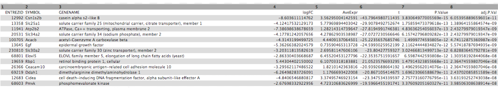

# Create heatmap of top DE genes

First we'll demonstrate how to create a heatmap of the top differentially expressed genes in an RNA-seq dataset. To do this we need to extract the differentially expressed genes from the `DE results` file. This file contains the results from comparing gene expression in the luminal cells in the pregnant versus lactating mice. It includes genes that are not significantly differentially expressed. As in the [RNA-seq counts to genes tutorial]({{ site.baseurl }}/topics/transcriptomics/tutorials/rna-seq-counts-to-genes/tutorial.html)), we'll call genes significantly differentially expressed in this dataset if they pass the thresholds of adjusted P value < 0.01 and fold change of > 1.5 (log2FC of 0.58).

## Extract all significant genes

> ###  Hands-on: Extract the significant genes
>
> 1. **Filter data on any column using simple expressions**  with the following parameters to extract genes with adj P < 0.01:
>    -  *"Filter"*: `DE results`
>    -  *"With following condition"*: `c8<0.01`
>    -  *"Number of header lines to skip"*: `1`
> 2. **Filter data on any column using simple expressions**  with the following parameters to extract genes with absolute fold change > 1.5 (log2fc of 0.58):
>    -  *"Filter"*: output of Filter 
>    -  *"With following condition"*: `abs(c4)>0.58`
>    -  *"Number of header lines to skip"*: `1`
> 3. Rename file to `Significant genes`
{: .hands_on}

## Extract the top significant genes

This gives us a file with all the significant genes, the genes that pass our thresholds for statistical and biological significance. As we can see there are many genes (~1,610), too many to plot in one heatmap, so we'll select the top 20 by P value.

> ###  Hands-on: Extract the top significant genes by P value
>
> 1. **Sort data in ascending or descending order**  with the following parameters to sort by P value:
>    -  *"Sort Query"*: output of 2nd Filter 
>    -  *"Number of header lines to skip"*: `1`
>    -  *"on Column"*: `7`
>    -  *"in"*: `Ascending order`
>    -  *"Flavor"*: `General numeric sort ( scientific notation -g)`
> 2. **Select first lines from a dataset**  with the following parameters to select top genes:
>    -  *"Select first"*: `21` (20 genes plus header row)
>    -  *"from"*: output of Sort 
>    - Rename file as `top 20 by Pvalue`
{: .hands_on}

## Extract the normalized counts for top genes

Now we have a file that contains only the top 20 genes from the DE results. Next we need to get the normalized counts for these genes, from the file containing the normalized counts for all genes in the experiment, and then extract just the columns we need for the heatmap (the normalized counts and gene labels).

First click on the  (eye) icon and take a look at the `normalized counts` file that we imported. It should look like below (just the first few rows and columns are shown). Note that the normalized count values are log2. We will join our `top 20 by Pvalue` file to the `normalized counts` file, matching on the ENTREZID columns.

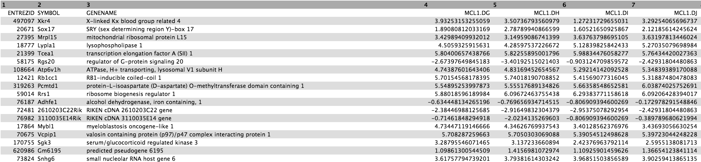

> ###  Hands-on: Extract the normalized counts for the top genes
> 1. **Join two Datasets side by side on a specified field**  with the following parameters to join on the ENTREZID column:
>    -  *"Join"*: the `top 20 by Pvalue` file
>    -  *"using column"*: `Column: 1`
>    -  *"with"*: `normalized counts` file
>    -  *"and column"*: `Column: 1`
>    -  *"Keep the header lines"*: `Yes`
>
>    The generated file has more columns than we need for the heatmap. In addition to the columns with normalized counts (in log2), there is the $$log_{2} FC$$ and other information. We need to remove the extra columns.
>
> 2. **Cut columns from a table**  to extract the columns with the gene symbols and normalized counts
>    -  *"Cut columns"*: `c2,c12-c23`
>    -  *"Delimited by"*: `Tab`
>    -  *"From"*: the joined dataset (output of **Join two Datasets** )
{: .hands_on}

The file should look like below with the 20 genes in the rows and the 12 samples in the columns (just the first few columns are shown).

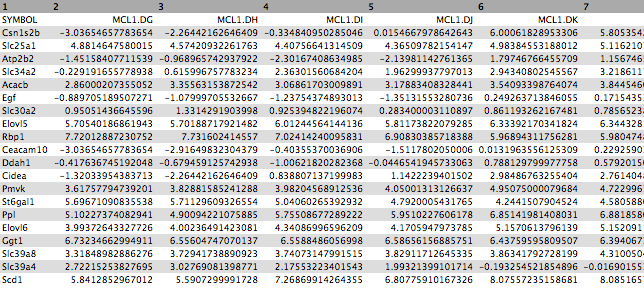

Now that we have our file with just the normalized counts for the genes we want, we can create a heatmap.

## Create heatmap of top genes

> ###  Hands-on: Plot the heatmap of top genes
>
> 1. **heatmap2**  with the following parameters:
>    -  *"Input should have column headers"*: output of **Cut** 
>    -  *"Data transformation"*: `Plot the data as it is`
>    -  *"Enable data clustering"*: `No`
>    -  *"Labeling columns and rows"*: `Label my columns and rows`
>    -  *"Coloring groups"*: `Blue to white to red`
>    -  *"Data scaling"*: `Scale my data by row` (scale genes)
{: .hands_on}

You should see a heatmap like below. Note that here we are plotting the top genes differentially expressed in the luminal cells from the pregnant mice (`MCL1.LC` and `MCL1.LD`) versus the luminal cells from the lactating mice (`MCL1.LE` and `MCL1.LF`). This heatmap enables us to see the expression of these genes in all the samples from the different groups in the experiment (basal virgin, basal pregnant, basal lactating, luminal virgin, luminal pregnant, luminal lactating).

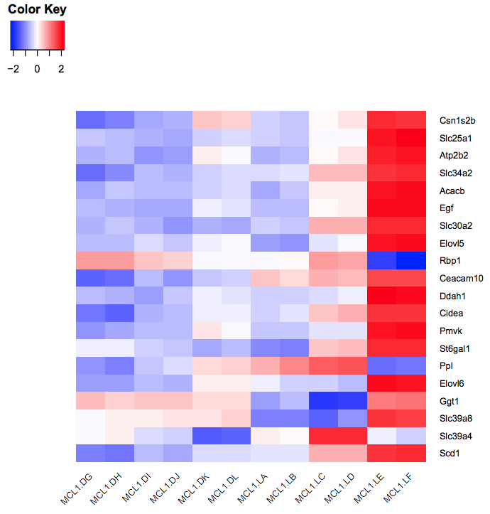{:width="150%"}


> ###  Questions
> 1. Why do we not use clustering here?
> 2. Why do we scale the rows (genes)? Try rerunning heatmap2 changing the *"Data scaling"* parameter to `Do not scale my data`.
> 3. The genes are ordered by P value. Can you make the heatmap with the genes ordered by fold change? Hint: Sort by the logFC column in ascending order to have the genes downregulated in the luminal pregnant vs lactating (negative fold change) at the top and the upregulated genes (positive fold change) at the bottom.
> 4. How could we make a heatmap of the top 10 most upregulated and top 10 most downregulated significant genes?
>
>    > ###  Solution
>    > 1. We don't use clustering here as we want to keep the genes in the order we input (ordered by P value).
>    > 2. We scale the genes as otherwise large expression values from highly expressed genes would dominate the plot, see below.
>    >     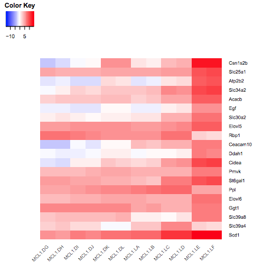
>    >
>    > 3. To make the heatmap with these genes ordered by logFC, we could **Sort** the output of the **Join** step on the logFC column, then **Cut** the columns as before and remake the heatmap. It should look like below.
>    >     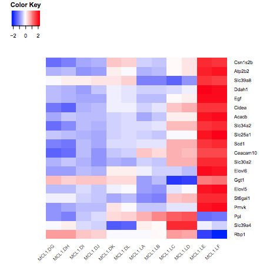
>    > 4. To make a heatmap of the most upregulated and downregulated significant genes, we could **Sort** on the logFC column (instead of P value above), then use the **Select first** and **Select last** tools to select the genes with the largest and smallest fold changes (10 genes for each) and the **Concatenate** tool to combine the outputs of the first and last Selects into one file. We would then repeat the **Join** and **Cut** steps as before to get the normalized counts and make the heatmap as below (Note that one gene name in the middle is missing as it is a gene that has NA for gene symbol)
>    >     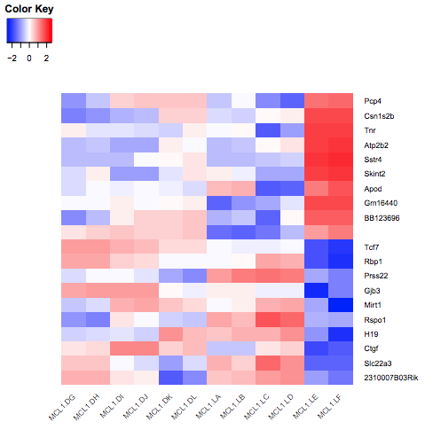
>    {: .solution}
{: .question}


# Create heatmap of custom genes

You can also create a heatmap for a custom set of genes. To demonstrate this, we will create a heatmap for the 31 genes in Figure 6b from the original paper using this dataset (see below). These 31 genes include the authors' main gene of interest in the paper, Mcl1, and a set of cytokines/growth factors identified as differentially expressed. We will recreate this heatmap here. To see how to visualize these genes in a volcano plot see the tutorial [here]({{ site.baseurl }}/topics/transcriptomics/tutorials/rna-seq-viz-with-volcanoplot/tutorial.html).

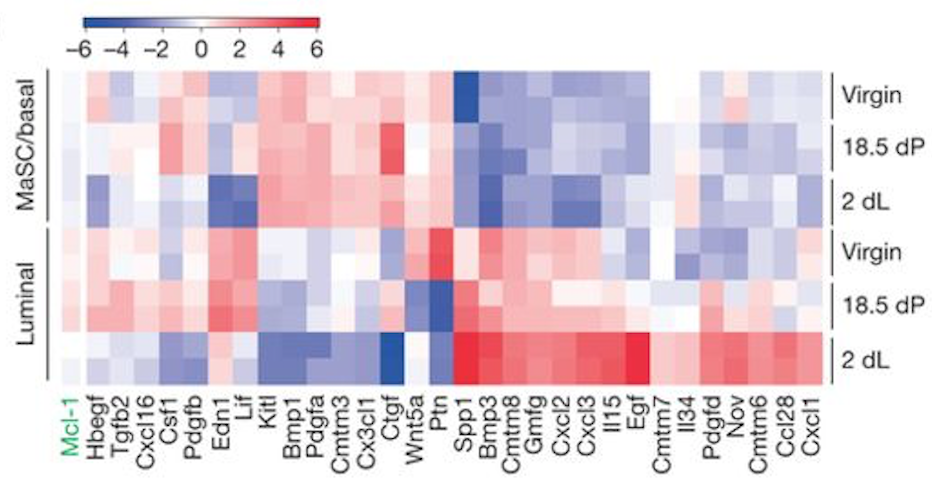{: width="50%"}

These 31 genes are in the file we imported called `heatmap genes`, shown below.

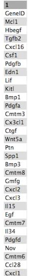{: height="30%"}

As in the previous example, we need to extract the normalized counts for just these 31 genes. To do that we will join the `heatmap genes` file with the `normalized counts` file, on the Gene Symbol columns this time (instead of ENTREZID), and then extract the columns we need.

## Extract normalized counts for custom genes

> ###  Hands-on: Extract the normalized counts for the genes of interest
>
> 1. **Join two Datasets side by side on a specified field**  with the following parameters:
>    -  *"Join"*: the `heatmap genes` file
>    -  *"using column"*: `Column: 1`
>    -  *"with"*: `normalized counts` file
>    -  *"and column"*: `Column: 2`
>    -  *"Keep the header lines"*: `Yes`
> 2. **Cut columns from a table**  to extract the columns with the gene ids and normalized counts
>    -  *"Cut columns"*: `c1,c5-c16`
>    -  *"Delimited by"*: `Tab`
>    -  *"From"*: the joined dataset (output of **Join two Datasets** )
>
>    The genes are in rows and the samples in columns, we could leave the genes in rows but we will transpose to have genes in columns and samples in rows as in the Figure in the paper.
>
> 3. **Transpose**  to have samples in rows and genes in columns
>    - *"Input tabular dataset"*:
>        -  *"From"*: the `Cut` dataset (output of **Cut** )
{: .hands_on}

We now have a table with the 31 genes in columns and the normalized counts for the 12 samples in rows, similar to below (just the first few columns are shown).

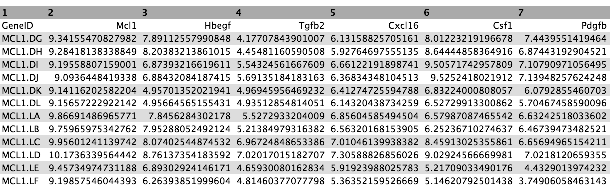

## Create heatmap of custom genes

> ###  Hands-on: Plot the heatmap of custom genes
>
> 1. **heatmap2**  with the following parameters:
>    -  *"Input should have column headers"*: the generated table (output of **Transpose** )
>    -  *"Data transformation"*: `Plot the data as it is`
>    -  *"Enable data clustering"*: `No`
>    -  *"Labeling columns and rows"*: `Label my columns and rows`
>    -  *"Coloring groups"*: `Blue to white to red`
>    -  *"Data scaling"*: `Scale my data by column` (scale genes)
{: .hands_on}

You should see a heatmap like below.

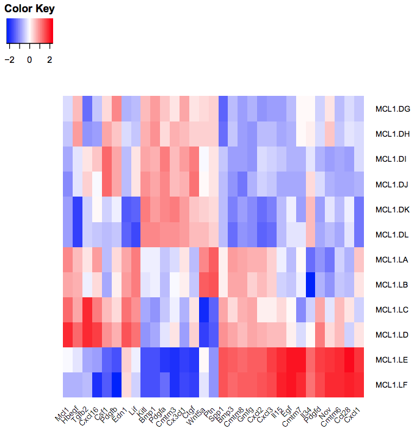{: width="30%"}

> ###  Question
>
> How does the heatmap compare to the one from the Fu paper Fig 6 (above)?
>
>    > ###  Solution
>    >
>    > The heatmap looks similar to the heatmap in the paper.
>    >
>    {: .solution}
{: .question}


# Conclusion
{:.no_toc}

In this tutorial we have seen how heatmaps can be used to visualize RNA-seq results using the **heatmap2** tool in Galaxy. We use the same dataset from the tutorials, [RNA-seq reads to counts]({{ site.baseurl }}/topics/transcriptomics/tutorials/rna-seq-reads-to-counts/tutorial.html), [RNA-seq counts to genes]({{ site.baseurl }}/topics/transcriptomics/tutorials/rna-seq-counts-to-genes/tutorial.html), [RNA-seq genes to pathways]({{ site.baseurl }}/topics/transcriptomics/tutorials/rna-seq-genes-to-pathways/tutorial.html) and [Visualization of RNA-Seq results with Volcano Plot]({{ site.baseurl }}/topics/transcriptomics/tutorials/rna-seq-viz-with-volcanoplot/tutorial.html).
