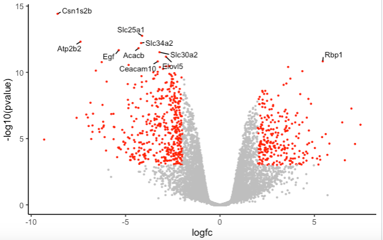

# Introduction
{:.no_toc}

The [Volcano plot]() tutorial, introduced volcano plots and showed how they can be generated with the Galaxy Volcano plot tool. In this tutorial we show how you can customise the volcano plot using the R script output from the tool. 

> ### Agenda
>
> In this tutorial, we will deal with:
>
> 1. TOC
> {:toc}
>
{: .agenda}

# Preparing the inputs

We will use one file for this analysis:

 * **Differentially expressed results file** (genes in rows, and 4 required columns: raw P values, adjusted P values (FDR), log fold change and gene labels). 

 If you are following on from the [Volcano plot]() tutorial, you already have this file in your History so you can skip to the **Create volcano plot** step below.

## Import data

> ###  Hands-on: Data upload
>
> 1. Create a new history for this exercise e.g. `Volcano plot R`
>
>    
>    
>
> 2. Import the differentially results table.
>
>    To import the file, there are two options:
>    - Option 1: From a shared data library if available (ask your instructor)
>    - Option 2: From [Zenodo](https://zenodo.org/record/2529117)
>
>    
>    
>
>    - You can paste the link below into the **Paste/Fetch** box:
>
>      ```
>      https://zenodo.org/record/2529117/files/limma-voom_luminalpregnant-luminallactate
>      ```
>
>    - Select *"Type"*: `tabular`
>
> 3. Check that the datatype is `tabular`.
>    If the datatype is not `tabular`, please change the file type to `tabular`.
>
>    
{: .hands_on}

Click on the  (eye) icon and take a look at the `DE results` file. It should look like below, with 8 columns.


## Create volcano plot

We will create a volcano plot colouring all significant genes. We will call genes significant here if they have FDR < 0.01 and a log fold change of 0.58 (equivalent to a fold-change of 1.5). These were the values used in the original paper for this dataset. We will also label the top 10 most significant genes with their gene names. We will select to output the Rscript file which we will then use to edit the plot in R.

> ###  Hands-on: Create a Volcano plot
>
> 1.  to create a volcano plot
>    -  *"Specify an input file"*: the de results file
>    -  *"File has header?"*: `Yes`
>    -  *"FDR (adjusted P value)"*: `Column 8`
>    -  *"P value (raw)"*: `Column 7`
>    -  *"Log Fold Change"*: `Column 4`
>    -  *"Labels"*: `Column 2`
>    -  *"Significance threshold"*: `0.01`
>    -  *"LogFC threshold to colour"*: `0.58`
>    -  *"Points to label"*: `Significant`
>        -  *"Only label top most significant"*: `10`
>    - In *"Output Options"*:
>    -  *"Output Rscript?"*: `Yes`
{: .hands_on}

In the PDF you should see a plot like below.


Now we will customise the plot by editing the R code in RStudio. You can use Galaxy RStudio if available or another R such as RStudio Cloud or RStudio installed on your computer.

## Import files into R

We'll import the differentially expressed results input file and the RScript into R.

> ###  Hands-on: Using datasets from Galaxy
> 
> 1. Note the history IDs of 1) the differentially expressed results and 2) the RScript in your Galaxy history
> 
> 2.  in Galaxy provides some special functions such as `gx_get` to import and export files from your history. 
>
>    
>
> 3. Copy the files we need into our workspace so we can see them in the Files pane.
> 
>    ```R
>    file.copy(gx_get(1), "de-results.tsv") # will copy dataset number 1 from your history, use the correct ID for your differentially expressed results dataset.
>    file.copy(gx_get(3), "volcano.R") # will copy dataset number 3 from your history, use the correct ID for your Rscript dataset.
>    ```
>
> 4. Click on `volcano.R` in the Files pane to open it in the Editor pane.
> 
> {: .hands_on}


We'll have a look at the script. 

## Set up script

The lines from "# Galaxy settings start" to "# Galaxy settings end" are settings needed to run the Volcano plot tool in Galaxy. We can ignore them.

We'll check if we have the packages the script needs. We can see the packages used in the lines that have `library(package)` 

>    ```R
>    library(dplyr)
>    library(ggplot2)
>    library(ggrepel)
>    ```

When we launched Galaxy RStudio there was information in the Console letting us know that ggplot2 and dplyr are already installed in this Galaxy. In this Galaxy there is a yellow warning banner across the top of the script saying "Package ggrepel required is not installed. Install. Don't Show Again". 
So we just need to install the ggrepel package. 

> > ###  Hands-on: Install package
>
> Either click on "Install" in the yellow warning banner if present, or in the Console type
>
>    ```R
>    install.packages('ggrepel')
>    ```
{: .hands_on}

We need to change the path of the differentially expressed file in the script. My path in the script is `/data/dnb03/galaxy_db/files/4/6/c/dataset_46c498bc-060e-492f-9b42-51908a55e354.dat`. This is a temporary location where the Galaxy Volcano plot tool copied my input file in order to run it. Your path will be different. In the script change this path to `de-results.tsv` like below.

> > ###  Hands-on: Run script
>
> 1. Change the input file path in script
>
>    ```R
>    # change the line
>    results <- read.delim('/data/dnb03/galaxy_db/files/4/6/c/dataset_46c498bc-060e-492f-9b42-51908a55e354.dat', header = TRUE)
>
>    # to
>    results <- read.delim('de-results.tsv', header = TRUE)
>    ```
>
> 2. Highlight the code in the script and click Run
>
{: .hands_on}

You should see a file called volcano_plot.pdf appear in the Files pane. Click on it to open it and you should see a PDF with the same plot as what we generated with the Volcano Plot tool in Galaxy.

We'll delete the lines below that save the plot to a PDF file. The plots will then be produced in the Plots pane and we can more easily see the different plots we're going to make, without having to keep opening the PDF file.

> > ###  Hands-on: Produce plots in Plots pane
>
> 1. Delete the lines below that save the plot to a PDF file
>
>    ```R
>
>    # Open PDF graphics device
>    pdf("volcano_plot.pdf")
>
>    (keep the lines in between as they produce the plot)
>
>    # Close PDF graphics device
>    dev.off()
>
>    ```
> 
> 2. Highlight the code in the script and click Run
>
{: .hands_on}

You should now see the plot produced in the Plots pane. 

## Change points colours

We'll demonstate how you can change the colours. We'll change the colour of the downregulated genes from cornflowerblue to purple. We'll change the upregulated genes from firebrick to orange.

> ###  Hands-on: Change colours
>
> 1. Edit the line below in the script
>
>    ```R
1.   # change the line
>    colours <- setNames(c("cornflowerblue", "grey", "firebrick"), c(down, notsig, up))
>
>    # to
>    colours <- setNames(c("purple", "grey", "orange"), c(down, notsig, up))
>    ```
>
> 2. Highlight the code in the script and click Run
>
>   
>
{: .hands_on}

You could try changing to other colours to see how it looks. 

> ###  Tip: R colours
>
> You can see the built-in R colours with their names in [this cheatsheet](https://www.nceas.ucsb.edu/sites/default/files/2020-04/colorPaletteCheatsheet.pdf).
>
{: .tip}


## Change points size

We'll make the points a bit smaller. We'll change to 0.5.

> ###  Hands-on: Change points size
>
> 1. Edit the line below in the script
>
>    ```R
>    # change the line
>    geom_point(aes(colour = sig)) +
>    
>    # to
>    geom_point(aes(colour = sig), size = 0.5) +
>    ```
>
> 2. Highlight the code in the script and click Run
>
>   
>
{: .hands_on}


## Change labels size

We'll make the font size of the labels a bit smaller.

> ###  Hands-on: Change labels text size
>
> 1. Edit the line below in the script
>
>    ```R
>    # change the line
>    geom_text_repel(data = filter(results, labels != ""), aes(label = labels),
>    
>    # to
>    geom_text_repel(data = filter(results, labels != ""), aes(label = labels), size = 3,
>    ```
>
> 2. Highlight the code in the script and click Run
>
>   
>
{: .hands_on}


## Remove legend

We'll remove the legend from the plot to demonstrate how you can do this.

> ###  Hands-on: Remove legend
>
> 1. Edit the line below in the script
>
>    ```R
>    # change the line
>    p <- p + theme(legend.title = element_blank())
>
>    # to
>    p <- p + theme(legend.position = "none")
>
>    ```
>
> 2. Highlight the code in the script and click Run
>
>   
>
{: .hands_on}


# Conclusion
{:.no_toc}

In this tutorial we have seen how a volcano plot can be generated and customised using Galaxy and R. You can see more possible customisations in the help pages for the functions used, by typing in R `?geom_point` and `?geom_text_repel`.
