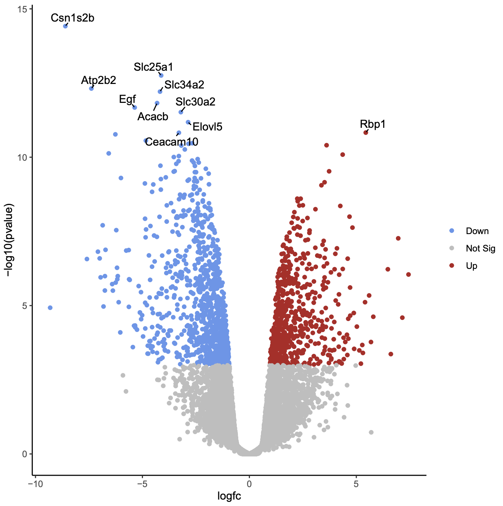
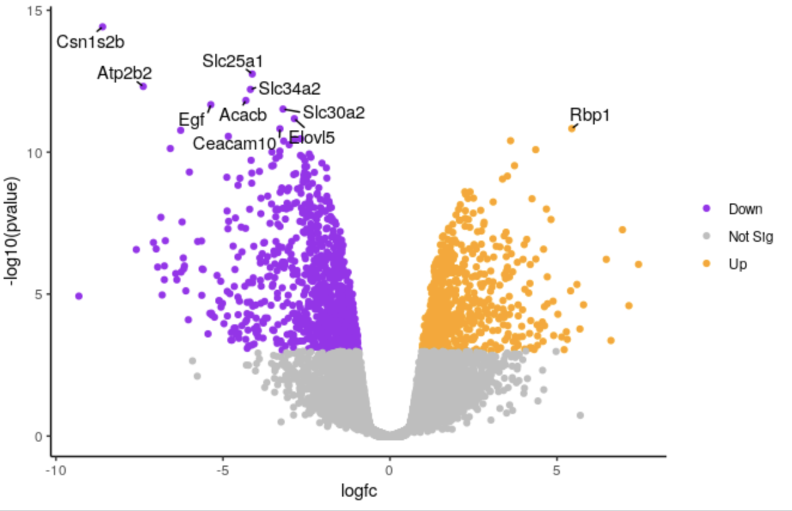
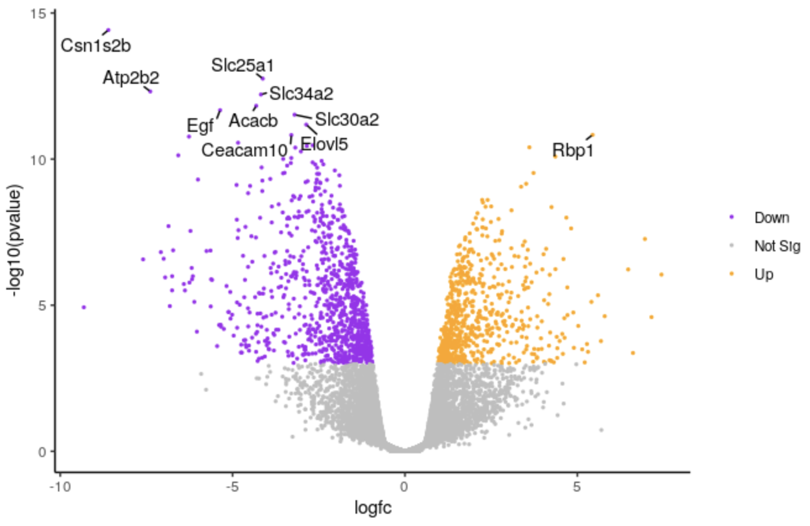
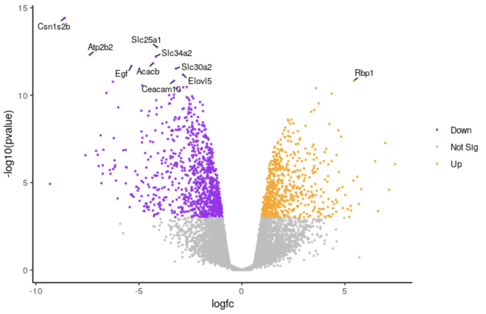
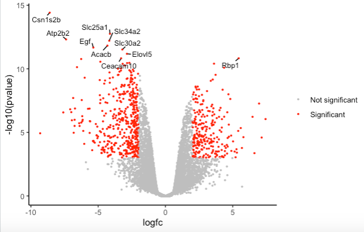

# Introduction


The [Volcano plot]() tutorial, introduced volcano plots and showed how they can be generated with the Galaxy Volcano plot tool. In this tutorial we show how you can customise a plot using the R script output from the tool.

> <agenda-title></agenda-title>
>
> In this tutorial, we will deal with:
>
> 1. TOC
> {:toc}
>
{: .agenda}

# Preparing the inputs

We will use one file for this analysis:

 * **Differentially expressed results file** (genes in rows, and 4 required columns: raw P values, adjusted P values (FDR), log fold change and gene labels).

 If you are following on from the [Volcano plot]() tutorial, you already have this file in your History so you can skip to the **Create volcano plot** step below.

## Import data

> <hands-on-title>Data upload</hands-on-title>
>
> 1. Create a new history for this exercise e.g. `Volcano plot R`
>
>    
>    
>
> 2. Import the differentially results table.
>
>    To import the file, there are two options:
>    - Option 1: From a shared data library if available (ask your instructor)
>    - Option 2: From [Zenodo](https://zenodo.org/record/2529117)
>
>    
>    
>
>    - You can paste the link below into the **Paste/Fetch** box:
>
>      ```
>      https://zenodo.org/record/2529117/files/limma-voom_luminalpregnant-luminallactate
>      ```
>
>      Check that the datatype is `tabular`.
>      If the datatype is not `tabular`, please change the file type to `tabular`.
>
>      
{: .hands_on}

Click on the  (eye) icon and take a look at the `DE results` file. It should look like below, with 8 columns.


## Create volcano plot

We will create a volcano plot colouring all significant genes. We will call genes significant here if they have FDR < 0.01 and a log2 fold change of 0.58 (equivalent to a fold-change of 1.5). These were the values used in the original paper for this dataset. We will also label the top 10 most significant genes with their gene names. We will select to output the Rscript file which we will then use to edit the plot in R.

> <hands-on-title>Create a Volcano plot</hands-on-title>
>
> 1.  to create a volcano plot
>    -  *"Specify an input file"*: the de results file
>    -  *"File has header?"*: `Yes`
>    -  *"FDR (adjusted P value)"*: `Column 8`
>    -  *"P value (raw)"*: `Column 7`
>    -  *"Log Fold Change"*: `Column 4`
>    -  *"Labels"*: `Column 2`
>    -  *"Significance threshold"*: `0.01`
>    -  *"LogFC threshold to colour"*: `0.58`
>    -  *"Points to label"*: `Significant`
>        -  *"Only label top most significant"*: `10`
>    - In *"Output Options"*:
>        -  *"Output Rscript?"*: `Yes`
{: .hands_on}

Click on the PDF file name to check that you see a plot like below.

{: width="60%"}

Now we will customise the plot by editing the R code in RStudio. You can use Galaxy RStudio if available or another R such as RStudio Cloud or RStudio installed on your computer.

## Import files into R

We'll import the differentially expressed results input file and the RScript into R.

> <hands-on-title>Using datasets from Galaxy</hands-on-title>
>
> 1. Note the history IDs of 1) the differentially expressed results and 2) the RScript in your Galaxy history
>
> 2.  in Galaxy provides some special functions such as `gx_get` to import and export files from your history.
>
>    
>
> 3. Copy the files we need into our workspace so we can see them in the Files pane.
>
>    ```R
>    file.copy(gx_get(1), "de-results.tsv") # will copy dataset number 1 from your history, use the correct ID for your differentially expressed results dataset.
>    file.copy(gx_get(3), "volcano.R") # will copy dataset number 3 from your history, use the correct ID for your Rscript dataset.
>    ```
>
> 4. Click on `volcano.R` in the Files pane to open it in the Editor pane.
>
{: .hands_on}


We'll have a look at the script.

## Set up script

The first few lines from `# Galaxy settings start` to `# Galaxy settings end` are settings needed to run the Volcano plot tool in Galaxy. We don't need them to run the script in R so we will delete them. If we don't delete the error handling line, the R session will crash if we encounter any error in the code. It's ok as it will resume again where we were but better to not have this happen.

> <hands-on-title>Delete unneeded lines</hands-on-title>
>
> Delete these lines from the top of the script.
>
>    ```R
>    # Galaxy settings start ---------------------------------------------------
>
>    # setup R error handling to go to stderr
>    options(show.error.messages = F, error = function() {cat(geterrmessage(), file = stderr()); q("no", 1, F)})
>
>    # we need that to not crash galaxy with an UTF8 error on German LC settings.
>    loc <- Sys.setlocale("LC_MESSAGES", "en_US.UTF-8")
>
>    # Galaxy settings end -----------------------------------------------------
>    ```
>
{: .hands_on}

We'll check if we have the packages the script needs. We can see the packages used in the lines that have `library(package)`

```R
library(dplyr)
library(ggplot2)
library(ggrepel)
```

When we launched Galaxy RStudio there was information in the Console letting us know that some packages are pre-installed. These packages include `ggplot2` and `dplyr`. In this Galaxy there is a yellow warning banner across the top of the script saying `Package ggrepel required is not installed. Install. Don't Show Again`.
So we just need to install the `ggrepel` package.

> <hands-on-title>Install package</hands-on-title>
>
> Either click on "Install" in the yellow warning banner if present, or in the Console type
>
> ```R
> install.packages('ggrepel')
> ```
>
{: .hands_on}

We need to change the path of the differentially expressed file in the script. The path in the script is `/data/dnb03/galaxy_db/files/4/6/c/dataset_46c498bc-060e-492f-9b42-51908a55e354.dat`. This is a temporary location where the Galaxy Volcano plot tool copied the input file in order to use it, the file no longer exists there. Your path will be different. In the script change this path to `de-results.tsv` like below.

> <hands-on-title>Run script</hands-on-title>
>
> 1. Change the input file path in script
>
>    ```R
>    # change the line
>    results <- read.delim('/data/dnb03/galaxy_db/files/4/6/c/dataset_46c498bc-060e-492f-9b42-51908a55e354.dat', header = TRUE)
>
>    # to
>    results <- read.delim('de-results.tsv', header = TRUE)
>    ```
>
> 2. Highlight the code in the script and run
>
>    > <tip-title>Highlight all code and run shortcuts</tip-title>
>    > - To highlight all code type <kbd>CTRL</kbd>+<kbd>a</kbd> (or <kbd>CMD</kbd>+<kbd>a</kbd>)
>    > - To run type <kbd>CTRL</kbd>+<kbd>Enter</kbd> (or <kbd>CMD</kbd>+<kbd>Enter</kbd>)
>    {: .tip}
>
{: .hands_on}

You should see a file called `volcano_plot.pdf` appear in the Files pane. Click on it to open it and you should see a plot that looks the same as the one we generated with the Volcano Plot tool in Galaxy.

We'll delete the lines below that save the plot to a PDF file. The plots will then be produced in the Plots pane so we can more easily see the different plots we're going to make, without having to keep opening the PDF file.

> <hands-on-title>Produce plots in Plots pane</hands-on-title>
>
> 1. Delete the lines below that save the plot to a PDF file
>
>    ```R
>    # Open PDF graphics device
>    pdf("volcano_plot.pdf")
>
>    # keep the lines in between as they produce the plot
>
>    # Close PDF graphics device
>    dev.off()
>    ```
>
> 2. Highlight the code in the script and run
>
{: .hands_on}

You should now see the plot produced in the Plots pane.

# Customising the plot

## Change points colours

We'll demonstate how you can change the colours. We'll change the colour of the downregulated genes from cornflowerblue to purple. We'll change the upregulated genes from firebrick to orange.

> <hands-on-title>Change colours</hands-on-title>
>
> 1. Edit the line below in the script
>
>    ```R
>    # change the line
>    colours <- setNames(c("cornflowerblue", "grey", "firebrick"), c(down, notsig, up))
>
>    # to
>    colours <- setNames(c("purple", "grey", "orange"), c(down, notsig, up))
>    ```
>
> 2. Highlight the code in the script and run
>
>   
>
{: .hands_on}


> <tip-title>R colours</tip-title>
>
> If you want to use other colours you can see the built-in R colours with their names in [this cheatsheet](https://www.nceas.ucsb.edu/sites/default/files/2020-04/colorPaletteCheatsheet.pdf).
>
{: .tip}


## Change points size

We'll make the points a bit smaller. We'll change to 0.5.

> <hands-on-title>Change points size</hands-on-title>
>
> 1. Edit the line below in the script
>
>    ```R
>    # change the line
>    geom_point(aes(colour = sig)) +
>
>    # to
>    geom_point(aes(colour = sig), size = 0.5) +
>    ```
>
> 2. Highlight the code in the script and run
>
>   
>
{: .hands_on}


> <question-title></question-title>
>
> How could we change the transparency of the points?
>
>    > <solution-title></solution-title>
>    >
>    > We could use `alpha =`. For example
>    ```R
>    geom_point(aes(colour = sig), alpha = 0.5)
>    ```
>    >
>    {: .solution}
{: .question}


## Change labels size

We'll make the font size of the labels a bit smaller.

> <hands-on-title>Change labels text size</hands-on-title>
>
> 1. Edit the line below in the script
>
>    ```R
>    # change the line
>    geom_text_repel(data = filter(results, labels != ""), aes(label = labels),
>
>    # to
>    geom_text_repel(data = filter(results, labels != ""), aes(label = labels), size = 3,
>    ```
>
> 2. Highlight the code in the script and run
>
>   
>
{: .hands_on}


> <question-title></question-title>
>
> How could we change the number of genes labelled from 10 to 20?
>
>    > <solution-title></solution-title>
>    >
>    > We could change the 10 to 20 here
>    ```R
>    top <- slice_min(results, order_by = pvalue, n = 20)
>    ```
>    >
>    {: .solution}
{: .question}


## Change categories

We can change the categories of points we're colouring in the plot. For example, instead of using separate categories for upregulated, downregulated we could just use a single category for significant.

> <hands-on-title>Change categories</hands-on-title>
>
> 1. Change the category names to signif and notsignif
>
>    ```R
>    # change
>    down <- unlist(strsplit('Down,Not Sig,Up', split = ","))[1]
>    notsig <- unlist(strsplit('Down,Not Sig,Up', split = ","))[2]
>    up <- unlist(strsplit('Down,Not Sig,Up', split = ","))[3]
>
>    # to
>    signif <- "Significant"
>    notsignif <- "Not significant"
>    ```
>
> 2. Specify which genes are signif and notsignif
>
>    ```R
>    # change
>    results <- mutate(results, sig = case_when(
>                                fdr < 0.01 & logfc > 0.58 ~ up,
>                                fdr < 0.01 & logfc < -0.58 ~ down,
>                                TRUE ~ notsig))
>
>    # to
>    results <- mutate(results, sig = case_when(
>                                fdr < 0.01 & abs(logfc) > 0.58 ~ signif, # abs() will give us absolute values i.e. all > 0.58 and < -0.58
>                                TRUE ~ notsignif))
>    ```
>
> 3. Specify the colours for signif and notsignif
>
>    ```R
>    # change
>    colours <- setNames(c("purple", "grey", "orange"), c(down, notsig, up))
>
>    # to
>    colours <- setNames(c("grey", "red"), c(notsignif, signif))
>    ```
>
> 4. runHighlight the code in the script and
>
>   
>
{: .hands_on}


> <question-title></question-title>
>
> How would you remove the legend from the plot? You can use Google.
>
>    > <solution-title></solution-title>
>    >
>    > If you Google `remove legend ggplot2` you may find a few ways it can be done. One way is
>    >
>    > ```R
>    > p <- p + theme(legend.position = "none")
>    > ```
>    >
>    {: .solution}
{: .question}

You can save the edited script by clicking the  icon at the top of the script in RStudio or through File > Save. You can download from Galaxy RStudio from the Files pane by ticking the box beside the script name, then More > Export > Download.

> <tip-title>More plot options</tip-title>
>
> If you enter values in the Volcano Plot Galaxy tool form for Plot options, such as plot title, x and y axis labels or limits, they'll be output in the script. This is one way you could see how to customise these options in the plot.
>
{: .tip}


# Conclusion


In this tutorial we have seen how a volcano plot can be generated and customised using Galaxy and R. You can see some more possible customisations in the [RNA Seq Counts to Viz in R]() tutorial and at the [ggrepel website](https://ggrepel.slowkow.com/index.html).
