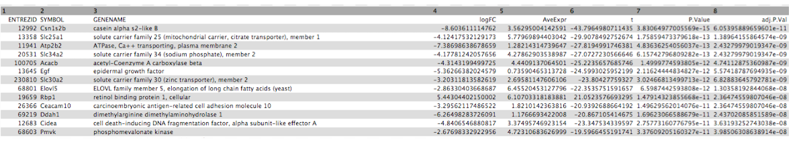
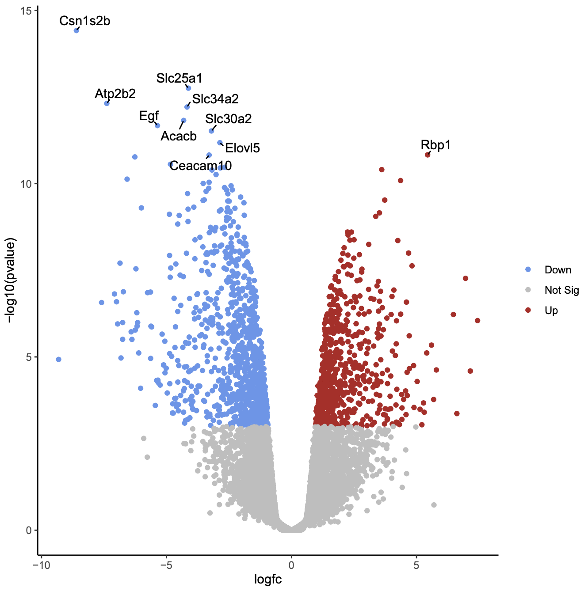
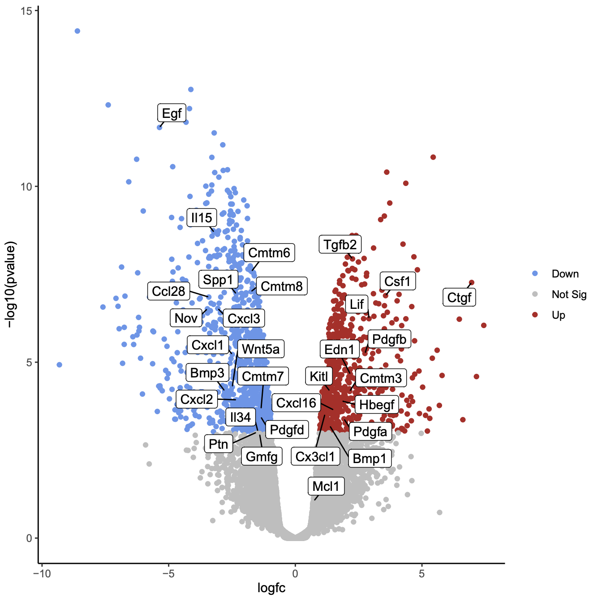

# Introduction
{:.no_toc}

Volcano plots are commonly used to display the results of RNA-seq or other omics experiments. A volcano plot is a type of scatterplot that shows statistical significance (P value) versus magnitude of change (fold change). It enables quick visual identification of genes with large fold changes that are also statistically significant. These may be the most biologically significant genes. In a volcano plot, the most upregulated genes are towards the right, the most downregulated genes are towards the left, and the most statistically significant genes are towards the top.

To generate a volcano plot of RNA-seq results, we need a file of differentially expressed results which is provided for you here. To generate this file yourself, see the [RNA-seq counts to genes]() tutorial. The file used here was generated from limma-voom but you could use a file from any RNA-seq differential expression tool, such as edgeR or DESeq2, as long as it has the required columns (see below).

The data for this tutorial comes from . This study examined the expression profiles of basal and luminal cells in the mammary gland of virgin, pregnant and lactating mice. Here we will visualize the results of the luminal pregnant vs lactating comparison.


> ### Agenda
>
> In this tutorial, we will deal with:
>
> 1. TOC
> {:toc}
>
{: .agenda}

# Preparing the inputs

We will use two files for this analysis:

 * **Differentially expressed results file** (genes in rows, and 4 required columns: raw P values, adjusted P values (FDR), log fold change and gene labels)
 * **Genes of interest file** (list of genes to be plotted in volcano)

## Import data

> ###  Hands-on: Data upload
>
> 1. Create a new history for this RNA-seq exercise e.g. `Volcano plot`
>
>    
>    
>
> 2. Import the differentially results table.
>
>    To import the file, there are two options:
>    - Option 1: From a shared data library if available (ask your instructor)
>    - Option 2: From [Zenodo](https://zenodo.org/record/2529117)
>
>    
>    
>
>    - You can paste the links below into the **Paste/Fetch** box:
>
>      ```
>      https://zenodo.org/record/2529117/files/limma-voom_luminalpregnant-luminallactate
>      https://zenodo.org/record/2529117/files/volcano_genes
>      ```
>
>    - Select *"Type"*: `tabular`
>
> 3. Check that the datatype is `tabular`.
>    If the datatype is not `tabular`, please change the file type to `tabular`.
>
>    >
>
> 4. Add a tag `#de-results` (differential expression results) to the luminal file and one called `#goi` (genes of interest) to the volcano file.
>
>    
>
{: .hands_on}

Click on the  (eye) icon and take a look at the `de-results` file. It should look like below, with 8 columns.



## Create volcano plot highlighting significant genes

First we will create a volcano plot highlighting all significant genes. We will call genes significant here if they have FDR < 0.01 and a log fold change of 0.58 (equivalent to a fold-change of 1.5). These were the values used in the original paper for this dataset.

> ###  Hands-on: Create a Volcano plot
>
> 1.  to create a volcano plot
>    -  *"Specify an input file"*: `de-results`
>    -  *"FDR (adjusted P value)"*: `Column 8`
>    -  *"P value (raw)"*: `Column 7`
>    -  *"Log Fold Change"*: `Column 4`
>    -  *"Labels"*: `Column 2`
>    -  *"Significance threshold"*: `0.01`
>    -  *"LogFC threshold to colour"*: `0.58`
>    -  *"Points to label"*: `None`
{: .hands_on}

{: width="60%"}

In the plot above the genes are coloured if they pass the thresholds for FDR and Log Fold Change, red if they are upregulated and blue if they are downregulated. You can see in this plot that there are many (hundreds) of significant genes in this dataset.

> ###  Question
>
> Why does the y axis use a negative P value scale?
>
>    > ###  Solution
>    >
>    > The negative log of the P values are used for the y axis so that the smallest P values (most significant) are at the top of the plot.
>    >
>    {: .solution}
{: .question}

## Create volcano plot labelling top significant genes

You can also choose to show the labels (e.g. Gene Symbols) for the significant genes with this volcano plot tool. You can select to label all significant or just the top genes. The top genes are those that pass the FDR and logFC thresholds that have the smallest P values. As there are hundreds of significant genes here, too many to sensibly label, let's label the top 10 genes.

> ###  Hands-on: Create a Volcano plot labelling top genes
> 1. Use the **Rerun**  button in the History to rerun **Volcano Plot**  with the same parameters as before except:
>    -  *"Points to label"*: `Significant`
>        -  *"Only label top most significant"*: `10`
{: .hands_on}


{: width="60%"}

As in the previous plot, genes are coloured if they pass the thresholds for FDR and Log Fold Change, (red for upregulated and blue for downregulated) and the top genes by P value are labelled. Note that in the plot above we can now easily see what the top genes are by P value and also which of them have bigger fold changes.

> ###  Question
>
> Which gene is the most statistically significant with large fold change?
>
>    > ###  Solution
>    >
>    > Csn1s2b, as it is the gene nearest the top of the plot and it is also far to the left. This gene is a calcium-sensitive casein that is important in milk production. As this dataset compares lactating and pregnant mice, it makes sense that it is a gene that is very differentially expressed.
>    >
>    {: .solution}
{: .question}

## Create volcano plot labelling genes of interest

We can also label one or more genes of interest in a volcano plot. This enables us to visualize where these genes are in terms of significance and in comparison to the other genes. In the original paper using this dataset, there is a heatmap of 31 genes in Figure 6b (see the tutorial [here]() if you would like to see how to generate the heatmap). These genes are a set of 30 cytokines/growth factor identified as differentially expressed, and the authors' main gene of interest, Mcl1. These genes are provided in the `goi` file and shown below. We will label these genes in the volcano plot. We'll add boxes around the labels to highlight the gene names.

{: height="25%"}

> ###  Hands-on: Create a Volcano plot labelling genes of interest
> 1. Use the **Rerun**  button in the History to rerun **Volcano Plot**  with the same parameters as before except:
>    -  *"Points to label"*: `Input from file`
>        -  *"File of labels"*: `goi`
>    - In *"Plot Options"*:
>     -  *"Label Boxes"*: `Yes`
{: .hands_on}

{: width="60%"}

> ###  Question
>
> 1. How many of the genes of interest are significant?
> 2. Which gene of interest is the most statistically significant?
>
>    > ###  Solution
>    >
>    > 1. 29/31 are significant, the genes not in the grey area. 
>    > 2. The Egf gene is the most statistically significant as it is nearest the top of the plot.
>    >
>    {: .solution}
{: .question}


As in the previous plots, genes are coloured if they pass the thresholds for FDR and Log Fold Change. Here all the genes of interest are significant (red or blue) except for two genes, Mcl1 and Gmfg. Gmfg, has an FDR just very slightly outside the significance threshold we used of 0.01 (0.0105). Mcl1 is the authors' gene of interest and they showed that while it's expression did increase at the protein level, it did not increase at the transcription level, as we can see here, suggesting it is regulated post-transcriptionally. 

> ###  Tip: R code
>
> You can get the R code used to generate the plot under *Output Options* in the tool form. You can edit this code in R if you want to customise the plot. See the [Visualization of RNA-Seq results with Volcano Plot in R]() tutorial for how to do this.
>
{: .tip}

# Conclusion
{:.no_toc}

In this tutorial we have seen how a volcano plot can be generated from RNA-seq data and used to quickly visualize significant genes.
