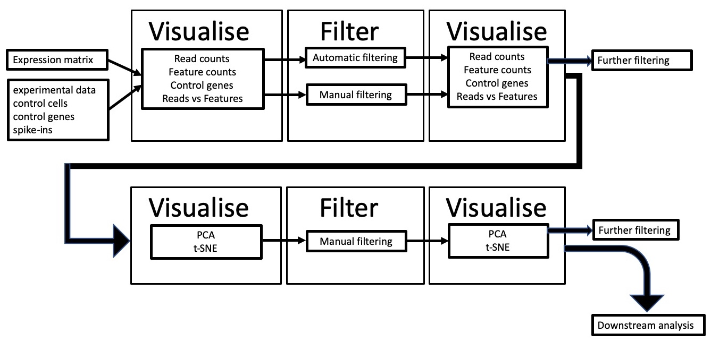
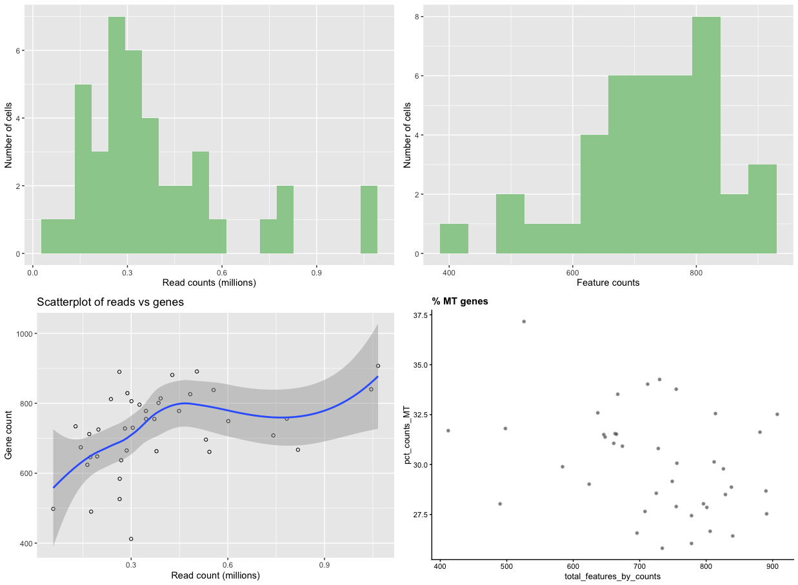
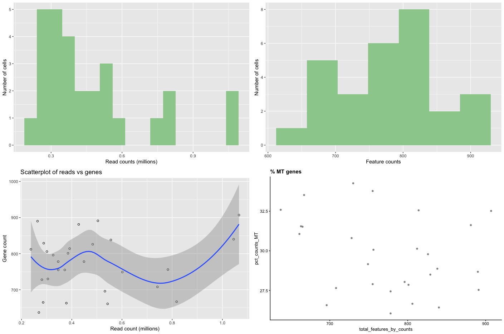
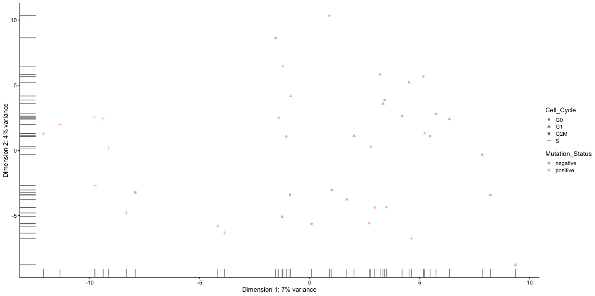

# Introduction
{:.no_toc}

Single-cell RNA-seq (scRNA-seq) is emerging as a promising technology for analysing variability in cell populations. However, the combination of technical noise and intrinsic biological variability makes detecting technical artefacts particularly challenging. Removal of low-quality cells and detection of technical artefacts is critical for accurate downstream analysis.

A number of factors should be examined before downstream analyses, many of which we'll address here:

- **Low library size**: When cells are very degraded or absent from the library preparation, the number of reads sequenced from that library will be very low. It's important to remove these cells from downstream analyses.

- **Low number of expressed genes**: A low number of expressed genes may be a result of poor-quality cells (e.g. dying, degraded, damaged, etc.), followed by high PCR amplification of the remaining RNA. Again, these cells should be removed from downstream analyses.

- **High mitochondrial gene content**: High concentrations of mitochondrial genes is often a result of damaged cells where the endogenous RNA escapes or degrades. As mitochondria has its own cell membranes, it is often the last DNA/RNA in damaged cells to degrade and hence occurs in high quantities during sequencing.

- **Batch effect**: Large scRNA-seq projects usually need to generate data across multiple batches due to logistical constraints. However, the processing of different batches is often subject to variation, e.g., changes in operator, differences in reagent quality and concentration, the sequencing machine used, etc. This results in systematic differences in the observed expression in cells from different batches, which we refer to as “batch effects”. Batch effects are problematic as they can be major drivers of variation in the data, masking the relevant biological differences and complicating interpretation of the results.

We will use *scater* () to visualise scRNA-seq data, obtaining information about the factors mentioned above, filter out low-quality cells and confirm that filtering has worked. We'll then look at confounding factors such as batch effect to see if the data is biased to any technical artifacts.


> ### Agenda
>
> In this tutorial, we will cover:
>
> 1. TOC
> {:toc}
>
{: .agenda}


# Overview
We will use a pre-calculated expression matrix, along with some additional metadata such as lists of mitochondrial genes and annotation of technical information for each sequencing library. We will plot the data and carry out quality control filtering based on the visualise-filter-visualise paradigm of this approach (see workflow below).




# Data upload

> ###  Hands-on: Data upload
>
> 1. Create a new history for this tutorial
> 2. Import the files from [Zenodo](https://zenodo.org/record/3386291) or from the shared data library
>
>    ```
>    https://zenodo.org/record/3386291/files/annotation.txt
>    https://zenodo.org/record/3386291/files/counts.txt
>    https://zenodo.org/record/3386291/files/mt_controls.txt
>    ```
>
>    
>    
>
{: .hands_on}

# Visualise the data

Take a look at the uploaded data by clicking on the  symbol for each dataset.

- The `counts.txt` file is a 40-sample expression matrix. Each sample (Cell_001 - Cell_040) is listed as the column headers and the start of each row is a gene name. The rest of the data refers to the number of reads mapped to each gene/sample.
- `annotation.txt` is a file listing experimental information about each cell. Parameters here include `Mutation_Status`, `Cell_Cycle`, and `Treatment`. These will be useful for looking at  batch effects later.
- The `mt_controls.txt` file is a list of mitochondrial genes. This list will be used later to calculate the % of mitochondrial reads in each sequencing library.


> ###  Hands-on: Calculate QC metrics
>
> 1. **Scater: Calculate QC metrics**  with the following parameters:
>    -  *"Expression matrix in tabular format"*: `counts.txt` (Input dataset)
>    -  *"Format dataset describing the features in tabular format"*: `annotation.txt` (Input dataset)
>    -  *"Dataset containing the list of the mitochondrial control genes"*: `mt_controls.txt` (Input dataset)
>
>    > ###  Comment
>    >
>    > The output of this tool is a SingleCellExperiment object in [Loom](http://loompy.org/) format, which contains all the information from the input files, along with a host of other quality control metrics, calculated from the input data.
>    {: .comment}
>
{: .hands_on}

Next, lets take a look at the data by plotting various properties to see what our data looks like.

> ###  Hands-on: Plot library QC
>
> 1. **Scater: plot library QC**  with the following parameters:
>    -  *"Input SingleCellLoomExperiment dataset"*: `output_loom` (output of **Scater: Calculate QC metrics** )
>     -  *"Plot on log scale"*: `No`
>
> 2. If we have a large number of cells (500+), set the 'Plot on log scale' option to 'Yes'. This will make it easier to pick cut-offs when dealing with large numbers. When the tool has finished running, click on the  to view the plots. If it doesn't appear in the browser, you may have to download it and view it externally. You should be presented with plots similar to those below.
>    
>
>    > ###  Comment
>    >
>    > There are four plots, two distribution bar plots and two scatter plots.
>    > The first distribution plot is the number of reads in each library (from a single cell).
>    > The second plot is the distribution of *feature counts* per cell. Feature counts in this case refers to the number of genes expressed in each cell.
>    > The third plot **Scatterplot of reads vs genes** is a combination of the two barplots, in that it plots both the read count and the expressed gene count for each cell.
>    > The final scatterplot is the **% MT genes**, which plots the number of genes expressed verses the percentage of those genes that are mitochondrial genes.
>    {: .comment}
>
>    Let's look at each plot in turn and see what it tells us.
>    - **Read counts**. You can see that there are a few cells that have less than ~200,000 reads, with other cells having up to one million reads. Although 200,000 reads is still quite a lot and we wouldn't want to get rid of so much data, we might want to think about removing cells that only contain a smaller number of reads (say, 100,000).
>    - **Feature counts**. Similar to the read counts plot, we see a few cells that have a very low number of expressed genes (<600), then followed by a more even distribution.
>    - **Scatterplot of reads vs genes**. This takes the information provided in the two distribution plots above and creates a scatterplot from them. The really poor-quality cells are represented by the points near the intersection of the x and y axis, being data with low read count and low gene count. These are the cells we want to remove during filtering.
>    - **% MT genes**. You can see from the plot that there are a few cells outside the main "cloud" of datapoints. Some of these could be removed by filtering out cells with low feature counts, but others might need to be removed by mitochondrial content, such as the cell around 37.5%
>
{: .hands_on}

# Filtering

## Manual filtering

In the **Scater: filter SCE** Galaxy tool there are two filtering methods available. First, there's an "automatic" filtering method that uses PCA to identify outliers cells and remove them from the data. This is particularly useful for very large datasets (hundreds of samples). Second, there's a manual filtering method where users can put a range of filtering parameters, informed by the previous plotting tool.
Here, we'll use the manual filtering method.

> ###  Hands-on: Filtering with scater
>
> 1. **Scater: filter SCE**  with the following parameters:
>    -  *"Input SingleCellLoomExperiment dataset"*: `output_loom` (output of **Scater: Calculate QC metrics** )
>    - *"Type of filter"*: `manual`
>        - *"Number of reads mapped to a gene for it to be counted as expressed"*: `4.0`
>        - *"Minimum library size (mapped reads) to filter cells on"*: `100000`
>        - *"Minimum number of expressed genes to filter cells on"*: `500`
>        - *"Maximum % of mitochondrial genes expressed per cell"*: `35.0`
>
>    > ###  Comment
>    >
>    > Let's have a look at the parameters and their values:
>    > 1. *"Number of reads mapped to a gene for it to be counted as expressed"*: by default, only one read needs to be mapped to a gene for it to be counted as "expressed". We can be a little bit more stringent here and increase the number of reads that need to be mapped to a gene for it to be categorised as "expressed".
>    > 2. *"Minimum library size (mapped reads) to filter cells on"*: This value asks how many mapped reads from each cell do you require to be mapped to your genome to be included in downstream analysis. We can see from our plots that we have a few cells that have less than 200,000 reads. 200,000 can still be quite a lot of reads (depending on the experiment), but we can use a smaller number to see what the initial effect of filtering is. Initially, use 100,000 as the value here.
>    > 3. *"Minimum number of expressed genes"*: You can see that some cells only express a few hundred genes, so we'll remove these cells also.
>    > 4. *"Maximum % of mitochondrial genes expressed per cell"*. You can see that as well as having one obvious outlier (~37%).
>    {: .comment}
>
>
{: .hands_on}


> ###  Hands-on: Plot library QC after filtering
>
> 1. **Scater: plot library QC**  with the following parameters:
>    -  *"Input SingleCellLoomExperiment dataset"*: `output_loom` (output of **Scater: filter SCE** )
>
{: .hands_on}



> ###  Comment
>
> How did the filtering go? Do you think it's done a good job? Have you removed too many cells? Too few cells? About right?
>
> Often, it's a matter of trial and error, where you would start off by being quite lenient (low parameters) and then increasing the stringency until you're happy with the results. Using the initial Calculate QC metrics file, play around with the filtering parameters and visualise the output to see the effect different paramters have.
>
{: .comment}

## Automatic (PCA) filtering

Another filtering approach is to identify outliers in the data and remove them. PCA can be run once a SingleCellExperiment object has been normalised, and outliers cells identified based on the pre-computed quality control metrics within the SingleCellExperiment object.

As we are using a rather small test dataset, it's unlikely that PCA filtering will make any difference; for a larger, noisier dataset this is what we would perform instead:

> ###  Hands-on: Task description
> 1. **Scater: filter SCE**  with the following parameters:
>    -  *"Input SingleCellLoomExperiment dataset"*: `output_loom` (output of **Scater: Calculate QC metrics** )
>    - *"Type of filter"*: `automatic`
>
>    > ###  Comment
>    >
>    > The data will be normalised and then PCA ran on it using the following information from the data:
>    > * `pct_counts_top_100_features`
>    > * `total_features_by_counts`
>    > * `pct_counts_feature_control`
>    > * `total_features_feature_control`
>    > * `log10_total_counts_endogenous`
>    > * `log10_total_counts_feature_control`
>    >
>    > When using these filtering approaches, it is sometimes good to try running them in reverse - try PCA filtering first and then if that doesn't remove enough low-quality cells then use the manual filtering. We could actually pipeline them together - use PCA filtering first and then use the output of that to do further manual filtering.
>    {: .comment}
>
{: .hands_on}

As discussed previously, technical artefacts can bias scRNA-seq analyses. Strong batch effects can mask real biological differences in the data, so must be identified and removed from the data. Logging meta-data details such as date of library construction, sequencing batch, sample name, technical replicate, plate number, etc., is essential to identify batch effects in the data. We can use this information to visualise the data to examine it for clustering according to batch, rather than any real biological feature.

> ###  Hands-on: PCA plot
> 1. **Scater: PCA plot**  with the following parameters:
>    -  *"Input SingleCellLoomExperiment dataset"*: `output_loom` (output of **Scater: filter SCE** )
>    - *"Feature (from annotation file) to colour PCA plot points by"*: `Mutation_Status`
>    - *"Feature (from annotation file) to shape PCA plot points by"*: `Cell_Cycle`
>
>
{: .hands_on}



> ###  Questions
>
> 1. Do you see any obvious batch effect?
> 2. Do any of the categories suggesting some sort of technical artefact?
>
> > ###  Solution
> >
> > 1. We can see that the **S** and **G2M** categories in **Cell\_Cycle** cluster away from the rest of the data. Spend some time thinking about whether this might be a batch effect or biologically significant.
> >
> {: .solution}
>
{: .question}


# Conclusion
{:.no_toc}
We have gone through the process of filtering low-quality data from an scRNA-seq expression matrix, using the visualise-filter-visualise paradigm, which proves to be a very effective way of quality-controlling scRNA-seq data. Cells that have low read-coverage, low expression values, or high mitochondrial gene expression have been filtered out. We have then examined ways of looking at confounding factors to examine batch effects in our data.
The workflow available from the "Supporting Materials" of this tutorial can be directly imported and used or adapted to a specific analysis.
