# Introducción
{:.no_toc}

Has hecho el trabajo para crear una matriz de células únicas, con recuentos de genes y mitocondrias y con grupos de metadatos celulares de todas tus variables de interés (si no, por favor consulta [este tutorial]() para hacerlo). Ahora analizaremos completamente nuestros datos para eliminar las células con poca calidad, para reducir las dimensiones de los datos que dificultan el trabajo, y finalmente, para intentar definir nuestros agrupamientos ¡y darles significado biológico! Hay muchos paquetes para analizar datos de células únicas - Seurat , Scanpy , Monocle , Scater , etc. Aquí trabajaremos con Scanpy porque es la opción con más herramientas disponibles en Galaxy.

> ###  ¿Tutoriales por todos lados?
> Este tutorial es similar a otro tutorial fantástico: [Clustering 3k PBMC](). Este tutorial profundiza mucho más en el análisis, en particular en la visualización y la ciencia tras la identificación de marcadores. Todos los pasos se ilustran a la perfección ya que los datos experimentales están limpios y bien anotados. Aquí, trabajaremos con datos más desorganizados para ayudarte a tomar decisiones durante el análisis. Te recomendamos que sigas los tutoriales de célula única disponibles para aumentar tu confianza y experiencia. Para instructores: ten en cuenta que este tutorial dispone de opciones para grupos pequeños.
{: .comment}

> ### Agenda
>
> En este tutorial cubriremos:
>
> 1. TOC
> {:toc}
>
{: .agenda}

## Obtener datos

Te proporcionamos un conjunto de datos experimentales de ratón de restricción en el crecimiento fetal . Este es el conjunto de datos generado a partir de [este tutorial](https://training.galaxyproject.org/training-material/topics/transcriptomics/tutorials/droplet-quantification-preprocessing/tutorial.html) si usaste los ficheros FASTQ completos en vez de los reducidos (ver el estudio del Single Cell Expression Atlas [aquí](https://www.ebi.ac.uk/gxa/sc/experiments/E-MTAB-6945/results/tsne) y todos los datos del proyecto [aquí](https://www.ebi.ac.uk/arrayexpress/experiments/E-MTAB-6945/)). Puedes encontrar estos datos en este [historial de entrada](https://humancellatlas.usegalaxy.eu/u/wendi.bacon.training/h/filter-plot-and-explore-single-cell-rna-seq-data---input) o descargarlo del link a Zenodo que aparece más abajo.

> ###  Práctica: Subir o cargar los datos
>
> 1. Crear un nuevo historial para este tutorial
> 2. Importar el objeto AnnData de [Zenodo]({{ page.zenodo_link }})
>
>    ```
>    {{ page.zenodo_link }}/files/Mito-counted_AnnData
>    ```
>
>    
>
> 3. **Cambiar nombre**  de los conjuntos de datos `Mito-counted AnnData`
> 4. Verificar que el tipo o formato de los datos es `h5ad`
>
>    
>
{: .hands_on}

# Filtrado

Has generado un objeto anotado de tipo AnnData a partir de tus archivos FASTQ de secuenciación de ARN de células únicas sin procesar. Sin embargo, sólo has completado un filtrado “aproximado” de tus datos - todavía hay muchas “celdas” que son fondos procedentes de gotas vacías o simplemente de baja calidad. Habrá también genes que podrían ser artefactos o que aparecen con tan baja frecuencia que las herramientas estadísticas fallan al analizarlos. Este ruido tanto en las células como en los genes no sólo hace difícil distinguir la información biológica real del ruido, sino que también intensifica la parte computacional del análisis. ¡Las lecturas espurias consumen gran parte de la capacidad computacional de analizar! Lo primero que tenemos que hacer pues es filtrar la matriz para obtener datos limpios y poder extraer información significativa para acelerar el análisis.

> ###  Preguntas
>
> 1. ¿Qué información se almacena en tu objeto AnnData? La última herramienta para generar este objeto contó los genes asociados a la mitocondria en tu matriz. ¿Dónde están almacenados los datos?
> 2. Mientras lo averiguas, ¿cuántos genes y células hay en tu objeto?
>
>   > ###  Pista
>   > Es preferible usar la misma herramienta que usaste en el tutorial previo para examinar tu AnnData, porque ¡no es tan sencillo como examinar el conjunto de datos Anndata en el historial!
>   >
>   >   > ###  Práctica: Inspeccionando objetos AnnData
>   >   >
>   >   > 1.  con los siguientes parámetros:
>   >   >    -  *"Annotated data matrix"*: `Mito-counted AnnData`
>   >   >    - *"What to inspect?"*: `General information about the object`
>   >   > 2.  con los siguientes parámetros:
>   >   >    -  *"Annotated data matrix"*: `Mito-counted AnnData`
>   >   >    - *"What to inspect?"*: `Key-indexed observations annotation (obs)`
>   >   > 3.  con los siguientes parámetros:
>   >   >    -  *"Annotated data matrix"*: `Mito-counted AnnData`
>   >   >    - *"What to inspect?"*: `Key-indexed annotation of variables/features (var)`
>   >   {: .hands_on}
>   {: .tip}
> > ###  Respuestas
> >
> > 1. Si examinas tu objeto AnnData encontrarás un número de métricas de control de calidad diferentes tanto para células  **obs** como  genes **var**.
> >   - Por ejemplo, puedes ver `n_cells` bajo **var**, que cuenta el número de células en las que aparece el gen.
> >   - En **obs**, tienes métricas discretas y basadas en registros para `n_genes`, cuántos genes se cuentan en una célula, y `n_counts`, cuántas UMIs se cuentan por célula. Así que, por ejemplo, puedes contar múltiples GAPDHs en una célula. Por lo tanto, tu `n_counts` debería ser más alto que `n_genes`.
> >   - ¿Pero qué ocurre con la mitocondria? Dentro de la información de las células **obs**, se han calculado`total_counts_mito`,  `log1p_total_counts_mito`, y `pct_counts_mito` para cada célula.
> > 2. Puedes verlo en la salida de  **General information about the object ** que la matriz es `25281 x 35734`. Esto es `obs x vars`, o mejor, `células x genes`, así que existen `25281 células` y `35734 genes` en la matriz.
> >
> {: .solution}
>
{: .question}

 **Buen consejo para ahorrar tiempo** - ¡convierte las tres salidas de **Inspect AnnData** señaladas arriba en un workflow para tener acceso rápido!



## Generar gráficos de control de calidad

Queremos filtrar nuestras células, pero primero necesitamos saber cómo se ven nuestros datos. Hay un número de elecciones subjetivas por hacer en el análisis de scRNA-seq, por ejemplo ahora necesitamos nuestras mejores decisiones basadas en dónde establecer nuestros umbrales (¡más sobre eso, muy pronto!). Vamos a graficar nuestros datos en distintas formas. Distintas personas dedicadas a la bioinformática podrían preferir ver los datos de formas diferentes, y acá sólo estamos generando algunos de la miríada de gráficos que se pueden usar. En última instancia, necesitas avanzar con lo que tenga más sentido para ti.

 **Buen consejo para ahorrar tiempo** - ¡convierte los siguientes gráficos QC en un workflow así puedes ejecutarlos de nuevo fácilmente mientras analizas tus datos!

### Creando los gráficos

> ###  Práctica: Haciendo gráficos QC
>
> 1.  con los siguientes parámetros:
>    -  *"Annotated data matrix"*: `Mito-counted AnnData`
>    - *"Method used for plotting"*: `Generic: Violin plot, using 'pl.violin'`
>        - *"Keys for accessing variables"*: `Subset of variables in 'adata.var_names' or fields of '.obs'`
>            - *"Keys for accessing variables"*: `log1p_total_counts,log1p_n_genes_by_counts,pct_counts_mito`
>        - *"The key of the observation grouping to consider"*: `genotype`
>
> 2. **Cambiar nombre**  salida `Violin - genotype - log`
>
> 3.  con los siguientes parámetros:
>    -  *"Annotated data matrix"*: `Mito-counted AnnData`
>    - *"Method used for plotting"*: `Generic: Violin plot, using 'pl.violin'`
>        - *"Keys for accessing variables"*: `Subset of variables in 'adata.var_names' or fields of '.obs'`
>            - *"Keys for accessing variables"*: `log1p_total_counts,log1p_n_genes_by_counts,pct_counts_mito`
>        - *"The key of the observation grouping to consider"*: `sex`
>
> 4. **Cambiar nombre**  de salida a `Violin - sex - log`
>
> 5.  con los siguientes parámetros:
>    -  *"Annotated data matrix"*: `Mito-counted AnnData`
>    - *"Method used for plotting"*: `Generic: Violin plot, using 'pl.violin'`
>        - *"Keys for accessing variables"*: `Subset of variables in 'adata.var_names' or fields of '.obs'`
>            - *"Keys for accessing variables"*: `log1p_total_counts,log1p_n_genes_by_counts,pct_counts_mito`
>        - *"The key of the observation grouping to consider"*: `batch`
>
> 6. **Cambiar nombre**  de salida a `Violin - batch - log`
>
> 7.  con los siguientes parámetros:
>    -  *"Annotated data matrix"*: `Mito-counted AnnData`
>    - *"Method used for plotting"*: `Generic: Scatter plot along observations or variables axes, using 'pl.scatter'`
>        - *"Plotting tool that computed coordinates"*: `Using coordinates`
>            - *"x coordinate"*: `log1p_total_counts`
>            - *"y coordinate"*: `pct_counts_mito`
>
> 6. **Cambiar nombre**  de salida a `Scatter - mito x UMIs`
>
> 7.  con los siguientes parámetros:
>    -  *"Annotated data matrix"*: `Mito-counted AnnData`
>    - *"Method used for plotting"*: `Generic: Scatter plot along observations or variables axes, using 'pl.scatter'`
>        - *"Plotting tool that computed coordinates"*: `Using coordinates`
>            - *"x coordinate"*: `log1p_n_genes_by_counts`
>            - *"y coordinate"*: `pct_counts_mito`
>
> 8. **Cambiar nombre**  de salida a `Scatter - mito x genes`
>
> 9.  con los siguientes parámetros:
>    -  *"Annotated data matrix"*: `Mito-counted AnnData`
>    - *"Method used for plotting"*: `Generic: Scatter plot along observations or variables axes, using 'pl.scatter'`
>        - *"Plotting tool that computed coordinates"*: `Using coordinates`
>            - *"x coordinate"*: `log1p_total_counts`
>            - *"y coordinate"*: `log1p_n_genes_by_counts`
>            - *"Color by"*: `pct_counts_mito`
>
> 10. **Cambiar nombre**  de salida a `Scatter - genes x UMIs`
>
{: .hands_on}

## Analizando los gráficos

¡Eso fue mucha información! Abordemos por secciones y veamos qué preguntas pueden ayudar a resolver estos gráficos. El *scratchbook*  puede ser útil aquí para ver los distintos gráficos al mismo tiempo.



> ###  Pregunta - Variación en lote
>
> ¿Existen diferencias en la profundidad de secuenciación a lo largo de las muestras?
> 1. ¿Qué gráfico(s) da(n) cuenta de esto?
> 2. ¿Cómo lo interpretas?
>
> > ###  Respuesta
> >
> > 1. ¡El diagrama `violin - batch - log` tendrá todo lo que buscas!
> >     ")
> > 2. Teniendo en cuenta que está en escala logarítmica - lo que significa que pequeñas diferencias pueden significar grandes diferencias - la representación en forma de violín tiene probablemente un aspecto similar.
> >    - `N707` y `N703` podría presentar unos valores de conteo y de genes (o UMIs) un poco bajos, pero las diferencias no son catastróficas.
> >    - El `pct_counts_mito` se mantiene similar en los diferentes lotes, una buena señal.
> >    - En este caso, nada parece indicar que tengamos que eliminar una muestra de nuestro análisis, pero si ves algo completamente diferente del resto, ¡tendrás que cuestionarte por qué y eliminarlo de tu experimento!
> >
> {: .solution}
>
{: .question}

> ###  Pregunta - Variables biológicas
>
> ¿Hay diferencias en la profundidad de secuenciación en los diferentes sexos? ¿Genotipos?
> 1. ¿Qué gráfico aborda esto?
> 2. ¿Cómo interpretas las diferencias en `sex`?
> 3. ¿Cómo interpretas las diferencias en `genotype`?
>
> > ###  Respuesta
> >
> > 1. Al igual que anteriormente, los diagramas `violin - sex - log` y `violin - genotype - log` tendrán lo que buscas.
> >      ")
> >      ")
> > 2. No hay grandes diferencias en profundidad de secuenciación en los diferentes sexos diría yo - ¡aunque tú puedes no estar de acuerdo!
> >    - Está claro que hay menos células femeninas, cosa que tiene sentido dado que sólo una de las muestras era femenina. *Nota - esto fue un descubrimiento desafortunado tras la generación de librerías. ¡Es bastante difícil identificar el sexo de neonatos en el laboratorio! En la práctica, intenta no dejar que un factor así influya en tus datos! Podrías considerar volver a ejecutar todos los análisis que vienen a continuación sin la muestra femenina si quieres.*
> > 3. Sin embargo, en el gráfico `Violin - genotype - log`, podemos ver que hay una diferencia. Las muestras `knockout` tienen claramente menos genes y conteos. Desde el punto de vista experimental, ¿tiene esto sentido?
> >    - ¿Sería esperado desde el punto de vista biológico que esas células sean menores o tengan menos transcritos? Posiblemente, en este caso, dado que esas células fueron generadas de ratones neonatales con restricción de crecimiento y en cuyo caso no tenemos que preocuparnos sobre buenos datos, sino tener en mente esto cuando generamos agrupaciones, ya que queremos definir la profundidad de los clusters, ¡queremos que la biología lo haga!
> >    - Por otro lado, podría ser que esas células no sobrevivieron la disociación tan bien como las células sanas (en cuyo caso esperaríamos más genes asociados a la mitocondria, que no vemos, ¡así que podemos descartarlo!).
> >    - Quizás preparamos pobremente las librerías para esas muestras knockout concretamente. Hay solo tres, así que puede que esas muestras estén poco secuenciadas.
> >    - Entonces, ¿Qué hacemos con todo esto?
> >        - Idealmente, consideramos la re-secuenciación de todas las muestras pero con una concentración más alta de muestras knockout en la librería.
> > Cualquier persona experta en bioinformática te diría que la mejor forma de obtener datos limpios es en el laboratorio ¡y no en el ordenador! Desgraciadamente, las mejores prácticas no son necesariamente una opción realista en el laboratorio - por ejemplo, ¡la línea celular de ratón fue larga! - así que a veces, tenemos que obtener lo mejor de nuestros datos. Hay opciones para intentar abordar la discrepancia en la profundidad de secuenciación. Por tanto, vamos a continuar con las muestras y ver si podemos encontrar relevancia biológica a pesar de las diferencias técnicas.
> >
> {: .solution}
>
{: .question}

Ahora que hemos evaluado la diferencia en nuestras muestras, miraremos a las librerías en general para identificar los umbrales apropiados para nuestro análisis.

> ###  Pregunta - Filtrar umbrales
>
> ¿Qué umbral deberías fijar para `log1p_n_genes_by_counts`?
> 1. ¿Qué diagramas abordan esto?
> 2. ¿Qué número elegirías?
>
> > ###  Respuesta
> >
> > 1. Cualquier diagrama con `log1p_n_genes_by_counts` funcionaría aquí en realidad. Algunas personas prefieren diagramas de dispersión frente a los diagramas de violín.
> > ")
> >
> > 2. En `Scatter - mito x genes` puedes ver cómo las células con `log1p_n_genes_by_counts` hasta, quizás, `5.7` (sobre 300 genes) a menudo tienen alto `pct_counts_mito`.
> >   - Puedes representar esto como `n_counts` y ver la misma tendencia alrededor de 300 genes, pero con estos datos el formato logarítmico es más claro, y así lo presentaremos.
> >   - Podrías usar también el diagrama de violín para encontrar un umbral y por tanto también tener en cuenta los lotes. Es bueno mirar el diagrama de violín también, porque no queremos eliminar completamente una muestra de forma accidental (por ejemplo, N703 y N707).
> >   - Algunas personas expertas en bioinformática recomendarían filtrar cada muestra individualmente, pero esto es difícil a larga escala y en este caso (¡te invitamos a intentarlo! Tendrías que filtrar por separado y concatenar después), no habría una diferencia notable en la interpretación final.
> >
> {: .solution}
>
> ¿Qué umbral deberías fijar para `log1p_total_counts`?
> 1. ¿Qué diagramas abordan esto?
> 2. ¿Qué número elegirías?
>
> > ###  Respuesta
> >
> > 1. Como anteriormente, ¡cualquier diagrama con `log1p_n_total_counts` funcionaría! De nuevo, usaremos un diagrama de dispersión aquí, ¡pero puedes usar un diagram de violín si quieres!
> > ")
> >
> > 2. Podemos ver que necesitaremos fijar un umbral más alto (lo que tiene sentido, ya que esperaríamos más UMIs por célula que genes únicos). De nuevo, quizás siendo un poco agresivos en nuestros umbrales, podríamos elegir `6.3`, por ejemplo (que equivale a unos 500 conteos/célula).
> >   - En un mundo ideal, verás claramente una población de células reales separada de una clara población de células restantes. Muchas muestras, como esta, han sido poco secuenciadas y esa separación se vería probablemente mejor tras la secuenciación profunda!
> >
> {: .solution}
>
> ¿Qué umbral elegirías para `pct_counts_mito`?
> 1. ¿Qué diagramas abordan esto?
> 2. ¿Qué número elegirías?
>
> > ###  Respuesta
> >
> > 1. Cualquier plot con `pct_counts_mito` funcionaría bien, sin embargo, los diagramas de dispersión son más fáciles de interpretar. Los usaremos igual que la última vez.
> > ")
> >
> > 2. Podemos ver una tendencia clara donde las células que tienen sobre un 5% de conteo mito o superior también tienen muchos menos conteos totales. Estas células tienen baja calidad, enturbiarán nuestros datos, y han estado posiblemente sometidas a condiciones de estrés o ruptura previa a la encapsulación en la gota. Aunque el 5% es un corte bastante común, estos datos son bastante complicados, así que solo por diversión elegiremos un umbral más agresivo de un `4.5%`.
> >    - En general debes adaptar tus puntos de corte a tus datos - las células más activas metabólicamente podrían tener un RNA mitocondrial más alto, y no quieres perder parte de la población de células debido a un corte muy agresivo.
> >
> {: .solution}
{: .question}

## Aplica los umbrales

¡Es el momento de aplicar estos umbrales a tus datos! Pero primero recordemos cuántas células y genes se encuentran en tu objeto: `25281 células` y `35734 genes`. ¡Veamos cómo van cambiando estos conteos!

> ###  ¿Estás trabajando en grupo? ¡Hora decisiva!
> Si estás trabajando en grupo, en este punto puedes tomar diversas direcciones, una con un *control* y el resto con variaciones en los números con las cuales puedas comparar los resultados a lo largo de los tutoriales.
> - Control
>      - **log1p_n_genes_by_counts** > `5.7`
>      - **log1p_total_counts** > `6.3`
>      - **pct_counts_mito** < `4.5%`
> - Todos los demás: ¡Seleccionen sus propios umbrales y comparen los resultados!
{: .details}

> ###  Práctica: Filtra las células por log1p_n_genes_by_counts
>
> 1.  con los siguientes parámetros:
>    -  *"Input object in AnnData/Loom format"*: `Mito-counted AnnData`
>    - En *"Parameters to select cells to keep"*:
>        -  *"Insert Parameters to select cells to keep"*
>            - *"Name of parameter to filter on"*: `log1p_n_genes_by_counts`
>            - *"Min value"*: `5.7`
>            - *"Max value"*: `20.0`
>
> 2. **Cambiar nombre**  de salida a `Genes-filtered Object`
>
> 3.  con los siguientes parámetros:
>    -  *"Annotated data matrix"*: `Genes-filtered Object`
>    - *"Method used for plotting"*: `Generic: Violin plot, using 'pl.violin'`
>        - *"Keys for accessing variables”"*: `Subset of variables in 'adata.var_names' or fields of '.obs'`
>            - *"Keys for accessing variables"*: `log1p_total_counts,log1p_n_genes_by_counts,pct_counts_mito`
>        - *"he key of the observation grouping to consider"*: `genotype`
>
> 4. **Cambiar nombre**  de salida a `Violin - Filterbygenes`
>
> 5.  con los siguientes parámetros:
>    -  *"Annotated data matrix"*: `Genes-filtered Object`
>    - *"What to inspect??"*: `General information about the object`
>
> 6. **Cambiar nombre**  de salida a `General - Filterbygenes`
{: .hands_on}

Nota que  **Scanpy Filtercells** te permite poner  múltiples parámetros al mismo tiempo (ejm. los filtros `log1p_total_counts`, `log1p_n_genes_by_counts`,y `pct_counts_mito`) en el mismo paso. La única razón por la que no estamos haciendo eso aquí es para que puedas ver lo que cada filtro logra. Como tal, examina tu plot y la información general.

> ###  Preguntas
>
> 1. Interpreta el gráfico de violín
> 2. ¿Cuántos genes y células tienes ahora en tu objeto?
>
> > ###  Solución
> >
> > 
> > 1. La única parte que parece haber cambiado es `log1p_n_genes_by_counts`. Observa que la parte inferior del gráfico de violín está más plano - este es el umbral más bajo que se ha establecido. Idealmente, esto hubiera creado un hermoso diagrama de violín debido a que habría una clara población de células con bajo número de genes. Desafortunadamente, este no es el caso, pero sigue siendo un filtro razonable.
> > 2. Puedes ver en `General - Filterbygenes` que ahora tienes `14,501 cells x 35,734 genes`.
> >
> {: .solution}
>
{: .question}

> ###  Práctica: Filtrar células con base en log1p_total_counts
>
> 1.  con los siguientes parámetros:
>    -  *"nput object in AnnData/Loom format"*: `Genes-filtered Object`
>    - En *"Parameters to select cells to keep"*:
>        -  *"Insert Parameters to select cells to keep"*
>            - *"Name of parameter to filter on"*: `log1p_total_counts`
>            - *"Min value"*: `6.3`
>            - *"Max value"*: `20.0`
>
> 2. **Cambiar nombre**  de salida a `Counts-filtered Object`
>
> 3.  utilizando los siguientes parámetros:
>    -  *"Annotated data matrix"*: `Counts-filtered Object`
>    - *"Method used for plotting"*: `Generic: Violin plot, using 'pl.violin'`
>        - *"Keys for accessing variables"*: `Subset of variables in 'adata.var_names' or fields of '.obs'`
>            - *"Keys for accessing variables"*: `log1p_total_counts,log1p_n_genes_by_counts,pct_counts_mito`
>        - *"The key of the observation grouping to consider"*: `genotype`
>
> 4. **Cambiar nombre**  de salida a `Violin - Filterbycounts`
>
> 5.  con los siguientes parámetros:
>    -  *"Annotated data matrix"*: `Counts-filtered Object`
>    - *"What to inspect?"*: `General information about the object`
>
> 6. **Cambiar nombre**  de la salida a `General - Filterbycounts`
{: .hands_on}

> ###  Preguntas
>
> 1. Interpreta el gráfico de violín
> 2. ¿Cuántos genes y células tienes ahora en tu objeto?
>
> > ###  Solución
> >
> > 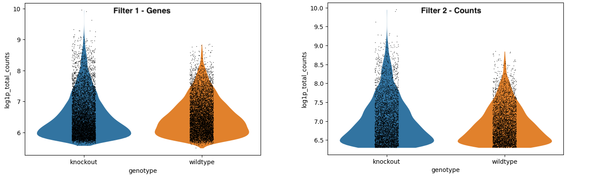
> > 1. Nos enfocaremos en `log1p_total_counts`. De manera similar a la superior, la parte inferior de la forma del violín se ha aplanado debido al umbral.
> > 2. En `General - Filterbycounts`, puedes ver que ahora tienes `7,916 cells x 35,734 genes`.
> >
> {: .solution}
>
{: .question}

> ###  Práctica: Filtrar células con base en pct_counts_mito
>
> 1.  utilizando los siguientes parámetros:
>    -  *"Input object in AnnData/Loom format"*: `Counts-filtered Object`
>    - En *"Parameters to select cells to keep"*:
>        -  *"Insert Parameters to select cells to keep"*
>            - *"Name of parameter to filter on"*: `pct_counts_mito`
>            - *"Min value"*: `0`
>            - *"Max value"*: `4.5`
>
> 2. **Cambiar nombre**  de la salida a `Mito-filtered Object`
>
> 3.  utilizando los siguientes parámetros:
>    -  *"Annotated data matrix"*: `Mito-filtered Object`
>    - *"Method used for plotting"*: `Generic: Violin plot, using 'pl.violin'`
>        - *"Keys for accessing variables"*: `Subset of variables in 'adata.var_names' or fields of '.obs'`
>            - *"Keys for accessing variables"*: `log1p_total_counts,log1p_n_genes_by_counts,pct_counts_mito`
>        - *"The key of the observation grouping to consider"*: `genotype`
>        - En *"Violin plot attributes"*:
>            - *"Add a stripplot on top of the violin plot"*: `Yes`
>                - *"Add a jitter to the stripplot"*: `Yes`
>            - *"Display keys in multiple panels"*: `No`
>
> 4. **Cambiar nombre**  de salida a `Violin - Filterbymito`
>
> 5.  con los siguientes parámetros:
>    -  *"Annotated data matrix"*: `Mito-filtered Object`
>    - *"What to inspect?"*: `General information about the object`
>
> 6. **Cambiar nombre**  de salida a `General - Filterbymito`
{: .hands_on}

> ###  Preguntas
>
> 1. Interpretar el gráfico de violín
> 2. ¿Cuántos genes y células tienes ahora en tu objeto?
>
> > ###  Solución
> >
> > 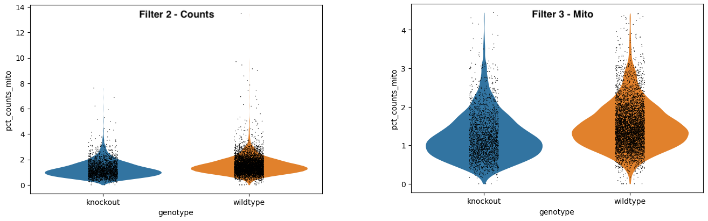
> > 1. Si observamos los ejes detalladamente podemos ver que el `pct_counts_mito` se ha reducido.
> > 2. En `General - Filterbymito`, puedes ver que ahora tienes `7,874 × cells x 35,734 genes`.
> >
> {: .solution}
>
{: .question}

Si te es de ayuda, aquí tenemos un vistazo al resumen general.
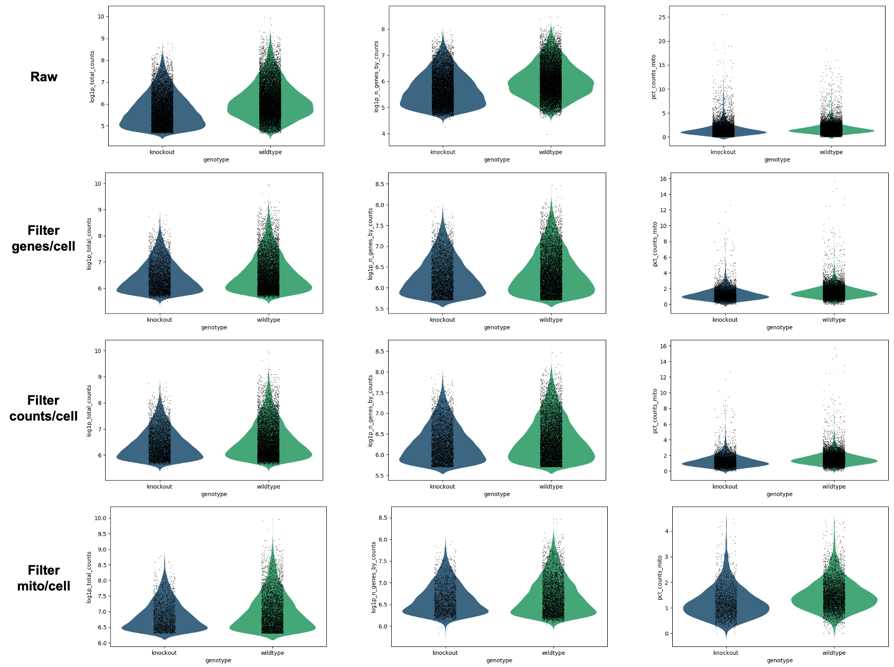

¡Excelente trabajo! Sin embargo, eliminaste un montón de células, y ya que los genes capturados son esporádicos (ejemplo, un pequeño porcentaje del transcriptoma completo por célula), esto significa que hay un número de genes en tu matriz que al momento no están en ninguna de las células restantes. Los genes que no aparecen en ninguna célula, ni siquiera en una o dos células, causarán que algunas de las herramientas analíticas funcionen incorrectamente (o dejen de funcionar) y en general, no serán informativos con respecto a la biología del fenómeno analizado. !Entonces eliminemos estos genes! Nota que `3` no es necesariamente el mejor número, más bien es un umbral bastante conservador. Podrías subir hasta 10 o más.

> ###  ¿Estás trabajando en grupo? ¡Tomemos algunas decisiones!
> Ahora pueden trabajar en equipos y hacer distintos análisis, un equipo optando por un *control* y el resto variando números de tal forma que puedan comparar resultados a lo largo de los tutoriales.
> - Variable: **n_cells**
> - Control > `3`
> - Todos los demás: ¡Escojan sus propios umbrales y comparen resultados! Noten que si dan valores menores a 3 (o si omiten este paso por completo), es muy posible que las herramientas que utilizaremos posteriormente no funcionen debido a la falta de datos de genes.
{: .details}


> ###  Práctica: Filtrado de genes
>
> 1.  con los siguientes parámetros:
>    -  *"Input object in AnnData/Loom format"*: `Mito-filtered Object`
>    - En *"Parameters to select genes to keep"*:
>        -  *"Insert Parameters to select genes to keep"*
>            - *"Name of parameter to filter on"*: `n_cells`
>            - *"Min value"*: `3`
>            - *"Max value"*: `1000000000`
>
> 2. **Cambiar nombre**  de salida a `Filtered Object`
>
> 3.  con los siguientes parámetros:
>    -  *"Matriz anotada de datos"*: `Filtered Object`
>    - *"¿Qué inspeccionar?"*: `General information about the object`
>
> 4. **Cambiar nombre**  de salida a `General - Filtered object`
{: .hands_on}

En la práctica, es muy probable que escojas umbrales y después configures el sistema para aplicar todos estos filtros omitiendo la revisión de gráficos de resultados intermedios. Sin embargo, es muy informativo ver cómo se van modificando los datos con estos filtros.

Utilizando el `General - Filtered object` final, puedes obtener un resumen de tus resultados de filtrado:

|       | Células | Genes |
|------ |--------------------|
| Datos crudos | 25281    | 35734    |
| Filtro genes/célula | 14501    | 35734    |
| Filtro conteos/célula | 7916    | 35734    |
| Filtro mito/célula | 7874   | 35734    |
| Filtro células/gene | 7874    | 14832    |

 ¡Felicitaciones, has filtrado tu objeto! Ahora será más fácil su análisis.

# Procesamiento

Por el momento tienes una matriz de 7874 células por 14832 genes. Estos son muchos datos. Tenemos dos problemas aquí - primero, ya sabes que hay diferencias en cuántos transcritos y genes han sido cuantificados por células. Esta variable técnica puede no dejar muy en claro diferencias biológicas. Segundo, nos encanta visualizar resultados en gráficos x/y. Por ejemplo, *Gapdh* puede ser uno de los ejes, y *Actin* puede ser otro, y grafica las células en los ejes bidimensionales con base en cuántos transcritos posee cada una. Esto puede ser bueno, pero añadir una tercera dimensión (o en este caso, 14830 dimensiones más) es un poco más complejo. Por tanto, nuestros siguientes pasos se enfocan en transformar nuestro enorme objeto de datos en algo que sea más fácil de analizar y visualizar.

> ###  Práctica: Normalización
>
> 1.  con los siguientes parámetros:
>    -  *"Input object in AnnData/Loom format"*: `Filtered Object`
{: .hands_on}

La normalización ayuda a reducir las diferencias entre los genes y los conteos UMI por medio del ajuste de conteos totales a 10,000 por célula. La transformación logarítmica “log-transform(by log(cont+1))” alinea de mejor manera los niveles de expresión génica a una distribución normal. Este es un procedimiento común al prepararnos para cualquier reducción de dimensionalidad.

Ahora tenemos que considerar la reducción de las dimensiones de nuestros genes. Tenemos muchísimos genes, pero no todos ellos son diferentes de célula a célula. Por ejemplo, los genes de mantenimiento (housekeeping) se caracterizan por no tener mucho cambio de célula a célula, por tanto podremos moverlos para simplificar el conjunto de datos. Marcaremos los genes que muestran variación entre células para su análisis posterior.

> ###  Práctica: Encuentra los genes variables
>
> 1.  con los siguientes parámetros:
>    -  *"Input object in AnnData/Loom format"*: `output_h5ad` (salida de  **Scanpy NormaliseData** )
>    - *"Flavor of computing normalised dispersion"*: `Seurat`
{: .hands_on}

Ahora vamos a escalar nuestros datos de tal manera que todos los genes tengan la misma varianza y cero de media. Es importante configurar nuestros datos para reducciones de dimensionalidad subsecuentes. También ayuda a anular las diferencias de profundidad de secuenciación entre muestras. Nota que las diferencias de escala, entre otras, no son los valores que tendrás al final (ejemplo, si tu célula tiene niveles promedio de GAPDH), no aparecerá como ‘0’ cuando calcules las diferencias de genes entre clusters.

> ###  Práctica: Escalar datos
>
> 1.  utilizando los siguiente parámetros:
>    -  *"Input object in AnnData/Loom format"*: `output_h5ad` (salida de **Scanpy FindVariableGenes** )
>    - *"Truncate to this value after scaling"*: `10.0`
{: .hands_on}

 ¡Felicitaciones, has procesado tu objeto!

# Preparación de coordenadas

Seguimos teniendo demasiadas dimensiones. Los cambios de transcritos usualmente no son singulares, es decir, los genes estaban en rutas (metabólicas, biológicas, etc.) y en grupos. Sería más fácil analizar nuestros datos si pudiéramos agrupar estos cambios.


## Componentes principales
Los componentes principales se calculan a partir de datos con alta dimensionalidad para poder encontrar la mayor dispersión en el conjunto de datos. Así es que, en nuestras `2262` dimensiones con gran variabilidad, tendremos una línea (eje) que refleje la mayor dispersión y variación a través de las células. Ese será nuestro Componente Principal. Podemos calcular los primeros componentes principales `x` en nuestros datos para reducir drásticamente el número de dimensiones.

> ###  ¿2262?
> ¿De dónde proviene el `2262`? La forma más rápida de figurar cuantos genes tienes con alta variabilidad, en mi opinión, es volver a ejecutar  la herramienta **Scanpy FindVariableGenes** y seleccionar el parámetro *Remove genes not marked as highly variable* (“eliminar genes que no están marcados con alta variabilidad”). Después puedes inspeccionar el objeto resultante y verás que hay sólo 2262 genes. En los siguientes pasos el proceso únicamente utilizará los genes con alta variabilidad para realizar sus cálculos, pero como regla general, te recomiendo encarecidamente que incluyas los genes no variables (ejemplo, utiliza la salida general de tu herramienta FindVariableGenes, la cual contiene más de 2262 genes). Este tutorial no funcionará al final de la etapa de graficación si únicamente utilizas solo los 2262 o 2000 genes con alta variabilidad (si es que le impones algún límite).

{: .comment}

> ###  Práctica: Cálculo de los Componentes Principales
>
> 1.  utilizando los siguientes parámetros:
>    -  *"Input object in AnnData/Loom format"*: `output_h5ad` (salida de **Scanpy ScaleData** )
>    - *"Number of PCs to producer"*: `50`
>
> 2.   utilizando los siguientes parámetros:
>    -  *"Annotated data matrix"*: `output_h5ad` (salida de **Scanpy RunPCA** )
>    - *"Method used for plotting"*: `PCA: Scatter plot in PCA coordinates, using 'pl.pca_variance_ratio'`
>        - *"Number of PCs to show"*: `50`
>
> 3. **Cambiar nombre**  del gráfico de salida a `PCA Variance`
{: .hands_on}

¿Te cuestionas el por qué 50 Componentes Principales? Bueno, estamos bastante seguros de que 50 es una sobreestimación. Examina `PCA Variance`.

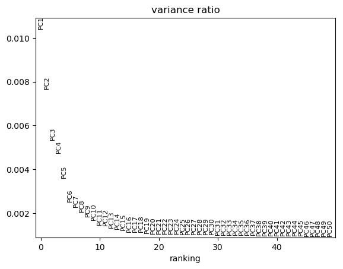

Podemos ver que en realidad no existe mucha variación que pueda ser explicada una vez que pasamos del componente 19. Así es que nos ahorraremos un buen de tiempo y datos confusos si nos enfocamos en los primeros `20` CPs.

## Gráfico de vecindad

En este punto seguimos enfocándonos en aproximadamente 20 dimensiones. Necesitamos identificar qué tan similar es una célula comparada con otra, esto a través de cada célula y a través de estas dimensiones. Para esto, utilizaremos el gráfico de “k-nearest neighbor” (kNN - k vecindades más cercanas), para identificar qué células se encuentran más cercanas unas de otras y cuáles no. El gráfico kNN muestra las conexiones entre las células si sus distancias son casi las k-ésimas distancias más cortas de esa célula con respecto a las otras (¡cuando son graficadas en este espacio de 20 dimensiones). Esto será crucial para identificar clusters, y es necesario para graficar un UMAP. Asignar valores mayores de vecindad dará pie a la preservación de una estructura más global a costa de la pérdida de una estructura local detallada. En general, a este parámetro frecuentemente se le asignan valores entre el 5 y el 50, con la opción de asignar por defecto valores de 10 a 15](https://github.com/lmcinnes/umap).

> ###  ¿Estás trabajando en grupos? ¡Tomemos decisiones!
> Si estás trabajando en grupos ahora pueden dividir el trabajo, unos pueden trabajar con un  *control* y el resto trabajar con distintos números para que puedan comparar sus resultados posteriormente por lo que resta del tutorial.
> - Control
>      - **Number of PCs to use** = `20`
>      - **Maximum number of neighbours used** = `15`
> - Todos los demás: Utiliza el gráfico de varianza de CP para seleccionar tu propio número de CP y selecciona tu propio número máximo de vecinos a utilizar.
{: .details}

> ###  Práctica: Cómputo de gráfico - ComputeGraph
>
> 1.  utilizando los siguientes parámetros:
>    -  *"Input object in AnnData/Loom format"*: `output_h5ad` (salida de **Scanpy RunPCA** )
>    - *"Use programme defaults"*:  `No`
>    - *"Maximum number of neighbours used"*: `15`
>    - *"Number of PCs to use"*: `20`
{: .hands_on}

## Visualización de la reducción de dimensionalidades

Dos visualizaciones importantes en estos datos son tSNE y UMAP. Debemos calcular las coordenadas para ambos antes de la visualización. Para tSNE, el parámetro [**perplexity**](https://www.nature.com/articles/s41467-019-13056-x) puede ser cambiado de tal manera que represente de mejor forma a los datos, mientras que para UMAP el cambio principal sería el modificar en sí mismo el gráfico kNN, por medio del cambio de **neighbours** (vecinos).

> ###  ¿Estás trabajando en grupos? ¡Tomemos decisiones!
> Si estás trabajando en grupos ahora pueden dividir el trabajo, unos pueden trabajar con un *control* y el resto trabajar con distintos números para que posteriormente puedan comparar sus resultados por lo que resta del tutorial.
> - Control
>      - **Perplejidad** = `30`
> - Todos los demás: Seleccionen su propia perplejidad, ¡entre 5 y 50!
{: .details}

> ###  Práctica: Cálculo de  tSNE y UMAP
>
> 1.  utilizando los siguientes parámetros:
>    -  *"Input object in AnnData/Loom format"*: `output_h5ad` (salida de **Scanpy ComputeGraph** )
>    - *"Use programme defaults"*:  `No`
>    - *"The perplexity is related to the number of nearest neighbours, select a value between 5 and 50"*: `30`
>
> 2.  utilizando los siguientes parámetros:
>    -  *"Input object in AnnData/Loom format"*: `output_h5ad` (salida de **Scanpy RunTSNE** )
>    - *"Use programme defaults"*:  `Yes`
{: .hands_on}

 ¡Felicitaciones! Has preparado tu objeto y creado las coordenadas de la vecindad. ¡Ahora podemos utilizarlos para ver algunos clusters!

# Clusters de células y marcadores génicos

> ###  Pregunta
>
> Tomemos un poco de distancia y examinemos qué tenemos. ¿Qué es exactamente lo que quieres obtener de tus datos?¿Qué quieres visualizar y qué necesitas de tus datos para obtener información?
>
> > ###  Solución
> >
> > En realidad necesitamos dos cosas - primero, necesitamos asegurarnos que nuestro experimento fue bien configurado. Es decir, que nuestras réplicas biológicas deberían superponerse, e idealmente, nuestras variables deberían mostrar diferencias entre sí. Segundo, queremos obtener conocimiento a partir de este experimento - queremos saber qué tipo de células se encuentran presentes en nuestros datos, qué genes controlan este tipo de células, y en este caso, cómo podrían verse afectados por nuestra variable biológica de restricción del crecimiento. ¿Cómo afecta esto a las células en desarrollo y que genes lo controlan? Por tanto, ¡añadamos información sobre los agrupamientos de células y los marcadores génicos!
> >
> {: .solution}
>
{: .question}

Por fin, ¡identifiquemos clusters! Por desgracia, esto no es tan “majestuoso” como los biólogos creen  - las matemáticas empleadas no necesariamente identifican clusters de células verdaderos. Cada algoritmo utilizado para identificar clusters de células se queda corto en el contexto de un biólogo que conoce bien sus datos, que sabe qué células deberían estar presentes, y que puede probarlo en el laboratorio. Por tanto, ¡vamos a aprovecharlo al máximo como punto de partida y veremos qué sucede! Vamos a definir los clusters del gráfico kNN con base en cuántas conexiones tienen las células unas con otras. Aproximadamente, esto dependerá de un parámetro de “resolución” (**resolution**) para identificar qué tan granular quieres hacer este proceso.

> ###  ¿Estás trabajando en grupos? ¡Tomemos decisiones!
> Ah sí, ¡también tenemos que tomar otra decisión! Lamentablemente, el análisis de células únicas no es algo tan sencillo.
> - Control
>      - **Resolución, valores altos para obtener mayor nùmero de clusters de menor tamaño** = `0.6`
>      - **Algoritmo de agrupamiento** = `Louvain`
> - Todos los demás: Escojan un valor. Si es de ayuda, en este ejemplo deberás ver un montón de células muy similares. Contiene células-T en desarrollo, por tanto no se esperan diferencias masivas entre células, como las que esperarías, por así decirlo, en un embrión entero, con todo tipo de células no relacionadas.
> - Todos los demás: Consideren el nuevo método de agurpamiento **Leiden**. Nota que para los parámetros que utilizaremos subsecuentemente, es muy probable que necesites especificar 'leiden' en lugar de 'louvain', qué es el valor por defecto si escoges este método de agrupamiento.
{: .details}

> ###  Práctica: Encontrar agrupamientos - FindClusters
>
> 1.  utilizando los siguientes parámetros:
>    -  *"Input object in AnnData/Loom format"*: `output_h5ad` (salida de **Scanpy RunUMAP** )
>    - *"Utilizar los valores por defecto del programa"*:  `No`
>    - *"Resolución, valores altos para mayor cantidad de clusters de menor tamaño"*: `0.6`
{: .hands_on}

¡Ya casi es hora de graficar! Pero añadamos una pieza final ALGUNA información génica. Enfoquémonos en los genes que están dando pie a los clusters.

## Encuentra marcadores

> ###  Práctica: Encuentra marcadores
>
> 1.   con los siguientes parámetros:
>    -  *"Input object in AnnData/Loom format"*: `output_h5ad` (salida de **Scanpy FindClusters** )
>    - *"Use programme defaults"*:  `No` <--- Confía en mí, hay un fallo extraño en algunas versiones de la herramienta que se soluciona simplemente marcando `No` aquí >
> 2. **Cambiar nombre**  tabla de salida (not h5ad) `Markers - cluster`
>
> 3. **Cambiar nombre**   del documento de salida h5ad `Final object`
>
>Pero también estamos interesados en las diferencias entre los genotipos, así que también comprobemos eso (ten en cuenta que en este caso se está convirtiendo en un análisis de RNA-seq masivo, porque estamos comparando todas las células de un determinado genotipo contra todas las células del otro)
>
> 3.  con los siguientes parámetros:
>    -  *"Input object in AnnData/Loom format"*: `Final object`
>    - *"The sample grouping/clustering to use"*: `genotype`
>    - *"Use programme defaults"*:  `No`
>
> 4. **Cambiar nombre**  de la tabla de salida (no h5ad) a `Markers - genotype`
>
> 5. No **Cambiar el nombre** del objeto de salida AnnData (de hecho, puedes eliminarlo). Tienes la tabla de marcadores de genotipo para disfrutarla, pero queremos mantener las comparaciones de agrupamiento, en lugar de las comparaciones de genes, almacenadas en el objeto AnnData para más tarde.
>
{: .hands_on}

Ahora, hay un pequeño problema aquí, y es que cuando inspeccionas la tabla de salida de marcadores, no verás nombres de genes, sino que verás los IDs de Ensembl. Aunque esta es una forma más precisa de hacerlo desde el punto de vista bioinformático (¡cada ID no tiene un nombre de gen!), es probable que queramos ver los nombres de los genes más reconocidos ¡así que introduzcamos algo de esa información!


> ###  Práctica: Añadir los nombres de los genes
>
> 1.  con los siguientes parámetros:
>    -  *"Annotated data matrix"*: `Final object`
>    - *"What to inspect?"*: `Key-indexed annotation of variables/features (var)`
>
> Esto proporciona a nuestra tabla todos los posibles genes con sus nombres.
>
> 2.  con los siguientes parámetros:
>    -  *"Join"*:  Select multiple files: `Markers - cluster` and `Markers - genotype`
>    - *"using column"*: `Column: 4`
>    -  *"with"*: `var` (salida de **Inspect AnnData** )
>    - *"and column"*: `Column: 2`
>    - *"Keep lines of first input that do not join with second input"*: `Yes`
>    - *"Keep lines of first input that are incomplete"*: `Yes`
>    - *"Fill empty columns"*: `No`
>    - *"Keep the header lines"*: `Yes`
>
> Tenemos una gran cantidad de información extra en nuestra tabla de marcadores de genes que no necesitamos, así que..
>
> 3.  con los siguientes parámetros:
>    - *"Cut columns"*: `c1,c2,c3,c4,c11,c5,c6,c7,c8`
>    -  *"From"*:  Selecciona varios documentos: `out_file1` y `output_file2` (salidas de **Join two Datasets** )
>
> 4. **Cambiar nombre**  tablas de salida `Markers - cluster - named` and `Markers - genotype - named`
{: .hands_on}

 ¡Bien hecho! Ha llegado la hora de la mejor parte, ¡la representación gráfica!

# ¡A visualizar mediante gráficos!

¡Ya es hora! ¡Vamos a representar gráficamente todo!
Pero primero, escojamos algunos genes marcadores de la lista de “agrupamiento de marcadores” que también hiciste. Para ser honesto, en la práctica, ahora estarías gastando un montón de tiempo buscando lo que hace cada gen (gracias a Google). Sin embargo, existen cada vez más herramientas de anotación automatizada, siempre y cuando tengas una buena referencia (conjunto de datos bien anotado que usarás como ideal). Mientras tanto, hagamos esto a la antigua, y simplemente copiemos un montón de marcadores en el documento original.


> ###  Práctica: ¡Representemos gráficamente las células!
>
> 1.  con los siguientes parámetros:
>    -  *"Input object in AnnData/Loom format"*: `Final object`
>    - *"name of the embedding to plot"*: `pca`
>    - *"color by attributes, comma separated texts"*: `louvain,sex,batch,genotype,Il2ra,Cd8b1,Cd8a,Cd4,Itm2a,Aif1,Hba-a1,log1p_total_counts`
>    - *"Field for gene symbols"*: `Symbol`
>    -  *Puedes volver a ejecutar   la misma herramienta de nuevo, pero cambia `pca`por `tsne`y finalmente por `umap` para saltarte los dos pasos siguientes.*
>
> 2.  con los siguientes parámetros:
>    -  *"Input object in AnnData/Loom format"*: `Final object`
>    - *"name of the embedding to plot"*: `tsne`
>    - *"color by attributes, comma separated texts"*: `louvain,sex,batch,genotype,Il2ra,Cd8b1,Cd8a,Cd4,Itm2a,Aif1,Hba-a1,log1p_total_counts`
>    - *"Field for gene symbols"*: `Symbol`
>
> 3.  con los siguientes parámetros:
>    -  *"Input object in AnnData/Loom format"*: `Final object`
>    - *"name of the embedding to plot"*: `umap`
>    - *"color by attributes, comma separated texts"*: `louvain,sex,batch,genotype,Il2ra,Cd8b1,Cd8a,Cd4,Itm2a,Aif1,Hba-a1,log1p_total_counts`
>    - *"Field for gene symbols"*: `Symbol`
{: .hands_on}

 ¡Enhorabuena! ¡Ahora tienes un sinfín de gráficos!

# Mirando más allá

¡Ahora viene la parte divertida! Podemos ver dónde se expresan los genes, y empezar a interpretar su papel biológico. En este momento, se decide qué información realmente quieres obtener de tus datos, lo siguiente es sólo la punta del iceberg. Sin embargo, una breve exploración es adecuada, porque puede ayudarte a sacar ideas de como seguir con tus propios datos. ¡Empecemos a interrogar nuestros datos!

## Interpretación biológica

> ###  Pregunta - La apariencia lo es todo
>
> ¿Qué visualización es la más útil para obtener una visión general de nuestros datos, *pca*, *tsne* o *umap*?
>
> 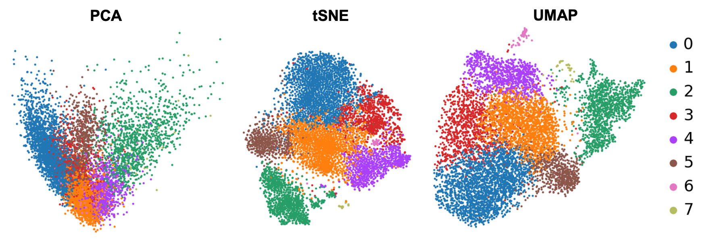
>
> > ###  Solución
> >
> > Puedes ver por qué un PCA generalmente no es suficiente para ver agrupaciones de muestras - ten en cuenta que, sólo estás viendo los componentes 1 y 2 y, por lo tanto,he aquí la razón por la cual las visualizaciones de reducción de la dimensionalidad tSNE y UMAP son tan útiles. Pero no hay necesariamente un claro ganador entre tSNE y UMAP, aunque creo que UMAP es ligeramente más claro con sus agrupamientos, así que nos ceñiremos a esto para el resto del análisis.
> >
> {: .solution}
>
{: .question}

Ten en cuenta que la numeración de las agrupaciones se basa únicamente en el tamaño: las agrupaciones 0 y 1 no están necesariamente relacionadas, sino que son las que contienen más células. Sería conveniente saber cuáles son exactamente estas células. Este análisis (buscar en Google todos los genes marcadores, así como comprobar dónde están los que conoces y revisar las tablas de marcadores que has generado) es una tarea entretenida para cualquier experimento individual, así que vamos a pasar deprisa y utilizar la evaluación del artículo original.


| Agrupación | Marcador | Tipo de célula |
|------ |--------------------|
| 3 | Il2ra    | Doble negativa (célula T temprana)    |
| 0,1,4,6 | Cd8b1, Cd8a, Cd4    | Doble positiva (célula T medial)|
| 5 | Cd8b1, Cd8a, Cd4 - high | Doble positiva (célula T tardía)  |
| 2 | Itm2a    | Célula T madura  |
| 7 | Hba-a1    | Células sanguíneas |
| 8 | Aif1    | Macrófagos    |

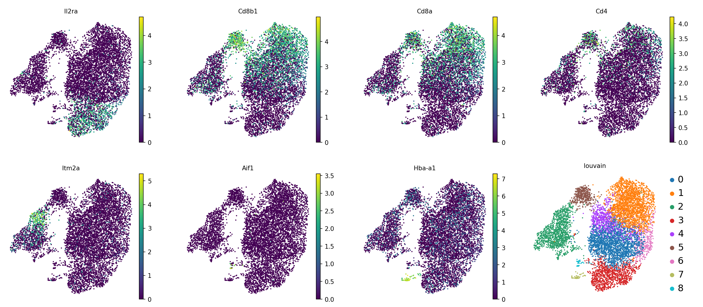

Los autores no estaban interesados en seguir anotando las células DP, así que nosotros tampoco. A veces, esto ocurre. Las matemáticas intentan llamar a las agrupaciones de tamaño similar, sean o no biológicamente relevantes. O bien, la pregunta que se hace no precisa realmente tal granularidad de agrupaciones.


### Anotando agrupaciones

> ### Práctica: Anotando agrupaciones
>
> 1.  con los siguientes parámetros:
>    -  *"Annotated data matrix"*: `Final object`
>    - *"Function to manipulate the object"*: `Rename categories of annotation`
>    - *"Key for observations or variables annotation"*: `louvain`
>    - *"Comma-separated list of new categories"*: `DP-M1,DP-M2,T-mat,DN,DP-M3,DP-L,DP-M4,RBC,Macrophages`
>    - Un momento... Lamentablemente esto elimina la numeración original de las agrupaciones. En caso de que quieras recuperarla, se puede volver a añadir la anotación.
>
> 2.  con los siguientes parámetros:
>    -  *"Input object in hdf5 AnnData format"*: `Final object`
>    - *"Copy observations (such as clusters)"*:  *Yes*
>    - **"Keys from obs to copy"**
>    - *"Keys from obs to copy"*
>    - *"Key contains"*: `louvain`
>    -  *"AnnData objects with obs to copy"*: (output of **Manipulate AnnData** )
>    - Has añadido las nuevas anotaciones de las células, ahora titulada  `louvain_0´. ¿Qué, no es suficiente? ¿Quieres cambiar el título también? Que así sea.
>
> 3.   con los siguientes parámetros::
>    -  *"Input object in hdf5 AnnData format"*: (output of **AnnData Operations** )
>    - *"Change field names in AnnData observations"*
>    -  *"Insert Change field names in AnnData observations"*
>    - *"1: Change field names in AnnData observations"*
>    - *"Original name"*: `louvain_0`
>    - *"New name"*: `cell_type`
>
> 4. **Cambiar nombre**  de salida h5ad a `Final cell annotated object`
>   -  ¡Es hora de volver a visualizar con gráficos!  Siéntete libre de volver a ejecutar  la herramienta **Scanpy PlotEmbed**  en el nuevo objeto que visualiza gráficamente `cell_type` para acelerar esto. De lo contrario...
> 5.  con los siguientes parámetros::
>    -  *"Input object in AnnData/Loom format"*: `Final cell annotated object`
>    - *"name of the embedding to plot"*: `umap`
>    - *"color by attributes, comma separated texts"*: `cell_type,sex,batch,genotype,Il2ra,Cd8b1,Cd8a,Cd4,Itm2a,Aif1,Hba-a1,log1p_total_counts`
>    - *"Field for gene symbols"*: `Symbol`
>
{: .hands_on}

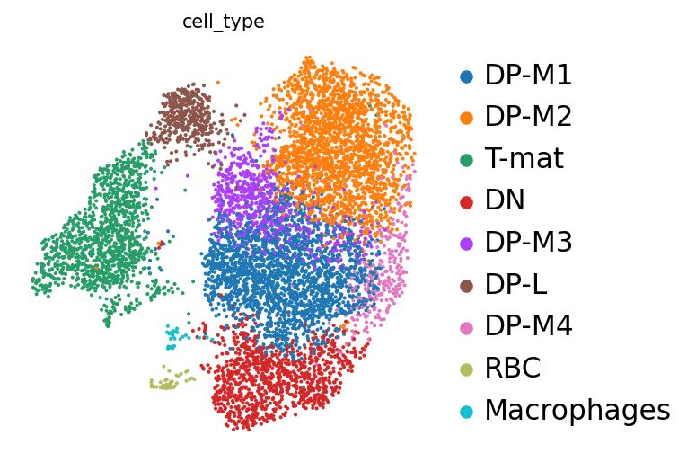

Ahora que sabemos a qué nos enfrentamos, vamos a examinar el efecto de nuestra variable, ¡ciencia en estado puro!

> ###  Pregunta - Genotipo
>
>¿Existen diferencias en el genotipo? O bien en términos biológicos, ¿hay un impacto de la restricción del crecimiento en el desarrollo de las células T en el timo?
>
> 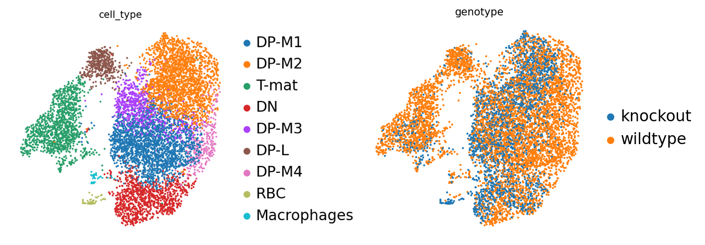
>
> > ###  Solución
> >
> > Podemos ver que DP-L,  parece alejarse del grupo de DP-M, así como las células T maduras (o en particular la mitad superior) carecen de algunas células knockout. ¿Quizás existe algún tipo de inhibición aquí? ¡INTERESANTE! ¿Y ahora qué? Podríamos seguir examinando los transcritos presentes en esas dos poblaciones, y quizás también mirar la tabla de marcadores de genotipo... ¡Hay mucho que investigar! Pero antes de que te pongas a explorar a tu antojo, analicemos también esto un poco más técnicamente.
> >
> {: .solution}
>
{: .question}

## Evaluación técnica

¿Es real nuestro análisis? ¿Es correcto? Bueno, podemos evaluarlo un poco.

> ###  Pregunta - Efecto de lote ”Batch effect”
>
> ¿existe un efecto de lote “batch effect”?
>
> 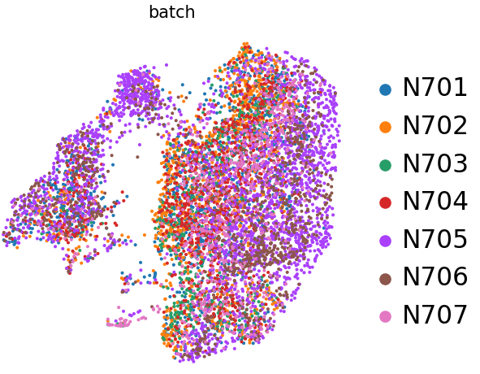
>
> > ###  Solución
> >
> >Si bien se esperan algunos cambios, no hay nada de qué preocuparse, DP-L parece estar limitado a  sólo dos muestras: N706 y N705. Ahora, para ser justos, ambas son de fenotipo normal, pero aún así, no es bueno que sólo el 50% de las muestras de fenotipo normal estén realmente en ese grupo. ¿Se puede decir que es la razón por la que no hay células knockout allí? Es posible que haya un poco de efecto de lote “batch effect”, por lo que se debería considerar el uso de la corrección de lote en este conjunto de datos. Sin embargo, si centramos nuestra atención en el otro agrupamiento -células T maduras- en el que hay mezcla de lotes, todavía podemos evaluar esto biológicamente incluso sin corrección de lotes.
> > Además, también analizaremos el effecto de confusión del sexo.
> >
> > 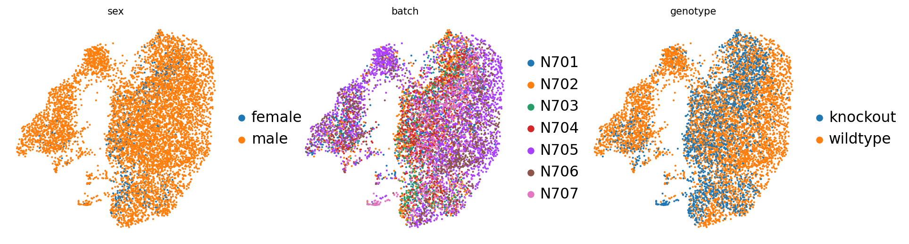
> >
> >Observamos que la única muestra femenina -desgraciadamente, una de las tres muestras knockout- parece estar distribuida en las mismas zonas que las muestras knockout en general, por lo que, afortunadamente, no parece ser un factor de confusión y podemos seguir aprendiendo de nuestros datos. Lo ideal sería volver a realizar este experimento con más muestras de hembras o sustituir esta muestra de hembras por la de machos.
> >
> {: .solution}
>
{: .question}

> ###  Pregunta - Efecto de profundidad
>
> ¿Existen agrupaciones o diferencias impulsadas por la profundidad de la secuenciación, un factor técnico y aleatorio?
>
> 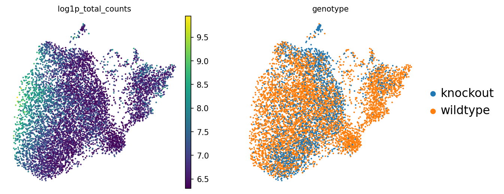
>
> > ###  Solución
> >
> >¡Eureka! Esto explica el extraño cambio de DP entre las células de fenotipo normal y las de knockout: el lado derecho de las células DP simplemente tiene una mayor profundidad de secuenciación (UMIs/célula) que las del lado izquierdo. Eso explica parte del subgrupo que estamos viendo en esa franja. Es importante destacar que no vemos que las agrupaciones de DP-L o (sobre todo) de células T maduras se vean afectadas de forma similar. Así que, aunque de nuevo, esta variable de la profundidad de secuenciación podría ser algo a lo que habría que retroceder de alguna manera, no parece estar afectando a nuestro conjunto de datos. En general, cuanto menos se retroceda/modifique los datos, mejor: hay que ser lo más fiel posible a los datos en crudo y sólo utilizar las matemáticas para corregir los datos cuando sea realmente necesario (¡y no para crear ideas donde no las hay!).
> >
> {: .solution}
>
{: .question}

> ### Pregunta - Pureza de la muestras
>
> ¿Crees que hemos procesado estas muestras lo suficientemente bien?
>
> 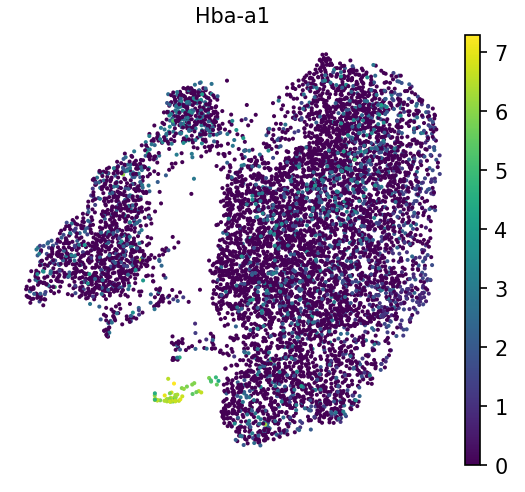
>
> > ###  Solución
> >
> >Hemos visto en las imágenes anteriores que estos agrupamientos no están muy compactados o definidos, por lo que podríamos considerar un filtrado más severo. Por ejemplo, aunque la hemoglobina es alta en la agrupación de los hematíes, aparece en toda la muestra en números bajos. Esto sugiere que hay un fondo en el medio en el que estaban las células, y podríamos considerar en el laboratorio húmedo “wet lab” tratar de obtener una muestra más pura y de mejor calidad, o en el laboratorio seco “dry lab”, emplear técnicas como SoupX u otras para eliminar este fondo. Jugar con los ajustes de filtrado (aumentando los recuentos mínimos por célula, etc.) suele ser el punto de partida en estos escenarios.
> >
> {: .solution}
>
{: .question}

> ###  Pregunta -Resolución de agrupaciones
>
> ¿Consideras que la agrupación es adecuada? es decir, ¿hay agrupaciones individuales que crees que deberían estar separadas, y agrupaciones múltiples que podrían combinarse?
>
> 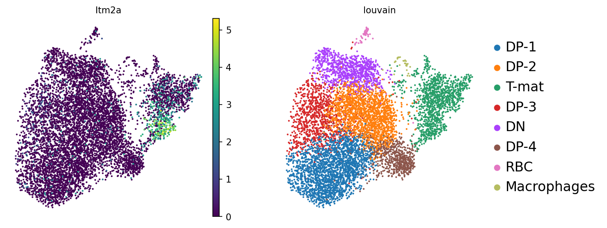
>
> > ###  Solución
> >
> > Es importante tener en cuenta, por si acaso todos los bioinformáticos combinan sus fuerzas para atacar a los biólogos: ¡que una agrupación no parezca una agrupación a simple vista NO es suficiente para decir que no es una agrupación! Pero si nos fijamos en la biología aquí, nos esforzamos por encontrar genes marcadores para distinguir la población DP, que sabemos que también se ve afectada por la profundidad de la secuenciación. Es un argumento razonable que DP-M1, DP-M2 y DP-M3 podrían no ser tan diferentes. Tal vez necesitemos más profundidad de secuenciación en todas las células DP, o compararlas explícitamente entre sí (¡considera las variaciones de FindMarkers!). Sin embargo, DP-L parece salir del grupo de DP y también tiene menos células knockout, por lo que podríamos ver lo que DP-L está expresando en los genes marcadores. Si miramos más a T-mat, podemos ver que su gen marcador -Itm2a- sólo se expresa en la mitad superior del agrupamiento. Podrías considerar la posibilidad de subclasificar esto para indagar más, ya sea cambiando la resolución o analizando esta agrupación sola.
> >Si miramos las diferencias entre solo los genotipos (por así decir, el “pseudo-bulk”) podemos ver que la mayoría de los genes en esa lista son realmente ribosomales. Esto podría ser un fondo constitutivo, podría estar relacionado con el ciclo celular, podría ser biológico, o las tres cosas. Se podría considerar la posibilidad de analizar el estado del ciclo de las células, o incluso hacer una regresión (que es lo que hicieron los autores).
> {: .solution}
>
{: .question}

Por último, existen muchas maneras de analizar los datos, tanto dentro de los ámbitos de este tutorial (los muchos parámetros que se pueden cambiar) como fuera de él (corrección de lotes, subclasificación, evaluación del ciclo celular, trayectorias, etc.). La mayoría de los análisis seguirán dando el mismo resultado general, sin embargo: hay menos células knockout en la población de células T maduras.

 ¡Felicidades! Has interpretado tus gráficos de varias maneras importantes!

# Visualizaciones interactivas

Antes de que te dejemos explorar lo desconocido, habrás notado que las interpretaciones anteriores son sólo algunas de las opciones posibles. Más aún, es posible que te hayas divertido intentando averiguar qué muestra es de qué genotipo y qué sexo, y pasando repetidamente de un gráfico a otro. Averiguar qué gráficos serán los definitivos y publicables requiere mucho tiempo y muchos intentos ¡Por suerte, existe un útil visor interactivo   que puede ayudarte a explorar sin tener que producir nuevos gráficos una y otra vez!

> ###  Práctica: Cellxgene
>
> 1.  con los siguientes parámetros:
>    -  *"Concatenate dataset"*: `Final cell annotated object`
>
> 2. Cuando estés listo, verás un mensaje
>    -  *Hay una vista de resultados de la herramienta interactiva disponible, haz clic aquí para mostrarla* <---- ¡Haz clic ahí!
>
> A veces este enlace puede perturbar un cortafuegos o algo similar. Debería funcionar para ir al sitio web. Se te pedirá que “nombres tu anotación”, así que ¡hazlo para empezar a divertirte!
>
> 3. También puedes acceder a ella yendo a “Usuario” en el menú superior de Galaxy, y luego seleccionando “Herramientas interactivas activas”
>
> 4. Tendrás que “Detener” este entorno activo en Galaxy yendo a “Usuario”, “Herramientas Interactivas”, seleccionando el entorno, y seleccionando “Detener”. También puedes borrar el conjunto de datos en el historial, porque de lo contrario sigue apareciendo como si estuviera procesando.
{: .hands_on}

Estás advertido: esta herramienta de visualización es una poderosa opción para explorar tus datos, pero lleva algún tiempo acostumbrarse a ella. ¡Considera la posibilidad de explorarlo como tu propio tutorial para otro día!

# Conclusión
{:.no_toc}

> ###  ¿Trabajando en grupo? ¡El final!
> Es de esperar que, independientemente de la vía de análisis que hayas tomado, hayas encontrado las mismas interpretaciones generales. Si no es así, este es un buen momento para hablar y considerar con tu grupo por qué puede ser así: ¿qué decisión fue "errónea" o "desacertada", y cómo te asegurarias de interpretar correctamente tus datos en el futuro? El mejor consejo: probar y equivocarse es una buena idea, lo creas o no, y cuantas más formas encuentres de la misma manera, más seguro estarás. Pero no hay nada mejor que la validación experimental...
> Para aquellos que no tomaron las opciones de "control", por favor haced lo siguiente:
> > 1. **Cambia de nombre** de tu historial (haciendo clic en el título del historial) a “DECISIÓN-Filtrado y representación visual de datos de ARN seq de célula única”
> > 2. Añade una anotación en el historial  que incluya los parámetros que has cambiado/los pasos que has cambiado respecto al *control*
> >
> >    
> >
> > 3. Siéntete libre de explorar cualquier otra historia similar
{: .details}

 ¡Felicitaciones! ¡Has llegado al final! Puede que te resulte útil esta [historia ejemplo control](https://humancellatlas.usegalaxy.eu/u/wendi.bacon.training/h/filter-plot-and-explore-single-cell-rna-seq-data---answer-key) para comparar, o este [workflow](https://humancellatlas.usegalaxy.eu/u/wendi.bacon.training/w/filter-plot-and-explore-single-cell-rna-seq-data).

En este tutorial, has pasado del procesamiento técnico a la exploración biológica. Al analizar datos reales -¡tanto los emocionantes como los desordenados! - has experimentado lo que es analizar y cuestionar un conjunto de datos, potencialmente sin límites claros o respuestas claras. Si has trabajado en grupo, cada uno de vosotros ha analizado los datos de forma diferente, y lo más probable es que hayáis encontrado ideas similares. Uno de los mayores problemas en el análisis de scRNA-seq es la falta de una vía o parámetros claramente definidos. Hay que tomar la mejor decisión posible a medida que se avanza en el análisis y, en última instancia, en caso de duda, ¡probar de varias maneras y ver qué pasa!

Para debatir con científicos afines, ¡únete a nuestro canal Gitter para todo lo relacionado con Galaxy-single cell! [](https://gitter.im/Galaxy-Training-Network/galaxy-single-cell?utm_source=badge&utm_medium=badge&utm_campaign=pr-badge)
