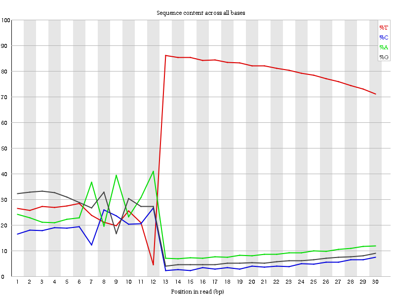

# Introduction
{:.no_toc}

The advent of single-cell RNA sequencing has provided the means to explore samples at the individual cell level, enabling a greater understanding of the development and function of such samples by the characteristics of their constituent cells. These cells can be classified into different cell subpopulations or "clusters" by the variation of gene expression exhibited by individual cells that share a common profile -- i.e. cells in the same cluster exhibit similar profiles of differential expression in the same set of related genes.

By identifying significant genes in each cluster, cell types can be inferred and similarity between clusters can be determined based on their proximity to one another. If the cells all come from the same sample tissue, the cell types will likely correspond to the different stages of cell differentiation expected of that tissue, wherein a lineage/heirarchy could potentially be derived.

 

This tutorial is in part inspired by aspects of the [Hemberg workflow](https://hemberg-lab.github.io/scRNA.seq.course/) at the Sangar insititute, as well as the [CGATOxford](https://github.com/CGATOxford/UMI-tools) workflow. The barcoding follows the CelSeq2 protocol and uses the lane configuration as that utilized by the Freiburg MPI Grün lab.

# Analysis Strategy

Most scRNA sequencing techniques use pooled-sequencing approaches to generate a higher throughput of data by performing amplification and sequencing upon multiple cells in the same "pool". From a bioinformatics standpoint, this means that the output FASTQ data from the sequencer is batch-specific and contains all the sequences from multiple cells.

In this tutorial, we will perform pre-processing upon single-cell RNA FASTQ batch data to generate an *N*-by-*M*  count matrix of *N* cells and *M* genes, with each element indicating the level of expression of that gene in a particular cell. This matrix can be used in further downstream analyses, which will be covered in another tutorial. 

The first part of this tutorial will use example *FASTQ* Batch data, which we will pair into a Galaxy *Collection* and perform barcode extraction and annotation upon. Alignment and quality control will also be performed, and we will see how to construct a rudimentary count matrix. 

The second part of this tutorial will deal with multiple batches, and a different set of example count matrices will be used in which to merge and perform quality control upon. This will produce a final count matrix valid for downstream analysis.

> ### Agenda
>
> In this tutorial, we will deal with:
>
> 1. TOC
> {:toc}
>
{: .agenda}

# Single Batch Processing

## Data upload and organization

The size of scRNA FASTQ files are typically in the gigabyte range and are somewhat impractical for training purposes, so we will expediate the analysis by using a smaller subset of actual batch data. This data is available at [`Zenodo`](https://link.this) where the example FASTQ paired batch files are hosted, as well as a GTF and barcodes file for the *Dario Rerio* genome version danRer10.

The batch files are the first of the set of multiple batches, and originate from the first sequencing plate. We will explain this more in detail later, but for now we should make note of this when renaming our files in step 6 of the hands-on below.

> ###  Hands-on: Data upload and organization
>
> 1. Create a new history and name it something meaningful (*e.g.* scRNA-seq single batch tutorial)
> 1. Open the Data Upload Manager by selecting *Get Data* from the Tool Panel and clicking *Upload File*
> 1. Select *Paste/Fetch Data*
> 1. Copy each link for the reads (.R1.fastq, .R2.fastq), annotation (.GTF), and barcode (.tab) files, and paste each link into a separate text field
>    - Set the datatype of the read (.fastq) files to **fastq**
>    - Set the datatype of the annotation (.tab) file to **tabular** and assign the Genome as **danRer10**
> 1. Click *Start*
> 1. Build a *Dataset pair* for the two FASTQ files
>    - Click the *Operations on multiple datasets* check box at the top of the history panel
>    - Check the two boxes next to the R1 and R2 scRNA FASTQ samples
>    - Click *For all selected...* and choose *Build dataset list*
>    - Ensure that the forward read is the R1 sample, and the reverse read is the R2 sample.
>      - Click 'Swap' otherwise.
>    - Set the name of the pair to something meaningful appended with '_P1_B1' to denote that our data originates from Plate1 and Batch1 (e.g. 'DanRer_P1_B1')
>    - Click *Hide original elements?*
>    - Click *Create list*
>
{: .hands_on}

## Barcode Determination and Extraction

## Mapping

## Quantification

# Multiple Batch Processing

## Data upload and organization

The count matrix we have generated in the previous section is too sparse to perform any reasonable analysis upon, and constitutes data only of a single batch. Here we will use more populated count matrices from multiple batches, under the assumption that we now know how to generate each individual one of them using the steps provided in the previous section. This data is available at [`Zenodo`](https://link.this).

Once again, file naming is important, and so we will rename our matrix files appropriately to the plate and batch they are supposed to originate from.

> ###  Hands-on: Data upload and organization
>
> 1. Create a new history and name it something meaningful (*e.g.* scRNA-seq multiple-batch tutorial)
> 1. Open the Data Upload Manager by selecting *Get Data* from the Tool Panel and clicking *Upload File*
> 1. Select *Paste/Fetch Data*
> 1. Copy each link for the matrices (cm.p1b1.tab, cm.p1b2.tab, ..., cm.p2b8.tab, etc..), and paste each link into a separate text field
>    - Set the datatype of the tabular (.tab) files to **tabular**
> 1. Click *Start*
> 1. Rename a matrix
>    - Click on  of the *cm.p1b1.tab* file
>    - Set the Name field to something meaningul appended with "_P1_B1" (e.g. 'multibatch_P1_B1')
>    - Click *Save*
> 1. Repeat for all matrices
>    - **Pay attention to the Plate number which changes after Batch 4**
>
{: .hands_on}

## Merging Count Matrices

## Cross-contamination

<!-- Here be clear waters -->

## What are Barcodes?

Barcodes are small random oligonucleotides that are inserted into the captured sequence at a specific point, and provide two pieces of information about the sequence:
  
 1. Which cell the sequence came from
 2. Which transcript the sequence came from

When the sequence is mapped against a reference genome, we can then see which gene locus it aligns to and qualitavely assert that, together with the two pieces of information above, the sequence depicts a transcript from a specific a gene that originated from a specific cell.

> ###  Question
>
> 1. Why is it important to know which cell a sequence came from?
> 2. Barcoding the cell makes sense, but why do we need to barcode the transcript too? i.e. Can we not infer which gene the sequence originates from by simply mapping it against the reference genome?
> 
> > ###  Solution
> >
> > 1. If our sequence codes for a *GeneX* which is a gene of interest, we may want to know which cells express GeneX more than others.   
> > e.g. If *CellA* has 10 times more *GeneX* sequences than *CellB*, then we know that *CellA* and *CellB* differ at *GeneX* - which might suggest a causative source of variation for any change in function between *CellA* and *CellB* (or cells in the same cluster as *CellA*, and cells in the same cluster as *CellB*).
> > 2. *Yes* and *no*!  
> > **Yes**: We can indeed align our sequence against a reference genome and obtain the name of the gene it aligns against. This sequence will then contribute to the 'count' of sequences that gene has, and increase the expression of that gene.  
> > **No**: We do not know whether these 'counts' are *unique*. Many of these counts could be duplicates as a result of the amplification process. To explain further, we must look at UMIs and their role in the analysis.
> {: .solution}
{: .question}

To explore the uniqueness of counts, we must discuss the inclusion of *UMIs* in a single-cell analysis.

> ###  Mitigating duplicate transcript counts with UMIs
>
> One of the major issues with sequencing is that the read fragments require amplification before they can be sequenced. A gene with a single mRNA transcript will not be detected by most sequencers, so it needs to be duplicated 100-1000x times for the sequencer to 'see' it.
>
> Amplification is an imprecise process however, since some reads are amplified more than others, and subsequent amplification can lead to these over-amplified reads being over-amplified even more, leading to an exponential bias of some reads over others.
>
> 
> 
>
> Consider the above example where two reads from different transcripts are amplified unevenly. The resulting frequency table would look like so:
>
>  |  | Reads in Cell 1 |
>  |--|------------------|
>  | Gene Red | 5 |
>  | Gene Blue | 0 |
>
> 
> But the truth is entirely different (i.e. Gene Red should have 1 count, and Gene Blue should also have 1 count). How do we correct for this bias?
>
> 
> **Unique Molecular Identifiers** (or *UMIs*) constitute the second portion of a barcode, where their role is to *uniquely* count reads such that amplicons of the same read are only counted once, e.g:
> 
>  
> 
> Here, we see two unique transcripts from Gene Red and two unique transcripts from Gene Blue, each given a (coloured) UMI. After amplificaiton, Gene Red has more reads than Gene Blue. If we were to construct a frequency table as before to count the reads, we would have:
> 
>  |  | Reads in Cell 1 |
>  |--|-----------------|
>  | Gene Red | 6 |
>  | Gene Blue | 3 |
>  
>  Which is wrong, because it shows that Red has twice the expression that Blue does. However, we can reconstitute the true count by considering the UMI information:
>  
>  |  | UMI colour  | Reads in Cell 1 |
>  |--|-------------|-----------------|
>  | Gene Red | Pink | 2 |
>  |          | Blue | 4 |
>  | Gene Blue | Brown | 1 |
>  |           | Green | 2 |
>  
> We can then make the decision to ignore the frequencies of these UMIs, and simply count how many *unique* UMIs we see in each gene:
> 
>  |  | Set of UMIs in Gene | UMIs in Cell 1 |
>  |--|---------------------|----------------|
>  | Gene Red | {Pink, Blue} | 2 |
>  | Gene Blue | {Brown, Green} | 2 |
>  
>  Which provides us with the true count of the number of true transcripts for each gene:
>  
>  |  | UMIs in Cell 1 |
>  |--|----------------|
>  | Gene Red | 2 |
>  | Gene Blue | 2 |
>
>
{: .details}

> ###  Questions about UMIs
>
> 1. Are UMIs specific to genes? i.e. Can the same UMI map to different genes?
> 2. Can the same UMI map to different mRNA molecules of the same gene?
> 
> > ###  Solution
> >
> 1. No. The same UMI can tag transcripts of different genes. UMIs are not universal tags, they are just 'added randomness' that help reduce amplification bias -- not unique to any particular gene.
> > 2. Yes, UMIs are not precise but operate probabilistically. In most cases, two transcripts of the same gene will be tagged by different UMIs. In rarer (but still prevalent) cases, the same UMI will capture different transcripts of the same gene.
> >  * One helpful way to think about how quantification is performed is to observe the following heirarchy of data `Cell Barcode → Gene → UMI`
> >
> >   e.g.
> > 
> >  | BC:Cell | BC:UMI | Maps to Gene |
> >  |------|-----|------|
> >  | AAAT | TCA | Slx1 |
> >  | AAAT | GTG | Slx2 |
> >  | AAAT | TCA | Gh13 |
> >  | TTAA | TCA | Slx1 |
> >  | TTAA | CCC | Atp3 |
> >
> > If UMIs were unique to a gene, then the `TCA` UMI barcode would not have reads that map to both *Slx1* and *Gh13* in the same cell (`AAAT`).
> >
> {: .solution}
>
{: .question}

### Barcoding Format

We now know the role of UMIs and cell barcodes, but how do we handle them in the analysis? Let us look at 4 example sequences in our paired-end FASTQ data.

> ###  Hands-on: Selecting 4 reads of interest
>
> 1. Preparing the Data:
>     1. Create a new history and name it something useful (*e.g.* 'Inspecting FastQ Files in scRNA batch data')
>     1. Open the Data Upload Manager by selecting *Get Data* from the Tool Panel and clicking *Upload File*
>     1. Select *Paste/Fetch Data*
>        - Copy and Pase the following read IDs
>    
>            J00182:75:HTKJNBBXX:2:1114:12469:11073
>            J00182:75:HTKJNBBXX:2:2222:13301:35690
>            J00182:75:HTKJNBBXX:2:1203:25022:13763
>            J00182:75:HTKJNBBXX:2:1115:8501:46961
>     1. Set the datatype of the file as **tabular**
>     1. Click *Start*
>     1. Click the *View all histories* icon
>     1. Drag the FASTQ collection from your previous history into your new history
>     1. Click the *Galaxy* icon to return home.
> 1. Extracting our 4 reads
>    1. **Filter sequences by ID**  with the following parameters:
>    - **Sequence file to be filtered**
>      - Click the *Dataset Collection* icon
>      - Select the FastQ collection if not already selected.
>    - **Filter using the ID list from**:`tabular file`
>      - *Tabular file containing sequence identifiers*:`Pasted Entry`
>    - **Column(s) containing sequence identifiers**
>      - **Select/Unselect all**:(tick the box)
>    - **Output positive matches, negative matches, or both?**:`Just positive matches (ID on list), as a single file`
> 1. Viewing our 4 reads side-by-side
>    - Activate the **Scratchbook** by clicking on the **Enable/Disable Scratchbook** icon on the main top toolbar
>    - Click on the newly generated FastQ pair ending in *"with matched ID"* to expand the individual reads
>      - Click on the  symbol of the forward read
>      - Click somewhere outside the white box to close the **Scratchbook**
>      - Click on the  symbol of the reverse read
>    - Position/Resize the boxes as desired
{: .hands_on}

<!-- 
These are reads that all map to ENSDARG00000019692. In [Cell, UMI] format:

(J00182:75:HTKJNBBXX:2:1114:12469:11073|J00182:75:HTKJNBBXX:2:2222:13301:35690|J00182:75:HTKJNBBXX:2:1203:25022:13763|J00182:75:HTKJNBBXX:2:1115:8501:46961)

            Cell  , UMI
1: 46961 -- ACCAGA, GGAAGA
2: 13763 -- GGTAAC, GTCCCA -> same umi, same cell
3: 35690 -- GGTAAC, GTCCCA -> same umi, same cell
4: 11073 -- GGTAAC, CGGCGT -> diff umi, same cell
-->

### Our 4 Reads of Interest

Let us examine these reads four reads of interest which we have just sub-selected using their headers:

> ###  Reads:
>
> Forward:
>
>         @J00182:75:HTKJNBBXX:2:1115:8501:46961 1:N:0:ATCACG
>         GGAAGAACCAGATTTTTTTTTTTTTTTTTT
>         +
>         AAFFFJJJJJJJFFFJJJJJJJJJJJJJJJ
>         
>         @J00182:75:HTKJNBBXX:2:1203:25022:13763 1:N:0:ATCACG
>         GTCCCAGGTAACTTTTTTTTTTTTTTTTTT
>         +
>         AAFFFJJJJJJJJFFJJJJJJJJJFJ<FF-
>         
>         @J00182:75:HTKJNBBXX:2:2222:13301:35690 1:N:0:ATCACG
>         GTCCCAGGTAACTTTTTTTTTTTTTTTTTT
>         +
>         AAFFFJJJJJJJ<AFJJJJJFFJJFJJJFF
>         
>         @J00182:75:HTKJNBBXX:2:1114:12469:11073 1:N:0:ATCACG
>         CGGCGTGGTAACTTTTTTTTTTTTTTTTCC
>         +
>         AAFFFJJJJJJJFAFFJJJJJJJJF---<F
>         
> 
> Reverse:
> 
>         @J00182:75:HTKJNBBXX:2:1115:8501:46961 2:N:0:ATCACG
>         GACCTCTGATCTTTACGAAAGGCCAACGCGTTTTCAGTCTGGACACGGTTCAGCTCCTGTTCATTATTCA
>         +
>         A<<A-777F<AA<AJJJJJJJJJJJJJJJJJJJJJJJJJJJJJJJJJJJJJJJJJJJJJJJJJJJJJJJJ
>         
>         @J00182:75:HTKJNBBXX:2:1203:25022:13763 2:N:0:ATCACG
>         GCCACCTAATTTCCGTCATCACACTCCTCTCCGTTTTCAACTTGCACAATGCTGTCTCCGCAGAATCCCT
>         +
>         ---<----<A---77-7A-FJ<JJFFJJ<JJAJ7<-FAFFJJFF<FFJJFFAJFA-AFFFJFFFFFJAJJ
>         
>         @J00182:75:HTKJNBBXX:2:2222:13301:35690 2:N:0:ATCACG
>         CAATCCTCTCCGTTATCAACTTGCACAATGCTGTCTCCGCAGAATCCCTCCGGATCAGGATCGCTCTCCA
>         +
>         <<A-77--77F<----7AFJ-A--FJJJFAJF-AFAJAJ<JFJ<JJJFFJJJFJJJJJAAFJJJFJJJF-
>         
>         @J00182:75:HTKJNBBXX:2:1114:12469:11073 2:N:0:ATCACG
>         ATCCACTTATTGCAAAGCAGAGGACATTGAGTCTCACCTTTTGTCCAGGTCTTCCAATTTCACCCTGCAA
>         +
>         A-77AA-7FF<7FFJFFFJJJJJJJJJJJJJ-AFJJJJJJJFJJJJJJJJJJJJJJJJJJJJJJJJJJJJ
>         
{: .details}

What we observe are the standard four lines of any FASTQ file:
  1. Read name starting with `@`
  2. Sequence of nucleotide bases
  3. Seperator `+`
  4. Quality string of the nucleotide bases in Hex

The main source of interest for us is in the (2) sequences of these reads, which somewhere within encode for three crucial pieces of information that we will need to perform quantification:

  1. Cell Barcode
  2. UMI Barcode
  3. Reverse-transcribed mRNA sequence

These can be encoded into the sequences of our paired-end data by any means. In order to know where our barcodes are, we must be familiar with the sequencing primers used in the analysis:

> ###  The CelSeq2 protocol
>
> CelSeq2 is a paired-end protocol, meaning that two primers bind to opposite strands in order to sequence. Each primer has a specific role. In this case; *Read1* contains the barcoding information followed by the polyT tail of the messenger RNA, and *Read2* contains the actual sequence. Here, Read1 is regarded as the 'forward' strand and Read2 as the 'reverse' strand, though this is more a convention when dealing with paired-end data rather than an indication of the actual strand orientation.
>
> 
>
{: .details}

#### Verifying the Barcode Format

As shown in [CelSeq2 Primer Figure](#CelSeq2 Scheme), we have the following encoding:
 * Forward Read:
    * 1-6bp: UMI Barcode
    * 7-12bp: Cell Barcode
    * 13→bp: Poly-T tail
 * Reverse Read:
    * 1-70bp: mRNA sequence

The encoding of the barcodes on the first read can actually be seen by examining the distribution of bases in a FastQC plot.

> ###  Hands-on: Confirming the Barcoding
>
> 1. **FastQC**  with the following parameters:
>    -  *"Short read data from your current history"*: `Paired FastQ` (the original paired set)
>
>    > ###  Comment
>    >
>    > We are only interested in the distribution of bases on the Forward read, but it is more convenient to process the data as a pair instead of un-hiding the original dataset
>    {: .comment}
>
> 1. Click on *FastQC on collection :Webpage*
> 1. Click on the  of the Forward read
> 1. Click on the *Per base sequence content* header on the side-bar
{: .hands_on}

 

Here we can see the three distinct regions along the x-axis that correspond to our expected CelSeq2 Schema:

 * 1 - 6 bp: smooth, relatively constant bases.
 * 7 - 12 bp: noisy, highly varied distribution of bases.
 * 13 - 30bp: T-dominated region

We can see that the distribution of the first 6bp is relatively more even than the following 6bp which seems to have more extreme variation. 

> ###  Question
>
> Why is the UMI barcode base distribution smoother than the Cell barcode base distribution?
> > 
> > ###  Solution
> > 
> > There are far more UMIs than cells. Cells are designed and selected with a specified edit distance greatly limiting their availability in the data. UMIs are not so well-curated -- i.e it is possible to encounter the same UMI in the same cell multiple times. The more extreme variation in the 7-12bp region is simply caused by a fewer number of samples.
> >
> {: .solution}
{: .question}

### Uniting Barcodes with Sequence

In a sense, we have a disparity in our data: the reverse reads contain the sequences we wish to map, but not the barcodes; the forward reads contain the barcode, but not the sequence. For the forward and reverse reads given above, the information that we really want from both can be summarized in this table:

 | Read | Cell | UMI | Sequence |
 |------|------|-----|----------|
 | @J00182:75:HTKJNBBXX:2:1115:8501:46961  | ACCAGA | GGAAGA | GACCTCTGATCTTTACGAAAGGCCAACGCGTTTTCAGTCTGGACACGGTTCAGCTCCTGTTCATTATTCA |
 | @J00182:75:HTKJNBBXX:2:1203:25022:13763 | GGTAAC | GTCCCA | GCCACCTAATTTCCGTCATCACACTCCTCTCCGTTTTCAACTTGCACAATGCTGTCTCCGCAGAATCCCT |
 | @J00182:75:HTKJNBBXX:2:2222:13301:35690 | GGTAAC | GTCCCA | CAATCCTCTCCGTTATCAACTTGCACAATGCTGTCTCCGCAGAATCCCTCCGGATCAGGATCGCTCTCCA |
 | @J00182:75:HTKJNBBXX:2:1114:12469:11073 | GGTAAC | CGGCGT | ATCCACTTATTGCAAAGCAGAGGACATTGAGTCTCACCTTTTGTCCAGGTCTTCCAATTTCACCCTGCAA |

> ###  Question
> 
> Provided that these reads all map to the same gene:
>
> 1. Which of these reads come from the same cell?
> 2. Which of these reads are duplicates?
>
> > ###  Solution
> > 
> > 1. Reads:
> >  * `@J00182:75:HTKJNBBXX:2:1203:25022:13763`
> >  * `@J00182:75:HTKJNBBXX:2:2222:13301:35690`
> >  * `@J00182:75:HTKJNBBXX:2:1114:12469:11073`   
> >  all have the cell barcode `GGTAAC`.
> > 
> > 2. Reads:
> >  * `@J00182:75:HTKJNBBXX:2:1203:25022:13763`
> >  * `@J00182:75:HTKJNBBXX:2:2222:13301:35690`  
> >  are duplicates, since they both have the same cell barcode and same UMI.
> > 
> > However, they are not direct duplicates of each other. since their sequences are different. However, they do stem from the same read as evidenced by their overlap:
> >
> >          13763:   GCCACCTAATTTCCGTCATCACACTCCTCTCCGTTTTCAACTTGCACAATGCTGTCTCCGCAGAATCCCT
> >          35690:                        CAATCCTCTCCGTTATCAACTTGCACAATGCTGTCTCCGCAGAATCCCTCCGGATCAGGATCGCTCTCCA
> >
> {: .solution}
{: .question}

#### Coupling our Data Sources

How should we unite these two source of information into a single location without impacting the data content?

For this we need to take the barcode information from the Forward reads, and stick it into the *header* of the Reverse reads. That way we can align our sequence to the reference and still keep the barcode information associated with the reads.

> ###  Hands-on: Barcode Extraction and Annotation of our 4 reads
>
> 1. **UMI-tools extract**  with the following parameters:
>    - *"Library type"*: `Paired-end Dataset Collection`
>        -  *"Reads in FASTQ format"*: `output` (Our paired set of 4 sequences)
>        - *"Barcode on both reads?"*: `Barcode on first read only`
>    - *"Use Known Barcodes?"*: `No`
>    - *"Barcode pattern for first read"*: `NNNNNNCCCCCC`
>    - *"Enable quality filter?"*: `No`
>
>    > ###  Comment
>    >
>    > Here we specify the format of our barcodes as `NNNNNNCCCCCC` where the *N*s represent UMI bases and the *C*s represent the cell barcodes.
>    >
>    > In some protocols, actual sequence data can be found in between the cell and UMI barcodes, wherein it is neccesary to represent sequence bases using *X*.
>    >  e.g. A protocol that starts with a 3bp sequence, followed by a 4bp Cell barcode, followed once again by a 10bp sequence, and then finally a 5bp UMI barcode, would require the following barcode format:  
>    >   `XXXCCCCXXXXXXXXXXNNNNN`
>    >
>    {: .comment}
> 1. Click the  symbol on the *Reads1: UMI-tools extract* file
> 1. Click somewhere outside the white box to close the **Scratchbook**
> 1. Click the  symbol on the *Reads2: UMI-tools extract* file
> 
{: .hands_on}

We should now be able to see the following reads:

> ###  Reads:
>
> Forward:
>
>        @J00182:75:HTKJNBBXX:2:1115:8501:46961_ACCAGA_GGAAGA 1:N:0:ATCACG
>        TTTTTTTTTTTTTTTTTT
>        +
>        FFFJJJJJJJJJJJJJJJ
>        @J00182:75:HTKJNBBXX:2:1203:25022:13763_GGTAAC_GTCCCA 1:N:0:ATCACG
>        TTTTTTTTTTTTTTTTTT
>        +
>        JFFJJJJJJJJJFJ<FF-
>        @J00182:75:HTKJNBBXX:2:2222:13301:35690_GGTAAC_GTCCCA 1:N:0:ATCACG
>        TTTTTTTTTTTTTTTTTT
>        +
>        <AFJJJJJFFJJFJJJFF
>        @J00182:75:HTKJNBBXX:2:1114:12469:11073_GGTAAC_CGGCGT 1:N:0:ATCACG
>        TTTTTTTTTTTTTTTTCC
>        +
>        FAFFJJJJJJJJF---<F>
>
> Reverse:
> 
>        @J00182:75:HTKJNBBXX:2:1115:8501:46961_ACCAGA_GGAAGA 2:N:0:ATCACG
>        GACCTCTGATCTTTACGAAAGGCCAACGCGTTTTCAGTCTGGACACGGTTCAGCTCCTGTTCATTATTCA
>        +
>        A<<A-777F<AA<AJJJJJJJJJJJJJJJJJJJJJJJJJJJJJJJJJJJJJJJJJJJJJJJJJJJJJJJJ
>        @J00182:75:HTKJNBBXX:2:1203:25022:13763_GGTAAC_GTCCCA 2:N:0:ATCACG
>        GCCACCTAATTTCCGTCATCACACTCCTCTCCGTTTTCAACTTGCACAATGCTGTCTCCGCAGAATCCCT
>        +
>        ---<----<A---77-7A-FJ<JJFFJJ<JJAJ7<-FAFFJJFF<FFJJFFAJFA-AFFFJFFFFFJAJJ
>        @J00182:75:HTKJNBBXX:2:2222:13301:35690_GGTAAC_GTCCCA 2:N:0:ATCACG
>        CAATCCTCTCCGTTATCAACTTGCACAATGCTGTCTCCGCAGAATCCCTCCGGATCAGGATCGCTCTCCA
>        +
>        <<A-77--77F<----7AFJ-A--FJJJFAJF-AFAJAJ<JFJ<JJJFFJJJFJJJJJAAFJJJFJJJF-
>        @J00182:75:HTKJNBBXX:2:1114:12469:11073_GGTAAC_CGGCGT 2:N:0:ATCACG
>        ATCCACTTATTGCAAAGCAGAGGACATTGAGTCTCACCTTTTGTCCAGGTCTTCCAATTTCACCCTGCAA
>        +
>        A-77AA-7FF<7FFJFFFJJJJJJJJJJJJJ-AFJJJJJJJFJJJJJJJJJJJJJJJJJJJJJJJJJJJJ
>
{: .details}

> ###  Question
>
> 1. Compare the Forward/Read1 and Reverse/Read2 reads to those prior the extraction. What has changed? What has been removed, and what has been added and where?
> 2. Are the Forward reads useful at all?
>
> > ###  Solution
> >
> > We can see TODO
> >
> >

Here we have added `CellBarcode_UMIBarcode` format to the header of each read in our Reverse reads. We now have alll our useful data in a single FASTQ file. We can now effectively throw away our Forward reads, as they have no more useful information within them and proceed to the mapping stage.

Here info box
Here:Talk about whether direct barcodes or used, or clustered within edit distances, and the plots that can be used to estimate these.
TODO!

# Mapping

Mapping is a relatively straightforward process:

 1. Select your genome
 2. Select your GTF file
 3. Run STAR
 3. Run MultiQC on the resulting STAR log

The FASTQ data was generated from working with Zebrafish data, so to perform the alignment we will need to gather all data relevant to that genome. We will use the latest version (DanRerv10).

> ###  Performing the Alignment
>
> 1. Obtain the GTF file and import it into our history.
>   - This file contains all the gene, exon, intron, and other regions of interest that we will use to annotate our reads, should our reads align to any of the regions specified in this file.
>   - *"Shared Data"* → *"Data Libraries"* → *"Genomes + Annotations"* → *"Annotations"* → "Dario_Rerio_v10.gtf (danRer10)" → Click
>   - *"to History"*
> 
> 2. Select **RNA-STAR**  with the following parameters:
>    - *"Single-end or paired-end reads"*: `Single-end`
>        -  *"RNA-Seq FASTQ/FASTA file"*: `out2` (output of **UMI-tools extract** . Of the FASTQ files output by UMI_tools extract, select the one with the sequencing reads intact.)
>    - *"Custom or built-in reference genome"*: `Use a built-in index`
>        - *"Reference genome with or without an annotation"*: `use genome reference without builtin gene-model`
>            -  *"Select reference genome"*: `DanRer10` (Zebrafish)
>            -  *"Gene model (gff3,gtf) file for splice junctions"*: `output` (Input dataset. Select the GTF file we imported into our history)
>
>    ***TODO***: *Check parameter descriptions*
>
>    ***TODO***: *Consider adding a comment or tip box*
>
>    > ###  Comment
>    >
>    > A comment about the tool or something else. This box can also be in the main text
>    {: .comment}
>
{: .hands_on}

This should take a minute or two depending on your position in the queue. Once your output files are green, proceed to the next step.

> ###  Performing the QC on the Alignment
> 
> Let us examine how well our alignment went.
> 
> 1. Select **MultiQC**  with the following parameters:
>  - *"Results"* → *"1: Results"* → *"Which tool was used to generate logs?"*: `STAR`
>  - *"STAR output"* → *"1: STAR output"* → *"Type of STAR output?"*: `Log`
>  - *"STAR log output"* : Select the file that ends in " log"
>  - Execute
>
> 2. Once green, click on the "MultiQC on data : Webpage" eye symbol.
>
> > ###  Question
> > 
> > 1. What percentage of our reads are uniquely mapped? How many millions of reads is this percentage?
> > 2. What percentage of our reads are mapped to more than one locus?
> > 3. Is our overall mapping 'good' ?
> >
> >
> > > ###  Solution
> > > 
> > > 1. `73.5%` or 8.3 million reads were successfully mapped
> > > 2. `11.3%` are multiply mapped, and `2.2%` were mapped to too many loci
> > >   - Multiply mapped means that a read was aligned to more than one gene
> > >   - Mapped to too many loci means that a read was aligned to 10 or more loci, and should be ignored.
> > > 3. It depends on how good the sequencing protocol is, and how many reads in total were mapped.
> > >   - `90%` is amazing, reserved for bulk RNA-seq which typically has high coverage
> > >   - `70%` is weak for bulk RNA-seq, but good for single-cell RNA-seq
> > >   - 6 million mapped reads should be enough to generate a downstream analysis from.
> > >
> > {: .solution}
> {: .question}
{: .hands_on}

# Quantification

> ###  Recap of previous stages
>
> 1. *Barcode Extraction*:  
>   Here we used `umi_tools extract` on our input forward and reverse FASTQ files, and extracted the umi and cell barcode from the forward read *sequence*, and placed it into the *header* of both forward and reverse FASTQ files. i.e. FASTQ files → Modified FASTQ files  
> 2. *Mapping*:  
>   We took the sequencing data from the reverse FASTQ file (with modified headers) and aligned it to the Zebrafish genome, using annotations presented in the GTF file for that genome. i.e. Modified FASTQ file (reverse) → BAM file
>

We now have a BAM file of our aligned reads, with cell and UMI barcodes embedded in the read headers. We also have the chromosome and base-pair positions of where these reads are aligned. The can be confirmed by peeking into the BAM file:

> ###  Hands-on: Confirming the Alignment Data
>
>  1. Click on the eye symbol of the BAM output from STAR.
>  2. There are many header lines that begin with `@` which we are not interested in. 
>  3. Do a Ctrl+F search for `@co` and then look at the lines directly below it.  
>     One such read is given as so:
>
>  `J00182:75:HTKJNBBXX:2:1121:9729:45889_GACGAA_GTGGTC	16	chr1	2030	3	70M	*	0	0	AGAGGTTCCAATATTCCCATGAAATTGAGATTTTGTAAAAGAGTGAAGTGTGGTTACTTTCACTGAGAGG	JJJJJJJJJJJJJJJJJJJJJJJJFJJJJJAJJJJJJJJJJFJFJFFJJJJJJJJJJJJFF7AJA-77<A	NH:i:2 HI:i:1 AS:i:64 nM:i:2`
> 

The fields of the BAM file can be better explained at section 1.4 of [the SAM specification](https://samtools.github.io/hts-specs/SAMv1.pdf), but we will summarize the main fields of interest here:

 * `J00182..._GACGAA_GCGGTC`: The *readname* appended by an underscore '_', the cell barcode, another '_', and then the UMI barcode.
 * `16`: The FLAG value
> ####  What does the FLAG value of 16 tell us about this read?
> We can interactively see what the different FLAG values mean in the SAM specification [here](https://broadinstitute.github.io/picard/explain-flags.html)
> > ###  Solution
> > The read aligns to the reverse strand
> {: .solution}
{: .question}
 * `chr1` `2030`: The position and base-pair of alignment of the first base of the sequence.
 * (We next have a series of quality fields, as well as the `sequence` and `sequence_quality`)
 * `NH`: The number of hits for  this read. If it is multiply mapped, then the number of multiples will be shown (here `2`)
 * `HI`: Which number this particular read is in the series of (potentially) multi-mapped reads (here `1`, not neccesarily meaning the first or 'better' )
 * `nM`: The number of mismatches in the alignment of this read to the reference (here `2`)

This fields will be important later when we wish to filter our BAM for good quality reads.

Notice that we are missing one crucial piece of information in our BAM file: the name of the gene.
Once we have the name of the gene for a specific read, we can tally how many of those reads fall into that gene and generate a count matrix.

Unfortunately, *`STAR`* can only annotate and count reads at the gene-level and not the gene-cell level, e.g. if 2 different cells have reads of 5 and 6 respectively at GeneA, STAR will simply say that there are 11 reads at GeneA without regard to the cells.

    Ideally:                   What STAR outputs:
    +-------+----+----+         +-------+-------+
    |       | C1 | C2 |         |       | Total |
    +-------+----+----+         +-------+-------+
    | GeneA | 10 |  2 |         | GeneA |  12   |
    +-------+----+----+         +-------+-------+

## Counting with FeatureCounts

FeatureCounts is a tool which answers the simple question: "How many reads bisect GeneX?"
It is more qualitative that STAR however, since it is capable of counting not just at the Read level, but at the UMI level, such that 10 duplicate reads at GeneA will be counted only once. It also has the added benefit of being able to count at the individual cell level, providing a mechanism to produce our count matrices. 

> ###  Quantification assist via FeatureCounts
> 
> Let us annotate our BAM file with desired gene tags.
> 
> 1. Select **Featurecounts**  with the following parameters:
>  -  *"Alignment file"*: `mapped_reads` (output of **RNA STAR** )
>    - *"Gene annotation file"*: `in your history`
>        -  *"Gene annotation file"*: `output` (Input dataset) (The GTF file we imported earlier))
>    - *"Specify strand information"*:`Unstranded`
>    - In *"Advanced options"*:
>        - *"Count multi-mapping reads/fragments"*: `Disabled; multi-mapping reads are excluded (default)`
>        - *"Exon-exon junctions"*: `Yes`
>        - *"Annotates the alignment file with 'XS:Z:'-tags to described per read or read-pair the corresponding assigned feature(s)."*: `Yes`
>
> 2. Once green, click on the "Feature Counts: Alignment File" eye symbol.
>  - Here we can see now that we have an extra `XT:Z` tag with the name of our gene appended.
>  - This tag will be the basis of the row names in our count matrix.

## Quality Control

If we perform counting on the Alignment file we just generated with *FeatureCounts* we will be counting all the reads in the BAM file, but this may not be desireable if we still wish to select only high quality reads.

The main filtering steps performed on our reads so far have been relatively silent due to the 'default' parameters used.
 * *UMI-tools Extract* - Filters reads for those only with matching barcodes given by our barcodes file.
 * *RNA-STAR* - As seen in the log, we lose 10% of our reads for being too short or being multiply mapped.

### Further QC

Another filtering measure we can apply is to keep reads that we are confident about, e.g those with a minimum number of mismatches to the reference within an acceptable range. 

> ###  Hands-on: Task description
>
> 1. **Filter**  with the following parameters:
>    -  *"BAM dataset(s) to filter"*: `output_bam` (output of **featureCounts** )
>    - In *"Condition"*:
>        - Click on *"Insert Condition"*:
>        - In *"1: Condition"*:
>            - In *"Filter"*:
>                - Click on *"Insert Filter"*:
>                - In *"1: Filter"*:
>                    - *"Select BAM property to filter on"*: `alignmentFlag`
>                        - *"Filter on this alignment flag"*: `0`
>        - Click on *"Insert Condition"*:
>        - In *"2: Condition"*:
>            - In *"Filter"*:
>                - Click on *"Insert Filter"*:
>                - In *"1: Filter"*:
>                    - *"Select BAM property to filter on"*: `alignmentFlag`
>                        - *"Filter on this alignment flag"*: `16`
>        - Click on *"Insert Condition"*:
>        - In *"3: Condition"*:
>            - In *"Filter"*:
>                - Click on *"Insert Filter"*:
>                - In *"1: Filter"*:
>                    - *"Select BAM property to filter on"*: `tag`
>                        - *"Filter on a particular tag"*: `nM:<3`
>        - Click on *"Insert Condition"*:
>        - In *"4: Condition"*:
>            - In *"Filter"*:
>                - Click on *"Insert Filter"*:
>                - In *"1: Filter"*:
>                    - *"Select BAM property to filter on"*: `tag`
>                        - *"Filter on a particular tag"*: `NH:<2`
>    - *"Would you like to set rules?"*: `Yes`
>        - *"Enter rules here"*: `(1 | 2) & 3 & 4`
>
>    ***TODO***: *Check parameter descriptions*
>
>    ***TODO***: *Consider adding a comment or tip box*
>
>    > ###  Comment
>    >
>    > A comment about the tool or something else. This box can also be in the main text
>    {: .comment}
>
{: .hands_on}

***TODO***: *Consider adding a question to test the learners understanding of the previous exercise*

> ###  Questions
>
> 1. Question1?
> 2. Question2?
>
> > ###  Solution
> >
> > 1. Answer for question1
> > 2. Answer for question2
> >
> {: .solution}
>
{: .question}

## Counting Genes / Cell

With all the relevant data now in our BAM file, we can actually perform the counting via `UMI-tools count`.

> ###  Final Quantification
> 
> Select **UMI-tools counts**  with the following parameters:
>    -  *"Sorted BAM file"*: `out_file1` (output of **Filter** )
>    - *"Umi Extract Method"*: `Barcodes are contained at the end of the read seperated by a delimiter`
>    - *"Method to identify group of reads"*: `Unique`
>    - *"Prepend a label to all column headers"*: `Dataset Name`
>    - *"Bam is paired-end"*:`No`
>    - *"Method to identify group of reads"*:`Unique`
>    - *"Extra Parameters"*:
>       - *"Deduplicate per gene."*:`XT`
>       - *"Group reads only if they have the same cell barcode."*:`Yes`
>  - *"Prepend a label to all column headers"*:`No modifications`
>
>    ***TODO***: *Check parameter descriptions*
>
>    ***TODO***: *Consider adding a comment or tip box*
>
>    > ###  Comment
>    >
>    > A comment about the tool or something else. This box can also be in the main text
>    {: .comment}
>
{: .hands_on}

The important parameters to take note of were those given in the *Extra Parameters* where we have specified that each of the reads with a `XT:Z` tag in the BAM file will be counted on a per cell basis. Reads sharing the same UMI and cell Barcodes will be de-duplicated into a single count, reducing PCR duplicate bias from the analysis.

Once the output file is green, we can now peek at the dataset and see how many cells and genes/features we have. To do this, it is actually better to look at the file summary by clicking on the title of the file instead of the eye symbol.

<!-- image of file summary -->

Here we can see that we have ~ 23,000 lines corresponding to the number of genes in our dataset. If we scroll to the right we can see that we have ~ 200 columns corresponding to the number of cells.

This in itself completes the generation of a single count matrix, with the emphasis on the word *single* due to the unforgettable fact that we often deal in multiple batches of sequencing data, and not just a single batch.

# Multiple Batches

Handling more than one batch of sequencing data is rather trivial when we take into account our main goals and requirements:

  1. For each batch, convert FASTQ reads from into a count matrix.
  2. Merge all count matrices into a single count matrix

<!-- image of this process -->

The first step requires us to merely run the same workflow on each of our batches, using the exact same inputs except for the FASTQ paired data.

The second step requires a minimal level of interaction from us; namely using a merge tool and selecting our matrices. 

### Merging Matrices

Before we begin, we must consider that each of our matrices are not equal.

 e.g. Batch1 has at least 1 cell that maps to GeneA, whereas Batch2 has no mention of GeneA

This can be resolved by performing a "Full Join" (as described [here](http://www.sql-join.com/sql-join-types/)) where GeneA is inserted into Batch2 as a gene with 0 counts:

        +--------+----+----+----+                     +--------+----+----+----+
        | B1     | C1 | C2 | C3 |                     | B2     | C1 | C2 | C3 |
        |--------+----+----+----+   + (Full Join) +   |--------|----|----|----|
        | GeneA  | 3  | 0  | 1  |                     | GeneX  | 10 | 2  | 7  |
        +--------+----+----+----+                     +--------+----+----+----+

           +--------+-------+-------+-------+-------+-------+-------+
      =    | Full   | B1_C1 | B1_C2 | B1_C3 | B2_C1 | B2_C2 | B2_C3 |
           +--------+-------+-------+-------+-------+-------+-------+
           | GeneA  |   3   |   0   |   1   |    0  |   0   |    0  |
           | GeneX  |   0   |   0   |   0   |   10  |   2   |    7  |
           +--------+-------+-------+-------+-------+-------+-------+

> ###  Question
>
> Why have the column headers changed in the Full matrix?
> 
> > ###  Solution
> >
> > Although the cell headers in each batch matrix is the same, **the cells they label are NOT the same** and need to be relabelled in the final matrix to tell us which batch they originated from.
> >
> {: .solution}
>
{: .question}

> ###  Follow-Up Question
> 
> Why are the cell labels in B1 and B2 the same, if they are labelling completely different cells?
> 
> > ###  Solution
> > 
> > The reason the cell headers are the same is because the cells use the **same barcodes**, due to fact that the same barcodes are used across different batches.
> >
> {: .solution}
{: .question}

Let us now merge our matrices from different batches.

> ###  Hands-On: Table Merge
> 
> Select **Column Join on Collections**  with the following parameters:
> - *"Tabular Files"*: (Select each of the matrices that you wish to join)  
> - *"Identifier column"*:`1`  
> - *"Number of Header lines in each item"*:`1`  
> - *"Keep original column header"*:`Yes`  
> - *"Fill character"*:`0`  
>
{: .hands-on}

The identifier column refers to the gene names are checked for 1:1 correspondence between matrices so that the merge does not concatenate the wrong rows between matrices. The Fill character provides a default value of 0 for cases where a Gene appears only in one of the matrices as per our example earlier.

Once the merge is complete, we can now peek at our full combined matrix by once again clicking on the file name to see a small summary. Here we can see that we now have ~30,000 genes and over 1500 cells.

**Or do we?**

We have applied the same cell barcodes to each batch, but not all batches neccesarily use the same barcodes to select their cells. 

For example, Batch1 might only use cell barcodes 1-50 in the barcodes file, and Batch2 might only user cell barcodes 51-100 in the barcodes file.
 
But then why would different sets of the same barcodes be used on different batches? To answer this, see the *Plates, Batches, and Cross-Contamination* section

### Another Look At Cell Barcodes

The number of cell barcodes sets the *minimum size of each batch*. If we have only 10 barcodes, then only 10 cells can be uniquely labelled without us having to start reusing barcodes on different cells

> ###  Question
>
> Why would it be bad practice to reuse the same barcodes in a batch?
>
> > ###  Solution
> >
> > We would not know which cell some reads came from. If CellA uses barcode ACCTG and CellB also uses barcode ACCTG, then any reads that are sequenced with ACCTG in their barcodes could come from either CellA or CellB, making it very amgiguous when it comes to counting that read.
> >
> {: .solution}
>
{: .question}

#### How many available barcodes are there?

Barcodes are typically limited to the 4 main nucleotide bases A,C,T, and G. The number of available barcodes depends on two factors:

 1. The size of the barcode
 2. The edit distance between adjacent barcodes
 
##### Barcode Size: Theoretical Limit
   
For the first, this means that for a barcode $$N$$ bases long, there will $$4^N$$ barcodes available. Typically barcodes tend to span 4-10 bases ($$4^4 = 256$$ to $$4^{10} = 1048576$$), since longer barcodes tend to be more subjectable to sequencing errors.

The true number of barcodes used is actually smaller than $$4^N$$ due to the measures used to space barcodes apart from one another to reduce sequencing errors.
 
#### Edit Distance: Reducing Sequencing Errors in Barcodes

Single base-pair sequencing errors are the most prevalent type of sequencing error, but these can be catered for when selecting barcodes, by specifying an *edit distance* between adjacent barcodes.

e.g. For barcodes of length 3:
   * Instead of : `AAA AAC AAG AAT ACA ACC` ... etc, (edit distance of `1`)
   * We select : `AAA ACC AGG ATT CAA CCC` ... etc, (edit distance of `2`)
   
This will reduce the number of barcodes that we can select however:

  * For barcodes of length *N*:
    * An edit distance of `1` provides $$4^N$$ possible barcodes.
    * An edit distance of `2` provides $$4^{N-1}$$ possible barcodes.
    * An edit distance of `E` provides $$4^{N-E}$$ possible barcodes, where $$0 < E < N$$

# Plates, Batches, and Cross-contamination

Plates are *N*x*M* arrays. The way these slot are filled depends entirely on the protocol, but usually not all slots are filled. The reason for this will become clear momentarily.

     | . . . . . . . . . |  <- Plate: N=9, M=6, 54 slots
     | . . . . . . . . . |
     | . . . . . . . . . |
     | . . . . . . . . . |
     | . . . . . . . . . |
     | . . . . . . . . . |
    

Plates are divided into different sequencing lanes. These lanes demarcate evenly-sized *n*x*m* rectangular regions on a plate containing different non-overlapping sets of slots on the same plate. 

    | . . . : . . . : . . . |  <---   Plate: N=9, M=6, 54 slots
    | . . . : . . . : . . . |       3 lanes: n=3,m=6, 18 slots per lane/batch
    | . . . : . . . : . . . |
    | . . . : . . . : . . . |
    | . . . : . . . : . . . |
    | . . . : . . . : . . . |

All slots within a given lane are sequenced at the same time, and because of this characteristic, all cells that fill the slots of a given lane are said to be of the same Batch. From hereon we will refer to sequencing lanes as Batches. 

There are 3 main variables that can dictate the library preparation setup:

 1. The number of available cell barcodes
 2. The number of slots on a plate
 3. The number of slots in a batch
 
Main contending questions:
 * How large is each batch?
 * How many batches on a plate?
 * Should each batch use the same barcodes?
 
To answer these questions, consider the following illustrative examples:
    
#### Examples

For each of these examples, we will consider our experiment to have the following setup:
   * Barcodes:
      * 24 unique, with an edit distance of 2:
      
          AAA ACC AGG TTT TAA TCC
          ATT CCC CAA TGG NAA NCC
          CGG CTT GGG NGG NTT ANN
          GAA GCC GTT CNN GNN TNN
                  
   * Lanes:
     * Each lane will have 12 slots
     * No more than 2 lanes can be sequenced at the same time.
       (e.g. if we have 4 lanes, on a plate, then half the plate will be sequenced in a run, and the other half in another run)
   
   
   - TODO: TALK ABOUT THE DIFFERENCE BETWEEN LEAVING A LANE EMPTY and USING FALSE BARCODES, SAME BENEFIT BUT REDUCED COST OF DOUBLE SEQUENCING
   
    
 * e.g.1 

We have a single plate with a single lane

    | x x x |    <- AAA ACC AGT
    | x x x |       ATT CCC CAA
    | x x x |       CGG CTT GGG
    | x x x |       GAA GCC GTT

Half of the barcodes can be used for that lane, and the other half we can ignore.

 * e.g.2 

We have a single plate with 2 lanes

    | x x x : x x x | <- AAA ACC AGG : TTT TAA TCC
    | x x x : x x x |    ATT CCC CAA : TGG NAA NCC
    | x x x : x x x |    CGG CTT GGG : NGG NTT ANN
    | x x x : x x x |    GAA GCC GTT : CNN GNN TNN

Here we use all barcodes since these lanes will be sequenced at the same time. 

 * e.g.3

We have a single plate with 2 lanes, but only one lane in the plate is used and the other lane is empty.

    | x x x : . . . | <- AAA ACC AGG : TTT TAA TCC
    | x x x : . . . |    ATT CCC CAA : TGG NAA NCC
    | x x x : . . . |    CGG CTT GGG : NGG NTT ANN
    | x x x : . . . |    GAA GCC GTT : CNN GNN TNN

Here we use all barcodes.

> ###  Why use all barcodes? Why leave an empty lane?
> > ###  Solution
> >
> > Cross-contamination. If we see any reads in the Plate which contain barcodes {TTT,TAA,TCC, etc} then we know that some contamination has occured *because there should be no cells there*. One reason is that the second lane was not completely cleaned before being used. 
> {: .solution}
{: .question}

 * e.g.4

We have a two plates with 2 lanes, but only one lane in each plate is used and the other lane is empty.

    | x x x : . . . | P1 <- AAA ACC AGG : TTT TAA TCC
    | x x x : . . . |       ATT CCC CAA : TGG NAA NCC
    | x x x : . . . |       CGG CTT GGG : NGG NTT ANN
    | x x x : . . . |       GAA GCC GTT : CNN GNN TNN

    | . . . : x x x | P2 <- AAA ACC AGG : TTT TAA TCC
    | . . . : x x x |       ATT CCC CAA : TGG NAA NCC
    | . . . : x x x |       CGG CTT GGG : NGG NTT ANN
    | . . . : x x x |       GAA GCC GTT : CNN GNN TNN

Here we again use all barcodes for both plates, but each plate uses a different subset of the barcodes for the filled slots. i.e. They use different sets of 'Real' and 'Fake' barcodes.

> ###  Why alternate the barcodes between plates? The full set of barcodes does not change, so why not keep the same format?
> > ###  Solution
> >
> > Again, the answer is to reduce cross-contamination. Plate2 will be loaded after Plate1 (and perhaps Plate2 and Plate1 will use the same plate!) If we see any reads in Plate2 that should not be there, we can now surmise where they came from. We also have the added benefit of protecting the cells Plate2 from those that may have been used in Plate1, since they are in completely different positions across plates.
> {: .solution}
{: .question}

## Controlling against Cross-Contamination

Thankfully, Galaxy provides a tool for checking for cross-contamination in any experimental setup. It only needs the following information:

 1. A full list of barcodes
 2. Which barcodes apply to which batches
 3. Which batches apply to which plates.
 
Since we the plating protocol we are using is that designed by the Freiburg MPI Grün lab, we will follow their structure.

* Barcodes:

These are each 8bp long, with an edit distance of 2, and there 192 of them.

    001-006 | AACACC AACCTC AACGAG AACTGG AAGCAC AAGCCA
    007-012 | AAGGTG AAGTGC ACAAGC ACAGAC ACAGGA ACAGTG
       .
       .
    180-186 | TTACGC TTCACC TTCCAG TTCGAC TTCTCG TTGCAC
    187-192 | TTGCGA TTGCTG TTGGAG TTGGCA TTGGTC TTGTGC
 
 * Plates:
 
Here we have 8 batches spread out over 2 plates, with alternate barcode striping.
          
      Plate 1  +-------+-------+-------+-------+
               |  B1   |  B2   |  B3   |  B4   |
               +-------+-------+-------+-------+
                001-096 097-192 001-096 097-192
      
      Plate 2  +-------+-------+-------+-------+
               |  B5   |  B6   |  B7   |  B8   |
               +-------+-------+-------+-------+
                001-096 097-192 001-096 097-192
                
This plating protocol can be reformatted as:

    [Barcodes → Batches]
    001-096: B1 , B3 , B5 , B7
    097-192: B2 , B2 , B6 , B8

    [Plates → Batches]
    1: B1 , B2 , B3 , B4
    2: B5 , B6 , B7 , B8

This format allows for many variable setups (see *Help* section of *Cross-contamination Barcode Filter* tool)

> ###  Hands-On: Barcode Filtering
> 
> Select **Cross-contamination Barcode Filter**  with the following parameters:
>  - *"Input Matrix"*:(Here we select the merged matrices from the Column Join tool)
>  - *"Complete Barcodes"*:(The barcodes file)
>  - *"Plate Protocol"*:`Custom`
>    -*"Under 'Barcode Format'"*:
>      -Select `+ Insert Barcode Format`
>        -*"1: Barcode Format"*:
>          -*"Barcode Range: Start"*:`1`
>          -*"Barcode Range: End"*:`96`
>          -*"Batches utilizing this Range"*:`1,3,5,7`
>      -Select `+ Insert Barcode Format`
>        -*"2: Barcode Format"*:
>          -*"Barcode Range: Start"*:`97`
>          -*"Barcode Range: End"*:`192`
>          -*"Batches utilizing this Range"*:`2,4,6,8`
>    -*"Under 'Plate Format'"*:
>      -Select `+ Insert Plate Format`
>        -*"1: Plate Format"*:
>          -*"Plate Number"*:`1`
>          -*"Batches within this Plate Number"*:`1,2,3,4`
>        -*"2: Plate Format"*:
>          -*"Plate Number"*:`2`
>          -*"Batches within this Plate Number"*:`5,6,7,8`
>
{.hands-on}
 
The plot that follows tells us everything we need to know about each of our batches. Each batch is essentially tested against the full set of barcodes in order to assert that only the desired or 'Real' barcodes have been sequenced.

  "The Pre-filter and Post-filter plots")

In the pre-filter plot, we can see how only half of the sequences in each batch map to half the barcodes. This shows very little cross-contamination, and shows that our data is real. 

The post-filter plot essentially removes the false barcodes from each batch and retains only the 'Real' barcodes.

> ###  Question
>
> The count matrix that is output from this tool has only half the number of cells as the original input count matrix. Why is this?
>
> > ###  Solution
> >
> > Because only half the barcodes in each batch were real. The *UMI-tools extract* took the entire barcodes file to filter against each batch, and the *UMI-tools count* also took the entire barcodes file to count against each batch. 
> >
> > Naturally, each batch produced 192 cells, even though 96 were real. As a result of joining each of these matrices we ended up with a count-matrix of $$8 * 192 = 1536$$ cells. The cross-contamination tool removes the false barcodes (50% in each batch), resulting in 768 cells.
> >
> {: .solution}
>
{: .question}

With this, we now have a count-matrix that can be used for further downstream analyis.

Factoid: We can convert the number of UMIs to the number of molecules using a transformation script.
 
# Conclusion
{:.no_toc}

In this tutorial we have learned the importance of barcoding; namely how to define, extract, and annotate them from our reads and into the read headers, in order to preserve them during mapping. We have discovered how these barcoded reads are transformed into counts, where the cell barcode and UMI barcode are used to denote individual cells and to correct against reads that are PCR duplicates. Finally, we have learned how to combine seperate batch data as well as being able to check and correct against cross-contamination.

