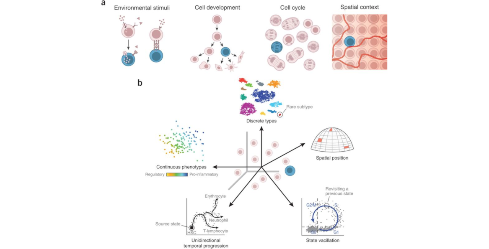
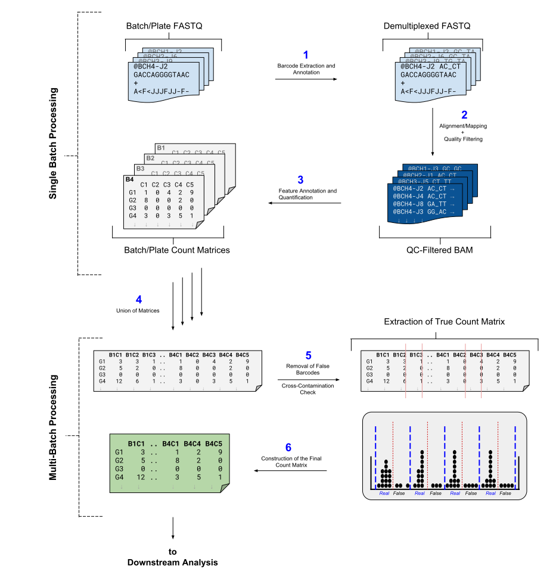
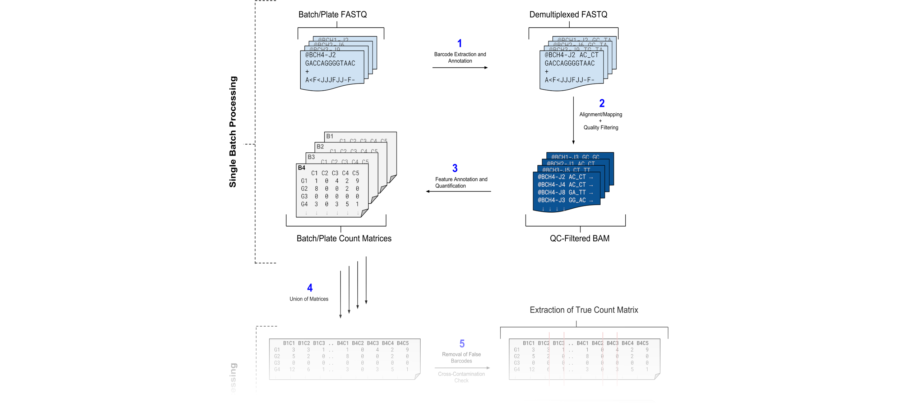

<!-- Questions for team

* Does it make sense to split out the Understanding Barcodes section into its own tutorial
* Does it make sense to split out the Understanding Plates and Batches into its own tutorial
* How do I set 'requirements'?
* All other tutorials have only 1 set of slides to accompany the material.
   - Here I will need seperate ones for: UMIs, CelSeq

Todo:
* Split "Mitigating duplicate transcript counts with UMIs"
* Snippets can be parameterised, so USE them more.

Feedback:
* BG says the concepts of Cell barcode, UMI, and overall barcode are confusing.

-->


<!-- Ideally need to place this in "assets/css/main.scss", but need to
     set a marker in the markdown to apply the correct table class
     during the conversion process. How? 
     
     <div class="matrix" /> 
      * before a matrix seems to work, but it 
        applies all the way down
        
      * applying it within the first line of the table seems to place it
        in the header, but that would make the css selectors difficult

-->
     
<style>

/*blockquote img {
  width: 100%;
  display: block;
  margin-left: auto;
  margin-right: auto;
}*/

.tutorial table { 
  width:unset;
  margin-left:auto;
  margin-right:auto;
}

.tutorial table thead th {
  border-bottom: 2px solid #777; 
  text-align: left;
}

.tutorial table td:first-child, .tutorial table th:first-child  {
  border-right: 2px solid #777; 
  font-weight: bold;
  text-align: left;
}

.tutorial table td:not(first-child), .tutorial table th:not(first-child) {
  text-align: center;
  border-right: 1px solid #ddd;
  border-left: 1px solid #ddd;
}

</style>


# Introduction
{:.no_toc}


## Why do Single Cell sequencing?
{:.no_toc}

Single-cell RNA (scRNA) sequencing is the technological successor to classical bulk RNA-seq, where samples are no longer defined at the tissue level but at the individual cell level. Under bulk RNA-seq the expression of genes in a sample would yield the average expression of all the constituent cells in that sample, irregardless of the distinct expressions profiles given by subpopulations of cells. The advent of scRNA sequencing has provided the means to explore samples at the individual cell level, enabling a greater understanding of the development and function of such samples by the characteristics of their constituent cells. Consider the heterogenity of cells sampled from bone marrow, where hematopoietic stem cells can give rise to many different cell types within the same tissue:

 
 
The genes expressed by these cells at different developmental time points can be subtle, but generally can be classified into discrete cell subpopulations or under statistical clustering methods such as PCA or tSNE. Cells in the same cluster exhibit similar profiles of differential expression in the same set of related genes, compared to cells in other clusters. By identifying significant genes in each cluster, cell types and cell developmental heirarchies can be inferred based on the proximity of these clusters to one another.

Other than cell development, there are many more factors that can shape the level of gene expression exhibited by a given cell. Intercellular cell-signalling can block or enhance specific transcripts, the total amount of transcripts of a cell increases with the cell-cycle, or the proximity of a cell within a tissue to nutrients or oxygen.

 


This tutorial is in part inspired by aspects of the [Hemberg workflow](https://hemberg-lab.github.io/scRNA.seq.course/) at the Sanger institute, as well as the [CGATOxford workflow](https://github.com/CGATOxford/UMI-tools) which provides the **UMI-tools** suite that we make use of. The barcoding follows the [CelSeq2 protocol](#details-the-celseq2-protocol) and uses the lane configuration as that utilized by the Freiburg MPI Grün lab.

# Analysis Strategy
{:.no_toc}

Most scRNA sequencing techniques use pooled-sequencing approaches to generate a higher throughput of data by performing amplification and sequencing upon multiple cells in the same "pool". From a bioinformatics standpoint, this means that the output FASTQ data from the sequencer is batch-specific and contains all the sequences from multiple cells.

In this tutorial, we will perform pre-processing upon scRNA FASTQ batch data to generate an *N*-by-*M*  count matrix of *N* cells and *M* genes, with each element indicating the level of expression of that gene in a particular cell.

This count matrix is crucial for performing the downstream analysis, where differential gene analysis is performed between cells in order to cluster them into groups denoting their cell type and lineage. 

The tutorial is structured in two parts:

 

The first part of this tutorial will use example *FASTQ* data from a single batch, which we will perform [barcode extraction](#understanding-barcodes) and annotation upon. Alignment and quality control will also be performed, and we will see how to construct a rudimentary count matrix. 


The second part of this tutorial will deal with [multiple batches](#multiple-batches), and a different set of example count matrices will be used in which to merge and perform quality control upon. This will produce a final count matrix valid for downstream analysis.


> ### Agenda
>
> In this tutorial, we will deal with:
>
> 1. TOC
> {:toc}
>
{: .agenda}

# Single Batch Processing

### Data upload and organization

In this tutorial we will be analysing scRNA-seq data of bone marrow cells taken from a single C57 mouse by *Herman et al.* ([2018](https://doi.org/10.1038/nmeth.4662)) and producing a count matrix that we can use for later analysis.

The size of scRNA files (.fastq) are typically in the gigabyte range and are somewhat impractical for training purposes, so we will expediate the analysis by using a smaller subset of actual batch data. We will also be using *Mus Musculus* annotation data (.gtf) from the  [NCBI RefSeq](ftp://ftp.ncbi.nlm.nih.gov/genomes/refseq/vertebrate_mammalian/Mus_musculus/) track, as well as a barcodes file (.tsv).

 


> ###  Hands-on: Data upload and organization
>
> 1. Create a new history and rename it (*e.g.* scRNA-seq single batch tutorial)
> 1. Import the following files from [`Zenodo`](https://zenodo.org/record/2554612) or from the data library (ask your instructor)
>    ```
>    https://zenodo.org/record/2554612/files/SRR5683689_1.fastq.gz?download=1
>    https://zenodo.org/record/2554612/files/SRR5683689_2.fastq.gz?download=1
>    https://zenodo.org/record/2554612/files/Mus_musculus.GRCm38.93.mm10.UCSC.ncbiRefSeq.gtf?download=1
>    https://zenodo.org/record/2554612/files/celseq_barcodes.192.tabular?download=1
>    ``` 
>    
>    Set the database annotation to 'mm10' into the Genome dropdown box and select it.
>    
>    
>    
>    
>    
>    
>
> 1. Set the datatype of the `celseq_barcodes.192.tabular` to `tsv`
> 1. Build a **Dataset pair** for the two FASTQ files
>    - Click the **Operations on multiple datasets** check box at the top of the history panel
>    - Check the two boxes next to the R1 and R2 scRNA FASTQ samples
>    - Click **For all selected...** and choose **Build dataset pair**
>    - Ensure that the forward read is the `_1` sample, and the reverse read is the `_2` sample.
>      - Click **Swap** otherwise.
>    - Set the name of the pair
>    
>    > ###  Tip: Naming conventions
>    > * Multiple batches can exist on the same plate, and multiple plates can be used in an analysis
>    > * This is further clarified [in detail](#understanding-plates-and-batches) later-
>    > * For now, a useful convention to follow is `<name>_<plate>_<batch>` in order to preserve the sample names, sequencing plate number and batch number.
>    >
>    > Here we will write `C57_P1_B1`
>    >
>    {: .tip}
>    
>    - Click *Hide original elements?*
>    - Click *Create list*
>
{: .hands_on}

## Understanding Barcodes

[Back to previous](javascript:window.history.back())

Barcodes are small random oligonucleotides that are inserted into the captured sequence at a specific point, and provide two pieces of information about the sequence:
  
 1. Which cell the sequence came from
 2. Which transcript the sequence came from

When the sequence is mapped against a reference genome, we can then see which gene locus it aligns to and qualitavely assert that, together with the two pieces of information above, the sequence depicts a transcript from a specific a gene that originated from a specific cell.

> ###  Questions about Cell Barcodes
>
> 1. Why is it important to know which cell a sequence came from?
> 2. Barcoding the cell makes sense, but why do we need to barcode the transcript too? i.e. Can we not infer which gene the sequence originates from by simply mapping it against the reference genome?
> 
> > ###  Solution
> >
> > 1. If our sequence codes for a *GeneX* which is a gene of interest, we may want to know which cells express GeneX more than others.   
> > e.g. If *CellA* has 10 times more *GeneX* sequences than *CellB*, then we know that *CellA* and *CellB* differ at *GeneX* - which might suggest a causative source of variation for any change in function between *CellA* and *CellB* (or cells in the same cluster as *CellA*, and cells in the same cluster as *CellB*).
> > 2. *Yes* and *no*!  
> > **Yes**: We can indeed align our sequence against a reference genome and obtain the name of the gene it aligns against. This sequence will then contribute to the 'count' of sequences that gene has, and increase the expression of that gene.  
> > **No**: We do not know whether these 'counts' are *unique*. Many of these counts could be duplicates as a result of the amplification process. To explain further, we must look at UMIs and their role in the analysis.
> {: .solution}
{: .question}

To explore the uniqueness of counts, we must discuss the inclusion of *UMIs* in a single-cell analysis.

> ###  Mitigating duplicate transcript counts with UMIs
>
> One of the major issues with sequencing is that the read fragments require amplification before they can be sequenced. A gene with a single mRNA transcript will not be detected by most sequencers, so it needs to be duplicated 100-1000x times for the sequencer to 'see' it.
>
>
> Amplification is an imprecise process however, since some reads are amplified more than others, and subsequent amplification can lead to these over-amplified reads being over-amplified even more, leading to an exponential bias of some reads over others.
>
> 
> 
>
> Consider the above example where two reads from different transcripts are amplified unevenly. The resulting frequency table would look like so:
>
>  |  | Reads in Cell 1 |
>  |--|------------------|
>  | Gene Red | 5 |
>  | Gene Blue | 0 |
>
> 
> But the truth is entirely different (i.e. Gene Red should have 1 count, and Gene Blue should also have 1 count). How do we correct for this bias?
>
> 
> **Unique Molecular Identifiers** (or *UMIs*) constitute the second portion of a barcode, where their role is to *uniquely* count reads such that amplicons of the same read are only counted once, e.g:
> 
>  
> 
> Here, we see two unique transcripts from Gene Red and two unique transcripts from Gene Blue, each given a (coloured) UMI. After amplificaiton, Gene Red has more reads than Gene Blue. If we were to construct a frequency table as before to count the reads, we would have:
> 
>  |  | Reads in Cell 1 |
>  |--|-----------------|
>  | Gene Red | 6 |
>  | Gene Blue | 3 |
>  
>  Which is wrong, because it shows that Red has twice the expression that Blue does. However, we can reconstitute the true count by considering the UMI information:
>  
>  |  | UMI colour  | Reads in Cell 1 |
>  |--|-------------|-----------------|
>  | Gene Red | Pink | 2 |
>  |          | Blue | 4 |
>  | Gene Blue | Brown | 1 |
>  |           | Green | 2 |
>  
> We can then make the decision to ignore the frequencies of these UMIs, and simply count how many *unique* UMIs we see in each gene:
> 
>  |  | Set of UMIs in Gene | UMIs in Cell 1 |
>  |--|---------------------|----------------|
>  | Gene Red | {Pink, Blue} | 2 |
>  | Gene Blue | {Brown, Green} | 2 |
>  
>  Which provides us with the true count of the number of true transcripts for each gene:
>  
>  |  | UMIs in Cell 1 |
>  |--|----------------|
>  | Gene Red | 2 |
>  | Gene Blue | 2 |
>
>
{: .details}

> ###  Questions about UMIs
>
> 1. Are UMIs specific to genes? i.e. Can the same UMI map to different genes?
> 2. Can the same UMI map to different mRNA molecules of the same gene?
> 
> > ###  Solution
> >
> 1. No. The same UMI can tag transcripts of different genes. UMIs are not universal tags, they are just 'added randomness' that help reduce amplification bias -- not unique to any particular gene.
> > 2. Yes, UMIs are not precise but operate probabilistically. In most cases, two transcripts of the same gene will be tagged by different UMIs. In rarer (but still prevalent) cases, the same UMI will capture different transcripts of the same gene.
> >  * One helpful way to think about how quantification is performed is to observe the following heirarchy of data `Cell Barcode → Gene → UMI`
> >
> >   e.g.
> > 
> >  | BC:Cell | BC:UMI | Maps to Gene |
> >  |------|-----|------|
> >  | AAAT | TCA | Slx1 |
> >  | AAAT | GTG | Slx2 |
> >  | AAAT | TCA | Gh13 |
> >  | TTAA | TCA | Slx1 |
> >  | TTAA | CCC | Atp3 |
> >
> > If UMIs were unique to a gene, then the `TCA` UMI barcode would not have reads that map to both *Slx1* and *Gh13* in the same cell (`AAAT`).
> >
> {: .solution}
>
{: .question}

### Barcoding Format

We now know the role of UMIs and cell barcodes, but how do we handle them in the analysis? Let us look at 4 example sequences in our paired-end FASTQ data.

> ###  Hands-on: Preparing the Data
>
>    1. Create a new history and rename it (*e.g.* 'Inspecting FastQ Files in scRNA batch data')
>    1. Import the following files from [`Zenodo`](https://zenodo.org/record/2554612) or from the data library (ask your instructor)
>    ```
>    https://zenodo.org/record/2554612/files/test_barcodes_celseq2_R1.fastq.gz?download=1
>    https://zenodo.org/record/2554612/files/test_barcodes_celseq2_R2.fastq.gz?download=1
>    ```
>    
>    
>    
>    
>    1. Build a *Dataset pair* for the two FASTQ files
>       - Click the *Operations on multiple datasets* check box at the top of the history panel
>       - Check the two boxes next to the R1 and R2 scRNA FASTQ samples
>       - Click *For all selected...* and choose *Build dataset pair*
>       - Ensure that the forward read is the `R1` sample, and the reverse read is the `R2` sample.
>          - Click 'Swap' otherwise.
>       - Set the name of the pair
>
>    1. Generate a list of reads to filter by creating a plain tabular file containing the following read names:
>        ```
>        J00182:75:HTKJNBBXX:2:1114:12469:11073
>        J00182:75:HTKJNBBXX:2:2222:13301:35690
>        J00182:75:HTKJNBBXX:2:1203:25022:13763
>        J00182:75:HTKJNBBXX:2:1115:8501:46961
>        ```
>    1. Set the datatype of the file as **tabular**
> 
{: .hands_on}

At this point we now have a history with two items: our paired FASTQ test data, and a tabular file of read names. We will now apply the tabular file to the FASTQ file and extract only those reads.

> ###  Hands-on: Extracting the Reads
>
> 1. Extracting our 4 reads  
>    * **Filter sequences by ID**  with the following parameters:
>      - **Sequence file to be filtered**
>        - Click the *Dataset Collection* icon
>        - Select the FastQ collection if not already selected.
>      - **Filter using the ID list from**:`tabular file`
>        - *Tabular file containing sequence identifiers*:`Pasted Entry`
>      - **Column(s) containing sequence identifiers**
>        - **Select/Unselect all**:(tick the box)
>      - **Output positive matches, negative matches, or both?**:`Just positive matches (ID on list), as a single file`
> 1. Viewing our 4 reads side-by-side
>    - Activate the **Scratchbook** by clicking on the **Enable/Disable Scratchbook** icon on the main top toolbar
>    - Click on the newly generated FastQ pair ending in *"with matched ID"* to expand the individual reads
>      - Click on the  symbol of the forward read
>      - Click somewhere outside the white box to close the **Scratchbook**
>      - Click on the  symbol of the reverse read
>    - Position/Resize the boxes as desired
{: .hands_on}

<!-- 
These are reads that all map to ENSDARG00000019692. In [Cell, UMI] format:

(J00182:75:HTKJNBBXX:2:1114:12469:11073|J00182:75:HTKJNBBXX:2:2222:13301:35690|J00182:75:HTKJNBBXX:2:1203:25022:13763|J00182:75:HTKJNBBXX:2:1115:8501:46961)

            Cell  , UMI
1: 46961 -- ACCAGA, GGAAGA
2: 13763 -- GGTAAC, GTCCCA -> same umi, same cell
3: 35690 -- GGTAAC, GTCCCA -> same umi, same cell
4: 11073 -- GGTAAC, CGGCGT -> diff umi, same cell
-->

### Our Four Reads of Interest

Let us examine these reads four reads of interest which we have just sub-selected using their headers:

> ###  Reads:
>
> Forward:
>
>         @J00182:75:HTKJNBBXX:2:1115:8501:46961 1:N:0:ATCACG
>         GGAAGAACCAGATTTTTTTTTTTTTTTTTT
>         +
>         AAFFFJJJJJJJFFFJJJJJJJJJJJJJJJ
>         
>         @J00182:75:HTKJNBBXX:2:1203:25022:13763 1:N:0:ATCACG
>         GTCCCAGGTAACTTTTTTTTTTTTTTTTTT
>         +
>         AAFFFJJJJJJJJFFJJJJJJJJJFJ<FF-
>         
>         @J00182:75:HTKJNBBXX:2:2222:13301:35690 1:N:0:ATCACG
>         GTCCCAGGTAACTTTTTTTTTTTTTTTTTT
>         +
>         AAFFFJJJJJJJ<AFJJJJJFFJJFJJJFF
>         
>         @J00182:75:HTKJNBBXX:2:1114:12469:11073 1:N:0:ATCACG
>         CGGCGTGGTAACTTTTTTTTTTTTTTTTCC
>         +
>         AAFFFJJJJJJJFAFFJJJJJJJJF---<F
>         
> 
> Reverse:
> 
>         @J00182:75:HTKJNBBXX:2:1115:8501:46961 2:N:0:ATCACG
>         GACCTCTGATCTTTACGAAAGGCCAACGCGTTTTCAGTCTGGACACGGTTCAGCTCCTGTTCATTATTCA
>         +
>         A<<A-777F<AA<AJJJJJJJJJJJJJJJJJJJJJJJJJJJJJJJJJJJJJJJJJJJJJJJJJJJJJJJJ
>         
>         @J00182:75:HTKJNBBXX:2:1203:25022:13763 2:N:0:ATCACG
>         GCCACCTAATTTCCGTCATCACACTCCTCTCCGTTTTCAACTTGCACAATGCTGTCTCCGCAGAATCCCT
>         +
>         ---<----<A---77-7A-FJ<JJFFJJ<JJAJ7<-FAFFJJFF<FFJJFFAJFA-AFFFJFFFFFJAJJ
>         
>         @J00182:75:HTKJNBBXX:2:2222:13301:35690 2:N:0:ATCACG
>         CAATCCTCTCCGTTATCAACTTGCACAATGCTGTCTCCGCAGAATCCCTCCGGATCAGGATCGCTCTCCA
>         +
>         <<A-77--77F<----7AFJ-A--FJJJFAJF-AFAJAJ<JFJ<JJJFFJJJFJJJJJAAFJJJFJJJF-
>         
>         @J00182:75:HTKJNBBXX:2:1114:12469:11073 2:N:0:ATCACG
>         ATCCACTTATTGCAAAGCAGAGGACATTGAGTCTCACCTTTTGTCCAGGTCTTCCAATTTCACCCTGCAA
>         +
>         A-77AA-7FF<7FFJFFFJJJJJJJJJJJJJ-AFJJJJJJJFJJJJJJJJJJJJJJJJJJJJJJJJJJJJ
>         
{: .details}

What we observe are the standard four lines of any FASTQ file:
  1. Read name starting with `@`
  2. Sequence of nucleotide bases
  3. Seperator `+`
  4. Quality string of the nucleotide bases in ASCII

The main source of interest for us is in the (2) sequences of these reads, which somewhere within encode for three crucial pieces of information that we will need to perform quantification:

  1. Cell Barcode
  2. UMI Barcode
  3. Reverse-transcribed mRNA sequence

These can be encoded into the sequences of our paired-end data by any means. In order to know where our barcodes are, we must be familiar with the sequencing primers used in the analysis:

> ###  The CelSeq2 protocol
> 
> CelSeq2 is a paired-end protocol, meaning that two primers bind to opposite strands in order to sequence. Each primer has a specific role. In this case; *Read1* contains the barcoding information followed by the polyT tail of the messenger RNA, and *Read2* contains the actual sequence. Here, Read1 is regarded as the 'forward' strand and Read2 as the 'reverse' strand, though this is more a convention when dealing with paired-end data rather than an indication of the actual strand orientation.
>
> 
>
> [Back to previous](javascript:window.history.back())
{: .details}

#### Verifying the Barcode Format

As shown in [CelSeq2 Primer Figure](#details-the-celseq2-protocol), we have the following encoding:
 * Forward Read:
    * 01-06bp: UMI Barcode
    * 07-12bp: Cell Barcode
    * 13-30bp: Poly-T tail
 * Reverse Read:
    * 01-70bp: mRNA sequence

The encoding of the barcodes on the first read can actually be seen by examining the distribution of bases in a FastQC plot.

> ###  Hands-on: Confirming the Barcoding
>
> 1. **FastQC**  with the following parameters:
>    -  *"Short read data from your current history"*: `Paired FastQ` (the original paired set)
>
>    > ###  Comment
>    >
>    > We are only interested in the distribution of bases on the Forward read, but it is more convenient to process the data as a pair instead of un-hiding the original dataset
>    {: .comment}
>
> 1. Click on *FastQC on collection :Webpage*
> 1. Click on the  of the Forward read
> 1. Click on the *Per base sequence content* header on the side-bar
{: .hands_on}


 


Here we can see the three distinct regions along the x-axis that correspond to our expected CelSeq2 Schema:

 * 01 - 06 bp: smooth, relatively constant bases.
 * 07 - 12 bp: noisy, highly varied distribution of bases.
 * 13 - 30b p: T-dominated region

We can see that the distribution of the first 6bp is relatively more even than the following 6bp which seems to have more extreme variation. 

> ###  Question
>
> Why is this the case? Why is the UMI barcode base distribution smoother than the Cell barcode base distribution?
> > 
> > ###  Solution
> > 
> > There are far more UMIs than cells. Cell barcodes are designed and selected with a specified edit distance, greatly limiting their availability in the data. UMIs are not so well-curated -- i.e it is possible to encounter the same UMI in the same cell multiple times. The more extreme variation in the 7-12bp region is simply caused by a fewer number of samples.
> >
> {: .solution}
{: .question}


### Uniting Barcodes with Sequence

In a sense, we have a disparity in our data: the reverse reads contain the sequences we wish to map, but not the barcodes; the forward reads contain the barcode, but not the sequence. For the forward and reverse reads given above, the information that we really want from both can be summarized in this table:

 | Read | Cell | UMI | Sequence |
 |------|------|-----|----------|
 | @J00182:75:HTKJNBBXX:2:1115:8501:46961  | ACCAGA | GGAAGA | GACCTCTGATCTTTACGAAAGGCCAACGCGTTTTCAGTCTGGACACGGTTCAGCTCCTGTTCATTATTCA |
 | @J00182:75:HTKJNBBXX:2:1203:25022:13763 | GGTAAC | GTCCCA | GCCACCTAATTTCCGTCATCACACTCCTCTCCGTTTTCAACTTGCACAATGCTGTCTCCGCAGAATCCCT |
 | @J00182:75:HTKJNBBXX:2:2222:13301:35690 | GGTAAC | GTCCCA | CAATCCTCTCCGTTATCAACTTGCACAATGCTGTCTCCGCAGAATCCCTCCGGATCAGGATCGCTCTCCA |
 | @J00182:75:HTKJNBBXX:2:1114:12469:11073 | GGTAAC | CGGCGT | ATCCACTTATTGCAAAGCAGAGGACATTGAGTCTCACCTTTTGTCCAGGTCTTCCAATTTCACCCTGCAA |

> ###  Question
> 
> Provided that these reads all map to the same gene:
>
> 1. Which of these reads come from the same cell?
> 2. Which of these reads are duplicates?
>
> > ###  Solution
> > 
> > 1. Reads:
> >  * `@J00182:75:HTKJNBBXX:2:1203:25022:13763`
> >  * `@J00182:75:HTKJNBBXX:2:2222:13301:35690`
> >  * `@J00182:75:HTKJNBBXX:2:1114:12469:11073`   
> >  all have the cell barcode `GGTAAC`.
> > 
> > 2. Reads:
> >  * `@J00182:75:HTKJNBBXX:2:1203:25022:13763`
> >  * `@J00182:75:HTKJNBBXX:2:2222:13301:35690`  
> >  are duplicates, since they both have the same cell barcode and same UMI.
> > 
> > However, they are not direct duplicates of each other. since their sequences are different. However, they do stem from the same read as evidenced by their overlap:
> >
> >          13763:   GCCACCTAATTTCCGTCATCACACTCCTCTCCGTTTTCAACTTGCACAATGCTGTCTCCGCAGAATCCCT
> >          35690:                        CAATCCTCTCCGTTATCAACTTGCACAATGCTGTCTCCGCAGAATCCCTCCGGATCAGGATCGCTCTCCA
> >
> {: .solution}
{: .question}

#### Coupling our Data Sources

How should we unite these two source of information into a single location without impacting the data content?

For this we need to take the barcode information from the Forward reads, and stick it into the *header* of the Reverse reads. That way we can align our sequence to the reference and still keep the barcode information associated with the reads.

> ###  Hands-on: Barcode Extraction and Annotation of our 4 reads
>
> 1. **UMI-tools extract**  with the following parameters:
>    - *"Library type"*: `Paired-end Dataset Collection`
>        -  *"Reads in FASTQ format"*: `output` (Our paired set of 4 sequences)
>        - *"Barcode on both reads?"*: `Barcode on first read only`
>    - *"Use Known Barcodes?"*: `No`
>    - *"Barcode pattern for first read"*: `NNNNNNCCCCCC`
>    - *"Enable quality filter?"*: `No`
>
>    > ###  Comment
>    >
>    > - Here we specify the format of our barcodes as `NNNNNNCCCCCC` where the *N*s represent UMI bases and the *C*s represent the cell barcodes.
>    > - In some protocols, actual sequence data can be found in between the cell and UMI barcodes, wherein it is neccesary to represent sequence bases using *X*.
>    > - e.g. A protocol that starts with a 3bp sequence, followed by a 4bp Cell barcode, followed once again by a 10bp sequence, and then finally a 5bp UMI barcode, would require the following barcode format:  
>    >   `XXXCCCCXXXXXXXXXXNNNNN`
>    >
>    {: .comment}
> 1. Click the  symbol on the *Reads1: UMI-tools extract* file
> 1. Click somewhere outside the white box to close the **Scratchbook**
> 1. Click the  symbol on the *Reads2: UMI-tools extract* file
> 
{: .hands_on}

We should now be able to see the following reads:

> ###  Reads:
>
> Forward:
>
>        @J00182:75:HTKJNBBXX:2:1115:8501:46961_ACCAGA_GGAAGA 1:N:0:ATCACG
>        TTTTTTTTTTTTTTTTTT
>        +
>        FFFJJJJJJJJJJJJJJJ
>
>        @J00182:75:HTKJNBBXX:2:1203:25022:13763_GGTAAC_GTCCCA 1:N:0:ATCACG
>        TTTTTTTTTTTTTTTTTT
>        +
>        JFFJJJJJJJJJFJ<FF-
>
>        @J00182:75:HTKJNBBXX:2:2222:13301:35690_GGTAAC_GTCCCA 1:N:0:ATCACG
>        TTTTTTTTTTTTTTTTTT
>        +
>        <AFJJJJJFFJJFJJJFF
>
>        @J00182:75:HTKJNBBXX:2:1114:12469:11073_GGTAAC_CGGCGT 1:N:0:ATCACG
>        TTTTTTTTTTTTTTTTCC
>        +
>        FAFFJJJJJJJJF---<F>
>
> Reverse:
> 
>        @J00182:75:HTKJNBBXX:2:1115:8501:46961_ACCAGA_GGAAGA 2:N:0:ATCACG
>        GACCTCTGATCTTTACGAAAGGCCAACGCGTTTTCAGTCTGGACACGGTTCAGCTCCTGTTCATTATTCA
>        +
>        A<<A-777F<AA<AJJJJJJJJJJJJJJJJJJJJJJJJJJJJJJJJJJJJJJJJJJJJJJJJJJJJJJJJ
>
>        @J00182:75:HTKJNBBXX:2:1203:25022:13763_GGTAAC_GTCCCA 2:N:0:ATCACG
>        GCCACCTAATTTCCGTCATCACACTCCTCTCCGTTTTCAACTTGCACAATGCTGTCTCCGCAGAATCCCT
>        +
>        ---<----<A---77-7A-FJ<JJFFJJ<JJAJ7<-FAFFJJFF<FFJJFFAJFA-AFFFJFFFFFJAJJ
>
>        @J00182:75:HTKJNBBXX:2:2222:13301:35690_GGTAAC_GTCCCA 2:N:0:ATCACG
>        CAATCCTCTCCGTTATCAACTTGCACAATGCTGTCTCCGCAGAATCCCTCCGGATCAGGATCGCTCTCCA
>        +
>        <<A-77--77F<----7AFJ-A--FJJJFAJF-AFAJAJ<JFJ<JJJFFJJJFJJJJJAAFJJJFJJJF-
>
>        @J00182:75:HTKJNBBXX:2:1114:12469:11073_GGTAAC_CGGCGT 2:N:0:ATCACG
>        ATCCACTTATTGCAAAGCAGAGGACATTGAGTCTCACCTTTTGTCCAGGTCTTCCAATTTCACCCTGCAA
>        +
>        A-77AA-7FF<7FFJFFFJJJJJJJJJJJJJ-AFJJJJJJJFJJJJJJJJJJJJJJJJJJJJJJJJJJJJ
>
{: .details}


> ###  Question
>
> 1. Compare the Forward/Read1 and Reverse/Read2 reads to those prior the extraction. What has happened to the header and sequence of each read?
> 2. Are the Forward reads useful at all?
>
> > ###  Solution
> >
> > 1. Comparison:
> >    * Forward:
> >       * Sequence: The `cell` and `umi` sections of the sequence have been removed, leaving behind only the PolyT tail.
> >       * Header: The `cell` and `umi` sections of the sequence have been added as `cell_umi` barcode in the header
> >    * Reverse:
> >       * Sequence: Has not changed.
> >       * Header: The `cell` and `umi` sections of the sequence from the Forward (note: **NOT** Reverse) reads have been added to the header.
> > 2. With the inclusion of the cell and umi barcodes into the header of our sequence data, we now have all our useful data in the Reverse reads. We can now effectively throw away our Forward reads, as they have no more useful information within them.
> {: .solution}
{: .question}


#### Barcode Extraction

Let us now repeat the same barcode extraction on our batch data. This time we will only be looking for *specific* cell barcodes, which we will ensure by providing the barcodes file.

> ###  Hands-on: Barcode Extraction
>
> 1. Switch back to the first History
>   - Click the *View all histories* icon
>   - Locate the history with our paired data set, barcodes, and annotation file
>   - Click the *Switch to* button above the appropriate history.
> 2. **UMI-tools extract**  with the following parameters:
>    - *"Library type"*: `Paired-end Dataset Collection`
>        -  *"Reads in FASTQ format"*: `output` (Our paired set)
>        - *"Barcode on both reads?"*: `Barcode on first read only`
>    - *"Use Known Barcodes?"*: `Yes`
>        -  *"Barcode File"*: `output` (Input dataset)
>    - *"Barcode pattern for first read"*: `NNNNNNCCCCCC`
>    - *"Enable quality filter?"*: `No`
>
{: .hands_on}

<!--- TODO: maybe talk about this later, it's not really required, and is more about predicting 
> ###  Details: Filtering for Wanted Cell Barcodes
>
> **UMI-tools** provides many ways to select for barcodes:
>  1. 
> 
> 
-->

As before, we can verify that the desired umi and cell barcodes have been extracted from the sequence of the Forward reads and inserted into the header of the Reverse reads.

> ###  Question
> 
> 1. Why are input and output FASTQ file sizes so different?
> 2. How many reads were filtered out, and why?
>
> > ###  Solution
> >
> > 1. The input FASTQ files contained reads from all barcodes, including those with sequencing errors, resulting in a larger pool of detected barcodes than those desired. (e.g. Cell barcode `AAATTT` could have single basepair sequencing errors that could modify it into `ATATTT` or `AAACTT`, etc).
> > 2. This information is included in the Log file of **UMI-tools extract** which contains all the parameters used to run, as well as *INFO* lines that indicate how many reads were read, and how many output. In this case: 14230244 reads (90.9%)
> {: .solution}
{: .question}


## Mapping / Alignment

In their raw state, FASTQ files do not tell us very much. The sequences they signify align to genes in a genome, and it is these genes that we are interested in.

Mapping is a relatively straightforward process, and is covered more extensively in the [Galaxy NGS tutorial]({{site.baseurl}}/topics/sequence-analysis):

 1. Select your genome
 2. Select your gene annotation file
 3. Run the alignment program
 3. Run MultiQC on the resulting log

The FASTQ data was sequenced from mouse data, so to perform the alignment we will need to gather all data relevant to that genome. We will use the latest version (mm10).

The annotation GTF file must match the genome version used, since both use physical coordinates. Each GTF contains all the gene, exon, intron, and other regions of interest that we will use to annotate our reads, should our reads align to any of the regions specified in this file.

For alignment, we will use RNA-STAR for performance and splice-awareness.


> ###  Hands-on: Performing the Alignment
>
> 1. Obtain the GTF file and import it into our history.
>   - Click on the [Zenodo](https://zenodo.org/record/2554612) link and import the **Mus_musculus.GRCm38.93.mm10.UCSC.ncbiRefSeq.gtf (mm10)** GTF file if not already present
> 2. **RNA-STAR**  with the following parameters:
>    - *"Single-end or paired-end reads"*: `Single-end`
>        -  *"RNA-Seq FASTQ/FASTA file"*: `out2` (output of **UMI-tools extract** )
>    - *"Custom or built-in reference genome"*: `Use a built-in index`
>        - *"Reference genome with or without an annotation"*: `use genome reference without builtin gene-model`
>            -  *"Select reference genome"*: `Mus Musculus (mm10)` (Mouse)
>            -  *"Gene model (gff3,gtf) file for splice junctions"*: `output` (Select the GTF file we imported into our history)
> 3. **MultiQC**  with the following parameters:
>    - *"Results"*:
>      - *"1: Results"*:
>        - *"Which tool was used to generate logs?"*:`STAR`
>        - *"STAR output"*:
>           - *"1: STAR output"*
>              - *"Type of STAR output?"*:`Log`
>        - *"STAR log output"* :(Select the STAR output file that ends in "log")
> 4. Click on the  symbol on the MultiQC Webpage
>
{: .hands_on}

The purpose of MultiQC is to observe how well our reads were mapped against the reference genome. Many reads are discarded due to being of too low quality, or having ambiguous sequence content that can map them to multiple locations.

> ###  Question
> 
> 1. What percentage of our reads are uniquely mapped? How many millions of reads is this percentage?
> 2. What percentage of our reads are mapped to more than one locus?
> 3. Is our overall mapping 'good' ?
>
>
> > ###  Solution
> > 
> > 1. `70.9%` or 10 million reads were successfully mapped
> > 2. `14.4%` are multiply mapped, and `2.2%` were mapped to too many loci
> >   - Multiply mapped means that a read was aligned to more than one gene
> >   - Mapped to too many loci means that a read was aligned to 10 or more loci, and should be ignored.
> > 3. It depends on how good the sequencing protocol is, and how many reads in total were mapped.
> >   - `90%` is amazing, reserved for bulk RNA-seq which typically has high coverage
> >   - `70%` is weak for bulk RNA-seq, but good for single-cell RNA-seq
> >   - 6 million mapped reads should be enough to generate a downstream analysis from.
> >
> {: .solution}
{: .question}


## Filtering

Before continuing let us first look back on some of the previous stages:

> ###  Recap of previous stages
>
> 1. *Barcode Extraction*:  
>   Here we used `umi_tools extract` on our input forward and reverse FASTQ files, and extracted the umi and cell barcode from the forward read *sequence*, and placed it into the *header* of both forward and reverse FASTQ files. i.e. FASTQ files → Modified FASTQ files  
> 2. *Mapping*:  
>   We took the sequencing data from the reverse FASTQ file (with modified headers) and aligned it to the mouse genome, using annotations presented in the GTF file for that genome. i.e. Modified FASTQ file (reverse) → BAM file
>
{: .comment}

#### Confirming Reads in the BAM file

We now have a BAM file of our aligned reads, with cell and UMI barcodes embedded in the read headers. We also have the chromosome and base-pair positions of where these reads are aligned. The can be confirmed by peeking into the BAM file:

> ###  Hands-on: Confirming the Alignment Data
>
>  1. Click on the eye symbol of the BAM output from STAR.
>  2. There are many header lines that begin with `@` which we are not interested in. 
>  3. Do a Ctrl+F search for `@co` and then look at the lines directly below it.  
>     One such read is given as so:
> 
>         J00182:75:HTKJNBBXX:2:1121:9729:45889_GACGAA_GTGGTC	16	chr1	2030	3	70M	*	0	0	AGAGGTTCCAATATTCCCATGAAATTGAGATTTTGTAAAAGAGTGAAGTGTGGTTACTTTCACTGAGAGG	JJJJJJJJJJJJJJJJJJJJJJJJFJJJJJAJJJJJJJJJJFJFJFFJJJJJJJJJJJJFF7AJA-77<A	NH:i:2 HI:i:1 AS:i:64 nM:i:2
>
{: .hands_on}

The fields of the BAM file can be better explained at section 1.4 of [the SAM specification](https://samtools.github.io/hts-specs/SAMv1.pdf), but we will summarize the main fields of interest here:

 * `J00182..._GACGAA_GCGGTC`: The *readname* appended by `_`, the cell barcode, another `_`, and then the UMI barcode.
 * `16`: The FLAG value

> ###  What does the FLAG value of 16 tell us about this read?
>
>   We can interactively see what the different FLAG values mean by feeding values into the SAM specification to the [picard web tool](https://broadinstitute.github.io/picard/explain-flags.html)
>   > ###  Solution
>   > The read aligns to the reverse strand
>   >
>   {: .solution}
>
{: .question}

 * `chr1` `2030`: The position and base-pair of alignment of the first base of the sequence.
 * A series of quality fields, with the main contributors being  the sequence and sequence quality strings.
 * `NH`: The number of hits for  this read. If it is multiply mapped, then the number of multiples will be shown (here `2`).
 * `HI`: Which number this particular read is in the series of (potentially) multi-mapped reads (here `1`, not neccesarily meaning the first or 'better').
 * `nM`: The number of mismatches in the alignment of this read to the reference (here `2`).


#### Filtering the BAM File

If we perform counting on the current BAM file we will be counting all reads, even the undesireable ones such as those that did not align so optimally.

The main filtering steps performed on our reads so far have been relatively silent due to the 'default' parameters used.
 * *UMI-tools Extract* - Filters reads for those only with matching barcodes given by our barcodes file.
 * *RNA-STAR* - As seen in the log, we lose 10% of our reads for being too short or being multiply mapped.

Another filtering measure we can apply is to keep reads that we are confident about, e.g those with a minimum number of mismatches to the reference within an acceptable range. 

> ###  Hands-on: Task description
>
> 1. **Filter**  with the following parameters:
>    -  *"BAM dataset(s) to filter"*: `output_bam` (output of **featureCounts** )
>    - In *"Condition"*:
>        - Click on *"Insert Condition"*:
>        - In *"1: Condition"*:
>            - In *"Filter"*:
>                - Click on *"Insert Filter"*:
>                - In *"1: Filter"*:
>                    - *"Select BAM property to filter on"*: `alignmentFlag`
>                        - *"Filter on this alignment flag"*: `0`
>        - Click on *"Insert Condition"*:
>        - In *"2: Condition"*:
>            - In *"Filter"*:
>                - Click on *"Insert Filter"*:
>                - In *"1: Filter"*:
>                    - *"Select BAM property to filter on"*: `alignmentFlag`
>                        - *"Filter on this alignment flag"*: `16`
>        - Click on *"Insert Condition"*:
>        - In *"3: Condition"*:
>            - In *"Filter"*:
>                - Click on *"Insert Filter"*:
>                - In *"1: Filter"*:
>                    - *"Select BAM property to filter on"*: `tag`
>                        - *"Filter on a particular tag"*: `nM:<3`
>        - Click on *"Insert Condition"*:
>        - In *"4: Condition"*:
>            - In *"Filter"*:
>                - Click on *"Insert Filter"*:
>                - In *"1: Filter"*:
>                    - *"Select BAM property to filter on"*: `tag`
>                        - *"Filter on a particular tag"*: `NH:<2`
>    - *"Would you like to set rules?"*: `Yes`
>        - *"Enter rules here"*: `(1 | 2) & 3 & 4`
>
{: .hands_on}


## Quantification 

Once we have the name of the gene for a specific read, we can tally how many of those reads fall into that gene and generate a count matrix.

Tallying reads is performed by two commonly-used tools:
 1. RNA-STAR
 2. FeatureCounts

**RNA-STAR** indeed has the recent ability to count reads as it maps them. **FeatureCounts** performs the same task, but it is more qualitative than **RNA-STAR** since it is capable of counting not just at the Read level, but also at the UMI level, such that 10 duplicate reads at GeneA will be counted only once. 

Unfortunately, both are limited to counting without being able to distinguish between different cells. 

> ###  Example
>
> e.g. If we consider the number of reads that align to *GeneA*, the output given by these two tools is as follows:
>
> | (reads) | RNA STAR | FeatureCounts |
> |---------|----------|---------------|
> | GeneA   |   12     |    12         |
> 
>
> But what we actually require is:
>
> | (reads) | C1 | C2 |
> |---------|----|----|
> | GeneA   | 10 |  2 |
>
> or more specifically:
>
> | (umis) | C1 | C2 |
> |--------|----|----|
> | GeneA  | 2  |  1 |
{: .details}


In order to obtain this desired format, we must use **UMI-tools count** to perform the tallying. However, this tool is dependent on **FeatureCounts** to annotate our reads with the one crucial piece of information that is missing from our BAM file: the name of the gene.

> ###  Tip: Verifying missing gene name
> You can check this yourself by examining the  of the STAR Alignment file
{: .comment}

### Annotating Gene name with FeatureCounts


> ###  Hands-on: Quantification assist via FeatureCounts
> 
> Let us annotate our BAM file with desired gene tags.
> 
> 1. **FeatureCounts**  with the following parameters:
>  -  *"Alignment file"*: `mapped_reads` (output of **RNA STAR** )
>    - *"Gene annotation file"*: `in your history`
>        -  *"Gene annotation file"*: `output` (Input dataset) (The GTF file we imported earlier))
>    - *"Specify strand information"*:`Unstranded`
>    - In *"Advanced options"*:
>        - *"Count multi-mapping reads/fragments"*: `Disabled; multi-mapping reads are excluded (default)`
>        - *"Exon-exon junctions"*: `Yes`
>        - *"Annotates the alignment file with 'XS:Z:'-tags to described per read or read-pair the corresponding assigned feature(s)."*: `Yes`
>
> 2. Examine the output BAM file
>  - Click on the  for the "Feature Counts: Alignment File"
>  - Scroll down past the header lines
>  - Scroll horizontally to the tags, observe the new `XT` tag.
{: .hands_on}

The `XS` and `XT` tags in the BAM file will now form the basis for which we will tally reads.
With all the relevant data now in our BAM file, we can actually perform the counting via `UMI-tools count`.

> ###  Tip: Verifying added gene name
> You can once again check this yourself by examining the  of the STAR Alignment file
{: .comment}


### Counting Genes / Cell

> ###  Hands-on: Final Quantification
> 
> **UMI-tools counts**  with the following parameters:
>    -  *"Sorted BAM file"*: `out_file1` (output of **Filter** )
>    - *"Umi Extract Method"*: `Barcodes are contained at the end of the read seperated by a delimiter`
>    - *"Method to identify group of reads"*: `Unique`
>    - *"Prepend a label to all column headers"*: `Dataset Name`
>    - *"Bam is paired-end"*:`No`
>    - *"Method to identify group of reads"*:`Unique`
>    - *"Extra Parameters"*:
>       - *"Deduplicate per gene."*:`XT`
>       - *"Group reads only if they have the same cell barcode."*:`Yes`
>  - *"Prepend a label to all column headers"*:`No modifications`
>
{: .hands_on}


The important parameters to take note of are those given in the *Extra Parameters* where we specify that each of the reads with a `XT:Z` tag in the BAM file will be counted on a per cell basis. Reads sharing the same UMI and cell Barcodes will be de-duplicated into a single count, reducing PCR duplicate bias from the analysis.

At this stage, we now have a tabular file containing genes/features as rows, and cell labels as headers.

> ###  Question
> 
> 1. How many genes do we have in the matrix?
> 2. How many cells?
>
> > ###  Solution
> >
> > This information can be seen without having to directly observe the file by simply clicking on the name of the file (**NOT** the  symbol). The number of columns can be seen by scrolling the file preview window completely to the right.
> >
> > 1. ~23,000 lines 
> > 2. 192 columns (not including the first column of gene names)
> >
> {: .solution}
{: .question}

The generation of a single count matrix is now complete, with the emphasis on the word *single* due to the fact that we often deal in multiple batches of sequencing data.


> ###  Recap of previous stages
>
> 1. *Barcode Extraction*:  
>   Here we used `umi_tools extract` on our input forward and reverse FASTQ files, and extracted the umi and cell barcode from the forward read *sequence*, and placed it into the *header* of both forward and reverse FASTQ files. i.e. FASTQ files → Modified FASTQ files  
> 2. *Mapping*:  
>   We took the sequencing data from the reverse FASTQ file (with modified headers) and aligned it to the mouse genome, using annotations presented in the GTF file for that genome. i.e. Modified FASTQ file (reverse) → BAM file
> 3. *Quality Filtering*:  
>  Reads with aligment mismatches greater than 2 were discarded, and only non multi-mapped reads that mapped to the forward or reverse strand were kept
> 4. *Quantification*:  
>  Gene tags were added to our alignment file, and reads were grouped according those sharing the same gene tag, with further reduction performed by collapsing all reads sharing the same cell and UMI barcode to be counted only once.
>
{: .comment}

This concludes the first part of the tutorial which focused on the transformation of raw FASTQ data from a single batch into a count matrix. The second part of this tutorial guides us through the handling of multiple batches, and the challenges faced with different library preperation setups.


# Multiple Batches

[Back to previous](javascript:window.history.back())

 

Handling more than one batch of sequencing data is rather trivial when we take into account our main goals and requirements:

  1. For each batch, convert FASTQ reads from into a count matrix.
  2. Merge all count matrices into a single count matrix

The first step requires us to merely run the same workflow on each of our batches, using the exact same inputs except for the FASTQ paired data. The second step requires a minimal level of interaction from us; namely using a merge tool and selecting our matrices. 


### Data upload and organization

The count matrix we have generated in the previous section is too sparse to perform any reasonable analysis upon, and constitutes data only of a single batch. Here we will use more populated count matrices from multiple batches, under the assumption that we now know how to generate each individual one of them using the steps provided in the previous section. This data is available at [`Zenodo`](https://zenodo.org/record/2554612).

Once again, file naming is important, and so we will rename our matrix files appropriately to the plate and batch they are supposed to originate from.

> ###  Hands-on: Data upload and organization
>
> 1. Create a new history and rename it (*e.g.* scRNA-seq multiple-batch tutorial)
> 1. Import the four matrices (`P1_B1.tabular`, `P1_B2.tabular`, etc.) from [`Zenodo`](https://zenodo.org/record/2554612) or from the data library (ask your instructor)
>    - Set the datatype of the tabular files to **tabular**
>
>    ```
>    https://zenodo.org/record/2554612/files/P1_B1.tabular?download=1
>    https://zenodo.org/record/2554612/files/P1_B2.tabular?download=1
>    https://zenodo.org/record/2554612/files/P2_B3.tabular?download=1
>    https://zenodo.org/record/2554612/files/P2_B4.tabular?download=1
>    ```
>    
>    
>    
>    
> 1. Rename a matrix
>    - Click on  of the *`P1_B1.tabular`* file
>    - Set the Name field such that it is affixed with "_P1_B1" (e.g. 'multibatch_P1_B1')
>    - Click *Save*
> 1. Repeat for all matrices
>    - **Pay attention to the Plate number which changes after Batch 4**
>
{: .hands_on}

## Merging Count Matrices

Before we begin, we must consider that our matrices are not equal -- e.g. Batch1 has at least 1 cell that maps to GeneA, whereas Batch2 has no mention of GeneA.

This can be resolved by performing a "Full Join" (as described [here](http://www.sql-join.com/sql-join-types/)) where GeneA is inserted into Batch2 as a gene with 0 counts:

          B1     | C1 | C2 | C3 |                       B2     | C1 | C2 | C3 |
         --------+----+----+----|   + (Full Join) +    --------+----+----+----|
          GeneA  | 3  | 0  | 1  |                       GeneM  |  0 | 3  | 2  |
          GeneM  | 2  | 2  | 1  |                       GeneX  | 10 | 2  | 7  |


      =      Full   | B1_C1 | B1_C2 | B1_C3 | B2_C1 | B2_C2 | B2_C3 |
            --------+-------+-------+-------+-------+-------+-------|
             GeneA  |   3   |   0   |   1   |    0  |   0   |    0  | ← Exists in B1
             GeneM  |   2   |   2   |   1   |    0  |   3   |    2  | ← Common in Both
             GeneX  |   0   |   0   |   0   |   10  |   2   |    7  | ← Exists in B2


> ###  Question
>
> 1. Why have the column headers changed in the Full matrix?
> 2. Why are the cell labels in B1 and B2 the same, if they are labelling completely different cells?
> 
> > ###  Solution
> >
> > 1. Although the cell headers in each batch matrix is the same, **the cells they label are NOT the same** and need to be relabelled in the final matrix to tell us which batch they originated from.
> > 2. The reason the cell headers are the same is because the cells use the **same barcodes**, due to fact that the same barcodes are used across different batches.
> >
> {: .solution}
{: .question}


Let us now merge our matrices from different batches.

> ###  Hands-on: Table Merge
> 
> Select **Column Join on Collections**  with the following parameters:
> - *"Tabular Files"*: (Select each of the matrices that you wish to join)  
> - *"Identifier column"*:`1`  
> - *"Number of Header lines in each item"*:`1`  
> - *"Keep original column header"*:`Yes`  
> - *"Fill character"*:`0`  
>
{: .hands_on}

The identifier column refers to the column where the gene names are listed. A 1:1 correspondence between matrices is checked, so that the merge does not concatenate the wrong rows between matrices. The *Fill character* provides a default value of 0 for cases where a Gene appears only in one of the matrices as per our example earlier.

Once the merge is complete, we can now peek at our full combined matrix by once again clicking on the file name to see a small summary. Here we can see that we now have ~30,000 genes and over 1500 cells.

**Or do we?**

It is true that we have applied the same cell barcodes to each batch -- but -- **not all batches neccesarily use the same barcodes** to select their cells. For example, Batch1 might only use cell barcodes 1-50 in the barcodes file, and Batch2 might only use cell barcodes 51-100 in the barcodes file.
 
We must thus question why different sets of the same superset of barcodes be used on different batches? To answer this, we must understand some of the technicalities of the library preparation.

## Understanding Plates and Batches

[Back to previous](javascript:window.history.back())

Plates are $$N \times M$$ arrays or wells that cells are sorted into and then individually amplified and sequenced. The way these slot are filled depends entirely on the protocol, but usually not all slots are filled. The reason for this will become clear momentarily.

     | . . . . . . . . . |  <- Plate: N=9, M=6        | . . . : . . . : . . . |  <---   Plate: N=9, M=6, 3 lanes
     | . . . . . . . . . |            54 slots        | . . . : . . . : . . . |                54 slots
     | . . . . . . . . . |                            | . . . : . . . : . . . |          Lane: n=3, m=6
     | . . . . . . . . . |                            | . . . : . . . : . . . |                18 slots per lane
     | . . . . . . . . . |                            | . . . : . . . : . . . |
     | . . . . . . . . . |                            | . . . : . . . : . . . |
    

Plates are divided into different sequencing *lanes*. These lanes demarcate evenly-sized $$n\times m$$ rectangular regions on a plate containing different non-overlapping sets of slots on the same plate. 

All slots within a given lane are sequenced at the same time, and because of this characteristic, all cells that fill the slots of a given lane are said to be of the same *batch* (where lanes and batches are usually interchangeable terms).

There are three main variables that can dictate the library preparation setup:

 1. Number of available cell barcodes
 1. Number of slots on a plate
 1. Number of slots in a lane/batch

 
The last two can be explained by exploring different example plating arrangements of the sequencer, and the first can be explained via a better understanding of how cell barcodes are generated.
 
#### A Closer Look at Cell Barcodes

The number of cell barcodes sets the *minimum size of each batch*. If we have only 10 barcodes, then only 10 cells can be uniquely labelled without us having to start reusing barcodes on different cells

> ###  Question
>
> Why would it be bad practice to reuse the same barcodes in a batch?
>
> > ###  Solution
> >
> > We would not know which cell some reads came from. If CellA uses barcode `ACCTG` and CellB also uses barcode `ACCTG`, then any reads that are sequenced with `ACCTG` in their barcodes could come from either CellA or CellB, making it very amgiguous when it comes to counting that read.
> >
> {: .solution}
{: .question}

The availability of barcodes and the number of cells they can label is a design choice, where the technician must balance two opposing forces: barcode size vs sequencing errors.


> ###  Details: How many available barcodes are there?
>
> Barcodes are typically limited to the 4 main nucleotide bases {A,C,T,G}. The number of available barcodes depends on two factors:
> 
>  1. The size of the barcode
>  2. The edit distance between adjacent barcodes
>
> 
> #### Barcode Size: Theoretical Limit
> 
> For the first, this means that for a barcode $$N$$ bases long, there will $$4^N$$ barcodes available. Typically barcodes tend to span 4-10 bases ($$4^4 = 256$$ to $$4^{10} = 1048576$$), since longer barcodes tend to be more subjectable to sequencing errors.
> 
> The true number of barcodes used is actually smaller than $$4^N$$ due to the measures used to space barcodes apart from one another to reduce sequencing errors.
> 
>
> #### Edit Distance: Reducing Sequencing Errors in Barcodes
> 
> Single base-pair sequencing errors are the most prevalent type of sequencing error, but these can be catered for when selecting barcodes, by specifying an *edit distance* between adjacent barcodes.
> 
> e.g. For barcodes of length 3:
>    * Instead of : `AAA AAC AAG AAT ACA ACC` ... etc, (edit distance of `1`)
>    * We select : `AAA ACC AGG ATT CAA CCC` ... etc, (edit distance of `2`)
> 
> This will reduce the number of barcodes that we can select however:
> 
>   * For barcodes of length *N*:
>     * An edit distance of `1` provides $$4^N$$ possible barcodes.
>     * An edit distance of `2` provides $$4^{N-1}$$ possible barcodes.
>     * An edit distance of `E` provides $$4^{N-E}$$ possible barcodes, where $$0 < E < N$$
{: .details}


#### Examples of different plating strategies

The main contending questions are:
 * How large is each batch?
 * How many batches on a plate?
 * Should each batch use the same barcodes?
 
A technician always has to balance quality against cost, and this is illustrated in the following examples:

    
> ###  Details: Plating, Batches, and Barcodes
> 
> For each of these examples, we will consider our experiment to have the following setup:
>    * Barcodes:
>       * 24 unique, with an edit distance of 2:
>         
>             AAA ACC AGG TTT TAA TCC
>             ATT CCC CAA TGG NAA NCC
>             CGG CTT GGG NGG NTT ANN
>             GAA GCC GTT CNN GNN TNN
>                   
>    * Lanes:
>      * Each lane will have 12 slots
>      * No more than 2 lanes can be sequenced at the same time.
>        (e.g. if we have 4 lanes, on a plate, then half the plate will be sequenced in a run, and the other half in another run)
>    
>      
> ###### Examples
> 
>  * e.g.1: A single plate with a single batch
> 
>           | 1 1 1 |    <- AAA ACC AGT      Half of the barcodes can be
>           | 1 1 1 |       ATT CCC CAA      used for that lane, and the
>           | 1 1 1 |       CGG CTT GGG      other half we can ignore.
>           | 1 1 1 |       GAA GCC GTT
> 
> 
>  * e.g.2: A single plate with 2 batches
> 
>         | 1 1 1 : 2 2 2 | <- AAA ACC AGG : TTT TAA TCC      Here we use all barcodes
>         | 1 1 1 : 2 2 2 |    ATT CCC CAA : TGG NAA NCC      since these lanes will be
>         | 1 1 1 : 2 2 2 |    CGG CTT GGG : NGG NTT ANN      sequenced at the same time 
>         | 1 1 1 : 2 2 2 |    GAA GCC GTT : CNN GNN TNN
> 
> 
>  * e.g.3: A single plate with 2 lanes, but only one lane on the plate is used and the other lane is empty.
> 
>         | 1 1 1 : . . . | <- AAA ACC AGG : ttt taa tcc      All barcodes remain 
>         | 1 1 1 : . . . |    ATT CCC CAA : tgg naa ncc      in use.
>         | 1 1 1 : . . . |    CGG CTT GGG : ngg ntt ann
>         | 1 1 1 : . . . |    GAA GCC GTT : cnn gnn tnn
>
> 
> > ###  Question
> > Why use all barcodes? Why leave an empty lane?
> > > ###  Solution
> > >
> > > Cross-contamination. If we see any reads in the Plate which contain barcodes {TTT,TAA,TCC, etc} then we know that some contamination has occured *because there should be no cells there*. One reason is that the second lane was not completely cleaned before being used. 
> > {: .solution}
> {: .question}
> 
>  * e.g.4: Two plates with 2 lanes, but only one lane in each plate is used and the other lane is empty.
> 
> Here we have repeated previous example, but with an extra plate. In the first plate, the first half of the barcodes are used, and in the second plate, the second half of the barcodes are used.
> 
>         | 1 1 1 : . . . | P1 <- AAA ACC AGG : ttt taa tcc
>         | 1 1 1 : . . . |       ATT CCC CAA : tgg naa ncc
>         | 1 1 1 : . . . |       CGG CTT GGG : ngg ntt ann
>         | 1 1 1 : . . . |       GAA GCC GTT : cnn gnn tnn
>     
>         | . . . : 2 2 2 | P2 <- aaa acc agg : TTT TAA TCC
>         | . . . : 2 2 2 |       att ccc caa : TGG NAA NCC
>         | . . . : 2 2 2 |       cgg ctt ggg : NGG NTT ANN
>         | . . . : 2 2 2 |       gaa gcc gtt : CNN GNN TNN
>     
> 
> > ###  Question
> > Why alternate the barcodes between plates? The full set of barcodes does not change, so why not keep the same format?
> > > ###  Solution
> > >
> > > Again, the answer is to reduce cross-contamination. Plate2 will be loaded after Plate1 (and perhaps Plate2 and Plate1 will use the same plate!) If we see any reads in Plate2 that should not be there, we can now surmise where they came from. We also have the added benefit of protecting the cells in Plate2 from those that may have been used in Plate1, since they are in completely different positions across plates.
> > {: .solution}
> {: .question}
> 
>  * e.g.5: A single plate with 2 lanes, with both lanes filled, but all barcodes are applied to each lane
>  
>         | 1 1 1 : 2 2 2 | <- AAA ACC AGG ttt taa tcc : aaa acc agg TTT TAA TCC
>         | 1 1 1 : 2 2 2 |    ATT CCC CAA tgg naa ncc : att ccc caa TGG NAA NCC
>         | 1 1 1 : 2 2 2 |    CGG CTT GGG ngg ntt ann : cgg ctt ggg NGG NTT ANN
>         | 1 1 1 : 2 2 2 |    GAA GCC GTT cnn gnn tnn : gaa gcc gtt CNN GNN TNN
> 
> > ###  Question
> >
> > 1. Why apply the full set of barcodes to each lane, when only half will actually label?
> > 2. What benefit does this serve, instead of seperating them over different plates as in the previous example?
> > 
> > > ###  Solution
> > >
> > > 1. This setup is actually the same as example 4, but with the two plates merged. Here we can check for cross-contamination in each lane by measuring the real cell labels against the false barcodes. If in lane 1, we detect a significant number of reads with cell barcodes of `TAA` or `ANN`, we can assume that some cross-contamination has occurred since we should not be able to detect these barcodes in that lane. The converse is also true of lane 2.
> > > 2. We have the benefit of detecting cross-contamination with the same advantages as example 4, but with the cost advantage of sequencing two batches at the same time.
> > >
> > {: .solution}
> {: .question}
> 
{: .details}

## Controlling against Cross-Contamination

There are multiple possible ways to configure a plate for sequencing multiple batches. Thankfully, Galaxy provides a tool that caters for this, and checks for cross-contamination in any experimental setup. It requires only the following information:

 1. A full list of barcodes
 2. Which barcodes apply to which batches
 3. Which batches apply to which plates.
 
Since we the plating protocol we are using is that designed by the Freiburg MPI Grün lab, we will follow their structure.

> ###  Details: MPI plating protocol
> 
>  * Barcodes:
>     * These are each 8bp long, with an edit distance of 2, and there 192 of them.
> 
>           001-006 | AACACC AACCTC AACGAG AACTGG AAGCAC AAGCCA
>           007-012 | AAGGTG AAGTGC ACAAGC ACAGAC ACAGGA ACAGTG
>              .
>              .
>           180-186 | TTACGC TTCACC TTCCAG TTCGAC TTCTCG TTGCAC
>           187-192 | TTGCGA TTGCTG TTGGAG TTGGCA TTGGTC TTGTGC
>  
>  * Plates:
>     * Here we have 8 batches spread out over 2 plates, with alternate barcode striping.
>           
>           Plate 1  +-------+-------+-------+-------+
>                    |  B1   |  B2   |  B3   |  B4   |
>                    +-------+-------+-------+-------+
>                     001-096 097-192 001-096 097-192
>         
>           Plate 2  +-------+-------+-------+-------+
>                    |  B5   |  B6   |  B7   |  B8   |
>                    +-------+-------+-------+-------+
>                     001-096 097-192 001-096 097-192
{: .details}

This plating protocol can be converted into a more textual format, which allows for many variable setups (see *Help* section of *Cross-contamination Barcode Filter* tool).

    [Barcodes → Batches]
    001-096: B1 , B3 , B5 , B7
    097-192: B2 , B2 , B6 , B8

    [Plates → Batches]
     1: B1 , B2 , B3 , B4
     2: B5 , B6 , B7 , B8

Let us now apply this protocol to our count matrix, and look for any cross-contamination.

> ###  Hands-on: Barcode Filtering
> 
> Select **Cross-contamination Barcode Filter**  with the following parameters:
>  - *"Input Matrix"*:`output` (merged matrices from the Column Join tool)
>  - *"Complete Barcodes"*:(barcodes file)
>  - *"Plate Protocol"*:`Custom`
>     - *"Under 'Barcode Format'"*:
>        - Select `+ Insert Barcode Format`:
>           - *"1: Barcode Format"*:
>              - *"Barcode Range: Start"*:`1`
>              - *"Barcode Range: End"*:`96`
>              - *"Batches utilizing this Range"*:`2,4`
>        - Select `+ Insert Barcode Format`:
>           - *"2: Barcode Format"*:
>              - *"Barcode Range: Start"*:`97`
>              - *"Barcode Range: End"*:`192`
>              - *"Batches utilizing this Range"*:`1,3`
>     - *"Under 'Plate Format'"*:
>        - Select `+ Insert Plate Format`:
>           - *"1: Plate Format"*:
>              - *"Plate Number"*:`1`
>              - *"Batches within this Plate Number"*:`1,2`
>           - *"2: Plate Format"*:
>              - *"Plate Number"*:`2`
>              - *"Batches within this Plate Number"*:`3,4`
>  - Expand the *"Advanced"* section:
>     - *"RegEx to extract Plate, Batch, and Barcodes from headers"*:`.*P(\\d)_B(\\d)_([ACTG]+)`
>
{: .hands_on}

 
The plot that follows tells us everything we need to know about each of our batches. Each batch is essentially tested against the full set of barcodes in order to assert that only the desired or 'Real' barcodes have been sequenced.

> ###  Details: Cross-contamination Plot Explained
>
>  
> 
>  1. In the pre-filter plot, we can see how only half of the sequences in each batch map to half the barcodes. This shows very little cross-contamination, and proves that our data is real. 
>  2. The post-filter plot essentially removes the false barcodes from each batch and retains only the 'Real' barcodes.
{: .details}

> ###  Question
>
> The count matrix that is output from this tool has only half the number of cells as the original input count matrix. Why is this?
>
> > ###  Solution
> >
> > Because only half the barcodes in each batch were real. The *UMI-tools extract* took the entire barcodes file to filter against each batch, and the *UMI-tools count* also took the entire barcodes file to count against each batch. 
> >
> > Naturally, each batch produced 192 cells, even though 96 were real. As a result of joining each of these matrices we ended up with a count-matrix of $$8 * 192 = 1536$$ cells. The cross-contamination tool removes the false barcodes (50% in each batch), resulting in $$768$$ cells.
> >
> {: .solution}
{: .question}

With this, we now have a count-matrix that can be used for further downstream analyis. 

<!-- 
Factoid: We can convert the number of UMIs to the number of molecules using a transformation script.
-->
 
# Conclusion
{:.no_toc}

In this tutorial we have learned the importance of barcoding; namely how to define, extract, and annotate them from our reads and into the read headers, in order to preserve them during mapping. We have discovered how these barcoded reads are transformed into counts, where the cell barcode and UMI barcode are used to denote individual cells and to correct against reads that are PCR duplicates. Finally, we have learned how to combine seperate batch data as well as being able to check and correct against cross-contamination.

 

