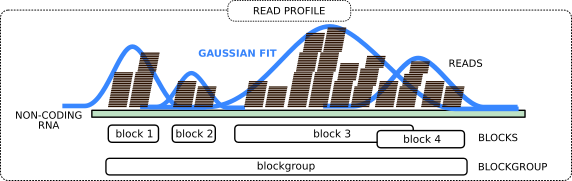

# Introduction
{:.no_toc}
Small Non-coding RNAs (ncRNAs) play a vital role in many cellular processes such as RNA splicing, translation, gene regulation. The small RNA-seq is a type of RNA-seq in which RNA fragments are size selected to capture only short RNAs. One of the most common applications of the small RNA-seq is discovering novel small ncRNAs. Mapping the small RNA-seq data reveals interesting patterns that represent the traces of the small RNA processing.

For example, consider the miRNA biogenesis. The primary miRNA transcripts are processed by Drosha-complexes and results in hairpin precursor miRNAs. Then after they transported to the cytoplasm, Dicer slices off the hairpin. One of the RNA strands bound by Argonaute proteins regulates the target mRNA while the other strand is degraded.

The following figure represents the mapped reads on the reference genome. The height of the bars represents the number of reads mapped. Reads in each bubble represent a *read profile*. In this case, they both are from miRNAs. From the small RNA-seq, we often see the two processed miRNA strands after mapping. The miRNA strand which targets the mRNA is expressed and we see more reads compared to the degraded strand. The gap between those two piles of reads represents the missing hairpin.


In this tutorial, we will learn how to use **BlockClust** to cluster similar processing patterns together.

> ### Agenda
>
> In this tutorial, we will cover:
>
> 1. TOC
> {:toc}
>
{: .agenda}

# Preprocessing of the data
We start with a BAM file as an input for this tutorial. If you want to use your own sequencing data, please clip the adapters and map to the reference genome. For this tutorial purpose, we already clipped the adapters and mapped the reads using **segemehl**.

First, we convert the BAM file into BED file. This is not a plain file conversion. Hence we cannot use any BAM to BED conversion tools. We use BlockClust tool in the pre-processing mode for this purpose. The resulting BED file contains tags (a tag is a unique read sequence in a deep-sequencing library) and their normalized expression (column 5), i.e. the ratio of the read count per tag to the number of mappings on the reference genome.
{: .hands_on}
## Get data

> ###  Hands-on: Data upload
>
> 1. Create a new history for this tutorial
> 2. Import the files from [Zenodo]() or from the shared data library
>
>    ```
>    https://zenodo.org/record/2172221/files/GSM769512.bam
>    ```
>
>    
{: .hands_on}

> ###  Questions
>
> Why is it mandatory to clip the adapters from the small RNA-seq data?
>
> > ###  Solution
> >
> > Generally, the processed RNA fragments from the small RNAs are about 18-30nt long. If the sequenced read length is longer than the fragment (which is usually the case), the sequencer reads into the 3' adapter.
> >
> {: .solution}
>
{: .question}


## Sort BAM file
> Before continue to BAM to BED conversion we need to sort the alignments in the input BAM file by their positions.
> ###  Hands-on: Sort BAM
> 1. **Samtools sort**  with the following parameters:
>    -  *"BAM File"*: `output` (Input dataset)
>
{: .hands_on}

## BAM to BED of tags
> Now it is time to do the actual conversion.
> ###  Hands-on: **BlockClust** preprocessing
> 1. **BlockClust**  with the following parameters:
>    - *"Select mode of operation"*: `Pre-processing `
>        -  *"BAM file containing alignments"*: `output1` (output of **Samtools sort** )
>
{: .hands_on}

# Grouping of the adjacent reads into read profiles

Now we group the adjacent reads into so-called blocks and blockgroups using blockbuster tool. In general, each blockgroup should represent a single ncRNA read profile.



> ###  More details about the theory
>
> The idea is to perform peak detection on the signal obtained by counting the number of reads per nucleotide. This signal, spanning adjacent loci, is then modeled with a mixture of Gaussians. An iterative greedy procedure is then used to collect reads that belong to the same block, starting from the largest Gaussian component, and removing them in successive iterations. The tool further assembles a sequence of adjacent blocks into a blockgroup if the blocks are either overlapping or are at a distance smaller than a user-defined threshold. A more detailed explanation is at http://hoffmann.bioinf.uni-leipzig.de/LIFE/blockbuster.html
>
{: .details}


## Sort the BED file of tags

In order to run the blockbuster successfully the input BED file need to be sorted by chromosome, strand, start position and then end positions.

> ###  Hands-on: Sort the BED file
>
> 1. **Sort**  with the following parameters:
>    -  *"Sort Query"*: `tags_bed` (output of **BlockClust** )
>    - In *"Column selections"*:
>        - Click on *"Insert Column selections"*:
>        - In *"1: Column selections"*:
>            - *"on column"*: `c1`
>        - Click on *"Insert Column selections"*:
>        - In *"2: Column selections"*:
>            - *"on column"*: `c6`
>        - Click on *"Insert Column selections"*:
>        - In *"3: Column selections"*:
>            - *"on column"*: `c2`
>        - Click on *"Insert Column selections"*:
>        - In *"4: Column selections"*:
>            - *"on column"*: `c3`
>    - *"Ignore case"*: `Yes`
>
{: .hands_on}

## Group reads into blocks and blockgroups using **blockbuster**

> ###  Hands-on: blockbuster
>
> 1. **blockbuster**  with the following parameters:
>    -  *"BED file containing read expressions"*: `outfile` (output of **Sort** )
>
>    ***TODO***: *Check parameter descriptions*
>
>    ***TODO***: *Consider adding a comment or tip box*
>
{: .hands_on}


# Clustering with **BlockClust**
Here we use **BlockClust** in clustering mode. All you need here is the output of the **blockbuster**.

Apart from clustering, **BlockClust** has built-in class specific discriminative models for C/D box snoRNA, H/ACA box snoRNA, miRNA, rRNA, snRNA, tRNA and Y_RNA. So it can also be used to predict if a read profile might belong to one of the known ncRNA class.
> ###  Hands-on: clustering
>
> 1. **BlockClust**  with the following parameters:
>    - *"Select mode of operation"*: `Clustering and classification`
>        -  *"Input blockgroups file"*: `output` (output of **blockbuster** )
>        - *"Would you like to perform classification?"*: `Yes`
>        - *"Mode of classification"*: `Model based`
>
{: .hands_on}

The `BlockClust: BED of predicted clusters` file is the result of Markov cluster algorithm. Each entry in this file represents a blockgroup. The 4th column contains is in the form of *annotation:blockgroup_id:cluster_id*. The *cluster_id* represents which cluster the blockgroup belongs to.

The `BlockClust: Model based predictions BED` file is the result of classification. Each entry in this file represents a blockgroup. The 4th column contains the annotation of the ncRNA which it overlaps. For the blockgroups which are not overlapped with any known ncRNAs, there is a prefix 'predicted_' is added indicating that it is predicted by the **BlockClust** classification models.

Next, we will visualize the read profiles (from the BAM file) and the predictions (BED from **BlockClust**) together.

> ###  Hands-on: visualization
>
> 1. Install [IGV](https://software.broadinstitute.org/software/igv/download) (if not already installed)
> 2. Start IGV locally
> 3. Expand the  `GSM769512.bam` file
> 4. Click on the `local` in `display with IGV` to load the reads into the IGV browser
> 5. Expand the  `BlockClust: Model based predictions BED` file
> 6. Click on the `local` in `display with IGV` to load the reads into the IGV browser
> 7. Go to the location chr4:90653059-90653141.
>
> ###  Questions
>
> 1. Do you see any already annotated transcript in that location?
> 2. What does the read profile resemble?
> 3. What did **BlockClust** predict?
>
> > ###  Solution
> >
> > 1. There is no annotated gene from RefSeq annotation on the same strand.
> > 2. It resembles the miRNA profiles mentioned in the introduction section. One of the read piles looks like mature miRNA and the other like miRNA*.
> > 3. Predicted as a miRNA.
> >
> {: .solution}

{: .question}

>    > ###  Comments
>    >
>    > In order for this step to work, you will need to have either IGV or [Java web start](https://www.java.com/en/download/faq/java_webstart.xml)
>    > installed on your machine. However, the questions in this section can also be answered by inspecting the IGV screenshots below.
>    >
>    > Check the [IGV documentation](https://software.broadinstitute.org/software/igv/AlignmentData) for more information.
>    >
>    {: .comment}
>
{: .hands_on}


# Conclusion
{:.no_toc}

In this tutorial, we learned how to use **BlockClust** to cluster real small RNA sequencing read profiles based on their similarity. We also learned that the **BlockClust** can also be used to classify the read profiles based on pre-built classification models.
