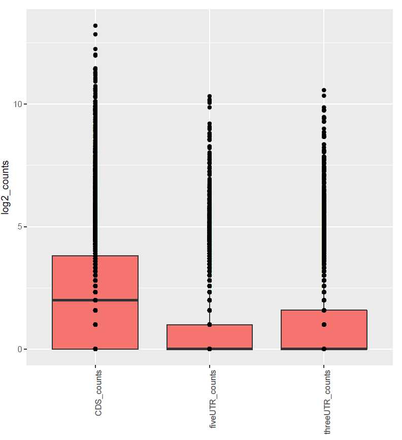
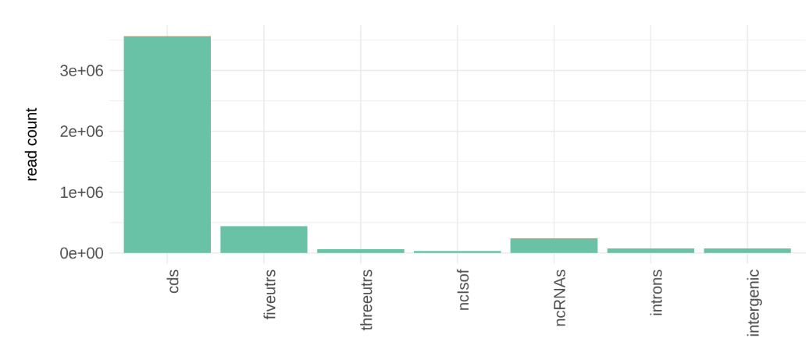

---

layout: tutorial_hands_on

title: Counting Ribo-Seq reads in different genomic regions
zenodo_link: 'https://figshare.com/s/87af4db040ed19be62aa'
questions:
- How is the distribution of reads on the different genomic features?
- What is the mainly genomic region these reads distributed, and why?
objectives:
- Learn the reason caused to this distribution characteristics
- Learn the method to measure read counts on genomic regions
time_estimation: '1h'
key_points:
- We could know more details about gene regulation at the translational level through investigating the distribution of reads on the genomic features.
contributors:
- ldyang14
- IceApink

---


# Introduction
{:.no_toc}

<!-- This is a comment. -->

Distinct from RNA-seq data, reads from Ribo-Seq data usually located in the translated genomic regions. However, reads resided in the UTR or intronic regions are also worthy of attention due to their underlying regulatory functions. Supposing that there is a gene we interested in, we wonder to know whether expression of 5'UTR makes an effect on it, thus we first need to observe the distribution of reads on that gene. For example, it is likely that the expression of 5'UTR on the gene displayed in the figure below inhibited the expression of CDS. However, this phenomenon is not observed within the RNA-seq data. Hence, the distribution of reads on the genomic features provides new insight into the regulatory mechanism of gene expression.


")

> ### Agenda
>
> In this tutorial, we will cover:
>
> 1. TOC
> {:toc}
>
{: .agenda}


# Import data

> ###  Hands-on: Data upload
>
> 1. Create a new history for this tutorial
> 2. Import the files from [Zenodo]() or from the shared data library
>
>    ```
>    https://ndownloader.figshare.com/files/20031152?private_link=87af4db040ed19be62aa
>    ```
>    
>    
>    
> 3. Rename the datasets
> 4. Check that the datatype
>
>    
{: .hands_on}

# Count reads on genomic features with RiboProfiling

> ###  Hands-on: Count reads on genomic features with RiboProfiling
>
> 1. **RiboProfiling**  with the following parameters:
> - *"BAM File to analysis"*:  `RPF_KO_1.sorted.q20.bam`
>    - *"Select genome"*: `hg19`
{: .hands_on}

A lot of results were produced by `RiboProfiling`, but we only focused on the result of read counts on different genomic regions. As shown below, most of reads distributed on the CDS as we expected.




## Using Ribo-seqC

***TODO*** We can also get this result using `Ribo-seqC` as described in the [Quality of Ribo-Seq data](). This results is displayed below. 



# Conclusion

{:.no_toc}

It is helpful to us for understanding the regulatory of gene expression through investigating the reads on the different genomic features. In the past, we can not explore the heterogeneity of gene expression on different gene features limited by technology, but now ribosome profiling offers an opportunity for us to discover and explore the heterogeneous expression of genes. Hence, we could reveal more details of gene expression and understand molecular mechanisms more deeply.

