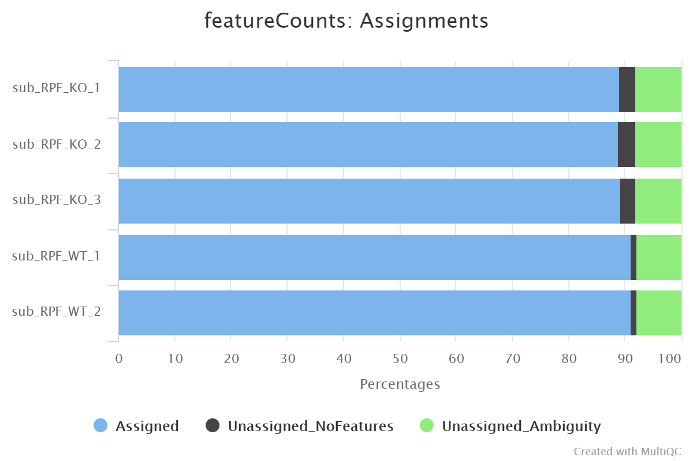
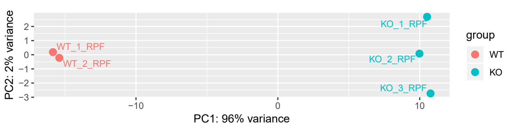

# Introduction
{:.no_toc}

<!-- This is a comment. -->

After mapping was completed, we would obtain detailedly mapped results, which usually is SAM or BAM format.  Spontaneously, we would wonder the expression of interested genes to compare, explore, and analyze differences for a customized experiment condition. Hence, how should we carry out this process? Firstly, we should extract information of read counts from BAM/SAM file using tools like `featureCounts`. Is that it? Of course not. Since library depth and gene lengths are different in each sample, we need to normalize read counts mapped on each gene for comparisons between them (an example is shown below). It is important to execute this step because we would analyze accurately only after that read counts were normalized exactly.


> ### Agenda
>
> In this tutorial, we will cover:
>
> 1. TOC
> {:toc}
>
{: .agenda}

# Import data

> ###  Hands-on: Data upload
>
> 1. Create a new history for this tutorial
> 2. Import the files from [Figshare]() or from the shared data library
>
>    ```
>    KO_1_RPF	KO_1	KO	https://ndownloader.figshare.com/files/20088581?private_link=a210c49b717479c834d7
KO_2_RPF	KO_2	KO	https://ndownloader.figshare.com/files/20088584?private_link=a210c49b717479c834d7
KO_3_RPF	KO_3	KO	https://ndownloader.figshare.com/files/20088587?private_link=a210c49b717479c834d7
WT_1_RPF	WT_1	WT	https://ndownloader.figshare.com/files/20088590?private_link=a210c49b717479c834d7
WT_2_RPF	WT_2	WT	https://ndownloader.figshare.com/files/20088593?private_link=a210c49b717479c834d7
>    ```
>
>    
>    
>
> 3. Rename the datasets
> 4. Check the datatype of upload files if are bam, if not, then modify the datatype to bam
>
>    
{: .hands_on}

# Get read counts with **featureCounts**

Firstly, we need to calculate read counts for each gene according to the bam file, thus lay the foundation for the subsequent differential expression analysis. Here we selected [featureCounts](http://bioinf.wehi.edu.au/featureCounts/), which is an ultrafast and accurate tool for calculating read counts.

> ###  Hands-on: Get read counts with **featureCounts**
>
> 1. **featureCounts**  with the following parameters:
> -  *"Alignment file"*: `KO_1_RPF`, `KO_2_RPF`, `KO_3_RPF`, `WT_1_RPF`, `WT_2_RPF`
>    - *"Gene annotation file"*: `in your history`
>      -  *"Gene annotation file"*: `hg38.gencode.v32.gtf` 
> 2. **MultiQC**  with the following parameters:
>    - In *"Results"*:
>      -  *"Which tool was used generate logs?"*: `featureCounts`
>        -  *"Output of FeatureCounts"*: `KO_1_RPF`, `KO_2_RPF`, `KO_3_RPF`, `WT_1_RPF`, `WT_2_RPF`
> 
{: .hands_on}

The results generated by the featureCounts record the aligned and unaligned number of reads for each sample. Hence, we can browse the general statistical information of the read alignment utilizing MultiQC.




# Normalization with **DESeq2**

Secondly, we need to normalized read counts to compare gene expression between different groups.

> ###  Hands-on: Task description
>
> 1. **DESeq2**  with the following parameters:
>    - *" how"*: `Select datasets per level`
>        - In *"Factor"*:
>            -  *"Insert Factor"*
>                - *"Specify a factor name, e.g. effects_drug_x or cancer_markers"*: `Treatment`
>                - In *"Factor level"*:
>                    -  *"Insert Factor level"*
>                        - *"Specify a factor level, typical values could be 'tumor', 'normal', 'treated' or 'control'"*: `WT`
>                        -  *"Counts file(s)"*: `WT_1_RPF`, `WT_2_RPF`
>                    -  *"Insert Factor level"*
>                        - *"Specify a factor level, typical values could be 'tumor', 'normal', 'treated' or 'control'"*: `KO`
>                        -  *"Counts file(s)"*: `KO_1_RPF`, `KO_2_RPF`, `KO_3_RPF`
>    - *"Choice of Input data"*: `Count data (e.g. from HTSeq-count, featureCounts or StringTie)`
>    - *"Output normalized counts table"*: `Yes`
>    - *"Output rLog normalized table"*: `Yes`
> 
{: .hands_on}

Four files will be generated, their are 3 tabular-format files about normalized gene expression and 1 file plotted the quality of samples.




> ###  Questions
>
> 1. How is the quality of RPF samples?
>
> > ###  Solution
> >
> > 1. It seems pretty good because WT (wildtype) groups and KO (knockout) groups are clearly separated.
> >
> {: .solution}
>
{: .question}

# Conclusion

{:.no_toc}

Results from mapping contain particular information about the distribution of reads on the genome. However, the statistical or visual information needs to be extracted and processed further from the mapping results, thus helping us to understand the variation of gene expression. One can understand roughly these steps by means of this tutorial to analyze differential gene expression, then to predict genes correlated with conditions or to determine the function of interested genes.
