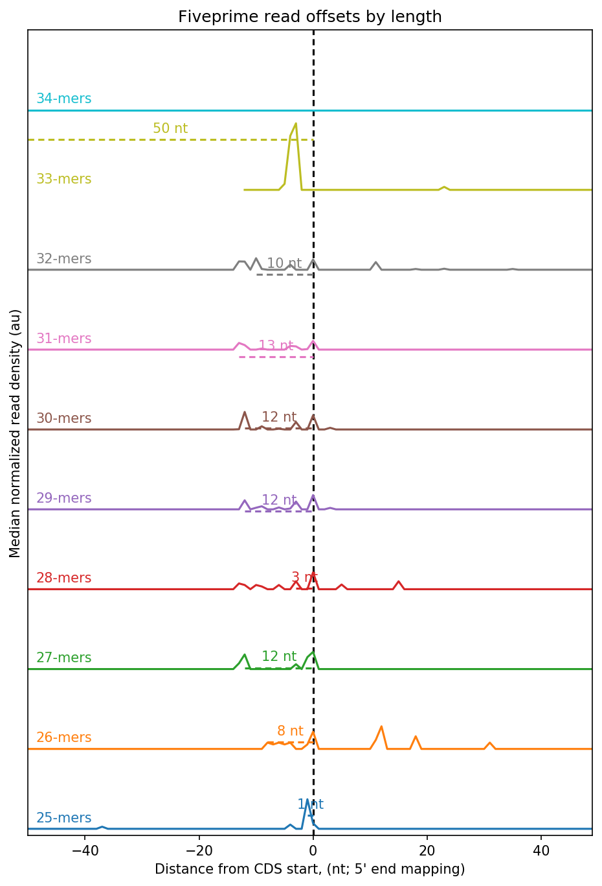

# Introduction
{:.no_toc}

<!-- This is a comment. -->

The step length is 3 nucleotides when ribosome sliding on the RNA. Therefore, there is an obvious triplet nucleotide periodicity for those data from Ribo-Seq. We can not only infer the quality of Ribo-Seq data but also determine the actively opening reading frames in the resolution of a single nucleotide. Furthermore, we could explain molecular mechanisms more precisely through the accurate location of actively translated regions.

However, it leads to that a difficult problem was born in the analysis process for Ribo-Seq data. Because there is an offset distance between 5'-end of ribosome-protected fragments and translating P-site. Nevertheless, we should calculate this offset precisely to deduce the really activated translated regions.

The reason why offset was produced is shown below. The first nucleotide of reads protected by ribosomes represents the margin by digesting of RNase. However, the real position for starting translating to a peptide is 16th nucleotide as shown in the figure below, which just represents the first nucleotide, not second or third, in the A-site. Thus we called that is in the frame, if 16th nucleotide of other reads of length 28nt is not located in the first position of A-site, we called that is not in the frame. Generally, most of reads are in the frame. Therefore, we should calculate and correct the offset of P/A-site prior to infer ORFs.

 ")

Therefore, lots of bioinformatics tools have been emerging to solve this problem. For example, the function `psite` in the [plastid](https://plastid.readthedocs.io/en/latest/index.html).

> ### Agenda
>
> In this tutorial, we will cover:
>
> 1. TOC
> {:toc}
>
{: .agenda}

# Import data

> ###  Hands-on: Data upload
>
> 1. Create a new history for this tutorial
> 2. Import the files from [Zenodo]() or from the shared data library
>
>    ```
>    https://ndownloader.figshare.com/files/20030753?private_link=f07309bbb797f15c8bd7
>    https://ndownloader.figshare.com/files/20030519?private_link=f07309bbb797f15c8bd7
>    ```
>    
>    
>
> 3. Rename the datasets
> 4. Check that the datatype
>
>    
{: .hands_on}


## Step 1: Performing metagene analyses

> ###  Hands-on: metagene analyses
>
> 1. **Performing metagene analyses**  with the following parameters:
>
>    -  *"annotation file"*: `gencode.v32.annotation.gtf`
>    -  *"Landmark around which to build metagene profile"*: `cds_start`
>   -  *"Nucleotides to include upstream of landmark"*: `50`
>    -  *"Nucleotides to include downstream of landmark"*: `50`
>    - ***TODO***  *"alignment mapping functions"*: `Map read alignment to 5' position`
>   -  *"alignment file in bam format"*: `sub_RPF_KO_1.sorted.q20.bam`
{: .hands_on}

> ###  Details
>
> Through this step we can obtain the roi file required in the next step. More details is on the [cookbook of plastid](https://plastid.readthedocs.io/en/latest/examples/metagene.html).
{: .details}

## Step 2: Determine P-site offsets for ribosome profiling data

> ###  Hands-on: determine the offsets
>
> 1. **Determine P-site offsets for ribosome profiling data**  with the following parameters:
>
>    -  *"roi file generated by Step 1"*: `rois.txt on data 2 and data 1` (output of **Step 1: Performing metagene analyses** )
>    -  *"alignment bam file"*: `sub_RPF_KO_1.sorted.q20.bam` (Input dataset)
>    - *"min length"*: `25`
>    - *"max length"*: `34`
{: .hands_on}

> ###  Details
>
> More details is on the [cookbook of plastid](https://plastid.readthedocs.io/en/latest/examples/p_site.html).
{: .details}

We could get two outputs from psite, one of which graphically shows the distinct offset coupled with read length, and another is a table-separate format file that contains two columns,  one for read length and the other for the corresponding offset. This file could be used as input or a parameter to the subsequent analysis.



# Conclusion

{:.no_toc}

The P-site offset is the distance from the 5’ end of the read to the ribosomal P-site, in some methods, it can also be A-site. However, no matter what methods we used, the primary purpose is to detect and correct the offset for the prediction of ORFs accurately.