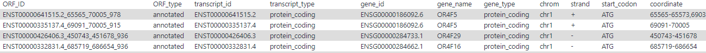

# Introduction
{:.no_toc}

<!-- This is a comment. -->

Predicting ORFs activated translation accurately is the foundation for us to explore and understand the physiological process deeply. Fortunately, ribosome profiling provides us a convenient and reliable tool to study gene information at the translational level.

Currently, annotations of the coding sequence (CDS) is conservative, because the annotation is usually inferred from homologous sequences of protein databases and EST databases. However, translation, the most critical step in the delivery of gene information, is neglected by the conventional annotation of the CDS. The translation is the direct participant for decoding information in the gene sequences, thus leading to them become the proteins with a specific function. Moreover, conventional annotation of the CDS does not indicate optional coding regions like upstream ORFs (uORF), which were proved to have regulated the expression of downstream CDS in the previous study. Hence, substantial genome information is waiting for us to discover.

As we all know, ribosomes are an important spot to execute the process of the translation and reads from ribosome profiling are RNA fragments enclosed by ribosomes. Therefore, ribosome profiling provides us insight into detailed and complicated information delivered by the translation. We can predict ORFs through mapping reads against the genome or transcriptome. These ORFs not only come from annotated CDSs, but also isoforms of CDS, novel, and so on. Previous studies have shown that some sequences only activate translation but not produce peptides to play regulatory functions. Therefore, it is meaningful for us to predict these ORFs to understand the physiological process. For example, some ORFs will translate cancer-specific antigen, thus we can predict these ORFs to design drugs specifically targeted cancer cells. 


")


> ### Agenda
>
> In this tutorial, we will cover:
>
> 1. TOC
> {:toc}
>
{: .agenda}


| tools      | input                                          | elapsed time | star  | output                     |
| ---------- | ---------------------------------------------- | ------------ | ----- | -------------------------- |
| RiboCode   | `fasta` `gtf` `BAM (transcriptome cordinates)` | 🚀 fast       | ⭐⭐⭐⭐⭐ | `3-nt` `P-site` `ORFs`     |
| ribotricer | `fasta` `gtf` `BAM`                            | 🚄 fast       | ⭐⭐⭐⭐  | `3-nt` `read length` `ORF` |
| RiboORF    | `SAM` `gtf`                                    | 🚗 slow       | ⭐⭐⭐   | `ORFs`                     |


# Import data

> ###  Hands-on: Data upload
>
> 1. Create a new history for this tutorial
>
>    
>
> 2. Import the files from [Figshare](https://figshare.com/s/651afb45fbb5fc9d7010) 
>
>    ```
>    # Ribotricer
>    https://ndownloader.figshare.com/files/20031152?private_link=87af4db040ed19be62aa
>    # RiboCode
>    https://ndownloader.figshare.com/files/20078453?private_link=162bb533415734642aef
>    ```
>    
>    
>    
> 3. Check that the datatype of fasta file is `fasta` and the gtf file is `gtf`. If not, you should change the datatype according to steps below.
>
>   
{: .hands_on}

# Detect translating ORFs with ribotricer

## step 1: Preparing candidate ORFs

> ###  Hands-on:Preparing candidate ORFs
>
> 1. **ribotricer step 1: Detecting translating ORFs**  with the following parameters:
>    
>    -  *"genome annotation file in GTF format"*: `gencode.v32.annotation.gtf` 
>    -  *"reference genome file in FASTA format"*: `hg38_ucsc.fasta` 
>    -  *"min orf length"*: `60`
>    -  *"start codon"*: `ATG`
>    -  *"stop codon"*: `TAG,TAA,TGA`
>
{: .hands_on}

> ###  Comment
>
> In this step, a tab-separated values (tsv) file will be generated, which contains the information of all candidate ORFs that may be translated (some parts of it displayed as below). 
>
> 
>
{: .comment}

## step 2: Detecting translating ORFs

> ###  Hands-on: Detecting translating ORFs
>
> 1. **ribotricer step 2: Detecting translating ORFs**  with the following parameters:
>    
>    -  *"input bam file"*: `RPF_KO_1.sorted.q20.bam` 
>    -  *"ribotricer index produced by step 1"*: `candidate_orfs.tsv` 
>    -  *"whether the data is from a strand-specific assay"*: `no`
>    -  *"set option: --read_lengths?"*: `no`
> 
{: .hands_on}

> ###  Comment
>
> A tab-separated values (tsv) file contained information of translating ORFs will be generated (some parts of it displayed as below). 
>
> 
>
{: .comment}

# Detect translating ORFs with RiboCode

> ###  Hands-on: Detect translating ORFs with RiboCode
>
> 1. **RiboCode to identify translated ORFs**  with the following parameters:
>    
>    -  *"GTF file"*: `gencode.v32.annotation.gtf` 
>    -  *"The genome sequences file in fasta format"*: `hg38_ucsc.fasta` 
>    -  *"RPF mapping file"*: `RPF_WT_2.Aligned.toTranscriptome.out.bam` 
>    -  *"whether the data is strand-specific, reverse means reversed strand interpretation.(default: yes)"*: `no`
> 
{: .hands_on}

A detialed set of results will be generated, for example, a txt file contained detected ORFs, a pdf described the proportion of different categories of ORFs (as shown below). 


# Conclusion

{:.no_toc}

Diversity ORFs lead to more complex and diverse biological functions and processes, hence, we can understand the mechanisms of gene regulation more deeply throgh predicting and decucing the expression of ORFs in a gene.