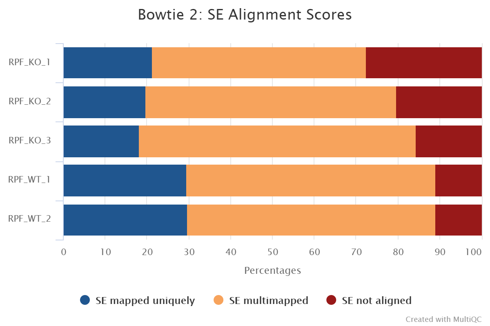
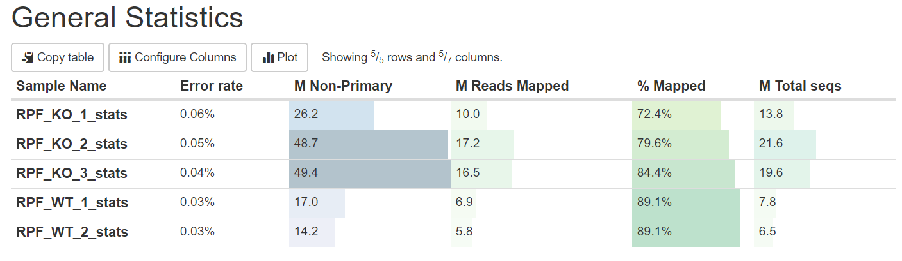
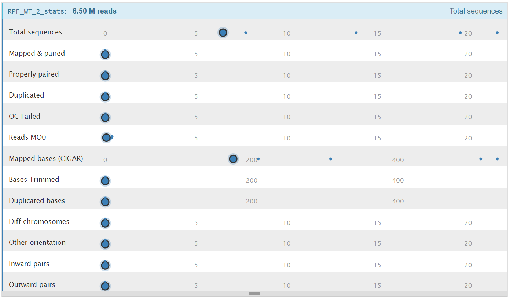
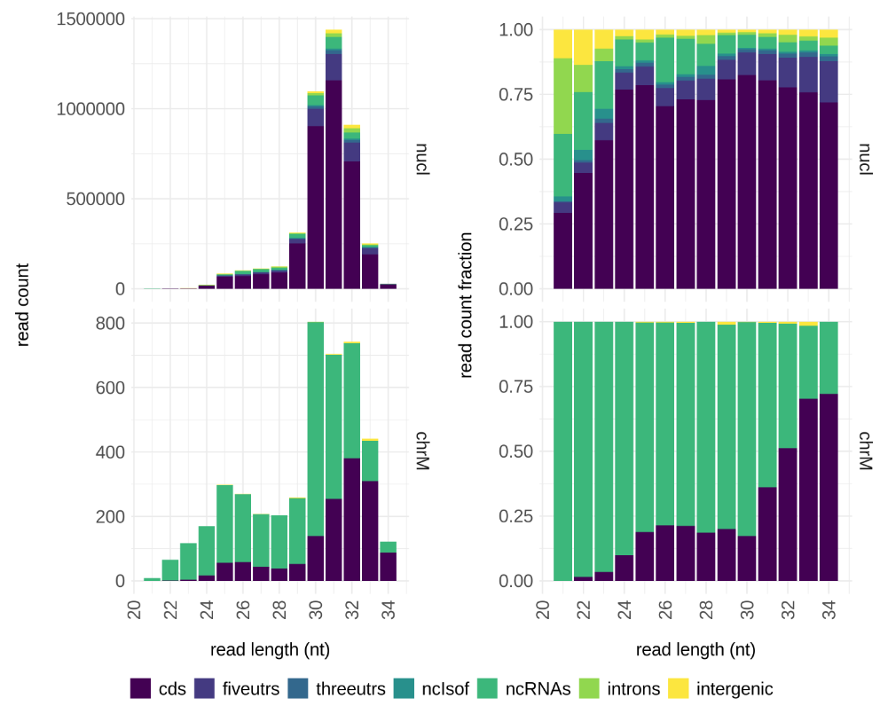
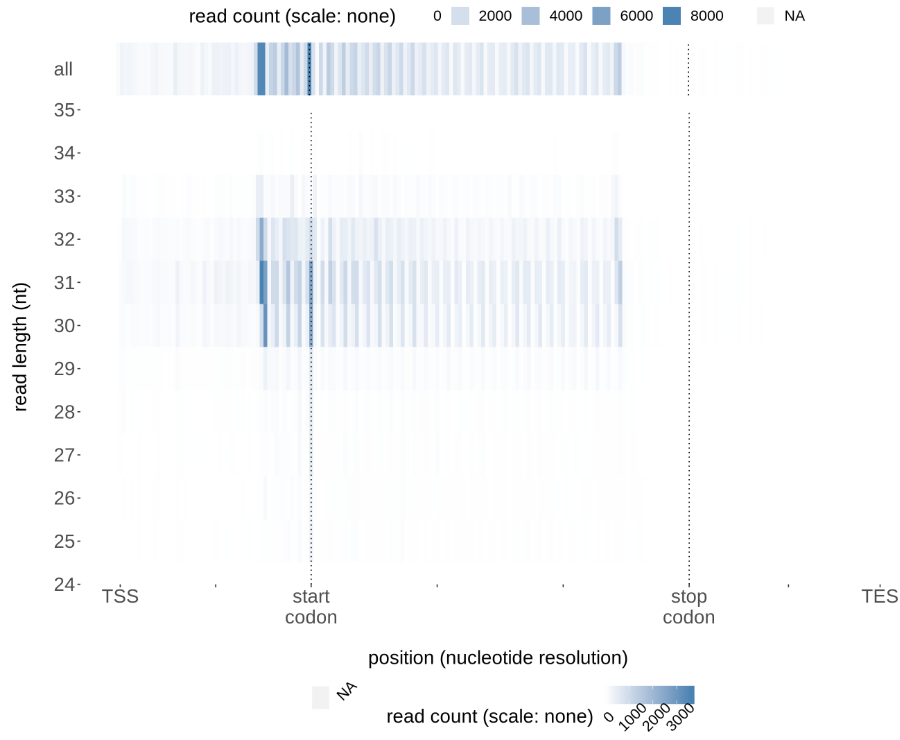

# Introduction
{:.no_toc}

<!-- This is a comment. -->

Although we got the corresponding file, the BAM format file, from the mapping results, we have no way of knowing specifics of mapping results, for example, the proportion of mapped reads, read distribution, etc. Not only can we learn the quality of mapping, but also we can make a reasonable explanation based on it for the subsequent abnormal analysis results. Therefore, we should check the quality of mapping results firstly to lay the foundation for the downstream analysis.

There are lots of tools that can be used to check the quality of mapping results, such as Samtools, [FastQC](https://www.bioinformatics.babraham.ac.uk/projects/fastqc/), [RSeQC](http://rseqc.sourceforge.net/), [Ribo-seQC](https://github.com/ohlerlab/RiboseQC). You will learn about comprehensive information of your mapping results with the help of these tools. Below, we are going to introduce how to check the quality of mapping results through these tools in the Galaxy.

Here, we use results produced by full data of samples to show information more visually.

> ### Agenda
>
> In this tutorial, we will cover:
>
> 1. TOC
> {:toc}
>
{: .agenda}

# General statistics of alignment

## Mapping ratio

How many reads were mapped to the genome successfully? If there is a very low mapping ratio in one or more samples, we should think about the reason leading to this. Of course the following analysis should be suspended until the reason for the abnormal mapping result was found and solved.

> ###  Hands-on: Aggregate the HISAT2 summary files with **MultiQC**
>
> 1. **MultiQC**  with the following parameters:
>    - In *"Results"*
>      -  *"Which tool was used generate logs?"*: `HISAT2`
>      -  *"Output of HISAT2"*: `Mapping summary` (output of **HISAT2** )
> 2. Inspect the `Webpage` output from MultiQC
	{: .hands_on}

We can see that the number of successfully mapped reads is relatively high from the above figure. However, the percentage of multiple mapped reads is very high, and some even exceed 60%. Usually, such a strange proportion is quite abnormal, but this phenomenon is common in the Ribo-Seq data. Because reads from Ribo-Seq easily mapped to repeat regions on the genome due to the relatively short length. Besides, reads may contain the contaminant from the rRNA, elevating the ratio of unaligned.

## Other statistics of alignment

We can acquire more detailed information besides mapping ratio from the alignment through `samtools stats`. Then, we aggregate all results into one sheet using MultiQC.

> ###  Hands-on: Calculate QC metric using samtools stats
>
> - **Samtools stats**  with following parameters:
>   -  *"BAM File"*: `aligned reads (BAM)`
>   -  *"Output"*: `One single summary file`
> - **MultiQC**  with following parameters:
>   - In *"Results"*:
>     -  *"Which tool was used generate logs?"*: `Samtools`
>       - In *"Samtools output"*:
>         -  *"Type of Samtools output?"*: `stat`
>           -  *"Samtools flagstat output"*: `Samtools stats on collection xxx`
>
{: .hands_on}

The picture below indicates a part of aggregated statistical information about `samtools stats`. Each blue point represents a sample, when the mouse arrow stay on it, the sample name and the number of corresponding mapped reads will be displayed in the top-left corner.

# Quality control using Ribo-seQC

The above is generally inspect items for quality control. However, due to the characteristic of ribosomes slide on the mRNA as 3nt in each step, certain quality control metrics other than above are also able to as the evaluation items for quality control of Ribo-Seq data.

> ###  Hands-on: Check triplet nucleotide periodicity using Ribo-seqC
>
> - Because Ribo-SeqC needs twobit format of fasta, we should transfer fasta file to twobit file with faToTwoBit.
>
> > ###  Hands-on: Transfer .fasta to .2bit
> >
> > - **faToTwoBit**  with following parameters:
> >   -  *"fasta"*: `hg38_ucsc.fasta`
> >
> > > ###  Comment
> > >
> > > If you want to know more about twobit file, you can read [twoBit](https://genome.ucsc.edu/goldenpath/help/twoBit.html).
> > >
> > {: .comment}
> >
> {: .hands_on}
>
> - **Ribo-seQC**  with following parameters:
>   - In *"Prepare annotation files"*:
>     - In *"Inputs"*:
>       -  *"gtf"*: `gencode.v32.annotation.gtf`
>       -  *"fa in twobit format"*: `hg38_ucsc.2bit`
>       -  *"BSgenome"*: `Hsapiens.UCSC.hg38`
>   - In *"Main analysis"*:
>     - ~~***TODO***  *"annotation"*: `build-in`~~
>     -  *"BAM"*: `aligned reads (BAM)`
>
{: .hands_on}

You will obtain plenty of information about mapped results when the process above was completed. Hence, we introduce some parts of the results to display and check the mapped quality.

## Distribution of read lengths

Sequencing reads of Ribo-Seq data are from fragments of ribosome-enclosed, so the distribution of read lengths will mainly concentrate on a specific length.

> ###  Questions
>
> Do you think the quality of read length distribution is good or bad?
>
> > ###  Solution
> >
> > The quality of read length distribution is good. Because there is a significant peak at 32 nt and the distribution is ridge type.
> >
> {: .solution}
>
{: .question}

## Triplet nucleotide periodicity

As mentioned in the [Introduction to translatomics](), the most significant feature of Ribo-Seq data is triplet nucleotide periodicity, in addition, this feature is also the criterion to judge the quality of Ribo-Seq data. If we can't observe this feature, we should reflect on reasons leading to these results. For example, whether there is an error during the library preparation. If the triplet nucleotide periodicity can not be observed after we rule out all of the points that we may make an error, we should consider to drop out this data.

We can observe triplet nucleotide periodicity from the figure above, so the quality of the sample data is not bad. Therefore, we can execute the subsequent analysis.

# Conclusion

{:.no_toc}

You will have a more comprehensive understanding of your data through this tutorial, and you will know how to check the quality of mapped results to find out the reason leading to abnormal indicators.
