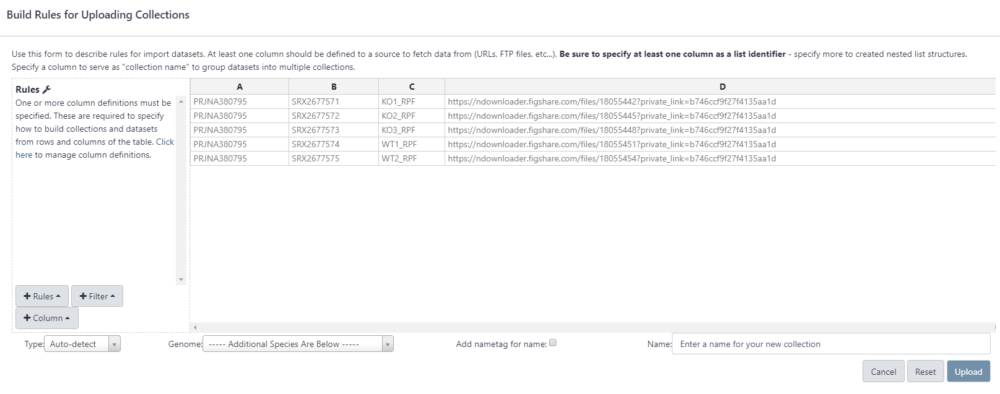
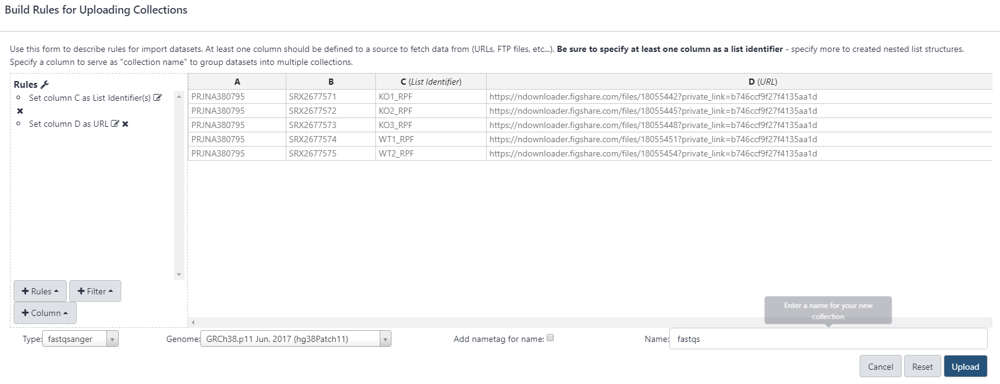

# Introduction
{:.no_toc}

<!-- This is a comment. -->

Ribosome profiling (Ribo-Seq) is a high throughput sequencing technology to detect the gene expression through sequencing ribosome-protected fragments. Although we discovered a large amount of gene expression and regulation through RNA-seq, there are still numerous aspects about gene regulation that could not be explained by RNA-seq, such as regulatory mechanism of translation. Then, the emergency of a new technology called Ribo-Seq fills the technology gap for the gene translational researches. More and more studies proved the importance and accuracy about Ribo-Seq, which greatly facilitated the development about related tools for analyzing Ribo-Seq data. Therefore, it is badly needed that integrating those tools into one system to simplify the analysis process about Ribo-Seq data for researchers who do not have a computer background.

The step to analyse Ribo-Seq data is similar with analyzing RNA-seq data, but some steps are different and need to be noted, such as removing contaminative reads from rRNA and tRNA. Therefore, we use a dataset to demonstrate how to analyse Ribo-Seq data and what parts need to be noticed.

## The dataset

The sample dataset in this tutorial comes from the paper of *Methylation of human eukaryotic elongation factor alpha (eEF1A) by a member of a novel protein lysine methyltransferase family modulates mRNA translation*  (  )，which is publicated on the Nucleic Acids Research. The detail information of data could be obtained from Gene Expression Omnibus database (GEO) through accessing number of **GSE97140**, and raw data could also be downloaded from there.

The dataset used as a sample consists of two groups, one group knockout  the gene *EEF1AKMT4,* which is a lysine (K) specific methyltransferase that efficiently methylates K36 in eukaryotic tranlation elongation factor 1 alpha (eEF1A), and the other is control group as WT.


> ### Agenda
>
> In this tutorial, we will cover:
>
> 1. TOC
> {:toc}
>
{: .agenda}

# Preprocess

First of all, you should create a history when you begin to analyze data with Galaxy.

> 
> 

Before importing the data into the Galaxy, you had better to learn some rules and methods about how to import the data, see the [Getting data into Galaxy tutorial](https://training.galaxyproject.org/training-material/topics/galaxy-data-manipulation/tutorials/get-data/slides.html#1).

## Which data should we upload?

### FastQ file

FastQ files, produced by the sequencing, contain sequences and quality information of reads. It is the basic for setting about Ribo-Seq data analysis. The data is usually suffixed with '.fastq' or '.fq', if it is compression format, it will be attached ".gz" to the suffix. 

> ###  What is the FastQ file?
>
> If you want to know more information about FASTQ, see the [Quality Control tutorial]({{ site.baseurl }})
{: .details}

2. Import Ribo-Seq raw data via links



Here, we only select 10000 reads randomly for each sample to save time of analysis. When you want to mining information to explore significance from your own data or public data, full data should be uploaded. The small dataset used in this tutorial can be downloaded from the [Figshare](https://figshare.com/account/articles/10011419). You can also copy information in the gray box below to import this data through [Galaxy Rule-based Uploader](https://galaxyproject.github.io/training-material/topics/galaxy-data-manipulation/tutorials/upload-rules/tutorial.html).

```bash
PRJNA380795	SRX2677571	KO1_RPF	https://ndownloader.figshare.com/files/18055442?private_link=b746ccf9f27f4135aa1d
PRJNA380795	SRX2677572	KO2_RPF	https://ndownloader.figshare.com/files/18055445?private_link=b746ccf9f27f4135aa1d
PRJNA380795	SRX2677573	KO3_RPF	https://ndownloader.figshare.com/files/18055448?private_link=b746ccf9f27f4135aa1d
PRJNA380795	SRX2677574	WT1_RPF	https://ndownloader.figshare.com/files/18055451?private_link=b746ccf9f27f4135aa1d
PRJNA380795	SRX2677575	WT2_RPF	https://ndownloader.figshare.com/files/18055454?private_link=b746ccf9f27f4135aa1d
```
> ###  Hands-on: Data upload by Rule-based Uploader
>
> - Click the upload icon (  on the top right corner in the left panel )
> - Click the tab **Rule-based**
>   - *“Upload data as”*: `Collection(s)`
>   - *“Load tabular data from”*: `Pasted Table`
> - Paste the table from the gray box above
> - Click **Build**, then a new window as below will pops up 
>  - 
> - Click **Rules** button on the bottom left corner and select `Add / Modify Column Definitions`
>   - Click **Add Definition** button and select `List Identifier(s)`
>     - *“List Identifier(s)”*: `C`
>   - Click **Add Definition** button again and select `URL` instead
>     - *“URL”*: `D`
>  - Click **Apply**
> - Select *"type"*: `fastqsanger`
> - Select *"Genome"*: `hg38`. 
> - Type *“name”*：`fastqs`. Finally, you will see the window below.
> - 
> - Click **Upload** in the bottom right corner
{: .hands_on}

If your data is on your local disk, you can upload them through steps below.

> 

### Reference sequence

The reference sequence such as genome or transcriptome is a file that contains information about the nucleotide sequence. Genomes of common species have been built-in the Galaxy, so we don’t need to upload the reference genome unless we only need to parts of the genome or a specific reference sequence from ourselves.

### Annotation file of the reference sequence

The genome or transcriptome only provides the information of nucleotide sequence. However, information of gene's length or position is not contained in it. Therefore, we also need to provide annotaion file of reference sequence to acquire the detail information of mapped reads. The format of this file usually is GTF, GFF, and BED.

> ###  Hands-on: Upload annotation file from local disk
>
> - Click **Get Data** in the left panel 
>   - Click **Upload File from you computer**
>     - Click the tab **Regular**
>     - Click **Choose local file**, then select files you want to upload
>     - Select *"type"*: `gtf`
>     - Select *"Genome"*: `hg38`
>     - Click **Start** 
>
{: .hands_on}

You can also get the annotaion file from [UCSC Table Browser](https://genome.ucsc.edu/cgi-bin/hgTables) with reference to [Peaks to Genes tutorial](https://galaxyproject.github.io/training-material/topics/introduction/tutorials/galaxy-intro-peaks2genes/tutorial.html).


# Quality control for raw reads

What is the quality of our data prepared to analyze? It is an important question to us because a good quality of Ribo-Seq data  establishes the foundation to analyze accurately for the following steps. Not only that, results from quality control could also help us to understand the characteristics of our data more comprehensively. 

> ###  Hands-on: Check raw reads with **FastQC**
>
> 1. Run **FastQC**  with the following parameters:
>    -  *"Short read data from your current history"*: `fastqs` (Input dataset collection)
> 2. Inspect the `Webpage` output of **FastQC**  for the `KO1_RPF` sample by clicking on the  (eye) icon
{: .hands_on}


## Integrating results of FastQC into one 

Results from FastQC could tell us the information of each FASTQ file. However, we want to check the result on the whole for some reasons. For example, when there are lots of FASTQ files in one study, it is inconvenient and energy-consuming to check results of FastQC reports one by one. Therefore, we integrate FastQC reports into one using tools named "MultiQC" to check quality of our data conveniently.

> ###  Hands-on: Integrate FastQC reports into one using **MultiQC**
>
> 1. Run **MultiQC**  with the following parameters to integrate the FastQC reports
>      - In *"Results"*
>        - *"Which tool was used generate logs?"*: `FastQC`
>        - In *"FastQC output"*
>           -  *"Type of FastQC output?"*: `Raw data`
>           -  *"FastQC output"*: Click `RawData` files (output of **FastQC**  on trimmed reads), then it will be highlighted
> 2. Inspect the `Webpage` output from MultiQC
{: .hands_on}

## Trim adapters and remove low quality reads

The adapter is the sequence ligated to the end of the read during library preparation. If the read of sequencing machine is greater than insert fragments of DNA, the adapter on the 3'-end will be sequenced and it will be appeared in the fastq file. Because sequences of adapters does not belong to the genome, the mapping ratio will be affected if you don't trimming adapters. Therefore, we should trim them using related tools such as cutadapt before mapping reads to the reference sequence.

As mentioned above, the length of ribosome-protected fragments usually is about 30 nt. However, the sequencing read length is usually longer than it. Therefore, the library layout of Ribo-Seq is commonly single-end and it's necessary to trim the adapter to lay the foundation for the next steps.

Generally, if the data is your own, you can get the accurate adapters from the sequencing company's report. Another case is that the data from the public database such as [SRA](https://www.ncbi.nlm.nih.gov/sra), you may acquire adapters from the corresponding article or infer from the QC report. Here, the adapter in this sample is `CTGTAGGCACCATCAAT`.

For some reasons like sequencing error, not all reads have a good quality score. Therefore, we need to trimming the low quality part in reads, such as trimming first six bases on the read. Because first six bases on the read usually have low quality scores due to the sequencing index. If not removing them, the mismatch rate would be rised, leading to lose plenty of sequencing information. 

> ###  Hands-on: Trim reads with **Cutadapt**
>
> 1. **Cutadapt**  with the following parameters:
>    -  *"Single-end or Paired-end reads?"*: `Single-end`
>        -  *"FASTQ/A file"*: `fastqs` (Input dataset collection)
>        - In *"Read 1 Options"*:
>            - In *"3' (End) Adapters"*:
>                - Click on *"Insert 3' (End) Adapters"*:
>                - In *"1: 3' (End) Adapters"*:
>                    -  *"Source"*: `Enter custom sequence`
>                        -  *"Enter custom 3' adapter name (Optional)"*: `Illumina`
>                        -  *"Enter custom 3' adapter sequence"*: `CTGTAGGCACCATCAAT`
>    - In *"Filter Options"*:
>        -  *"Minimum length"*: `25`
>        -  *"Maximum length"*: `34`
>    - In *"Read Modification Options"*:
>        -  *"Quality cutoff"*: `20`
>        -  *Trim Ns*: `Yes`
>    - In *"Output Options"*:
>        -  *"Report"*: `Yes`
{: .hands_on}


# Remove contaminants

It's inevitably that sequencing reads of Ribo-Seq contain some contaminants from rRNA and tRNA. Hence, we should remove them to eliminate impacts from rRNA and tRNA prior to alignment.

Firstly, we should get sequence of rRNA and tRNA from public sequence database such as NCBI or UCSC.

> ###  Hands-on: Remove contaminants with Bowtie2
>
> 1. **Bowtie2**  with the following parameters:
>    -  *"**Is this single or paired library**"*: `Single-end`
>      - **FASTA/Q file**: `fastqs`
>      - **Write unaligned reads (in fastq format) to separate file(s)**: `yes`
>    - **Will you select a reference genome from your history or use a built-in index?**: `Use a genome from the history and build index`
>      - **Select reference genome**: `rtRNA.fasta`
>    - Select other parameters according your situation
>
{: .hands_on}	

Then, the collection contained unmapped fastq file will be used to analysis below. 

# Alignment

Tools used to mapping RNA-seq data are also adapted in alignment of Ribo-Seq data, such as HISAT2, STAR, TopHat2. Through mapping reads against to the reference sequences, we can know which genes are expressed and how the expression of them. Following gene functional analysis, we could learn more about what effects are caused by the experiment treatment. Because the length of ribosome-protected fragments is commonly about ~30 nt, the most common library type is single-end. 

> ###  Hands-on: Mapping with Hisat2
>
> 1. **Hisat2**  with the following parameters:
>    -  *"Source for the reference genome"*: `Use a build-in genome`
>      -  *"Select a reference genome"*: `hg38`
>    -  *"Is this a single or paired library"*: `Single-end`
>      - **FASTA/Q file**:  `unaligned reads (L)`
>      - **Specify strand information**: `Unstranded`
>    - In *"Summary Options"*:
>      -  *"Output alignment summary in a more machine-friendly style."*: `Yes`
>      -  *"Print alignment summary to a file."*: `Yes`
>    - Select other parameters according your situation
>
{: .hands_on}


> ###  Hands-on: Mapping with STAR
>
> 1. **STAR**  with the following parameters:
>    -  *"Single-end or paired-end reads"*: `Single-end`
>      -  *"RNA-Seq FASTQ/FASTA file"*: `unaligned reads (L)`
>    -  *"Custom or built-in reference genome"*: `Use a build-in index`
>      -  *"Reference genome with or without an annotation"*: `use genome reference with builtin gene-model`	
>
{: .hands_on}


# Conclusion

{:.no_toc}

In conclusion, we introduce the basic process and some notable points for preprocessing Ribo-Seq data. We can get the BAM file to carry out subsequent analysis through this tutorial.

