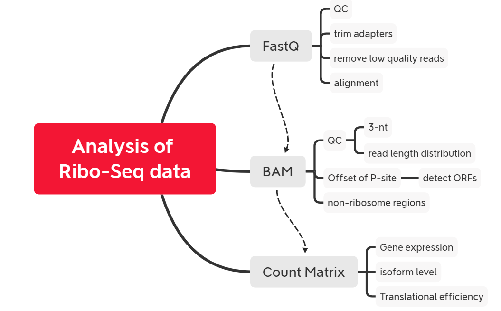

# Introduction
{:.no_toc}

<!-- This is a comment. -->

 In the first few tutorials, we separated the pipeline of Ribo-seq data analysis to discuss the meaning and methods for each step. Therefore, we can customize the analysis module that we want to or concentrate on. However, disadvantages are also obviously because it complicated the analysis workflow. Therefore, we will introduce some tools that could analyze the whole analytic workflow of Ribo-seq data from top to bottom firstly. Then, we will also present several sets of workflow built by us with the aid of the Galaxy platform. 



> ### Agenda
>
> In this tutorial, we will cover:
>
> 1. TOC
> {:toc}
>
{: .agenda}

#  Multi tools

For adapting rapidly development translatomics, many workflow tools arises at the historic moment. They cover basic analysis steps in the translatomics but each also has its own focus. The sheet below lists these tools and their functions. 

| Tools      | Functions                                                    |
| ---------- | ------------------------------------------------------------ |
| riboraptor | `read length distribution` `read distribution on features` `P-site` |
| plastid    | `P-site offset` `metagene analysis`                          |


# Workflow

In this part, we introduce in detail what we would obtained from the Ribo-Seq data.

## Import data

Firstly, we need to import data into this workbench. Galaxy provides various manners for  us to import data. And not only that, we can also pin the tags for data conveniently to distinguish them in the complex and multiple steps. Moreover, we can also utilize `Collection` to manage and classify multiple samples for the purpose of simplifying the steps of processing batch data.

> ###  Hands-on: Data upload
>
> 1. Create a new history for this tutorial
> 2. Import the files from [Figshare]() or from the shared data library
>
> ```
> KO_1_RPF	KO_1	KO	https://ndownloader.figshare.com/files/18055442?private_link=b746ccf9f27f4135aa1d
> KO_2_RPF	KO_2	KO	https://ndownloader.figshare.com/files/18055445?private_link=b746ccf9f27f4135aa1d
> KO_3_RPF	KO_3	KO	https://ndownloader.figshare.com/files/18055448?private_link=b746ccf9f27f4135aa1d
> WT_1_RPF	WT_1	WT	https://ndownloader.figshare.com/files/18055451?private_link=b746ccf9f27f4135aa1d
> WT_2_RPF	WT_2	WT	https://ndownloader.figshare.com/files/18055454?private_link=b746ccf9f27f4135aa1d
> ```
>
> 
> 
>
> 3. Rename the datasets
> 4. Check that the datatype
>
> 
>
> 5. Add to each database a tag corresponding to ...
>
> 
>
{: .hands_on}

## Preprocess

### Quality Control

Quality control is particularly critical because it determines the accuracy and efficiency of subsequent analysis. Low-quality sequencing reads do not reflect valid genetic information for us. On the contrary, if this step is not handled properly, it will seriously interfere with the results of our subsequent analysis.

> ###  Hands-on: Check raw reads with **FastQC**
>
> 1. Run **FastQC**  with the following parameters:
>    -  *"Short read data from your current history"*: `fastqs` (Input dataset collection)
> 2. Inspect the `Webpage` output of **FastQC**  for the `KO1_RPF` sample by clicking on the  (eye) icon
{: .hands_on}

### Trimming

After quality control, we can see that the sample contains adapters and some reads are of low quality, so we need to cut or remove these reads to improve the mapping ratio.

> ###  Hands-on: Integrate FastQC reports into one using **MultiQC**
>
> 1. Run **MultiQC**  with the following parameters to integrate the FastQC reports
>    - In *"Results"*
>      - *"Which tool was used generate logs?"*: `FastQC`
>      - In *"FastQC output"*
>        -  *"Type of FastQC output?"*: `Raw data`
>        -  *"FastQC output"*: Click `RawData` files (output of **FastQC**  on trimmed reads), then it will be highlighted
> 2. Inspect the `Webpage` output from MultiQC
{: .hands_on}

### Alignment

Sequencing reads show us only the digitized gene sequence, we also need to align it to reference sequences such as the genome to determine the location of them.

> ###  Hands-on: Trim reads with **Cutadapt**
>
> 1. **Cutadapt**  with the following parameters:
>    -  *"Single-end or Paired-end reads?"*: `Single-end`
>        -  *"FASTQ/A file"*: `fastqs` (Input dataset collection)
>        - In *"Read 1 Options"*:
>            - In *"3' (End) Adapters"*:
>                - Click on *"Insert 3' (End) Adapters"*:
>                - In *"1: 3' (End) Adapters"*:
>                    -  *"Source"*: `Enter custom sequence`
>                        -  *"Enter custom 3' adapter name (Optional)"*: `Illumina`
>                        -  *"Enter custom 3' adapter sequence"*: `CTGTAGGCACCATCAAT`
>    - In *"Filter Options"*:
>        -  *"Minimum length"*: `25`
>        -  *"Maximum length"*: `34`
>    - In *"Read Modification Options"*:
>        -  *"Quality cutoff"*: `20`
>        -  *Trim Ns*: `Yes`
>    - In *"Output Options"*:
>        -  *"Report"*: `Yes`
{: .hands_on}

### Post-alignment QC

After the mapping is completed, first we need to check the abnormality of the mapping   result. In addition, we also need to check whether the data conforms to the basic characteristics of Ribo-Seq data, such as the distribution of read length, and whether the read distribution has a 3-nt periodicity.

 

## Normalization

Comparison of gene expression between groups often requires a standardized gene count matrix. First, the number of mapped reads of each gene can be extracted by software such as featureCounts. Then, due to the depth of sequencing, we need to further transform the original read count so that the gene expression can be compared horizontally between groups.

> ###  Hands-on: Get read counts with **featureCounts**
>
> 1. **featureCounts**  with the following parameters:
> -  *"Alignment file"*: `KO_1_RPF`, `KO_2_RPF`, `KO_3_RPF`, `WT_1_RPF`, `WT_2_RPF`
>    - *"Gene annotation file"*: `in your history`
>      -  *"Gene annotation file"*: `hg38.gencode.v32.gtf` 
> 2. **MultiQC**  with the following parameters:
>    - In *"Results"*:
>      -  *"Which tool was used generate logs?"*: `featureCounts`
>        -  *"Output of FeatureCounts"*: `KO_1_RPF`, `KO_2_RPF`, `KO_3_RPF`, `WT_1_RPF`, `WT_2_RPF`
>
{: .hands_on}

> ###  Hands-on: Task description
>
> 1. **DESeq2**  with the following parameters:
>    - *" how"*: `Select datasets per level`
>        - In *"Factor"*:
>            -  *"Insert Factor"*
>                - *"Specify a factor name, e.g. effects_drug_x or cancer_markers"*: `Treatment`
>                - In *"Factor level"*:
>                    -  *"Insert Factor level"*
>                        - *"Specify a factor level, typical values could be 'tumor', 'normal', 'treated' or 'control'"*: `WT`
>                        -  *"Counts file(s)"*: `WT_1_RPF`, `WT_2_RPF`
>                    -  *"Insert Factor level"*
>                        - *"Specify a factor level, typical values could be 'tumor', 'normal', 'treated' or 'control'"*: `KO`
>                        -  *"Counts file(s)"*: `KO_1_RPF`, `KO_2_RPF`, `KO_3_RPF`
>    - *"Choice of Input data"*: `Count data (e.g. from HTSeq-count, featureCounts or StringTie)`
>    - *"Output normalized counts table"*: `Yes`
>    - *"Output rLog normalized table"*: `Yes`
>
{: .hands_on}

## Translatomics analysis

Thanks to the 3-base step size of the ribosome, we can learn the changes of the gene expression from transcription to protein at a higher resolution. Combined with the transcriptome data, we can speculate the role of translation in this process.

### Translational efficiency

By calculating translation efficiency, we can infer the role of translation regulation in the transmission of gene information, and can, therefore, infer the space played by intracellular molecular regulation mechanisms under certain special conditions.

> ###  Hands-on:  Calculate translational efficiency using RiboDiff
>
> - Run  **Ribodiff** with following  parameters:
>   -  *"Sequencing read count file"*: `Count table` 
>   -  *"Experiment outline"*: `Sample Information` 
>   -  *"Visualizing the analysis report"*: `Yes` 
>
{: .hands_on}

### Expression of isoforms

> ###  Hands-on: Calculate gene expression at the isoform level with **Ribomap**
>
> 1. **Ribomap**  with the following parameters:
>    -  *"Input RNA-seq read fastq.gz file for transcript abundance estimation"*: `output` (Input dataset)
>    -  *"Input ribosome profiling (riboseq) read fastq.gz file"*: `output` (Input dataset)
>    -  *"Input trascriptome reference fasta file"*: `output` (Input dataset)
>    - *"Use contaminant sequence fasta file?"*: `no`
>    - *"Use coding sequence (CDS) range for all transcripts?"*: `no`
>    - *"The linker sequence attached to the 5' end of the Ribo-Seq reads."*:  `CTGTAGGCACCATCAAT`  
>    - *"Minimun read length to keep for downstream analysis."*: `25`
>    - *"Maximum riboseq read length to keep for downstream analysis."*: `34`
{: .hands_on}

### Identify non-ribosome regions

Affected by the currently experimental technique of extracting ribosome-enclosed fragments, Ribo-Seq data are often replaced with non-ribosome-enclosed regions, which may be wrapped by other RBPs. However, these proteins are of varying lengths and do not have the 3-nt periodicity like ribosome-enclosed fragments. Consequently, they can be identified using corresponding tools. These areas will help us to identify potential transition areas.

> ###  Hands-on: Detect reads from non-ribosomes
>
> - Run **Rfoot**  with following parameters:
>   -  *"input read mapping file in SAM format"*: `sub_RPF_WT_1.sorted.q20.sam`
>   -  *"transcript annotation file in genePred format"*: `gencode.v32.annotation.genePred.txt`
>
{: .hands_on}

### Optimize position of A/P-stie

Before predicting the ORFs, we first need to accurately locate the translational start site and stop site. Because there is yet a distance between the edge of translatomics reads and P-site in the ribosomes. Therefore, there is a deviation between the regions mapped reads covered and regions produced piptides.

#### Step 1: Performing metagene analyses

> ###  Hands-on: metagene analyses
>
> 1. **Performing metagene analyses**  with the following parameters:
>
>    -  *"annotation file"*: `gencode.v32.annotation.gtf`
>    -  *"Landmark around which to build metagene profile"*: `cds_start`
>   -  *"Nucleotides to include upstream of landmark"*: `50`
>    -  *"Nucleotides to include downstream of landmark"*: `50`
>    - ***TODO***  *"alignment mapping functions"*: `Map read alignment to 5' position`
>   -  *"alignment file in bam format"*: `sub_RPF_KO_1.sorted.q20.bam`
> > ###  Details
> >
> > Through this step we can obtain the roi file required in the next step. More details is on the [cookbook of plastid](https://plastid.readthedocs.io/en/latest/examples/metagene.html).
> {: .details}
{: .hands_on}


#### Step 2: Determine P-site offsets for ribosome profiling data

> ###  Hands-on: determine the offsets
>
> 1. **Determine P-site offsets for ribosome profiling data**  with the following parameters:
> -  *"roi file generated by Step 1"*: `rois.txt on data 2 and data 1` (output of **Step 1: Performing metagene analyses** )
>    -  *"alignment bam file"*: `sub_RPF_KO_1.sorted.q20.bam` (Input dataset)
>    - *"min length"*: `25`
>    - *"max length"*: `34`
> > ###  Details
> >
> > More details is on the [cookbook of plastid](https://plastid.readthedocs.io/en/latest/examples/p_site.html).
> {: .details}
{: .hands_on}

### Detect ORFs

By detecting the ORF, we can predict the potential translational regions, and combined with information such as translation pauses, we can embed a functional landscape of the gene in the translational process.

> ###  Hands-on: Detect translating ORFs with RiboCode
>
> 1. **RiboCode to identify translated ORFs**  with the following parameters:
>
>    -  *"GTF file"*: `gencode.v32.annotation.gtf` 
>    -  *"The genome sequences file in fasta format"*: `hg38_ucsc.fasta` 
>    -  *"RPF mapping file"*: `RPF_WT_2.Aligned.toTranscriptome.out.bam` 
>    -  *"whether the data is strand-specific, reverse means reversed strand interpretation.(default: yes)"*: `no`
>
{: .hands_on}

# Conclusion
{:.no_toc}

In this point, we have gone through basic and specific analysis about translatomics data. Through this tutorial, one can know the basic steps and certain attentions during the translatomics analysis. 