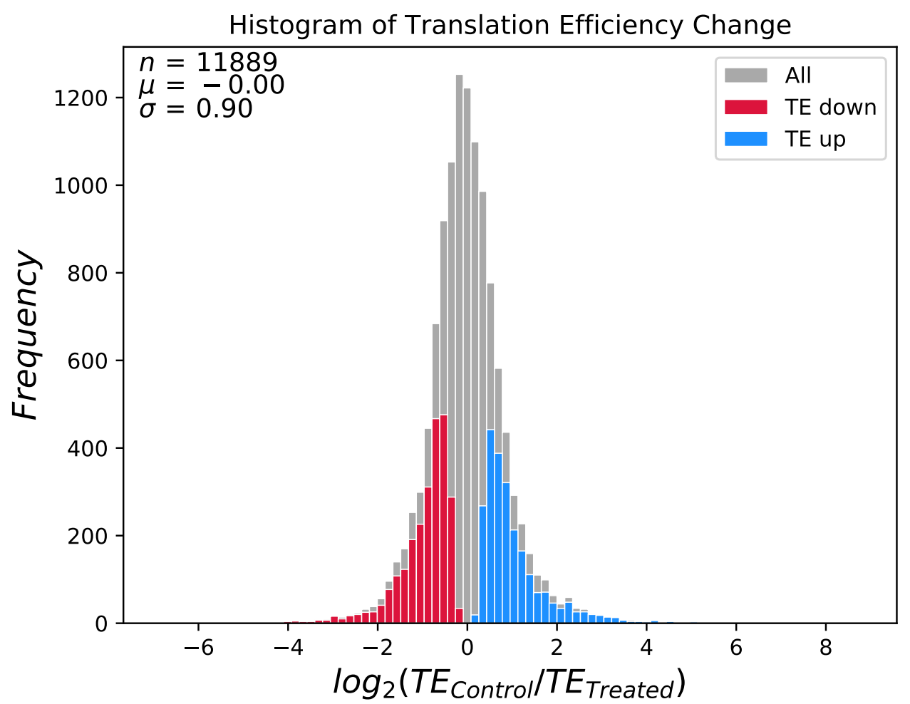

# Introduction

{:.no_toc}

<!-- This is a comment. -->

It is usually not the linear that changes of gene abundance from transcriptional level to translational level account for more sophisticated regulatory mechanisms at the post-transcription and translation process, for example, folding of mRNA, involving big molecules like ribosomes. Therefore, this nonlinear changes of gene abundance at different omics level is a piece of crucial evidence to explore the cellular physiological process and molecular functions. 

In the past, we could not catch a glimpse of physiological changes of the gene at the translational level limited by the technology. Currently, the appearance of ribosome profiling provides us an unprecedented opportunity to study translation, a key component in the central dogma. Moreover, in combination with transcriptomics data, we can inquiry about the change trends while gene information transmitted to proteins from transcripts, thus to study molecular functions for designing drug targets accurately. 

Therefore, a few tools and strategies were developed for exploring changes in gene abundance at the translational level. For instance, translational efficiency (TE) is a common analysis method in the translatomics, which can reflect the direction and degree of gene changes from transcripts to proteins. These changes usually are divided into three categories: one is called "forward", which represents that gene abundance at the translational level maintains its fluctuation at the transcriptional level, just like what black points represent below; another is called "reinforce", which represents gene abundance occurred obviously regulation only at the translational level; the last is called "buffer", which is that gene abundance have differences at the transcriptional level, however, this differences was contacted at the translational level. ")


> ### Agenda
>
> In this tutorial, we will cover:
>
> 1. TOC
> {:toc}
>
{: .agenda}

# Import data

> ###  Hands-on: Data upload
>
> 1. Create a new history for this tutorial
>
>    
>
> 2. Import the files from [Figshare](https://figshare.com/s/651afb45fbb5fc9d7010) 
>
>    ```
>    https://ndownloader.figshare.com/files/20026487?private_link=651afb45fbb5fc9d7010
>    https://ndownloader.figshare.com/files/20026490?private_link=651afb45fbb5fc9d7010
>    ```
>    
>    
>
> 3. Check that the datatype of count table is `tabular` and the sampleinfo file is `csv`. If not, you should change the datatype according to steps below.
>
>    
{: .hands_on}

# Calculate translational efficiency

> ###  Hands-on:  Calculate translational efficiency using RiboDiff
>
> - Run  **Ribodiff** with following  parameters:
>   -  *"Sequencing read count file"*: `Count table` 
>   -  *"Experiment outline"*: `Sample Information` 
>   -  *"Visualizing the analysis report"*: `Yes` 
>
{: .hands_on}

A txt file will be generated, which contains minute information of TE for each gene in the control and treated groups. The parts of the txt is shown below, in which the last column represents the fold change of TE ( log2 scale ) for genes between two conditions. Combined with adjusted p-value, we can filter out the significantly differentially expressed genes in treated groups. Hence, through exploring TE changes of interested genes, we may explain and reveal the mechanism of gene regulation in a particular circumstance.

| geneIDs    | disper   | pval     | padj     | TETreated | TEControl | log2FC_TE(Control vs Treated) |
| ---------- | -------- | -------- | -------- | --------- | --------- | ----------------------------- |
| uc001abw.1 | 0.058296 | 0.036236 | 0.091273 | 0.414921  | 0.997212  | 1.265062                      |
| uc001abz.4 | 0.0034   | 0.067515 | 0.148236 | 0.48771   | 0.564054  | 0.209808                      |
| uc001aca.2 | 0.030698 | 9.20E-05 | 0.000652 | 0.44399   | 0.130533  | -1.76612                      |
| uc001acd.3 | 0.070118 | 0.877859 | 0.927255 | 0.833542  | 0.866727  | 0.056323                      |

Another result is a histogram figure of translational efficiency change, through which we can have a holistic veiw for gene regulatory changes between two different conditions, for example, the frequency of genes affected.




# Conclusion

{:.no_toc}

If we just analyzed the data from ribosome profiling, we could not infer whether the changes of gene expression was derived from transcription or translation or both of them. However, we can address this question through calculating translational efficiency, thus we might make a reasonable explaination for mechanisms of gene regulation more precisely. 