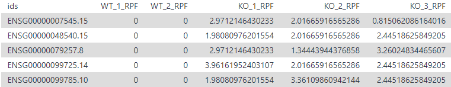
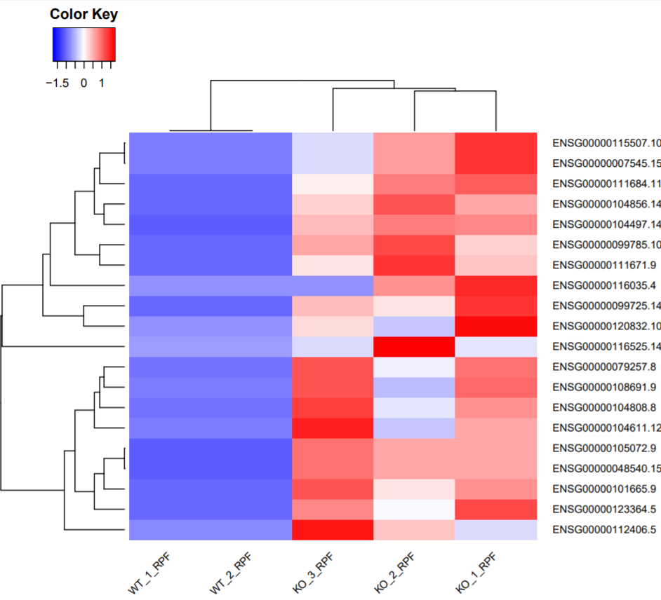

# Introduction
{:.no_toc}

<!-- This is a comment. -->

At this point, we have introduced almost all analyzing methods and aspects for Ribo-Seq data. However, some tools merely produced text files other than figures or generated figures are unstatisfactory. As a consequence, we introduce how to utilize relavant tools for visualizing results generated during the data processing, so as to more vividly reflect the conclusions obtained from Ribo-Seq data analysis. 

> ### Agenda
>
> In this tutorial, we will cover:
>
> 1. TOC
> {:toc}
>
{: .agenda}


# Import data

> ###  Hands-on: Data upload
>
> 1. Create a new history for this tutorial
>
> 	
>
> 2. Import the files from [Figshare](https://figshare.com/s/651afb45fbb5fc9d7010)
>
> 	```
> 	https://ndownloader.figshare.com/files/20185199?private_link=40b21b68241fab3e2758
> 	https://ndownloader.figshare.com/files/20185211?private_link=40b21b68241fab3e2758
> 	https://ndownloader.figshare.com/files/20185202?private_link=40b21b68241fab3e2758
> 	```
> 	
> 	
>
> 3. Check that the datatype of uploaded files are `tabular`. If not, you should change the datatype according to steps below.
>
> 	
{: .hands_on}


# Prepare the data matrix

We firstly need to manipulate data making them to conform the requirements as the input of tools of **heatmap2**. Below we introduce in detail how to manipulate results from **DESeq2**.

> ###  Hands-on: Prepare data matrix
>
> 1. **ctat_concatenate**  with the following parameters:
>    -  *"Concatenate Dataset"*: `header.tabular` 
>    
>    - In *"Dataset"*:
>        -  *"Insert Dataset"*
>            -  *"Select"*: `Normalized_counts_file.tabular` 
>       
>    - Rename output file as `nomarlized count matrix`
>    
>        
>    
> 2. **Join datasets by identifier column**  with the following parameters:
>
>    -  *"Select table"*: `nomarlized count matrix` (output of **ctat_concatenate** )
>    - In *"Select table"*:
>      -  *"Insert Select table"*
>        -  *"Select table"*: `DESeq2_result_file.tabular ` 
>    - *"Column used for joining"*: `c1`
>
> 3. **Filter**  with the following parameters:
>
>    -  *"Filter"*: `out_file` (output of **Join datasets by identifier column** )
>    - *"With following condition"*: `c7<0.05 and c3 > 1`
>    - *"Number of header lines to skip"*: `1`
>
> 4. **Sort**  with the following parameters:
>
>    -  *"Sort Dataset"*: `out_file` (output of **Filter** )
>    - *"on column"*: `c7`
>    - *"with flavor"*: `General numeric sort`
>    - *"everything in"*: `Ascending order`
>    - *"Number of header lines to skip"*: `1`
>
> 5. **Select first**  with the following parameters:
>
>    - *"Select first"*: `21`
>    -  *"from"*: `out_file` (output of **Sort** )
>
> 6. **Cut**  with the following parameters:
>
>    - *"Cut columns"*: `c1,c8-c12`
>    -  *"From"*: `out_file1` (output of **Select first** )
>
{: .hands_on}



# Visulization with **heatmap2**

> ###  Hands-on: Visulization with **heatmap2**
>
> 1. **heatmap2**  with the following parameters:
>    -  *"Input should have column headers - these will be the columns that are plotted"*: `out_file1` (output of **Cut** )
>    - *"Enable data clustering"*: `Yes`
>    - *"Coloring groups"*: `Blue to white to red`
>    - *"Data scaling"*: `Scale my data by row`
>
{: .hands_on}

Finally, you would get a heatmap like below. You can observe the gene expression between samples at the translational level. Moreover, you can deduce and inquiry about the function of these genes combined with your experiment conditions. 



# Conclusion

{:.no_toc}

Here, we introduced how to manipulate results from DESeq2 to make it conform the requirements for the downstream analysis. We also present one method to visualize this result, thus users can get their visualized results in the light of this tutorial. 
