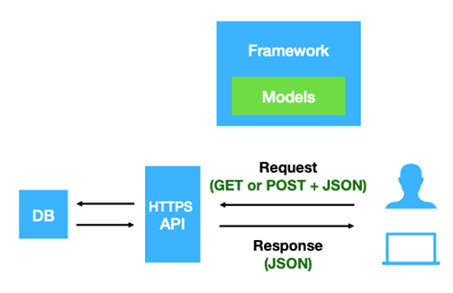

# Introduction

Beacon v2 is a data query protocol and API that allows the researcher to seek information about specific genomic variants of biomedical research and clinical applications from the data providers (beacon provider) without 
accessing the original or the whole dataset . The protocol was developed by the Global Alliance for Genomics and Health (GA4GH) in 2021 as an update for the former Beacon v1 
. The second version of Beacon comes with additional features that provide users with more detailed information about the queried variants. Unlike the previous version, 
which only returned a Yes or No response indicating the presence of variants, Beacon v2 presents comprehensive results about the variants being searched. .

The Beacon v2 comprises two main parts, namely the framework and the models. The framework specifies how the requests and responses should be formatted, while the models determine the organization of the biological data response 
{cite Rueda2022}.



Before working with a beacon, the beacon providers must prepare the data in JSON format, also known as Beacon-friendly format (BFF), using the Beacon RI tools. The data is divided into two parts - Metadata and Genomic variants.
The metadata is initially saved in different formats like Excel format, CSV, etc., while the Genomic variations are kept in VCF format. By converting the metadata into BFF format, it generates analyses, biosamples, 
cohorts, datasets, individuals, and runs, while the genomic variation VCF generates a genomicVariations file. When combined, they produce the seven entities present in the Beacon v2 Models (default schemas) and their 
relationships, as represented in the diagram below:

 and their relationships")

The Beacon provider will utilize the Beacon ri tools to upload the necessary data into MongoDB after collecting it. However, in this tutorial, we will use distinct tools to import and retrieve data from Beacon v2, 
which was created by The University of Bradford Computational and Data-Driven Science research team.

Beacon MongoDB databases can be created with different security levels for accessing Beacon data through import and query processes. These databases can be classified into three security levels: public, registered, and controlled. 
Alternatively, they can be classified into two security levels in our import and query tools: public and authenticated.

|---------|---------|
|Sequrity Level|Description|
|Public|Beacon can be accessed by any request|
|Registered|Only known users can access the data|
|Controlled|Only specifically granted users can access the data|


In this tutorial, we will walk through the process of creating the Beacon v2 protocol using MongoDB. This will include showing how to prepare the data, import it and demonstrate how to perform queries.
The tutorial will be both on Galaxy and command line. 

The Galaxy part will talk about how to preprosses the data for Beacon while we will use the comand line to create the Beacon protocol using MongoDB, import the data into Beacon and Query the Beacon database.

> <agenda-title></agenda-title>
>
> In this tutorial, we will cover:
>
> 1. TOC
> {:toc}
>
{: .agenda}


# prepare the Data for Beacon using instituional Galaxy

Before we start working with Beacon. First, we need to prepare the data in beacon-compatible format as Beacon protocol is designed to take and search the genomic database and its metadata in BFF format (JSON format).

Normally, The genomic variation is saved in VCF file format, and metadata are kept by the researchers in EXCEL, CSV, etc. So, before uploading them into the Beacon database, we need to convert them into the proper format using the available Beacon tools in Galaxy.

## Get data

> <hands-on-title>Data upload</hands-on-title>
>
> 1. For this tutorial, make a new history.
>
>    
>
>    
>
> 2. Import the data files from
>    [Zenodo](https://zenodo.org/record/2582555):
>
>    ```
>    https://zenodo.org/record/2582555/files/SLGFSK-N_231335_r1_chr5_12_17.fastq.gz
>    https://zenodo.org/record/2582555/files/SLGFSK-N_231335_r2_chr5_12_17.fastq.gz
>    https://zenodo.org/record/2582555/files/SLGFSK-T_231336_r1_chr5_12_17.fastq.gz
>    https://zenodo.org/record/2582555/files/SLGFSK-T_231336_r2_chr5_12_17.fastq.gz
>    ```
> The installed data contains the genomic variation VCF file and different examples of metadata files. The VCF to JSON converter tools mainly works with GZIP type only compressed files, so make sure that your data are in the same type
> (the tools don't accept bgzip compressed files), then upload the data into Galaxy select the type as tabuler.gz while for the files ended with CSV extinction saved in the CSV type. 
>
>    In some cases the same dataset can be found in the Galaxy shared data library. 
>    Ask the instructor for more details about this.
>
>    The dataset can also be downloaded from a local storage.  
>
>    
>
>    
>
> 3. Give the data meaningful names and tags to identify them easier.
>     
>
>    When uploading data from a link, Galaxy names the files after the link address.
>    It might be useful to change or modify the name to something more meaningful.
>
>    
>
>
> 4. This tutorial has a set of shared steps performed on the data. To track the
>    data in the history, it is recommended to tag the datasets by attaching a meaningful tag '#'
>    to them. The tagging will automatically be attached to any file generated
>    from the original tagged dataset.
>
>
>    
{: .hands_on}

## Convert the Genomic Vareints file into JSON

> <hands-on-title>Convert VCF file into JSON</hands-on-title>
> Run  
>        -  *"Annotated vcf file"*: genomic vareints tabuled.gz dataset
>        -  *"Output format"*: BFF
>        -  *"Dataset ID"*: Beacon
>        -  *"Reference genome"*: hg19
>
>    This job will convert the genomic vareints file into JSON BFF format that is cmpatbale with the Beacon protocol.
>    Check the output JSON file to see what happend are the changes happent on the file
{: .hands_on}

## Preprosses the Metadata Files

There are many methods to handel the metadata as resurchers tend to keep them in diffeent methods,
in this part we will discuss how to handel each type of them. 

> <hands-on-title>CSV Metadata preperation</hands-on-title>
> 
> Run  
>        -  *"CSV files"*: The sevin CSV files named as `analysis`, `biosambels`, `cohorts`, `datasets`, `genomic varients`, `indeviduals`, and `runs`
>
>    This job will compine all of the CSV files into one EXCIL file.
> ############## I nead michel tool here
{: .hands_on}

> <hands-on-title>JSON Phemopacket Metadata preperation</hands-on-title>
> 
> Run  
>        -  *"Phenopacket JSON files"*: The EGAF JSON files
>
> This job will combine the Phenopacket JSON files into one BFF JSON file. Check the files to find what happened to the structure of the JSON file. Change the output file name and give it a proper name.
> ############## as we talked to michel we will create this tool
{: .hands_on}


# prepare the Data for Beacon using Terminal 

Terminal can be used as an alternative option to preprocess the data. 

## Setting up the local environment

> <hands-on-title>Preprare the local enviroment</hands-on-title>
>
> 1. Create a directory in your local environment and give it a suitable name.
>
> ```
> $mkdir <directory_name>
> ```
>
> 2. Move to the created Directory on the shell.
> ```
> $cd <directory_name>
> ```
> 3. Create a directory and name it as "input".
>
> ```
> $mkdir input
> ```
>
> 4. Move to the created Directory on the shell.
> ```
> $cd input
> ```
> 5. Create a conda environment and give it a suitable name.
> ```
> $conda create -n <enviroment name>
> ``` 
> 6. Activate the conda environment.
> ```
> $conda activate <enviroment name>
> ``` 
> 7. Add the bioconda channel to your channels list.
> ```
> $conda config --add channels defaults
> $conda config --add channels bioconda
> $conda config --add channels conda-forge
> $conda config --set channel_priority strict
> ``` 
> 5. Install the beacon2-ri-tools from Bioconda. 
> ```
> $conda install beacon2-ri-tools
> ``` 
> with this, we created the directory where we will install the data to, and installed the beacon2-ri-tools wich we will use to preprocess the data.
{: .hands_on}


## Convert the Genomic Vareints file into JSON

> <hands-on-title>Convert VCF file into JSON</hands-on-title>
>
> 1. Create a directory and give it a suitable name.
> ```
> $mkdir <directory_name>
> ```
> 2. Move to the created directory.
> ```
> $cd <directory_name>
> 3. Install the genomic variants test data from Zenodo using the $wget tool.
> ```
> wget https://zenodo.org/records/10490219/files/test.vcf.gz
> ``` 
> 4. Run the tool *vcf2bff.pl*.
> ```
> vcf2bff.pl -i test.vcf.gz  -f bff -d beacon -g hg19 -p ./
> ```
> This will convert the compressed genomic variations VCF file into a compressed JSON file. To uncompress the output file, use the gunzip tool.
> 5. Run the tool *gunzip*.
> ```
> gunzip genomicVariationsVcf.json.gz
> ```
{: .hands_on}


## Preprosses the Metadata Files

> <hands-on-title>CSV Metadata preparation</hands-on-title>
>
> 1. Create a directory and give it a suitable name.
> ```
> $mkdir <directory_name>
> ```
> 2. Move to the created directory.
> ```
> $cd csv_metadata
> 3. Install the metadata from Zenodo using the $wget tool.
> ```
> wget https://zenodo.org/records/10490219/files/analyses.csv
> wget https://zenodo.org/records/10490219/files/biosamples.csv
> wget https://zenodo.org/records/10490219/files/cohorts.csv
> wget https://zenodo.org/records/10490219/files/datasets.csv
> wget https://zenodo.org/records/10490219/files/genomicVariations.csv
> wget https://zenodo.org/records/10490219/files/runs.csv
> wget https://zenodo.org/records/10490219/files/individuals.csv
> ``` 
> 4. Run the tool *csv2xlsx* with the following parameters.
> ```
> $csv2xlsx *csv -o  Beacon-v2-Models_template.xlsx
> ```
> This will combine the CSV metadata files into one Excel file with multiple sheets.
{: .hands_on}


> <hands-on-title>JSON Phemopacket Metadata Preparation</hands-on-title>
>
> 1. Create directory and give it a suitable name.
> ```
> $mkdir <directory_name>
> ```
> 2. Move to the created directory.
> ```
> $cd csv_metadata
> ```
> 2. Create an output directory and give it a suitable name.
> ```
> $mkdir <out_directory_name>
> ```
> 3. Install the Phenopacket metadata from Zenodo using the $wget tool.
> ```
> wget https://zenodo.org/records/10490219/files/EGAF00005572721.json
> wget https://zenodo.org/records/10490219/files/EGAF00005572724.json
> wget https://zenodo.org/records/10490219/files/EGAF00005572727.json
> wget https://zenodo.org/records/10490219/files/EGAF00005572747.json
> wget https://zenodo.org/records/10490219/files/EGAF00005572750.json
> wget https://zenodo.org/records/10490219/files/EGAF00005572753.json
> wget https://zenodo.org/records/10490219/files/EGAF00005572756.json
> wget https://zenodo.org/records/10490219/files/EGAF00005572759.json
> wget https://zenodo.org/records/10490219/files/EGAF00005572762.json
> wget https://zenodo.org/records/10490219/files/EGAF00005572861.json
> wget https://zenodo.org/records/10490219/files/EGAF00005572881.json
> wget https://zenodo.org/records/10490219/files/EGAF00005572884.json
> wget https://zenodo.org/records/10490219/files/EGAF00005572887.json
> wget https://zenodo.org/records/10490219/files/EGAF00005572890.json
> wget https://zenodo.org/records/10490219/files/EGAF00005572893.json
> wget https://zenodo.org/records/10490219/files/EGAF00005572896.json
> wget https://zenodo.org/records/10490219/files/EGAF00005572899.json
> wget https://zenodo.org/records/10490219/files/EGAF00005572902.json
> ``` 
> 4. Run the tool *csv2xlsx* with the following parameters.
> ```
> $pxf2bff -i E* -o <out_directory_name>
> ```
> The tool will combine all of the Phenopacket JSON files into one BFF JSON file.vCheck the files to find what happened to the structure of the JSON file. 
{: .hands_on}


# Create Beacon data discovery protocol using MongoDB

The Beacon protocol is created by the Beacon-providing institution to serve and work from the institution's perspective and also to share the genomic data if they want to have open access beacon for the public or access for selected people by requiring authentication to query the data. 

In this tutorial, we will show an example of how to create the two types of beacon by creating two docker servers for MongoDB, one for open access and the other for authentication-required access.

## Create an open-access MongoDB server.

> <hands-on-title>Create open access Beacon Database on MongoDB</hands-on-title>
>
> 1. Create a directory in your local environment and give it a suitable name.
>
> ```
> $mkdir <directory_name>
> ```
>
> 2. Move to the created Directory on the shell.
> ```
> $cd <directory_name>
> ```
> 3. Create an empty file and name it 'docker-compose. YAML using any text editor you have.
> ```
> $nano docker-compose.yaml
> ``` 
> 4. Copy the text below into the "docker-compose.yaml" file.
> ```
> version: '3.6'
> services:
> 
>   mongo-client:
>     image: mongo:3.6
>     restart: unless-stopped
>     volumes:
>       - ./beacon/db:/data/db
>     ports:
>       - "27017:27017"
> 
>   mongo-express:
>     image: mongo-express
>     restart: unless-stopped
>     environment:
>       - ME_CONFIG_MONGODB_SERVER=mongo-client
>       - ME_CONFIG_MONGODB_PORT=27017
>       - ME_CONFIG_BASICAUTH_USERNAME=admin
>       - ME_CONFIG_BASICAUTH_PASSWORD=adminpass
>     ports:
>       - "8081:8081"
> ```
> 5. Create the path 'beacon/db' in your directory using the 'mkdir' tool.
> ```
> $mkdir beacon
> $mkdir beacon/db
> ```
> You can change the name of that bath, but you have to update the pathway from the docker-compose.yaml file.
> Now we have everything ready for creating the MongoDB server hosted in the docker container, we can run docker.
>
> 5. run the tool 'docker-compose' with the following parameters.
> ```
> $docker-compose up -d
> ```
> 6. Check the created docker containers and test if your docker container is running.
> ```
> $docker ps
> ```
> This will give you a massage similar to this.
> ```
> CONTAINER ID   IMAGE           COMMAND                  CREATED      STATUS          PORTS                                           NAMES
> 54aeff806042   mongo:3.6       "docker-entrypoint.s…"   6 weeks ago   Up 6 weeks   0.0.0.0:27017->27017/tcp, :::27017->27017/tcp   beacon_mongo-client_1
> 38a8e4481963   mongo-express   "/sbin/tini -- /dock…"   6 weeks ago   Up 6 weeks   0.0.0.0:8081->8081/tcp, :::8081->8081/tcp       beacon_mongo-express_1
>
> ```
> 7. Test your docker to see if the enviroment is running by runing $docker exec.
> ```
> $docker exec -it mongo-client bash
> ```
> This will take you into the docker container. You can leave the container by prising 'ctrl + d' from your keyboard. 
>
> With this, we have created an empty MongoDB server where we can add the beacon database or additional databases.
{: .hands_on}


## Create authenticated beacon MongoDB database.

> <hands-on-title>Create authentication requierd Beacon Database on MongoDB</hands-on-title>
>
> 1. Create directory on your local envirment and give it a suitble name.
>
> ```
> $mkdir <directory_name>
> ```
>
> 2. Use the shell to swich to the created directory.
> ```
> $cd <directory_name>
> ```
> 3. Create an empty file, and name it 'docker-compose.yaml' using any text editor you have.
> ```
> $nano docker-compose.yaml
> ``` 
> 4. Copy the text below into the 'docker-compose.yaml' file. 
> ```
> version: '3.1'
> 
> # networks:
> #   beacon-priv:
> #   idp-priv:
> #   pub:
> 
> services:
> 
>   ###########################################
>   # MongoDB Database
>   ###########################################
> 
>   mongo-client:
>     image: mongo:3.6
>     restart: unless-stopped
>     volumes:
>       - ./beacon/db:/data/db
>     ports:
>       - "27017:27017"
>     environment:
>       MONGO_INITDB_ROOT_USERNAME: root
>       MONGO_INITDB_ROOT_PASSWORD: example
> 
>   mongo-express:
>     image: mongo-express
>     restart: unless-stopped
>     environment:
>       - ME_CONFIG_MONGODB_SERVER=mongo-client
>       - ME_CONFIG_MONGODB_PORT=27017
>       - ME_CONFIG_BASICAUTH_USERNAME=admin
>       - ME_CONFIG_BASICAUTH_PASSWORD=adminpass
>     ports:
>       - "8081:8081"
> ```
> We have everything ready for creating the MongoDB server hosted in the docker container. The last step is to run docker.
> 5. Run the tool 'docker-compose' with the following parameters.
> ```
> $docker-compose up -d
> ```
> 6. Check the created docker containers and test if your docker container is running.
> ```
> $docker ps
> ```
> This will give you a message similar to the text below.
> ```
> 6a6d32af7952   mongo       "/sbin/tini -- /dock…"   8 days ago   Up 8 days       0.0.0.0:27017->27017/tcp, :::27017->27017/tcp   beacon_mongo_1
> 484aebfefcc6   mongo-express   "/sbin/tini -- /dock…"   8 days ago   Up 10 seconds   0.0.0.0:8081->8081/tcp, :::8081->8081/tcp       beacon_mongo-express_1
> ```
>
> There are many ways to create a Beacon using MongoDB. For more information, you can check the B2RI MongoDB beacon docker on [github](https://github.com/EGA-archive/beacon2-ri-tools/tree/main) repository. 
> Will use the first MongoDB method to create the Beacon prototype in this tutorial. Depending on your requirements, you can choose between the two methods to customise your Beacon.
{: .hands_on}


# Import data into Beacon MongoDB From an institutional Galaxy

After preparing the data in the Beacon proper format and creating the Beacon protocol, we will import the data into Beacon.

The beacon import tool is flexible to import data from the institutional galaxy or from the local environment.

> <hands-on-title>Import data into Beacon MongoDB</hands-on-title>
>
> 1. Clone to the usegalaxy-eu, [galaxy-beacon-import](https://github.com/usegalaxy-eu/galaxy-beacon-import) GitHub repo to install the Beacon2 import and search tools.
>
> ```
> $git clone https://github.com/usegalaxy-eu/galaxy-beacon-import.git
> ```
>
> 2. Move to the created Directory on the Shell.
> ```
> $cd galaxy-beacon-import #Change the name if the directory is cloned with a different name
> ```
> 3. Prepare the import script.
> ```
> pip3 install -r requirements.txt
> ```
> 4. Run the Beacon2-import.py tool with the following parameters.
> ```
> python3 beacon2_import.py -i <INPUT_JSON_FILE>  -d <The targeted beacon database> -c <COLLECTION> - H < Hostname/IP of the beacon database> -P <Port of the beacon database> -g -u <Galaxy hostname or IP> -k <API key of a galaxy user WITH ADMIN PRIVILEGES> -s
> ```
> The tool also works with a Beacon protocol with authentication. Check the *Advanced Connection to MongoDB* in the tool help section (python beacon2_import.py -h)
{: .hands_on}


# Import data into Beacon MongoDB From the local environment.

The Beacon import tool is quite flexible. It also imports the data from the local environment into Beacon. Installing the tool and prepare follows the same methods as installing it to use it to import the data for institutional Galaxy.


> <hands-on-title>Import data into Beacon MongoDB</hands-on-title>
>
> 1. Clone to the usegalaxy-eu, [galaxy-beacon-import](https://github.com/usegalaxy-eu/galaxy-beacon-import) GitHub repo to install the Beacon2 import and search tools.
>
> ```
> $git clone https://github.com/usegalaxy-eu/galaxy-beacon-import.git
> ```
>
> 2. Move to the created Directory on the Shell.
> ```
> $cd galaxy-beacon-import #Change the name if the directory is cloned with a different name
> ```
> 3. Prepare the import script.
> ```
> pip3 install -r requirements.txt
> ```
> 4. run the Beacon2-import.py tool with the following parametars.
> ```
> python beacon2_import.py -i <INPUT_JSON_FILE>  -d <The targeted beacon database> -c <COLLECTION> - H < Hostname/IP of the beacon database> -P <Port of the beacon database> -g -u <Galaxy hostname or IP> -k <API key of a galaxy user WITH ADMIN PRIVILEGES> -s
> ```
> The tool also works with a Beacon protocol with authentication. Check the *Advanced Connection to MongoDB* in the tool help section (python beacon2_import.py -h)
{: .hands_on}


# Search Beacon MongoDB


# Conclusion

