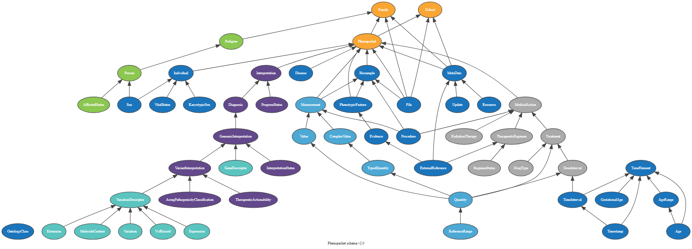

Beacon v2 is a data query protocol and API that allows the researcher to seek information about specific genomic variants of biomedical research and clinical applications from the data providers (beacon provider) without 
accessing the original or the whole dataset . The protocol was developed by the [Global Alliance for Genomics and Health (GA4GH)](https://www.ga4gh.org/) in 2021 as an update for the former Beacon v1.
The second version of Beacon comes with additional features that provide users with more detailed information about the queried variants. Unlike the previous version, 
which only returned a Yes or No response indicating the presence of variants, Beacon v2 presents comprehensive results about the variants being searched. .

The Beacon v2 comprises two main parts, the framework and the models. The framework specifies how the requests and responses should be formatted, while the models determine the organization of the biological data response 
.


Beacon MongoDB databases can be created with different security levels for accessing Beacon data through import and query processes. These databases can be classified into three security levels: public, registered, and controlled. 
Alternatively, they can be classified into two security levels in our import and query tools: public and authenticated.


| Security Level | Description                                         |
|----------------|-----------------------------------------------------|
| Public         | Beacon can be accessed by any request               |
| Registered     | Only known users can access the data                |
| Controlled     | Only specifically granted users can access the data |

The genomic variants data is usually divided into two parts. The Metadata and Genomic variants. The metadata is initially saved in different formats like Excel, CSV, etc., while the Genomic variations are kept in VCF files.
So, before beaconing them, the beacon providers must prepare the data in JSON, also known as Beacon-friendly format (BFF). This can be done by extracting the required information from those files following the beacon schemas. 
The beacon providers can use already developed tools such as in the [B2RI tools](https://github.com/EGA-archive/beacon2-ri-tools) or develop their own tools. 

For this tutorial we will show the steps to create a beacon and query it for the [HG00096](https://s3.console.aws.amazon.com/s3/buckets/1000genomes-dragen?region=us-west-2&bucketType=general&prefix=data/dragen-3.5.7b/hg38_altaware_nohla-cnv-anchored/HG00096/&showversions=false) 
biosample structural variants VCF file obtained from the [1000 Genome project](https://s3.console.aws.amazon.com/s3/buckets/1000genomes-dragen?region=us-west-2&bucketType=general&tab=objects) using scripts created by The University of 
Bradford Computational and Data-Driven Science research team.


> <agenda-title></agenda-title>
>
> In this tutorial, we will cover:
>
> 1. TOC
> {:toc}
>
{: .agenda}


# prepare the Data

Before we start working with Beacon. First, we will preprocess the data and convert it to the correct format because the Beacon protocol is designed to take and search the genomic database and its metadata in BFF format (JSON format).
The genomic variation files are usually in VCF format, while the metadata files are kept in EXCEL, CSV, etc. So, before uploading them into the Beacon database, we need to convert them into the proper format
using the available Beacon tools in Galaxy.

We will start with preparing the environment by installing the tools. The tutorial was made to create a beacon for the genomic data on the LINUX Ubuntu 20.04 system. Please modify the scripts for your system if required.

## Setting up the local environment

> <hands-on-title>Prepare the local environment</hands-on-title>
>
> 1. Create a directory in your local environment and give it a suitable name
> ```bash
> mkdir <directory_name>
> ```
> 2. Use the shell `$cd` command to move to the created directory
> ```bash
> cd <directory_name>
> ```
> 3. Create three directories inside the previously created directory and name them as **inputs**, **output** and **scripts**
> ```bash
> mkdir inputs
> mkdir outputs
> mkdir scripts
> ```
> 4. Create a conda environment and give it a suitable name
> ```bash
> conda create -n <enviroment name>
> ```
> 5. Activate the conda environment
> ```bash
> conda activate <enviroment name>
> ``` 
> 6. Add the bioconda channel to your channels list
> ```bash
> conda config --add channels defaults
> conda config --add channels bioconda
> conda config --add channels conda-forge
> conda config --set channel_priority strict
> ``` 
> 7. Move to the scripts directory and install vcf2json.py, phenopacket.py tools from [Zenodo](https://zenodo.org/records/10658688) using the `$wget` tool. 
> ```bash
> cd scripts
> wget https://zenodo.org/records/10657357/files/phenopacket.py
> wget https://zenodo.org/records/10657357/files/vcf2json.py
> ```
{: .hands_on}


## Convert the Genomic Variants VCF file into JSON

> <hands-on-title>Convert VCF file into JSON</hands-on-title>
>
> 1. Change the directory to the inputs directory
> ```bash
> cd path/to/the/inputs
> ```
> 2. Install the genomic variants file from [Zenodo](https://zenodo.org/records/10658688)
> ```bash
> wget https://zenodo.org/records/10657357/files/HG00096.cnv.vcf
> ``` 
> 3. Run the tool `$vcf2json.py` tool
> ```bash
> python path/to/tools/vcf2json.py -i path/to/inputs/HG00096.cnv.vcf -o path/to/outputs/HG00096.json
> ```
> This will converth the genomic variations VCF file into JSON file
{: .hands_on}


## Preprosses the Metadata Files

To help us better understand, diagnose, and treat both common and unusual diseases, the Phenopacket Schema is an open standard for exchanging disease and phenotypic data. Building more comprehensive 
disease models is made possible for physicians, biologists, and researchers studying disease and drugs by using Phenopackets, which connect comprehensive phenotype descriptions with patient, disease, 
and genetic data. 




We are using the Biosamles phenopacket, This is a biological material unit from which the substrate molecules (genomic DNA, RNA, proteins, etc.) are extracted for molecular analyses 
(mass spectrometry, array hybridization, sequencing, etc.). Tissue biopsies, single cells from cultures used for single-cell genome sequencing, and protein fractions from gradient centrifugations are a 
few examples. The same Biosample may be referred to by many instances (e.g., technical replicates) or types of research (e.g., both RNA-seq and genomic array experiments).

> <hands-on-title>JSON Phemopacket Metadata preparation</hands-on-title>
>
> 1. Change the directory to the inputs directory
> ```bash
> cd path/to/inputs
> ```
> 2. Install the Phenopacket metadata from [Zenodo](https://zenodo.org/records/10658688)
> ```bash
> wget https://zenodo.org/records/10657357/files/igsr-1000-genomes-30x-on-grch38.tsv
> ``` 
> 3. Run the tool `$phenopacket.py` with the following parameters
> ```bash
> python path/to/tools/phenopacket.py -i path/to/inputs/igsr-1000-genomes-30x-on-grch38.tsv -o path/to/outputs/phenopacket.json
> ```
> The tool will extract the information we need from the TSV file and create a phenopacket JSON file from them following a modified biosample schema.
{: .hands_on}


# Create Beacon data discovery protocol using MongoDB

The beacon-providing institution creates a Beacon to serve the institution's needs and if they want to make their beacon open access or private. We will show examples of creating both types of Beacons 
by creating 2 docker servers for MongoDB. The first method is for the open-access Beacon, and the second is for the private Beacon. 

In this tutorial, we will use the first MongoDB method to create the Beacon protocol. Depending on your requirements, you can choose between the methods to customise your Beacon. We will use docker and docker-compose for this step. If you don't have it installed, please follow this [documentation](https://docs.docker.com/engine/install/) to install it
## Create and open access MongoDB server

> <hands-on-title>Create open access Beacon Database on MongoDB</hands-on-title>
> 1. Create a directory in your local environment and give it a suitable name
> ```bash
> mkdir <directory_name>
> ```
> 2. Change your location to the newly created directory
> ```bash
> cd <directory_name>
> ```
> 3. Use any text editor you are comfortable with to create a new YAML file and name it `docker-compose.yaml`
> ```bash
> nano docker-compose.yaml
> ```
> 4. Copy the text below into the `docker-compose.yaml` file
> >
> > ```yaml
> > version: '3.6'
> > services:
> >
> >  mongo-client:
> >    image: mongo:3.6
> >    restart: unless-stopped
> >    volumes:
> >      - ./beacon/db:/data/db
> >    ports:
> >      - "27017:27017"
> >
> >  mongo-express:
> >    image: mongo-express
> >    restart: unless-stopped
> >    environment:
> >      - ME_CONFIG_MONGODB_SERVER=mongo-client
> >      - ME_CONFIG_MONGODB_PORT=27017
> >      - ME_CONFIG_BASICAUTH_USERNAME=admin
> >      - ME_CONFIG_BASICAUTH_PASSWORD=adminpass
> >    ports:
> >      - "8081:8081"
> > ```
> 5. Create the path `beacon/db` in your directory using `$mkdir` tool
> ```bash
> mkdir beacon
> mkdir beacon/db
> ```
> You can change the name of that bath, but you have to change that also from the docker-compose.yaml file. 
> We have everything ready for creating the MongoDB server hosted in the docker container. Next is to run docker.
> 6. Run the tool `$docker-compose` with the following parameters
> ```bash
> docker-compose up -d
> ```
> 7. Check the created docker containers and test if your docker container is running
> ```bash
> docker ps
> ```
> This will give you a massage similar to this
> ```
> CONTAINER ID   IMAGE           COMMAND                  CREATED      STATUS          PORTS                                           NAMES
> 54aeff806042   mongo:3.6       "docker-entrypoint.s…"   6 weeks ago   Up 6 weeks   0.0.0.0:27017->27017/tcp, :::27017->27017/tcp   beacon_mongo-client_1
> 38a8e4481963   mongo-express   "/sbin/tini -- /dock…"   6 weeks ago   Up 6 weeks   0.0.0.0:8081->8081/tcp, :::8081->8081/tcp       beacon_mongo-express_1
> ```
> 8. Test your docker to see if it is running by using `$docker exec` command
> ```bash
> docker exec -it <mongo-client> bash #If the docker image for the Mongo was installed with a different name, Change the name in <mongo-client>
> ```
> This will take you into the docker container. You can exit that by prising `ctrl + d` from your keyboard.
> This will create an empty MongoDB server where we can add the beacon database or any additional databases. 
{: .hands_on}


## Create authenticated beacon MongoDB database

> <hands-on-title>Create a Private Beacon Database on MongoDB</hands-on-title>
> 1. Create a directory in your local environment and give it a suitable name
> ```bash
> mkdir <directory_name>
> ```
> 2. Change your location to the newly created directory
> ```bash
> cd <directory_name>
> ```
> 3. Use any text editor you are comfortable with to create a new YAML file and name it `docker-compose.yaml`
> ```bash
> nano docker-compose.yaml
> ``` 
> 4. Copy the text below into the `docker-compose.yaml` file
> > ```yaml
> > version: '3.1'
> >
> > # networks:
> > #   beacon-priv:
> > #   idp-priv:
> > #   pub:
> >
> > services:
> >
> >  ###########################################
> >  # MongoDB Database
> >  ###########################################
> >
> >  mongo-client:
> >    image: mongo:3.6
> >    restart: unless-stopped
> >    volumes:
> >      - ./beacon/db:/data/db
> >    ports:
> >      - "27017:27017"
> >    environment:
> >      MONGO_INITDB_ROOT_USERNAME: root
> >      MONGO_INITDB_ROOT_PASSWORD: example
> >
> >  mongo-express:
> >    image: mongo-express
> >    restart: unless-stopped
> >    environment:
> >      - ME_CONFIG_MONGODB_SERVER=mongo-client
> >      - ME_CONFIG_MONGODB_PORT=27017
> >      - ME_CONFIG_BASICAUTH_USERNAME=admin
> >      - ME_CONFIG_BASICAUTH_PASSWORD=adminpass
> >    ports:
> >      - "8081:8081"
> ```
> 5. Create the path `beacon/db` in your directory using `$mkdir` tool
> ```bash
> mkdir beacon
> mkdir beacon/db
> ```
> You can change the name of that bath, but you have to change that also from the docker-compose.yaml file. 
> We have everything ready for creating the MongoDB server hosted in the docker container. Next is to run docker.
> 6. Run the tool `$docker-compose` with the following parameters
> ```bash
> docker-compose up -d
> ```
> 7. Check the created docker containers and test if your docker container is running
> ```bash
> docker ps
> ```
> This will give you a massage similar to this
> ```
> CONTAINER ID   IMAGE           COMMAND                  CREATED      STATUS          PORTS                                           NAMES
> 54aeff806042   mongo:3.6       "docker-entrypoint.s…"   6 weeks ago   Up 6 weeks   0.0.0.0:27017->27017/tcp, :::27017->27017/tcp   beacon_mongo-client_1
> 38a8e4481963   mongo-express   "/sbin/tini -- /dock…"   6 weeks ago   Up 6 weeks   0.0.0.0:8081->8081/tcp, :::8081->8081/tcp       beacon_mongo-express_1
> ```
> 8. Test your docker to see if it is running by using `$docker exec` command
> ```bash
> docker exec -it <mongo-client> bash #If the docker image for the Mongo was installed with a different name, Change the name in <mongo-client>
> ```
> This will take you into the docker container. You can exit that by prising `ctrl + d` from your keyboard.
> This will create an empty MongoDB server where we can add the beacon database or any additional databases. 
> There are many ways to create a Beacon using MongoDB. Check the B2RI MongoDB beacon docker on [github](https://github.com/EGA-archive/beacon2-ri-tools/tree/main) repo for more information. 
{: .hands_on}


# Import data into Beacon MongoDB

Now that the data are in the beacon proper format and with creating the Beacon MongoDB server, we are ready to import the data we have into Beacon.

The beacon import tool is flexible. The tool imports the data from an institutional galaxy or local environment.

> <hands-on-title>Import data into Beacon MongoDB</hands-on-title>
>
> 1. Clone to the usegalaxy-eu, [galaxy-beacon-import](https://github.com/usegalaxy-eu/galaxy-beacon-import) GitHub repo to install the Beacon2-import.py and the beacon2-search.py tools.
> ```bash
> git clone https://github.com/usegalaxy-eu/galaxy-beacon-import.git
> ```
> 2. Change your location to the cloned directory
> ```bash
> cd galaxy-beacon-import #Change the name if the directory is cloned with a different name
> ```
> 3. Install beacon2-import.py dependant tools using *$pip*
> ```bash
> pip3 install -r requirements.txt
> ```
> 4. Run the Beacon2-import.py tool for the genomic variance and phenopacket JSON files with the following parameters.
> ```bash
> python3 beacon2-import.py -i <genomicvarience_JSON_FILE>  -d beacon -c genomecvarience - H < Hostname/IP of the beacon database> -P <Port of the beacon database>
> python3 beacon2-import.py -i <phenopacket_JSON_FILE>  -d beacon -c phenopacket - H < Hostname/IP of the beacon database> -P <Port of the beacon database>
> ```
> The tool also works with a Beacon protocol with authentication. Check the *Advanced Connection to MongoDB* in the tool help section (python beacon2-import.py -h)
{: .hands_on}


# Search Beacon MongoDB

In the last step, we imported the data into the beacon. Now, we will query the database to look for the samples that match our query. 

We are looking to see if there is a deletion mutation in the gene **located** in `chromosome 1`, which **starts** at `58278107` and **ends** at `58279217`.


> <hands-on-title>Query the Beacon MongoDB</hands-on-title>
>
> 1. Run the Beacon2-search.py tool with the following parameters
> ```bash
> python3 beacon2-search.py range  -d beacon -c genomecvarience -rn 1 -s 2651463 -e 2653075 -v DEL
> ```
> The srarch function will queiry the beacon database and print out the resutls that matches our quiery specifications. In this case it will print something like this. 
> > ```json
> >    {
> >       "biosampleId": "HG00096",
> >       "assemblyId": "GRCh38",
> >       "variantInternalId": "chr1:58278107-58279217:EFO:0030069",
> >       "variantType": "DEL",
> >       "variantId": "EFO:0030069",
> >       "start": 58278107,
> >       "end": 58279217,
> >       "referenceName": "1",
> >       "info": {
> >           "legacyId": "DRAGEN:LOSS:chr1:58278108-58279217",
> >           "cnCount": 0,
> >           "cnValue": 0.0937719
> >       }
> >     }
> > ```
> The tool also works with a Beacon protocol with authentication. Check the *Advanced Connection to MongoDB* in the tool help section (python beacon2-search.py -h)
> 
> > <question-title></question-title>
>    >
>    > What dose variantId "EFO:0030069" means? 
>    >
>    > > <solution-title></solution-title>
>    > >
>    > > EFO:0030069 is a term used to describe the complete genomic deletion. The term was set by the CNV community.
>    > > For more information go to the [CNV annotation formats](https://cnvar.org/resources/CNV-annotation-standards/#cnv-term-use-comparison-in-computational-fileschema-formats)
>    > >
>    > {: .solution}
>    {: .question}
{: .hands_on}


# Conclusion

Now, you have a general knowledge of beacon and MongoDB and how to create your own beacon and upload your data. 

You can apply what you learned in this tutorial to create a beacon query for your institution's genomic variant data.

For more information about how to query beacon databases, please look into [pymongo documantation](https://pymongo.readthedocs.io/en/stable/tutorial.html). Use the documentation steps to query the phenopacket and search for the metadata for our sample ({"id": "HG00096"}).

We hope you find this tutorial helpful!
