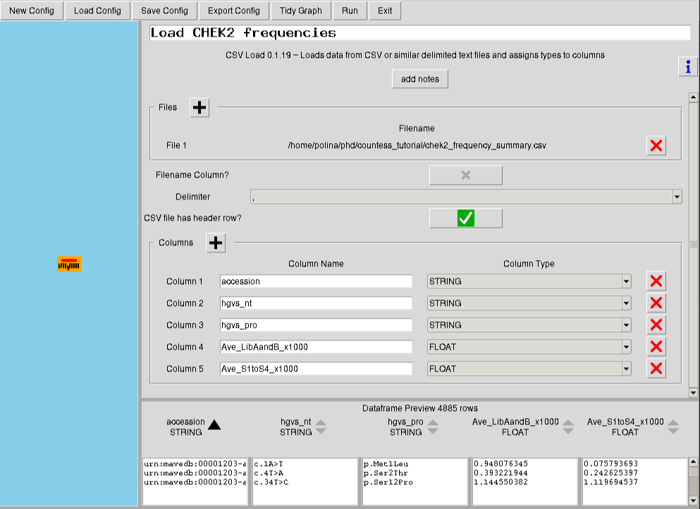
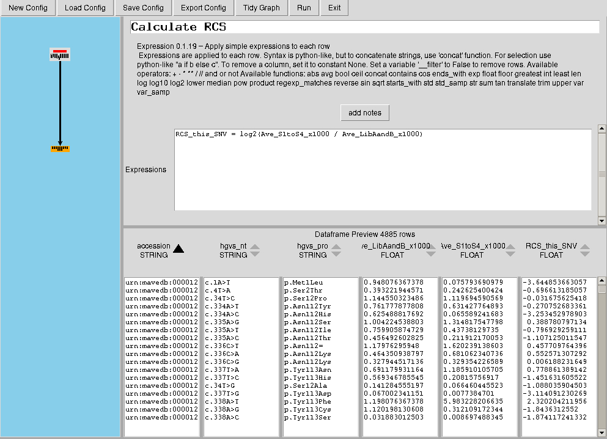
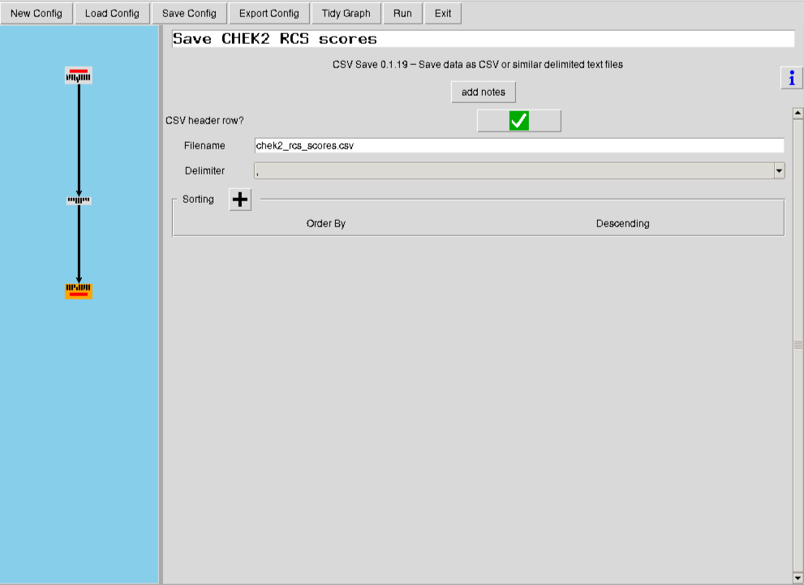
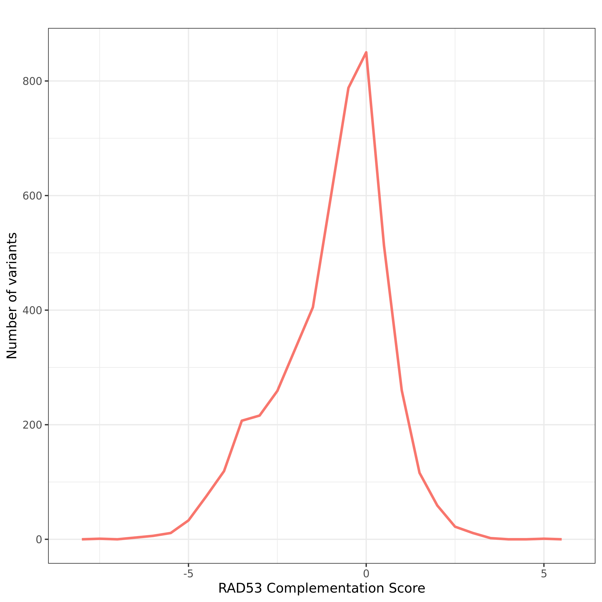
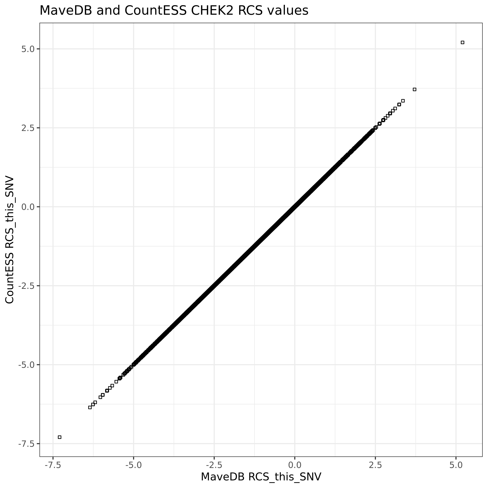

Multiplexed assays of variant effect (MAVEs), including deep mutational scanning (DMS)
experiments, measure the functional consequences of many genetic variants in parallel.
Instead of testing variants one at a time, a library of variants is assayed in a pooled
experiment. Sequencing before and after selection then estimates how each variant changed
in frequency during the assay.

In this tutorial, we will use a CHEK2 variant effect dataset from MaveDB
(`urn:mavedb:00001203-a-2`) to calculate a functional score with CountESS. The original
study tested coding single nucleotide variants (SNVs) in the human *CHEK2* open reading
frame. Loss-of-function mutations in *CHEK2*, which encodes the checkpoint kinase CHK2,
are associated with increased risk of breast and other cancers. Many *CHEK2* variants
observed in clinical testing are variants of uncertain significance, so functional assays
can provide evidence for interpreting their possible impact. In this study, variants were
tested for their ability to complement a *Saccharomyces cerevisiae* strain lacking the yeast
ortholog *RAD53* . The resulting RAD53 Complementation Score
(RCS) describes whether a CHEK2 variant was depleted or retained after selection.

The training data for this tutorial starts from a preprocessed variant frequency summary,
not raw sequencing reads. In the published analysis, reads were quality filtered and mapped
to the *CHEK2* amplicon, variants were detected, and each variant frequency was calculated
as the number of reads containing that variant divided by the sequencing coverage at that
nucleotide position. Those frequencies were averaged across the two pre-selection library
aliquots and across the four post-selection screens. The frequency values were multiplied
by 1000 to make small variant frequencies easier to read and compare. More details are
available in the original publication . The two frequency columns
used here are:

- `Ave_LibAandB_x1000`: average variant frequency before selection, from the two input library aliquots.
- `Ave_S1toS4_x1000`: average variant frequency after selection, from four complementation screens.

CountESS will calculate the log-ratio score:

```text
RCS_this_SNV = log2(Ave_S1toS4_x1000 / Ave_LibAandB_x1000)
```

Negative scores indicate variants depleted after selection, consistent with impaired CHEK2
function in this assay. Scores near zero indicate variants with similar frequencies before
and after selection, suggesting little detectable effect in this assay. Positive scores
indicate variants that increased in frequency after selection and were retained better
than the average variant population.

> <agenda-title></agenda-title>
>
> In this tutorial, we will cover:
>
> 1. TOC
> {:toc}
>
{: .agenda}

# Data preparation

The CountESS workflow and input data are available from Zenodo.

> <hands-on-title>Data upload</hands-on-title>
>
> 1. Create a new history for this tutorial.
>
>    
>
> 2. Import the following files from [Zenodo]({{ page.zenodo_link }}):
>
>    ```
>    https://zenodo.org/records/20250971/files/chek2_frequency_summary.csv
>    https://zenodo.org/records/20250971/files/chek2_rcs_countess.ini
>    ```
>
>    
>
> 3. Set the datatype of `chek2_frequency_summary.csv` to `csv` if Galaxy does not detect it automatically.
>
>    
>
> 4. Set the datatype of `chek2_rcs_countess.ini` to `txt` if Galaxy does not detect it automatically.
>
>    
>
{: .hands_on}

# Inspect the input files

The input CSV contains one row per CHEK2 variant and includes variant identifiers,
HGVS-style variant descriptions, and frequency summaries from before and after selection.

> <question-title></question-title>
>
> 1. Which two columns will be used to calculate the RCS score?
>
> > <solution-title></solution-title>
> >
> > The workflow uses `Ave_LibAandB_x1000` and `Ave_S1toS4_x1000`.
> >
> {: .solution}
>
{: .question}

The second input file, `chek2_rcs_countess.ini`, is a CountESS configuration file. It is a
saved CountESS workflow: each section in the `.ini` file describes one workflow node, and
the `_parent` lines describe how nodes are connected.

The saved workflow has three CountESS nodes:

1. `Load CHEK2 frequencies`: load the CSV input table.
2. `Calculate RCS`: calculate the log-ratio score.
3. `Save CHEK2 RCS scores`: write the output CSV.

This workflow is intentionally small so that the score calculation is easy to inspect.
CountESS workflows created in the GUI can be more complex, and the Galaxy tool can run
those saved workflows too.

> <details-title>How was the CountESS configuration file created?</details-title>
>
> The provided `.ini` file was created in the CountESS GUI. CountESS GUI is external
> software: to create or edit this configuration yourself, CountESS needs to be installed
> and the GUI needs to be run outside Galaxy first. You do not need to recreate the `.ini`
> file to complete this tutorial, but the workflow is intentionally simple:
>
> 1. Add a **CSV Load** node, rename it to `Load CHEK2 frequencies`, and load
>    `chek2_frequency_summary.csv`.
>
>    
>
> 2. Add an **Expression** node connected to the CSV Load node and rename it to
>    `Calculate RCS`.
>
> 3. In the Expression node, enter:
>
>    ```python
>    RCS_this_SNV = log2(Ave_S1toS4_x1000 / Ave_LibAandB_x1000)
>    ```
>
>    
>
> 4. Add a **CSV Save** node connected to the Expression node, rename it to
>    `Save CHEK2 RCS scores`, and set the output filename to `chek2_rcs_scores.csv`.
>
>    
>
> 5. Save the CountESS configuration as `chek2_rcs_countess.ini`.
>
{: .details}

# Run the CountESS workflow

CountESS is a workflow-like table processing tool. Galaxy will run this saved CountESS
workflow, connect Galaxy datasets to the input nodes, and collect files written by
CountESS save nodes into an output collection.

> <hands-on-title>Calculate CHEK2 RCS scores with CountESS</hands-on-title>
>
> 1. Run  with the following parameters:
>
>    -  *"CountESS configuration file"*: `chek2_rcs_countess.ini`
>
>    - In *"Input file mapping"*:
>      - *"CountESS input node name"*: `Load CHEK2 frequencies`
>      -  *"Input dataset"*: `chek2_frequency_summary.csv`
>
>    - *"Log level"*: `INFO`
>
{: .hands_on}

CountESS produces a collection of output files from the save-node
filenames stored in the `.ini` file. Open the output collection and inspect
`chek2_rcs_scores.csv`.

# Interpret the output

The output table contains the calculated `RCS_this_SNV` values. These scores are log2
ratios of the average post-selection variant frequency over the average pre-selection
variant frequency.

For example, a variant with lower frequency after selection than before selection will have
a negative RCS value. A variant with similar frequencies before and after selection will
have an RCS close to zero. A variant with higher frequency after selection than before
selection will have a positive RCS value. In the CHEK2 RAD53 complementation assay,
strongly negative RCS values indicate variants that were depleted during selection and are
therefore more likely to impair CHEK2 function in this assay.

> <question-title></question-title>
>
> 1. What do negative, near-zero, and positive RCS values mean in this experiment?
>
> > <solution-title></solution-title>
> >
> > A negative RCS value means the variant was less frequent after selection than before
> > selection, consistent with reduced ability of that CHEK2 variant to complement the yeast
> > *rad53* mutant. A near-zero RCS means the variant frequency changed little during
> > selection. A positive RCS means the variant was more frequent after selection than before
> > selection, suggesting it was retained better in this assay.
> >
> {: .solution}
>
{: .question}

# Visualize the score distribution

A simple next step is to plot the distribution of calculated RCS values. This gives a
quick overview of the range of functional effects in the assay and helps identify whether
most variants are close to neutral, depleted, or enriched after selection.

> <hands-on-title>Plot the distribution of calculated RCS values</hands-on-title>
>
> 1. Run  with the following parameters:
>
>    - *"Cut columns"*: `c6`
>    - *"Delimited by"*: `Comma`
>    -  *"From"*: `chek2_rcs_scores.csv` from the CountESS output collection
>
> 2. Run  with the following parameters:
>
>    -  *"Input should have column headers - these will be the columns that are plotted"*: output of **Cut columns from a table** 
>    - *"Label for x axis"*: `RAD53 Complementation Score`
>    - *"Label for y axis"*: `Number of variants`
>    - *"Bin width for plotting"*: `0.5`
>    - In *"Advanced Options"*:
>      - *"Plot counts or density"*: `Plot counts on the y-axis`
>      - *"Legend options"*: `Hide legend`
>
{: .hands_on}

> <question-title></question-title>
>
> 1. What does this histogram show that is not obvious from inspecting individual rows?
>
> > <solution-title></solution-title>
> >
> > The histogram summarizes the whole score distribution. Most variants have scores near zero,
> > with a left tail of depleted variants and fewer variants with positive scores. 
> > This is useful for getting a first overview of the assay before selecting variants or
> > score ranges for closer inspection.
> >
> > 
> >
> {: .solution}
>
{: .question}

# Compare with MaveDB

The MaveDB score set used for this tutorial is:

```text
https://mavedb.org/score-sets/urn:mavedb:00001203-a-2
```

The calculated `RCS_this_SNV` values from CountESS should match the `RCS_this_SNV` column
available from MaveDB for this score set. To check this directly, we can import the MaveDB
score table, join it to the CountESS output by accession, and plot the two RCS columns against
each other. If the CountESS workflow reproduced the deposited log-ratio values, the points
should fall on a 1:1 diagonal.

> <hands-on-title>Compare CountESS scores with the MaveDB score table</hands-on-title>
>
> 1. Import the MaveDB score table into Galaxy using this link:
>
>    ```
>    https://api.mavedb.org/api/v1/score-sets/urn:mavedb:00001203-a-2/scores
>    ```
>
>    
>
> 2. Set the datatype of the imported MaveDB score table to `csv` if Galaxy does not detect it automatically.
>
>    
>
> 3. Convert the imported MaveDB score table from CSV to tabular format.
>
>    
>
> 4. Rename the converted dataset to `MaveDB CHEK2 scores tabular`.
>
>    
>
> 5. Convert `chek2_rcs_scores.csv` from the CountESS output collection from CSV to tabular format.
>
>    
>
> 6. Rename the converted dataset to `CountESS CHEK2 RCS scores tabular`.
>
>    
>
> 7. Run  with the following parameters:
>
>    -  *"Join"*: `MaveDB CHEK2 scores tabular`
>    - *"using column"*: `Column: 1`
>    -  *"with"*: `CountESS CHEK2 RCS scores tabular`
>    - *"and column"*: `Column: 1`
>    - *"Keep lines of first input that do not join with second input"*: `No`
>    - *"Keep lines of first input that are incomplete"*: `No`
>    - *"Keep the header lines"*: `Yes`
>
> 8. Rename the joined dataset to `MaveDB and CountESS RCS comparison`.
>
>    
>
> 9. Run  with the following parameters:
>
>    -  *"Input in tabular format"*: `MaveDB and CountESS RCS comparison`
>    - *"Column to plot on x-axis"*: `c8: RCS_this_SNV`
>    - *"Column to plot on y-axis"*: `c30: RCS_this_SNV`
>    - *"Plot title"*: `MaveDB and CountESS CHEK2 RCS values`
>    - *"Label for x axis"*: `MaveDB RCS_this_SNV`
>    - *"Label for y axis"*: `CountESS RCS_this_SNV`
>    - In *"Advanced Options"*:
>      - *"Data point options"*: `User defined point options`
>        - *"relative size of points"*: `1.0`
>
{: .hands_on}

In the joined table, column 8 is the `RCS_this_SNV` value from MaveDB. Column 30 is the
`RCS_this_SNV` value from the CountESS output, because the six CountESS output columns are
added after the 24 MaveDB score-table columns.

> <question-title></question-title>
>
> 1. What does the scatterplot show about the relationship between the MaveDB and CountESS
>    RCS values?
>
> > <solution-title></solution-title>
> >
> > The points should lie on a 1:1 diagonal, showing that the `RCS_this_SNV` values
> > calculated by the CountESS workflow match the `RCS_this_SNV` values deposited in
> > MaveDB for the same accessions. The plot shows this expected pattern: the
> > CountESS score on the y-axis is essentially the same as the MaveDB score on the
> > x-axis for each variant. This confirms that the Galaxy CountESS workflow reproduced
> > the deposited log-ratio values.
> >
> > 
> >
> {: .solution}
>
{: .question}

MaveDB also contains a final `score` column for this record. That final score is not the
direct log-ratio calculated in this tutorial. It is derived downstream from the RCS values
using a logistic regression model. In this tutorial, we focus on reproducing the transparent
log-ratio component of the analysis.

# Conclusion

In this tutorial, you used Galaxy to run a saved CountESS workflow and calculate CHEK2
RAD53 Complementation Scores from preprocessed DMS/MAVE frequency data. You then visualized
the distribution of the calculated log-ratio scores.

The CountESS output can be used as input for several downstream analyses. In the original
CHEK2 analysis, the RCS values were used as input to a logistic regression model to
estimate the probability that variants are functionally damaging. Researchers can
use these scores to compare the effects of synonymous, missense, and nonsense variants, and
to identify variants or score ranges that may need closer inspection. The scores can also
be combined with clinical annotations, mapped onto protein domains, or used to prioritize
variants of uncertain significance for follow-up. Functional scores can be calibrated for
clinical evidence using approaches such as ExCALIBR, which can help translate assay results
into evidence for classifying variants as more likely benign or pathogenic. 
