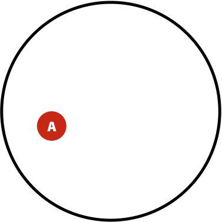
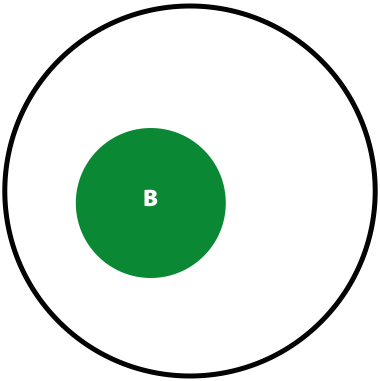
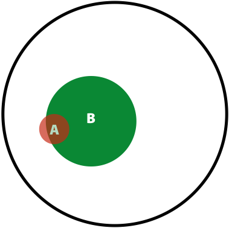
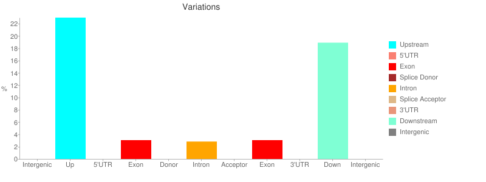
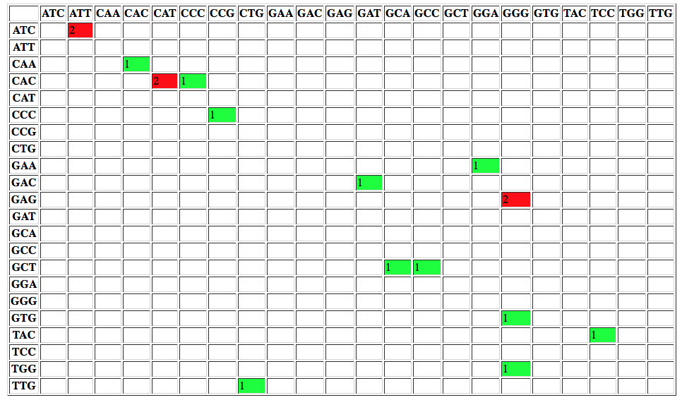
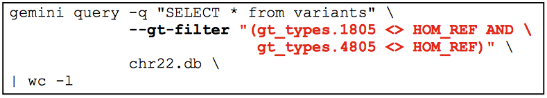
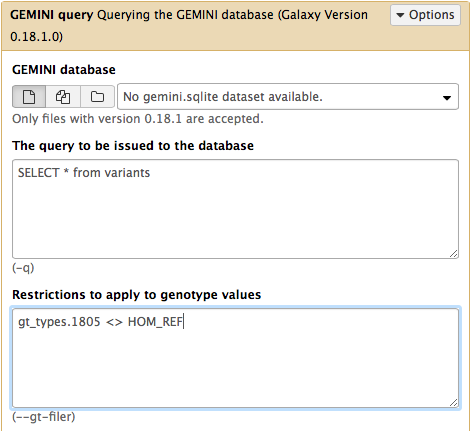

Today we hear a lot about personalized medicine. Yet the *personalization* is defined by the genetic make up of the individual. In this tutorial we will discuss how this information can be uncovered from the genomic sequencing data.

> ### Agenda
>
> In this tutorial, we will deal with:
>
> 1. TOC
> {:toc}
>
{: .agenda}

# Calling variants

Variant calling is a complex field that was significantly propelled by advances in DNA sequencing and efforts of large scientific consortia such as the [1000 Genomes](http://www.1000genomes.org). Here we summarize basic ideas central to Genotype and Variant calling. First, let's contrast the two things although they often go together:

- **Variant calling** - identification of positions where the sequenced sample is different from the reference sequence (or [reference genome graph](https://github.com/vgteam/vg))
- **Genotype calling** - identifying individual's genotype at variable sites.

A typical workflow for variation discovery involves the following steps (e.g., see Nielsen et al. [2011](https://www.ncbi.nlm.nih.gov/pmc/articles/PMC3593722/)):

1. Mapping reads against the reference genome
2. Thresholding BAM datasets by, for example, retaining paired, properly mapped reads
3. Performing quality score recalibration
4. Performing realignment
5. Performing variant calling/genotype assignment
6. Performing filtering and genotype quality score recalibration
7. Annotating variants and performing downstream analyses

However, continuing evolution of variant detection methods has made some of these steps obsolete. For instance, omitting quality score recalibration and re-alignment (steps 3 and 4 above) when using haplotype-aware variant callers such as [FreeBayes](https://github.com/ekg/freebayes) does not have an effect on the resulting calls (see Brad Chapman's methodological comparisons at [bcbio](https://bit.ly/1S9kFJN)). Before going forward with an actual genotype calling in Galaxy let's take a look as some basic ideas behind modern variant callers.

## How does SNP calling and genotyping work?

Consider a set of sequencing reads derived from a diploid individual:

```
REFERENCE: atcatgacggcaGtagcatat
--------------------------------
READ1:     atcatgacggcaGtagcatat
READ2:         tgacggcaGtagcatat
READ3:     atcatgacggcaAtagca
READ4:            cggcaGtagcatat
READ5:     atcatgacggcaGtagc
```

The capitalized position contains a G &#8594; A [transition](https://en.wikipedia.org/wiki/Transition_(genetics)). So, in principle this can be a heterozygous site with two alleles **G** and **A**. A commonly used naïve procedure would define a site as *heterozygous* if there is a non-reference allele with frequency between 20% and 80%. In this case **A** is present in 1/5 or 20% of the cases, so we can say that this is a heterozygous site. Yet it is only represented by a single read and thus is hardly reliable. Here are some of the possibilities that would explain this *variant*. It can be:

- a true variant
- an experimental artifact, e.g. a library preparation error
- a base calling error
- an analysis error, e.g. a misalignment (though unlikely in the above example)

The modern variant callers attempt to assign a reliability estimate for each genotype call. This is done using Bayes reasoning (for a great visual explanation see [blog](https://oscarbonilla.com/2009/05/visualizing-bayes-theorem/) by Oscar Bonilla). Here we present a SNP-relevant "translation" on this explanation (with inspiration from [Erik Garrison](https://github.com/ekg)).

Suppose in a population you have $$A$$ individuals (not to be confused with nucleotide **A**; in this case $$A$$ is a number of individuals) with a variant. You are performing re-sequencing and observe a variant in $$B$$ (again, a number) of your sequencing reads. We want to estimate the probability of having the real polymorphism in the population given our observations in sequencing reads. The logic is as follows:

- The probability of having polymorphism *A* in the population is $$P(A) = \lvert A \rvert / \lvert U \rvert$$
- The probability of seeing a variant given our identification approach (i.e., sequencing) is $$P(B) = \lvert B \rvert / \lvert U \rvert$$

Now, the probability of having a variant and it being observed in our sequencing data is the overlap between $$A$$ and $$B$$ sets: $$P(AB) = \lvert AB \rvert / \lvert U \rvert$$. This is presented graphically below:

| Polymorphisms | Variant Calls | Polymorphisms and Variant Calls |
|:-------------:|:-------------:|:-------------------------------:|
|  |  |  |
| $$P(A)$$ | $$P(B)$$ | $$P(AB)$$ |

Now we can ask the following question: *What is the probability of a having a real polymorphism $$A$$ given our observation of variants in reads $$B$$?* In other words, *what is the probability of $$A$$ given $$B$$?* Or, as stated in the original [blog](https://oscarbonilla.com/2009/05/visualizing-bayes-theorem/): "*given that we are in region $$B$$, what is the probability that we are in the region $$AB$$?*"

$$P(A \vert B) = \frac{\lvert AB \rvert}{\lvert B \rvert}$$

Dividing both numerator and denominator by $$\lvert U \rvert$$:

$$P(A \vert B) = \frac{\frac{\lvert AB \rvert}{\lvert U \rvert}}{\frac{\lvert B \rvert}{\lvert U \rvert}}$$

Because we know that $$P(AB) = \frac{\lvert AB \rvert}{\lvert U \rvert}$$ and $$P(B) = \frac{\lvert B \rvert}{\lvert U \rvert}$$, we can rewrite the equation above as:

$$P(A \vert B) = \frac{P(AB)}{P(B)}$$

Now, let's ask an opposite question. Given a true polymorphism $$A$$, what are the chances that we do detect it (i.e. find ourselves in $$AB$$)? It will be:

$$P(B \vert A) = \frac{P(AB)}{P(A)}$$

So, because we know that $$P(A \vert B) = \frac{P(AB)}{P(B)}$$ and we just reasoned that $$P(B \vert A) = \frac{P(AB)}{P(A)}$$, we can say that $$P(A \vert B)P(B) = P(B \vert A)P(A)$$, leading us to the Bayes formula:

$$P(A \vert B) = \frac{P(B \vert A)P(A)}{P(B)}$$

Translating this into "genomics terms", the probability of having a genotype $$G$$ given sequencing reads $$S$$ is: $$P(G \vert S) = \frac{P(S \vert G)P(G)}{P(S)}$$. Because in a given calculation of $$P(G \vert S)$$ the reads are fixed, we can re-write the Bayes formula in the following way:

$$P(G \vert S) \sim P(S \vert G)P(G)$$

with $$P(S)$$ becoming a constant. This leaves us with the need to estimate two things:

1. $$P(S \vert G)$$, the data likelihood
2. $$P(G)$$, the prior probability for the variant.

In the simplest case we can estimate these as follows:

### $$P(S \vert G)$$

Suppose $$S_i$$ is a base in read $$i$$ corresponding to a genome position with genotype $$G$$. The probability of seeing $$S_i$$ given $$G$$, or $$P(S_i \vert G)$$, is given by the quality score of $$S_i$$ (the quality scores are given by base calling software and reported as [phred scores](https://en.wikipedia.org/wiki/Phred_quality_score)). Thus the genotype likelihood $$P(S \vert G)$$ is the product of $$P(S_i \vert G)$$ over all $$i$$. In reality however there are many other sources of uncertainty (in addition to base qualities) that are incorporated in the calculation of data likelihoods including NGS technology-related issues, dependency of error rates on substitution type (e.g., transitions versus transversions), sequencing context etc...

### $$P(G)$$ - a single sample case

One can assign an equal probability to all possible genotypes, or to source this information based on previously obtained knowledge containing in a database, such as [dbSNP](https://www.ncbi.nlm.nih.gov/SNP/). In this case (as exemplified in [Nielsen et al. 2011](https://www.ncbi.nlm.nih.gov/pmc/articles/PMC3593722/)) we may, for instance, have a site with a **G/T** polymorphism and genotypes **GG**, **TT**, and **GT** having frequencies of 0.45, 0.45, 0.09, respectively. We will use these values as priors.

### $$P(G)$$ - a multi-sample case

Genotype calling reliability can be significantly improved when analyzing multiple samples jointly. In this case genotype frequencies can be inferred from allele frequencies using Hardy-Weinberg equilibrium ([HWE](https://en.wikipedia.org/wiki/Hardy%E2%80%93Weinberg_principle)). The following example (again from [Nielsen et al. 2011](https://www.ncbi.nlm.nih.gov/pmc/articles/PMC3593722/)) illustrates this idea: suppose you are calling genotypes for a single individual using a combination of multiple samples. There are two genotypes, **AT** and **AA**, with equally large genotype likelihoods. If, however, in our collection of multiple samples the frequency of **A** is 1% ($$p = 0.01$$; $$q = 1 - p = 0.99$$), then from the HWE we have:

| **AA** ($$p^2$$) | **AT** ($$2pq$$) | **TT** ($$q^2$$) |
|---------|---------|--------|
| 0.0001 | 0.0198 | 0.9801 |

This makes it highly unlikely that **AA** is a true genotype of this individual.

## Calling with FreeBayes

[FreeBayes](https://github.com/ekg/freebayes) is an open source variant caller that has been battle-tested by the 1000 Genomes community and is extensively used today (also see [bcbio](https://bcbio.wordpress.com/)). It has a number of features that simplify variant discovery workflows. These include (from FreeBayes github page):

- **Indel realignment is accomplished internally** using a read-independent method, and issues resulting from discordant alignments are dramatically reduced through the direct detection of haplotypes
- **The need for base quality recalibration is avoided** through the direct detection of haplotypes. Sequencing platform errors tend to cluster (e.g. at the ends of reads), and generate unique, non-repeating haplotypes at a given locus
- **Variant quality recalibration is avoided** by incorporating a number of metrics, such as read placement bias and allele balance, directly into the Bayesian model
- **Ability to incorporate non-diploid cases** such as pooled datasets or data from polyploid samples.

Freebayes is a *haplotype-based* variant caller. This implies that instead of looking at an individual positions within an alignment of reads to the reference genome, it looks at a haplotype window, length of which is dynamically determined (see section 3.2. in [FreeBayes manuscript](https://arxiv.org/pdf/1207.3907v2.pdf)):

 stretch is misaligned. As a result looking at individual positions will result in calling multiple spurious varians. In the case of FreeBayes looking at a haplotype identifies two alleles (this is a diploid example) A(7) and A(6), while A(8) is likely an error. Image by Erik Garrison")

### The data

In this example we will perform variant calling and annotation using [genome in the bottle data](https://jimb.stanford.edu/giab/). Specifically, we will use Ashkenazim Father-Mother-Son trio data from the Personal Genome Project:

- HG002 - NA24385 - huAA53E0 (son)
- HG003 - NA24149 - hu6E4515 (father)
- HG004 - NA24143 - hu8E87A9 (mother)

Yet for a quick tutorial these datasets are way too big, so we created a [downsampled dataset](https://doi.org/10.5281/zenodo.60520). This dataset was produced by mapping the trio reads against the `hg19` version of the human genome, merging the resulting bam files together (we use readgroups to label individual reads so they can be traced to each of the original individuals), and restricting alignments to a small portion of chromosome 19 containing the [*POLRMT*](https://www.ncbi.nlm.nih.gov/gene?cmd=Retrieve&dopt=Graphics&list_uids=5442) gene.

> ###  Hands-on: Data upload
>
> 1. Create a new history for this variant calling exercise
> 2. Import the files named `GIAB-Ashkenazim-Trio.txt` (tabular format) and `GIAB-Ashkenazim-Trio-hg19` (BAM format) from [Zenodo](https://doi.org/10.5281/zenodo.60520) or a data library:
> 3. Specify the used genome for mapping:
>     1. Click on the  **pencil icon** for the BAM dataset to edit its attributes
>     2. Select `Human Feb 2009` on **Database/Build**
>     3. Click the **Save** button
{: .hands_on}

### Generating and post-processing FreeBayes calls

> ###  Hands-on: Generating FreeBayes calls
>
> 1. **FreeBayes**  with the following parameters:
>    - *"Choose the source for the reference genome"*: `locally cached`
>    - *"BAM dataset"*: the uploaded `GIAB-Ashkenazim-Trio-hg19` BAM dataset
>    - *"Using reference genome"*: `Human (Homo sapiens): hg19`
>    - *"Choose parameter selection level"*: `5. Full list of options`
>    - *"Algorithmic features"*: `Set algorithmic features`
>    - *"Calculate the marginal probability of genotypes and report as GQ in each sample field in the VCF output"*: `Yes` (This would help us evaluating the quality of genotype calls)
{: .hands_on}

This will produce a dataset in [VCF](http://www.1000genomes.org/wiki/Analysis/variant-call-format) format containing 35 putative variants. Before we can continue, we need to post-process this dataset by breaking compound variants into multiple independent variants.

> ###  Hands-on: Simplify variant representation
>
> 1. **VcfAllelicPrimitives**  with:
>    - *"Select VCF dataset"*: the VCF output of **FreeBayes** 
>    - *"Maintain site and allele-level annotations when decomposing"*: `Yes`
>    - *"Maintain genotype-level annotations when decomposing"*: `Yes`
{: .hands_on}

**VCFAllelicPrimitives** generates a VCF files containing 37 records (the input VCF only contained 35). This is because a multiple nucleotide polymorphism (`TAGG|CAGA`) at position 618851 have been converted to two:

| Before | After |
|--------|---------|
| `chr19 618851 . TAGG CAGA 81.7546` | `chr19 618851 . T C 81.7546`<br>`chr19 618854 . G A 81.7546` |

# Annotating variants with SnpEff

At this point we are ready to begin annotating variants using [**SnpEff**](http://snpeff.sourceforge.net/SnpEff.html). SnpEff "*...annotates and predicts the effects of variants on genes (such as amino acid changes)...*" and so is critical for functional interpretation of variation data.

> ###  Annotating variants
> 1. **SnpEff** (Variant effect and annotation)  with:
>    - *"Sequence changes (SNPs, MNPs, InDels)"*: the VCF output of **VcfAllelicPrimitives** 
>    - *"Genome source"*: `Locally installed reference genome`
>    - *"Genome"*: `Homo sapiens: hg19`
{: .hands_on}

SnpEff will generate two outputs:

1. an annotated VCF file
2. an HTML report

The report contains a number of useful metrics such as distribution of variants across gene features:



or changes to codons:



# Manipulating variation data with GEMINI

Now that we have an annotated VCF file it is time to peek inside our variation data. [Aaron Quinlan](http://quinlanlab.org/), creator of [GEMINI](http://gemini.readthedocs.org/en/latest/index.html), calls it *Detective work*.

## Loading data into GEMINI

The first step is to convert a VCF file we would like to analyze into a GEMINI database. For this we will use **GEMINI Load** tool. GEMINI takes as input a VCF file and a [PED](https://www.cog-genomics.org/plink2/formats#ped) file describing the relationship between samples. In our case the PED file looks like this (second imported file):

| #family_id | sample_id | paternal_id | maternal_id | sex | phenotype | ethnicity |
|------------|-----------|-------------|-------------|-----|-----------|-----------|
| family1 | HG004_NA24143_mother | -9 | -9 | 2 | 1 | CEU |
| family1 | HG003_NA24149_father | -9 | -9 | 1 | 1 | CEU |
| family1 | HG002_NA24385_son | HG003_NA24149_father | HG004_NA24143_mother | 1 | 2 | CEU |
{: .table .table-responsive}

> ###  Hands-on: Loading data into GEMINI
>
> 1. **GEMINI load**  with:
>    - *"VCF file to be loaded in the GEMINI database"*: the VCF output of **SnpEff** 
>    - *"Sample information file in PED+ format"*: the uploaded `GIAB-Ashkenazim-Trio.txt` tabular
>    - *"Choose a gemini annotation database"*: the most recent available release
>
>    This will create an SQLite database in your history.
> 2. Run **GEMINI db_info**  to see the content of the database:
>    - *"GEMINI database"*: the output of **GEMINI load** 
>
>    This produces a list of all database tables and their columns. The latest version of the GEMINI database schema can be found [here](https://gemini.readthedocs.org/en/latest/content/database_schema.html).
{: .hands_on}

## Querying the GEMINI database

The GEMINI database can be queried using the versatile SQL language (more on SQL [here](https://swcarpentry.github.io/sql-novice-survey)). In Galaxy this is done using the **GEMINI query** tool. Within this tool SQL commands are typed directly into the **The query to be issued to the database** text box. Let's begin getting information from some of the tables we discovered using the **GEMINI db_info** tool above.

> ###  Tip: GEMINI tutorials
>
> The examples below are taken from "[Introduction to GEMINI](https://s3.amazonaws.com/gemini-tutorials/Intro-To-Gemini.pdf)" tutorial. For extensive documentation see "[Querying the GEMINI database](https://gemini.readthedocs.org/en/latest/content/querying.html)".
{: .tip}

> ###  Hands-on: Selecting "novel" variants that are not annotated in dbSNP database
>
> 1. **GEMINI query**  with:
>    - *"GEMINI database"*: the output of **GEMINI load** 
>    - *"The query to be issued to the database"*: `SELECT count(*) FROM variants WHERE in_dbsnp == 0`
>
>    As we can see in the output dataset, there are 21 variants that are not annotated in dbSNP.
{: .hands_on}

> ###  Find variants within the POLRMT gene
>
> 1. **GEMINI query**  with:
>    - *"GEMINI database"*: the output of **GEMINI load** 
>    - *"The query to be issued to the database"*: `SELECT rs_ids, aaf_esp_ea, impact, clinvar_disease_name, clinvar_sig FROM variants WHERE filter is NULL and gene = 'POLRMT'`
>
>    Since the `variants` table has a large number of columns, in the query above we had to select only the most interesting columns. The output shows the variants found within the *POLRMT* gene.
{: .hands_on}

## Querying genotypes

GEMINI provides access to genotype, sequencing depth, genotype quality, and genotype likelihoods for each individual (`subjectID`):

- `gt_types.subjectID` - three types of genotype types: `HOM_REF`, `HET`, `HOM_ALT`
- `gt_quals.subjectID` - genotype quality
- `gt_depths.subjectID` - total number of reads in this subject at position
- `gt_ref_depths.subjectID` -  number of reference allele reads in this subject at position
- `gt_alt_depths.subjectID` - number of alternate allele reads in this subject at position

> ###  Questions
>
> 1. At how many sites does child have a non-reference allele?
> 2. At how many sites both father and son have non reference alleles?
> 3. List genotypes for father and son where they have non-reference alleles.
>
> > ###  Solution
> > 1. To answer this question you can run the **GEMINI query**  tool with:
> >    - *"The query to be issued to the database"*: `SELECT * from variants`
> >    - *"Restrictions to apply to genotype values"*: `gt_types.HG002_NA24385_son <> HOM_REF`
> > 2. To answer this question you can run the **GEMINI query**  tool with:
> >    - *"The query to be issued to the database"*: `SELECT * from variants`
> >    - *"Restrictions to apply to genotype values"*: `(gt_types.HG002_NA24385_son <> HOM_REF AND gt_types.HG003_NA24149_father <> HOM_REF)`
> > 3. To answer this question you can run the **GEMINI query**  tool with:
> >    - *"The query to be issued to the database"*: `SELECT gts.HG002_NA24385_son, gts.HG003_NA24149_father from variants`
> >    - *"Restrictions to apply to genotype values"*: `(gt_types.HG002_NA24385_son <> HOM_REF AND gt_types.HG003_NA24149_father <> HOM_REF)`
> {: .solution }
{: .question}

## Using wildcards

Wildcards simply writing SQL expressions when searching across multiple terms. The syntax for genotype filter wildcards is:

```
(COLUMN).(SAMPLE_WILDCARD).(SAMPLE_WILDCARD_RULE).(RULE_ENFORCEMENT)
```

Let's look at some examples.

> ###  Question
>
> At which variants are every sample heterozygous?
>
> > ###  Solution
> >
> > To answer this question you can run the **GEMINI query**  tool with:
> > - *"The query to be issued to the database"*: `SELECT chrom, start, end, ref, alt, gene, impact, (gts).(*) FROM variants`
> > - *"Restrictions to apply to genotype values"*: `(gt_types).(*).(==HET).(all)`
> >
> > Here we use wildcards for the query (`(gts.(*))` means get genotypes for **all** samples) and genotype filtering (`(gt_types).(*).(==HET).(all)`, the [all operator](https://gemini.readthedocs.org/en/latest/content/querying.html#the-all-operator) implies that we want results for **all** affected individuals).
> >
> {: .solution }
{: .question}

## Going further

This short tutorial should give you an overall idea on how generate variant data in Galaxy and process it with GEMINI. Yet there is much more to learn. Below we list GEMINI tutorials and links to Galaxy libraries with relevant data:

| Tutorial | PDF | Galaxy library | Galaxy history |
|:---------|:---:|:--------------:|:--------------:|
| Introduction | [](https://s3.amazonaws.com/gemini-tutorials/Intro-To-Gemini.pdf) | [](https://usegalaxy.org/library/list#folders/F0283ca691a41c352) | []( https://usegalaxy.org/u/aun1/h/gemini-introduction) |
| Identifying *de novo* mutations underlying Mendelian disease | [](https://s3.amazonaws.com/gemini-tutorials/Gemini-DeNovo-Tutorial.pdf) | [](https://usegalaxy.org/library/list#folders/F775008f45cbbf010) | []( https://usegalaxy.org/u/aun1/h/gemini-de-novo-mutations) |
| Identifying autosomal recessive variants underlying Mendelian disease | [](https://s3.amazonaws.com/gemini-tutorials/Gemini-Recessive-Tutorial.pdf) | [](https://usegalaxy.org/library/list#folders/F35b262f5ac8aa63a) | [](https://usegalaxy.org/u/aun1/h/gemini-autosomal-recessive) |
| Identifying autosomal dominant variants underlying Mendelian disease | [](https://s3.amazonaws.com/gemini-tutorials/Gemini-Dominant-Tutorial.pdf) | [](https://usegalaxy.org/library/list#folders/F1c4722ad56892a31) | []( https://usegalaxy.org/u/aun1/h/gemini-autosomal-dominant ) |

### How to use these tutorials?

* Right click on the **PDF**  icon and open tutorial in a new browser tab
* Right click on **Galaxy history**  icon and open Galaxy history in another new browser tab
* When the Galaxy history interface opens, you will need to click the **Import history** link highlighted with a red outline in the following figure:

  

* If you have a wide screen arrange browsers tabs side by side:

  

* Proceed with the tutorial. For example, to repeat the following command from GEMINI tutorial:

  

  use Galaxy's **GEMINI query** tool as below:

  

* and so on....
