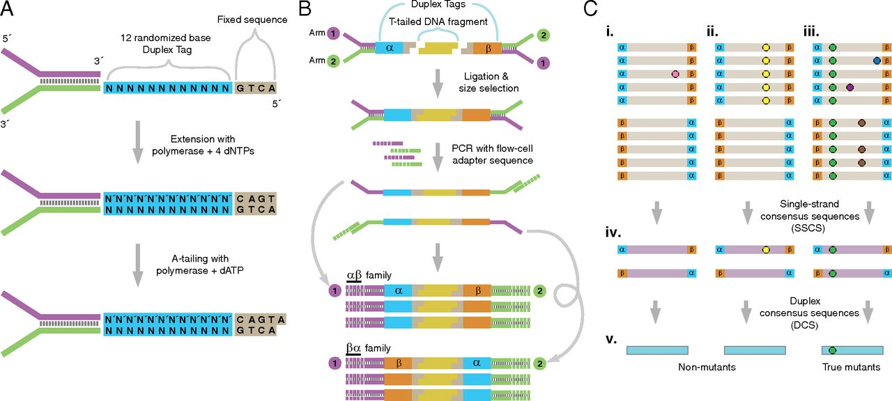
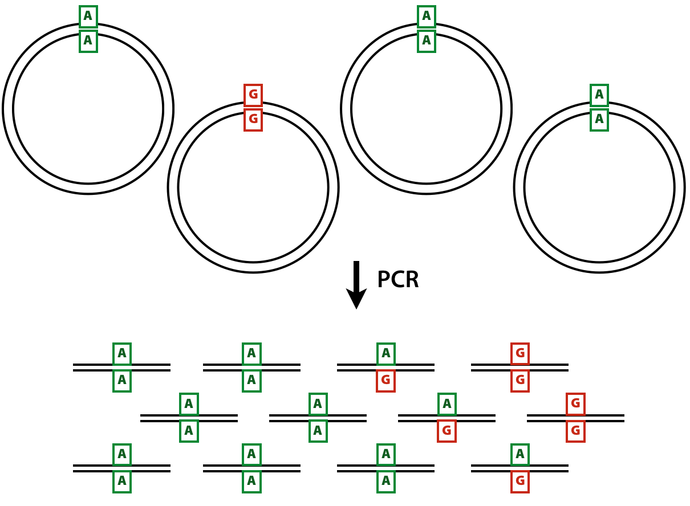
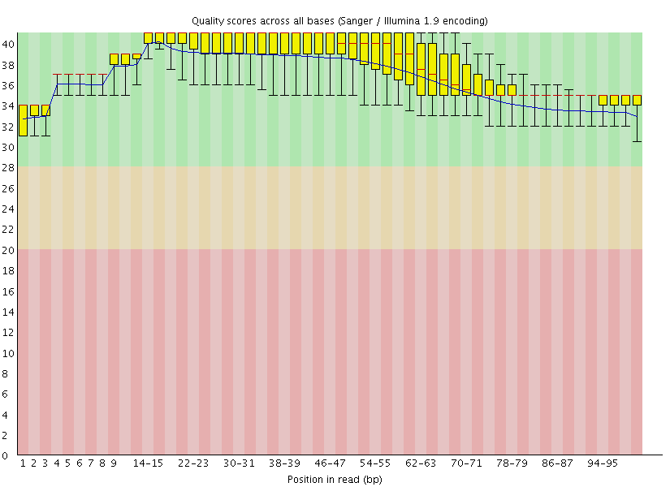
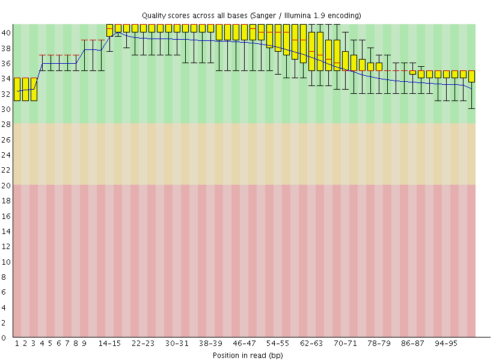
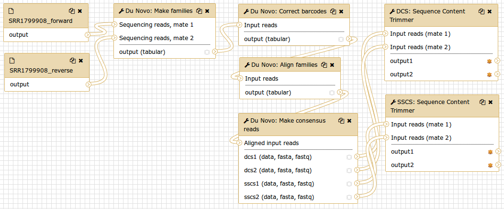
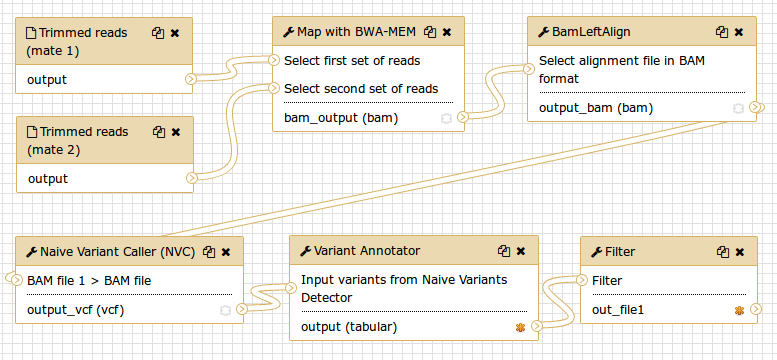

# Introduction

This page explains how to perform discovery of low frequency variants from duplex sequencing data. As an example we use the *ABL1* dataset published by [Schmitt and colleagues](https://www.ncbi.nlm.nih.gov/pubmed/25849638) (SRA accession [SRR1799908](https://www.ncbi.nlm.nih.gov/sra/?term=SRR1799908)).

> ### Agenda
>
> 1. TOC
> {:toc}
>
{: .agenda}

## Background

### Finding rare variants

Most popular variant callers focus on the common case of sequencing a diploid individual to find heterozygous and homozygous variants. This is a well-studied problem with its own challenges, but at least you can expect your variants to be present in either 100%, 50%, or 0% of your sample DNA. If you observe a variant present in 99%, 56%, or 2% of the reads at a site, you can probably assume the allele is actually present at 100%, 50%, or 0%, respectively, in your sample.

But in this tutorial, we're looking for **rare variants**. So our true frequency might actually be 13%, 1%, or even 0.4%. The challenge then becomes distinguishing these situations from sequencing errors. Next-generation sequencers produce noise at this level, making it challenging to make this distinction in data produced with standard resequencing methods.

### Duplex sequencing

[Duplex sequencing](http://www.pnas.org/content/109/36/14508.short) is a method that addresses the problem of distinguishing sequencing signal from noise. It can increase sequencing accuracy by over four orders of magnitude. Duplex sequencing uses randomly generated oligomers to uniquely tag each fragment in a sample after random shearing. The tagged fragments are then PCR amplified prior to sequencing, so that many reads can be obtained from each original molecule. The tags in each read can then be used to identify which original fragment the read came from. Identifying multiple reads from each fragment allows building a consensus of the original sequence of the fragment, eliminating errors.

The key to duplex sequencing, as opposed to other types of consensus-based methods ([review here](https://www.nature.com/articles/nrg.2017.117)), is that both ends of the original fragment are tagged such that its strands can be distinguished. Knowing which strand each read comes from allows us to recognize errors even in the first round of PCR.

Processing the raw reads into consensus sequences consists of four main steps:
1. Group reads by their tags.
2. Align reads in the same tag group.
3. Build single-strand consensus sequences (**SSCS**) of reads coming from the same original strand.
4. Build duplex consensus sequences (**DCS**) from pairs of SSCS.

Du Novo is a tool which can carry out these steps. Unlike most other such tools, it can do so without the use of a reference sequence, and it can correct for errors in the tags which can contribute to data loss.

> ###  Tip: Terminology
>
> Du Novo processes the tags from each fragment by concatenating them into a single **barcode**.
>
> - For a standard protocol with two 12bp tags, this results in a 24bp barcode which identifies each family.
>
{: .tip}

[Schmitt *et al.* 2012](http://www.pnas.org/content/109/36/14508.short) provides this overview of the whole method:

**Figure 1:** The logic of duplex sequencing. The computational process is shown in part **C**.

### The value of single-strand consensus sequences

The DCSs have the ultimate accuracy, yet the SSCSs can also be very useful when ampliconic DNA is used as an input to a duplex experiment. Let us illustrate the utility of SSCSs with the following example. Suppose one is interested in quantifying variants in a virus that has a very low titer in body fluids. Since the duplex procedure requires a substantial amount of starting DNA (between [between 0.2 and 3 micrograms](https://www.ncbi.nlm.nih.gov/pmc/articles/PMC4271547/)) the virus needs to be enriched. This can be done, for example, with a PCR designed to amplify the entire genome of the virus. Yet the problem is that during the amplification heterologous strands will almost certainly realign to some extent forming heteroduplex molecules:

{:height="444px" width="605px"}

**Figure 2:** Heteroduplex formation in ampliconic templates. Image by Barbara Arbeithuber from [Stoler *et al.* 2016](https://genomebiology.biomedcentral.com/articles/10.1186/s13059-016-1039-4). Here there are two distinct types of viral genomes: carrying `A` and `G`. Because the population of genomes is enriched via PCR, heteroduplex formation takes place, skewing frequency estimates performed using DCSs.

In the image above there are two alleles: green (`A`) and red (`G`). After PCR a fraction of molecules are in heteroduplex state. If this PCR-derived DNA is now used as the starting material for a DS experiment, the heteroduplex molecules will manifest themselves as having an `N` base at this site (because Du Novo interprets disagreements as `N`s during consensus generation). So, DSCs produced from this dataset will have `A`, `G`, and `N` at the polymorphic site. Yet, SSCSs will only have `A` and `G`. Thus SSCS will give a more accurate estimate of the allele frequency at this site in this particular case. In Du Novo SSCSs are generated when the  *Output single-strand consensus sequences* option of  **Du Novo: Make consensus reads** tool is set to `Yes` (see [below](#making-consensus-sequences)).

## How to use this tutorial

The entire analysis described here is accessible as a [Galaxy history](https://usegalaxy.org/u/nstoler/h/du-novo-gtn-tutorial) that you can copy and play with.

> ###  Tip: Running the tools
> * Leave all parameters on their default settings, unless instructed otherwise.
>   > ###  Helping Du Novo
>   > But if you'd like to help improve Du Novo, consider checking `Yes` under  *Send usage data*.
>   {: .comment}
{: .tip}

This analysis can be divided into three parts:
 1. [Generating consensus sequences](#generating-consensus-sequences)
 2. [Calling variants with duplex consensus sequences](#calling-variants-with-duplex-consensus-sequences)
 3. [Calling variants with single strand consensus sequences](#calling-variants-with-single-strand-consensus-sequences)

Here are the steps, displayed as the Galaxy history you'll end up with if you follow the instructions:
- Note: Galaxy histories show the first step at the bottom!

**Figure 3:** Analysis outline

# Generating consensus sequences

The starting point of the analysis is sequencing reads (in [FASTQ](https://en.wikipedia.org/wiki/FASTQ_format) format) produced from a duplex sequencing library.

## Getting data in and assessing quality

We uploaded the [Schmitt *et al.* 2015](https://www.ncbi.nlm.nih.gov/pmc/articles/PMC4414912/) data directly from SRA as shown in [this screencast](https://vimeo.com/121187220).

> ###  Hands-on: Importing the raw data
>
> You can obtain the reads from this dataset by copying [this history](https://usegalaxy.org/u/nstoler/h/srr1799908---schmitt-2015).
> 1. Make sure you're logged into [Galaxy](https://usegalaxy.org).
> 2. Go to [the history](https://usegalaxy.org/u/nstoler/h/srr1799908---schmitt-2015).
> 3. Click on **Import history** in the upper right.
>
> Or, if you'd like to use a different Galaxy instance, you can import it:
> 1. Click on the gear icon at the top of the **History** pane.
> 2. Click on "Import from File" at the bottom of the menu.
> 3. Enter this link in the box under **Archived History URL**:
> `https://usegalaxy.org/history/export_archive?id=7ac09d1db287dbba`
{: .hands_on}

This created two datasets in our galaxy history: one for forward reads and one for reverse. We then evaluated the quality of the data by running FastQC on both datasets (forward and reverse). You can read about using  **FastQC** [here]({{ site.baseurl }}/topics/sequence-analysis/tutorials/quality-control/tutorial.html#assess-the-read-quality).

This gave us the following plots:

 | 

**Figure 4:** FastQC assessment of the quality of the raw reads. **Left:** Forward reads. **Right:** Reverse reads.

One can see that these data are of excellent quality and no additional processing is required before we can start the actual analysis.

## Processing reads into duplex consensus sequences with Du Novo

Now we are ready to collapse the raw reads into duplex consensus sequences.

> ###  Tip: Finding Du Novo
> * The tools in this portion of the tutorial can all be found in the **NGS: Du Novo** section.
{: .tip}

### Sorting reads into families

The  **Du Novo: Make families** tool will separate the 12bp tags from each read pair and concatenate them into a 24bp barcode. Then it will use the barcodes to sort the reads into families that all descend from the same original fragment.

> ###  Hands-on: Sorting reads into families
>
> Run  **Du Novo: Make families** with the following parameters:
>  -  *Sequencing reads, mate 1*: `1: SRR1799908_forward`
>  -  *Sequencing reads, mate 2*: `2: SRR1799908_reverse`
>  -  *Tag length*: `12`
>
> Output: `7: Du Novo: Make families on data 2 and data 1`
{: .hands_on}

### Correcting barcodes

The grouping reads based on barcode relies on exact barcode matches. Any PCR or sequencing error in the barcode sequence will prevent the affected reads from being joined with their other family members.

Du Novo includes a tool which can correct most of these errors and recover the affected reads. This can increase the final yield of duplex consensus reads by up to 11% (Stoler *et al.* 2018, in preparation).

> ###  Hands-on: Correcting barcodes
>
> Run  **Du Novo: Correct barcodes** with the following parameters:
>  -  *Input reads*: `7: Du Novo: Make families on data 2 and data 1`
>  -  *Maximum differences*: `3`
>
> Output: `8: Du Novo: Correct barcodes on data 7`
{: .hands_on}

### Aligning families

After grouping reads that came from the same original fragment, we need to align them with each other. This next tool will perform a multiple sequence alignment on each family.

> ###  Tip: Analysis bottleneck
> This is by far the most time-consuming step.
>
> On this dataset, it took 2 hours to complete when run on [Galaxy Main](https://usegalaxy.org/).
> - At the time, Galaxy allocated 6 cores to the job.
{: .tip}

> ###  Hands-on: Aligning families
>
> Run  **Du Novo: Align families** with the following parameters:
>  -  *Input reads*: `8: Du Novo: Correct barcodes on data 7`
>  -  *Multiple sequence aligner*: `Kalign2`
>
> Output: `9: Du Novo: Align families on data 8`
{: .hands_on}

### Making consensus sequences

Now, we need to collapse the aligned reads into consensus sequences. This next tool will process each group of aligned reads that came from the same single-stranded family into a consensus. Then it will align the consensus sequences from the two strands of each original molecule, and call a consensus between them.

Normally, the tool only produces the final double-stranded consensus sequences. But we will make use of the single-stranded consensus sequences [later](#calling-variants-with-single-strand-consensus-sequences), so we'll tell it to keep those as well.

> ###  Hands-on: Making consensus sequences
>
> Run  **Du Novo: Make consensus reads** with the following parameters:
>  -  *Aligned input reads*: `9: Du Novo: Align families on data 8`
>  -  *Minimum reads for a consensus sequence*: `3`
>  -  *Consensus % threshold*: `0.7`
>  -  *Output format*: `FASTQ`
>  -  *Output single-strand consensus sequences as well*: `Yes`
>
> Outputs:
>  - `10: Du Novo: Make consensus reads on data 9 (mate 1)`
>  - `11: Du Novo: Make consensus reads on data 9 (mate 2)`
>  - `12: Du Novo: Make consensus reads on data 9 (SSCS mate 1)`
>  - `13: Du Novo: Make consensus reads on data 9 (SSCS mate 2)`
{: .hands_on}

> ###  Tip: Setting output formats
>
> You may have to set the datatype of the outputs from  **Du Novo: Make consensus reads** tool.
>
> Versions below 2.16 only set the datatype to `fastq`, not the more specific `fastqsanger`. Many tools (like  **Map with BWA-MEM**) won't accept FASTQ input without it specifying what subtype it is.
>
> 1. In your history, click on the pencil icon next to the dataset name.
> 2. Click on the **Datatypes** tab.
> 3. In the **Change datatype** pane, click on the dropdown where it says `fastq`.
> 4. Enter `fastqsanger`, then click the **Change datatype** button in the upper right of the pane.
{: .tip}

> ###  Where do the FASTQ quality scores come from?
>
> There is no easy way to assign a PHRED score to a consensus base derived from many duplex reads.
>
> So Du Novo does not attempt to give a meaningful score. It assigns the same arbitrary score to all bases.
> - It produces FASTQ for compatibility, but the output contains no more information than a FASTA file.
>
> You may have noticed the  *Output PHRED score* parameter in the  **Du Novo: Make consensus reads** tool. This allows you to specify which score to assign to (all) the bases.
>
{: .details}

## Filtering consensuses

You may have realized that when calling a "consensus" between two sequences, if the two disagree on a base, there's no way to know which is correct. So in these situations, Du Novo uses the [IUPAC ambiguity letter](https://en.wikipedia.org/wiki/Nucleic_acid_notation) for the two different bases (e.g. `W` = `A` or `T`). Also, when calling single-stranded consensus sequences, if there aren't enough high-quality bases to call a position (in the [above hands-on](#hands_on-hands-on-making-consensus-sequences), we set this threshold to 70%), it gives an `N`.

This information could be useful for some analyses, but not for our variant calling. The tool  **Sequence Content Trimmer** will help with filtering these out. With the settings below, it will move along the read, tracking the frequency of ambiguous (non-ACGT) bases in a 10bp window. If it sees more than 2 ambiguous bases in a window, it will remove the rest of the read, starting with the first offending base in the window. We'll also tell it to remove entirely any read pair containing a read that got trimmed to less than 50bp.

> ###  Hands-on: Filtering the consensus sequences
>
> Run  **Sequence Content Trimmer** with the following parameters:
>  -  *Paired reads?*: `Paired`
>  -  *Input reads (mate 1)*: `10: Du Novo: Make consensus reads on data 9 (mate 1)`
>  -  *Input reads (mate 2)*: `11: Du Novo: Make consensus reads on data 9 (mate 2)`
>  -  *Bases to filter on*: `ACGT`
>  -  *Frequency threshold*: `0.2`
>  -  *Size of the window*: `10`
>  -  *Invert filter bases*: `Yes`
>  -  *Set a minimum read length*: `Yes`
>  -  *Minimum read length*: `50`
>
> Outputs:
>  - `14: Sequence Content Trimmer on data 10 and data 11`
>  - `15: Sequence Content Trimmer on data 10 and data 11`
{: .hands_on}

# Calling variants with duplex consensus sequences

At this point we have trimmed DCSs. We can now proceed to call variants. This involves aligning the variants against the reference genome, then counting variants.

We're not specifically interested in the reference sequence, since all we care about is sequence content of the consensus reads. But we'll be using the reference sequence to figure out where all the reads come from. This lets us stack them on top of each other, with equivalent bases lined up in columns. Then we can step through each column, count how many times we see each base, and and compile a list of variants.

## Mapping the reads

### Align against the genome with BWA-MEM

Here, we'll use  **Map with BWA-MEM** to map the DCS reads to the human reference genome.

> ###  Hands-on: Align with BWA-MEM
>
> Run  **Map with BWA-MEM** with the following parameters:
>  -  *Using reference genome?*: `Human (Homo sapiens) (b38): hg38`
>  -  *Select first set of reads*: `14: Sequence Content Trimmer on data 10 and data 11`
>  -  *Select second set of reads*: `15: Sequence Content Trimmer on data 10 and data 11`
>
> Output: `16: Map with BWA-MEM on data 15 and data 14 (mapped reads in BAM format)`
{: .hands_on}

### Left Aligning indels

To normalize the positional distribution of indels we use the  **BamLeftAlign** utility from the [FreeBayes](https://github.com/ekg/freebayes#indels) package. You can find it in the **NGS: Variant Analysis** section. This is necessary to avoid erroneous polymorphisms flanking regions with indels (e.g., in low complexity loci):

> ###  Hands-on: Left-align indels
>
> Run  **BamLeftAlign** with the following parameters:
>  -  *Select alignment file in BAM format*: `16: Map with BWA-MEM on data 15 and data 14 (mapped reads in BAM format)`
>  -  *Using reference genome*: `Human (Homo sapiens): hg38`
>    - The same genome we aligned to.
>
> Output: `17: BamLeftAlign on data 16 (alignments)`
{: .hands_on}

## Calling the variants

Now we'll use our aligned consensus reads to find variants.

Normally, in a diploid resequencing experiment, you would call variants relative to the reference. So, you'd report sites which are different from the reference (and whether they're hetero- or homozygous).

In our case, we're interested in *rare* variants. So what we'll report is the sites where there is more than one allele, and what the frequency is of the less-common allele (the **minor allele**). This has the potential to include every small sequencing error (even though we're using duplex, there still are errors). So to reduce the noise, we'll set a lower threshold at 1% minor allele frequency (**MAF**).

### Finding variants in the alignment

To identify sites containing variants we use the  **Naive Variant Caller (NVC)** tool from the **NGS: Variant Analysis** section. This reads the alignment and counts the number of bases of each type at each site.

> ###  Hands-on: Count the variants
>
> Run  **Naive Variant Caller (NVC)** with the following parameters:
>  -  *BAM file*: `17: BamLeftAlign on data 16 (alignments)`
>  -  *Using reference genome*: `hg38`
>    - The same genome we aligned to.
>  -  *Insert Restrict to regions*: Click to add a region.
>  -  *Chromosome*: `chr9`
>    - *ABL1* is on chr9. Restricting it to this region saves some processing time.
>  -  *Minimum base quality*: `0`
     - In our case, base quality [isn't meaningful](#details-where-do-the-fastq-quality-scores-come-from), so we set the threshold to 0.
>  -  *Minimum mapping quality*: `20`
>  -  *Ploidy*: `1`
>    - Ploidy is irrelevant here as it is a mixture of multiple genomes.
>
> Output: `18: Naive Variant Caller (NVC) on data 17`
{: .hands_on}

The  **Naive Variant Caller (NVC)** generates a [VCF](https://en.wikipedia.org/wiki/Variant_Call_Format) file that can be viewed at genome browsers such as [IGV](https://www.broadinstitute.org/igv/). Yet one rarely finds variants by looking at genome browsers. We'll want to use tools to search for variants that fit our criteria.

### Finding minor alleles

Now we'll want to parse the VCF produced by the NVC, determine what the major and minor allele is at each site, and calculate their frequencies. The  **Variant Annotator** from the **NGS: Variant Analysis** section can do this.

> ###  Hands-on: Read the variants file
>
> Run  **Variant Annotator** with the following parameters:
>  -  *Input variants from Naive Variants Detector*: `18: Naive Variant Caller (NVC) on data 17`
>  -  *Minor allele frequency threshold*: `0`
>  -  *Coverage threshold*: `10`
>  -  *Output stranded base counts*: `Yes`
>    - To be able to filter for strand bias.
>
> Output: `19: Variant Annotator on data 18`
{: .hands_on}

### Filtering out the noise

Now we have a file containing the base counts for every site covered by at least 10 reads. We'd like to filter through this data to find sites with a reasonable chance of being a real variant, not sequencing error.

The  **Variant Annotator** produces a simple tab-delimited file, with one site per line. We can use the  **Filter** tool from the **Filter and Sort** section to process this kind of file. We'll use the filter `c16 >= 0.01` to remove lines where the value in column 16 is less than 0.01. Column 16 contains the minor allele frequency, so this will remove all sites with a MAF less than 1%.

> ###  Hands-on: Filter the raw variants list
>
> Run  **Filter** with the following parameters:
>  -  *Filter*: `19: Variant Annotator on data 18`
>  -  *With following condition*: `c16 >= 0.01`
>  -  *Number of header lines to skip*: `1`
>
> Output: `20: Filter on data 19`
{: .hands_on}

## Results

Now we're down to just two sites:

Position (chr9)| Major allele | Minor allele |    MAF    |
   Column 3    |  Column 14   | Column 15    | Column 16 |
|:-------------|:------------:|:------------:|:---------:|
  130,872,141  |      G       |      A       |  0.01259  |
  130,880,141  |      A       |      G       |  0.47764  |

The polymorphism we are interested in (and the one reported by [Schmitt *et al.* 2015](https://www.ncbi.nlm.nih.gov/pmc/articles/PMC4414912/)) is at the position 130,872,141 and has a frequency of 1.3%. The other site (position 130,880,141) is a known common variant [rs2227985](https://www.ncbi.nlm.nih.gov/SNP/snp_ref.cgi?type=rs&rs=rs2227985), which is heterozygous in this sample.

# Calling variants with single strand consensus sequences

Analysis of SSCS data follows the exact same trajectory:

* [Filtering consensuses](#filtering-consensuses)
* [Mapping the reads](#mapping-the-reads)
 	- [Aligning against genome](#align-against-the-genome-with-bwa-mem)
 	- [Left aligning indels](#left-aligning-indels)
* [Calling the variants](#calling-the-variants)

> ###  Tip: Re-running with the same settings
>
> There's a shortcut to avoid setting every parameter the second time you run a tool.
>
> 1. In your history, click on an output of the first run to expand it.
> 2. Click on the button with the circular "re-run" arrows.
> 3. Now the parameters will all be the same as the last run. All you have to do is change the input file(s).
{: .tip}

## Re-running analyses with workflows

Instead of manually re-running all the tools in the variant calling section, you can use a **workflow** to automatically run the same tools, but on the SSCS reads. Workflows let you run a chain of tools on different input data with a single click of a button. You can find more information on using workflows [here](../../../introduction/tutorials/galaxy-intro-101/tutorial.html#run-workflow-on-different-data).

We've prepared two workflows which split the above analysis into two steps:

1. [Using Du Novo](https://usegalaxy.org/u/nstoler/w/du-novo-gtn-tutorial) to create consensus sequencs from raw reads.
  - This will generate trimmed DCS and SSCS files from raw sequencing data.
  - This does not include the FastQC step. You should always run FastQC on your raw reads first, to check the quality of your sequencing run before proceeding with the analysis.
2. [Calling variants](https://usegalaxy.org/u/nstoler/w/copy-of-du-novo-gtn-tutorial) from consensus sequences.
  - This takes a pair of FASTQ files and calls variants using them.
  - If you'd like variants from both DCS and SSCS, you'll have to run this twice, once on each.
  - **N.B.** Remember that this workflow is designed for the above *ABL1* analysis. If you want to use it for any other dataset, you'll have to change the relevant options.

You can use the variant calling workflow to call variants using the SSCS instead of the DCS.

> ###  Helping Du Novo
> The  *Send usage data* option is left off in the above workflows.
> - We want to make sure you only share data knowingly.
>
> But again, if you'd like to help improve Du Novo, consider turning it on.
{: .comment}

**Workflow: Making consensus sequences**

**Workflow: Variant calling**

# Conclusion

You should now understand duplex sequencing, rare variants, and be able to process the former to find the latter.

### If things don't work...
...you need to complain. Use [Galaxy's Help Channel](https://help.galaxyproject.org/) to do this.
