This page explains how to perform discovery of low frequency variants from duplex sequencing data. As an example we use the _ABL1_ dataset published by [Schmitt and colleagues](https://www.ncbi.nlm.nih.gov/pubmed/25849638) (SRA accession [SRR1799908](https://www.ncbi.nlm.nih.gov/sra/?term=SRR1799908)).

# Background

Calling low frequency variants from next generation sequencing (NGS) data is challenging due to significant amount of noise characteristic of these technologies. [Duplex sequencing](http://www.pnas.org/content/109/36/14508.short) (DS) was designed to address this problem by increasing sequencing accuracy by over four orders of magnitude. DS uses randomly generated barcodes to uniquely tag each molecule in a sample. The tagged fragments are then PCR amplified prior to the preparation of a sequencing library, creating fragment families characterized by unique combination of barcodes at both 5’ and 3’ ends:

>
>
>The logic of duplex sequencing. From [Schmitt:2012](http://www.pnas.org/content/109/36/14508.short).

The computational analysis of DS data (Part `C` in the figure above) produces two kinds of output:

* Single Strand Consensus Sequences (SSCS; panel `iv` in the figure above);
* Duplex Consensus Sequences (DCS; panel `v` in the figure above).

The DCSs have the ultimate accuracy, yet the SSCSs can also be very useful when ampliconic DNA is used as an input to a DS experiment. Let us illustrate the utility of SSCSs with the following example. Suppose one is interested in quantifying variants in a virus that has a very low titer in body fluids. Since DS procedure requires a substantial amount of starting DNA (between [between 0.2 and 3 micrograms](https://www.ncbi.nlm.nih.gov/pmc/articles/PMC4271547/)) the virus needs to be enriched. This can be done, for example, with a PCR designed to amplify the entire genome of the virus. Yet the problem is that during the amplification heterologous strands will almost certainly realign to some extent forming hetoroduplex molecules:

>
>
>Heteroduplex formation in ampliconic templates. Image by Barbara Arbeithuber from [Stoler:2016](https://genomebiology.biomedcentral.com/articles/10.1186/s13059-016-1039-4). Here there are two distinct types of viral genomes: carrying `A` and `G`. Because the population of genomes is enriched via PCR, heteroduplex formation takes place, skewing frequency estimates performed using DCSs.

In the image above there are two alleles: green (A) and red (G). After PCR a fraction of molecules are in heteroduplex state. If this PCR-derived DNA is now used as the starting material for a DS experiment, the heteroduplex molecules will manifest themselves as having an `N` base at this site (because _Du Novo_ interprets disagreements as `N`s during consensus generation). So, DSCs produced from this dataset will have `A`, `G`, and `N` at the polymorphic site. Yet, SSCSs will only have `A` and `G`. Thus SSCS will give a more accurate estimate of the allele frequency at this site in this particular case. In _Du Novo_ SSCSs are generated when the **Output single-strand consensus sequences** option of **Du Novo: Make consensus reads** tool is set to `Yes` (see [here](#generating-duplex-consensus-sequences-dcs)).

## How to use this tutorial

The entire analysis described here is accessible as a [Galaxy history](https://usegalaxy.org/u/aun1/h/duplex-analysis-abl1) (by clicking on this link you can create your own copy and play with it).

This analysis (and consequently the Galaxy's history) can be divided into three parts
 1. Consensus generation from initial sequencing reads;
 2. Analysis of Duplex Consensus Sequences (DCS);
 3. Analysis of Single Strand Consensus Sequences (SSCS):

>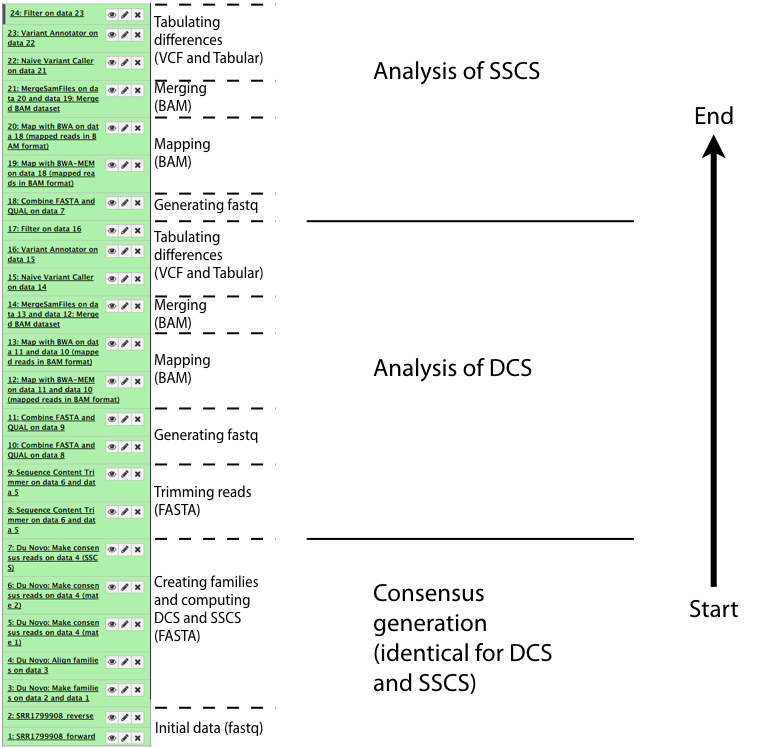
>
>Analysis outline

# Start: Generating consensus sequences

The starting point of the analyses are sequencing reads (usually in [fastq](https://en.wikipedia.org/wiki/FASTQ_format) format) produced from a duplex sequencing library.  

## Getting data in and assessing quality

We uploaded [Schmitt:2015](https://www.ncbi.nlm.nih.gov/pmc/articles/PMC4414912/)) data directly from SRA as shown in [this screencast](https://vimeo.com/121187220). This created two datasets in our galaxy history: one for forward reads and one for reverse. We then evaluated the quality of the data by running FastQC on both datasets (forward and reverse) to obtain the following plots:

   |
:--|:---
 | 
**A**. Forward  | **B**. Reverse

One can see that these data are of excellent quality and no additional processing is required before we can start the actual analysis.

## Generating Duplex Consensus Sequences (DCS)

From tool section **NGS: Du Novo** we ran:

1. **Make families** (`Tag length = 12`; `Invariant sequence length = 5`)
2. **Align families** (This is **the most** time consuming step of the workflow. It may take multiple days to run. The _ABL1_ example took 34 hours and 7 minutes to finish. )
3. **Make consensus reads** (`Minimum reads per family = 3`; `Minimum base quality = 20`; `FASTQ format = Sanger` ; `Output single-strand consensus sequences = Yes` :point_left: This is particularly important as explained below; also see the following image)

This is the exact image of the **Make consensus reads** interface:

>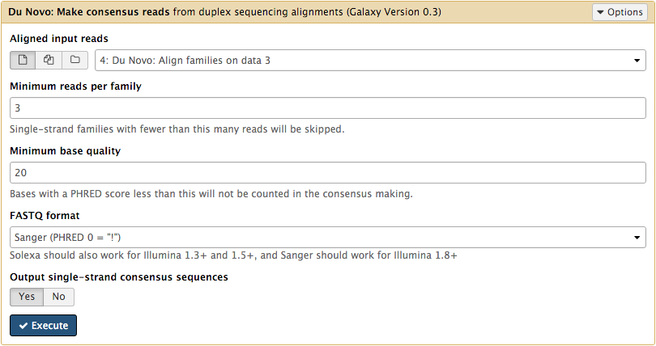
>
>Making DCS and SSCS. **Note** that **Output single-strand consensus sequences** is set to `Yes`. [Above](#background) we explained why single-strand consensus sequences (SSCS) may be important in some applications. [Below](#analysis-of-single-strand-consensus-data) we show how they can be used.

## Filtering consensuses

The _Du Novo_ algorithm occasionally inserts`N`and/or [IUPAC notations](https://en.wikipedia.org/wiki/Nucleic_acid_notation) at sites where a definive base cannot be identified according to the major rule consensus. We however do not want such bases when we call variants. The tool **Sequence Content Trimmer** will help with filtering these out. Here are the parameters we used:

>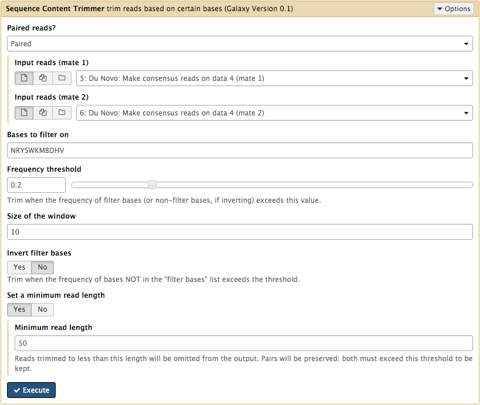
>
>Sequence Content Trimmer settings . Where: - `Paired reads = Paired` (because DCSs are reported as forward and reverse) - `Bases to filter on = NRYSWKMBDHV` (all ambiguous nucleotides) - `Frequency threshold = 0.2` (A window /see the next parameter below/ cannot have more than 20% of ambiguous bases) - `Size of the window = 10` (Size of the window) - `Invert filter bases = No` - `Set a minimum read length = 50` (We do not want _very_ short reads)

## Generating fastq

[The previous step](#filtering-consensuses) filters forward and reverse DCSs and reports them in [FASTA](https://en.wikipedia.org/wiki/FASTA_format) format. Yet the downstream tools require [fastq](https://en.wikipedia.org/wiki/FASTQ_format) format. To address this we convert FASTA into fastq using **Combine FASTA and QUAL** from tool section **NGS: QC and manipulation**. In this case the quality values are filled in with the maximum allowed value of 93 (essentially we fake them here), which is fine as we will not rely on quality scores in the rest of the analysis.

>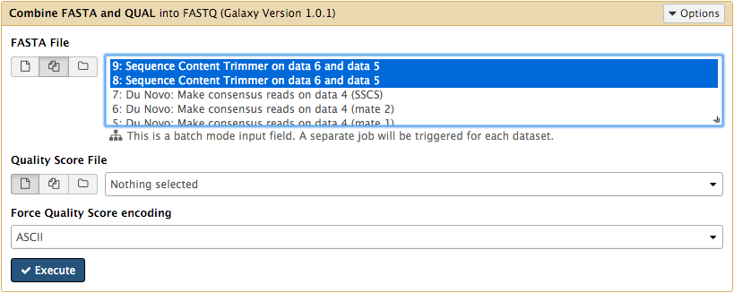
>
>Combine FASTA and QUAL. **Note** that here two datasets (#8 and #9) are selected simultaneously because we clicked the multiple datasets button the left of the **FASTA File** dropdown:  

## Calling variants

At this point we have trimmed DCSs in fastq format. We can now proceed to calling variants. This involves the following steps:

 1. [Align against reference genome](#align-against-genome-with-bwa-and-bwa-mem)
 2. [Merge results of multiple mappers](#merging) :point_left: This step is only useful if one uses multiple mappers (which we do here to show concordance. But this is not strictly necessary.)
 3. [Left aligning indels](#left-aligning-indels)
 4. [Tabulate the differences](#tabulating-the-differences)

### Align against genome with **BWA** and **BWA-MEM**

Here we use two mappers for added reliability (this is not necessary in most situations as long as you use the right mapper for input data). To differentiate between results produced by each mapper we assign readgroups (this is done by clicking on **Set read groups information** dropdown). For example, for **BWA-MEM** you would set parameters like this:

>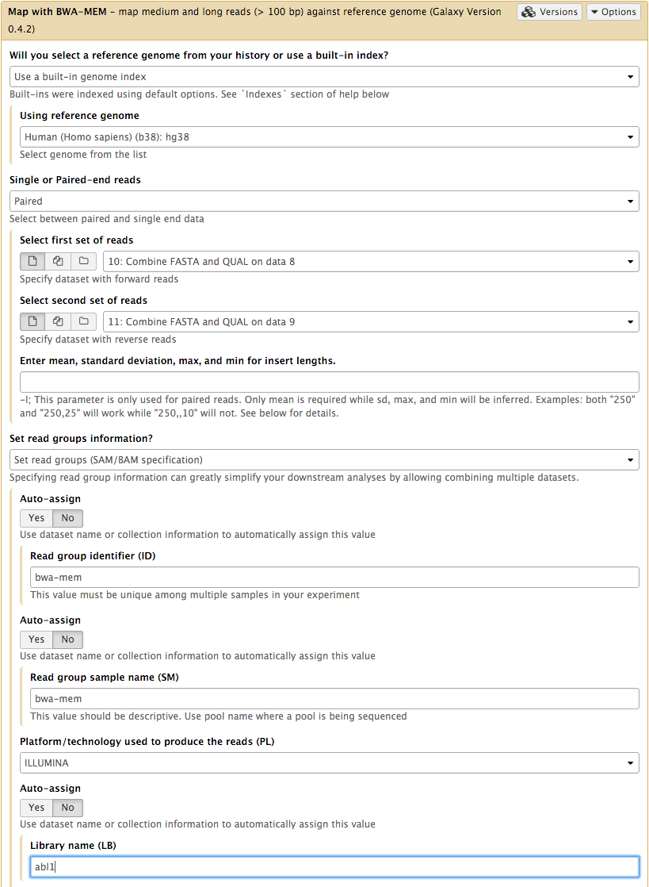
>
>Running BWA-MEM. **Note** that we are comparing DCSs against human genome version `hg38`, use forward and reverse DCSs are the `first` and `second` set of reads. Readgroup **SM** and **ID** tags are set `bwa-mem`.

We then repeat essentially the same with **BWA**:

>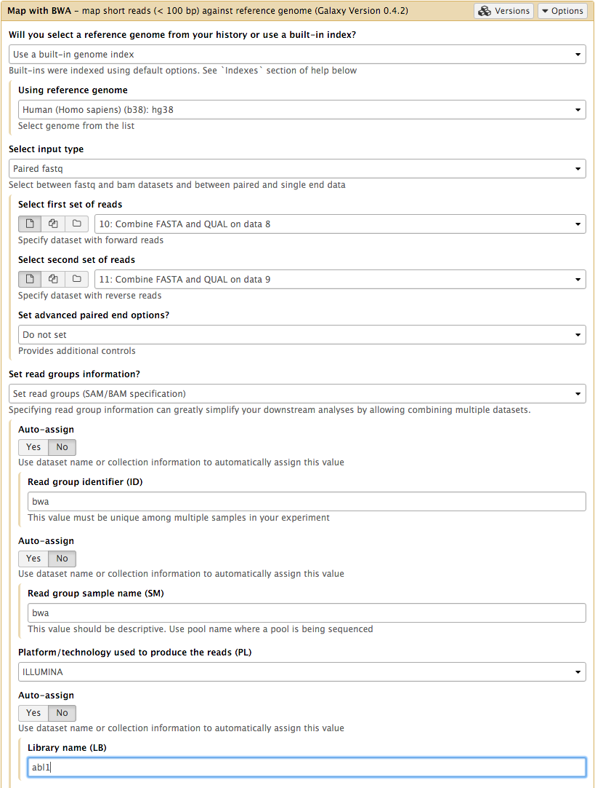
>
>Running BWA. **Note** here we use `bwa` as the readgroup **ID** and **SM** tags.

### Merging

Since we have used two mappers - we have two BAM datasets. Yet because we have set readgroups we can now merge them into a single BAM dataset. This is because the individual reads will be labelled with readgroups (you will see how it will help later). To merge we use **MergeSamFiles** from tool section **NGS: Picard**:

>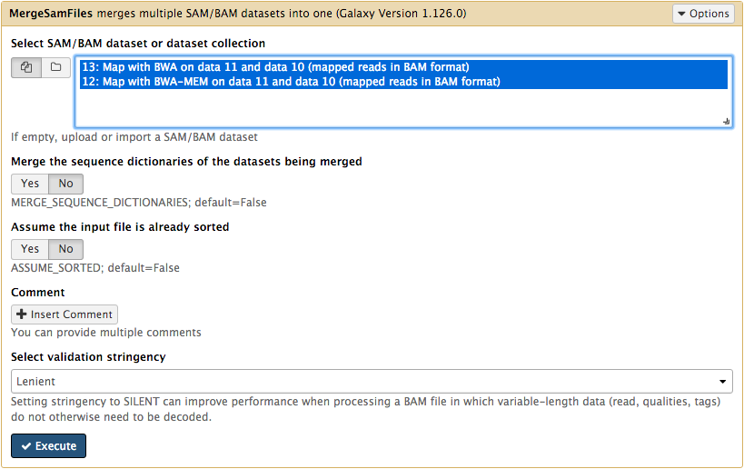
>
>Merging BAM datasets.

### Left Aligning indels

To normalize the positional distribution of indels we use **Left Align** utility (**NGS: Variant Analysis**) from [FreeBayes](https://github.com/ekg/freebayes#indels) package. This is necessary to avoid erroneous polymorphisms flanking regions with indels (e.g., in low complexity loci):

>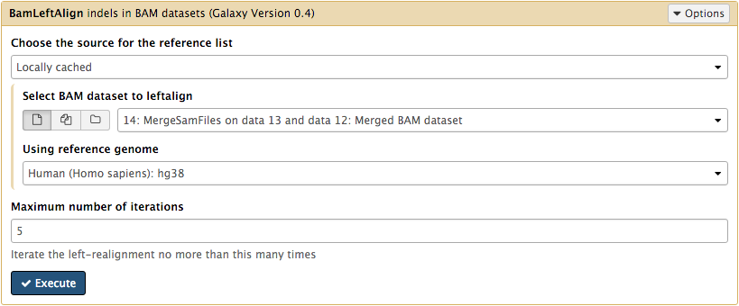
>
>Left aligning indels. **Note** here we use `hg38` as well. Obviously, one must use the same genome built you have aligned against with **BWA-MEM** and **BWA**.

### Tabulating the differences

To identify sites containing variants we use **Naive Variant Caller (NVC)** (tool section **NGS: Variant Analysis**) which produces a simple count of differences given coverage and base quality per site (remember that our qualities were "faked" during the conversion from FASTA to fastq and cannot be used here). So in the case of _ABL1_ we set parameters as follow:

>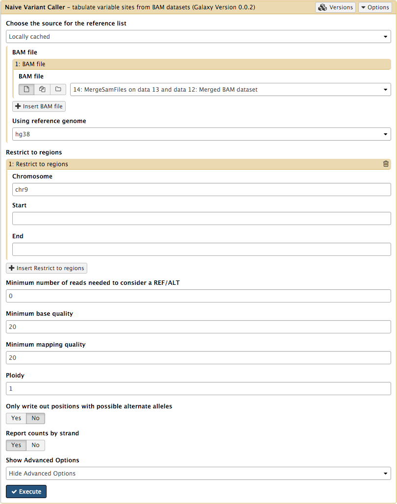
>
>Finding variants with NVC. Here: - `Using reference genome = hg38` (As mentioned above, needs to be set to the same genome one have mapped against.) - `Restrict to regions: Chromosome = chr9` (_ABL1_ is on chromosome 9. We set this to prevent **NVC** from wandering across the genome to save time.) - `Minimum number of reads needed to consider a REF/ALT = 0` (Trying to maximize the number of sites. We can filter later.) - `Minimum base quality = 20` (This default and is irrelevant because of "faking" quality scores during the conversion from FASTA to fastq). - `Minimum mapping quality = 20` (This is helpful because it prevents reads mapping to multiple locations from being included in the tabulation. Such reads will have mapping quality of 0.) - `Ploidy = 1` (Ploidy is irrelevant here as it is a mixture of multiple genomes) - `Only write out positions with possible alternate alleles = No` (We can filter later) - `Report counts by strand = Yes` (This will be helpful to gauge the strand bias).

The **NVC** generates a [VCF](https://en.wikipedia.org/wiki/Variant_Call_Format) file that can be viewed at genome browsers such as [IGV](https://www.broadinstitute.org/igv/). Yet one rarely finds variants by looking at genome browsers. The next step is to generate a tab-delimited dataset of nucleotide counts using **Variant Annotator** from tool section **NGS: Variant Analysis**. We ran it with the following parameters:

>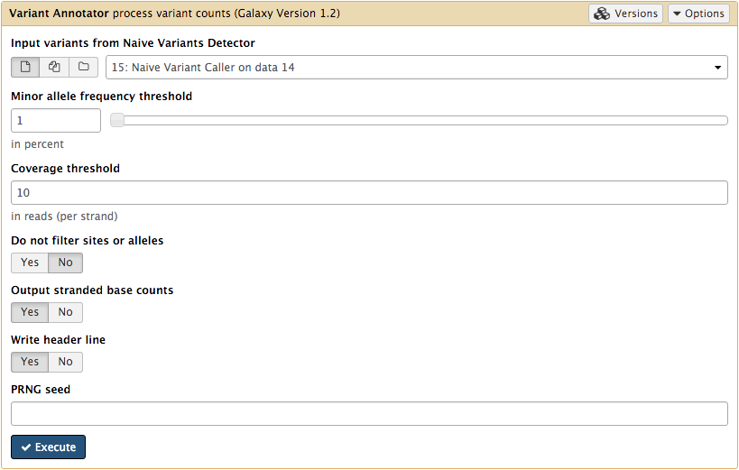
>
>Annotating variable sites. Here `Coverage threshold = 10` (To reduce noise) and `Output stranded base counts = Yes` (to see strand bias)

There are 3,264 lines in the output, which is clearly too much. Using **Filter** tool (tool section **Filter and Sort**) with expression `c16 >= 0.01`(because column 16 contains minor allele frequency - MAF - and we are interested in those sites where MAF >= 1%):

>
>
>Filtering variable sites.

will get that number to only 4 (showing just some of the columns):

Mapper  | Position (chr9)|  Major allele | Minor allele | MAF     |
:-------|----------:|:-------:|:------:|--------:|
bwa     | 130,872,141 |  G     |  A    | 0.013 |
bwa-mem | 130,872,141 |  G     |  A    | 0.013 |
bwa     | 130,880,141 |  A     |  G    | 0.479 |
bwa-mem | 130,880,141 |  A     |  G    | 0.479 |

We can see that results of both mappers agree very well. The reason we see these numbers grouped by mappers is because we have set the readgroups while [mapping](#align-against-genome-with-bwa-and-bwa-mem).

The polymorphism we are interested in (and the one reported by [Schmitt:2015] (https://www.ncbi.nlm.nih.gov/pmc/articles/PMC4414912/)) is at the position 130,872,141 and has a frequency of 1.3%. The other site (position 130,880,141) is a known common variant [rs2227985](https://www.ncbi.nlm.nih.gov/SNP/snp_ref.cgi?type=rs&rs=rs2227985), which is heterozygous in this sample.

# Analysis of single strand consensus data

SSCSs are generated when the **Output single-strand consensus sequences** option of **Du Novo: Make consensus reads** tool is set to `Yes` (see [here](#generating-duplex-consensus-sequences-dcs)). Analysis of SSCS data follows almost exactly the same trajectory. The only difference is that these **do not** come as forward and reverse. Instead _Du Novo_ generates a single dataset. With this dataset we go through all the same steps:

* [Filtering consensuses](#filtering-consensuses)
* [Generating fastq](#generating-fastq)
* [Calling variants](#calling-variants)
 	- [Aligning against genome](#align-against-genome-with-bwa-and-bwa-mem) (here the difference is that one needs to choose a single end option and use a single dataset as input)
 	- [Merging](#merging)
 	- [Left aligning indels](#left-aligning-indels)
 	- [Tabulating the differences](#tabulating-the-differences)

## Repeating this analysis using workflows

The analysis described above can be rerun using a workflow. Workflow combined all steps into a single entity that only needs to be executed once. We provide two workflows:

* _Du Novo_ analysis from reads (import from [here](https://usegalaxy.org/u/aun1/w/duplex-analysis-from-reads)). This workflow uses fastq reads as input. It should be used if you analyze data for first time.
* _Du Novo_ analysis from aligned families (import from [here](https://usegalaxy.org/u/aun1/w/copy-of-duplex-analysis-from-reads)). This workflow starts with aligned families. It should be used for re-analysis of already generated DCS and SSCS data.

>[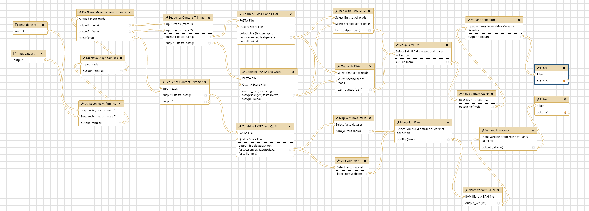](https://usegalaxy.org/u/aun1/w/duplex-analysis-from-reads)
>
>Starting from Reads

>[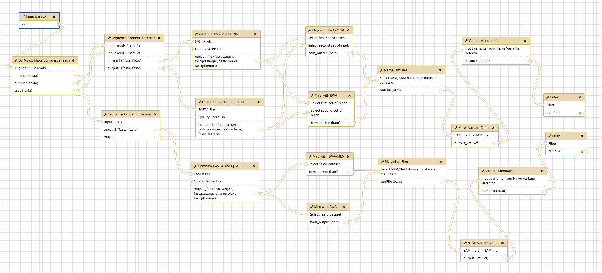](https://usegalaxy.org/u/aun1/w/copy-of-duplex-analysis-from-reads)
>
>Starting from DCS/SSCS data

## If things don't work...
...you need to complain. Use [Galaxy's BioStar Channel](https://usegalaxy.org/biostar/biostar_redirect) to do this.
