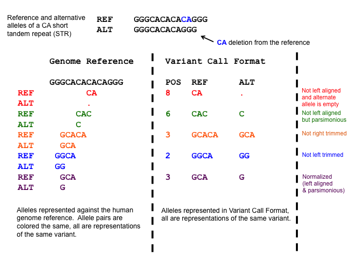

# Introduction

Exome sequencing is a method that enables the selective sequencing of the
exonic regions of a genome - that is the transcribed parts of the genome present
in mature mRNA, including protein-coding sequences, but also untranslated
regions (UTRs).

In humans, there are about 180,000 exons with a combined length of ~ 30 million
base pairs (30 Mb). Thus, the exome represents only 1% of the human genome, but
has been estimated to harbor up to 85% of all disease-causing variants ([Choi
et al., 2009](https://www.ncbi.nlm.nih.gov/pmc/articles/PMC2768590/)).

Exome sequencing, thus, offers an affordable alternative to whole-genome
sequencing in the diagnosis of genetic disease, while still covering far more
potential disease-causing variant sites than genotyping arrays. This is of
special relevance in the case of rare genetic diseases, for which the causative
variants may occur at too low a frequency in the human population to be
included on genotyping arrays.

Of note, a recent study focusing on the area of clinical pediatric neurology
indicates that the costs of exome sequencing may actually not be higher even
today than the costs of conventional genetic testing ([Vissers et al., 2017](https://www.ncbi.nlm.nih.gov/pmc/articles/PMC5589982/)).

> <details-title>Exome sequencing <i>vs</i> whole-genome sequencing</details-title>
>
> In principle, the steps illustrated in this tutorial are suitable also for
> the analysis of whole-genome sequencing (WGS) data. At comparable mean
> coverage, however, WGS datasets will be much larger than exome sequencing
> ones and their analysis will take correspondingly more time.
>
> The obvious benefit of WGS compared to exome-sequencing, of course, is that
> it will allow variant detection in even more regions of the genome.
> As a less apparent advantage, the more complete information of WGS data can
> make it easier to detect *copy number variation (CNV)* and
> *structural variants* such as translocations and inversions (although such
> detection will require more sophisticated analysis steps, which are not
> covered by this tutorial).
>
> Very generally, one could argue that exome-sequencing captures most of the
> information that can be analyzed with standard bioinformatical tools today at
> reasonable costs. WGS, on the other hand, captures as much information as
> today's sequencing technology can provide, and it may be possible to
> reanalyze such data with more powerful bioinformatical software in the
> future to exploit aspects of the information that were not amenable to
> analysis at the time of data acquisition.
{: .details}

The identification of causative variants underlying any particular genetic
disease is, as we will see in this tutorial, not just dependent on the
successful detection of variants in the genome of the patient, but also on
variant comparison between the patient and selected relatives. Most often
family trio data, consisting of the genome sequences of the patient and their
parents, is used for this purpose. With multisample data like this it becomes
possible to search for variants following any kind of Mendelian inheritance
scheme compatible with the observed inheritance pattern of the disease, or to
detect possibly causative *de-novo* mutations or *loss-of-heterozygosity* (LOH) events.

> <details-title>Related tutorials</details-title>
>
> This tutorial focuses on the practical aspects of analyzing real-world
> patient data. If you are more interested in the theoretical aspects of
> variant calling, you may want to have a look at the related tutorial on
> [Calling variants in diploid systems](../dip/tutorial.html).
>
> The tutorial on [Somatic variant calling](../somatic-variants/tutorial.html)
> follows an analysis workflow that is rather similar to the one here, but
> tries to identify tumor variants by comparing a tumor sample to healthy
> tissue from the same patient. Together, the two tutorials are intended to get
> you started with genomics medicine using Galaxy.
>
{: .details}

> <agenda-title></agenda-title>
>
> In this tutorial, we will cover:
>
> 1. TOC
> {:toc}
>
{: .agenda}

# Data Preparation

In this tutorial, we are going to analyze exome sequencing data from a family
trio, in which the boy child is affected by the disease
[osteopetrosis](https://ghr.nlm.nih.gov/condition/osteopetrosis/), while both
parents, who happen to be consanguineous, are unaffected. Our goal is to
identify the genetic variation that is responsible for the disease.

## Get data

 This tutorial offers **two alternative entry points** allowing
you to

- conduct a full analysis starting from original sequenced reads in `fastq`
  format or to
- start your analysis with premapped reads in `bam` format that are (almost)
  ready for variant calling.

While the full analysis is probably closer to how you would analyze your own
data, the shortened analysis from premapped reads may suit your time frame
better, and will avoid redundancy if you have previously worked through other
tutorials demonstrating NGS quality control and read mapping, like the
dedicated
[Quality control]()
and [Mapping]()
tutorials.

The following hands-on section will guide you through obtaining the right
data for either analysis.

> <hands-on-title>Data upload</hands-on-title>
>
> 1. Create a new history for this tutorial and give it a meaningful name
>
>    
>    
>
> 2. Obtain the raw sequencing data
>
>    > <comment-title>Starting from raw sequencing data</comment-title>
>    > In this and the following steps you will obtain the original unmapped
>    > sequencing data and prepare for a full analysis including the mapping of
>    > the sequenced reads.
>    >
>    > If you prefer **to skip the mapping step** and start the analysis from
>    > premapped data **you should proceed directly to step 4** of this
>    > section.
>    {: .comment}
>
>    Import the original sequenced reads datasets of the family trio from
>    [Zenodo](https://zenodo.org/record/3054169):
>    ```
>    https://zenodo.org/record/3243160/files/father_R1.fq.gz
>    https://zenodo.org/record/3243160/files/father_R2.fq.gz
>    https://zenodo.org/record/3243160/files/mother_R1.fq.gz
>    https://zenodo.org/record/3243160/files/mother_R2.fq.gz
>    https://zenodo.org/record/3243160/files/proband_R1.fq.gz
>    https://zenodo.org/record/3243160/files/proband_R2.fq.gz
>    ```
>
>    Alternatively, the same files may be available on your Galaxy server
>    through a shared data library (your instructor may tell you so), in
>    which case you may prefer to import the data directly from there.
>
>    
>
>    
>
> 3. Check that the newly created datasets in your history have their
>    datatypes assigned correctly to `fastqsanger.gz`, and fix any missing or
>    wrong datatype assignment
>
>    
>
>     Congratulations for obtaining the datasets required for
>    an analysis including reads mapping. You should now
>    **proceed with Step 7** below.
>
> 4. Obtain the premapped sequencing data
>    > <comment-title>Alternative entry point: Premapped data</comment-title>
>    > Skip this and the following two steps if you already obtained and
>    > prepared the original unmapped seuencing data and are planning to
>    > perform the mapping step yourself.
>    {: .comment}
>
>    Import the premapped reads datasets of the family trio from
>    [Zenodo](https://zenodo.org/record/3054169):
>    ```
>    https://zenodo.org/record/3243160/files/mapped_reads_father.bam
>    https://zenodo.org/record/3243160/files/mapped_reads_mother.bam
>    https://zenodo.org/record/3243160/files/mapped_reads_proband.bam
>    ```
>
>    Alternatively, the same files may be available on your Galaxy server
>    through a shared data library (your instructor may tell you so), in
>    which case you may prefer to import the data directly from there.
>
>    
>
>    
>
> 5. Check that the newly created datasets in your history have their
>    datatypes assigned correctly to `bam`, and fix any missing or wrong
>    datatype assignment
>
>    
>
> 6. Specify the genome version that was used for mapping
>
>    Change the database/build (dbkey) for each of your bam datasets
>    to `hg19`.
>
>    
>
>    > <details-title>Why specify genome versions</details-title>
>    > When you are starting with sequencing data that has already been mapped
>    > to a particular genome version (human hg19 in this case), it is good
>    > practice to attach this information as metadata to the datasets.
>    >
>    > Doing so helps prevent accidental use of a different version of the
>    > reference genome in later steps like variant calling, which would
>    > typically lead to nonsensical results because of base position changes
>    > between the different versions.
>    {: .details}
>
>     Congratulations for obtaining the premapped sequencing
>    datasets. Now, **follow the remaining steps** to set everything up for a
>    successful analysis.
>
> 7. Rename the datasets
>
>    For datasets that you upload via a link, Galaxy will pick the link
>    address as the dataset name, which you will likely want to shorten to
>    just the file names.
>
>    
>
> 8. Add #father/#mother/#child tags to the datasets
>
>    Parts of the analysis in this tutorial will consist of identical steps
>    performed on the data of each family member.
>
>    To make it easier to keep track of which dataset represents which step in
>    the analysis of which sample, Galaxy supports dataset tags. In particular,
>    if you attach a tag starting with `#` to any dataset, that tag will
>    automatically propagate to any new dataset derived from the tagged
>    dataset.
>
>    Tags are supposed to help you identify the origin of datasets quickly,
>    but you can choose them as you like.
>
>    
>
> 9. Obtain the reference genome
>
>    > <comment-title>Shortcut</comment-title>
>    > You can skip this step if the Galaxy server you are working on offers
>    > a `hg19` version of the human reference genome with prebuilt indexes for
>    > *bwa-mem* (only necessary if starting from unmapped original sequencing
>    >reads) and *freebayes*. Ask your instructor, or check the tools
>    > **Map with BWA-MEM**  and **FreeBayes** 
>    > if they list a `hg19` version as an option under
>    > *"Select a / Using reference genome"*).
>    {: .comment}
>
>    Import the `hg19` version of the human chromosome 8 sequence:
>    ```
>    https://zenodo.org/record/3243160/files/hg19_chr8.fa.gz
>    ```
>
>    Make sure you specify the datatype as `fasta` in the import dialog.
>
>    Alternatively, load the dataset from a shared data library.
>
> 10. Rename the reference genome
>
>     The reference genome you have imported above came as a compressed
>     file, but got unpacked by Galaxy to plain `fasta` format according to
>     your datatype selection. You may now wish to remove the `.gz` suffix
>     from the dataset name.
>
{: .hands_on}

 **Congratulations!**
You are all set for starting the analysis now.

If you have chosen to follow the complete analysis from the original sequenced
data, just proceed with the next section.

If, on the other hand, you have prepared to start from the premapped data, skip
the sections on *Quality control* and *Read mapping*, and conitnue with
**Mapped reads postprocessing**.

# Quality control

This step serves the purpose of identifying possible issues with the raw
sequenced reads input data before embarking on any "real" analysis steps.

Some of the typical problems with NGS data can be mitigated by preprocessing
affected sequencing reads before trying to map them to the reference genome.
Detecting some other, more severe problems early on may at least save you a lot
of time spent on analyzing low-quality data that is not worth the effort.

Here, we will perform a standard quality check on our input data and only point
out a few interesting aspects about that data. For a more thorough explanation
of NGS data quality control, you may want to have a look at the dedicated
tutorial on [Quality control]().

> <hands-on-title>Quality control of the input datasets</hands-on-title>
> 1. Run **FastQC**  on each of your six fastq datasets
>       -  *"Short read data from your current history"*: all 6 FASTQ  datasets selected with **Multiple datasets**
>
>    
>
>    When you start this job, twelve new datasets (one with the calculated raw
>    data, another one with an html report of the findings for each input
>    dataset) will get added to your history.
>
> 2. Use **MultiQC**  to aggregate the raw **FastQC** data of all input datasets into one report
>      - In *"Results"*
>        - *"Which tool was used generate logs?"*: `FastQC`
>        - In *"FastQC output"*
>           - *"Type of FastQC output?"*: `Raw data`
>           -  *"FastQC output"*: all six *RawData*
>             outputs of **FastQC** )
>
> 3. Inspect the *Webpage* output produced by the tool
>
>    > <question-title></question-title>
>    >
>    > 1. Based on the report, do you think preprocessing of the reads
>    >    (trimming and/or filtering) will be necessary before mapping?
>    > 2. Why do all samples show a non-normal GC content distribution, and
>    >    should you be worried?
>    >
>    > > <solution-title></solution-title>
>    > >
>    > > 1. Sequence quality is quite good overall. If anything you might
>    > >    consider trimming the 3' ends of reads (base qualities decline
>    > >    slightly towards the 3' ends) or to filter out the small fraction
>    > >    of reads with a mean base quality < 5.
>    > >    Feel free to run, *e.g.*, **Trimmomatic**  on the
>    > >    fastq datasets if you want to, but don't expect this to have a big
>    > >    effect on the analysis given the high overall quality of the data
>    > >    of all samples.
>    > > 2. In whole-genome sequencing, a non-normal distribution of the GC
>    > >    content of the reads from a sample is typically considered to hint
>    > >    at possible contamination.
>    > >    Here, however, we are dealing with sequencing data from captured
>    > >    exomes, *i.e*, the reads are not representing random sequences from
>    > >    a genome, but rather a biased selection.
>    > >
>    > >    A bimodal GC content distribution, like for the samples at hand, is
>    > >    a characteristic feature of many exome capture methods and has also
>    > >    been observed with an Illumina Nextera Rapid Capture exome kit
>    > >    before (compare Fig. 3D in
>    > >    [Shigemizu et al., 2015](https://www.ncbi.nlm.nih.gov/pmc/articles/PMC4522667/)
>    > >    ).
>    > >
>    > {: .solution}
>    {: .question}
{: .hands_on}

# Read mapping

Now that you confirmed that the quality of the input data is good enough to
warrant further analysis, it is time to map the sequenced reads to the
reference genome.

We assume here that you are at least vaguely familiar with the concept of read
mapping and only illustrate the concrete steps necessary  to map our specific
NGS reads datasets to the human reference genome. We recommend you to follow
the dedicated [Mapping tutorial](), if you need a general introduction to read mapping.

> <hands-on-title>Read Mapping</hands-on-title>
> 1. **Map with BWA-MEM**  to map the reads from the **father** sample to the reference genome
>    - *"Will you select a reference genome from your history or use a built-in index?"*: `Use a built-in genome index`
>        - *"Using reference genome"*: `Human: hg19` (or a similarly named option)
>
>      > <comment-title>Using the imported `hg19` sequence</comment-title>
>      > If you have imported the `hg19` chr8 sequence as a fasta dataset into
>      > your history instead:
>      >   - *"Will you select a reference genome from your history or use a
>      >     built-in index?"*: `Use a genome from history and build index`
>      >      -  *"Use the following dataset as the reference sequence"*: your imported `hg19` fasta dataset.
>      {: .comment}
>
>    - *"Single or Paired-end reads"*: `Paired`
>       -  *"Select first set of reads"*: the
>         forward reads (R1) dataset of the **father** sample
>       -  *"Select second set of reads"*: the
>         reverse reads (R2) dataset of the **father** sample
>
>      > <tip-title>No FASTQ datasets selectable?</tip-title>
>      > Please confirm that the problematic datasets declare *format*:
>      > `fastqsanger.gz`.
>      >
>      > Most Galaxy tools that accept FASTQ input expect the data to be
>      > formatted as *FASTQ with Sanger-scaled quality values*, the most
>      > widely spread version of the FASTQ format. To make this requirement
>      > explicit (instead of generating possibly wrong results) these tools
>      > require you to set the dataset type to `fastqsanger` (`fastqsanger.gz`
>      > for data compressed with gzip). You can do so either on data upload
>      > or later from the *Edit dataset attributes* view (which you can reach
>      > by clicking on the  pencil icon.
>      {: .tip}
>
>    - *"Set read groups information?"*: `Set read groups (SAM/BAM specification)`
>      - *"Auto-assign"*: `No`
>        - *"Read group identifier (ID)"*: `000`
>      - *"Auto-assign"*: `No`
>        - *"Read group sample name (SM)"*: `father`
>
>    > <warning-title>Read group IDs and sample names - choose, but choose wisely</warning-title>
>    > In general, you are free to choose ID and SM values to your liking, but
>    > ...
>    >
>    > The **ID** should **unambiguously identify** the sequencing run that
>    > produced the reads. At the very least, no two input datasets in any
>    > given analysis should define the same ID twice, or tools like
>    > *FreeBayes*, which we are going to use in the next step, will refuse
>    > to work with the data.
>    >
>    > The **SM** value, on the other hand, should identify the biological
>    > sample represented by the data and is used by many tools (like *GEMINI*
>    > which we will use later) to let you refer to one specifc sample in a
>    > multisample analysis. Choose descriptive, but short and easy to
>    > remember sample names since you will have to type them in again!
>    >
>    {: .warning}
>
> 2. **Map with BWA-MEM**  to map the reads from the **mother** sample to the reference genome **using the same parameters as before** except
>
>    - *"Single or Paired-end reads"*: `Paired`
>       -  *"Select first set of reads"*: the
>         forward reads (R1) dataset of the **mother** sample
>       -  *"Select second set of reads"*: the
>         reverse reads (R2) dataset of the **mother** sample
>
>    - *"Set read groups information?"*: `Set read groups (SAM/BAM specification)`
>      - *"Auto-assign"*: `No`
>        - *"Read group identifier (ID)"*: `001`
>      - *"Auto-assign"*: `No`
>        - *"Read group sample name (SM)"*: `mother`
>
> 3. **Map with BWA-MEM**  to map the reads from the **child** sample to the reference genome **using the same parameters as before** except
>
>    - *"Single or Paired-end reads"*: `Paired`
>       -  *"Select first set of reads"*: the
>         forward reads (R1) dataset of the **child** sample
>       -  *"Select second set of reads"*: the
>         reverse reads (R2) dataset of the **child** sample
>
>    - *"Set read groups information?"*: `Set read groups (SAM/BAM specification)`
>      - *"Auto-assign"*: `No`
>        - *"Read group identifier (ID)"*: `002`
>      - *"Auto-assign"*: `No`
>        - *"Read group sample name (SM)"*: `proband`
>
{: .hands_on}

# Mapped reads postprocessing

At this point in the analysis you should have obtained three mapped reads
datasets in `bam` format. Ideally, these would carry `#father`, `#mother` and
`#child` tags for quick identification of the samples they provide data for.

In principle, you could use these datasets directly for variant calling, and in
many cases, including this one, this would be sufficient to identify the
sought-after variants.

To obtain an accurate picture of the variant spectrum found in your samples it
is good practice though to perform various postprocessing steps on the mapped
reads before passing them to a variant caller.

> <comment-title>Shortcut</comment-title>
> If you are in a hurry, you may skip the postprocessing steps and continue
> with your mapped reads datasets and the *Variant Calling* section. Make sure
> though you come back here, or read about mapped reads postprocessing
> elsewhere, before attempting to perform any variant analysis on your own data
> that may require high accuracy/sensitivity.
{: .comment}

The optimal set of postprocessing steps required depends on the variant calling
software used at the next step. The **FreeBayes** variant caller that we are
going to use in this tutorial is particularly well suited for use with minimal
mapped reads postprocessing pipelines, so all we are going to do here is:

- filter the paired-end reads of all samples to retain only those read pairs,
  for which both the forward and the reverse read have been mapped to the
  reference successfully

  For such pairs of reads, we can be extra confident that they don't
  come from some non-human contaminant DNA or represent a sequencing artefact
  of some sort.

- deduplicate reads

  Duplicate reads, which typically arise from PCR-overamplification of genomic
  fragments during sequencing library preparation, can, to some extent, lead to
  wrong genotype assignments at variant sites (if, for example, a sample is
  heterozygous for a variant, but fragments with one of the two alleles get
  amplified more efficiently than the others).

> <comment-title>More postprocessing steps</comment-title>
> The [Somatic variant calling tutorial](../somatic-variants/tutorial.html)
> provides an example of a much more complex mapped reads postprocessing
> pipeline that may be required for optimal performance of other variant
> callers.
{: .comment}

## Filtering on mapped reads properties

To produce new filtered BAM datasets with only mapped reads the mate of which is also mapped:

> <hands-on-title>Filtering for read pair mapping status</hands-on-title>
>
> 1. **Filter SAM or BAM, output SAM or BAM**  with the following
> parameters (leaving non-mentioned ones at their defaults):
>   -  *"SAM or BAM file to filter"*: all 3 mapped reads
>     datasets of the family trio, outputs of **Map with BWA-MEM**
>     
>   - *"Filter on bitwise flag"*: `yes`
>     - *"Only output alignments with all of these flag bits set"*:
>       Do not select anything here!
>     - *"Skip alignments with any of these flag bits set"*:
>        -  *"The read is unmapped"*
>        -  *"The mate is unmapped"*
>
{: .hands_on}

This will result in three new datasets, one for each sample in the analysis.

> <details-title>More than one way to filter</details-title>
> Instead of the above filter conditions we could also have exploited the
> *Read is mapped in a proper pair* flag bit.
>
> For a read to be flagged as being mapped in a proper pair its mate needs to
> be mapped, but the mapped pair also needs to meet additional,
> aligner-specific criteria. These may include (and do so for **BWA-MEM**):
>
> - both reads need to map to the same chomosome
> - the two reads need to map to the reference in the orientation expected by
>   the aligner
> - the two read pairs need to map to the reference within an
>   aligner-determined distance
>
> Thus, filtering based on the flag has two consequences:
>
> - filtering will be stricter than with just the *Read is unmapped* and *Mate
>   is unmapped* flags above
> - you will eliminate read pairs that could be informative with regard to
>   chromosomal rearrangements and insertion/deletion events
>
>   => Do not filter for properly paired reads if you plan to detect such
>   structural variants!
>
> In addition, the *proper pair* flag is considered undefined if the read
> itself is unmapped, so a *proper pair* filter should eliminate unmapped reads
> explicitly to be on the safe side.
>
> Thus, if you would like to use proper pair filtering (we have no intention to
> detect structural variants in this tutorial) instead of just filtering for
> mapped reads with a mapped mate, you could run the alternative:
>
> > <hands-on-title></hands-on-title>
> >
> > 1. **Filter SAM or BAM, output SAM or BAM** :
> >   -  *"SAM or BAM file to filter"*: all 3 mapped
> >     reads datasets of the family trio, outputs of **Map with BWA-MEM**
> >     
> >   - *"Filter on bitwise flag"*: `yes`
> >     - *"Only output alignments with all of these flag bits set"*:
> >       -  *"Read is mapped in a proper pair"*
> >     - *"Skip alignments with any of these flag bits set"*:
> >       -  *"The read is unmapped"*
> >
> {: .hands_on}
>
{: .details}

## Removing duplicate reads

> <hands-on-title>Remove duplicates</hands-on-title>
>
> 1. **RmDup**  with the following parameters:
>   -  *"BAM file"*: all 3 filtered reads datasets; the
>     outputs of **Filter SAM or BAM**
>   - *"Is this paired-end or single end data"*: `BAM is paired-end`
>     - *"Treat as single-end"*: `No`
>
{: .hands_on}

Again, this will produce three new datasets, one for each member of the family
trio.

# Variant calling

With the sequenced reads of all samples mapped and postprocessed, we can start
looking for evidence of sequence deviations, *i.e.* variants, between the
sequenced genomic samples and the reference genome.

This task has been automated and optimized continuously over the last decade,
and modern variant calling software hides much of the complexity involved in
it. At least a basic understanding of the underlying concepts is still highly
recommended though and, if you are new to variant calling, the tutorial on
[Calling variants in diploid systems](../dip/tutorial.html) may be a good
starting point for you.

## Generating FreeBayes calls

We will use **FreeBayes** to call our variants. **FreeBayes** is a Bayesian
genetic variant detector designed to find small polymorphisms, specifically
SNPs (single-nucleotide polymorphisms), indels (insertions and deletions), MNPs
(multi-nucleotide polymorphisms), and complex events (composite insertion and
substitution events) smaller than the length of a short-read sequencing
alignment.

> <hands-on-title>Generating FreeBayes calls</hands-on-title>
>
> 1. Run **FreeBayes** :
>    - *"Choose the source for the reference genome"*: `Locally cached`
>      - *"Run in batch mode?"*: `Merge output VCFs`
>        -  *"BAM dataset(s)"*: all three mapped reads
>          datasets of the family trio; the outputs of **RmDup**
>      - *"Using reference genome"*: `Human: hg19` (or a similarly named option)
>
>      > <comment-title>Using the imported `hg19` sequence</comment-title>
>      > If you have imported the `hg19` chr8 sequence as a fasta dataset
>      > into your history instead:
>      > - *"Choose the source for the reference genome"*: `History`
>      >   - *"Run in batch mode?"*: `Merge output VCFs`
>      >     -  *"BAM dataset(s)"*: all three mapped
>      >       reads datasets of the family trio
>      >   -  *"Use the following dataset as the
>      >     reference sequence"*: your imported `hg19` fasta dataset.
>      {: .comment}
>
>    - *"Limit variant calling to a set of regions?"*: `Do not limit`
>    - *"Choose parameter selection level"*: `1. Simple diploid calling`
>
{: .hands_on}

 **Congratulations!**
You have created you first multisample VCF file, one of the most complicated
file formats in bioinformatics. For every variant detected in at least one of
your samples, this tab-separated format uses a single line to store all
information about the variant. This includes but is not limited to:

- the position of the variant in the genome (with respect to the reference
  genome used for the analysis)
- the nature of the variant (the actual sequence change associated with it)
- the detected genotype of every sample at the variant position
- measures of the reliability of the variant call and of all individual
  genotype calls

> <hands-on-title>Optional hands-on: Inspect the VCF output produced by FreeBayes</hands-on-title>
>
> 1. Display the VCF dataset:
>    - Click the  icon next to the VCF dataset generated
>      by FreeBayes to display its contents.
>
>      VCF is a tabular plain text format though its information density makes
>      it complicated to  understand.
>
>    > <question-title></question-title>
>    >
>    > Can you locate at least some of the above-listed information in the
>    > dataset?
>    >
>    > Hints:
>    > - Lines starting with `##` are comment lines explaining the content of
>    >   the file.
>    > - Diploid genotypes at biallelic sites are encoded using `0/0`, `0/1`
>    >   and `1/1` to represent homozygous reference, heterozygous and
>    >   homozygous variant states, respectively.
>    >
>    > > <solution-title></solution-title>
>    > >
>    > > - The position of each variant with respect to the reference genome is
>    > >   stored in the first two columns (labeled `CHROM` and `POS`).
>    > >
>    > > - The sequence change associated with the variant is provided by
>    > >   columns 4 and 5 (`REF` and `ALT`).
>    > >
>    > >   The first of these lists the sequence found at the variant site in
>    > >   the reference genome, the second the variant sequence.
>    > >
>    > > - The genotypes of the samples are stored as part of columns 10 and
>    > >   up.
>    > >
>    > >   Column 9 (`FORMAT`) provides the legend for understanding the
>    > >   sample-specific columns following it and tells us that the first
>    > >   element (before the first `:` separator) of each sample column holds
>    > >   the sample genotype (`GT`).
>    > >
>    > > - The variant call quality (a measure of the reliability of the
>    > >   variant existing in any of the samples, *i.e.* it being real) is
>    > >   stored in column 6 (`QUAL`).
>    > >   The values are [Phred-scaled](https://en.wikipedia.org/wiki/Phred_quality_score)
>    > >   like sequenced reads base qualities.
>    > >
>    > >   The (log10-scaled) likelihoods of individual genotype calls are
>    > >   stored as the last element (`GL`) in every sample column.
>    > >
>    > > If you are eager to learn all the details about the format, you could
>    > > consult the excellent (but also long) official
>    > > [VCF specification](http://samtools.github.io/hts-specs/VCFv4.3.pdf).
>    > >
>    > {: .solution}
>    {: .question}
{: .hands_on}

## Post-processing FreeBayes calls

Before starting to analyze the detected variants, we need to post-process the
VCF dataset to fix a few incompatibilities between Freebayes and downstream
analysis tools. In particular, we want to:

- Split multiallelic variant records, *i.e.*, records that list more than one
  alternate allele at a given genomic position, into separate record lines.

  This will allow us to annotate each record with information about the impact
  of one specific variant allele further on.

- Make sure that indels are represented in left-aligned and normalized form
  because this is how known indels are stored in public annotation databases.

  > <details-title>Indel normalization</details-title>
  > Indel normalization is a surprisingly complex topic, which is explained
  > really well and in detail in
  > [Tan et al., 2015](https://www.ncbi.nlm.nih.gov/pmc/articles/PMC4481842/).
  > The following figure illustrates the various possibilities to represent
  > an indel, only one of which is the *normalized* form:
  > .
  >
  {: .details}

A tool that can do this and also ensures that a VCF dataset conforms to
standards in some other, less important respects is **bcftools norm**.

> <hands-on-title>Post-processing FreeBayes calls</hands-on-title>
>
> 1. **bcftools norm**  with the following parameters:
>    - *"VCF/BCF Data"*: the VCF output of **FreeBayes** 
>    - *"Choose the source for the reference genome"*: `Use a built-in genome`
>      - *"Reference genome"*: `Human: hg19` (or a similarly named option)
>
>      > <comment-title>Using the imported `hg19` sequence</comment-title>
>      > If you have imported the `hg19` chr8 sequence as a fasta dataset
>      > into your history instead:
>      > - *"Choose the source for the reference genome"*:
>      >   `Use a genome from the history`
>      >   - *"Reference genome"*: your imported `hg19` fasta dataset
>      {: .comment}
>    - *"When any REF allele does not match the reference genome base"*:
>      `ignore the problem (-w)`
>    - *"Left-align and normalize indels?"*: `Yes`
>    - *"Perform deduplication for the folowing types of variant records"*:
>      `do not deduplicate any records`
>
>      Freebayes is not producing any duplicate calls.
>    - *"~multiallelics"*: `split multiallelic sites into biallelic records (-)`
>      - *"split the following variant types"*: `both`
>
>        We want to split both, multiallelic SNP and indel records.
>    - *"output_type"*: `uncompressed VCF`
>
>      We would like to keep the results human-readable. VCF is also what tools
>      like *SnpEff* and *GEMINI* expect as input. Compressed, binary BCF is
>      interesting for space-efficient long-term storage of large lists of
>      variants.
>
{: .hands_on}

You could try to look for the differences between the original and the
normalized VCF dataset, but for convenience **bcftools norm** reports a brief
summary of the actions it performed. Expand the dataset in the history (by
clicking on its name) to see this output listing the total number of variant
lines processed, along with the number of split, realigned and skipped records.

# Variant annotation and reporting

A list of variants detected in a set of samples is a start, but to discover
biologically or clinically relevant information in it is almost impossible
without some additional tools and data. In particular, the
variants in the list need to be:

- **prioritized** with respect to their potential relevance for the biological
  / clinical phenotype that is studied

  Even with exome sequencing, only a fraction of the detected variants will
  have a clear impact on the function of a protein (many variants will
  introduce silent mutations, or reside in intronic regions still covered by
  the exome-enriched sequencing data). Of these, many will have been observed
  before in healthy individuals arguing against them playing an important role
  in an adverse phenotype.

- **filtered** based on the inheritance pattern expected for a causative
  variant

  A multisample VCF file records the most likely genotypes of all samples at
  every variant site. Knowing which individuals (samples) are affected by a
  phenotype we can exclude variants with inheritance patterns that are
  incompatible with the observed inheritance of the phenotype.

- **reported** in a more human-friendly form

  While the VCF format can be used to encode all relevant information about any
  variant, it is hard for humans to parse that information.

  Ideally, one would like to generate simpler reports for any set of filtered
  and prioritized variants.


## Get data

Our workhorse for annotating and reporting variants and the genes affected by
them will be the **GEMINI** framework. GEMINI comes bundled with a wealth of
annotation data for human variants from many different sources. These can be
used to annotate any list of human variants conveniently, without the need for
separate downloads and conversion between different annotation data formats.

> <details-title>Custom annotations and GEMINI</details-title>
> Beyond its bundled annotation data, GEMINI also provides (limited) support
> for using custom annotations.
> The [Somatic variant calling tutorial](../somatic-variants/tutorial.html)
> demonstrates the use of **GEMINI annotate**  for this purpose.
{: .details}

The only additional annotation tool we need, for the purpose of this
tutorial, is the tool **SnpEff**, which can annotate variants with their
calculated effects on known genomic features. Because SnpEff is a generic tool
that can be used on variants found in the genome of any organism we need to
provide it with a so-called **SnpEff genome file** that holds the annotated
features (genes, transcripts, translated regions, *etc.*) for our genome of
interest.

While annotated variants are all we need to *prioritize* them as described
above, *filtering based on inheritance patterns* requires a way to inform
GEMINI about the relationship between our samples and their observed
phenotypes. This is done through a so-called **pedigree file** in PED format,
which is rather simple to generate manually.

> <hands-on-title>Obtain SnpEff genome and GEMINI pedigree files</hands-on-title>
> 1. Download **SnpEff functional genomic annotations**
>
>     > <comment-title>Shortcut</comment-title>
>     > You can skip this step if the Galaxy server you are working on offers
>     > `Homo sapiens: hg19` as a locally installed snpEff database. You can
>     > check the **Genome source** select list of the **SnpEff eff**
>     >  tool to see if this is the case.
>     {: .comment}
>
>     Use **SnpEff Download**  to download genome annotation
>     database `hg19`.
> 2. Create a PED-formatted pedigree dataset describing our single-family sample trio:
>
>    ```
>    #family_id    name     paternal_id    maternal_id    sex    phenotype
>    FAM           father   0              0              1      1
>    FAM           mother   0              0              2      1
>    FAM           proband  father         mother         1      2
>    ```
>
>    and set its datatype to `tabular`.
>
>    
>
>    > <warning-title>Remember those sample names</warning-title>
>    >
>    > The above content of the pedigree dataset assumes you chose `father`,
>    > `mother`, `proband` as the sample names at the read mapping step
>    > (if you haven't mapped the reads yourself, but started with the
>    > premapped data, you can safely skip this warning section).
>    > By now, these sample names will have been propagated through *BWA-MEM*
>    > and *Freebayes* to the VCF dataset of variants. It is **important** that
>    > you use matching sample names in the pedigree and in the VCF dataset, or
>    > GEMINI will not be able to connect the information in them.
>    >
>    > If you have chosen different sample names before, you have to adjust
>    > the pedigree dataset accordingly!
>    >
>    {: .warning}
>
>    > <details-title>More on PED files</details-title>
>    >
>    > The PED format is explained in the help section of **GEMINI load**
>    > .
>    >
>    > Take a moment and try to understand the information that is encoded in
>    > the PED dataset we are using here.
>    {: .details}
{: .hands_on}

## Variant annotation with functional genomic effects

We need to start annotating our variants with SnpEff simply because Gemini
knows how to parse SnpEff-annotated VCFs, while GEMINI output cannot be used
with SnpEff.

> <hands-on-title>Adding annotations with SnpEff</hands-on-title>
> 1. **SnpEff eff** 
>    -  *"Sequence changes (SNPs, MNPs, InDels)"*: the
>      output of **bcftools norm** 
>    - *"Input format"*: `VCF`
>    - *"Output format"*: `VCF (only if input is VCF)`
>    - *"Genome source"*: `Locally installed reference genome`
>       - *"Genome"*: `Homo sapiens: hg19` (or a similarly named option)
>
>      > <comment-title>Using the imported `hg19` SnpEff genome database</comment-title>
>      > If you have imported the `hg19` SnpEff genome database into your
>      > history instead:
>      >   - *"Genome source"*: `Downloaded snpEff database in your history`
>      >      -  *"SnpEff4.3 Genome Data"*: your imported `hg19` SnpEff dataset.
>      {: .comment}
>
>    - *"Produce Summary Stats"*: `Yes`
>
{: .hands_on}

Running the above job will produce two datasets. One is a *Summary Stats* HTML
report, which contains some interesting general metrics such as a distribution
of variants across gene features. The other one is the main annotation result -
a VCF like the input, but with annotations of variant effects added to the INFO
column.

> <hands-on-title>Optional hands-on: Inspect the Summary Stats output produced by SnpEff</hands-on-title>
>
> 1. Display the dataset:
>    - Click the  icon next to the HTML dataset generated
>      by SnpEff to display its contents.
>
>    > <question-title></question-title>
>    >
>    > One section in the report is **Number of effects by type and region**.
>    > Given that you are analyzing exome data, what is the most surprising
>    > aspect in this section? Do you have an idea how to explain it?
>    >
>    > > <solution-title></solution-title>
>    > >
>    > > According to the report, intronic variants make up 50% of all
>    > > variants detected!
>    > >
>    > > Exome capture kits are designed to capture exons plus a bit of
>    > > surrounding sequence to ensure proper coverage of the exon ends
>    > > including splice junction sites.
>    > >
>    > > Thus, even though intronic sequences are underrepresented in exome
>    > > sequencing data, not all of them are eliminated. Since mutations
>    > > in most intron bases are neutral, they can accumulate at higher
>    > > frequency than most mutations in exons and, thus, still represent a
>    > > relevant fraction of all detected variants.
>    > >
>    > {: .solution}
>    {: .question}
{: .hands_on}

## Generating a GEMINI database of variants for further annotation and efficient variant queries

Next, we are going to use the SnpEff-annotated VCF as the basis for more
exhaustive annotation with GEMINI. Unlike SnpEff, GEMINI does not just add
annotations to a list of variants in VCF format. Instead the framework
extracts the variants from the VCF input and stores them, together with newly
added annotations, in an SQL database. It then lets you formulate queries for
retrieving and reporting subsets of variants. The combined variant
extraction/annotation/storage step is performed by the **GEMINI load** tool. In
addition, that same tool can be used to incorporate sample pedigree info into
the database.

> <hands-on-title>Creating a GEMINI database from a variants dataset</hands-on-title>
>
> 1. **GEMINI load**  with
>    -  *"VCF dataset to be loaded in the GEMINI database"*:
>      the output of **SnpEff eff** 
>    - *"The variants in this input are"*: `annotated with snpEff`
>    - *"This input comes with genotype calls for its samples"*: `Yes`
>
>      Sample genotypes were called by Freebayes for us.
>
>    - *"Choose a gemini annotation source"*: select the latest available annotations snapshot (most likely, there will be only one)
>    - *"Sample and family information in PED format"*: the pedigree file
>      prepared above
>    - *"Load the following optional content into the database"*
>      -  *"GERP scores"*
>      -  *"CADD scores"*
>      -  *"Gene tables"*
>      -  *"Sample genotypes"*
>      -  *"variant INFO field"*
>
>      Leave **unchecked** the following:
>      - *"Genotype likelihoods (sample PLs)"*
>
>         Freebayes does not generate these values
>
>      - *"only variants that passed all filters"*
>
>        This setting is irrelevant for our input because Freebayes did not
>        apply any variant filters.
{: .hands_on}

Running this job generates a GEMINI-specific database dataset, which can only
be processed with other GEMINI tools. The benefit, however, is that we now have
variants, rich annotations and pedigree info stored in a format that enables
flexible and highly efficient queries, which will greatly simplify our actual
task to identify the variant responsible for the child's disease!

> <details-title>The GEMINI suite of tools</details-title>
>
> For a beginner, the sheer number of GEMINI tools may be a bit daunting and
> give the impression that this framework adds a lot of complexity.
> In practice, however, you will likely only need a very limited number of
> these tools for any given analysis. To help you get an overview, here is a
> list of the most general-purpose tools and their function:
>
> - Every analysis will always start with **GEMINI load**  to
>   build the GEMINI database from a variant list in VCF format and the
>   default annotations bundled with GEMINI.
> - **GEMINI amend**  and **GEMINI annotate** 
>   let you add additional information to a GEMINI database after it has been
>   created. Use **GEMINI amend** to overwrite the pedigree info in a database
>   with the one found in a given PED input, and **GEMINI annotate** to add
>   custom annotations based on a VCF or BED dataset.
> - **GEMINI database info**  lets you peek into the content of
>   a GEMINI database to explore, *e.g*, what annotations are stored in it.
> - **GEMINI query**  and **GEMINI gene-wise** 
>   are the two generic and most flexible tools for querying, filtering and
>   reporting variants in a database. There is hardly anything you cannot do
>   with these tools, but you need to know or learn at least some SQL-like
>   syntax to use them.
> - **GEMINI inheritance pattern**  simplifies variant queries
>   based on their inheritance pattern. While you could use the *query* and
>   *gene-wise* tools for the same purpose, this tool allows you to perform a
>   range of standard queries without typing any SQL. **This tool is what we
>   are going to use here to identify the causative variant.**
> - The remaining tools serve more specialized purposes, which are beyond the
>   scope of this tutorial.
>
> The [Somatic variant calling tutorial](../somatic-variants/tutorial.html)
> demonstrates the use of the **GEMINI annotate** and **GEMINI query** tools,
> and tries to introduce some essential bits of GEMINI's SQL-like syntax.
>
> For a thorough explanation of all tools and functionality you should consult
> the [GEMINI documentation](https://gemini.readthedocs.io).
{: .details}

## Candidate variant detection

Let us now try to identify variants that have the potential to explain the
boy child's osteopetrosis phenotype. Remember that the parents are
consanguineous, but both of them do not suffer from the disease. This
information allows us to make some assumptions about the inheritance pattern of the causative variant.

> <question-title></question-title>
>
> Which inheritance patterns are in line with the phenotypic observations
> for the family trio?
>
> Hint: GEMINI easily lets you search for variants fitting any of the following
> inheritance patterns:
>    - Autosomal recessive
>    - Autosomal dominant
>    - X-linked recessive
>    - X-linked dominant
>    - Autosomal de-novo
>    - X-linked de-novo
>    - Compound heterozygous
>    - Loss of heterozygosity (LOH) events
>
> Think about which of these might apply to the causative variant.
>
> > <solution-title></solution-title>
> > - Since both parents are unaffected the variant cannot be dominant and
> >   inherited.
> > - A de-novo acquisition of a dominant (or an X-linked recessive) mutation
> >   is, of course, possible.
> > - A recessive variant is a possibility, and a more likely one given
> >   the parents' consanguinity.
> > - For both the de-novo and the inherited recessive case, the variant could
> >   reside on an autosome or on the X chromosome. Given that we provided you
> >   with only the subset of sequencing reads mapping to chr8, an X-linked
> >   variant would not be exactly instructive though ;)
> > - A compound heterozygous combination of variant alleles affecting the
> >   same gene is possible, but less likely given the consanguinity of the
> >   parents (as this would require two deleterious variant alleles in the
> >   gene circulating in the same family).
> > - A loss of heterozygosity (LOH) turning a heterozygous recessive variant
> >   into a homozygous one could be caused by uniparental disomy or by an LOH
> >   event early in embryonic development, but both these possibilities have
> >   an exceedingly small probability.
> >
> > Based on these considerations it makes sense to start looking for
> > inherited autosomal recessive variants first. Then, if there is no
> > convincing candidate mutation among them, you could extend the search to
> > de-novo variants, compund heterozygous variant pairs and LOH events -
> > probably in that order.
> {: .solution}
{: .question}

Since our GEMINI database holds the variant and genotype calls for the
family trio and the relationship between the family members, we can make use
of **GEMINI inheritance pattern**  to report all variants
fitting any specific inheritance model with ease.

Below is how you can perform the query for inherited autosomal recessive
variants. Feel free to run analogous queries for other types of variants that
you think could plausibly be causative for the child's disease.

> <hands-on-title>Finding and reporting plausible causative variants</hands-on-title>
> 1. **GEMINI inheritance pattern** 
>    - *"GEMINI database"*: the GEMINI database of annotated variants; output
>      of **GEMINI load** 
>    - *"Your assumption about the inheritance pattern of the phenotype of interest"*:
>      `Autosomal recessive`
>      -  *"Additional constraints on variants"*
>        - *"Additional constraints expressed in SQL syntax"*:
>          `impact_severity != 'LOW'`
>
>          This is a simple way to prioritize variants based on their
>          functional genomic impact. Variants with *low impact severity* would
>          be those with no obvious impact on protein function (*i.e.*, silent
>          mutations and variants outside coding regions)
>      - *"Include hits with less convincing inheritance patterns"*: `No`
>
>        This option is only meaningful with larger family trees to account
>        for errors in phenotype assessment.
>      - *"Report candidates shared by unaffected samples"*: `No`
>
>        This option is only meaningful with larger family trees to account
>        for alleles with partial phenotypic penetrance.
>    - *"Family-wise criteria for variant selection"*: keep default settings
>
>      This section is not useful when you have data from just one family.
>    - In *"Output - included information"*
>      - *"Set of columns to include in the variant report table"*:
>        `Custom (report user-specified columns)`
>        - *"Choose columns to include in the report"*:
>          -  *"alternative allele frequency (max_aaf_all)"*
>        - *"Additional columns (comma-separated)"*:
>          `chrom, start, ref, alt, impact, gene, clinvar_sig,
>          clinvar_disease_name, clinvar_gene_phenotype, rs_ids`
>
>    > <comment-title>Variant- <i>vs</i> gene-centric ClinVar information</comment-title>
>    > Most annotation data offered by GEMINI is variant-centric, *i.e.*,
>    > annotations reported for a variant are specific to this exact variant.
>    > A few annotation sources, however, also provide gene-centric
>    > information, which applies to the gene affected by a variant, not
>    > necessarily the variant itself.
>    >
>    > In the case of [ClinVar](https://www.ncbi.nlm.nih.gov/clinvar/), the
>    > annotation fields/columns `clinvar_sig` and `clinvar_disease_name` refer
>    > to the particular variant, but `clinvar_gene_phenotype` provides
>    > information about the affected gene.
>    >
>    > Including the gene phenotype in the report can be crucial because a
>    > gene may be well known to be disease-relevant, while a particular
>    > variant may not have been clinically observed or been reported before.
>    {: .comment}
>
{: .hands_on}

> <question-title></question-title>
>
> From the GEMINI reports you generated, can you identify the most likely
> candidate variant responsible for the child's disease?
{: .question}

> <details-title>More GEMINI usage examples</details-title>
>
> While only demonstrating command line use of GEMINI, the following tutorial
> slides may give you additional ideas for variant queries and filters:
>
> - [Introduction to GEMINI](https://s3.amazonaws.com/gemini-tutorials/Intro-To-Gemini.pdf)
> - [Identifying *de novo* mutations with GEMINI](https://s3.amazonaws.com/gemini-tutorials/Gemini-DeNovo-Tutorial.pdf)
> - [Identifying recessive gene candidates with GEMINI](https://s3.amazonaws.com/gemini-tutorials/Gemini-Recessive-Tutorial.pdf)
> - [Identifying dominant gene candidates with GEMINI](https://s3.amazonaws.com/gemini-tutorials/Gemini-Dominant-Tutorial.pdf)
{: .details}

# Conclusion


It was not hard to find the most likely causative mutation for the child's
disease (you did find it, right?).

Even though it will not always provide as strong support for just one specific
causative variant, analysis of whole-exome sequencing data of family trios (or
other related samples) can often narrow down the search for the cause of a
genetic disease to just a very small, manageable set of candidate variants, the
relevance of which can then be addressed through standard methods.
