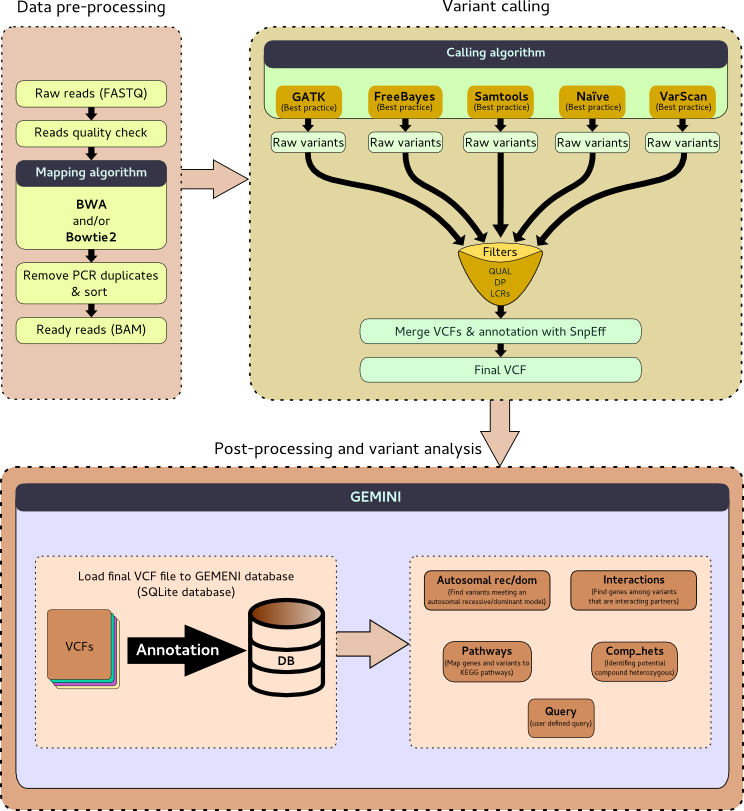

# Introduction

Exome sequencing means that all protein-coding genes in a genome are sequenced.

In Humans, there are ~180,000 exons that makes up 1% of the human genome which
contain ~30 million base pairs. Mutations in the exome have usually a higher
impact and more severe consequences, than in the remaining 99% of the genome.

With exome sequencing, one can identify genetic variation that is responsible
for both Mendelian and common diseases without the high costs associated with
whole-genome sequencing. Indeed, exome sequencing is the most efficient way to
identify the genetic variants in all of an individual's genes. Exome sequencing
is cheaper also than whole-genome sequencing. With a high coverage rate of
100+ DP, 98% of all exons are covered.

Items where exome sequencing can't identify genetic variation in:

- *All genes*

>  Not all genes are in your exon data, especially those buried in stretches of
>  repeats out towards the chromosome tips, aren’t part of exome sequencing chips

- The handful of *genes that reside in mitochondria*, rather than in the nucleus
- *"Structural variants"* such as translocations and inversions, that move or
flip DNA but don’t alter the base sequence.
- *Triplet repeat disorders*, such as Huntington’s disease and fragile X syndrome
can't be detected.
- Other *copy number variants* will remain beneath the radar, for they too don’t
change the sequence, but can increase disease risk.
- *Introns*

>  A mutation that jettisons a base in an intron can have dire consequences:
>  inserting intron sequences into the protein, or obliterating the careful
>  stitching together of exons, dropping gene sections. For example, a mutation
>  in the apoE4 gene, associated with Alzheimer’s disease risk, puts part of an
>  intron into the protein.

- *"Uniparental disomy"*

>  Two mutations from one parent, rather than one from each, appear the same in
>  an exome screen: the kid has two mutations. But whether mutations come from
>  only mom, only dad, or one from each has different consequences for risk to
>  future siblings. In fact, a case of UPD reported in 1988 led to discovery of
>  the cystic fibrosis gene.

- *Control sequences*

>  Much of the human genome tells the exome what to do, like a gigantic
>  instruction manual for a tiny but vital device. For example, mutations in
>  microRNAs cause cancer by silencing various genes, but the DNA that encodes
>  about half of the 1,000 or so microRNAs is intronic – and therefore not on
>  exome chips.

- *Epigenetic changes*

>  Environmental factors can place shielding methyl groups directly onto DNA,
>  blocking expression of certain genes. Starvation during the “Dutch Hunger
>  Winter” of 1945, for example, is associated with schizophrenia in those who
>  were fetuses at the time, due to methylation of certain genes. Exome
>  sequencing picks up DNA sequences – not gene expression

- *Gene-gene (epistatic) interactions*

>  One gene affecting the expression of another can explain why siblings with the
>  same single-gene disease suffer to a different extent. For example, a child
>  with severe spinal muscular atrophy, in which an abnormal protein shortens
>  axons of motor neurons, may have a brother who also inherits SMA but has a
>  milder case thanks to a variant of a second gene that extends axons.
>  Computational tools will need to sort out networks of interacting genes
>  revealed in exome sequencing.

We will follow the pipeline:



> ###  Tip:
>
> For a more detailed tutorial, have a look at the [tutorial on diploid variant calling](https://github.com/nekrut/galaxy/wiki/Diploid-variant-calling). It
> follows a similar pipeline using genome in the bottle data, but with more details
> particularly on the theory behind.
{: .tip}

> ### Agenda
>
> In Exome-Seq tutorial, we will deal with:
>
> 1. [Data-preprocessing](#data-preprocessing)
> 2. [Variant calling](#variant-calling)
> 3. [Post-processing](#post-processing)
> 4. [Variant analysis](#variant-analysis)
{: .agenda}

# Data-preprocessing

In this tutorial, a child has a yet unknown disease. His parents are healthy.
We will try to identify the genetic variation that is responsible for the disease
using the exome sequencing data from both parents and the child.

Most of the data pre-processing have already be done on the raw exome sequencing.
The raw exome sequences were mapped on `hg19` version of the human genome. So,
for each family member, we will start with one BAM file with mapping results.

> ###  Hands-on: Data pre-processing
>
> 1.  Import all 3 BAM's into a new history:
>     - [Father](https://zenodo.org/record/60520/files/father.bam)  
>     - [Mother](https://zenodo.org/record/60520/files/mother.bam)  
>     - [Child = Patient](https://zenodo.org/record/60520/files/patient.bam)
> 2. Specify the used genome for mapping (for each dataset)
>     1. Click on **Edit attributes** (pencil icon on right panel)
>     2. Select `Human Feb 2009` on **Database/Build**
>     3. Save it
> 2. Import the reference genome :
>    1. Go on **Data Libraries** in **Shared data** (top panel on Galaxy's interface)
>    2. Click on **Training Data**
>    3. Select `hg19`
>    4. Click on **Import selected datasets into history** (just below the top panel)
>    5. Import it
>    6. Convert it from 2bit to fasta with **twoBitToFa** from **Convert Formats**
> 2. Follow the next steps for father data and then apply the generated workflow on other datasets
>
{: .hands_on}

# Variant calling

## Generating FreeBayes calls

To call our variants, we will use **FreeBayes**. **FreeBayes** is a Bayesian genetic
variant detector designed to find small polymorphisms, specifically SNPs
(single-nucleotide polymorphisms), indels (insertions and deletions), MNPs
(multi-nucleotide polymorphisms), and complex events (composite insertion and
substitution events) smaller than the length of a short-read sequencing alignment.

> ###  Hands-on: Generating FreeBayes calls
>
> 1. Select **FreeBayes** in the tool menu (left panel of Galaxy's interface)
> 2. Run **FreeBayes**:
>    1. Load reference genome from local cache
>    2. Select the father data as the BAM dataset
>    3. Use `Human (Homo sapiens): hg19` as reference genome
>    4. Choose other default settings
>    5. Execute
>
{: .hands_on}

:+1::tada: **Congratulations!** :tada::+1:
You have created you first VCF file, one of most complicated
file formats in bioinformatics. In such a file your called variants are stored
with one variant per line (+header lines).

## Post-processing FreeBayes calls

Before we can continue, we need to post-process this dataset by breaking
compound variants into multiple independent variants and filter the VCF file
to simplify the variant representation.

> ###  Hands-on: Post-processing FreeBayes calls
>
> 1. Split your allelic primitives (gaps or mismatches) into multiple VCF lines
> with **VcfAllelicPrimitives** from **VCF Tools** :
>    1. Select the FreeBayes output file as VCF dataset
>    2. Make sure **Maintain site and allele-level annotations when decomposing** and
>    **Maintain genotype-level annotations when decomposing** are set to `Yes`
>5. Filter your VCF file with **SnpSift Filter** from **Annotation** to
>only conserve SNPs with a quality >= 30 and a coverage >= 10
>
{: .hands_on}

> ###  Tip:
>
> Have a look at the examples that can help you construct the correct expression for the Filter criteria.
{: .tip}

## Annotate your variants

To annotate the variants, we use the [dbSNP](https://www.ncbi.nlm.nih.gov/SNP/),
the NCBI database of genetic variation and then `hg19` database with **SnpEff**.

> ###  Hands-on: Annotating variants
>
> 1. Import the [dbSNP_138.hg19.vcf](https://zenodo.org/record/60520/files/dbSNP_138.hg19.vcf)
>in your history (Build 138 data, available on the human assembly (GRCh37/hg19))
> 2. Assign the known variant ID from dbSNP to your variants, using
>**SnpSift Annotate** from **Annotation**
> 3. Annotate your variants with some functional information
>    1. Download `hg19` database with **SnpEff Download** from **Annotation**
>    2. Launch annotation of your variants with **SnpEff** from
>    **Annotation**, using the downloaded database (reference genome from your
>    history)
>
{: .hands_on}

Look at your **"INFO"** column again in the generated VCF file. You will get some gene names for your variants, but also a predicted impact and if your variant is located inside of a known gene.

> ###  Tip:
>
> You can also have a look at the HTML report. It contains a number of useful
metrics such as distribution of variants across gene features.
{: .tip}

## Getting the final VCF

At this stage, you have your first annotated variants and in theory everything
you need for your further studies is included in your VCF file.

> ###  Hands-on: Getting VCF file
>
> 1. Extract your history to a workflow 
> 2. Apply this workflow to the other BAM files 
>
>    > ###  Comments
>    > You should now have 3 annotated variant files, from mother, father and the
>    > patient. It might be a good idea to rename them accordingly.
>    {: .comment}
>
> 3. Combine all 3 files into one with the tool **VCFcombine** from
> **VCF Tools** 
>
{: .hands_on}

Now that we have an annotated VCF file it is time to peek inside our variation data

# Post-processing

> ###  Hands-on: Post-processing
>
> 1. Create a pedigree file (PED) like this
>
> ```
> #family_id	sample_id	paternal_id	maternal_id	sex	phenotype	ethnicity
> family1	RS024M-MOTHER	-9	-9	2	1	CEU
> family1	RS024V-FATHER	-9	-9	1	1	CEU
> family1	RS024P-PATIENT	RS024V-FATHER	RS024M-MOTHER	1	2	CEU
> ```
>
> 2. Use the tool **GEMINI load** in **Gemini** to create a database out of your
> combined VCF file and the PED file.
>
>    > ###  Comments
>    >
>    > This creates a sqlite database. To see the content of the database use
>    > **GEMINI_db_info**
>{: .comment}
>
{: .hands_on}

Either way you have now a database with all your variants, with pedigree
relations, additional annotations and most importantly its fast to search.
> ###  Tip:
>
> Have a look at all different **Gemini** tools and run as many tools as possible on
> your GEMINI databases. Try to get a feeling of what is possible with a variant
> database in GEMINI.
{: .tip}

# Variant analysis

**GEMINI query** is the most versatile of all the GEMINI tools. You can use it to
ask 'interesting' questions in simple SQL (see the GEMINI [handbook](http://journals.plos.org/ploscompbiol/article?id=10.1371/journal.pcbi.1003153) on its usage).

### **GEMINI query** examples:
- `select chrom, start, end from variants` will show you some information on all
variants that were found in any of the three samples
- `select chrom, start, end, (gts).(*) from variants` will also show you the
genotype of each sample also with the help wildcards
- `select chrom, start, end, gene, impact, (gts).(*) from variants v where v.impact_severity='HIGH'`
will show you some more information and filter out only those variants that
have a high impact
- `select chrom, vcf_if, start, end, ref, alt, gene, impact, (gts).(*) from variants v where v.impact_severity='HIGH'`
also shows you the reference allele and the alternative allele and the RSID for
the SNP if it exists

> ###  Tip:
>
> Switch on the `--header` parameter**
>
> > ###  Tip:
> >
> > To go further on **Gemini**, you can have a look at the following tutorials:
> >
> > - [Introduction](https://s3.amazonaws.com/gemini-tutorials/Intro-To-Gemini.pdf)
> > - [Identifying *de novo* mutations underlying Mendelian disease](https://s3.amazonaws.com/gemini-tutorials/Gemini-DeNovo-Tutorial.pdf)
> > - [Identifying autosomal recessive variants underlying Mendelian disease](https://s3.amazonaws.com/gemini-tutorials/Gemini-Recessive-Tutorial.pdf)
> > - [Identifying autosomal dominant variants underlying Mendelian disease](https://s3.amazonaws.com/gemini-tutorials/Gemini-Dominant-Tutorial.pdf)
> {: .tip}
> And for a more detailed tutorial on variant data generation in Galaxy, have a
> look at the [tutorial on diploid variant calling](https://github.com/nekrut/galaxy/wiki/Diploid-variant-calling).
{: .tip}
