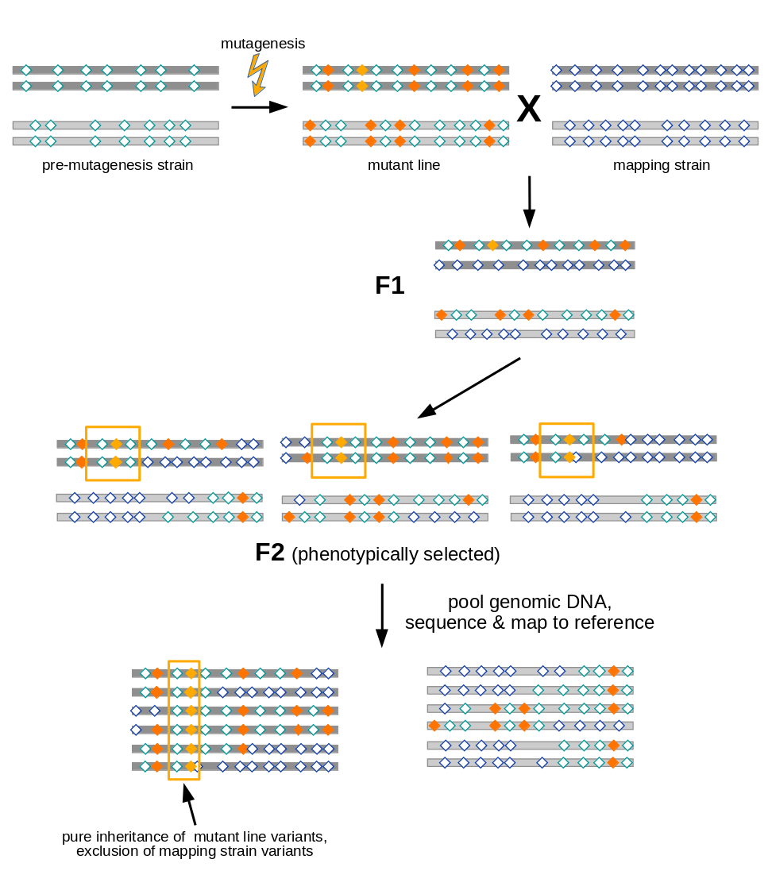

# Introduction
{:.no_toc}

In order to map and identify phenotype-causing mutations efficiently from a
single experiment, modern genetic research aims at combining classical genetic
mapping concepts with the power of next-generation-sequencing.

After having obtained, *e.g.*, from a forward genetic screen, a mutant strain
of an organism with a particular phenotype, the classical approach towards
identification of the underlying causative mutation would be to

1. perform mapping crosses to probe for linkage between the unknown mutation
   and selected markers with known location on the genome in order to determine
   the approximate genomic region that the mutation resides in, then
2. sequence candidate DNA stretches in this region to identify the precise
   nature of the mutation.

Modern approaches, in contrast, use just one set of genome-wide sequencing data
obtained from mapping-cross progeny and suitable parent strains to
simultaneously:

* discover available marker mutations for linkage analysis,
* map the causative mutation using these markers, and
* identify candidate mutations.

Since it uses sequencing data already at the mapping step, this process is
called **mapping-by-sequencing**.

Since genome-wide sequencing will often reveal a few hundreds to many thousands
of marker variants that should be considered together in the linkage analysis,
mapping-by-sequencing data is typically analyzed with dedicated computational
tools. For Galaxy, the **MiModD** suite of tools offers efficient and flexible
analysis workflows compatible with a variety of mapping-by-sequencing
approaches.

> ###  Further reading
> The MiModD documentation has its own chapter on supported
> [mapping-by-sequencing schemes](http://mimodd.readthedocs.io/en/latest/nacreousmap.html)
> not covered here.
{: .tip}

In this tutorial we are going to use several of these tools to map and identify
a point mutation in an *Arabidopsis thaliana* strain from whole-genome
sequencing data. This will demonstrate one particular kind of linkage analysis
supported by **MiModD** called *Variant Allele Frequency Mapping*.

### Variant Allele Frequency Mapping

As illustrated in Figure 1, variant allele frequency mapping analyzes marker
variant inheritance patterns in pooled F2 recombinants selected for the
mutation to be mapped.

A mutant line established for any organism - in the figure we assume a diploid
organism with just two pairs (dark and light grey) of chromosomes - will harbor
two types of variants (diamonds):
- variants induced during mutagenesis (orange), among them the causative
  variant responsible for the mutant phenotype (yellow)
- variants (with respect to the species' reference genome) that were
  present in the premutagenesis strain (green open diamonds)

For mapping the causative mutation, additional variants (blue open diamonds)
are introduced through a cross to a mapping strain and F2 progeny is selected
for the mutant phenotype. While each individuum in the F2 generation carries
its uniquely recombined variant pattern (3 possible outcomes for the diploid
genome are shown in the figure), this phenotypic selection will work against
mapping strain variants in the vicinity (yellow boxes) of the causative
variant. Hence, when the recombined DNA from phenotypic F2 progeny gets pooled
and sequenced, the causative variant can be found by looking for a region for
which all sequenced reads support variant alleles found in the original mutant
line, rather than mapping strain variant alleles.

> ### Agenda
>
> 1. TOC
> {:toc}
>
{: .agenda}

# Data Preparation

In this tutorial we are going to (re-)identify the recessive causative mutation
in a late-flowering mutant line of *Arabidopsis thaliana*.

> ###  Comment
> **MiModD** was developed as a successor of the older and now unmaintained
> *CloudMap* suite of tools, but also uses some key concepts first implemented
> in the command line package *SHOREmap*.
> The data used in this tutorial represent a subsample of the
> [SHOREmap proof-of-principle data](http://bioinfo.mpipz.mpg.de/shoremap/examples.html)
> (specifically of the `OCF2` and `Ler` datasets).
{: .comment}

The mutant line was obtained from a mutagenesis screen on the **Col**umbia
reference background of *A. thaliana*. For mapping-by-sequencing, the line was
outcrossed to the highly polymorphic **L**andsberg ***er**ecta* background as a
source of marker variants. From this outcross, 119 F2 siblings showing the
original late-flowering phenotype were recovered and their genomic DNA was
pooled and subjected to whole-genome sequencing.
Together with whole-genome sequencing data of a pure L*er* background strain,
this outcrossed pool data forms the starting point of our analysis.
The L*er* strain sample, thus, can inform us about the markers that the
outcrossed F2 pool *could* have inherited and exclusion of L*er* markers from
a particular genomic region from the F2 pool provides evidence that the
phenotype causing variant lies close to this region. With respect to
[Figure 1](#figure-1), this means that we will only use "blue diamond" marker
variants introduced through the mapping cross for the linkage analysis and
ignore potentially informative (green and orange) variants found in the
original mutant line.

For your convenience, the sequenced reads from both datasets have already been
mapped (using **Bowtie2**) to the *A. thaliana* Col reference genome (version
TAIR10) so the two datasets take the form of BAM files with the mapping results
(see the tutorial on
[NGS data mapping](../../../sequence-analysis/tutorials/mapping/tutorial.html)
if you do not know what this means).

> ###  Hands-on: Data upload and preprocessing
>
> > ###  Tip
> > This section assumes that you already know
> >
> > - how to upload data to Galaxy via links
> > - edit dataset attributes
> > - do some basic text manipulation on datasets
> >
> > An excellent introduction into these topics can be found in the
> > [From peaks to genes](../../../introduction/tutorials/galaxy-intro-peaks2genes/tutorial.html)
> > tutorial (specifically, in the sections on
> > [Data upload](../../../introduction/tutorials/galaxy-intro-peaks2genes/tutorial.html#data-upload)
> > and
> > [File preparation](../../../introduction/tutorials/galaxy-intro-peaks2genes/tutorial.html#file-preparation)).
> {: .tip}
>
> 1. Import the two BAM datasets representing the:
>    - [L*er* mapping strain](https://zenodo.org/record/1098034/files/Ler_mapping_strain.bam)
>    - [outcrossed F2 pool](https://zenodo.org/record/1098034/files/outcrossed_F2.bam)
> 2. Specify the genome that was used at the reads mapping step
>    1. Click on **Edit attributes** (the pencil icon displayed with the dataset)
>    2. As the **Database/Build** select `Arabidopsis thaliana TAIR10`
>    3. **Save** the edited attributes
> 3. Import the reference genome
>
>    > ###  Tip
>    > This step is only necessary if the TAIR10 version of the *A. thaliana*
>    > genome is not available as a built-in genome on your Galaxy server.
>    {: .tip}
>
>    1. Upload the reference genome using the URL:
>       `https://www.arabidopsis.org/download_files/Genes/TAIR10_genome_release/TAIR10_chromosome_files/TAIR10_chr_all.fas`
>    2. Use **Replace parts of text**  to truncate the title
>       lines in the fasta dataset to just the bare chromosome names. Set:
>       - the **Find pattern** to `^>(\w+).*`
>
>         This will find entire fasta title lines, or more specifically, any
>         lines starting with `>` followed by at least one letter, digit or
>         underscore.
>       - the **Replace with** pattern to `>chr$1`
>
>         The `$1` in it refers to the parenthesized part of the find pattern,
>         *i.e.*, just the substring of letters/digits/underscores directly
>         following the `>`.
>       - **Find-Pattern is a regular expression** to `Yes`
>    3. Make sure the datatype of the resulting dataset is set to `fasta` and
>       give the dataset a nice name (*e.g.*, TAIR10 reference).
>    4. At this point you can delete the originally downloaded dataset.
{: .hands_on}

# Joint Variant Calling and Extraction

A hallmark of all mapping-by-sequencing analyses is that one would like to
follow the fate of variants through genetic crosses. In this tutorial, for
example, we would like to determine, for every marker variant provided by the
L*er* background, at what frequency it got inherited by the outcrossed F2 pool.
For such analyses to work reliably, it is best to call variants jointly for all
relevant samples because this allows the variant caller to give us per-sample
variant call statistics for all sites at which **any** sample is found to have
a non-wt genotype. In our case, this means that the variant caller will report
any variants it finds for the L*er* background sample along with the call
statistics for the outcrossed F2 pool at that same site - even if the variant
allele contributes very little to the pool and would, thus, have been
disregarded in a standard single-sample analysis.

Here, we are using the **MiModD Variant Calling** tool for joint variant
calling for our two samples. This tool outputs variant call statistics across
all sites and all samples in the compact binary BCF format. We can then use
the **MiModD Extract Variant Sites** tool to extract sites, for which at least
one sample appears to have a non-wt genotype, and report them in VCF format.

> ###  Hands-on: Variant Calling
>
> 1. Use **MiModD Variant Calling**  to generate combined
>    variant call statistics:
>    - Select the **reference genome** to call variants against.
>
>      If your Galaxy server offers version TAIR10 of the *A. thaliana*
>      reference as a **built-in genome**, you can go ahead and use it.
>      Otherwise, download and preprocess the reference as described under
>      Data Preparation and use it as a **genome from my history**.
>    - As the **Aligned reads input datasets** for the analysis select the two
>      BAM datasets representing the two samples (use the `Control` key on the
>      keyboard to select multiple datasets from the list.
>    - **Execute** the job
> 2. Run **MiModD Extract Variant Sites**  with
>    - **BCF input file** set to the BCF dataset generated in the previous
>      step.
>
> > ###  Questions
> >
> > 1. Approximately how many variants did get extracted?
> > 2. Does this number surprise you?
> >
> > 

> >   
Click to view answers

> >   <ol type="1">
> >     <li>You can click on the extracted variants dataset in your history to
> >     get more details about it. You should see that the file has an
> >     estimated 130,000 lines and since, in VCF format, apart from a number
> >     of header lines, one variant gets reported per line, this roughly
> >     equals the number of variants in the dataset.</li>
> >     <li>The huge number of variants reflects the fact that the L<em>er</em>
> >     mapping strain is really quite diverged from the Col reference
> >     background that the mutant was generated in and, thus, offers many
> >     marker variants for mapping.
> >     In total, the L<em>er</em> genome harbors > 400,000 single nucleotide
> >     variants compared to the Col reference, but to keep the tutorial
> >     datasets small we only provided reads mapping to 2 out of 5
> >     chromosomes. In addition, we provided really low-coverage data
> >     even for those two chromosomes so our analysis will miss many true
> >     variants and contain many questionable variant calls that may represent
> >     false-positives, but an analysis based on such a large overall number
> >     of variants is robust enough to provide useful results regardless.
> >     </li>
> >   </ol>
> > 

> >
> {: .question}
{: .hands_on}

# Linkage Analysis

The extracted variants dataset obtained in the previous step contains
information about thousands of sites that can be used as markers to map the
causative mutation in the F2 pool. We will now analyze the data with the
**MiModD NacreousMap** tool in **Variant Allele Frequency** mapping mode to
identify these markers and look for linkage between them and the causative
mutation.

> ###  Hands-on: Linkage Analysis with one set of parentally contributed markers
>
> In the **MiModD NacreousMap**  interface, set
> - **type of mapping analysis to perform** to `Variant Allele Frequency
    Mapping` and
> - **data source to use** to `VCF file of variants`.
> - As the **input file with variants to analyze** select your extracted
>   variants VCF dataset obtained in the previous step.
> - As the **mapping sample name** use `outcrossed F2`.
> - Leave the **name of the related parent sample** input field empty because
>   in this two-sample there is no such sample.
> - As the **name of the unrelated parent sample** specify `Ler`.
>    > ###  Sample roles
>    > In `Variant Allele Frequency Mapping` mode the tool requires:
>    > - a **mapping sample**, which corresponds to the recombinant pool, from
>    >   which allele frequencies should be calculated
>    > - either a **related** or an **unrelated parent sample** (, or both),
>    >   from which the marker variant sites to use in the linkage analysis
>    >   will be determined. A related parent sample is related (or identical)
>    >   to the original mutant line by descent and provides information about
>    >   (some of) the variants present in that line, while an unrelated parent
>    >   sample provides information about the mapping strain variants
>    >   introduced in the mapping cross. If both a related and an unrelated
>    >   parent sample are available, the tool can also use the marker sets
>    >   from both sides for the linkage analysis.
>    >
>    {: .comment}
> With these settings, we base the linkage analysis on crossed-in variants
> only, *i.e.*, the tool will look for variants, for which the L*er* sample
> appears homozygous mutant, and determine the contribution of each such
> variant allele to the recombinant pool highlighting regions of low
> contribution, *i.e.*, with suspected linkage to the causative variant, in its
> output.
>
> Running this job will generate two datasets, one with linkage tables for each
> chromosome in the *A. thaliana* genome, one with graphical representations
> of the data.
>
> > ###  Questions
> >
> > 1. Have a look at the linkage plots dataset generated by the tool run. In
> >    which interval on which chromosome would you expect the causative
> >    mutation?
> > 2. Are the per-marker scatter plots and the histogram plots in agreement?
> > 3. What about those `No markers found!` messages (you saw them, right?)
> >    that the tool printed?
> >
> > 

> >   
Click to view answers

> >   <ol type="1">
> >     <li>The plots suggest that the causative variant is likely to be found
> >     in the region from 18,000,000 to 19,000,000 on chr2.</li>
> >     <li>
Look at the y axis labels! The scatter plots show the rates at
> >     which marker sites appear to recombine with the causative mutation
> >     in the pool of F2 recombinants, while the histograms show linkage
> >     evidence. Hence, a dip of the scatter plot regression line towards zero
> >     corresponds to a peak in the histograms and the two kinds of plots are,
> >     thus, in very good agreement for this analysis.

> >     
In general, the histogram plots are easier to digest and often
> >     provide more precise mapping intervals, and are often all you need for
> >     mapping a causative variant. The per-marker scatter plots, on the other
> >     hand, are closer to the raw data and can sometimes reveal additional
> >     irregularities in the data that may indicate problems with the mapping
> >     cross or unexpected factors influencing the inheritance pattern.

> >     </li>
> >     <li>Since we included only reads mapping to chromosome 1 or 2 in
> >     the original BAM files, the tool will not be able to detect any markers
> >     for the other chromosomes.</li>
> >   </ol>
> > 

> >
> {: .question}
{: .hands_on}

# Identifying Candidate Mutations

With the mapping results obtained above we can now try to get a list of
candidates for the causative mutation. Here is what we know about this mutation
so far:

* The F2 recombinant pool should appear homozygous mutant for it.

  This is because the F2 recombinants got selected based on the phenotype of
  the recessive mutation so we can assume that all individuals in the pool were
  homozygous for it.

* The L*er* strain should not carry it.

* It should reside in the genomic region identified in the previous step.

> ###  Hands-on: Variant Filtering
>
> With the above information, we can run **MiModD VCF Filter** 
> to obtain a new VCF dataset with only those variants from the originally
> extracted ones that fulfill all three criteria. In the tool interface,
>
> - select as **VCF input file** the extracted variants dataset from your
>   history
> - add a **Sample-specific Filter** and set its
>   - **sample** to `outcrossed F2`
>   - **genotype pattern(s) for the inclusion of variants** to `1/1`
>
>   These settings will make the filter retain only variants for which the F2
>   pool has a `1/1`, *i.e.*, homozygous mutant genotype.
> - add another **Sample-specific Filter** and set its
>   - **sample** to `Ler`
>   - **genotype pattern(s) for the inclusion of variants** to `0/0`
>
>   This filter will retain only variants for which the mapping strain sample
>   has a homozygous wt genotype.
> - add a **Region Filter** and set its
>   - **Chromosome** to `chr2`
>   - **Region Start** to 18000000
>   - **Region End** to 19000000
>
>   to retain only variants falling into the previously determined mapping
>   interval.
>
>    > ###  Sample and chromosome names
>    > This is the second time in this tutorial that we ask you to type sample
>    > or chromosome names exactly as they appear in a dataset, and so you
>    > may have started wondering how you are supposed to keep track of which
>    > names are used where in your own analyses.
>    >
>    > Because this is a valid concern, the MiModD tool suite features the
>    > **MiModD File Information**  tool that can report the
>    > sample and sequence names stored in almost any dataset that you may
>    > encounter in a mapping-by-sequencing analysis (specifically, the
>    > tool can handle datasets in vcf, bcf, sam, bam and fasta format).
>    >
>    {: .comment}
>
> Running the job yields a new VCF dataset with variants that passed all
> filters.
>
> > ###  Questions
> >
> > 1. How many variants passed the filters?
> > 2. How many variants would you have to consider as candidates if you did
> >    not have any mapping information?
> >
> > 

> >   
Click to view answers

> >   <ol type="1">
> >     <li>If you used the suggested mapping interval of 1Mb on chr2, you
> >     should have retained 5 variants. Filtering is a really powerful way to
> >     reduce the number of variants to consider!</li>
> >     <li>Rerunning the job with the region filter removed shows that across
> >     the two chromosomes, for which the input datasets provided sequencing
> >     reads, there are 50 variants for which the pool appears homozygous
> >     mutant and for which the L<em>er</em> strain is homozygous wt.</li>
> >   </ol>
> > 

> >
> {: .question}
{: .hands_on}

Not all of the retained variants are equally likely candidates for being the
causative mutation. Since the input datasets consist of reads from whole-genome
sequencing, as opposed to exome sequencing, some of the variants may fall in
intergenic regions or introns where they are unlikely to cause a phenotype.
Other variants may fall in coding regions, but may be silent on the protein
level. Hence, we can prioritize our candidate variants after annotating them
with predicted functional effects.

> ###  Hands-on: Variant Annotation
>
> To annotate our variants we are going to use **SnpEff** with the
> `athalianaTair10` genome database as the source of functional genomic
> annotations, then generate a human-friendly variant report with the
> **MiModD Report Variants**  tool.
>
> 1. Use **SnpEff Download**  (Galaxy tool version 4.1.0) to
>    download genome database `athalianaTair10`.
>
>    > ###  SnpEff versions
>    > SnpEff genome databases can only be used with the specific version of
>    > SnpEff they were built for. Make sure you are using version `4.1.0` of
>    > **SnpEff Download**  in this and of **SnpEff Variant
>    > effect and annotation**  in the next step.
>    > If your Galaxy server offers newer versions of these tools by default,
>    > you may be able to request version `4.1.0` explicitly using the
>    > **Versions** button at the top right of the tool interface.
>    {: .comment}
> 2. In the **SnpEff Variant effect and annotation**  interface,
>    set:
>    - **Sequence changes (SNPs, MNPs, InDels)** to your filtered VCF dataset
>    - **Genome source** to `Reference genome from your history`
>    - **SnpEff4.1 Genome Data** to your just downloaded genome dataset
>    - under **Annotation options** check `Use 'EFF' field compatible with
>      older versions (instead of 'ANN')`
>
>      This last setting is required for compatibility of the resulting dataset
>      with the current version of **MiModD Report Variants** .
>
>    Running this job will produce another VCF dataset with the functional
>    annotation data added to its INFO column. Inspecting this dataset is not
>    particularly convenient, but you can turn it into a more user-friendly
>    report by
> 3. using **MiModD Report Variants**  and setting:
>    - **The VCF input with the variants to be reported** to the annotated
>      variants dataset generated by **SnpEff**
>    - the **Format to use for the report** to `HTML`
>    - **Species** to `A. thaliana`.
>
>      The species information can be used by the tool to enrich the output
>      with species-specific database and genome browser links.
>
>    > ###  Comment
>    > Variant reports in html format are meant to be used on relatively small
>    > lists of candidate variants like in this example. If the input VCF
>    > contains > 1000 variants, the relatively large size of the reports and
>    > slow loading in the browser may become annoying. In this case, or if you
>    > experience formatting problems with the generated html in your browser,
>    > it may be better to choose `Tab-separated plain text` as the report
>    > format although the output will then lack those convenient hyperlinks.
>    {: .comment}
>
> > ###  Questions
> >
> > The published confirmed mutations in the mutant line are *chr2:18,774,111
> > C→T* and *chr2:18,808,927 C→T*. The latter was shown through follow-up
> > experiments to be the causative variant.
> >
> > 1. What are the functional effects of these two mutations according to the
> >    report?
> > 2. What biological functions are described for the two genes? How do these
> >    relate to the phenotype of our mutant line?
> >
> > 

> >   
Click to view answers

> >   <ol type="1">
> >     <li>The C→T transition at 18,774,111 results in a premature
> >     translational stop for the transcript AT2G45550.1. The C→T transition
> >     at 18,808,927 affects a splice donor site and, thus, is likely to
> >     interfere with correct splicing of the transcript AT2G45660.1.</li>
> >     <li>From the linked gene pages at <em>TAIR</em> you can learn that the
> >     gene AT2G45550 encodes a cytochrome P450, while AT2G45660 encodes a
> >     protein called AGL20, which is known to control flowering. Thus, there
> >     is a direct connection between the late-flowering phenotype of the
> >     mutant line studied here and the known role of the gene affected by
> >     chr2:18,808,927 C→T.</li>
> >   </ol>
> > 

> >
> {: .question}
{: .hands_on}

# Conclusion
{:.no_toc}

Mapping-by-sequencing can greatly speed up and facilitate the molecular
identification of mutations recovered from mutagenesis screens. The method
makes extensive use of cross-sample comparison of variants and profits strongly
from joint variant calling to generate reliable and manageable variant
information. A combination of variant linkage analysis and filtering often
results in very small lists of candidate variants that can then be confirmed
through further experimental work. Importantly, the selection of biological
samples for sequencing determines the meaningful variant comparisons that can
be made in the bioinformatical analysis so it is important to understand the
essence of the analysis method **before** the preparation of any biological
samples.

