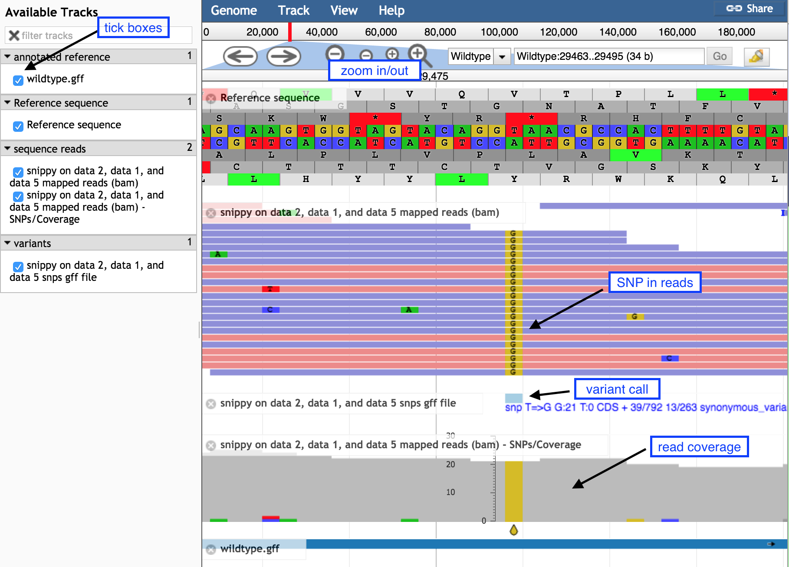
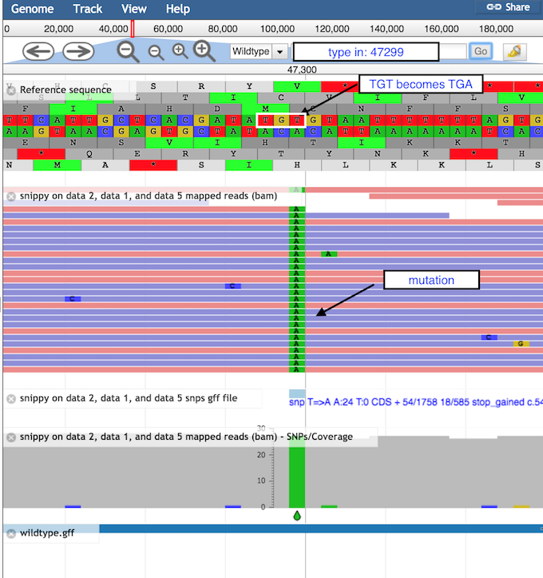

# Introduction
{:.no_toc}

Variant calling is the process of identifying differences between two genome samples. Usually differences are limited to single nucleotide polymorphisms (SNPs) and small insertions and deletions (indels). Larger structural variation such as inversions, duplications and large deletions are not typically covered by “variant calling”.

Imagine that you have been asked to find the differences between a sample that has been sequenced and a known genome. For example: You have a new sample from a patient and you want to see if it has any differences from a well known reference genome of the same species. Typically, you would have a couple of fastq read files sent back to you from the sequencing provider and either an annotated or non annotated reference genome.

In this tutorial, we will use the tool “Snippy” (link to Snippy is [here](https://github.com/tseemann/snippy)) to find high confidence differences (indels or SNPs) between our known genome and our reads. Snippy uses one tool to align the reads to the reference genome, and another tool to decide (“call”) if any of the resulting discrepancies are real variants or technical artifacts that can be ignored. Finally, Snippy uses another tool to check what effect these differences have on the predicted genes - truncation, frame shift or if the changes are synonomous.

For the read alignment (read mapping) step, Snippy uses BWA MEM with a custom set of settings which are very suitable to aligning reads for microbial type data. For the variant calling step, Smippy uses Freebayes with a custom set of settings. snpeff is then used to describe what the predicted changes do in terms of the genes themselves.

The Galaxy wrapper for Snippy has the ability to change some of the underlying tool settings in the advanced section but it is not recommended.

More can be read about SNP calling [here](https://en.wikipedia.org/wiki/SNV_calling_from_NGS_data)

> ### Agenda
>
> In this tutorial, we will deal with:
>
> 1. TOC
> {:toc}
>
{: .agenda}

# Get the data

The data for today is a subset of a real dataset from a Staphylococcus aureus bacteria.
We have a closed genome sequence and an annotation for our "wildtype" strain.
We have used a whole genome shotgun approach to produce a set of short sequence reads on an Illumina DNA sequencing instrument for our mutant strain.

- The reads are paired-end
- Each read is on average 150 bases
- The reads would cover the original wildtype genome to a depth of 19x

The files we will be using are:

- `mutant_R1.fastq` & `mutant_R2.fastq` - the read files in fastq format.
- `wildtype.fna` - The sequence of the reference strain in fasta format.
- `wildtype.gbk` - The reference strain with gene and other annotations in genbank format.
- `wildtype.gff` - The reference strain with gene and other annotations in gff3 format.

This data is available at Zenodo using the following [link](https://doi.org/10.5281/zenodo.582600).

> ###  Hands-on: Get the data
>
> 1.  Import all of the following files into a new history:
>     - [mutant_R1.fastq](https://zenodo.org/record/582600/files/mutant_R1.fastq)
>     - [mutant_R2.fastq](https://zenodo.org/record/582600/files/mutant_R2.fastq)
>     - [wildtype.fna](https://zenodo.org/record/582600/files/wildtype.fna)  
>     - [wildtype.gbk](https://zenodo.org/record/582600/files/wildtype.gbk)
>     - [wildtype.gff](https://zenodo.org/record/582600/files/wildtype.gff)
> 
>     ```
>     https://zenodo.org/record/582600/files/mutant_R1.fastq
>     https://zenodo.org/record/582600/files/mutant_R2.fastq
>     https://zenodo.org/record/582600/files/wildtype.fna
>     https://zenodo.org/record/582600/files/wildtype.gbk
>     https://zenodo.org/record/582600/files/wildtype.gff
>     ```  
>
>     > ###  Tip: Importing data via links
>     >
>     > * Copy the link location
>     > * Open the Galaxy Upload Manager
>     > * Select **Paste/Fetch Data**
>     > * Paste the link into the text field
>     > * Press **Start**
>     {: .tip}
>
{: .hands_on}

# Find variants with Snippy

We will now run the Snippy tool on our reads, comparing it to the reference. 

Snippy is a tool for rapid bacterial SNP calling and core genome alignments. Snippy finds SNPs between a haploid reference genome and your NGS sequence reads. It will find both substitutions (snps) and insertions/deletions (indels).

If we give Snippy an annotated reference, it will silently run a tool called SnpEff which will figure out the effect of any changes on the genes and other features. If we just give Snippy the reference sequence alone without the annotations, it will not run SnpEff.

We have an annotated reference and so will use it in this case.

> ###  Hands-on: Run Snippy
>
> 1. **Snippy**  with the following parameters
>   - "Reference File" to the `wildtype.gbk` file
>   - "Single or Paired-end reads" to `Paired`
>   - "Select first set of reads" to `mutant_R1.fastq`
>   - "Select second set of reads" to `mutant_R2.fastq`
>   - Select all outputs
>
{: .hands_on}

# Examine Snippy output

Snippy has taken the reads, mapped them against the reference using BWA MEM, looked through the resulting BAM file and found differences using some fancy Bayesian statistics (Freebayes), filtered the differences for sensibility and finally checked what effect these differences will have on the predicted genes and other features in the genome.

It produces quite a bit of output, there can be up to 10 output files.

Filename | Description
--- | ---
snps vcf file | The final annotated variants in VCF format
snps gff file | The variants in GFF3 format
snps table | A simple tab-separated summary of all the variants
snps summary  | A summary of the SNPs called
log file  | A log file with the commands run and their outputs
aligned fasta | A version of the reference but with - at position with depth=0 and N for 0 < depth < --mincov **(does not have variants)**
consensus fasta | A version of the reference genome with all variants instantiated
mapping depth | A table of the mapping depth
mapped reads bam  | A BAM file containing all of the mapped reads
outdir  | A tarball of the Snippy output directory for inout into Snippy-core if required

We will now have a look at the contents of the SNP table file (`snippy on data XX, data XX and data XX table`):

```
1   2   3   4   5   6   7   8   9   10  11  12  13  14
CHROM   POS TYPE    REF ALT EVIDENCE    FTYPE   STRAND  NT_POS  AA_POS  EFFECT  LOCUS_TAG   GENE    PRODUCT
Wildtype    24388   snp A   G   G:22 A:0    CDS +   1/702   1/233   initiator_codon_variant c.1A>G p.Met1?  WILD_00022  walR    Transcriptional regulatory protein WalR
Wildtype    29479   snp T   G   G:21 T:0    CDS +   39/792  13/263  synonymous_variant c.39T>G p.Gly13Gly   WILD_00026  yycJ    Putative metallo-hydrolase YycJ
Wildtype    47299   snp T   A   A:24 T:0    CDS +   54/1758 18/585  stop_gained c.54T>A p.Cys18*    WILD_00043  mecR1   Methicillin resistance mecR1 protein
Wildtype    102969  snp G   C   C:16 G:0    CDS -   87/1281 29/426  synonymous_variant c.87C>G p.Gly29Gly   WILD_00093  spa Immunoglobulin G-binding protein A
Wildtype    103048  snp T   A   A:20 T:0    CDS -   8/1281  3/426   missense_variant c.8A>T p.Lys3Met   WILD_00093  spa Immunoglobulin G-binding protein A
Wildtype    103379  del GAA GA  GA:11 GAA:0                             
Wildtype    106602  snp T   G   G:21 T:0    CDS -   993/993 331/330 stop_lost&splice_region_variant c.993A>C p.Ter331Tyrext*?   WILD_00097  yfiY    putative siderophore-binding lipoprotein YfiY
Wildtype    109833  snp T   A   A:16 T:0    CDS +   1/1755  1/584   initiator_codon_variant c.1T>A p.Leu1?  WILD_00100  iucC_1  Aerobactin synthase
Wildtype    114540  del ATT AT  AT:25 ATT:0 CDS +   1717/1737   573/578 frameshift_variant c.1717delT p.Cys573fs    WILD_00102  iucA    N(2)-citryl-N(6)-acetyl-N(6)-hydroxylysine synthase
Wildtype    129881  mnp GT  AA  AA:18 GT:0  CDS +   55/708  19/235  missense_variant c.55_56delGTinsAA p.Val19Asn   WILD_00117  deoD    Purine nucleoside phosphorylase DeoD-type
Wildtype    138877  snp G   C   C:14 G:0    CDS +   1119/1545   373/514 missense_variant c.1119G>C p.Trp373Cys  WILD_00125      hypothetical protein
Wildtype    138920  snp A   G   G:10 A:0    CDS +   1162/1545   388/514 missense_variant c.1162A>G p.Lys388Glu  WILD_00125      hypothetical protein
Wildtype    160547  del GTC GC  GC:18 GTC:0                             
Wildtype    160552  del CTA CA  CA:20 CTA:0                             
Wildtype    190866  del GTT GT  GT:18 GTT:0 CDS -   28/1356 10/451  frameshift_variant c.28delA p.Asn10fs   WILD_00166  brnQ    Branched-chain amino acid transport system 2 carrier protein
```

> ###  Question
> 
> 1. Which types of variants have been found?
> 2. What is the third variant called?
> 3. What is the product of the mutation?
> 4. What might be the result of such a mutation?
>    
> <details>
> <summary>Click to view answers</summary>
> <ol type="1">
>    <li>In the 3rd column, you have "snp" for SNP, "del" for deletion, "mnp" for </li>
>    <li>This is a T&rarr;A mutation, causing a stop codon</li>
>    <li>On the 14th column, we see that The product of this gene is a methicillin resistance protein. Methicillin is an antibiotic.</li>
>    <li>This will cause a truncation in the Methicillin gene and a loss of resistance in the organism.</li>
> </ol>
> </details>
{: .question}

# View Snippy output in JBrowse

We could go through all of the variants like this and read them out of a text table, but this is onerous and doesn't really give the context of the changes very well. It would be much nicer to have a visualisation of the SNPs and the other relevant data. In Galaxy we can use a tool called JBrowse.

> ###  Hands-on: Run JBrowse
>
> 1. **JBrowse**  with the following parameters
>    - "Reference genome to display" to `Use a genome from history`
>    - "Select the reference genome" to `wildtype.fna`
>       
>       This sequence will be the reference against which annotations are displayed
>
>    - "Produce Standalone Instance" to `Yes`
>    - "Genetic Code" to `11: The Bacterial, Archaeal and Plant Plastid Code`
>    - "JBrowse-in-Galaxy Action" to `New JBrowse Instance`
>    - "Track Group"
>       
>        We will now set up three different tracks - these are datasets displayed underneath the reference sequence (which is displayed as nucleotides in FASTA format). We will choose to display the sequence reads (the .bam file), the variants found by snippy (the .gff file) and the annotated reference genome (the wildtype.gff)
>
>       - **Track 1 - sequence reads**: Click on `Insert Track Group` and fill it with
>           - "Track Category" to `sequence reads`
>           - Click on `Insert Annotation Track` and fill it with
>               - "Track Type" to `BAM Pileups`
>               - "BAM Track Data" to `snippy bam file`
>               - "Autogenerate SNP Track" to `Yes`
>               - "Track Visibility" to `On for new users`
>       - **Track 2 - variants**: Click on `Insert Track Group` and fill it with
>           - "Track Cateogry" to `variants`
>           - Click on `Insert Annotation Track` and fill it with
>               - "Track Type" to `GFF/GFF3/BED/GBK Features`
>               - "GFF/GFF3/BED Track Data" to `snippy snps gff file`
>               - "Track Visibility" to `On for new users`
>       - **Track 3 - annotated reference**: Click on `Insert Track Group` and fill it with
>           - "Track Cateogry" to `annotated reference`
>           - Click on `Insert Annotation Track` and fill it with
>               - "Track Type" to `GFF/GFF3/BED/GBK Features`
>               - "GFF/GFF3/BED Track Data" to `wildtype.gff`
>               - "JBrowse Track Type [Advanced]" to `Canvas Features`
>               - Click on "JBrowse Styling Options [Advanced]"
>               - "JBrowse style.label" to `product`
>               - "JBrowse style.description" to `product`
>               - "Track Visibility" to `On for new users`
{: .hands_on}

A new file will be created in your history, this contains the JBrowse interactive visualisation. We will now view its contents and play with it by inspecting the `JBrowse on data XX and data XX - Complete` file (eye icon). The JBrowse window will appear in the centre Galaxy panel.

> ###  Hands-on: Inspecting the SNPs using JBrowse
> 1. Display all the tracks and practice maneuvering around
>    1. Click on the tick boxes on the left to display the tracks
>    1. Zoom out by clicking on the `minus` button to see sequence reads and their coverage (the grey graph)
>    1. Zoom in by clicking on the `plus` button to see
>       - probable real variants (a whole column of SNPs)
>       - probable errors (single one here and there)
>
>    
>
> 2. Look at the stop SNP
>    1. Type `47299` in the coordinates box
>    2. Click on `Go` to see the position of the SNP discussed above
>
>    
>
>     > ###  Questions
>     >
>     > 1. What is the correct codon at this position?
>     > 2. What is the mutation found here?
>     >
>     >    <details>
>     >    <summary>Click to view answers</summary>
>     >    <ol type="1">
>     >    <li>The correct codon at this position is TGT, coding for the amino acid Cysteine (middle row of the amino acid translations). </li>
>     >    <li>The mutation of T &rarr; A turns this triplet into TGA, a stop codon.</li>
>     >    </ol>
>     >    </details>
>     {: .question}
>
{: .hands_on}

# Conclusion
{:.no_toc}

By running a tool such as Snippy on your read files and reference genome, we can find where the biologically important changes between genomes of different strains occur and perhaps what they mean to the phenotype.
