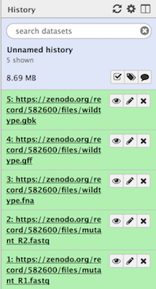
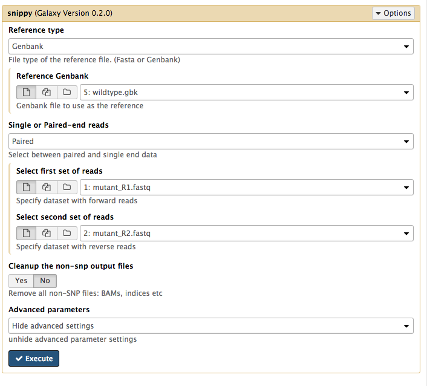

# Introduction
{:.no_toc}

Variant calling is the process of identifying differences between two genome samples. Usually differences are limited to single nucleotide polymorphisms (SNPs) and small insertions and deletions (indels). Larger structural variation such as inversions, duplications and large deletions are not typically covered by “variant calling”.

Imagine that you have been asked to find the differences between a sample that has been sequenced and a known genome. For example: You have a new sample from a patient and you want to see if it has any differences from a well known reference genome of the same species. Typically, you would have a couple of fastq read files sent back to you from the sequencing provider and either an annotated or non annotated reference genome.

In this tutorial, we will use the tool “Snippy” (link to Snippy is [here](https://github.com/tseemann/snippy)) to find high confidence differences (indels or snps) between our known genome and our reads. Snippy uses one tool to align the reads to the reference genome, and another tool to decide (“call”) if any of the resulting discrepancies are real variants or technical artifacts that can be ignored. Finally, Snippy uses another tool to check what effect these differences have on the predicted genes - truncation, frame shift or if the changes are synonomous.

For the read alignment (read mapping) step, Snippy uses BWA MEM with a custom set of settings which are very suitable to aligning reads for microbial type data. For the variant calling step, Smippy uses Freebayes with a custom set of settings. snpeff is then used to describe what the predicted changes do in terms of the genes themselves.

The Galaxy wrapper for Snippy has the ability to change some of the underlying tool settings in the advanced section but it is not recommended.

More can be read about SNP calling [here](https://en.wikipedia.org/wiki/SNV_calling_from_NGS_data)

> ### Agenda
>
> In this tutorial, we will deal with:
>
> 1. TOC
> {:toc}
>
{: .agenda}

# Section 1: Get the data

The data for today is a subset of a real dataset from a Staphylococcus aureus bacteria.
We have a closed genome sequence and an annotation for our "wildtype" strain.
We have used a whole genome shotgun approach to produce a set of short sequence reads on an Illumina DNA sequencing instrument for our mutant strain.

- The reads are paired-end
- Each read is on average 150 bases
- The reads would cover the original wildtype genome to a depth of 19x

The files we will be using are:

- mutant_R1.fastq & mutant_R2.fastq - the read files in fastq format.
- wildtype.fna - The sequence of the reference strain in fasta format.
- wildtype.gbk - The reference strain with gene and other annotations in genbank format.
- wildtype.gff - The reference strain with gene and other annotations in gff3 format.

This data is available at Zenodo using the following [link](https://doi.org/10.5281/zenodo.582600).

> ###  Hands-on: Get the data
>
> 1.  Import all of the following files into a new history:
>     - [mutant_R1.fastq](https://zenodo.org/record/582600/files/mutant_R1.fastq)
>     - [mutant_R2.fastq](https://zenodo.org/record/582600/files/mutant_R2.fastq)
>     - [wiltype.fna](https://zenodo.org/record/582600/files/wildtype.fna)  
>     - [wiltype.gbk](https://zenodo.org/record/582600/files/wildtype.gbk)
>     - [wiltype.gff](https://zenodo.org/record/582600/files/wildtype.gff)
>
>    > ###  Tip: Importing data via links
>    >
>    > * Copy the link location
>    > * Open the Galaxy Upload Manager
>    > * Select **Paste/Fetch Data**
>    > * Paste the link into the text field
>    > * Press **Start**
>    {: .tip}
>
{: .hands_on}

Your history pane should look like this after you have uploaded all of the data:

# Section 2: Find variants with Snippy

We will now run the Snippy tool on our reads, comparing it to the reference. If we give Snippy an annotated reference, it will silently run a tool called snpeff which will figure out the effect of any changes on the genes and other features. If we just give Snippy the reference sequence alone without the annotations, it will not run snpeff.

We have an annotated reference and so will use it in this case.

> ###  Hands-on: Run Snippy
>
> 1. Go to the Galaxy tools panel, and use the search box at the top to search for **Snippy** and then open it's interface.
> 1. For **Reference type** select *Genbank*.
> 1. Then for **Reference Genbank** choose the *wildtype.gbk* file.
> 1. For **Single or Paired-end reads** choose *Paired*.
> 1. Then choose the first set of reads, *mutant_R1.fastq* and second set of reads, *mutant_R2.fastq*.
> 1. For **Cleanup the non-snp output files** select *No*.
>  
>  
> Your tool interface should look like this:
>
>  
>
> - Click **Execute**.
>
{: .hands_on}

## Step 3: Examine Snippy output

Snippy has taken the reads, mapped them against the reference using BWA MEM, looked through the resulting BAM file and found differences using some fancy Bayesian statistics (Freebayes), filtered the differences for sensibility and finally checked what effect these differences will have on the predicted genes and other features in the genome.

It produces quite a bit of output, there can be up to 10 output files.

| Filename | Description  |
|----------|--------------|
| snps vcf file | The final annotated variants in VCF format  |
|----------|--------------|
| snps gff file | The variants in GFF3 format |
|----------|--------------|
| snps table | A simple tab-separated summary of all the variants |
|------------|------------|
| snps summary  | A summary of the snps called  |
|------------|------------|
| log file  | A log file with the commands run and their outputs  |
|------------|------------|
| aligned fasta | A version of the reference but with - at position with depth=0 and N for 0 < depth < --mincov **(does not have variants)**  |
|------------|------------|
| consensus fasta | A version of the reference genome with all variants instantiated  |
|------------|------------|
| mapping depth | A table of the mapping depth  |
|------------|------------|
| mapped reads bam  | A bam file containing all of the mapped reads |
|------------|------------|
| outdir  | A tarball of the Snippy output directory for inout into Snippy-core if required |
|------------|------------|

We will now have a look at the contents of the snp table file.

> ###  Hands-on: View the SNPs
>
> 1. Go to the file called *snippy on data XX, data XX and data XX table* and click on the eye icon.
>   - We can see a list of variants. Look in column 3 to see which types the variants are, such as a SNP or a deletion.
> 1. Look at the third variant called. This is a T&rarr;A mutation, causing a stop codon. Look at column 14: the product of this gene is a methicillin resistance protein. Methicillin is an antibiotic.
>
>    > ### :question: Question
>    >
>    > What might be the result of such a mutation?
>    >
>    > 

>    > 
Click to view answers

>    > This will cause a truncation in the Methicillin gene and a loss of resistance in the organism.
>    > 

>    {: .question}
{: .hands_on}

# Step 3: View Snippy output in JBrowse

We could go through all of the variants like this and read them out of a text table, but this is onerous and doesn't really give the context of the changes very well. It would be much nicer to have a visualisation of the snps and the other relevant data. In Galaxy we can use a tool called JBrowse.

> ###  Hands-on: Run JBrowse
>
> 1. Go to the Galaxy tools panel, and use the search box at the top to search for **JBrowse** and load it's interface.
> 1. Under **Reference genome to display** choose *Use a genome from history*.
> 1. Under **Select the reference genome** choose *wildtype.fna*. This sequence will be the reference against which annotations are displayed.
> 1. For **Produce a Standalone Instance** select *Yes*.
> 1. For **Genetic Code** choose *11: The Bacterial, Archaeal and Plant Plastid Code*.
> 1. Under **JBrowse-in-Galaxy Action** choose *New JBrowse Instance*.
> 1. We will now set up three different tracks - these are datasets displayed underneath the reference sequence (which is displayed as nucleotides in FASTA format). We will choose to display the sequence reads (the .bam file), the variants found by snippy (the .gff file) and the annotated reference genome (the wildtype.gff)
>
> 1. *Track 1 - sequence reads*
>   - Click **Insert Track Group**
>   - For **Track Cateogry** name it "sequence reads"
>   - Click **Insert Annotation Track**
>   - For **Track Type** choose *BAM Pileups*
>   - For **BAM Track Data** select *snippy bam file*
>   - For **Autogenerate SNP Track** select *Yes*
>   - Under **Track Visibility** choose *On for new users*.
> 1. *Track 2 - variants*
>   - Click **Insert Track Group** again
>   - For **Track Category** name it "variants"
>   - Click **Insert Annotation Track**
>   - For **Track Type** choose *GFF/GFF3/BED/GBK Features*
>   - For **Track Data** select *snippy snps gff file*
>   - Under **Track Visibility** choose *On for new users*.
> 1. *Track 3 - annotated reference*
>   - Click **Insert Track Group** again
>   - For ** Track Category** name it "annotated reference"
>   - Click **Insert Annotation Track**
>   - For **Track Type** choose *GFF/GFF3/BED/GBK Features*
>   - For **Track Data** select *wildtype.gff*
>   - Under **JBrowse Track Type[Advanced]** select *Canvas Features*.
>   - Click on **JBrowse Styling Options [Advanced]**
>   - Under **JBrowse style.label** add in the word *product*.
>   - Under **JBrowse style.description** add in the word *product*.
>   - Under **Track Visibility** choose *On for new users*.
> 1. Click **Execute**
>
{: .hands_on}

A new file will be created in your history, this contains the JBrowse interactive visualisation. We will now view it's contents and play with it.

> ###  Hands-on: Viewing the JBrowse visualisation
>
> 1. Click on the eye icon on *JBrowse on data XX and data XX - Complete* in your history. The JBrowse window will appear in the centre Galaxy panel.
>
>  
> **Display all the tracks and practice maneuvering around**
>
> 1. On the left, tick boxes to display the tracks
> 1. Use the minus button to zoom out to see:
>   - sequence reads and their coverage (the grey graph)
> 1. Use the plus button to zoom in to see:
>   - probable real variants (a whole column of snps)
>   - probable errors (single one here and there)
>  
>  
>
> 
>  
>  
>
> **Look at the stop SNP**
>
> 1. In the coordinates box, type in *47299* and then **Go** to see the position of the SNP discussed above.
>   - the correct codon at this position is TGT, coding for the amino acid Cysteine, in the middle row of the amino acid translations.
>   - the mutation of T &rarr; A turns this triplet into TGA, a stop codon.
>  
>  
>
> 
>
{: .hands_on}

<!--
>    > ### :nut_and_bolt: Comments
>    > A comment
>    {: .comment}

-->

# Conclusion
{:.no_toc}

By running a tool such as Snippy on your read files and reference genome, we can find where the biologically important changes between genomes of different strains occur and perhaps what they mean to the phenotype.
