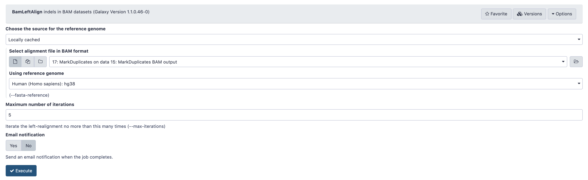
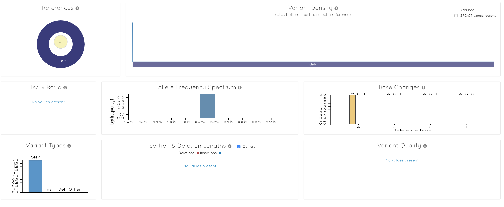
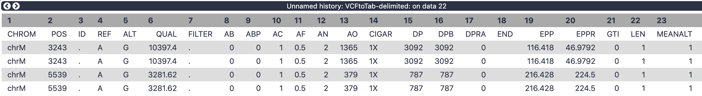

# Introduction


The majority of life on Earth is non-diploid and represented by prokaryotes, viruses and their derivatives such as our own mitochondria or plant's chloroplasts. In non-diploid systems allele frequencies can range anywhere between 0 and 100% and there could be multiple (not just two) alleles per locus. The main challenge associated with non-diploid variant calling is the difficulty in distinguishing between sequencing noise (abundant in all NGS platforms) and true low frequency variants. Some of the early attempts to do this well have been accomplished on human mitochondrial DNA although the same approaches will work equally good on viral and bacterial genomes:

* 2014 - [Maternal age effect and severe germ-line bottleneck in the inheritance of human mitochondrial DNA](http://www.pnas.org/content/111/43/15474.abstract)
* 2015 - [Extensive tissue-related and allele-related mtDNA heteroplasmy suggests positive selection for somatic mutations](http://www.pnas.org/content/112/8/2491.abstract).

As an example of non-diploid system we will be using human mitochondrial genome as an example. However, this approach will also work for most bacterial and viral genomes as well.

There are two ways one can call variants:

1. By comparing reads against an existing genome assembly
2. By assembling genome first and then mapping against that assembly

|                          |
|--------------------------|
|  |
| <small>This figure from a manuscript by [Olson:2015](https://www.ncbi.nlm.nih.gov/pmc/articles/PMC4493402/) contrasts the two approaches.</small> |

In this tutorials we will take the *first* path is which we map reads against an existing assembly. Later in the course (after we learn about assembly approaches) we will try the second approach as well.

The goal of this example is to detect heteroplasmies (variants within mitochondrial DNA). Mitochondria is transmitted maternally and heteroplasmy frequencies may change dramatically and unpredictably during the transmission, due to a germ-line bottleneck [Cree:2008](https://www.nature.com/ng/journal/v40/n2/abs/ng.2007.63.html). As we mentioned above the procedure for finding variants in bacterial or viral genomes will be essentially the same.

[A Galaxy Library](https://usegalaxy.org/library/list#folders/Fe4842bd0c37b03a7) contains datasets representing a child and a mother. These datasets are obtained by paired-end Illumina sequencing of human genomic DNA enriched for mitochondria. The enrichment was performed using long-range PCR with two primer pairs that amplify the entire mitochondrial genome. This means that these samples still contain a lot of DNA from the nuclear genome, which, in this case, is a contaminant.

# Importing example datasets

For this tutorial we have prepared a subset of data previously [published](http://www.pnas.org/content/111/43/15474.abstract) by our group. Let's import these data into Galaxy.

> ### Data upload from a Galaxy Library
>
> 
>
>  * Go to this [this Galaxy library](https://usegalaxy.org/library/list#folders/Fe4842bd0c37b03a7)
>  * You will see screen like the one shown above
>  * Click **to History** button.
>  * Galaxy will prompt you to ask whether you want to import these data into already existing or new history.
>  * It is better to create a new history, so type some descriptive name within `or create new` text field
>  * click **Import**
>  * A green message will appear once the import is done. Click on it and will see the history you have just created. It will be populated with the four datasets as shown below:
>
> 
>
{: .hands_on}

# QC'ing the data

Before proceeding with the analysis, we need to find out how good the data actually is. For this will use `FastQC` tool that can be found in **NGS: QC and manipulation &#8594; FastQC** section of Galaxy tools:

> ### Quality Control of the data
>
>
> 
>
>QC'ing reads using [FastQC](https://www.bioinformatics.babraham.ac.uk/projects/fastqc/). Note that we selected all four datasets at once by pressing the middle button  adjacent to the **Short read data from your current history** widget. Once `FastQC` job runs, you will be able to look at the HTML reports generated by this tool.
>
>The data have generally high quality in this example:
>
>
>
>FastQC plot for one of the mitochondrial datasets shows that qualities are acceptable for 250 bp reads (mostly in the green, which is at or above [phred score](https://en.wikipedia.org/wiki/Phred_quality_score) of 30).
{: .hands_on}


# Mapping the reads

Our reads are long (250 bp) and as a result we will be using [bwa mem](https://arxiv.org/pdf/1303.3997v2.pdf) to align them against the reference genome as it has good mapping performance for longer reads (100bp and up).

> ### Mapping with `bwa mem`
>
>
>
>Running `bwa mem` on our datasets. Look **carefully** at parameter settings:
>
> * We select `hg38` version of the human genome as the reference
> * By using the middle button again  we select datasets 1 and 3 as **Select the first set of reads** and datasets 2 and 4 as **Select the second set of reads**. Galaxy will automatically launch two bwa-mem jobs using datasets 1,2 and 3,4 generating two resulting BAM files.
> * By setting **Set read groups information** to `Set read groups (SAM/BAM specifications)` and clicking **Auto-assign** we will ensure that the reads in the resulting BAM dataset are properly set.
{: .hands_on}

# Merging BAM datasets

Because we have set read groups, we can now merge the two BAM dataset into one. This is because read groups label each read as belonging to either *mother* or *child*.

We can BAM dataset using **NGS: Picard** &#8594; **MergeSAMFiles** tool:

> ### Merging multiple datasets into one
>
>
>
>Merging two BAM datasets into one. Note that two inputs are highlighted.
{: .hands_on}

## Removing duplicates

Preparation of sequencing libraries (at least at the time of writing) for technologies such as Illumina (used in this example) involves PCR amplification. It is required to generate sufficient number of sequencing templates so that a reliable detection can be performed by base callers. Yet PCR has it's biases, which are especially profound in cases of multitemplate PCR used for construction of sequencing libraries (Kanagawa et al. [2003](https://www.ncbi.nlm.nih.gov/entrez/query.fcgi?cmd=Retrieve&db=PubMed&dopt=Abstract&list_uids=16233530)).

Duplicates can be identified based on their outer alignment coordinates or using sequence-based clustering. One of the common ways for identification of duplicate reads is the `MarkDuplicates` utility from [Picard](https://broadinstitute.github.io/picard/command-line-overview.html) package. It is designed to identify both PCR and optical duplicates (the following is an excerpt from Picard documentation):

*Duplicates are identified as read pairs having identical 5' positions (coordinate and strand) for both reads in a mate pair (and optionally, matching unique molecular identifier reads; see BARCODE_TAG option). Optical, or more broadly Sequencing, duplicates are duplicates that appear clustered together spatially during sequencing and can arise from optical/imagine-processing artifacts or from bio-chemical processes during clonal amplification and sequencing; they are identified using the READ_NAME_REGEX and the OPTICAL_DUPLICATE_PIXEL_DISTANCE options. The tool's main output is a new SAM or BAM file in which duplicates have been identified in the SAM flags field, or optionally removed (see REMOVE_DUPLICATE and REMOVE_SEQUENCING_DUPLICATES), and optionally marked with a duplicate type in the 'DT' optional attribute. In addition, it also outputs a metrics file containing the numbers of READ_PAIRS_EXAMINED, UNMAPPED_READS, UNPAIRED_READS, UNPAIRED_READ DUPLICATES, READ_PAIR_DUPLICATES, and READ_PAIR_OPTICAL_DUPLICATES. Usage example: java -jar picard.jar MarkDuplicates I=input.bam \ O=marked_duplicates.bam M=marked_dup_metrics.txt.*

Let's use **NGS: Picard** &#8594; **MarkDuplicates** tool:

> ### De-duplicating mapped data
>
>
>
>De-duplicating the merged BAM dataset
{: .hands_on}

**MarkDuplicates** produces a BAM dataset with duplicates removed and also a metrics file. Let's take a look at the metrics data:

```
raw_child-ds-	55	27551	55	50	1658	0	0.061026	219628
raw_mother-ds-	96	54972	96	90	4712	0	0.086459	302063
```

where columns are:

- LIBRARY (read group in our case)
- UNPAIRED_READS_EXAMINED
- READ_PAIRS_EXAMINED-
- UNMAPPED_READS
- UNPAIRED_READ_DUPLICATES
- READ_PAIR_DUPLICATES
- READ_PAIR_OPTICAL_DUPLICATES
- PERCENT_DUPLICATION
- ESTIMATED_LIBRARY_SIZE

In other words the two datasets had ~6% and ~9% duplicates, respectively.

# Left-aligning indels

Left aligning of indels (a variant of re-aligning) is extremely important for obtaining accurate variant calls. This concept, while not difficult, requires some explanation. For illustrating how left-aligning works we expanded on an example provided by [Tan:2015](https://academic.oup.com/bioinformatics/article/31/13/2202/196142/Unified-representation-of-genetic-variants). Suppose you have a reference sequence and a sequencing read:


```
Reference GGGCACACACAGGG
Read      GGGCACACAGGG
```

If you look carefully you will see that the read is simply missing a `CA` repeat. But it is not apparent to a mapper, so some of possible alignments and corresponding variant calls include:

```
Alignment                 Variant Call

GGGCACACACAGGG            Ref: CAC
GGGCAC--ACAGGG            Alt: C

GGGCACACACAGGG            Ref: ACA
GGGCA--CACAGGG            Alt: A

GGGCACACACAGGG            Ref: GCA
GGG--CACACAGGG            Alt: G
```

The last of these is *left-aligned*. In this case gaps (dashes) as moved as far left as possible (for a formal definition of left-alignment and variant normalization see [Tan:2015](https://bioinformatics.oxfordjournals.org/content/31/13/2202.abstract)).

Let's perform left alignment using **NGS: Variant Analysis** &#8594; **BamLeftAlign**:

> ### Left-aligning indels
>
>
>
>Left-aligning a de-duplicated BAM dataset
{: .hands_on}

# Filtering reads

Remember that we are trying to call variants in mitochondrial genome. Let focus only on the reads derived from mitochondria genome by filtering everything else out. For this we will use **NGS: BamTools** &#8594; **Filter**:

> ### Filtering BAM data
>
>
>
>Filtering reads. There are several important point to note here:
>
>- **mapQuality** is set to &#8925; 20 Mapping quality reflects the probability that the read is placed *incorrectly*. It uses [phred scale](https://en.wikipedia.org/wiki/Phred_quality_score). Thus 20 is 1/100 or 1% chance that the read is incorrectly mapped. By setting this parameter to &#8925; 20 we will keep all reads that have 1% or less probability of being mapped incorrectly.
>- *isPaired* will eliminate singleton (unpaired) reads (make sure **Yes** is clicked on)
>- *isProperPair* will only keep reads that map to the same chromosome and are properly placed (again, make sure **Yes** is clicked)
>- *reference* is set to *chrM*
{: .hands_on}

# Calling non-diploid variants with FreeBayes

FreeBayes is widely used for calling variants in diploid systems. However, it can also be used for calling variants in pooled samples where the number of samples is not known. This is the exact scenario we have here: in our sample we have multiple mitochondrial (or bacterial or viral) genomes but we do not know exactly how many. Thus we will use the `--pooled-continuous` option of FreeBayes to generate *frequency-based* variant calls as well as some other options highlighted below (the tool is in **NGS: Variant Analysis** &#8594; **FreeBayes**):

> ### Running `FreeBayes`
>
>
>
>Set genome to `hg38` (the latest version)
>
>
>
>Set regions to `chrM` from `1` to `16000`. This will simply save us time since we are only interested in mitochondrial variants anyway
>
>
>
>Choose `Complete list of all samples` from **Choose parameter selection level** drop down.
>
>
>
>This is one of the most important parameter choices one needs to make when calling variants in non-diploid systems. Here set **Set population model** to `Yes` and then:
>
>* Set **ploidy** to `1`
>* Set **Assume that samples result from pooled sequencing** to `Yes`
>* Set **Output all alleles which pass input filters, regardless of genotyping outcome or model** to `Yes`
>
>
>
>We will also set **Allelic scope** to `Yes` and restrict variant types to single nucleotide polymorphisms only by:
>
>* Keeping **Ignore SNP alleles** and **Ignore indels alleles** set to `No`
>* Setting **Ignore MNPs** and **Ignore complex events** to `Yes`
>
>Mitochondria has a number of low complexity regions (mononucleotide repeats). Setting these parameters as described above will decrease noise from these regions.
>
>
>
>Finally, let's set **Input filters** to `Yes` and set:
>
>* **Exclude alignments from analysis if they have a mapping quality less than** to `20` (phred score of 20). This will make FreeBayes to only consider reliably aligned reads.
>* **Exclude alleles from analysis if their supporting base quality less than** to `30` (phred score of 30). This will make FreeBayes to only consider high quality bases.
{: .hands_on}

This will produce a [VCF dataset](https://samtools.github.io/hts-specs/VCFv4.2.pdf) shows below (you may need to scroll sideways to see it in full). It lists 30 sites of interest (everything starting with a `#` is a comment):

```
Chrom	Pos	ID	Ref	Alt	Qual	Filter	Info	Format	data
##fileformat=VCFv4.1
##fileDate=20161108
##source=freeBayes v0.9.20
##reference=/galaxy/data/hg38/sam_index/hg38.fa
##phasing=none
##commandline="freebayes --bam localbam_0.bam --fasta-reference /galaxy/data/hg38/sam_index/hg38.fa --vcf /galaxy-repl/main/files/017/782/dataset_17782376.dat --region chrM:1..16000"
##INFO=<ID=NS,Number=1,Type=Integer,Description="Number of samples with data">
##INFO=<ID=DP,Number=1,Type=Integer,Description="Total read depth at the locus">
##INFO=<ID=DPB,Number=1,Type=Float,Description="Total read depth per bp at the locus; bases in reads overlapping / bases in haplotype">
##INFO=<ID=AC,Number=A,Type=Integer,Description="Total number of alternate alleles in called genotypes">
##INFO=<ID=AN,Number=1,Type=Integer,Description="Total number of alleles in called genotypes">
##INFO=<ID=AF,Number=A,Type=Float,Description="Estimated allele frequency in the range (0,1]">
##INFO=<ID=RO,Number=1,Type=Integer,Description="Reference allele observation count, with partial observations recorded fractionally">
##INFO=<ID=AO,Number=A,Type=Integer,Description="Alternate allele observations, with partial observations recorded fractionally">
##INFO=<ID=PRO,Number=1,Type=Float,Description="Reference allele observation count, with partial observations recorded fractionally">
##INFO=<ID=PAO,Number=A,Type=Float,Description="Alternate allele observations, with partial observations recorded fractionally">
##INFO=<ID=QR,Number=1,Type=Integer,Description="Reference allele quality sum in phred">
##INFO=<ID=QA,Number=A,Type=Integer,Description="Alternate allele quality sum in phred">
##INFO=<ID=PQR,Number=1,Type=Float,Description="Reference allele quality sum in phred for partial observations">
##INFO=<ID=PQA,Number=A,Type=Float,Description="Alternate allele quality sum in phred for partial observations">
##INFO=<ID=SRF,Number=1,Type=Integer,Description="Number of reference observations on the forward strand">
##INFO=<ID=SRR,Number=1,Type=Integer,Description="Number of reference observations on the reverse strand">
##INFO=<ID=SAF,Number=A,Type=Integer,Description="Number of alternate observations on the forward strand">
##INFO=<ID=SAR,Number=A,Type=Integer,Description="Number of alternate observations on the reverse strand">
##INFO=<ID=SRP,Number=1,Type=Float,Description="Strand balance probability for the reference allele: Phred-scaled upper-bounds estimate of the probability of observing the deviation between SRF and SRR given E(SRF/SRR) ~ 0.5, derived using Hoeffding's inequality">
##INFO=<ID=SAP,Number=A,Type=Float,Description="Strand balance probability for the alternate allele: Phred-scaled upper-bounds estimate of the probability of observing the deviation between SAF and SAR given E(SAF/SAR) ~ 0.5, derived using Hoeffding's inequality">
##INFO=<ID=AB,Number=A,Type=Float,Description="Allele balance at heterozygous sites: a number between 0 and 1 representing the ratio of reads showing the reference allele to all reads, considering only reads from individuals called as heterozygous">
##INFO=<ID=ABP,Number=A,Type=Float,Description="Allele balance probability at heterozygous sites: Phred-scaled upper-bounds estimate of the probability of observing the deviation between ABR and ABA given E(ABR/ABA) ~ 0.5, derived using Hoeffding's inequality">
##INFO=<ID=RUN,Number=A,Type=Integer,Description="Run length: the number of consecutive repeats of the alternate allele in the reference genome">
##INFO=<ID=RPP,Number=A,Type=Float,Description="Read Placement Probability: Phred-scaled upper-bounds estimate of the probability of observing the deviation between RPL and RPR given E(RPL/RPR) ~ 0.5, derived using Hoeffding's inequality">
##INFO=<ID=RPPR,Number=1,Type=Float,Description="Read Placement Probability for reference observations: Phred-scaled upper-bounds estimate of the probability of observing the deviation between RPL and RPR given E(RPL/RPR) ~ 0.5, derived using Hoeffding's inequality">
##INFO=<ID=RPL,Number=A,Type=Float,Description="Reads Placed Left: number of reads supporting the alternate balanced to the left (5') of the alternate allele">
##INFO=<ID=RPR,Number=A,Type=Float,Description="Reads Placed Right: number of reads supporting the alternate balanced to the right (3') of the alternate allele">
##INFO=<ID=EPP,Number=A,Type=Float,Description="End Placement Probability: Phred-scaled upper-bounds estimate of the probability of observing the deviation between EL and ER given E(EL/ER) ~ 0.5, derived using Hoeffding's inequality">
##INFO=<ID=EPPR,Number=1,Type=Float,Description="End Placement Probability for reference observations: Phred-scaled upper-bounds estimate of the probability of observing the deviation between EL and ER given E(EL/ER) ~ 0.5, derived using Hoeffding's inequality">
##INFO=<ID=DPRA,Number=A,Type=Float,Description="Alternate allele depth ratio. Ratio between depth in samples with each called alternate allele and those without.">
##INFO=<ID=ODDS,Number=1,Type=Float,Description="The log odds ratio of the best genotype combination to the second-best.">
##INFO=<ID=GTI,Number=1,Type=Integer,Description="Number of genotyping iterations required to reach convergence or bailout.">
##INFO=<ID=TYPE,Number=A,Type=String,Description="The type of allele, either snp, mnp, ins, del, or complex.">
##INFO=<ID=CIGAR,Number=A,Type=String,Description="The extended CIGAR representation of each alternate allele, with the exception that '=' is replaced by 'M' to ease VCF parsing. Note that INDEL alleles do not have the first matched base (which is provided by default, per the spec) referred to by the CIGAR.">
##INFO=<ID=NUMALT,Number=1,Type=Integer,Description="Number of unique non-reference alleles in called genotypes at this position.">
##INFO=<ID=MEANALT,Number=A,Type=Float,Description="Mean number of unique non-reference allele observations per sample with the corresponding alternate alleles.">
##INFO=<ID=LEN,Number=A,Type=Integer,Description="allele length">
##INFO=<ID=MQM,Number=A,Type=Float,Description="Mean mapping quality of observed alternate alleles">
##INFO=<ID=MQMR,Number=1,Type=Float,Description="Mean mapping quality of observed reference alleles">
##INFO=<ID=PAIRED,Number=A,Type=Float,Description="Proportion of observed alternate alleles which are supported by properly paired read fragments">
##INFO=<ID=PAIREDR,Number=1,Type=Float,Description="Proportion of observed reference alleles which are supported by properly paired read fragments">
##INFO=<ID=technology.ILLUMINA,Number=A,Type=Float,Description="Fraction of observations supporting the alternate observed in reads from ILLUMINA">
##FORMAT=<ID=GT,Number=1,Type=String,Description="Genotype">
##FORMAT=<ID=GQ,Number=1,Type=Float,Description="Genotype Quality, the Phred-scaled marginal (or unconditional) probability of the called genotype">
##FORMAT=<ID=GL,Number=G,Type=Float,Description="Genotype Likelihood, log10-scaled likelihoods of the data given the called genotype for each possible genotype generated from the reference and alternate alleles given the sample ploidy">
##FORMAT=<ID=DP,Number=1,Type=Integer,Description="Read Depth">
##FORMAT=<ID=RO,Number=1,Type=Integer,Description="Reference allele observation count">
##FORMAT=<ID=QR,Number=1,Type=Integer,Description="Sum of quality of the reference observations">
##FORMAT=<ID=AO,Number=A,Type=Integer,Description="Alternate allele observation count">
##FORMAT=<ID=QA,Number=A,Type=Integer,Description="Sum of quality of the alternate observations">
#CHROM	POS	ID	REF	ALT	QUAL	FILTER	INFO	FORMAT	raw_child-ds-	raw_mother-ds-
chrM	73	.	A	G	33368.5	.	AB=0;ABP=0;AC=4;AF=1;AN=4;AO=1095;CIGAR=1X;DP=1098;DPB=1098;DPRA=0;EPP=107.005;EPPR=5.18177;GTI=0;LEN=1;MEANALT=1.5;MQM=55.7744;MQMR=60;NS=2;NUMALT=1;ODDS=509.945;PAIRED=1;PAIREDR=1;PAO=0;PQA=0;PQR=0;PRO=0;QA=37602;QR=37;RO=1;RPL=359;RPP=284.863;RPPR=5.18177;RPR=736;RUN=1;SAF=507;SAP=16.0213;SAR=588;SRF=0;SRP=5.18177;SRR=1;TYPE=snp;technology.ILLUMINA=1	GT:DP:RO:QR:AO:QA:GL	1/1:273:0:0:273:9187:-827.167,-82.1812,0	1/1:825:1:37:822:28415:-2554.14,-241.429,0
chrM	263	.	A	G	13774.9	.	AB=0;ABP=0;AC=4;AF=1;AN=4;AO=508;CIGAR=1X;DP=524;DPB=524;DPRA=0;EPP=39.1901;EPPR=0;GTI=0;LEN=1;MEANALT=2.5;MQM=60;MQMR=0;NS=2;NUMALT=1;ODDS=255.818;PAIRED=1;PAIREDR=0;PAO=0;PQA=0;PQR=0;PRO=0;QA=15693;QR=0;RO=0;RPL=373;RPP=245.138;RPPR=0;RPR=135;RUN=1;SAF=219;SAP=23.9556;SAR=289;SRF=0;SRP=0;SRR=0;TYPE=snp;technology.ILLUMINA=1	GT:DP:RO:QR:AO:QA:GL	1/1:154:0:0:150:4661:-419.661,-45.1545,0	1/1:370:0:0:358:11032:-993.047,-107.769,0
chrM	309	.	CT	CCTC,CC	4399.1	.	AB=0.56535,0.285714;ABP=15.2141,134.229;AC=2,2;AF=0.5,0.5;AN=4;AO=186,94;CIGAR=1M2I1X,1M1X;DP=329;DPB=555.5;DPRA=0,0;EPP=23.6043,97.6311;EPPR=31.9633;GTI=0;LEN=3,1;MEANALT=6,6;MQM=60,59.8085;MQMR=60;NS=2;NUMALT=2;ODDS=89.3381;PAIRED=1,1;PAIREDR=1;PAO=13.3333,13.3333;PQA=339,339;PQR=290;PRO=11.3333;QA=4084,2577;QR=686;RO=30;RPL=114,78;RPP=23.6043,91.8097;RPPR=38.0434;RPR=72,16;RUN=1,1;SAF=0,63;SAP=406.904,26.6655;SAR=186,31;SRF=21;SRP=13.4334;SRR=9;TYPE=complex,snp;technology.ILLUMINA=1,1	GT:DP:RO:QR:AO:QA:GL	1/2:93:6:123:59,23:1308,638:-159.543,-53.5005,-52.9104,-105.161,0,-113.176	1/2:236:24:563:127,71:2776,1939:-368.987,-136.961,-169.835,-200.763,0,-245.13
chrM	513	.	GCACACACACAC	GCACACACACACAC	3522.72	.	AB=0.647399;ABP=35.6577;AC=3;AF=0.75;AN=4;AO=156;CIGAR=1M2I11M;DP=231;DPB=321.083;DPRA=0;EPP=75.17;EPPR=5.48477;GTI=1;LEN=2;MEANALT=13.5;MQM=60;MQMR=60;NS=2;NUMALT=1;ODDS=3.87694;PAIRED=1;PAIREDR=1;PAO=46.5;PQA=1383.5;PQR=1383.5;PRO=46.5;QA=4585;QR=1403;RO=43;RPL=39;RPP=87.6977;RPPR=3.0608;RPR=117;RUN=1;SAF=111;SAP=63.6445;SAR=45;SRF=26;SRP=7.10075;SRR=17;TYPE=ins;technology.ILLUMINA=1	GT:DP:RO:QR:AO:QA:GL	1/1:58:7:225:44:1251:-105.403,0,-13.0389	0/1:173:36:1178:112:3334:-290.141,0,-96.0932
chrM	750	.	A	G	51447.4	.	AB=0;ABP=0;AC=4;AF=1;AN=4;AO=1722;CIGAR=1X;DP=1736;DPB=1736;DPRA=0;EPP=3.03048;EPPR=20.3821;GTI=0;LEN=1;MEANALT=3;MQM=59.8868;MQMR=60;NS=2;NUMALT=1;ODDS=753.623;PAIRED=1;PAIREDR=1;PAO=0;PQA=0;PQR=0;PRO=0;QA=57871;QR=122;RO=8;RPL=720;RPP=103.291;RPPR=12.7819;RPR=1002;RUN=1;SAF=1151;SAP=427.217;SAR=571;SRF=1;SRP=12.7819;SRR=7;TYPE=snp;technology.ILLUMINA=1	GT:DP:RO:QR:AO:QA:GL	1/1:436:4:53:429:13615:-1220.76,-116.422,0	1/1:1300:4:69:1293:44256:-3977.02,-373.134,0
chrM	1438	.	A	G	79172.1	.	AB=0;ABP=0;AC=4;AF=1;AN=4;AO=2474;CIGAR=1X;DP=2480;DPB=2480;DPRA=0;EPP=7.56039;EPPR=3.44459;GTI=0;LEN=1;MEANALT=1.5;MQM=59.8319;MQMR=58;NS=2;NUMALT=1;ODDS=1085.01;PAIRED=1;PAIREDR=1;PAO=0;PQA=0;PQR=0;PRO=0;QA=88621;QR=102;RO=5;RPL=1546;RPP=338.232;RPPR=3.44459;RPR=928;RUN=1;SAF=1055;SAP=119.304;SAR=1419;SRF=3;SRP=3.44459;SRR=2;TYPE=snp;technology.ILLUMINA=1	GT:DP:RO:QR:AO:QA:GL	1/1:551:1:16:550:19482:-1752.13,-161.526,0	1/1:1929:4:86:1924:69139:-6214.93,-560.827,0
chrM	2487	.	A	C	4432.57	.	AB=0.278634;ABP=775.959;AC=1;AF=0.25;AN=4;AO=621;CIGAR=1X;DP=2340;DPB=2340;DPRA=0;EPP=15.1824;EPPR=99.2128;GTI=1;LEN=1;MEANALT=2.5;MQM=59.3285;MQMR=59.9115;NS=2;NUMALT=1;ODDS=63.7254;PAIRED=1;PAIREDR=1;PAO=0;PQA=0;PQR=0;PRO=0;QA=9402;QR=56614;RO=1707;RPL=281;RPP=15.1824;RPPR=127.637;RPR=340;RUN=1;SAF=0;SAP=1351.49;SAR=621;SRF=1352;SRP=1267.49;SRR=355;TYPE=snp;technology.ILLUMINA=1	GT:DP:RO:QR:AO:QA:GL	0/0:524:405:13274:115:1754:-119.206,0,-1156.18	0/1:1816:1302:43340:506:7648:-607.816,0,-3820.28
chrM	2706	.	A	G	49482.2	.	AB=0;ABP=0;AC=4;AF=1;AN=4;AO=1889;CIGAR=1X;DP=1969;DPB=1969;DPRA=0;EPP=11.3157;EPPR=6.95112;GTI=0;LEN=1;MEANALT=2.5;MQM=59.9645;MQMR=59.5926;NS=2;NUMALT=1;ODDS=759.158;PAIRED=1;PAIREDR=1;PAO=0;PQA=0;PQR=0;PRO=0;QA=55923;QR=722;RO=27;RPL=810;RPP=86.1918;RPPR=5.02092;RPR=1079;RUN=1;SAF=802;SAP=96.3813;SAR=1087;SRF=18;SRP=9.52472;SRR=9;TYPE=snp;technology.ILLUMINA=1	GT:DP:RO:QR:AO:QA:GL	1/1:408:5:99:391:11529:-1028.82,-99.3894,0	1/1:1561:22:623:1498:44394:-3939.48,-352.569,0
chrM	3197	.	T	C	135699	.	AB=0;ABP=0;AC=4;AF=1;AN=4;AO=4208;CIGAR=1X;DP=4241;DPB=4241;DPRA=0;EPP=168.325;EPPR=3.13803;GTI=0;LEN=1;MEANALT=3;MQM=59.9943;MQMR=60;NS=2;NUMALT=1;ODDS=2145.76;PAIRED=1;PAIREDR=1;PAO=0;PQA=0;PQR=0;PRO=0;QA=152221;QR=558;RO=17;RPL=2378;RPP=157.977;RPPR=6.20364;RPR=1830;RUN=1;SAF=1641;SAP=445.497;SAR=2567;SRF=8;SRP=3.13803;SRR=9;TYPE=snp;technology.ILLUMINA=1	GT:DP:RO:QR:AO:QA:GL	1/1:1499:6:179:1486:53236:-4775.26,-416.785,0	1/1:2742:11:379:2722:98985:-8874.65,-758.304,0
chrM	3243	.	A	G	46067	.	AB=0.612338;ABP=290.859;AC=2;AF=0.5;AN=4;AO=1608;CIGAR=1X;DP=2626;DPB=2626;DPRA=0;EPP=31.0126;EPPR=64.3549;GTI=0;LEN=1;MEANALT=2;MQM=59.9627;MQMR=59.815;NS=2;NUMALT=1;ODDS=1288.98;PAIRED=1;PAIREDR=1;PAO=0;PQA=0;PQR=0;PRO=0;QA=53165;QR=35336;RO=1011;RPL=974;RPP=159.119;RPPR=763.402;RPR=634;RUN=1;SAF=558;SAP=329.898;SAR=1050;SRF=383;SRP=131.935;SRR=628;TYPE=snp;technology.ILLUMINA=1	GT:DP:RO:QR:AO:QA:GL	0/1:1068:221:7574:841:27395:-2380.4,0,-596.524	0/1:1558:790:27762:767:25770:-2317.69,0,-2496.98
chrM	3483	.	G	C	685.467	.	AB=0.254386;ABP=182.214;AC=1;AF=0.25;AN=4;AO=127;CIGAR=1X;DP=550;DPB=550;DPRA=0;EPP=37.6342;EPPR=22.2028;GTI=1;LEN=1;MEANALT=1.5;MQM=59.4646;MQMR=59.8504;NS=2;NUMALT=1;ODDS=25.0865;PAIRED=1;PAIREDR=1;PAO=0;PQA=0;PQR=0;PRO=0;QA=2032;QR=13200;RO=421;RPL=87;RPP=40.7802;RPPR=245.89;RPR=40;RUN=1;SAF=1;SAP=270.17;SAR=126;SRF=321;SRP=254.927;SRR=100;TYPE=snp;technology.ILLUMINA=1	GT:DP:RO:QR:AO:QA:GL	0/0:208:166:5264:40:608:-35.5966,0,-454.8	0/1:342:255:7936:87:1424:-108.297,0,-694.524
chrM	3488	.	T	A	682.097	.	AB=0.264706;ABP=166.509;AC=1;AF=0.25;AN=4;AO=130;CIGAR=1X;DP=546;DPB=546;DPRA=0;EPP=44.7694;EPPR=34.7681;GTI=1;LEN=1;MEANALT=1;MQM=59.4231;MQMR=59.7139;NS=2;NUMALT=1;ODDS=17.5994;PAIRED=1;PAIREDR=1;PAO=0;PQA=0;PQR=0;PRO=0;QA=2069;QR=13578;RO=416;RPL=90;RPP=44.7694;RPPR=211.806;RPR=40;RUN=1;SAF=0;SAP=285.302;SAR=130;SRF=315;SRP=242.06;SRR=101;TYPE=snp;technology.ILLUMINA=1	GT:DP:RO:QR:AO:QA:GL	0/0:206:166:5535:40:650:-39.5324,0,-479.353	0/1:340:250:8043:90:1419:-109.544,0,-705.868
chrM	3511	.	A	C	434.289	.	AB=0.260394;ABP=230.901;AC=1;AF=0.25;AN=4;AO=185;CIGAR=1X;DP=752;DPB=752;DPRA=0;EPP=322.569;EPPR=29.1769;GTI=1;LEN=1;MEANALT=3;MQM=59.7838;MQMR=59.7348;NS=2;NUMALT=1;ODDS=57.1305;PAIRED=1;PAIREDR=1;PAO=0;PQA=0;PQR=0;PRO=0;QA=2698;QR=16673;RO=558;RPL=11;RPP=314.869;RPPR=115.475;RPR=174;RUN=1;SAF=1;SAP=396.094;SAR=184;SRF=292;SRP=5.64097;SRR=266;TYPE=snp;technology.ILLUMINA=1	GT:DP:RO:QR:AO:QA:GL	0/0:295:226:6735:66:923:-61.5611,0,-584.793	0/1:457:332:9938:119:1775:-135.644,0,-870.462
chrM	4769	.	A	G	54711.1	.	AB=0;ABP=0;AC=4;AF=1;AN=4;AO=1746;CIGAR=1X;DP=1752;DPB=1752;DPRA=0;EPP=85.7949;EPPR=5.18177;GTI=0;LEN=1;MEANALT=2.5;MQM=51.2801;MQMR=58;NS=2;NUMALT=1;ODDS=911.774;PAIRED=1;PAIREDR=1;PAO=0;PQA=0;PQR=0;PRO=0;QA=61628;QR=15;RO=1;RPL=549;RPP=525.238;RPPR=5.18177;RPR=1197;RUN=1;SAF=1003;SAP=87.0833;SAR=743;SRF=1;SRP=5.18177;SRR=0;TYPE=snp;technology.ILLUMINA=1	GT:DP:RO:QR:AO:QA:GL	1/1:604:1:15:601:20766:-1867.77,-177.095,0	1/1:1148:0:0:1145:40862:-3677.79,-344.679,0
chrM	5539	.	A	G	11837	.	AB=0.479167;ABP=6.26751;AC=2;AF=0.5;AN=4;AO=414;CIGAR=1X;DP=864;DPB=864;DPRA=0;EPP=192.358;EPPR=179.441;GTI=0;LEN=1;MEANALT=1.5;MQM=54.1957;MQMR=53.5924;NS=2;NUMALT=1;ODDS=622.768;PAIRED=1;PAIREDR=1;PAO=0;PQA=0;PQR=0;PRO=0;QA=14380;QR=15965;RO=449;RPL=85;RPP=315.283;RPPR=358.189;RPR=329;RUN=1;SAF=309;SAP=221.29;SAR=105;SRF=337;SRP=247.845;SRR=112;TYPE=snp;technology.ILLUMINA=1	GT:DP:RO:QR:AO:QA:GL	0/1:338:249:8721:89:3010:-252.807,0,-766.809	0/1:526:200:7244:325:11370:-1015.56,0,-644.23
chrM	7028	.	C	T	76141.7	.	AB=0;ABP=0;AC=4;AF=1;AN=4;AO=2473;CIGAR=1X;DP=2499;DPB=2499;DPRA=0;EPP=3.74876;EPPR=34.9902;GTI=0;LEN=1;MEANALT=2.5;MQM=55.905;MQMR=57.6364;NS=2;NUMALT=1;ODDS=1210.59;PAIRED=1;PAIREDR=1;PAO=0;PQA=0;PQR=0;PRO=0;QA=85103;QR=439;RO=22;RPL=1260;RPP=4.94996;RPPR=4.58955;RPR=1213;RUN=1;SAF=1102;SAP=66.5485;SAR=1371;SRF=9;SRP=4.58955;SRR=13;TYPE=snp;technology.ILLUMINA=1	GT:DP:RO:QR:AO:QA:GL	1/1:827:6:107:820:28371:-2543.94,-224.334,0	1/1:1672:16:332:1653:56732:-5076.14,-434.286,0
chrM	7269	.	G	A	62196.6	.	AB=0;ABP=0;AC=4;AF=1;AN=4;AO=1937;CIGAR=1X;DP=1947;DPB=1947;DPRA=0;EPP=54.8308;EPPR=5.18177;GTI=0;LEN=1;MEANALT=3;MQM=58.2685;MQMR=60;NS=2;NUMALT=1;ODDS=1033.49;PAIRED=1;PAIREDR=1;PAO=0;PQA=0;PQR=0;PRO=0;QA=69240;QR=16;RO=1;RPL=1011;RPP=11.1099;RPPR=5.18177;RPR=926;RUN=1;SAF=933;SAP=8.66151;SAR=1004;SRF=0;SRP=5.18177;SRR=1;TYPE=snp;technology.ILLUMINA=1	GT:DP:RO:QR:AO:QA:GL	1/1:704:1:16:698:24364:-2191.49,-206.139,0	1/1:1243:0:0:1239:44876:-4039.06,-372.976,0
chrM	8557	.	G	C	2590.97	.	AB=0.267066;ABP=790.051;AC=2;AF=0.5;AN=4;AO=446;CIGAR=1X;DP=1670;DPB=1670;DPRA=0;EPP=44.2196;EPPR=97.7883;GTI=0;LEN=1;MEANALT=3;MQM=57.6951;MQMR=59.5256;NS=2;NUMALT=1;ODDS=125.064;PAIRED=1;PAIREDR=1;PAO=0;PQA=0;PQR=0;PRO=0;QA=6303;QR=38747;RO=1212;RPL=177;RPP=44.2196;RPPR=385.426;RPR=269;RUN=1;SAF=2;SAP=954.193;SAR=444;SRF=906;SRP=648.002;SRR=306;TYPE=snp;technology.ILLUMINA=1	GT:DP:RO:QR:AO:QA:GL	0/1:724:538:17225:181:2490:-182.373,0,-1508.7	0/1:946:674:21522:265:3813:-301.57,0,-1895.55
chrM	8860	.	A	G	55525	.	AB=0;ABP=0;AC=4;AF=1;AN=4;AO=1846;CIGAR=1X;DP=1861;DPB=1861;DPRA=0;EPP=5.72052;EPPR=6.91895;GTI=0;LEN=1;MEANALT=3;MQM=47.1728;MQMR=58.6;NS=2;NUMALT=1;ODDS=1039.99;PAIRED=1;PAIREDR=1;PAO=0;PQA=0;PQR=0;PRO=0;QA=61929;QR=160;RO=5;RPL=984;RPP=20.5185;RPPR=6.91895;RPR=862;RUN=1;SAF=987;SAP=22.283;SAR=859;SRF=2;SRP=3.44459;SRR=3;TYPE=snp;technology.ILLUMINA=1	GT:DP:RO:QR:AO:QA:GL	1/1:729:0:0:726:24114:-2170.46,-218.548,0	1/1:1132:5:160:1120:37815:-3389.07,-311.012,0
chrM	9477	.	G	A	34109.5	.	AB=0;ABP=0;AC=4;AF=1;AN=4;AO=1099;CIGAR=1X;DP=1104;DPB=1104;DPRA=0;EPP=9.42988;EPPR=3.0103;GTI=0;LEN=1;MEANALT=2;MQM=59.3794;MQMR=60;NS=2;NUMALT=1;ODDS=565.855;PAIRED=1;PAIREDR=1;PAO=0;PQA=0;PQR=0;PRO=0;QA=38032;QR=67;RO=2;RPL=598;RPP=21.6012;RPPR=7.35324;RPR=501;RUN=1;SAF=542;SAP=3.45487;SAR=557;SRF=1;SRP=3.0103;SRR=1;TYPE=snp;technology.ILLUMINA=1	GT:DP:RO:QR:AO:QA:GL	1/1:401:2:67:398:13308:-1191.76,-109.337,0	1/1:703:0:0:701:24724:-2225.39,-211.022,0
chrM	9548	.	G	A	26846.1	.	AB=0;ABP=0;AC=4;AF=1;AN=4;AO=942;CIGAR=1X;DP=970;DPB=970;DPRA=0;EPP=3.04718;EPPR=3.73412;GTI=0;LEN=1;MEANALT=3;MQM=59.6921;MQMR=60;NS=2;NUMALT=1;ODDS=502.835;PAIRED=1;PAIREDR=1;PAO=0;PQA=0;PQR=0;PRO=0;QA=29956;QR=66;RO=3;RPL=524;RPP=28.9112;RPPR=3.73412;RPR=418;RUN=1;SAF=487;SAP=5.3708;SAR=455;SRF=3;SRP=9.52472;SRR=0;TYPE=snp;technology.ILLUMINA=1	GT:DP:RO:QR:AO:QA:GL	1/1:364:1:38:350:10822:-970.712,-99.6786,0	1/1:606:2:28:592:19134:-1719.73,-171.045,0
chrM	11467	.	A	G	164822	.	AB=0;ABP=0;AC=4;AF=1;AN=4;AO=5200;CIGAR=1X;DP=5225;DPB=5225;DPRA=0;EPP=350.339;EPPR=4.78696;GTI=0;LEN=1;MEANALT=2.5;MQM=59.9342;MQMR=53.6364;NS=2;NUMALT=1;ODDS=2859.91;PAIRED=1;PAIREDR=1;PAO=0;PQA=0;PQR=0;PRO=0;QA=187277;QR=283;RO=11;RPL=3887;RPP=2769.75;RPPR=3.20771;RPR=1313;RUN=1;SAF=2257;SAP=199.527;SAR=2943;SRF=6;SRP=3.20771;SRR=5;TYPE=snp;technology.ILLUMINA=1	GT:DP:RO:QR:AO:QA:GL	1/1:2016:2:46:2008:71984:-6474.61,-594.606,0	1/1:3209:9:237:3192:115293:-10355.2,-916.222,0
chrM	11719	.	G	A	95624.7	.	AB=0;ABP=0;AC=4;AF=1;AN=4;AO=3302;CIGAR=1X;DP=3356;DPB=3356;DPRA=0;EPP=179.466;EPPR=18.4661;GTI=0;LEN=1;MEANALT=2;MQM=59.5924;MQMR=58.2353;NS=2;NUMALT=1;ODDS=1506.69;PAIRED=1;PAIREDR=1;PAO=0;PQA=0;PQR=0;PRO=0;QA=106982;QR=483;RO=17;RPL=1766;RPP=37.7986;RPPR=6.20364;RPR=1536;RUN=1;SAF=1728;SAP=18.6065;SAR=1574;SRF=3;SRP=18.4661;SRR=14;TYPE=snp;technology.ILLUMINA=1	GT:DP:RO:QR:AO:QA:GL	1/1:911:4:122:891:28560:-2559.58,-247.982,0	1/1:2445:13:361:2411:78422:-7025.63,-662.959,0
chrM	12308	.	A	G	67204.7	.	AB=0;ABP=0;AC=4;AF=1;AN=4;AO=2144;CIGAR=1X;DP=2161;DPB=2161;DPRA=0;EPP=8.55647;EPPR=3.87889;GTI=0;LEN=1;MEANALT=2;MQM=59.9664;MQMR=59.7;NS=2;NUMALT=1;ODDS=949.477;PAIRED=1;PAIREDR=1;PAO=0;PQA=0;PQR=0;PRO=0;QA=75192;QR=257;RO=10;RPL=1284;RPP=185.09;RPPR=3.87889;RPR=860;RUN=1;SAF=1005;SAP=21.1964;SAR=1139;SRF=4;SRP=3.87889;SRR=6;TYPE=snp;technology.ILLUMINA=1	GT:DP:RO:QR:AO:QA:GL	1/1:635:7:216:628:21603:-1924.87,-155.503,0	1/1:1526:3:41:1516:53589:-4819.52,-444.815,0
chrM	12372	.	G	A	62064	.	AB=0;ABP=0;AC=4;AF=1;AN=4;AO=1984;CIGAR=1X;DP=1992;DPB=1992;DPRA=0;EPP=10.3697;EPPR=4.45795;GTI=0;LEN=1;MEANALT=2;MQM=59.9919;MQMR=60;NS=2;NUMALT=1;ODDS=933.299;PAIRED=1;PAIREDR=1;PAO=0;PQA=0;PQR=0;PRO=0;QA=69281;QR=192;RO=6;RPL=861;RPP=78.1406;RPPR=4.45795;RPR=1123;RUN=1;SAF=1010;SAP=4.42876;SAR=974;SRF=4;SRP=4.45795;SRR=2;TYPE=snp;technology.ILLUMINA=1	GT:DP:RO:QR:AO:QA:GL	1/1:634:5:155:628:21590:-1929.21,-164.556,0	1/1:1358:1:37:1356:47691:-4288.95,-401.925,0
chrM	13617	.	T	C	28593.6	.	AB=0;ABP=0;AC=4;AF=1;AN=4;AO=901;CIGAR=1X;DP=906;DPB=906;DPRA=0;EPP=251.346;EPPR=3.73412;GTI=0;LEN=1;MEANALT=2;MQM=59.9034;MQMR=60;NS=2;NUMALT=1;ODDS=462.343;PAIRED=1;PAIREDR=1;PAO=0;PQA=0;PQR=0;PRO=0;QA=32868;QR=92;RO=3;RPL=674;RPP=484.564;RPPR=9.52472;RPR=227;RUN=1;SAF=339;SAP=122.861;SAR=562;SRF=2;SRP=3.73412;SRR=1;TYPE=snp;technology.ILLUMINA=1	GT:DP:RO:QR:AO:QA:GL	1/1:303:1:14:301:10938:-983.358,-87.1961,0	1/1:603:2:78:600:21930:-1966.72,-168.809,0
chrM	14766	.	C	T	60668.6	.	AB=0;ABP=0;AC=4;AF=1;AN=4;AO=2022;CIGAR=1X;DP=2039;DPB=2039;DPRA=0;EPP=13.3243;EPPR=19.0002;GTI=0;LEN=1;MEANALT=2.5;MQM=59.9782;MQMR=60;NS=2;NUMALT=1;ODDS=954.02;PAIRED=1;PAIREDR=1;PAO=0;PQA=0;PQR=0;PRO=0;QA=67719;QR=140;RO=11;RPL=989;RPP=5.08941;RPPR=12.6832;RPR=1033;RUN=1;SAF=1199;SAP=154.837;SAR=823;SRF=1;SRP=19.0002;SRR=10;TYPE=snp;technology.ILLUMINA=1	GT:DP:RO:QR:AO:QA:GL	1/1:637:6:78:628:20191:-1810.35,-169.906,0	1/1:1402:5:62:1394:47528:-4272.15,-401.924,0
chrM	14793	.	A	G	58080	.	AB=0;ABP=0;AC=4;AF=1;AN=4;AO=1967;CIGAR=1X;DP=1998;DPB=1998;DPRA=0;EPP=8.57532;EPPR=5.80219;GTI=0;LEN=1;MEANALT=3;MQM=59.9736;MQMR=59.2857;NS=2;NUMALT=1;ODDS=930.516;PAIRED=1;PAIREDR=1;PAO=0;PQA=0;PQR=0;PRO=0;QA=64876;QR=104;RO=7;RPL=1133;RPP=101.705;RPPR=3.32051;RPR=834;RUN=1;SAF=1124;SAP=90.1794;SAR=843;SRF=1;SRP=10.7656;SRR=6;TYPE=snp;technology.ILLUMINA=1	GT:DP:RO:QR:AO:QA:GL	1/1:600:4:62:589:19341:-1735.29,-163.219,0	1/1:1398:3:42:1378:45535:-4094.54,-403.304,0
chrM	15301	.	G	A	76440.4	.	AB=0;ABP=0;AC=4;AF=1;AN=4;AO=2590;CIGAR=1X;DP=2644;DPB=2644;DPRA=0;EPP=3.76487;EPPR=7.94546;GTI=0;LEN=1;MEANALT=3;MQM=60;MQMR=60;NS=2;NUMALT=1;ODDS=1170.15;PAIRED=1;PAIREDR=1;PAO=0;PQA=0;PQR=0;PRO=0;QA=85385;QR=292;RO=11;RPL=1134;RPP=89.9396;RPPR=4.78696;RPR=1456;RUN=1;SAF=1194;SAP=37.2206;SAR=1396;SRF=3;SRP=7.94546;SRR=8;TYPE=snp;technology.ILLUMINA=1	GT:DP:RO:QR:AO:QA:GL	1/1:726:5:116:709:23434:-2098.78,-192.286,0	1/1:1918:6:176:1881:61951:-5559.91,-535.386,0
chrM	15326	.	A	G	79542.1	.	AB=0;ABP=0;AC=4;AF=1;AN=4;AO=2574;CIGAR=1X;DP=2586;DPB=2586;DPRA=0;EPP=3.76956;EPPR=5.18177;GTI=0;LEN=1;MEANALT=3;MQM=60;MQMR=60;NS=2;NUMALT=1;ODDS=1207.35;PAIRED=1;PAIREDR=1;PAO=0;PQA=0;PQR=0;PRO=0;QA=88636;QR=86;RO=4;RPL=1116;RPP=101.683;RPPR=5.18177;RPR=1458;RUN=1;SAF=1198;SAP=29.7395;SAR=1376;SRF=0;SRP=11.6962;SRR=4;TYPE=snp;technology.ILLUMINA=1	GT:DP:RO:QR:AO:QA:GL	1/1:715:2:50:710:24322:-2184.63,-204.389,0	1/1:1871:2:36:1864:64314:-5785.22,-552.228,0

```

# Filtering VCF data

Even though we selected somewhat stringent input parameters (restricting base quality to a minimum of 30 and mapping quality to a minimum of 20) there is still a lot of just in our data. [Erik Garrison](https://github.com/ekg) has a beautiful illustration of various biases potentially affecting called variants (and making a locus sequence-able):

|                            |
|----------------------------|
||
|<small>Here you can see that in an ideal case (indicated with a green star) a variant is evenly represent by different areas of sequencing reads (cycle and placement biases) and is balanced across the two strands (strand bias). Allele imbalance is not applicable in our case as it reflects significant deviation from the diploid (50/50) expectation (see [here](../../images/freebayes.pdf) for more details).</small>|

A robust tool set for processing VCF data is provided by [vcflib](https://github.com/vcflib/vcflib) developed by Erik Garrison, the author of FreeBayes. One way to filter VCF is using `INFO` fields of the VCF dataset. If you look at the VCF dataset shown above you will see all comment lines beginning with `##INFO`.  These are `INFO` fields. Each VCF record contains a list of `INFO` tags describing a wide range of properties for each VCF record. You will see that FreeBayes and NVC differ significantly in the number and types of `INFO` fields each of these caller generates. This why the two require different filtering strategies.

Among numerous types of data generated by FreeBayes let's consider the following variant properties:

* `##INFO=<ID=DP,Number=1,Type=Integer,Description="Total read depth at the locus">` This is simply the number of reads covering a given site.
* `##INFO=<ID=SRP,Number=1,Type=Float,Description="Strand balance probability for the reference allele: Phred-scaled upper-bounds estimate of the probability of observing the deviation between SRF and SRR given E(SRF/SRR) ~ 0.5, derived using Hoeffding's inequality">` The higher this quantity the better the site as it diminishes the chances of the sites having significant strand bias.
* `##INFO=<ID=SAP,Number=A,Type=Float,Description="Strand balance probability for the alternate allele: Phred-scaled upper-bounds estimate of the probability of observing the deviation between SAF and SAR given E(SAF/SAR) ~ 0.5, derived using Hoeffding's inequality">` The higher this quantity the better the site as it diminishes the chances of the sites having significant strand bias  (also see [here](https://groups.google.com/forum/#!topic/freebayes/fX4TOAqXJrA)).
* `##INFO=<ID=EPP,Number=A,Type=Float,Description="End Placement Probability: Phred-scaled upper-bounds estimate of the probability of observing the deviation between EL and ER given E(EL/ER) ~ 0.5, derived using Hoeffding's inequality">` The higher this number the lower the chance of having significant placement bias.
* `QUAL` - phred scaled variant quality.

To perform filtering we will use **NGS: VCF Manipulation** &#8594; **VCFfilter**):
> ### Filtering VCF data
>
>
>
>Filtering FreeBayes VCF for strand bias (`SPR` and `SAP`), placement bias (`EPP`), variant quality (`QUAL`), and depth of coverage (`DP`).
{: .hands_on}

The resulting VCF only contains five variants (most comments fields are omitted here):

```
#CHROM	POS	ID	REF	ALT	QUAL	FILTER	INFO	FORMAT	raw_child-ds-	raw_mother-ds-
chrM	3243	.	A	G	46067	.	AB=0.612338;ABP=290.859;AC=2;AF=0.5;AN=4;AO=1608;CIGAR=1X;DP=2626;DPB=2626;DPRA=0;EPP=31.0126;EPPR=64.3549;GTI=0;LEN=1;MEANALT=2;MQM=59.9627;MQMR=59.815;NS=2;NUMALT=1;ODDS=1288.98;PAIRED=1;PAIREDR=1;PAO=0;PQA=0;PQR=0;PRO=0;QA=53165;QR=35336;RO=1011;RPL=974;RPP=159.119;RPPR=763.402;RPR=634;RUN=1;SAF=558;SAP=329.898;SAR=1050;SRF=383;SRP=131.935;SRR=628;TYPE=snp;technology.ILLUMINA=1	GT:DP:RO:QR:AO:QA:GL	0/1:1068:221:7574:841:27395:-2380.4,0,-596.524	0/1:1558:790:27762:767:25770:-2317.69,0,-2496.98
chrM	3483	.	G	C	685.467	.	AB=0.254386;ABP=182.214;AC=1;AF=0.25;AN=4;AO=127;CIGAR=1X;DP=550;DPB=550;DPRA=0;EPP=37.6342;EPPR=22.2028;GTI=1;LEN=1;MEANALT=1.5;MQM=59.4646;MQMR=59.8504;NS=2;NUMALT=1;ODDS=25.0865;PAIRED=1;PAIREDR=1;PAO=0;PQA=0;PQR=0;PRO=0;QA=2032;QR=13200;RO=421;RPL=87;RPP=40.7802;RPPR=245.89;RPR=40;RUN=1;SAF=1;SAP=270.17;SAR=126;SRF=321;SRP=254.927;SRR=100;TYPE=snp;technology.ILLUMINA=1	GT:DP:RO:QR:AO:QA:GL	0/0:208:166:5264:40:608:-35.5966,0,-454.8	0/1:342:255:7936:87:1424:-108.297,0,-694.524
chrM	3488	.	T	A	682.097	.	AB=0.264706;ABP=166.509;AC=1;AF=0.25;AN=4;AO=130;CIGAR=1X;DP=546;DPB=546;DPRA=0;EPP=44.7694;EPPR=34.7681;GTI=1;LEN=1;MEANALT=1;MQM=59.4231;MQMR=59.7139;NS=2;NUMALT=1;ODDS=17.5994;PAIRED=1;PAIREDR=1;PAO=0;PQA=0;PQR=0;PRO=0;QA=2069;QR=13578;RO=416;RPL=90;RPP=44.7694;RPPR=211.806;RPR=40;RUN=1;SAF=0;SAP=285.302;SAR=130;SRF=315;SRP=242.06;SRR=101;TYPE=snp;technology.ILLUMINA=1	GT:DP:RO:QR:AO:QA:GL	0/0:206:166:5535:40:650:-39.5324,0,-479.353	0/1:340:250:8043:90:1419:-109.544,0,-705.868
chrM	5539	.	A	G	11837	.	AB=0.479167;ABP=6.26751;AC=2;AF=0.5;AN=4;AO=414;CIGAR=1X;DP=864;DPB=864;DPRA=0;EPP=192.358;EPPR=179.441;GTI=0;LEN=1;MEANALT=1.5;MQM=54.1957;MQMR=53.5924;NS=2;NUMALT=1;ODDS=622.768;PAIRED=1;PAIREDR=1;PAO=0;PQA=0;PQR=0;PRO=0;QA=14380;QR=15965;RO=449;RPL=85;RPP=315.283;RPPR=358.189;RPR=329;RUN=1;SAF=309;SAP=221.29;SAR=105;SRF=337;SRP=247.845;SRR=112;TYPE=snp;technology.ILLUMINA=1	GT:DP:RO:QR:AO:QA:GL	0/1:338:249:8721:89:3010:-252.807,0,-766.809	0/1:526:200:7244:325:11370:-1015.56,0,-644.23
chrM	8557	.	G	C	2590.97	.	AB=0.267066;ABP=790.051;AC=2;AF=0.5;AN=4;AO=446;CIGAR=1X;DP=1670;DPB=1670;DPRA=0;EPP=44.2196;EPPR=97.7883;GTI=0;LEN=1;MEANALT=3;MQM=57.6951;MQMR=59.5256;NS=2;NUMALT=1;ODDS=125.064;PAIRED=1;PAIREDR=1;PAO=0;PQA=0;PQR=0;PRO=0;QA=6303;QR=38747;RO=1212;RPL=177;RPP=44.2196;RPPR=385.426;RPR=269;RUN=1;SAF=2;SAP=954.193;SAR=444;SRF=906;SRP=648.002;SRR=306;TYPE=snp;technology.ILLUMINA=1	GT:DP:RO:QR:AO:QA:GL	0/1:724:538:17225:181:2490:-182.373,0,-1508.7	0/1:946:674:21522:265:3813:-301.57,0,-1895.55
```
# Looking at the data

For visalizaning VCFs Galaxy relies on the two external tools.  The first is called [VCF.IOBIO](http://vcf.iobio.io/) and is developed by [Gabor Marth's group](http://marthlab.org/) at the University of Utah. The second is called [IGV](http://software.broadinstitute.org/software/igv/) developed by Broad Institute.  

## VCF.IOBIO

VCF.IOBIO can be invoked by expanding a VCF dataset in Galaxy's history by clicking on it:

> ### Displaying data in VCF.IOBIO
>
>
>
>Clicking on the dataset above will expand it as shown below:
>
>
>
>At the bottom there is a link "display at vcf.iobio"
>Clicking on this link will start indexing of VCF datasets, which is required to display them. After indexing VCF.IOBIO will open:
>
>
>
>Of course there are not that many variants to look at in this example. Nevertheless there are helpful statistics such as Transition/Transversion (Ts/Tn) ratio.
{: .hands_on}

## IGV

Similarly to VCF.BIOIO expanding a history item representing a VCF dataset will reveal an IGV link:

> ### Displaying data in IGV
>
>
>
>At the bottom there is a link "display at IGV: local Human hg38"
>The difference between "local" and "Human hg38" links is explained in the following video:
>
> <div class="embed-responsive embed-responsive-16by9"><iframe src="https://player.vimeo.com/video/123414437?portrait=0" webkitallowfullscreen mozallowfullscreen allowfullscreen></iframe></div>
>
>Visualizing our FreeBayes dataset will produce this:
>
>
>
>Here we focus on one particular variant at position 3,243 for reasons that will become apparent in the next section.
{: .hands_on}

# Digging into the data

Visualizing VCF dataset may be a good way to get an overall idea of the data, but it does not tell a lot of details. For example, above we have visualized site 3,243 using IGV. It is interesting but we need to find out more. One thing we can do is to convert VCF dataset into a tab-delimited representation and play a bit more with it.

Using **NGS: VCF Manipulation** &#8594; **VCFtoTab-delimited** on the filtered VCF dataset:

> ### From VCF to Tab-delimited data
>
>
>
>Make sure **Report data per sample** is set to `Yes`
>
>This will produce a dataset with *very* many columns:
>
>
>
>There are 53 columns in this dataset (not all are shown here).
{: .hands_on}

The columns in the above dataset represent INFO and Genotype fields on the original VCF dataset. Let's restrict ourselves to just a few:

* 2 `POS` - position along mitochondrial genome
* 4 `REF` - reference allele
* 5 `ALT` - alternative allele
* 50 `SAMPLE` - name of the sample
* 51 `AO` - number of alternative observations (how many times do we see the alternative allele at this position in this sample)
* 52 `DP` - depth of coverage at this site for this sample

To cut these columns out we will use **Text Manipulation** &#8594; **Cut**

> ### Cutting columns from a file
>
>
>
>Note that column names are pre-ceded with `c`
>
>This will generate the following dataset:
>
>```
>POS  REF ALT     SAMPLE       AO    DP
>--------------------------------------
>3243  A   G   raw_child-ds-  841  1068
>3243  A   G   raw_mother-ds- 767  1558
>3483  G   C   raw_child-ds-   40   208
>3483  G   C   raw_mother-ds-  87   342
>3488  T   A   raw_child-ds-   40   206
>3488  T   A   raw_mother-ds-  90   340
>5539  A   G   raw_child-ds-   89   338
>5539  A   G   raw_mother-ds- 325   526
>8557  G   C   raw_child-ds-  181   724
>8557  G   C   raw_mother-ds- 265   946
>
>```

Let's look at site 4,243. At this site Mother has 841 `G`s (since `G` is an alternative allele) and 1,068-841=227 `A`s. This child has 767 `G`s and 1,558-767=791 `A`s:

```
Allele     A     G
-------------------
Mother   227   841
Child    791   767
```

Thus the *major* allele in mother (`G`) becomes the *minor* allele in child -- a remarkable frequency change due to mitochondrial bottleneck!

# Take a look at the whole thing

This entire analysis is available as a [Galaxy history](https://usegalaxy.org/u/aun1/h/non-diploid-freebayes) that you can import into your Galaxy account and play with.


Now you know how to call variants in non-diploid system, so try it on bacteria, viruses etc...


# Exercise

Time to really do it yourself. Please, complete the following exercise:

> ### Find variants in a virus
>
>Suppose you obtained a virus from some source and you would like to see how it is different from its published reference sequence. You have sequenced the virus and obtained two Illumina files (these files are large, so don't open them. Rather copy their addresses (right click) and use them to upload into Galaxy as explained in *Hints* section below):
>
>- [Forward reads](https://www.bx.psu.edu/~anton/share/ng_test_data/bmmb554/hw4/f.fq.gz)
>- [Reverse reads](https://www.bx.psu.edu/~anton/share/ng_test_data/bmmb554/hw4/r.fq.gz)
>
>Analyze these files using Galaxy as was explained in this lesson by mapping them against [this reference genome](https://www.bx.psu.edu/~anton/share/ng_test_data/bmmb554/hw4/phix.fa) (again right click to copy the address); see *Tips*).
>
>    > ###  Tips
>    >
>    > - You need to upload reads and the reference genome into Galaxy (https://usegalaxy.org) as shown in [this video](https://vimeo.com/120973708)
>    > - You will be mapping reads against an uploaded reference genome as shown in [this video](https://vimeo.com/123108417).
>    {: .tip}
{: .comment}
