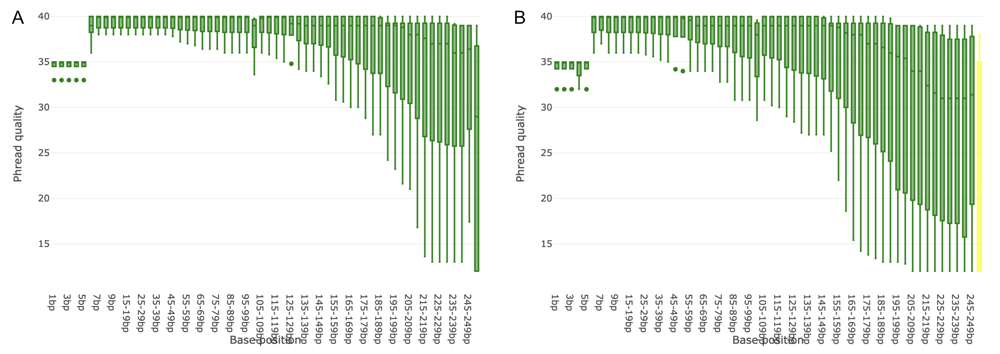
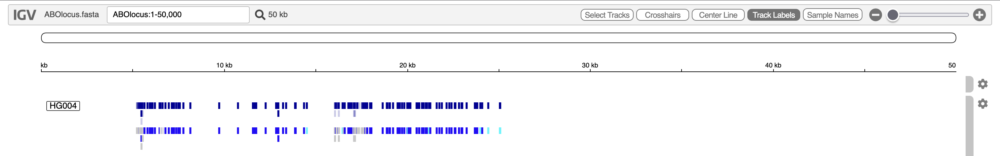

Pangenomes reduce the limitations associated with linear reference genomes, also known as reference bias, so more reads are mapped and fewer reads get discarded (). To learn more about pangenomics, please refer to this [tutorial](../../../genome-annotation/tutorials/pangenome-annotation-with-roary/tutorial.html#pangenomics). Due to the increased natural genomic variation in pangenomes, reads can be mapped with an increased alignment accuracy, which in turn can improve downstream analysis ().

In this tutorial, you will learn how to map reads to a small pangenome. As an example, we will be using a pangenome of the ABO blood group locus. The ABO locus encodes for ABO glycosyltransferases. These enzymes are encoded by three different alleles (A, B and O), where an individual's blood type is determined by the inherited combination of them. 

The linear human reference genome (GRCh38) contains the O allele at the ABO locus (see [rs8176719](https://www.ensembl.org/feature-explorer/GCA_000001405.29/variant:9:133257521:rs8176719?allele=0)). Due to the genetic variability in the ABO locus, mapping with traditional linear mappers is prone to errors, since reads from individuals with the A or B alleles may not be mapped properly. This leads to a lower alignment accuracy and may result in missed or incorrect variant calls. Therefore, using a pangenome overcomes this caveat by increasing the alignment accuracy. 

The ABO locus pangenome used in this tutorial was built using the ABO locus reference from GRCh38 and small variants and haplotypes from the [1000 Genomes Project](https://www.internationalgenome.org/). The files were downloaded from the [vg_wdl GitHub repository](https://github.com/vgteam/vg_wdl/tree/62f07840ed62260e8c9e238632d288f0e41a2350/tests/ABOlocus).

After mapping the reads to the pangenome, the resulting alignments will be used to call variants.

> <agenda-title></agenda-title>
>
> 1. TOC
> {:toc}
>
{: .agenda}

# Data upload

To start mapping reads to a pangenome and to call variants on the alignments, you will need the pangenome itself as well as the reads you want to map. Let’s import these data into Galaxy. They are available via [Zenodo](https://doi.org/10.5281/zenodo.22640895).

> <hands-on-title>Data upload</hands-on-title>
>
> 1. Create a new history for this tutorial. Give it a name like `Pangenome Calling`.
>
>    
>
>    
>
> 2.  the following files from [Zenodo](https://doi.org/10.5281/zenodo.22640895).
>
>    ```
>    https://zenodo.org/records/22640896/files/ABOlocus.gbz?download=1
>    https://zenodo.org/records/22640896/files/HG004.hs37d5.2x250.abo.R1.trimmed.fastq.gz?download=1
>    https://zenodo.org/records/22640896/files/HG004.hs37d5.2x250.abo.R2.trimmed.fastq.gz?download=1
>    https://zenodo.org/records/22640896/files/path_list_file.txt?download=1
>    ```
>
>    
>
>
{: .hands_on}

# Checking data quality

In general, it is always good practice to assess the quality of your data before proceeding with analysis. For this we will use the tool *Falco* to check the quality of the reads.

> <hands-on-title>Checking data quality with Falco</hands-on-title>
>
> 1. Run  with the following parameters (leave everything else unchanged):
>    -  "Raw read data from your current history": HG004.hs37d5.2x250.abo.R1.trimmed.fastq.gz and HG004.hs37d5.2x250.abo.R2.trimmed.fastq.gz
>
{: .hands_on}

## Examine the output

Once *Falco* has finished, two new datasets for each input file will appear in your history. In total, you will find four datasets:
- 2x  **Webpage** file: The final HTML summary of the quality analysis.
- 2x  **Raw data** file: Raw data from Falco. 

Investigate the HTML summary files to look at the read qualities. The data has generally good quality in this example:

<figure style="text-align: center;">
  
  <figcaption>
    <strong>Figure 1: Per base sequence quality of the input reads.</strong> 
      (A) Quality scores of the forward read and (B) Quality scores of the reverse read.
  </figcaption>
</figure>

# Map reads to the pangenome

Now that we know that the quality of our data is good, we can continue to map the reads to the pangenome. For this, we will use the tool *VG Giraffe*, which is specialized to map reads to a pangenome in [GBZ](https://github.com/vgteam/vg/wiki/Extra-details-on-vg-file-formats#gbz-gbwtgraph--gbz) file format. Despite the complexity of mapping to a pangenome, *VG Giraffe* performs this task at a speed comparable to traditional linear mappers. *VG Giraffe* supports short-read mapping and can also be configured for long-read mapping.

> <hands-on-title>Map reads to the pangenome</hands-on-title>
>
> 1. Select `Tools` in the left sidebar and search for  in the list that appears. Select it to open the tool. 
>
> 2. Within *VG Giraffe*, select the following parameters (leave everything else unchanged):
>    -  *"Graph to Map Against"*: Select the `ABOlocus.gbz` graph
>    - For *"Input Reads"*: Select `Read and align paired-end FASTQ/FASTA files (two files)` in the dropdown
>      -  *"Forward Reads"*: Select `HG004.hs37d5.2x250.abo.R1.trimmed.fastq.gz`
>      -  *"Reverse Reads"*: Select `HG004.hs37d5.2x250.abo.R2.trimmed.fastq.gz`
>    - For *"Output Format"*: Select `SAM` in the dropdown
>      -  *"Reference Paths File"*: Select the `path_list_file.txt` file to define the target paths present in the pangenome graph for surjection 
>      - For *"Sample Name"*: Enter `HG004` in the text field
>    - Expand the *"Advanced Options"*
>      - For *"program_options args"*: Enter `--prune-low-cplx` in the text field
>
>    > <comment-title>Surjection to SAM Output</comment-title>
>    > Normally, *VG Giraffe* outputs the mapped reads in a graph-based alignment format like GAM (Graph Alignment Map) or GAF (Graph Alignment Format) which describe the aligned reads as paths through the graph. 
>    >
>    > However, many existing downstream analysis tools require known formats like SAM, BAM or CRAM. For this, *VG Giraffe* surjects the graph-based alignments to the linear reference coordinates by using the linear reference paths present in the pangenome graph (or a provided *"Reference Paths File"* to define the target paths, or a corresponding [XG Graph](https://github.com/vgteam/vg/wiki/Extra-details-on-vg-file-formats#xg-xg-lightweight-graph--path-index) if the paths of interest are absent in the pangenome graph). In doing so, the `--prune-low-cplx` option helps to avoid mapping errors and improve alignment quality in repetitive regions. 
>    >
>    > Using a standard alignment format as the chosen output still provides the advantages of mapping to a pangenome as it reduces reference bias and leads to an overall improved alignment accuracy which is kept after surjection.
>    {: .comment}
>
> 3. Run the tool. 
>
{: .hands_on}

## Examine the output

Once *VG Giraffe* has finished, the mapped reads will appear in your history as a SAM file. Have a look at the alignments.

# Preparation for variant calling

## Post-process alignments

After surjecting the graph-based alignments to the linear reference coordinates, paired reads may be too far apart (e.g., if there is a large deletion in the sample that is absent from the reference). If these are considered properly paired, they can be misinterpreted by downstream variant callers. To avoid false positive variants, we post-process the alignments in the SAM file so that read pairs are only declared “properly paired” if they have a maximum allowable fragment length. For this, we use the tool *AWK*, which is a tool that iterates over each line of a file and performs custom operations.

> <hands-on-title>Post-process Alignments</hands-on-title>
>
> 1. Select `Tools` in the left sidebar and search for  in the list that appears. Select it to open the tool. 
>
> 2. Within *AWK*, select the following parameters (leave everything else unchanged):
>    -  *"File to process"*: Select the SAM file output by *VG Giraffe*
>    - For *"AWK Program"*: Copy and enter the following code:
>       ```
>       BEGIN {
>           FS = "\t";
>           OFS = "\t";
>       }
>
>       # Skip all header rows
>       /^@/ {
>           print;
>           next;
>       }
>
>       # Compute over each record 
>       {
>           # Get fragment length and make it absolute
>           tlen = $9;
>           if (tlen < 0) {
>               tlen = -tlen;
>           }
>           # Adjust the Properly paired bit flag if set
>           if (tlen > VAR1 && (int($2 / 2) % 2 == 1)) {
>               $2 = $2 - 2;
>           }
>           print;
>       }
>       ```
>    - For *"Variables"*: Click the `Insert Variables` button once so a new text field appears
>      - For *"1: Variables"*: Enter the value `3000`. This value will be inserted for the VAR1 variable in the code above and represents the maximum allowable fragment length (in bp) for a read pair.
>
> 3. Run the tool. 
>
{: .hands_on}

Once *AWK* has finished, the processed SAM file will appear in your history. Now, if any properly paired reads had a fragment length greater than our given maximum of 3000 bp, the corresponding bit flag is adjusted so they are no longer considered properly paired.

## Convert SAM to BAM

The upcoming variant calling step requires the alignments to be in BAM format. For this, we will use the tool *Samtools sort*, which sorts the alignments by coordinates and automatically converts the SAM into a BAM file.

> <hands-on-title>Convert SAM to BAM</hands-on-title>
>
> 1. Select `Tools` in the left sidebar and search for  in the list that appears. Select it to open the tool. 
>
> 2. Within *Samtools sort*, select the following parameters (leave everything else unchanged):
>    -  *"BAM File"*: Select the processed SAM file from the previous step
>    - For *"Primary sort key"*: Select `coordinate` in the dropdown
>
> 3. Run the tool. 
>
{: .hands_on}

Once *Samtools sort* has finished, a BAM file will appear in your history that will be used later on.

## Export linear reference from pangenome

While the pangenome graph contains the genetic variation of many individuals or strains, downstream analysis tools, such as variant callers, still require a linear reference. Pangenome graphs in the GBZ format should have the sequences for the target paths which are used during surjection embedded in the graph itself. To export them, we will use the tool *vg paths*. 

Note, that pangenome graphs in the GBZ format may not include all bases for the paths. In such cases, a custom FASTA file containing the sequences for the paths of interest can be used for calling variants. In this example, the `ABOlocus.gbz` graph contains the sequence of the ABO locus which we are interested in. 

> <hands-on-title>Export Linear Reference</hands-on-title>
>
> 1. Select `Tools` in the left sidebar and search for  in the list that appears. Select it to open the tool. 
>
> 2. Within *vg paths*, select the following parameters (leave everything else unchanged):
>    -  *"Input Graph"*: Select the `ABOlocus.gbz` graph
>    - For *"Path Selection"*: Select `From file` in the dropdown
>      -  *"File with path names"*: Select the `path_list_file.txt` file. This file targets that only the reference for the ABO locus should be exported.
>    - For *"Output Type"*: Select `Path Data` in the dropdown
>      - *"Data Format"*: Select `Paths in FASTA format` in the dropdown
>
> 3. Run the tool. 
>
{: .hands_on}

Once *vg paths* has finished, the linear reference of `ABOlocus` will appear in your history. Have a look at the sequence.

# Calling variants

Now that we have prepared our data, we are ready to call variants to identify genetic variations. For this, we will use the tool *DeepVariant*.

> <hands-on-title>Calling Variants</hands-on-title>
>
> 1. Select `Tools` in the left sidebar and search for  in the list that appears. Select it to open the tool. 
>
> 2. Within *DeepVariant*, select the following parameters (leave everything else unchanged):
>    - For *"Source for the reference genome"*: Select `Use a genome from history` in the dropdown
>      -  *"Reference genome"*: Select the `ABOlocus.fa` file
>    -  *"BAM File"*: Select the sorted BAM file
>    - For *"Sample name"*: Enter `HG004` in the text field
>    - *"Generate genomic VCF (gVCF) output"*: Set the switch to `Yes`
>    - Expand the *"Expert options"*
>      - For *"make_examples extra args"*: Enter `normalize_reads=true` in the text field
>
>    > <comment-title>Improving Accuracy</comment-title>
>    > To [improve accuracy](https://github.com/vgteam/vg_wdl#read-realignment) () with *DeepVariant*, left-aligning and realigning the reads helps. *DeepVariant* already realigns reads up to a maximum length of 500 bp by default. To enable left-aligning, we set `normalize_reads=true` during *DeepVariant*'s *make example* step.   
>    >
>    {: .comment}
>
> 3. Run the tool. 
>
{: .hands_on}

## Examine the output

Once *DeepVariant* has finished, you will find two output files in your history:
-  **VCF** file: Contains records of genetic variations.
-  **gVCF** file: Contains records for all sites, whether there is a genetic variation or not.

The VCF file output can now be used for downstream analysis, such as visualisation, using [IGV](https://igv.org/) and the `ABOlocus.fa` as reference, annotation or filtering. 

<figure style="text-align: center;">
  
  <figcaption>
    <strong>Figure 2: Variants displayed in IGV.</strong>
      Visualization of DeepVariant-called variants at the ABO locus, displayed in IGV against the linear reference of the ABO locus.
  </figcaption>
</figure>

# Re-run everything with a workflow

Rather than manually executing each tool shown in this tutorial again to map reads with *VG Giraffe* against a pangenome in GBZ file format, and to call variants with *DeepVariant*, you can use the `Pangenome Variant Calling using VG Giraffe and Google DeepVariant` workflow published to [IWC Workflow Library](https://iwc.galaxyproject.org/) to automate and run the tools sequentially. Read more on how to [import the workflow](../../../introduction/tutorials/galaxy-intro-rdm/tutorial.html#hands-on-try-an-iwc-workflow-with-example-data) to your Galaxy profile. Once the workflow is imported, you can run it with your own data.



# Conclusion

This tutorial provided a step-by-step guide on how to map reads against an ABO locus pangenome using *VG Giraffe* and call variants using *DeepVariant*. By following these steps, you should be able to run the tools with your own data. For a more convenient way to run the tools sequentially, a workflow on the IWC Workflow Library is available that can be imported into your own Galaxy profile to run the tools automatically.

