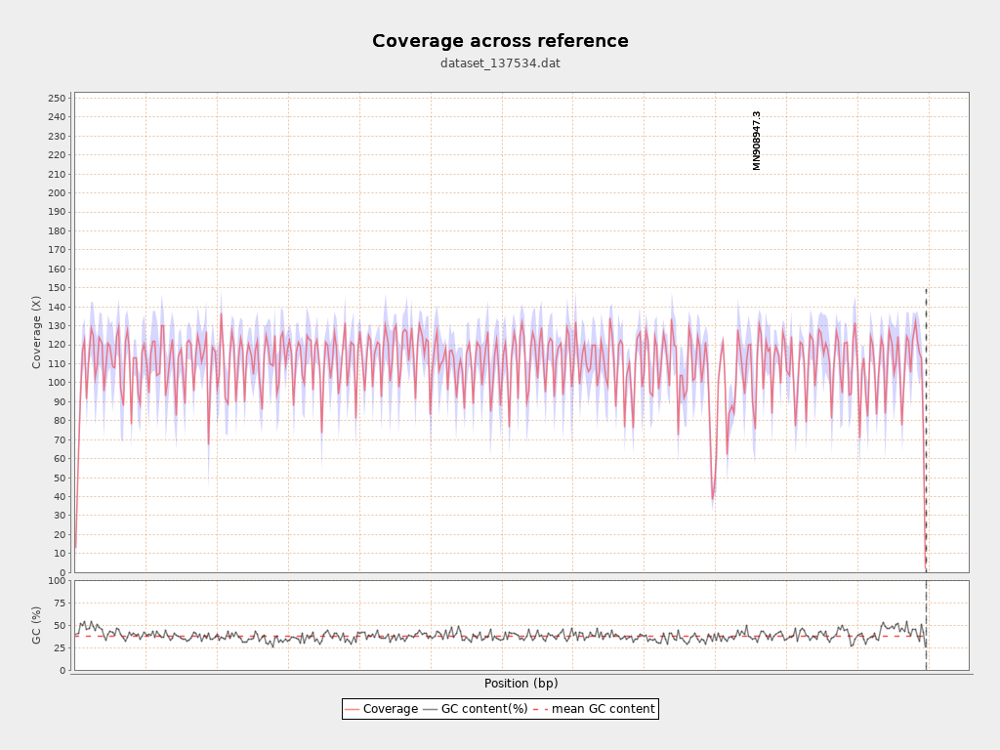
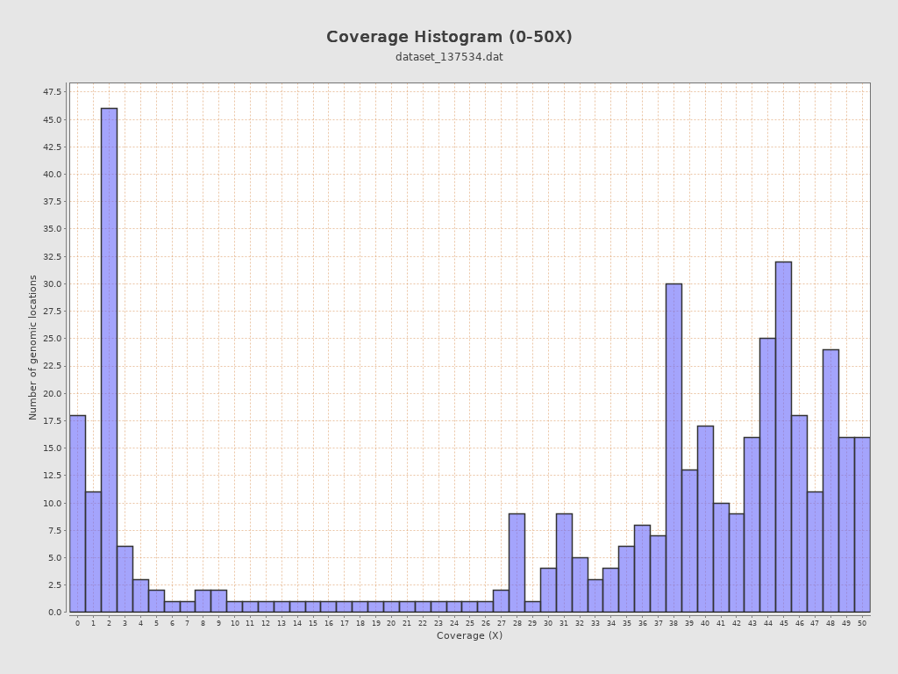

#### Examining mapping results using BamQC

Amplicon sequencing works by PCR amplifying viral sequencing using pools of *tiled amplicons*. As with any PCR reaction,
multiple factors including primer binding affinity, abundance of sub-genomic DNA fragments and annealing temperature parameters can result very widely varying abundance of different amplicons. For more information on the use and optimisation of the ARTIC protocol read this [guide by Josh Quick](https://www.protocols.io/view/ncov-2019-sequencing-protocol-v3-locost-bh42j8ye) and this [technical note from the Sanger Institute](https://s3.amazonaws.com/protocols-files/public/a07b6b20b1986ca1f94d2c5604d9d6b99912950b9f571acee28a457e5264d59b/cmm8bcqrx.pdf). Also note that as SARS-CoV-2 evolves, approaches to sequencing it need to evolve to. See, for example, this [preprint](https://www.medrxiv.org/content/10.1101/2021.06.01.21258181v1.full) on the impact of mutations in emerging variant of concern lineages on SARS-CoV-2 sequencing.

The  tool collects both statistics on mapping (i.e. on a BAM file) and also produces plots illustrating the read coverage across the genome. We will use this tool to do a detailed inspection of our filtered BAM output.

> ###  Examining genomic coverage with *BamQC*
> 1. Select the  tool and select the  *Filter SAM or BAM, output SAM or BAM on data XX* dataset collection as input.
> 2. In the *Skip duplicate reads* options, ensure that the *Duplicates detected by Qualimap* option is selected
> 3. *Execute* the tool
{: .hands_on}

> ###  Interpreting coverage depth plots
>
> *BamQC* produces two sets of output: reports and raw data. The raw data is designed for other programs (e.g. *MultiQC*) to read.
> We will focus on the reports, and specifically the one for sample ERR4970105. 
>
> In the *BamQC* output, examine the report for , pay special attention to the *Mean Coverage* (in section *Coverage*) and the *Coverage across reference*, *Coverage Histogram* and *Coverage Histogram (0-50X)* plots.
>
> 1. What was the mean coverage across the genome?
> 2. Was the coverage even across the genome? Were there any dips in coverage?
> 3. Did any parts of the genome have coverage below 10 bases?
> 4. Each sequencing run should include a negative control. What do we expect the coverage across the reference to look like for the negative control sample?
> 5. Each run should also include a positive control. What do we expect the coverage graph of the positive control to show?
>
> > ###  Solution
> >
> > 1. The mean coverage is 109.5857.
> > 2. The coverage was approximately even but there was one dip to about depth 40X coverage. You can see this on the *Coverage across reference* graph: .
> > 3. There were a small number of places with depth below 10 bases. Careful examination of the coverage will show this is happening at the ends of the genome (start and end). You can see this from the *Coverage Histogram (0-50X)* graph: .
> > 4. The negative control should show very low or no coverage across the genome. Since the negative control essentially involves sequencing water, we do not expect to find any reads that match the viral genome. If we *do* see higher coverage in the negative control sample it suggests that our run has been contaminated.
> > 5. The positive control should be based on a known genomic sample and should show good coverage across the genome. If we have low coverage in the positive control sample, it means that something has gone wrong in our sequencing process: amplification has failed, or some other step in the sequencing workflow has not worked as expected.
> {: .solution}
>
{: .question}