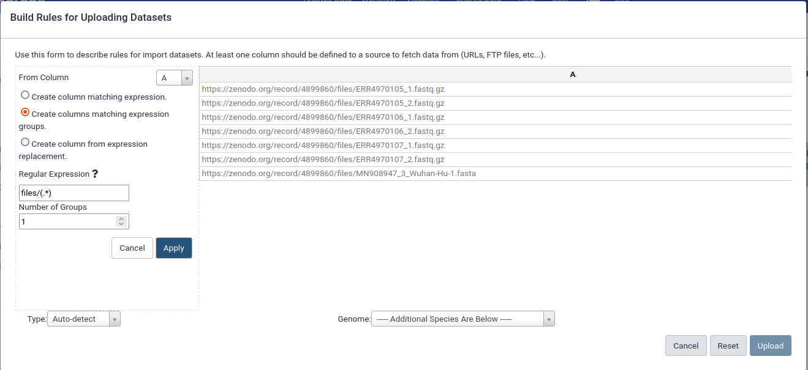

#### Advanced Topic: Using the Rule Based Uploader

Galaxy has a tool, the Rule Based Uploader (RBU), that makes it easier to organise and upload many datasets. We can use this tool in two steps:

1. Fetch the data from Zenodo to our Galaxy history.

2. Organise the sequence samples in our Galaxy history into a List of Paired datasets collect.

Let us see how to do the *Data Upload* this way.

> ####  Hands-on: Data upload and organisation using the Rule Based Uploader 
> 
> 1. Create a new history
> 2. Open the Upload Data  tool and select the *Rule-based* tab. Paste the data URLs into the text box
>
>
>    ```
>https://zenodo.org/record/4899860/files/ERR4970105_1.fastq.gz
>https://zenodo.org/record/4899860/files/ERR4970105_2.fastq.gz
>https://zenodo.org/record/4899860/files/ERR4970106_1.fastq.gz
>https://zenodo.org/record/4899860/files/ERR4970106_2.fastq.gz
>https://zenodo.org/record/4899860/files/ERR4970107_1.fastq.gz
>https://zenodo.org/record/4899860/files/ERR4970107_2.fastq.gz
>https://zenodo.org/record/4899860/files/MN908947_3_Wuhan-Hu-1.fasta
>    ```
>
> 3. Leave the drop-down boxes on their default options: *Upload data as: Datasets* and *Load tabular data from: Pasted Table*. Click the *Build* button. You will now see the Rule Based Uploader (RBU) window, ready for you to start adding rules:
>
>     
>
> 4. Select the *Column* button and select *Regular Expression* to add a new column using a result expression. Select the "Create columns matching regular expression groups" option. Enter `files/(.*)` in the *Regular Expression* entry box and click *Apply*.
>
>    
>
> 5. Using the *Rules* button add two rule definitions (with the *Add / Modify Column Definitions* option):
>     1. Make column A the URL
>     2. Make column B the Name
>
>     Your RBU should now look like:
>
>    
>
> 6. Now do the upload by clicking the *Upload* button. This will upload the data and create datasets in your history. Using the Rule Based Uploader means that you do not need to manually rename the datasets you upload. You can also create collections at upload time and descriptive tags. These features are described in the [RBU tutorial](https://training.galaxyproject.org/training-material/topics/galaxy-interface/tutorials/upload-rules/tutorial.html) and the [Advanced RBU tutorial](https://training.galaxyproject.org/training-material/topics/galaxy-interface/tutorials/upload-rules-advanced/tutorial.html). Once your upload is completed your history should look like this:
>
>    
>
> 7. Now that we have loaded the datasets we need into our history, we need to organise the FASTQ files into a collection so that they can be processed together. You can learn more about collections in [this tutorial](https://training.galaxyproject.org/training-material/topics/galaxy-interface/tutorials/collections/tutorial.html).
>    
>    To build a collection from our FASTQ datasets, select the "Operations on multiple datasets" tick box. Then select all of the datasets except for the "MN908947_3_Wuhan-Hu-1.fasta" one. Select the "For all select.." button and you will see a menu which has a "Build Collection from Rules" option. It looks like this:
>
>    
>
>  8. The window that opens is like the Rule Based Uploader but it is used for organising datasets in your history. We want to do the following operations:
>    1. Create a *Column* using a *Regular Expression* with the *matching expression groups* option, column *B* selected and this regular expression: `(.*)_[12]`
>    2. Create a *Column* using a *Regular Expression* with the *matching expression groups* option, column *B* selected and this regular expression: `_([12]).fastq`
>    3. Edit the *Rules* to *Add / Modify Column Definitions* so that:
>         1. Column *C* (not column *B*) is the List Identifier
>         2. Column D is the Paired Indicator (this tells Galaxy which read of a read pair a dataset refers to, read1 or read2)
>    4. Give your collection a name (e.g. samples) and select the *Add nametage for name* check box.
>    5. Click *Create* to create the collection
{: .hands_on}
