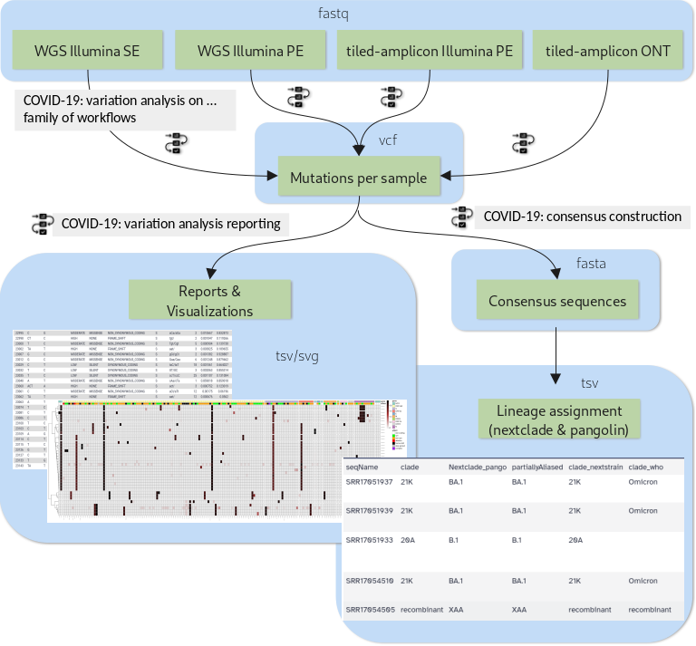
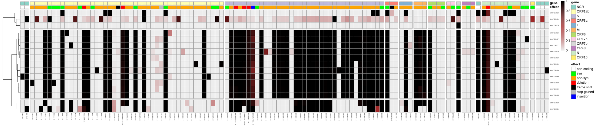

Sequence-based monitoring of global infectious disease crises, such as the COVID-19 pandemic, requires capacity to generate and analyze large volumes of sequencing data in near real time. These data have proven essential for surveilling the emergence and spread of new viral variants, and for understanding the evolutionary dynamics of the virus.

The tutorial [SARS-CoV-2 sequencing data analysis]() shows in detail how you can identify mutations in SARS-CoV-2 samples from paired-end whole-genome sequencing data generated on the Illumina platform.

For versatile and efficient genome surveillance, however, you would want to:
- be able to analyze data of different origin

  Besides WGS paired-end Illumina data, different labs are generating also single-end Illumina and ONT data, and are combining these platforms with various tiled-amplicon approaches upstream of sequencing.

- go beyond per-sample mutation calls in variant call format (VCF)

  To keep track of large numbers of samples sequenced in batches (as, nowadays, produced routinely by SARS-CoV-2 genome surveillance initiatives across the globe), you need concise reports and visualizations of results at the sample and batch level.

- use sample mutation patterns to construct sample consensus genomes

- use the consensus genomes to assign the samples to SARS-CoV-2 lineages as defined by major lineage classification systems ([Nextstrain clades](https://nextstrain.org/blog/2022-04-29-SARS-CoV-2-clade-naming-2022) and [PANGO](https://www.pango.network/))

- decrease hands-on time and data manipulation errors by combining analysis steps into workflows for automated execution

The purpose of this tutorial is to demonstrate how a set of workflows developed by the [Galaxy Covid-19 project](https://galaxyproject.org/projects/covid19/) can be combined and used together with a handful of additional tools to achieve all of the above. Specifically, we will cover the analysis flow presented in figure 1.



Depending on the type of sequencing data **one of four variation analysis workflows** can be run to discover mutations in a batch of input samples. Outputs of any of these workflows can then be processed further with two additional workflows: the **variation reporting workflow** generates a per-sample report of mutations, but also batch-level reports and visualizations, while the **consensus construction workflow** reconstructs the full viral genomes of all samples in the batch by modifying the SARS-CoV-2 reference genome with each sample's set of mutations.

A few highlights of these workflows are:

- All the variation analysis workflows are more sensitive than they need to be for consensus sequence generation, i.e. they can not only be used to capture fixed or majority alleles, but can also be used on their own to address less routine questions such as co-infections with two viral lineages or shifting intrahost allele-frequencies in, for example, immunocompromised, longterm-infected patients.
- The reporting workflow produces a batch-level overview plot of mutations and their observed allele-frequencies that enables spotting of batch-effects like sample cross-contamination and outlier samples that are different from the rest of the batch.
- The consensus workflow can express uncertainty about any base position in the generated consensus sequence by N-masking the position according to user-defined thresholds.
- All of the workflows are openly developed and available in the form of defined releases through major public workflow registries.

In this tutorial you will learn to
- obtain releases of the workflows from public registries
- set up input data for different types of sequencing protocols
- run and combine the workflows
- understand the various outputs produced by the workflows and to extract insight about viral samples from them

> <agenda-title></agenda-title>
>
> In this tutorial, we will cover:
>
> 1. TOC
> {:toc}
>
{: .agenda}


# Prepare Galaxy and data

The suggested input for this tutorial is a special batch of data that is of particular interest as it represents a turning point in the COVID-19 pandemic.
It is a subset (16 samples) of the first sequencing data reported from South Africa at the end of November 2021 for the then novel, fast-spreading SARS-CoV-2 variant that would later be named Omicron.
This data has been Illumina paired-end sequenced after amplification with the ARTIC v4 set of tiled-amplicon primers.

> <comment-title>Bringing your own data</comment-title>
> Alternatively, you can also follow this tutorial using your own SARS-CoV-2 sequencing data (you need at least two samples) as long as it is of one of the following types:
>
> - Single-end data derived from Illumina-based whole-genome sequencing experiments
> - Paired-end data derived from Illumina-based whole-genome sequencing experiments
> - Paired-end data generated with Illumina-based tiled-amplicon (e.g. ARTIC) protocols
> - ONT FASTQ files generated with Oxford nanopore (ONT)-based tiled-amplicon (e.g. ARTIC) protocols
>
>  If you are using your own *tiled-amplicon* data, you are also expected to know the primer scheme used at the amplification step.
>
{: .comment}

## Prepare a new Galaxy history

Any analysis should get its own Galaxy history. So let's start by creating a new one:

> <hands-on-title>Prepare the Galaxy history</hands-on-title>
>
> 1. Create a new history for this analysis
>
>    
>
> 2. Rename the history
>
>    
>
{: .hands_on}

## Get sequencing data

> <comment-title>Importing your own data</comment-title>
> If you are going to use your own sequencing data, there are several possibilities to upload the data depending on how many datasets you have and what their origin is:
>
> - You can import data
>
>   - from your local file system,
>   - from a given URL or
>   - from a shared data library on the Galaxy server you are working on
>
>   In all of these cases you will also have to organize the imported data into a dataset collection like explained in detail for the suggested example data.
>
>   > <details-title>Data logistics</details-title>
>   >
>   > A detailed explanation of all of the above-mentioned options for getting your data into Galaxy and organizing it in your history is beyond the scope of this tutorial.
>   > If you are struggling with getting your own data set up like shown for the example data in this section, please:
>   > - Option 1: Browse some of the material on [Using Galaxy and Managing your Data]()
>   > - Option 2: Consult the FAQs on [uploading data](#data%20upload) and on [collections](#collections)
>   > - Option 3: Watch some of the related brief videos from the [ Galactic introductions](https://www.youtube.com/playlist?list=PLNFLKDpdM3B9UaxWEXgziHXO3k-003FzE) playlist.
>   >
>   {: .details}
>
> - Alternatively, if your data is available from [NCBI's Sequence Read Archive (SRA)](https://www.ncbi.nlm.nih.gov/sra), you can import it with the help of a dedicated tool, which will organize the data into collections for you.
>
>   > <details-title>Getting data from SRA</details-title>
>   >
>   > The simpler [SARS-CoV-2 sequencing data analysis tutorial]() uses and explains this alternative way of importing.
>   >
>   {: .details}
{: .comment}

For the suggested batch of early Omicron data we suggest downloading it via URLs from the [European Nucleotide Archive (ENA)](https://www.ebi.ac.uk/ena/browser/home). In case your Galaxy server offers that same data through a shared data library, this represents a faster (data is already on the server) alternative, so we offer instructions for this scenario as well.

> <hands-on-title>Import the sequencing data</hands-on-title>
>
> - Option 1: Import from the ENA
>
>   ```
>   ftp://ftp.sra.ebi.ac.uk/vol1/fastq/SRR170/002/SRR17054502/SRR17054502_1.fastq.gz
>   ftp://ftp.sra.ebi.ac.uk/vol1/fastq/SRR170/002/SRR17054502/SRR17054502_2.fastq.gz
>   ftp://ftp.sra.ebi.ac.uk/vol1/fastq/SRR170/003/SRR17054503/SRR17054503_1.fastq.gz
>   ftp://ftp.sra.ebi.ac.uk/vol1/fastq/SRR170/003/SRR17054503/SRR17054503_2.fastq.gz
>   ftp://ftp.sra.ebi.ac.uk/vol1/fastq/SRR170/004/SRR17054504/SRR17054504_1.fastq.gz
>   ftp://ftp.sra.ebi.ac.uk/vol1/fastq/SRR170/004/SRR17054504/SRR17054504_2.fastq.gz
>   ftp://ftp.sra.ebi.ac.uk/vol1/fastq/SRR170/005/SRR17054505/SRR17054505_1.fastq.gz
>   ftp://ftp.sra.ebi.ac.uk/vol1/fastq/SRR170/005/SRR17054505/SRR17054505_2.fastq.gz
>   ftp://ftp.sra.ebi.ac.uk/vol1/fastq/SRR170/006/SRR17054506/SRR17054506_1.fastq.gz
>   ftp://ftp.sra.ebi.ac.uk/vol1/fastq/SRR170/006/SRR17054506/SRR17054506_2.fastq.gz
>   ftp://ftp.sra.ebi.ac.uk/vol1/fastq/SRR170/007/SRR17054507/SRR17054507_1.fastq.gz
>   ftp://ftp.sra.ebi.ac.uk/vol1/fastq/SRR170/007/SRR17054507/SRR17054507_2.fastq.gz
>   ftp://ftp.sra.ebi.ac.uk/vol1/fastq/SRR170/008/SRR17054508/SRR17054508_1.fastq.gz
>   ftp://ftp.sra.ebi.ac.uk/vol1/fastq/SRR170/008/SRR17054508/SRR17054508_2.fastq.gz
>   ftp://ftp.sra.ebi.ac.uk/vol1/fastq/SRR170/009/SRR17054509/SRR17054509_1.fastq.gz
>   ftp://ftp.sra.ebi.ac.uk/vol1/fastq/SRR170/009/SRR17054509/SRR17054509_2.fastq.gz
>   ftp://ftp.sra.ebi.ac.uk/vol1/fastq/SRR170/010/SRR17054510/SRR17054510_1.fastq.gz
>   ftp://ftp.sra.ebi.ac.uk/vol1/fastq/SRR170/010/SRR17054510/SRR17054510_2.fastq.gz
>   ftp://ftp.sra.ebi.ac.uk/vol1/fastq/SRR170/033/SRR17051933/SRR17051933_1.fastq.gz
>   ftp://ftp.sra.ebi.ac.uk/vol1/fastq/SRR170/033/SRR17051933/SRR17051933_2.fastq.gz
>   ftp://ftp.sra.ebi.ac.uk/vol1/fastq/SRR170/034/SRR17051934/SRR17051934_1.fastq.gz
>   ftp://ftp.sra.ebi.ac.uk/vol1/fastq/SRR170/034/SRR17051934/SRR17051934_2.fastq.gz
>   ftp://ftp.sra.ebi.ac.uk/vol1/fastq/SRR170/035/SRR17051935/SRR17051935_1.fastq.gz
>   ftp://ftp.sra.ebi.ac.uk/vol1/fastq/SRR170/035/SRR17051935/SRR17051935_2.fastq.gz
>   ftp://ftp.sra.ebi.ac.uk/vol1/fastq/SRR170/036/SRR17051936/SRR17051936_1.fastq.gz
>   ftp://ftp.sra.ebi.ac.uk/vol1/fastq/SRR170/036/SRR17051936/SRR17051936_2.fastq.gz
>   ftp://ftp.sra.ebi.ac.uk/vol1/fastq/SRR170/037/SRR17051937/SRR17051937_1.fastq.gz
>   ftp://ftp.sra.ebi.ac.uk/vol1/fastq/SRR170/037/SRR17051937/SRR17051937_2.fastq.gz
>   ftp://ftp.sra.ebi.ac.uk/vol1/fastq/SRR170/038/SRR17051938/SRR17051938_1.fastq.gz
>   ftp://ftp.sra.ebi.ac.uk/vol1/fastq/SRR170/038/SRR17051938/SRR17051938_2.fastq.gz
>   ftp://ftp.sra.ebi.ac.uk/vol1/fastq/SRR170/039/SRR17051939/SRR17051939_1.fastq.gz
>   ftp://ftp.sra.ebi.ac.uk/vol1/fastq/SRR170/039/SRR17051939/SRR17051939_2.fastq.gz
>   ```
>
>   1. Copy the links above
>   2. Open the  Manager
>   3. In the top row of tabs select **Collection**
>   4. Configure the drop-down select boxes on that tab like this:
>      - *"Collection Type"*: `List of Pairs`
>      - *"File Type"*: `fastqsanger.gz`
>   5. Click on **Paste/Fetch data** and paste the links you copied into the empty text box
>   6. Press **Start**
>   7. Wait for the **Build** button to become enabled, then click it
>   8. In the lower half of the next dialogue, Galaxy already suggests a mostly reasonable pairing of the inputs.
>
>      As you can see, however, this auto-pairing would retain a *.fastq* suffix attached to each pair of forward and reverse reads. To correct this
>      1. Click **Unpair all** above the suggested pairings to undo all of them.
>      2. Change the following default values in the upper half of the window:
>         - *"unpaired forward"*: `_1.fastq.gz` (instead of *_1*)
>         - *"unpaired reverse"*: `_2.fastq.gz` (instead of *_2*)
>      3. Click **Auto-pair**
>   9. At, the bottom of the window, enter a suitable **Name**, like `Sequencing data`, for the new collection
>   10. Click on **Create collection**
>
> - Option 2: Import from a shared data library
>
>   
>
{: .hands_on}

## Import reference sequence and auxiliary datasets

Besides the sequenced reads data, we need at least two additional datasets for calling variants and annotating them:

- the SARS-CoV-2 reference sequence [NC_045512.2](https://www.ncbi.nlm.nih.gov/nuccore/NC_045512.2?report=fasta) to align and compare our sequencing data against

- a tabular dataset defining aliases for viral gene product names, which will let us translate NCBI RefSeq Protein identifiers (used by the SnpEff annotation tool) to the commonly used names of coronavirus proteins and cleavage products.

> <hands-on-title>Get reference sequence and feature mappings</hands-on-title>
>
> 1. Get the SARS-CoV-2 reference sequence
>
>    A convenient public download link for this sequence is best obtained from the ENA again, where the sequence is known under its [INSDC](https://www.insdc.org/) alias [MN908947.3](https://www.ebi.ac.uk/ena/browser/view/MN908947.3):
>    ```
>    https://www.ebi.ac.uk/ena/browser/api/fasta/MN908947.3?download=true
>    ```
>
>    1.  the reference to your history via the link above and make sure the dataset format is set to `fasta`.
>
>       
>    2.  to simplify the reference sequence name
>       -  *"File to process"*: the uploaded reference sequence from the ENA
>       - In  *"1. Replacement"*:
>         - *"Find pattern"*: `^>.+`
>         - *"Replace with"*: `>NC_045512.2`
>
>       While the identifiers `MN908947.3` and `NC_045512.2` really refer to the same sequence, one of the tools we are going to use during the analysis (SnpEff) requires the NCBI RefSeq identifier.
>    3. When the Replace Text tool run is finished, **rename** the output dataset to make it clear that this is the SARS-CoV-2 reference dataset to use in the analysis.
>
>       
> 2.  the mapping for translation product identifiers in tabular format
>
>    This mapping really consists of just a few lines of text. Each line lists the NCBI Protein Refseq identifier of a SARS-CoV-2 translation product (which the tool SnpEff knows about and will use for annotating mutation effects), followed by a more commonly used name for that product (which we would like to see in final mutation reports). The last line specifies a "mapping" for the **.** annotation, which SnpEff uses for mutations that do not affect any viral open-reading frame. We do not have a better name for it so we specify that we want to retain this annotation unaltered in reports.
>
>    ```
>    YP_009725297.1    leader
>    YP_009725298.1    nsp2
>    YP_009725299.1    nsp3
>    YP_009725300.1    nsp4
>    YP_009725301.1    3Cpro
>    YP_009725302.1    nsp6
>    YP_009725303.1    nsp7
>    YP_009725304.1    nsp8
>    YP_009725305.1    nsp9
>    YP_009725306.1    nsp10
>    YP_009725307.1    RdRp
>    YP_009725308.1    helicase
>    YP_009725309.1    ExoN
>    YP_009725310.1    endoR
>    YP_009725311.1    MethTr
>    YP_009725312.1    nsp11
>    GU280_gp02        S
>    GU280_gp03        orf3a
>    GU280_gp04        E
>    GU280_gp05        M
>    GU280_gp06        orf6
>    GU280_gp07        orf7a
>    GU280_gp08        orf7b
>    GU280_gp09        orf8
>    GU280_gp10        N
>    GU280_gp11        orf10
>    .                 .
>    ```
>
>    Two remarks on this content:
>    - Since the feature mapping dataset is expected to be in tabular format, but the above display uses spaces to separate columns, please make sure, you have **Convert spaces to tabs** checked when creating the dataset from the copied content!
>    - If you prefer other names for certain translation products than the ones defined above (*e.g.* you might be used to call the first peptide *nsp1* instead of *leader*), you are, of course, free to change those names in the pasted content before uploading it to Galaxy. What needs to be kept is only the Refseq identifiers in the first column as these are fixed by the SnpEff tool.
>
>    
>
{: .hands_on}

Another two datasets are needed only for the analysis of ampliconic, e.g. ARTIC-amplified, input data:

- a BED file specifying the primers used during amplification and their binding sites on the viral genome
- a custom tabular file describing the amplicon grouping of the primers (currently NOT used for tiled-amplicon ONT data)

> <details-title>Using your own tiled-amplicon data? Provide the correct primer scheme and amplicon info.</details-title>
>
> The instructions below assume that you are going to analyze viral samples amplified using **version 4 of the ARTIC network's SARS-CoV-2 set of primers**, which is the case for the suggested Omicron batch of data.
>
> If you have decided to analyze your own tiled-amplicon sequencing data in this tutorial, and if your samples have been amplified with a **different** set of primers, you are supposed, at the following step, to upload a primer scheme file and corresponding amplicon information that describes this set of primers.
>
> The Galaxy Project maintains a [collection of such files for some commonly used sets of primers](https://doi.org/10.5281/zenodo.4555734).
> If the files describing your set of primers are part of this collection, you can simply upload them using their Zenodo download URLs (analogous to what is shown for the ARTIC v4 primers below).
>
> For sets of primers *not* included in the collection, you will have to create those files yourself (or obtain them from other sources).
> The expected format for the primer scheme file is 6-column BED format, while the amplicon info file is a simple tabular format that lists all primer names (which must be identical to the ones used in the primer scheme file) that contribute to formation of the same amplicon on a single tab-separated line.
> If in doubt, download the ARTIC v4 files through the URLs provided below, and use them as a template for your own custom files.
>
{: .details}

> <hands-on-title>Get primer scheme and amplicon info</hands-on-title>
>
> 1. Get the ARTIC v4 primer scheme file from
>
>    ```
>    https://zenodo.org/record/5888324/files/ARTIC_nCoV-2019_v4.bed
>    ```
>
>    and upload it to Galaxy as a dataset of type `bed`.
>
>    
>
> 2. Get the ARTIC v4 amplicon info file from
>
>    ```
>    https://zenodo.org/record/5888324/files/ARTIC_amplicon_info_v4.tsv
>    ```
>
>    and upload it to Galaxy as a dataset of type `tabular`.
>
>    
>
{: .hands_on}

At this point you should have the following items in your history:

1. A collection of sequenced reads for all samples to be analyzed
   - This collection should be organized as a list with one element per sample that you are planning to analyze.

     If you are going to analyze the suggested batch of Omicron data, the list should have 16 elements.

   - For paired-end sequenced data, like the suggested batch, each of the list elements should itself be a paired collection of a *forward* and a *reverse* reads dataset, each in *fastqsanger.gz* format.

2. The SARS-CoV-2 reference as a single *fasta* dataset
3. The SARS-CoV-2 feature mappings as a single *tabular* dataset
4. Only required if you are analyzing *tiled-amplicon* data (which is the case for the suggested batch):
   - a primer scheme as a single *bed* or *bed6* dataset
   - amplicon information as a single *tabular* dataset (*not* required for ONT data)

If any of these items are still missing, head back to the corresponding section(s) and upload them now.

If any of these items have not been assigned the correct format (expand the view of each dataset to reveal the format Galaxy has recorded for it), please fix them now.



If everything looks fine, you are ready to start the actual data analysis.


# Analysis

As shown in figure 1, the analysis will consist mainly of running three workflows - one for calling the mutations for each input sample, one for reporting the findings and one for generating sample consensus sequences based on the identified mutations.

You will also run a handful of individual tools, in particular for generating and exploring lineage assignments for the input samples.

Along the way you will interpret key outputs of each used workflow and tool to get a complete picture of what can be learnt about the genomes of the input samples.

## From sequencing data to annotated mutations per sample

To identify mutations from sequencing data, the first workflow performs steps including

- sequencing data quality control with filtering and trimming of low-quality reads
- mapping
- filtering and further processing of mapped reads (including primer-trimming in case of tiled-amplicon data)
- calling of mutations
- annotation of identified mutations with their effects on open-reading frames (ORFs) and proteins

Four flavors of this workflow are available that are optimized for different types of input data so your first task is to obtain the correct workflow for your type of input data.

> <hands-on-title>Import the workflow for your data into Galaxy</hands-on-title>
>
> All workflows developed as part of the Galaxy Covid-19 project can be retrieved via either of the two popular workflow registries [Dockstore](https://dockstore.org/) and [WorkflowHub](https://workflowhub.eu/), the choice is up to you, and Galaxy makes this process really easy for you.
>
> 
>
> *IWC* (the intergalactic workflow commission) is the organization that the Galaxy Covid-19 project uses to publish its workflows, and the name restriction makes sure we are only getting workflows from that organization that deal with SARS-CoV-2 data analysis.
>
> Depending on your input data you will need to select the appropriate workflow from the list of hits returned by the workflow registry server.
> This would be:
> - **sars-cov-2-pe-illumina-artic-variant-calling/COVID-19-PE-ARTIC-ILLUMINA**
>
>   if you are working with the suggested batch of samples for this tutorial, or if your own data is tiled-amplicon data sequenced on the Illumina platform in paired-end mode
>
>   Once imported into Galaxy, this workflow appear under the name: **COVID-19: variation analysis on ARTIC PE data**.
> - **sars-cov-2-ont-artic-variant-calling/COVID-19-ARTIC-ONT**
>
>   if you are working with tiled-amplicon data sequenced on the ONT platform
>
>   Once imported into Galaxy, this workflow appear under the name: **COVID-19: variation analysis of ARTIC ONT data**.
> - **sars-cov-2-pe-illumina-wgs-variant-calling/COVID-19-PE-WGS-ILLUMINA**
>
>   if you are working with WGS (i.e. non-ampliconic) data obtained on the Illumina platform in paired-end mode
>
>   Once imported into Galaxy, this workflow appear under the name: **COVID-19: variation analysis on WGS PE data**.
> - **sars-cov-2-se-illumina-wgs-variant-calling/COVID-19-SE-WGS-ILLUMINA**
>
>   if you are working with WGS data obtained on the Illumina platform in single-end mode
>
>   Once imported into Galaxy, this workflow appear under the name: **COVID-19: variation analysis on WGS SE data**.
>
> In all cases, the latest version of the workflow should be fine to use in this tutorial.
>
{: .hands-on}

> <details-title>About the workflows</details-title>
>
> Differences between the four different *variation analysis* workflow flavors are as follows:
> - All workflows for analysis of Illumina data use a core analysis flow through **bwa-mem** (or **bowtie2** for single-end data) as the read mapper and **lofreq** as a sensitive variant caller (which is capable of identifying also non-majority variant alleles), while the workflow for analysis of ONT data uses **minimap2** and **medaka** for read mapping and variant calling, respectively.
> - Workflows for analysis of tiled-amplicon data differ from WGS data analysis ones in that they do not perform mapped reads deduplication (because apparent duplicates are a side-effect of sequencing defined amplicons instead of random genome fragments).
>   In addition, the tiled-amplicon data analysis workflows handle primer trimming and amplicon-based filtering through the **ivar** suite of tools and additional processing logic.
>
> All four workflows use **fastp** for quality control, raw reads filtering and trimming, and **SnpEff**, specifically its 4.5covid19 version, for annotation of mutation effects.
>
{: .details}



> <hands-on-title>From sequencing data to annotated mutations</hands-on-title>
>
> <div class="tiled-amplicon-Illumina-paired-end" markdown="1">
>
> 1. Run the **COVID-19: variation analysis on ARTIC PE data**  workflow using the following parameters:
>
>    -  *"Paired Collection"*: your paired collection of input sequencing data
>    -  *"NC_045512.2 FASTA sequence of SARS-CoV-2"*: the `SARS-CoV-2 reference` sequence
>    -  *"ARTIC primer BED"*: the uploaded primer scheme in **bed** format
>    -  *"ARTIC primers to amplicon assignments"*: the uploaded amplicon info in **tabular** format
>
>      A common mistake here is to mix up the last two datasets: the *primer BED* dataset is the one with the positions of the primer binding sites listed in it. The *amplicon assignments* dataset contains only (grouped) names of primers.
>
>    The additional workflow parameters *"Read removal minimum AF"*, *"Read removal maximum AF"*, *"Minimum DP required after amplicon bias correction"* and *"Minimum DP_ALT required after amplicon bias correction"* can all be left at their default values. The tiled-amplicon Illumina workflow goes to great lengths in order to calculate accurate allele-frequencies even in cases of viral mutations that affect the binding of some of the tiled-amplicon primers. The four settings above are for fine-tuning this behavior, but their defaults have been carefully chosen and you should modify them only if you know exactly what you are doing. 
> </div>
> <div class="tiled-amplicon-ONT" markdown="1">
>
> 1. Run the **COVID-19: variation analysis of ARTIC ONT data**  workflow using the following parameters:
>
>    -  *"ONT-sequenced reads"*: your collection of input sequencing data
>    -  *"NC_045512.2 FASTA sequence of SARS-CoV-2"*: the `SARS-CoV-2 reference` sequence
>    -  *"Primer binding sites info in BED format"*: the uploaded primer scheme in **bed** format
>
>    The optional workflow parameters *"Minimum read length"* and *"Maximum read length"* should be chosen according to the tiled-amplicon primer scheme's amplicon sizes.
>    The [ARTIC network's recommendations for excluding obviously chimeric reads](https://artic.network/ncov-2019/ncov2019-bioinformatics-sop.html) (see the section "Read filtering" on that page) are a good starting point.
>
>    The workflow defaults are appropriate for ARTIC network primers, but you may have to modify them if your sample material has been amplified with another primer scheme. As suggested on the above page: try to set *"Minimum read length"* to the size of the smallest amplicon in your primer scheme, and *"Maximum read length"* to the size of the largest amplicon plus 200 nts.
>
> </div>
> <div class="WGS-Illumina-paired-end" markdown="1">
>
> 1. Run the **COVID-19: variation analysis on WGS PE data**  workflow using the following parameters:
>
>    -  *"Paired Collection"*: your paired collection of input sequencing data
>    -  *"NC_045512.2 FASTA sequence of SARS-CoV-2"*: the `SARS-CoV-2 reference` sequence
>
> </div>
> <div class="WGS-Illumina-single-end" markdown="1">
>
> 1. Run the **COVID-19: variation analysis on WGS SE data**  workflow using the following parameters:
>
>    -  *"Single End Collection"*: your collection of input sequencing data
>    -  *"NC_045512.2 FASTA sequence of SARS-CoV-2"*: the `SARS-CoV-2 reference` sequence
>
> </div>
>
>    > <tip-title>Running a workflow</tip-title>
>    >
>    > 
>    >
>    > Note: the  icon next to **Run Workflow** offers the option to *Send results to a new history*.
>    > This is very useful if you are planning to analyze the data in your current history in multiple different ways, and you would like to have each analysis end up in its own dedicated history.
>    > Here, however, we only want to do one analysis of our batch of data so we are fine with results of the workflow run getting added to the current history.
>    {: .tip}
>
{: .hands_on}

Scheduling of the workflow will take a while. One of the last datasets that will be added to your history will be called **Preprocessing and mapping reports**. It is the first overview report that you will obtain in this tutorial, and the only one produced by the variation analysis workflow.

Once this dataset is ready take a moment to explore its content. It contains potentially valuable information about coverage of reads mapped to the reference genome and quality statistics for these reads. Technical issues with any samples in a batch are typically visible in this report already and spotting them early can often prevent overinterpretation of later reports.

If you are following along with the suggested batch of samples, we also have prepared a simple question for you.

> <question-title></question-title>
>
> 1. There are at least three problematic samples in the batch. What are their identifiers and what is the issue with them?
>
> > <solution-title></solution-title>
> >
> > 1. The three samples are **SRR17054505**, **SRR17054506** and **SRR17054508**.
> >
> >    The problem with all three is poor coverage as can be seen from the "General Statistics" section.
> >    When you inspect the "Cumulative genome coverage" plot, you can see that a fourth sample, **SRR17054502**, is not that much better than two of these three.
> >
> >    Coverage of the worst sample, **SRR17054505**, is critically low and we cannot expect very usable mutation calls from it.
> >    For the other three we may hope for some results, but we should not expect those to be perfect.
> >
> {: .solution}
{: .question}

## From mutations per sample to reports and visualizations

The main output of the first workflow is a collection with annotated mutation calls per sample. This collection will serve as input to the *reporting* workflow.

> <hands-on-title>Import the variant analysis reporting workflow into Galaxy</hands-on-title>
>
> Just like the variation analysis workflows before, also the *reporting workflow* developed by the Galaxy Covid-19 project can be retrieved from *Dockstore* or *WorkflowHub*:
>
> 
>
> Again, you can just select the latest version of the workflow, and, once imported, it should appear in your list of workflows under the name: **COVID-19: variation analysis reporting**.
>
{: .hands-on}

> <hands-on-title>From mutations per sample to reports and visualizations</hands-on-title>
>
> 1. Run the **COVID-19: variation analysis reporting**  workflow with the following parameters:
>
>    <div class="tiled-amplicon-Illumina-paired-end" markdown="1">
>
>    - *"Variation data to report"*: `Final (SnpEff-) annotated variants`
>    </div>
>    <div class="tiled-amplicon-ONT" markdown="1">
>
>    - *"Variation data to report"*: `Final (SnpEff-) annotated variants`
>    </div>
>    <div class="WGS-Illumina-paired-end" markdown="1">
>
>    - *"Variation data to report"*: `Final (SnpEff-) annotated variants with strand-bias soft filter applied`
>    </div>
>    <div class="WGS-Illumina-single-end" markdown="1">
>
>    - *"Variation data to report"*: `Final (SnpEff-) annotated variants with strand-bias soft filter applied`
>    </div>
>
>      The collection with variation data in VCF format; output of the previous workflow
>
>      > <comment-title>Use the right collection of annotated variants!</comment-title>
>      > The variation analysis workflow should have generated *two* collections of annotated variants - one called `Final (SnpEff-) annotated variants`, the other one called `Final (SnpEff-) annotated variants with strand-bias soft filter applied`.
>      >
>      > <div class="tiled-amplicon-Illumina-paired-end" markdown="1">
>      > For tiled-amplicon data, please consider the strand-bias filter experimental and proceed with the `Final (SnpEff-) annotated variants` collection as input here.
>      > </div>
>      > <div class="tiled-amplicon-ONT" markdown="1">
>      > For tiled-amplicon data, please consider the strand-bias filter experimental and proceed with the `Final (SnpEff-) annotated variants` collection as input here.
>      > </div>
>      > <div class="WGS-Illumina-paired-end" markdown="1">
>      > For WGS (i.e. non-ampliconic) data, use the `Final (SnpEff-) annotated variants with strand-bias soft filter applied` collection as input here to eliminate some likely false-positive variant calls.
>      > </div>
>      > <div class="WGS-Illumina-single-end" markdown="1">
>      > For WGS (i.e. non-ampliconic) data, use the `Final (SnpEff-) annotated variants with strand-bias soft filter applied` collection as input here to eliminate some likely false-positive variant calls.
>      > </div>
>      >
>      {: .comment}
>
>    - *"gene products translations"*: the uploaded `SARS-CoV-2 feature mapping` dataset
>
>      Remember, this mapping defines the gene names that will appear as affected by given mutations in the reports.
>    - *"Number of Clusters"*: `3`
>
>      The variant frequency plot generated by the workflow will separate the samples into this number of main clusters.
>
>      3 is an appropriate value for the suggested example batch of 16 samples.
>      If you are using your own data, and it consists of a lot less or more samples than the example batch, you might want to experiment with lower or higher values, respectively.
>      Generating an optimal plot sometimes requires some experimenting with this value, but once the workflow run is complete, you can always just rerun the one job that generates the plot and adjust this setting for that rerun.
>
>    The remaining workflow parameters *"AF Filter"*, *"DP Filter"*, and *"DP_ALT_FILTER"* define criteria for reporting mutations as reliable. They can all be left at their default values.
>
{: .hands_on}

The three key results datasets produced by the Reporting workflow are:

1. **Combined Variant Report by Sample**

   This table combines the key statistics for each mutation call in each individual sample. Each line in the dataset represents one mutation detected in one specific sample.

   This report is meant as a faster and more legible way for studying the collection of per-sample mutations in VCF format directly.

   > <details-title>Structure of the by-sample mutation report</details-title>
   >
   > Column | Field | Meaning
   > --- | --- | ---
   >  1  | `Sample` | Sample ID
   >  2  | `POS` | Position of site with regard to the reference genome
   >  3  | `FILTER` | Whether the variant passed the *AF*, *DP* and *DP_ALT* filters defined for the workflow run; variants that do not pass the filters in at least one sample are not reported, but a variant may fail some or all of the filters in *some* samples
   >  4  | `REF` |  Reference base
   >  5  | `ALT` | Alternative base
   >  6  | `DP` | Sequencing depth at the variant site
   >  7  | `AF` | Allele frequency
   >  8  | `AFcaller` | Uncorrected allele frequency emitted by variant caller; for Illumina data, may differ from `AF` due to a [bug](https://github.com/CSB5/lofreq/issues/80) in the lofreq variant caller
   >  8  | `SB` | Strand bias P-value from Fisher's exact test calculated by lofreq
   >  9  |`DP4` | Observed counts of 1. REF-supporting fw-strand reads, 2. REF-supporting rv-strand reads, 3. ALT-supporting fw-strand reads, 4. ALT-supporting rv-strand reads
   >  10 |`IMPACT` | Functional impact (from SnpEff annotation)
   >  11 |`FUNCLASS` | Funclass for change (from SnpEff annotation)
   >  12 |`EFFECT` | Effect of change (from SnpEff annotation)
   >  13 |`GENE` | Name of affected viral gene or ORF (from SnpEff annotation)
   >  14 |`CODON` | Affected codon (from SnpEff annotation)
   >  15 |`AA` | Amino acid change caused by the mutation (from SnpEff annotation)
   >  16 |`TRID` | Name of the affected viral protein (as defined in the feature mapping dataset)
   >  17 |`min(AF)` | Minimum alternate allele frequency across all samples containing this mutation
   >  18 |`max(AF)` | Maximum alternate allele frequency across all samples containing this mutation
   >  19 |`countunique(change)` | Number of distinct types of changes at this site across all samples; if > 1, other samples in the batch have the same site affected by different base changes
   >  20 |`countunique(FUNCLASS)` | Number of distinct FUNCLASS values at this site across all samples; if > 1, other samples in the batch have the same site affected by different base changes that have a different effect on the gene product
   >  21 |`change` | Nucleotide change at this site in this sample
   >
   {: .details}

2. **Combined Variant Report by Variant**

   This table aggregates the information about each mutation *across* samples. It is much more concise than the by-sample report at only a small amount of information loss.

   > <details-title>Structure of the across-samples mutation report</details-title>
   >
   > Column | Field | Meaning
   > --- | --- | ---
   >  1 | `POS` | Position of site with regard to the reference genome
   >  2 | `REF` | Reference base
   >  3 | `ALT` | Alternative base
   >  4 | `IMPACT` | Functional impact (from SnpEff annotation)
   >  5 | `FUNCLASS` | Funclass for change (from SnpEff annotation)
   >  6 | `EFFECT` | Effect of change (from SnpEff annotation)
   >  7 | `GENE` | Name of affected viral gene or ORF (from SnpEff annotation)
   >  8 | `CODON` | Affected codon (from SnpEff annotation)
   >  9 | `AA` | Amino acid change caused by the mutation (from SnpEff annotation)
   >  10 |`TRID` | Name of the affected viral protein (as defined in the feature mapping dataset)
   >  11 |`countunique(Sample)` | Number of distinct samples containing this change
   >  12 |`min(AF)` | Minimum alternate allele frequency across all samples containing this mutation
   >  13 |`max(AF)` | Maximum alternate allele frequency across all samples containing this mutation
   >  14 |`SAMPLES(above-thresholds)` | List of samples, in which this mutation was identified and in which the call passed the *AF*, *DP* and *DP_ALT* filters defined for the workflow run
   >  15 |`SAMPLES(all)` | List of all samples, in which this mutation was identified (including samples in which the call did not pass all filters)
   >  16 |`AFs(all)` | List of allele frequencies at which the mutation was observed in the samples in SAMPLES(all)
   >  17 |`change` |  Nucleotide change at this site
   >
   {: .details}

3. **Variant frequency plot**

   

   This plot represents the allele-frequencies (AFs, cell color) for the different mutations (columns) in the different samples (rows). Mutations are grouped by viral ORFs (different colors on the 1st row). Information about their impact on translation of viral proteins is color-coded on the second row. Sample clustering is indicated by the tree displayed on the left.

If you are working with your own data, we encourage you to just explore these three outputs on your own. If you are following along with the suggested batch of example data, then we have some guidance and questions prepared for you:

> <question-title>Some results exploration and questions</question-title>
>
> The variant frequency plot shows a large main cluster of samples (in the middle of the plot) flanked by two smaller ones.
> The small cluster at the bottom of the plot consists of only two samples, the cluster at the top of three samples.
>
> Questions
>
> 1. Do you recognize some of the sample identifiers in the two small clusters?
>
>    Use your browser's zoom function to magnify the plot enough for labels to become readable on your screen.
>
> 2. At least for **SRR17054505**, do you have an idea why its row in the plot might look like it does?
>
> 3. What is unique about sample **SRR17051933**?
>
> > <solution-title></solution-title>
> > 1. The two samples forming the smallest cluster, **SRR17054502** and **SRR17054506**, and two of the samples in the three-samples cluster, **SRR17054505** and **SRR17054508**, are exactly the four samples we observed as having particularly low coverage in the **Preprocessing and mapping reports** before.
> > 2. Only a single mutation was identified for **SRR17054505** (i.e. it is *very* different from all other samples).
> >
> >    (By zooming far enough into the plot, or by looking up the sample in the **Combined Variant Report by Sample** you can learn that this single variant is 27,807 C->T.)
> >
> >    From the **Preprocessing and mapping reports** we had learnt before that **SRR17054505** is the sample with critically low coverage. With hardly any sequence information available, even the best variant calling software will probably not be able to identify many mutations for this sample. Chances are that at least for this sample, lots of mutations have simply been missed.
> >
> >    Knowing that the other three samples have a bit higher coverage than **SRR17054505**, one might speculate that for them maybe only *some* mutations went unidentified, and that might explain why they end up outside the main cluster in the variant frequency plot. At the moment that is speculation, but we will revisit that idea later.
> >
> > 3. What is striking about **SRR17051933** are all the red cells it has in the variant frequency plot.
> >
> >    Many of these overlap with black cells of other samples, but some of the darkest cells for **SRR17051933** do not.
> >
> >    Cell color indicates the allele frequency observed for a mutation in a given sample, and pitch-black corresponds to an allele frequency of ~ 1, i.e. to mutations that were found on nearly every sequenced read that overlaps the site of the mutation. The lighter colors for almost all mutations found for **SRR17051933** mean that for this sample some reads at mutation sites confirm the mutation, but typically many do not. We can look at the mutations in this sample also in the **Combined Variant Report by Sample** and confirm that many of these mutations have really low values in the `AF` column.
> >
> >    What about the mutations that seem to be unique to **SRR17051933** from the plot?
> >    We can obtain a nice tabular report of them by filtering the **Combined Variant Report by Variant**.
> >
> >    Run  with
> >
> >    -  *"Filter"*: **Combined Variant Report by Variant**
> >    - *"With following conidition"*: `c15 == "SRR17051933"`
> >    - *"Number of header lines to skip"*: `1`
> >
> >    Column 15 of **Combined Variant Report by Variant** is `SAMPLES(all)`, i.e. lists all samples for which a given mutation in the report has been identified (at any allele frequency). The filtering above will retain those lines from the report that list **SRR17051933** as the *only* sample.
> >
> >    When you inspect the output, you can see that it lists 17 **SRR17051933**-specific variants and you can read off the allele frequencies at which they were observed in the sample from column 13 (`max(AF)`).
> >    It is relatively obvious then that most of these variants have a AF value between 0.68 and 0.8, i.e. they are confirmed by the majority of reads, but not all of them.
> >
> >    We will come back to this observation and look for possible explanations near the end of the tutorial.
> >
> {: .solution}
{: .question}

## From mutations per sample to consensus sequences

We can now run a last workflow which generates reliable consensus sequences according to transparent criteria that capture at least some of the complexity of variant calling:

- Each consensus sequence produced by the workflow is guaranteed to capture all called, filter-passing mutations as defined in the VCF of its sample that reach a user-defined consensus allele frequency threshold.
- Filter-failing mutations and mutations below a second user-defined minimal allele frequency threshold are ignored.
- Genomic positions of filter-passing mutations with an allele frequency in between the two thresholds are hard-masked (with N) in the consensus sequence of their sample.
- Genomic positions with a coverage (calculated from the aligned reads for the sample) below another user-defined threshold are hard-masked, too, unless they are sites of consensus alleles.

> <hands-on-title>Import the consensus construction workflow into Galaxy</hands-on-title>
>
> Just like all workflows before, also the *consensus construction workflow* developed by the Galaxy Covid-19 project can be retrieved from *Dockstore* or *WorkflowHub*:
>
> 
>
> Again, you can just select the latest version of the workflow, and, once imported, it should appear in your list of workflows under the name: **COVID-19: consensus construction**.
>
{: .hands-on}

The workflow takes the collection of called variants (one VCF dataset per input sample, same collection as used as input for the *reporting* workflow) and a collection of the corresponding aligned reads (for the purpose of calculating genome-wide coverage). Both collections have been generated by the *variation analysis* workflow.

> <hands-on-title>From mutations per sample to consensus sequences</hands-on-title>
>
> 1. Run the **COVID-19: consensus construction**  workflow with these parameters:
>
>    <div class="tiled-amplicon-Illumina-paired-end" markdown="1">
>
>    - *"Variant calls"*: `Final (SnpEff-) annotated variants`
>    </div>
>    <div class="tiled-amplicon-ONT" markdown="1">
>
>    - *"Variant calls"*: `Final (SnpEff-) annotated variants`
>    </div>
>    <div class="WGS-Illumina-paired-end" markdown="1">
>
>    - *"Variant calls"*: `Final (SnpEff-) annotated variants with strand-bias soft filter applied`
>    </div>
>    <div class="WGS-Illumina-single-end" markdown="1">
>
>    - *"Variant calls"*: `Final (SnpEff-) annotated variants with strand-bias soft filter applied`
>    </div>
>
>      The collection with variation data in VCF format; output of the first workflow
>
>      > <comment-title>Use the right collection of annotated variants!</comment-title>
>      > The variation analysis workflow should have generated *two* collections of annotated variants - one called `Final (SnpEff-) annotated variants`, the other one called `Final (SnpEff-) annotated variants with strand-bias soft filter applied`.
>      >
>      > <div class="tiled-amplicon-Illumina-paired-end" markdown="1">
>      > For tiled-amplicon data, please consider the strand-bias filter experimental and proceed with the `Final (SnpEff-) annotated variants` collection as input here.
>      > </div>
>      > <div class="tiled-amplicon-ONT" markdown="1">
>      > For tiled-amplicon data, please consider the strand-bias filter experimental and proceed with the `Final (SnpEff-) annotated variants` collection as input here.
>      > </div>
>      > <div class="WGS-Illumina-paired-end" markdown="1">
>      > For WGS (i.e. non-ampliconic) data, use the `Final (SnpEff-) annotated variants with strand-bias soft filter applied` collection as input here to eliminate some likely false-positive variant calls.
>      > </div>
>      > <div class="WGS-Illumina-single-end" markdown="1">
>      > For WGS (i.e. non-ampliconic) data, use the `Final (SnpEff-) annotated variants with strand-bias soft filter applied` collection as input here to eliminate some likely false-positive variant calls.
>      > </div>
>      >
>      {: .comment}
>
>    - *"aligned reads data for depth calculation"*: `Fully processed reads for variant calling`
>
>       Collection with fully processed BAMs generated by the first workflow. 
>
>       <span class="tiled-amplicon-Illumina-paired-end">For tiled-amplicon data, the BAMs should NOT have undergone processing with **ivar removereads**, so please take care to select the right collection!</span>
>
>    - *"Reference genome*": the `SARS-CoV-2 reference` sequence
>
>    The remaining workflow parameters: *"min-AF for consensus variant"*, *"min-AF for failed variants"*, and *"Depth-threshold for masking"* can all be left at their default values.
>
{: .hands_on}

The main outputs of the workflow are:
- A collection of viral consensus sequences.
- A multisample FASTA of all these sequences.

The first one is useful for quickly getting at the consensus sequence for one particular sample, the last one can be used as input for tools like **Pangolin** or **Nextclade**.

### Exploring consensus sequence quality

Unfortunately, not all consensus sequences are equal in terms of quality. As explained above, questionable mutations and low coverage can lead to N-masking of individual nucleotides or whole stretches of bases in any sample's consensus genome.

Since these Ns are hard to discover by just scrolling through a consensus sequence fasta dataset, it is a good idea to have their positions reported explicitly.

> <hands-on-title>Reporting masked positions in consensus sequences</hands-on-title>
>
> 1.  with the following parameters:
>    -  *"Input"*: `Consensus sequence with masking` collection produced by the last workflow run
>    - *"Regular expression"*: `N+`
>
>      This looks for stretches of one or more Ns.
>    - In *"Specify advanced parameters"*:
>      - *"Do not search the reverse complement"*: `Yes`
>
>        We are only interested in the forward strand (and an N is an N on both strands anyway) so we can save some compute by turning on this option.
>      - *"Maximum length of the match to report"*: `1`
>
>        This causes stretches of Ns to be reported more concisely.
>
{: .hands_on}

If you are following along with the suggested batch of input sequences, you can now correlate our previous observations with this newly produced collection.

> <question-title>Questions</question-title>
>
> 1. We know from the quality report produced as part of the *variation analysis* workflow that samples **SRR17054505**, **SRR17054506**, **SRR17054508** and **SRR17054502** suffer from low-coverage sequencing data.
>
>    In how far is this reflected in the generated consensus sequences for these samples?
> 2. The variant frequency plot (generated as part of the *reporting* workflow) showed all four of these samples as outliers outside of the main cluster of samples.
>
>    Since the plot does not show coverage at sites of mutations, it cannot be determined from the plot alone whether a mutation missing from particular samples did not get reported because the sample does not harbor it, or simply because there was insufficient coverage for detecting it. The report of consensus sequence N stretches, however, can help here.
>
>    Are the four samples really lacking all those mutations that are characteristic for the main cluster of samples, or may they have just gone undetected due to insufficient coverage?
>
> > <solution-title></solution-title>
> >
> > 1. The N-masking reports for these four samples reveal many more and larger stretches of Ns for the four problematic samples than for others.
> >
> >    **SRR17054505**, in particular, has a consensus sequence consisting almost entirely of Ns with just rather few resolved nucleotides in between them.
> > 2. Most mutations that look like they are missing from the four samples based on the plot alone, turn out to simply be undeterminable as they also correspond to Ns (instead of to the reference allele in the corresponding consensus sequences.
> >
> >    The clusters of missing S gene mutations in **SRR17054502** and **SRR17054506**, visible in the plot between 22,578 and 22713, and between 23403 and 24130, for example, fall entirely into N-masked, i.e. low-coverage regions, of these samples.
> >    This means there is no objective basis for thinking that these samples represent a different viral lineage than those of the main cluster of samples.
> >
> {: .solution}
{: .question}

## From consensus sequences to lineage assignments

To assign lineages to the different samples from their consensus sequences, two tools are available: **Pangolin** and **Nextclade**.

### Lineage assignment with Pangolin

Pangolin (Phylogenetic Assignment of Named Global Outbreak LINeages) can be used to assign a SARS-CoV-2 genome sequence to its most likely lineage from the PANGO nomenclature system.

> <hands-on-title>From consensus sequences to clade assignments using Pangolin</hands-on-title>
>
> 1.  with the following parameters:
>    -  *"Input FASTA File(s)"*: `Multisample consensus FASTA`
>    - *"Include header line in output file"*: `Yes`
>
> 2. Inspect the generated output
{: .hands_on}

Pangolin generates tabular output, in which each line corresponds to one sample found in the input consensus FASTA file. The output columns are explained in the Galaxy tool's help section and in [this chapter of the pangolin documentation](https://cov-lineages.org/resources/pangolin/output.html).

With a larger number of samples we might actually want to create an observed lineage summary report. Lets see if you can generate such a report:

> <question-title></question-title>
>
> Can you configure the tool  to produce a three-column lineage summary from the pangolin output, in which each line lists:
> - one of the assigned lineages (from column 2 of the pangolin output) on the first column,
> - how many samples had that lineage assigned on the second column, and
> - comma-separated identifiers of these samples (from column 1 of the pangolin output) on the third column?
>
> > <solution-title></solution-title>
> >
> > Configure  like this:
> > -  *"Input tabular dataset"*: the output of pangolin
> > - *"Group by fields"*: 2
> >
> >   We want to group by pangolin lineages.
> > - *"Sort input"*: `Yes`
> >
> >   Grouping only works as expected if the data is sorted by the values to group on, which isn't the case in the original pangolin output.
> > - *"Input file has a header line"*: `Yes`
> > - *"Print header line"*: `Yes`
> > - In *"Operation to perform on each group"*
> >   - In  *"1. Operation to perform on each group"*
> >     - *"Type"*: `count`
> >     - *"On column"*: `Column: 1`
> >   -  *"Insert Operation to perform on each group"*
> >     - *"Type"*: `Combine all values`
> >     - *"On column"*: `Column: 1`
> {: .solution}
{: .question}

If you are working with the suggested batch of data, here are some specific follow-up questions for you:

> <question-title>Questions</question-title>
> 
> 1. Pangolin assigned most samples to one particular SARS-CoV-2 lineage and sub-lineages thereof.
>    What is that lineage?
>
> 2. Which three samples did not get assigned to that lineage?
>
> 3. Can you explain the results for these three samples?
>
> > <solution-title></solution-title>
> >
> > 1. The lineage summary we have generated makes this easy to answer:
> >
> >    All samples except three got classified as BA.1 or sublineages thereof. BA.1 is the Omicron lineage that was dominant in South Africa when that new variant of concern was first discovered.
> > 2. Again, this is straightforward to answer from the lineage summary:
> >
> >    The three samples are **SRR17051933** (which got assigned to lineage B.1), and **SRR17054505** and **SRR17054508** (both of which pangolin left unassigned).
> > 3. We have encountered **SRR17054505** and **SRR17054508** previously as samples with low sequencing coverage.
> >
> >    When we ran pangolin, we used the default value for *"Maximum proportion of Ns allowed"* of `0.3`.
> >    If you look up the two samples in the original output of pangolin and scroll to the right, you should see that they have a `fail` in the **qc_status** column and the **qc_notes** column explains that they had fractions of *Ambiguous content* (i.e. Ns) of 0.95 and 0.66, respectively.
> >    In other words, pangolin refused (and rightly so) to perform lineage assignment for these two samples based on the very limited sequencing information available.
> >
> >    **SRR17051933**, on the other hand, has passed pangolin's quality control with very low *Ambiguous content* so we might tend to believe the assignment.
> >    However, if you remember earlier questions or re-inspect the variant-frequency plot generated by the reporting workflow, you will find that this sample was the outlier sample that had more or less the same mutations called as the other samples in the batch, but nearly all of them at rather low allele-frequencies.
> >    In fact, the only seemingly fixed mutations (with allele-frequencies close to one) are ancestral mutations that have been present in SARS-CoV-2 isolates since the Spring of 2020.
> >    Since only these mutations made it into the consensus sequence for that sample, pangolin has based the assignment only on them and has infered the ancestral lineage B.1 as a result.
> >
> >    Whether or not this is the correct assignment for this sample is hard to tell without additional information.
> >    Several possibilities exist:
> >    - the sample could indeed be from a pre-Omicron lineage and might have been lab-contaminated with DNA from one of the other (Omicron) samples processed together with it.
> >    - the sample might have been taken from a patient who was infected with Omicron and a pre-Omicron lineage simultaneously.
> >
> >    Remember the questions about the outputs of the *reporting* workflow. As part of one of them, you were suggested to generate a report for mutations seen *only* in **SRR17051933**. It turned out that these were mostly observed at an allele frequency of ~ 0.75. This makes the first possibility seem somewhat more plausible: a pre-Omicron sample has been contaminated with traces of Omicron sequence, but most reads still come from the original strain. For the co-infection scenario, on the other hand, a lot would depend on the relative timing of the two infections.
> >
> {: .solution}
{: .question}

### Lineage assignment with Nextclade

Nextclade assigns clades, calls mutations and performs sequence quality checks on SARS-CoV-2 genomes.

> <hands-on-title>From consensus sequences to clade assignments using Nextclade</hands-on-title>
>
> 1.  with the following parameters:
>    -  *"FASTA file with input sequences"*: `Multisample consensus FASTA`
>    - *"Version of database to use"*: `Download latest available database version from web`
>    -  *"Output options"*: `Tabular format report`
>    - *"Include header line in output file"*: `Yes`
>
> 2. Inspect the generated output
{: .hands_on}

Nextclade assigns lineages using an algorithm that differs from the one used by pangolin, and it uses a different "native" nomenclature system. A nice feature of Nextclade, however, is that it can translate between its own clade system, PANGO lineage names and the more coarse-grained WHO classification system.

The details of and the rationale behind Nextclade "clade" assignment are explained in this [chapter of the Nextclade documentation](https://docs.nextstrain.org/projects/nextclade/en/stable/user/algorithm/06-clade-assignment.html#clade-assignment).

The relationships between the clades (the ones known about in the Spring of 2023) and their correspondence to pangolin lineages are shown in Figure 2.

")

Let's use **Datamash** again to obtain a lineage summary report from the Nextclade results comparable to the one we created for pangolin, but including the additional lineage/clade identifiers available with Nextclade.

> <question-title></question-title>
>
> Can you configure  to produce a report summarizing the Nextclade results by `Nextclade_pango` (column 3 of Nextclade's output) for direct comparison to the pangolin results summary?
>
> This report should include the corresponding info from the `clade` column (column 2, which is Nextclade's native classification system) and from the `clade_who` (column 6), together with the sample counts and identifiers as previously calculated from pangolin's output.
>
> > <solution-title></solution-title>
> >
> > Configure  like this:
> > -  *"Input tabular dataset"*: the output of Nextclade
> > - *"Group by fields"*: 3,2,6
> >
> >   We want to group by pangolin lineages. By including columns 2 and 6 we make sure the columns from these values are kept in the summary report (and that additional groups would be formed if any samples with identical assigned pangolin lineage have different Nextclade or WHO assignments, which, of course, shouldn't be the case).
> > - *"Sort input"*: `Yes`
> > - *"Input file has a header line"*: `Yes`
> > - *"Print header line"*: `Yes`
> > - In *"Operation to perform on each group"*
> >   - In  *"1. Operation to perform on each group"*
> >     - *"Type"*: `count`
> >     - *"On column"*: `Column: 1`
> >   -  *"Insert Operation to perform on each group"*
> >     - *"Type"*: `Combine all values`
> >     - *"On column"*: `Column: 1`
> {: .solution}
{: .question}

Now you can compare the two summary reports (the one based on pangolin and the one based on Nextclade).

Tip: Galaxy's  Window Manager, which you can enable (and disable again) from the menu bar can be very helpful for side-by-side comparisons like this one.

You should hopefully observe good (though not necessarily perfect) agreement between the reports.
If you are following along with the suggested batch of data, here's a question about the detailed differences.

> <question-title></question-title>
>
> Which samples have been assigned differently by pangolin and Nextclade, and why?
>
> > <solution-title></solution-title>
> >
> > **SRR17054508**, one of the two samples left unassigned by pangolin is assigned to BA.1 by Nextclade.
> >
> > **SRR17054505**, the second sample left unassigned by pangolin is assigned to the recombinant lineage XAA by Nextclade.
> > Discovering a recombinant lineage (with two different Omicron parents) this early during the emergence of Omicron would, of course, be a spectacular find, if it was real. However, we already know from the discussion of coverage and pangolin results for this sample that this assignment cannot make sense.
> >
> > Nextclade simply doesn't have pangolin's concept of leaving samples unassigned, and this is why it produced (highly unreliable) assignments for both **SRR17054508** and **SRR17054505**.
> > However, if you inspect the original output of Nextclade, you'll see that the tool classified both samples as `bad` in terms of their **qc.overallStatus**.
> > We could, thus, have used this column to filter out unreliable assignments to avoid the risk of overinterpreting the data.
> >
> {: .solution}
{: .question}


# Conclusion and outlook

## What we have covered

In this tutorial, we used a collection of Galaxy workflows for the detection and interpretation of SARS-CoV-2 sequence variants.

The workflows can be freely used and are immediately accessible through global Galaxy instances.

Combined, they enable rapid, reproducible, high-quality and flexible analysis of a range of different input data.

The combined analysis flow is compatible with a high-throughput of samples, but still allows for detailed dives into effects seen in only particular samples, and enables qualified users to draw valid conclusions about individual samples and whole batches of data at the same time.

## Further automation

If at this point you are convinced of the quality of the analysis, but you are thinking that manually triggering those sequential workflow runs through the Galaxy user interface is still a lot of work when scaling to many batches of sequencing data, you may want to start learning about leveraging Galaxy's API to automate and orchestrate workflow executions.
The GTN material has [a dedicated tutorial]() that explains triggering workflow runs from the command line via the API.

The workflows presented here and API-based orchestration scripts are also among the main building blocks used by the Galaxy Covid-19 project to build a truly high-throughput, automated and reusable SARS-CoV-2 genome surveillance system, which has been used to analyze several hundreds of thousands of public SARS-CoV-2 sequencing datasets over the course of the pandemic and about which you can learn more on the corresponding [Infectious Diseases Toolkit page](https://www.infectious-diseases-toolkit.org/showcase/covid19-galaxy).
